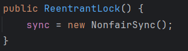

# JUC基础


## 一、`JUC`基础概念

### 1、二并

#### 1.1 并发

一个处理器上交替执行多个任务

#### 1.2 并行

多个处理器上同时执行多个任务。


### 2、三程

#### 2.1 进程

操作系统中的一个应用程序就是一个进程。

#### 2.2 线程

进程中含有多个线程，线程是进程实际的运作单位。


#### 2.3 管程

管程就是同步锁。


### 3、两类线程

#### 3.1 用户线程

用户`new`出来的线程都是用户线程，**用户线程之间彼此独立**，一个用户线程不会因为其他用户线程的结束而结束。

```java
public class TestService {
    public static void main(String[] args) {
        // main线程开始
        System.out.println(Thread.currentThread().getName() + "\tstarted ~~");

        // 启动一个用户线程
        Thread thread = new Thread(() -> {
            System.out.println(Thread.currentThread().getName() + "\tstarted ~~");
            // 用户线程死循环（不终止）
            while (true) {
            }
        });
        thread.start();

        // 主线程结束
        System.out.println(Thread.currentThread().getName() + "\tend ~~");
    }

}
```

| 测试结果                                                     |
| ------------------------------------------------------------ |
|  |

存在`main`和`Thread-0`两个用户线程，当其中的`main`用户线程结束后，`Thread-0`线程仍然执行。进一步说明了用户线程之间彼此独立，一个用户线程的结束不会导致另一个用户线程的结束。


#### 3.2 守护线程

守护线程依附用户线程，**如果用户线程结束了，守护线程也会结束**(不是立即结束)。Java中常见的守护线程就是`GC`垃圾回收处理线程。

> 守护线程相关的两个方法

```java
public static void main(String[] args) {
        Thread thread = new Thread();
    	// 设置线程为守护线程
        thread.setDaemon(true);
   		// 判断线程是不是守护线程
        thread.isDaemon();
}
```


> <font color=red>**注意** 通过`thread.setDaemon(true)`将线程设置为守护线程，必须要要在`thread.start()`之前，否则会报错。</font> 

由源码可知，如果线程启动之后调用`setDaemon`方法就会抛出`IllegalThreadStateException`异常。

|  |
| ------------------------------------------------------------ |


### 8、线程状态

在Java中，线程有以下几种状态，定义在 `Thread.State` 枚举类中。每个状态代表线程生命周期中的一个阶段。它们主要包括：

1. **NEW (新建)**
   
   - 当线程对象被创建时，但还没有调用 `start()` 方法。
   - 线程还没有开始执行，也没有分配 CPU 时间。
   
   ```java
   Thread thread = new Thread();
   // 此时 thread 的状态是 NEW
   ```
   
2. **RUNNABLE (可运行)**
   - 调用 `start()` 方法后，线程进入 RUNNABLE 状态。
   - 线程已经准备好被 CPU 调度，可能正在执行，也可能在等待 CPU 分配时间。
   - 在 Java 虚拟机中，RUNNABLE 状态可能包含操作系统级别的 "Running" 和 "Ready to Run" 两种状态。

   ```java
   thread.start();
   // 线程可能处于 RUNNABLE 状态
   ```

3. **BLOCKED (阻塞)**
   - 当一个线程试图获取一个锁（例如 `synchronized` 块中的对象锁），但该锁被其他线程持有时，它会进入 BLOCKED 状态。
   - 线程会等待其他线程释放锁，只有锁释放后它才能进入 RUNNABLE 状态。

   ```java
   synchronized (object) {
       // 线程可能会进入 BLOCKED 状态，如果其他线程已持有这个锁
   }
   ```

4. **WAITING (无限期等待)**
   - 线程进入 WAITING 状态时，它在等待另一线程执行某一特定操作（如通知或中断）以继续执行。
   - 典型的例子包括 `Object.wait()`、`Thread.join()` 和 `LockSupport.park()`。
   - 这种状态下的线程不会自动恢复，必须依赖外部唤醒机制。

   ```java
   synchronized (object) {
       object.wait(); // 线程进入 WAITING 状态
   }
   ```

5. **TIMED_WAITING (计时等待)**
   
   - 线程在等待某个条件的同时设置了一个超时，例如 `Thread.sleep()`、`Object.wait(long timeout)`、`Thread.join(long millis)` 和 `LockSupport.parkNanos()`。
   - 当超时时间到了，线程会自动从这个状态中恢复并继续执行。
   
   ```java
   Thread.sleep(1000); // 线程进入 TIMED_WAITING 状态
   ```
   
6. **TERMINATED (终止)**
   
   - 线程执行完毕或者因异常终止后进入 TERMINATED 状态。
   - 一旦线程进入该状态，就无法再次启动。
   
   ```java
   thread.run(); // 线程执行完毕后进入 TERMINATED 状态
   ```


> 线程状态转换示意图

```
NEW --> RUNNABLE --> TERMINATED
               ↘
           BLOCKED --> RUNNABLE
               ↘
     WAITING/TIMED_WAITING --> RUNNABLE
```


## 二、`JUC`概念对比

### 1、`wait`/`sleep`/`join`

- `wait`方法是来自`Object`类中，因此所有类的对象中都含有`wait`方法。而`sleep`方法是`Thread`中的一个静态方法。

- `wait`和`sleep`方法均会使当前线程处于`WAITING`或`TIMED_WAITING`状态。

- **`wait`方法需要使用锁对象调用**，因此`wait`方法需要在`synchronized`代码块中使用，。**使用`wait`方法后当前线程会释放锁，使用`sleep`方法后当前线程不会释放锁。**

  如果不使用锁对象去调用的话，就会抛出`java.lang.IllegalMonitorStateException: current thread is not owner`的异常。

  ```java
  public static void main(String[] args) throws InterruptedException {
      Object o = new Object();
      // o只是一个普通对象不是锁对象
      o.wait();
  }
  ```

  |  |
  | ------------------------------------------------------------ |

`join`方法是使当前线程进入`WAITING`或`TIMED_WAITING`状态，只有执行`join`方法的线程执行完毕之后当前线程才可继续运行。**常用于线程的顺序执行**。

```java
public class TestService {

    public static void main(String[] args) throws InterruptedException {
        System.out.println(Thread.currentThread().getName() + "\tstarted ~~");
        Thread main = Thread.currentThread();
        Thread thread = new Thread(() -> {
            System.out.println(Thread.currentThread().getName() + "\tstarted ~~");
        });
        // 开启线程thread
        thread.start();
        System.out.println(Thread.currentThread().getName() + "\tend ~~");
    }
}
```

此时启动线程`thread`后，当前线程即`main`线程继续执行完毕后才会执行`thread`线程。

|  |
| ------------------------------------------------------------ |

如果想让`main`线程等待`thread`线程执行完毕之后在执行，可通过如下代码实现

```java
public class TestService {

    public static void main(String[] args) throws InterruptedException {
        System.out.println(Thread.currentThread().getName() + "\tstarted ~~");
        Thread main = Thread.currentThread();
        Thread thread = new Thread(() -> {
            System.out.println(Thread.currentThread().getName() + "\tstarted ~~");
        });
        // 开启线程thread
        thread.start();
        // 调用join方法让主线程在thread线程运行完毕之后继续执行  
        thread.join();
        System.out.println(Thread.currentThread().getName() + "\tend ~~");
    }
}
```

|  |
| ------------------------------------------------------------ |


### 2、`synchronized`/`lock`

- `synchronized`是`java`中的关键字，而`lock`是`java`中的一个接口。
- `synchronize`加锁和解锁是自动完成的，即便是程序出现了异常，也会自动解锁。而`lock`锁需要手动加锁和解锁，在发生异常之后如果不能正常的处理往往会导致`lock`锁无法释放，进而导致死锁。因此一般解锁代码放在`finally`中，这样可以保证无论`try`中的代码执行成功与否，都可以保证锁的释放。
- 在线程竞争激烈的情况下，`lock`相较于`synchronized`拥有更好的性能。
- `synchonized`和`lock`均属于可重入锁。
- `lock`可以通过`tryLock`方法判断当前线程是否持有锁，而使用`synchronized`无法判断当前线程是否持有锁。

> <font color=red>**Java中可重入锁是指一个线程可以多次获得同一个锁而不会发生死锁的锁机制。**</font>

- `synchronized`示例

  ```java
  // ReentrantLockExample中含有两个普通的同步方法
  class ReentrantLockExample {
  
      public synchronized void methodA() {
          System.out.println("Method A");
          methodB();
      }
  
      public synchronized void methodB() {
          System.out.println("Method B");
      }
  }
  
  // 测试方法
  public class Main {
      public static void main(String[] args) {
          ReentrantLockExample example = new ReentrantLockExample();
          example.methodA();
      }
  }
  ```

  

  `ReentrantLockExample`中含有两个普通的同步方法，两个方法的锁对象都是`this`，其中`methodA`中调用了`methodB`。在使用一个`ReentrantLockExample`对象的前提下当一个线程执行`methodA`后获取到`this`，再执行`methodB`的时候，`methodB`也需要获取锁对象`this`才能执行，而`synchronized`的可重入性使得以获得`this`的线程可以再次获取锁对象`this`并进入`methodB`方法。

- `lock`示例

  ```java
  class ReentrantLockExample {
      private final ReentrantLock lock = new ReentrantLock();
  
      public void methodA() {
          lock.lock();  // 获取锁
          try {
              System.out.println("Method A");
              methodB();  // 再次获取锁
          } finally {
              lock.unlock();  // 确保最终释放锁
          }
      }
  
      public void methodB() {
          lock.lock();  // 获取同一把锁
          try {
              System.out.println("Method B");
          } finally {
              lock.unlock();  // 确保最终释放锁
          }
      }
  }
  
  public class Main {
      public static void main(String[] args) {
          ReentrantLockExample example = new ReentrantLockExample();
          example.methodA();  // Method A 和 Method B 都将执行
      }
  }
  ```

  `methodA()`和`methodB()`都使用了`ReentrantLock`锁定。由于`ReentrantLock`是可重入的，线程可以在`methodA()`中再次进入`methodB()`，而不会发生阻塞或死锁。
  
  需要注意的使用`lock`加锁多少次就要解锁多少次。


### 3、普通同步方法/静态同步方法/同步代码块

**`Synchronized`修饰的普通方法就是普通同步方法，修饰静态方法就是静态同步方法**

- 普通同步方法

  ```java
  public synchronized void add() {
          
  }
  ```

- 静态同步方法

  ```java
  public synchronized static void add() {
       
  }
  ```
  
  普通同步方法的锁对象是`this`，静态同步方法的锁对象是`class`对象。
  
  由于普通同步方法的锁对象是`this`，因此只有使用同一个对象调用普通同步方法才会生效。而静态同步方法的锁对象是`class`，所以类的任何对象调用静态同步方法均会生效。
  
  > <font color=red>**Java中每个类在 JVM 中只有一个对应的 `Class` 对象。**</font>
  
- 静态代码块

  ```java
  synchronized () {
       
  }
  ```

  静态代码块中的锁对象就是`synchronized()`中手动指定的对象。


### 4、公平锁/非公平锁

**概念**

- 公平锁

  **每个线程获取公平锁的顺序按照线程请求锁的顺序**，遵循先来后到原则。

  比方说现在有A，B，C三个线程，如果B线程首先获取到公平锁，之后A线程首先请求获取锁，但是锁被B线程持有，因此A线程进入阻塞状态，最后C线程也请求锁，锁仍被B线程持有，因此C也会进入阻塞状态。当B线程执行完毕释放锁之后，那么A线程必然比C线程先获取到锁，因为对于公平锁来说先请求获取锁的线程会在锁释放之后先获取到锁。

  **公平锁实现按线程请求顺序分配锁，是通过维护一个等待队列实现的**。等待获取锁的线程会被依次添加到等待队列中，当锁被释放之后，按照等待队列中的顺序依次获取锁。

- 非公平锁

  **每个线程获取非公平锁的顺序是随机的**，当持有锁的线程释放锁之后，其他所有请求该锁的线程都会竞争获取锁，最终获取锁的结果是不可预测的。


**优缺点**

公平锁按线程请求锁的顺序分配锁，相对来说线程公平，相较于非公平锁来说减少了线程饥饿的发生（线程饥饿：小部分线程做了绝大部分的工作，让大多数线程没工作可做）。

公平锁为了实现按线程请求锁的顺序分配锁而维护的等待队列，使得其性能相较于非公平锁有所降低。


**案例**

Java中的`synchronized`和`ReentrantLock`默认都是非公平锁。

一般在使用`Lock lock = new ReentrantLock();`默认创建的就是非公平锁。

| 由`ReentrantLock()`源码可知，使用无参构造创建的是非公平锁    |
| ------------------------------------------------------------ |
|  |

`ReentrantLock`提供另一个有参构造`ReentrantLock(boolean fair)`，可以通过参数`fair`控制创建的是公平锁还是非公平锁。

|  |
| ------------------------------------------------------------ |


## 三、`JUC`使用注意

### 1、`wait`虚假唤醒

> `wait`的两大特点
>
> - 调用`wait`方法，当前线程会释放锁并处于`等待`状态
> - 当处于`等待`的线程被唤醒之后，线程会在`wait`处继续往下执行（即从哪里睡，从哪里醒）

<font color=pink>**虚假唤醒** 是线程在没有被 `notify()` 或 `notifyAll()` 唤醒的情况下，意外地退出 `wait()` 状态的现象。为了处理虚假唤醒，应该始终将 `wait()` 放在一个循环中，用 `while` 循环反复检查条件是否满足，可以确保线程在正确的条件下继续执行，从而避免因虚假唤醒而引发的问题。</font>

> <font color=red>**`wait()`方法不推荐和`if`组合使用，推荐和`while`等循环语句一起使用。**</font>

如下示例是`wait()`和`if`组合使用，当不满足条件当前线程会进入`wait`状态。当发生虚假唤醒之后，线程从`wait`的地方继续往下执行，这样就出现了即便不满足条件`!condition`也往下执行的现象。

```java
synchronized (lock) {
    // 使用if
    if (!condition) {  
        lock.wait();
    }
}
```

使用`while`之后，即便发生虚假唤醒，也会去循环的判断是否满足条件，不满足便会继续`wait`。

```java
synchronized (lock) {
    // 使用while
    while (!condition) {  
        lock.wait();
    }
}
```


### 2、`ArrayList`线程不安全

> 多线程操作`List`集合可能出现的问题：
>
> - 多个线程同时对`List`进行修改和迭代操作可能抛出`ConcurrentModificationException`
> - 

#### 2.1 **问题说明**

- **针对情况1**：以`ArrayList`为例，`ArrayList`中含有一个`modCount`成员变量，每次`add`元素的时候都会`+1`

  |  |
  | ------------------------------------------------------------ |

  而遍历`ArrayList`集合会调用`ArrayList`中内部类`Itr`的`next`方法。在`next`方法中含有成员`expectedModCount`，每次进行遍历的时候`expectedModCount`的值就是当时集合的`modCount`。

  |  |
  | ------------------------------------------------------------ |

  `next`方法中首先会通过`checkForComodification`方法校验`expectedModCount`和`modCount`的值是否一致，不一致就会抛出`ConcurrentModificationException`异常。

  |  |
  | ------------------------------------------------------------ |
  |  |

  会在此抛出异常的情况就是当进行遍历刚要执行`checkForComodification`的时候，此时`modCount = expectedModCount`，但是此时线程的执行权被添加集合元素的线程抢走，使得`modCount ++`，之后遍历的线程再次获得执行权后导致`modCount = expectedModCount`不一致，从而抛出异常。


#### 2.2 **问题解决**

##### 2.2.1 `vector`

**不推荐使用**

`Vector`也是`List`集合的实现类并且线程安全。

```java
// 创建Vector集合
List<String> list = new Vector<>();
```

`Vector`的`add`方法被`synchronized`修饰，所以线程安全。

|  |
| ------------------------------------------------------------ |


##### 2.2.2 `Collections.synchronizedList`

**不推荐使用**

```java
// 通过使用Collections.synchronizedList获取线程安全的集合
List<String> list = new ArrayList<>();
List<String> syncList = Collections.synchronizedList(list);
```


##### 2.2.3 `CopyOnWriteArrayList`

**推荐**

`CopyOnWriteArrayList`也是`List`集合的实现类并且线程安全。

```java
// 创建CopyOnWriteArrayList集合
List<String> list = new CopyOnWriteArrayList<>();
```

**工作原理**

|  |
| ------------------------------------------------------------ |

向`CopyOnWriteArrayList`集合中写入数据前，会先复制一份之前的集合

|  |
| ------------------------------------------------------------ |

然后向新集合中添加新的元素

|  |
| ------------------------------------------------------------ |

最后用新集合覆盖旧的集合

|  |
| ------------------------------------------------------------ |

在这个过程中通过`synchronized`锁解决线程安全问题。


### 3、`HashSet`线程不安全

`HashSet`并发读写时也会出现`ConcujrrentModificationException`异常。

**解决方法**

```java
// 使用CopyOnWriteArraySet集合
Set<String> list = new CopyOnWriteArraySet集合<>();
```


### 4、`HashMap`线程不安全

`HashMap`并发读写时也会出现`ConcujrrentModificationException`异常。

**解决方法**

```java
// 使用ConcurrentHashMap集合
ConcurrentHashMap<Object, Object> objectObjectConcurrentHashMap = new ConcurrentHashMap<>();
```


### 5、`a++`线程不安全

> <font color=red>多线程之间共享堆内存，每个线程的栈内存是独立的。</font>

`a++`操作实际上在底层并不是原子性的，它可以分成三步执行：线程从堆内存中读取变量值到栈内存中，然后在栈内存中完成`+1`，最后去修改堆内存中的数据。由于这三步不是原子性的，因此执行任何一步的时候CPU的使用权都有可能会被其他线程抢走。

比方说现在堆内存中存在一个变量`a=100`，现在存在两个线程对a执行`a++`，此时就有可能出现如下的情况：线程1先从堆中取出`a=100`，然后在栈内存中完成`a++`，此时`a=101`，然后在线程1将`a=101`保存至堆内存之前，线程1的执行权被线程2抢走，线程2也会从堆内存中获取a的值，由于线程1并没有完成对堆内存的修改，因此线程2获取到的值仍然是`a=100`，此时线程2完成`a++`后`a=101`，之后不论线程1还是线程2去修改堆内存，最终的结果都是`a=101`，也就是对a进行了两次`a++`后结果是101，出现了线程不安全问题。

```java
// 上述过程代码描述

// 1. 读取变量 a 的当前值
int temp = a; 
// 2. 对 a 进行加 1 操作
temp = temp + 1; 
// 3. 将新值写回 a
a = temp; 
```


**解决方法**：

使用原子类进行`a++`的操作。

```java
AtomicInteger i = new AtomicInteger(1);
int r = i.addAndGet(1);
```

**实现原理**：

使用乐观锁的原理实现`a++`的原子性。两个线程同时进行`a++`的时候每个线程从堆内存中获取数据的时候会记录数据获取的初始值，在栈内存中完成数据操作然后去堆内存中修改数据之前，先判断现在堆内存中的数据和线程获取数据时记录的初始值是否相等，如果不等就说明堆中的数据已经被其他的线程修改过了，此时当前线程的修改就不会成功，而是重新从堆中拉去一份数据继续上述操作，直到在修改堆内存数据的时候，堆内存中的数据和线程记录的数据的初始值一样的时候才会成功修改。


### 6、死锁问题

**死锁产生原因**

死锁主要是由于锁的嵌套使用导致的。

多个线程之间的互相等待构成死锁。比方说存在两个线程A和B，A线程等待B线程的结束A才会结束，而B线程等待A线程的结束B才会结束，最终的结果就是A和B谁都结束不了了。


**死锁案例**

```java
public class TestService {
    // 两个锁对象a和b
    final static Object a = new Object();
    final static Object b = new Object();

    public static void main(String[] args) {
        // 线程AA
        new Thread(() -> {
            synchronized (a) {
                // 线程AA wait 1000ms
                try {
                    Thread.sleep(1000);
                } catch (InterruptedException e) {
                    throw new RuntimeException(e);
                }
                
                synchronized (b) {

                }
                System.out.println("线程AA执行完毕");
            }
        }, "AA").start();

        // 线程BB
        new Thread(() -> {
            synchronized (b) {
                synchronized (a) {

                }
                System.out.println("线程BB执行完毕");
            }
        }, "BB").start();
    }
}
```


**死锁判断**

通过JDK提供的`jps`和`jstack`两个工具来判断。

| 两个工具来自JDK的bin目录下                                   |
| ------------------------------------------------------------ |
|  |

使用步骤

1. 通过`jps`获取正常运行的Java程序及其占用的端口。该命令类似linux中的`ps -ef`

   |  |
   | ------------------------------------------------------------ |

   

2. 通过`jstack 端口`检查是否死锁

   |  |
   | ------------------------------------------------------------ |
   |  |


## 四、`JUC`常见使用

### 1、线程通信

#### 1.1 `synchronized`

**在`synchronized`中使用锁对象的`wait()`，`notify()`，`notifyAll()`等方法进行线程通信**。

- `wait()`：持有调用`wait`方法的锁对象的线程进入`WAIT`状态并释放锁。
- `notify()`：绑定在当前锁对象下的所有线程，随机一个进入`RUNNABEL`状态
- `notifyAll()`：绑定在当前锁对象下的所有线程，所有线程都会进入`RUNNABEL`状态


**生产者消费者 示例代码**

```java
public class TestService {

    // 内部类
    class sycnInner {
        // 线程公共参数
        private int num = 0;

        // 生产者方法:锁对象为this
        public synchronized void add() throws InterruptedException {
            while (num != 0) {
                this.wait();
            }
            num++;
            System.out.println(Thread.currentThread().getName() + "::" + num);
            this.notifyAll();
        }

        // 消费者方法：锁对象为this
        public synchronized void sub() throws InterruptedException {
            while (num == 0) {
                this.wait();
            }
            num--;
            System.out.println(Thread.currentThread().getName() + "::" + num);
            this.notifyAll();
        }
    }

    public static void main(String[] args) {
        // 创建唯一的线程共享变量
        sycnInner sycnInner = new TestService().new sycnInner();
        // 开启10个生产者线程
        for (int i = 0; i < 10; i++) {
            new Thread(() -> {
                try {
                    sycnInner.add();
                } catch (InterruptedException e) {
                    e.printStackTrace();
                }
            },"producer").start();
        }
        // 开启10个消费者线程
        for (int i = 0; i < 10; i++) {
            new Thread(() -> {
                try {
                    sycnInner.sub();
                } catch (InterruptedException e) {
                    e.printStackTrace();
                }
            },"consumer").start();
        }
    }
}
```


**使用注意**

上述情况一定要使用`notifyAll`，如果使用`notify`可能出现死锁现象。

比方说下面这种情况，其中一个生产者线程执行使得`num=1`，然后`notify`，此时没有一个线程处于等待状态，相当于无效执行。然后剩余的9个生产者线程执行的话那么9个线程都会进入等待状态，因为`num`此时不等于0。当有一个消费者线程执行后`num=0`，然后通过`notify`唤醒一个线程，此时只有9个生产者线程，也就是说此时会随机唤醒一个生产者线程，唤醒的生产者还没来得及执行(生产者线程处于可运行状态)，剩余的9个消费者线程都执行完毕，由于此时`num=0`所以9个消费者线程均会处于等待状态。当被唤醒的那一个生产者线程执行完毕之后（此时`num=1`），也会执行`notify`随机唤醒一个线程。唤醒的线程如果是一个消费者线程，那么由于`num=1`那么可以被唤醒成功，但是如果随机唤醒的一个线程是一个生产者线程，而由于此时`num=1`所以会继续`wait()`，此时再也不能唤醒其他线程，此时程序进入死锁。


#### 1.2 `lock`

**在`lock`中使用`newCondition()`方法可以获取条件对象`Condition`。使用条件对象的`await()`，`signal()`，`signalAll()`等方法进行线程通信**。

- `await()`：持有当前锁对象的线程进入`WAIT`状态并释放锁。
- `signal()`：唤醒使用相同`Condition`对象进入等待状态的随机一个线程
- `signalAll()`：唤醒使用相同`Condition`对象进入等待状态的所有线程

```java
// 使用代码
Lock lock = new ReentrantLock();

Condition c1 = lock.newCondition();
Condition c2 = lock.newCondition();

c1.await();
// c1唤醒只能唤醒c1.await()
c1.signal();

c2.await();
// c1唤醒只能唤醒c2.await()
c2.signal();
```


**生产者消费者 示例代码**

```java
public class TestService {
    class sycnInner {
        private int num = 0;
        private final Lock lock = new ReentrantLock();
        Condition c1 = lock.newCondition();
        Condition c2 = lock.newCondition();

        // 生产者
        public void add() throws InterruptedException {
            lock.lock();
            try {
                while (num != 0) {
                    c1.await();
                }
                num++;
                System.out.println(Thread.currentThread().getName() + "::" + num);
                c2.signalAll();
            } finally {
                lock.unlock();
            }
        }

        // 消费者
        public void sub() throws InterruptedException {
            lock.lock();
            try {
                while (num == 0) {
                    c2.await();
                }
                num--;
                System.out.println(Thread.currentThread().getName() + "::" + num);
                c1.signalAll();
            } finally {
                lock.unlock();
            }
        }
    }

    public static void main(String[] args) {
        sycnInner sycnInner = new TestService().new sycnInner();
        for (int i = 0; i < 10; i++) {
            new Thread(() -> {
                try {
                    sycnInner.add();
                } catch (InterruptedException e) {
                    e.printStackTrace();
                }
            }, "producer").start();
        }

        for (int i = 0; i < 10; i++) {
            new Thread(() -> {
                try {
                    sycnInner.sub();
                } catch (InterruptedException e) {
                    e.printStackTrace();
                }
            }, "consumer").start();
        }
    }
}
```


### 2、线程创建

#### 2.1 `Thread`

**创建线程**

创建自定义类继承`Thread`，重写`run`方法。（不推荐，因此Java中类单继承，继承机会比较珍贵）


#### 2.2 `Runnable`

**创建线程**

通过`Thread`接收`Runnable`实现类对象或者匿名内部类，创建线程对象。

```java
// 指定线程名
public static void main(String[] args) {
	new Thread(() -> {}).start();
}
```

```java
// 不指定线程名
public static void main(String[] args) {
	new Thread(() -> {},"线程名").start();
}
```


#### 2.3 `Callable`

**创建线程**

同样使用`Thread`接收`Runnale`接口的实现类对象或者匿名内部类的方法。其中`Runnable`存在一个实现类`FutureTask`，可以接收`Callable`接口的匿名内部类。通过使用`FutureTask`就可以将`Runnale`和`Callable`连接起来，创建线程对象。

```java
public static void main(String[] args) {
    // 创建Callable匿名内部类
    Callable<String> call = () -> "123";
    // 使用Runnale实现类FutureTask接口Callable匿名内部类
    FutureTask<String> task = new FutureTask<>(call);
    // 使用Runnale创建线程对象
    new Thread(task).start();
}
```


使用`FutureTask`创建的线程可以获取线程执行的结果，通过`futureTask.get()`方法可以获取线程执行的结果。但是需要注意的是使用`futureTask.get()`会使当前线程阻塞直到`FutureTask`创建的线程执行完毕返回结果。因此调用`start()`方法必须要在`get()`方法之前。

此外可以通过`futureTask.isDone()`方法判断`FutureTask`线程是否执行完毕。


#### 2.4 线程池


### 3、线程辅助类

#### 3.1 `CountDownLatch`

**CountDownLatch的作用就是设定一个计数值，可以使用CountDownLatch让线程进入等待状态，如果等待期间计数值变成 0，那么因为CountDownLatch而被阻塞的线程就会自动被唤醒。**


**常用方法**

- `countDownLatch.await()`

  使当前线程进入等待状态

- `countDownLatch.getCount()`

  获取当前计数值

- `countDownLatch.countDown()`

  使当前计数值减一

- `new CountDownLatch(n);`

  创建一个指定计数值的`CountDownLatch`对象

  <font color=pink>注意：如果创建的是一个计数值为0的`CountDownLatch`对象，那么使用`await()`方法是无效的。</font>


**使用案例**

```java
public static void main(String[] args) throws InterruptedException {
    // 创建计数值为3的CountDownLatch
    CountDownLatch countDownLatch = new CountDownLatch(3);
    
    // 创建3个线程，每个线程执行完毕之后都会将CountDownLatch的计数值减一
    for (int i = 0; i < 3; i++) {
        new Thread(() -> {
            System.out.println(Thread.currentThread().getName() + "执行完毕");
            countDownLatch.countDown();
        }, "任务" + String.valueOf(i)).start();
    }
    
    // 通过CountDownLatch使主线程进入等待状态
    countDownLatch.await();
    System.out.println("主任务执行完毕");
}
```


#### 3.2 `CyclicBarrier`

 `CyclicBarrier`的作用等待指定数量的线程执行`cyclicBarrier.await()`后，执行`cyclicBarrier`的自定义逻辑。

**常用方法**

- `new CyclicBarrier(int num,Runnale runnable)`

  `CyclicBarrier`的一个构造方法。

  以`CyclicBarrier cyclicBarrier = new CyclicBarrier(7, () -> System.out.println("hello"));`为例：它的意思就是如果`cyclicBarrier.await()`被其他任何线程调用7次的话，就会执行自定义逻辑`System.out.println("hello")`

- `await()`


**使用案例**

- 执行指定数量的`cyclicBarrier.await()`的示例

  ```java
  public class TestService {
  
      public static void main(String[] args) throws InterruptedException {
          // 创建次数为7的CyclicBarrier对象
          CyclicBarrier cyclicBarrier = new CyclicBarrier(7, () -> System.out.println("cyclicBarrier over ~~"));
  
          // 创建7个线程，每个线程执行完毕之后都会使用cyclicBarrier.await()
          for (int i = 1; i <= 7; i++) {
              new Thread(() -> {
                  try {
                      System.out.println(Thread.currentThread().getName());
                      cyclicBarrier.await();
                  } catch (Exception e) {
                      e.printStackTrace();
                  }
              }, String.valueOf(i)).start();
          }
      }
  }
  ```

  | 结果：`CyclicBarrier`创建的线程达到等待的次数后就会执行自定义逻辑。 |
  | ------------------------------------------------------------ |
  |  |

- 执行不足指定数量的`cyclicBarrier.await()`的示例

  ```java
  public class TestService {
  
      public static void main(String[] args) throws InterruptedException {
          // 创建次数为7的CyclicBarrier对象
          CyclicBarrier cyclicBarrier = new CyclicBarrier(7, () -> System.out.println("cyclicBarrier over ~~"));
  
          // 创建6个线程，每个线程执行完毕之后都会使用cyclicBarrier.await()
          for (int i = 1; i <= 6; i++) {
              new Thread(() -> {
                  try {
                      System.out.println(Thread.currentThread().getName());
                      cyclicBarrier.await();
                  } catch (Exception e) {
                      e.printStackTrace();
                  }
              }, String.valueOf(i)).start();
          }
      }
  }
  ```

  | 结果：`CyclicBarrier`创建的线程如果没有达到等待的次数那么就会一直等待。 |
  | ------------------------------------------------------------ |
  |  |


#### 3.3 `Semaphore`

`Semaphore`的作用可以类比`Lock`接口，只不过`Lock`接口只允许一个线程通过锁住的代码块，而`Semaphore`可以允许多个线程通过锁定的代码块（通过提供一个许可证数量的构造参数）。


**常用方法**

- `new Semaphore(n)`：`n`为`int`类型，代表可以提供`n`个许可证。
- `acquire()`：当前线程尝试获取许可，如果正常获取那么执行锁定的代码块，如果未能获取许可则线程阻塞。当其他线程执行完成释放许可后，被阻塞的线程可继续获取许可，以解除阻塞。
- `release()`：释放许可。


**使用案例**

- `Lock`锁

  ```java
  public class TestService {
      // Lock锁
      private static final Lock lock = new ReentrantLock();
  
      public static void main(String[] args) throws InterruptedException {
          // 创建6个线程执行锁定代码块
          for (int i = 1; i <= 6; i++) {
              new Thread(() -> {
                  test();
              },String.valueOf(i)).start();
          }
      }
  
      // 锁住代码块
      private static void test(){
          try {
              // lock加锁
              lock.lock();
              System.out.println(DateUtil.now() +" "+Thread.currentThread().getName() + " doing ~~");
              // 锁住内容执行时长
              Thread.sleep(3000);
          } catch (Exception e) {
              e.printStackTrace();
          } finally {
              // lock解锁
              lock.unlock();
          }
      }
  }
  ```

  | 结果：每3秒执行一次锁住的代码块，说明`Lock`锁锁住的代码块同时只允许一个线程进入。 |
  | ------------------------------------------------------------ |
  |  |

  

- `Semaphore`锁

  ```java
  public class TestService {
      // Semaphore锁：提供3个许可证
      private static final Semaphore semaphore = new Semaphore(3);
  
      public static void main(String[] args) throws InterruptedException {
          // 创建6个线程执行被锁住的代码块
          for (int i = 1; i <= 6; i++) {
              new Thread(() -> {
                  test();
              },String.valueOf(i)).start();
          }
      }
  
      // 使用Semaphore锁锁住的代码块
      private static void test(){
          try {
              // 尝试获取许可
              semaphore.acquire();
              System.out.println(DateUtil.now() +" "+Thread.currentThread().getName() + " doing ~~");
              // 锁住内容执行时长
              Thread.sleep(3000);
          } catch (Exception e) {
              e.printStackTrace();
          } finally {
              // 释放许可
              semaphore.release();
          }
      }
  }
  ```

  | 结果：一开始`4 2 1`三个线程获取到许可执行被锁定内容，由于只提供三个许可证因此`3 5 6`无法获取许可而陷入阻塞。3秒后释放许可后另外的三个线程获取许可才得以执行。 |
  | ------------------------------------------------------------ |
  |  |


### 4、
