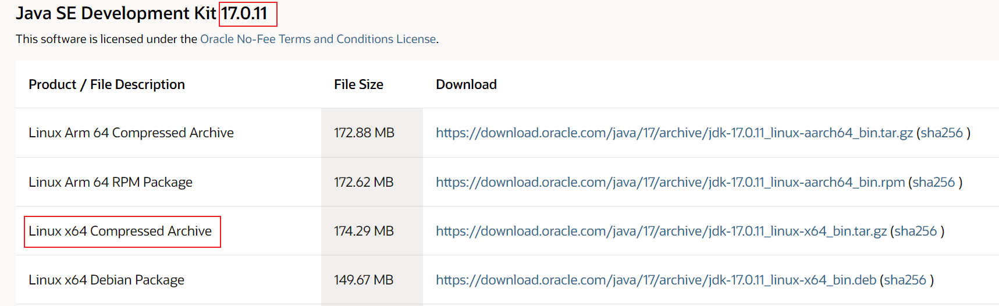
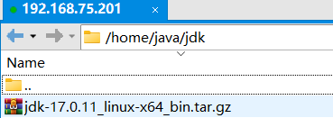
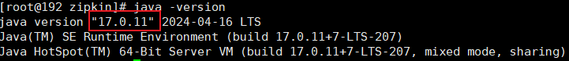
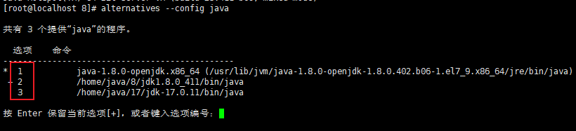
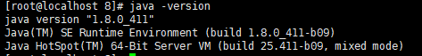

# Java 安装

## 一、`Linux`

### 1、`Jdk17`

参考地址：https://www.cnblogs.com/chaosmoor/p/15897693.html

- 下载`jdk`

  网址：https://www.oracle.com/java/technologies/javase/jdk17-archive-downloads.html

  |  |
  | ------------------------------------------------------------ |

  

- 上传`jdk`至`linux`

  |  |
  | ------------------------------------------------------------ |

  

- 解压`jdk`

  ```shell
  # 将`/home/java/jdk/jdk-17.0.11_linux-x64_bin.tar.gz`解压到`/home/java/jdk`
  tar -xzvf /home/java/jdk/jdk-17.0.11_linux-x64_bin.tar.gz -C /home/java/jdk
  ```

  

- 配置环境变量

  ```shell
  vi /etc/profile
  ```

  添加如下内容（去掉注释）

  ```shell
  # jdk解压路径
  export JAVA_HOME=/home/java/jdk/jdk-17.0.11
  export PATH=$PATH:$JAVA_HOME/bin;
  export CLASSPATH=.:$JAVA_HOME/lib/dt.jar:$JAVA_HOME/lib/tools.jar;
  ```

  

- 刷新环境变量

  ```shell
  source /etc/profile
  ```

  

- 测试安装

  ```shell
  java -version
  ```

  | 出现版本号代表安装成功                                       |
  | ------------------------------------------------------------ |
  |  |


### `Linux`多版本`JDK`选取

参考：https://lenjor.github.io/2020/12/Linux-Java-JDK-install/

- 安装多个版本的`JDK`

- 将多个`JDK`添加至`JDK`选择目录

  ```shell
  # 添加JDK8至JDK选择目录
  alternatives --install /usr/bin/java java /home/java/8/jdk1.8.0_411/bin/java 1
  # 添加JDK17至JDK选择目录
  alternatives --install /usr/bin/java java /home/java/17/jdk-17.0.11/bin/java 2
  ```

- 切换版本

  ```shell
  alternatives --config java
  ```

  |  |
  | ------------------------------------------------------------ |

- 查询切换结果

  ```shell
  java -version
  ```

  |  |
  | ------------------------------------------------------------ |


## 二、`Windows`