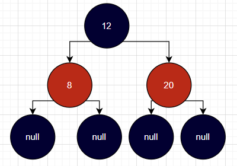
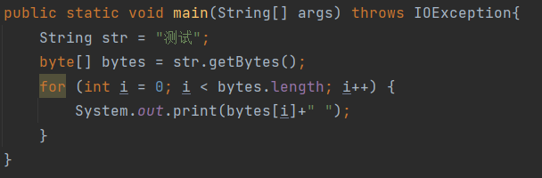
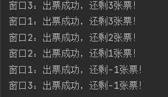

# Java 笔记

## 一、JAVA基础

### 1、Java的三个版本

```
（1）JavaSE
	a、java标准版
	b、主要用于桌面应用的开发
	c、JavaSE是学习JavaEE的基础
（2）JavaME
	a、java小型版
	b、几乎不使用（手机应用开发，被安卓和ios所取代）
（3）JavaEE
	a、Java企业版
	b、主要用于web网站开发（网站=网页+服务器）
```

### 2、Java的跨平台

```
（1）Java语言可以在不做修改的基础上在任何平台上运行
（2）Java的跨平台，平台指的就是操作系统，Java可以跨平台指的就是Java语言可以在不做修改的情况下在任何操作系统上运行
（3）Java实现跨平台的根本就是JVM，不同的操作系统安装与操作系统对应的JVM就可以将Java语言翻译成不同系统能够看懂的语言
（4）可以跨平台的是Java程序，而不是JVM。JVM不可以跨平台，不同操作系统需要不同的JVM
（5）Java程序的执行是先被Java虚拟机编译成class字节码文件，class字节码文件与平台无关，最后由与平台相关JVM将class字节码文件解释成平台能够看到的语言执行
（6）class字节码文件是一种与操作系统无关的中间文件，v是一个二进制文件。操作系统和程序员均看不懂
```

### 3、JRE,JDK,JVM

```
JRE：Java运行环境
JDK：Java开发工具包
JVM：Java虚拟机
```

| 三者之间的关系                                               |
| ------------------------------------------------------------ |
|  |
| 1、JRE = JVM+核心类库<br />···JVM包含了class字节码文件的解释器，所以说想要执行Java文件必须要至少要安装JRE<br />···核心类库就是Java的一些基础类比方说Object，Exception等，Java程序的书写和运行依赖这些类<br /><br />2、JDK = JRE + 开发工具<br />···开发工具，比方说javac编译器，开发过程中编译是必不可少的 |

### 4、Java的内存分配

| 区域       | 描述                                                         |
| ---------- | ------------------------------------------------------------ |
| 栈内存     | ···方法被调用后会被加载进栈内存，调用结束弹栈。<br />···由于局部变量存在在方法中，所以局部变量也是存在在栈内存当中的<br />···存在main方法的话，程序执行后main方法会自动被加载进栈中 |
| 堆内存     | ···new出来的对象存在在堆内存中<br />···方法中的成员变量new之后，数据实际存储的位置在堆内存中，栈内存中只存储堆内存的地址 |
| 方法区     | ···class字节码文件加载所进入的区域                           |
| 本地方法栈 | ···操作操作系统相关资源                                      |
| 寄存器     | ···交给cpu去使用                                             |


## 二、Java基础语法

### 1、注释

```
（1）单行注释：//
（2）多行注释：/* */
（3）文档注释：/** */
```

### 2、关键字

```
定义：
	Java内部定义好的标识符就是关键字
```

```
注意：
	（1）自定义的标识符不能是关键字
	（2）main不属于关键字，因为main是方法名，所有的方法名都不是关键字
```

### 3、标识符

```
规则：
	（1）区分大小写
	（2）开头不能是数字
	（3）开头可以是字母,$,下划线
	（4）标识符的组成字符可以是数字，字母，$，下划线
	（5）标识符不可以是关键字
	（6）一般采用驼峰命名法（只是规范，不遵循也不会报错）
```

### 4、八种基本数据类型

| 类型    | 大小（字节） | 默认值 |
| ------- | ------------ | ------ |
| byte    | 1            | 0      |
| short   | 2            | 0      |
| int     | 4            | 0      |
| long    | 8            | 0L     |
| float   | 4            | 0      |
| double  | 8            | 0      |
| boolean | 0（仅占1位） | false  |
| char    | 2            | ''     |

```
注意：
	（1）所有的整数类型默认为int类型
	（2）所有的浮点类型默认为double
```


#### `BigInteger`

当整数的大小超过`long`，可以使用`BigInteger`类型，`BigInteger`使用一个`int[]`数组存放数据，因此在数据运算上效率较低。

```java
public class T1 {
    public static void main(String[] args) {
        BigInteger a = 
            new BigInteger("1000000000000000000000000000000000000000000000000000");
        BigInteger add = a.add(new BigInteger("1"));
        
        // BigInteger运算结果：1000000000000000000000000000000000000000000000000001
        System.out.println(add);
    }
}
```


#### 原码、反码、补码

<font color=red>计算机中所有数据都是以补码的形存储的，首位0代表正数、1代表负数</font>

（1）原码

忽略数字的正负号，将数字转化成二进制，然后如果是正数首位置0，如果是负数首位置1

3：0000-0011

-3：1000-0011

（2）反码

正数的反码=本身，3：0000-0011

负数的反码=符号位不变+其他位取反，-3：1111-1100

（3）补码

正数的补码=本身，3：0000-0011

负数的补码=反码+1，-3：1111-1101

> byte取值-128~127的由来

byte为1B，1B=8b。

（1）最大值：0111-1111

由于计算机中所有的数据都是以补码的形式存储的，所以0111-1111其实是补码。首位为0，所以这是一个正数，而正数的补码=原码，所以0111-1111的原码也是0111-1111，结果为127

（2）最小值：1111-1111

由于计算机中所有的数据都是以补码的形式存储的，所以1111-1111其实是补码。首位为1，所以是一个负数，而负数的原码=反码取反(除符号位)，反码=补码-1。所以反码=1111-1111减1，结果为1111-1110，原码为1111-1110取反，结果为1000-0001，结果为2^7+1 = 128


### 5、类型转换

#### （1）隐式类型转换

```
取值范围小的赋值给取值范围大的，自动进行类型转换
```

<font color='red'>注意：byte，short，char这三种类型的数据在进行运算的时候会变成int类型来进行运算，最终结果也是int类型</font>

#### （2）显式类型转换

```
取值范围大的赋值给取值范围小的，需要强制类型转换
```

```
强制类型转换：
	例子：Integer i = (Integer) 1.0;
```

### 6、常量转化机制

```
（1）Java中常量的运算在编译的时候会自动的进行运算，比方说 int i = 1+2; 在编译的时候会自动的将1和2相加，实际上就是int i = 3;
（2）Java中常量进行赋值的时候会先根据类型判断常量是否在该类型的取值范围之内，如果在的话直接赋值，否则属于大转小，需要进行强制类型转化。
（3）Java中所有的整数型常量默认为int类型，所有的浮点型常量都默认为double类型
```

### 7、运算符

#### （1）算数运算符

```
a、+ （加）
b、- （减）
c、* （乘）
d、/ （除）
	注意：除号/两边都是整数，那么结果也是整数；如果两边只要有一边是小数，那么结果也是小数
e、% （取余）
	注意：结果是余数，如果%两边有一边是小数，那么结果就是小数，比方说 10%2结果为0，但是10%2.0结果为0.0
```

#### （2）自增自减运算符

```
a、i++相当于i=i+1; i--相当于i=i-1;
b、使用顺序问题：i++：i在前则先使用i再进行++；++i：i在后则先++后使用i。--的话和++同理
```

#### （3）赋值运算符

```
a、=
b、+=
c、-=
d、/=
e、%=
```

```
***注意***

== 和 equals 的区别？
a、== 如果比较基本数据类型，比较的是值的大小
b、== 如果比较引用数据类型，比较的是两个对象的地址值
c、equals的话，所有类中的equals都继承自Object，而Object中的equals比较的是地址值
d、equals由于是对象的方法，所以可以在子类中进行重写，而重写过后的equals方法就可以做到比较属性值，比方说String类型，默认重写
```

#### （4）比较运算符

```
a、>
b、>=
c、<
d、<=
e、==
```

#### （5）逻辑运算符

```
a、!：非（取反）
b、&：逻辑与（&连接的两边都会完全执行完毕）
c、&&：短路与（&&连接的左边为false，则右边不会执行直接false）
d、|：逻辑或（|连接的两边都会完全执行完毕）
e、||：短路或（||连接的左边为true，则右边不会执行直接true）
f、^：异或（位运算每位比较不一样为1，否则为0）（任何数和0异或结果都是其本身，任何数和它本身异或结果都是0）
```

<font color=red>注意：Java中位运算只能用于整数或者字符型数据</font>

#### （6）三元运算符

```
格式：表达式? 表达式1:表达式2;

执行：表达式为true执行表达式1，否则执行表达式2
```

### 8、流程控制

#### （1）条件判断

###### a、if

```
a、格式1
if(表达式){

}

b、格式2
if(表达式){

}else{

}

c、格式3
if(表达式){

}else if(表达式){

}else if(表达式){

}else{

}
```

###### b、switch

```
***格式***

switch (值){
    case 值1:
        语句1
        break;
    case 值2:
        语句2
        break;
    ...
    default:
        语句n
}
```

```
***注意***

a、switch中的数据类型可以为：整数（byte，short，int），String，char，枚举
b、switch后面的值与下面的每个case后的值进行比较，如果成功匹配就执行case后面的语句
c、case后面的语句可以有多条，不仅只可以为一条
d、break的作用就是跳出整个switch，如果不加的话，会从上到下将所有的case后的语句全执行一遍，不论是否匹配
	switch这种穿透的特性可以加以利用用来优化代码，比方说：
	switch(i){
		case 1:
		case 2:
		case 3:
			sout(123);
		case 4:
			sout(4);
	}
	上面的例子就说明当i=1/2/3的时候执行同一个语句，而不需要在每一个case后面都加一条相同的语句
e、default的作用就是如果没有和switch后面的值相匹配的case就会执行default后的语句。
f、default可写可不写
g、case后面只能跟常量，而不能是变量。
h、多个case后面的常量不能重复
```

#### （2）循环结构

###### a、while

```
***格式***

while(表达式){
	循环体
}
```

```
***注意***

a、表达式为true则执行循环体，表达式为false跳出循环
```

###### b、do-while

```
***格式***

do{
	循环体
}while(表达式);
```

```
***注意***

b、do-while循环必定执行一次循环体，当满足while中的表达式为true继续执行，否则跳出循环
```

###### c、for

```
***格式***

for(初始化语句; 条件判断语句; 条件控制语句){
	循环体
}
```

```
***注意***

a、初始化语句在一次for循环中只执行一次。条件判断语句，条件控制语句，循环体会被执行多次
b、break和continue
	·break是跳出整个循环
	·continue是跳过循环中的某一次
```


## 三、数组

<font color=red>数组在内存中是连续存储的</font>

### 1、一维数组

#### （1）数组定义

```
（1）格式1
String[] arr;

（2）格式2
String arr[];
```

#### （2）数组初始化

```
（1）格式1
String[] arr = new String[10];

（2）格式2
String[] arr = {};

（3）格式3
String[] arr = new String[]{"1","2"};
注意：使用这种初始化方法则不能指定数组长度
```

#### （3）数组元素默认值

<font color=red>注意：以下仅限于数组中的元素，如果是单独的元素不初始化就使用会报错</font>

| 类型                       | 默认值       |
| -------------------------- | ------------ |
| 整数                       | 0            |
| 浮点                       | 0.0          |
| 布尔                       | false        |
| 字符                       | ''（空字符） |
| 引用类型（包括String类型） | null         |

### 2、二维数组

<font color=red>二维数组本质上就是一维数组的数组</font>

#### （1）数组定义

```
（1）格式1
String[][] arr;

（2）格式2
String arr[][];
```

#### （2）数组初始化

```
（1）格式1
String[][] arr = new String[m][n];
注意：m：二维数组中一维数组的个数
		n：二维数组中每个一维数组元素的个数

（2）格式2
String[][] arr = {{},{},{}....};

（3）格式3
String[][] arr = new String[][]{{},{},{}....};
注意：使用这种初始化方法两个[]均不能指定长度
```

#### （3）二维数组中一维数组长度问题

```
前提：
	int[][] arr = new int[2][3];
	首先声明了一个能存放两个一维数组的二维数组，并且会自动进行初始化

a、当访问arr[1][3]会数组索引越界的异常
b、当创建一个一维数组 int[] arr2 = new int[4];
	并且将这个一维数组赋值给arr arr[1] = arr2
	此时访问arr[1][3]则不会报错
```


## 四、方法

### 1、方法的调用过程

```
堆内存：当使用new生产对象的时候，就会在堆内存中开辟空间。也就是说对象是存储在堆内存中的
栈内存：当使用方法的时候，方法就会进入栈内存，方法中的成员变量也会随着方法进入栈内存中调用
方法区：当使用某一个类的时候类的class文件就会加载进方法区
```

```
***调用过程***

（1）当方法未被调用的时候，方法是和class字节码文件一起存放着方法区
（2）当调用某一个方法后，方法就会根据调用的顺序先后被加载进栈内存中
（3）当方法调用结束之后，就会弹栈。这里弹栈遵循的原则是先加载的方法后弹栈，后加载的方法，先弹栈
```

### 2、方法重载

```
（1）同一个类中同名但是不同参数的方法 - 方法重载
（2）不同参数：
	a、参数个数不一样
	b、参数顺序不一样：比方说test(int a,String b)和test(String b ,int a)也是属于方法重载的
	c、参数类型不一样
（3）方法重载和方法"返回值类型"以及方法的"访问权限修饰符"无关
```

### 3、方法重写

什么是重写？

```
a、发生在类与类的继承，类与接口的实现中
b、方法重写：
	（1）方法名一致
	（2）参数列表一致
	（3）返回值类型一致
	（4）访问权限修饰符（需要满足一定规则，如下）
```

重写的注意事项？

```
a、父类私有方法，子类不可重写
	按照官方文档，子类都无法继承父类的私有方法，更谈不上重写了
b、父类方法中的非静态方法重写之后只能是非静态方法；父类中的静态方法不可以重写，但是可以在子类中写一个完全一样的方法，做到在形式上满足，但并不是真正的重写
c、子类中重写的方法的访问权限修饰符只能大于等于父类的权限修饰符
d、子类抛出的异常范围大小只能小于等于父类抛出的异常大小
e、如果父类的方法上没有抛出异常（throws），那么自类重写这个方法的时候，也不能在这个方法声明上抛出异常
```


### 4、方法注意事项

```
（1）方法不能嵌套定义
（2）当方法无返回值时，一般方法中无return，如果非要使用return则不能返回任何数据。例如：return;
（3）在方法的任何地方看到return则立马结束这个方法
（4）return语句后面不能再写其他语句。因为方法中执行到return之后整个方法就会结束，所以return下面的代码必定不会执行到。注意：说的return后不能写任何代码指的是一定不能执行的代码，如果有机会执行到，那么可以写。比如说return放在if中的时候
（5）return与System.exit();区分：return结束的是整个方法，System.exit();结束的是整个程序，是JVM虚拟机
```

## 五、修饰符

### 1、修饰类中成员

|  |
| ------------------------------------------------------------ |

- ### `public`

  `public`修饰的方法和属性在任何地方都可以被访问

- `protected`

  `protected`修饰的变量和方法只能在本类或者同包的其他类或者不同包的子类中访问

- `default`

  <font color=red>`default`不可显式添加。</font>

  ```java
  public class Main {
  	default String a; //错误
      String a; //正确
  }
  ```

  `default`修饰的变量和方法只能在本类和同包中的其它类中访问

- `private`

  `private`修饰的变量和方法只能在本类中访问

- `native`

  `native`关键字说明其修饰的方法是一个原生态方法，方法对应的实现不是在当前文件，而是在用其他语言（如C和C++）实现的文件中。Java语言本身不能对操作系统底层进行访问和操作，但是可以通过JNI接口调用其他语言来实现对底层的访问。


### 2、修饰类

<font color=red>`Java`中外部类只能被`public`和`default`修饰。</font>

- `public`

  `public`修饰的类可以在任何地方被引用

- `default`

  `default`修饰的类只能在同一包中被引用

  ```java
  // A类 public修饰
  package com.yg.sb_template.controller.test;
  
  public class A {
  }
  ```

  ```java
  // B类 default修饰
  package com.yg.sb_template.controller.test;
  
  class B {
  }
  ```

  `A`类和`B`类在同一包下。

  现在存在一个引入`A`和`B`的`C`类，并且`C`和`A`，`B`不在同一包下。

  ```java
  // C类
  package com.yg.sb_template.controller.test1;
  public class C {
      public static void main(String[] args) {
          A a = new A();
          B b = new B();
      }
  }
  ```

  此时即便手动引入`B`类也会报错，因为`B`类被`default`修饰，那么其只能被同包的其他类访问。

  |  |
  | ------------------------------------------------------------ |

  

## 六、面向对象

### 1、封装

```
***封装的三种实现***

（1）private
（2）方法抽取，对方法进行封装
（3）将一类事物的共性抽取成为一个类
```

### 2、this

```
（1）this指的是当前类的一个对象
（2）this的指向问题：哪个对象调用方法或者属性，this就指向哪个对象
	比方说：对象X.setXX(); 那么这个set方法里的this指的就是对象X
（3）在一个类中直接使用的变量和方法前面默认都加了 "this."
	比方说：
	-------------------------
	int t;
    public void test(){
        System.out.println(t);
        test();
    }
    -------------------------
    相当于
    int t;
    public void test(){
        System.out.println(this.t);
        this.test();
    }
```

### 3、构造方法

#### （1）构造方法格式

```
a、构造方法方法名与类名一样
b、构造方法无返回值，甚至不能有void
```

#### （2）构造方法使用注意

```
a、创建的类，如果不手动添加构造方法，系统会自动添加一个无参构造
b、创建的类，只要手动的添加了任何一个构造方法，系统就不会自动的添加无参构造
```

### 4、包

```
（1）使用package关键字定义包
（2）包名一般使用小写（不强制，只是规范）
（3）package只能放在Java文件的第一行
（4）一个Java文件中最多可以有一个package
（5）一个Java文件可以不使用package，前提是Java文件直接放在src文件的根目录
（6）同包下，类名不可以重复
（7）全类名：包名+类名。使用这种访问方式，则可以不使用import进行导包。全类名的应用主要是在当不同包下有相同类名的时候， ，那么就可以在同一个类文件中使用类的全类名对类进行区分
（8）注意：现在存在两个A类和一个B类，其中一个A类和B类在同一个包下，而另一个A类与它们两个不在同一个包中。那么当在B类中使用A类的时候，默认就是和B类同包的A类。如果想在B类中使用不在同包的A类，那么只能在B类中使用全类名
```

### 5、static

```
（1）被static修饰的的成员变量和成员方法被该类的所有对象所共享
（2）被static修饰的成员变量和成员方法可以直接通过类名调用，而不再需要创建对象然后调用
（3）被static修饰成分，随着类的加载而加载而被初始化，优先于对象存在。
	注意：也就是说当类的字节码文件成功加载进内存后，静态成分就可以通过类名调用的方式直接使用了，而不是说必须要创建一个对象之后才可以进行使用。同样也说明了，静态成分存在时候对象可能还没存在，所以说静态成分优先于对象存在
（4）被static修饰的方法属于静态方法，静态方法中只能使用静态成分，比如说静态变量和方法。
	注意：因为静态成分优先于对象存在，也就是说静态成分存在时候对象可能还没存在，对象不存在，那么静态方法中自然就不能使用尚不存在的非静态成分（非静态成分是存在与对象中的）
（5）静态方法中是不存在this关键字的，this关键字可以看作是某一个类的对象，而静态成分存在的时候可能还不存在对象，所以不能使用
```


### 6、final

> 特性

- 修饰变量

  1. 基本数据类型：值不可变

     |  |
     | ------------------------------------------------------------ |

     当尝试给`final`修饰的变量重复赋值时报错。

  2. 引用数据类型：地址不可变，属性值可变

     - `final`修饰的成员变量没有`setter`方法

       | <font color=skyblue>使用`IDEA`生成`setter`方法默认不会生成`final`成员变量的`setter`方法，如果手动强行添加的话就会报错。</font> |
       | ------------------------------------------------------------ |
       |  |

     - `final`修饰的成员变量不可改变但是成员变量的成员变量却是可以改变，即地址不可变，属性值可变

       |  |
       | ------------------------------------------------------------ |

- 修饰方法：方法不可被重写

- 修饰类：类不可以被继承

  常见的`String`就被`final`修饰，所以`String`不可被继承。

> 注意

<font color=red>**`final`修饰的成员变量只能在声明的时候初始化或者构造方法中初始化**</font>

- 声明时初始化

  ```java
  public class MyTest {
      private final String name = "yangguo";
  }
  ```

- 构造方法初始化

  <font color=pink>一个类中如果有一个被`final`修饰的成员变量，那么类中必须要有一个针对该成员变量的构造方法</font>

  | <font color=skyblue>一个类中如果不手动写构造方法会默认添加一个无参构造，但是由于该类中含有一个`final`修饰的成员变量，那么不在声明时候进行初始化的话，就只能在创建对象的时候通过构造方法进行初始化，而此时没有针对`final`变量的构造方法就会报错。</font> |
  | ------------------------------------------------------------ |
  |  |


### 7、继承

#### （1）继承格式

```
public class 子类 extends 父类{}
```

```
别名：
	···父类：基类，超类
	···子类：派生类
```

#### （2）继承特点

```
a、支持单继承，不支持多继承
	解释：A可以继承B，但A不能同时继承B和C。通俗点说就是一个类只能有一个父类，但是一个父类却是可以有多个子类
b、支持多层继承
	解释：A继承B，B继承C。这样的话A就间接的继承了C
```

```
Java不支持多继承的原因？

比方说：
···现在存在A，B，C ，假如说支持多继承，A继承了B和C。
···B和C中都有一个名字为method的方法，但是这两个method方法方法名完全一样，但是具体的实现却完全不一样。
···按照继承的规则，A同时继承B和C，那么A中就有了这两个method方法，而由于这两个方法完全一样，无法构成方法重载，就会出现两个完全一样方法的错误。于此同时，调用的时候也不知道具体要调用哪一个
···而如果是多层继承的话，如果B和C中同样有两个完全一样的方法，那么A优先继承直接父类中的方法，不会出现冲突问题
```

#### （3）继承成员变量的访问

```
a、如果子类和父类中有同名的变量，那么子类在使用的时候优先使用自己的变量，当自己中不存在的时候才会使用父类的
b、如果想要在子类中使用父类的变量，那么可以使用"super.变量" 的方法，super代表父类的引用
c、官方文档：父类中被private和final修饰的变量不可以被子类继承
	实际：可以被继承，只不过子类中不可直接使用，但是可以通过父类中公有的方法方法访问父类的变量
	总结：对外以官方文档为主
```

#### （4）继承成员方法的访问

```
a、当子类和父类中有同名方法，则优先使用子类的方法，如果子类中没有才使用父类的方法
b、当子类和父类中有同名方法，非要使用父类中的方法，那么可以使用 "super.方法" 的方法来使用父类中的方法
c、官方文档：父类中被private和final修饰的方法不可以被子类继承
	实际：可以被继承，只不过子类中不可直接使用
	总结：对外以官方文档为主
```

#### （5）继承的构造方法问题

```
a、this();   在本类中调用本类的无参构造
	super();   在本类中调用父类的构造方法
	
b、当一个类创建对象的时候会优先调用父类的构造方法创建父类对象，子类的所有构造方法的第一行都是super();，哪怕不手动写系统也会自动加上去。
	注意：由于Object是Java继承体系的最顶级类，Object类中没有其他类中的成员，创建对象也不需要依靠其他类才能完成初始化，所以Object的构造方法的第一行没有super();
	
c、子类创建对象的时候会先创建父类的对象。因为子类可能继承父类的属性和方法，继承的这些属性子类对象要想使用，那么创建子类对象之前一定要先创建父类对象，子类才能完全完成初始化

d、如果子类创建对象的时候，但是父类中没有空参构造，则子类创建会报错
	解决：
		（1）父类中添加无参构造
		（2）在子类构造方法的第一行，使用supper显式的调用父类的有参构造，完成父类的初始化（不推荐，意义不大）
```

### 8、抽象类

#### （1）抽象类引出

```
当对象某些类进行共性抽取的时候，会发现抽取到父类之后，某些方法无法得到准确的描述。
	比方说：
		狗类：方法1：吃肉 方法2：喝水
		猫类：方法1：吃鱼 方法2：喝水
	现在对猫和狗进行共性抽取，抽取到动物类中。对于喝水这个方法没问题。动物类中存在这个方法，被继承之后猫和狗中也都会有喝水的方法。
	但是当对吃这个动作进行抽取的时候，发现如果使用吃肉的话，则不符合猫的吃鱼。使用吃鱼又不符合狗的吃肉。但是猫和狗都需要吃这个动作。所以此时就可以在父类中声明一个抽象方法，代表在父类中只是声明子类要有这个动作，但不做具体的实现，具体的实现靠每一个子类单独实现。
	
	注意：抽象方法只能存在在抽象类中，所以说抽象类更多是为抽象方法的存在提供了一个空间
```

#### （2）抽象的格式

```
a、类
public abstract class A {}

b、方法
public abstract void m();
注意：
	（1）abstract在返回值类型之前
	（2）抽象方法没有具体的实现，所以没有方法体
```

#### （3）抽象类使用注意

```
a、抽象方法只能存在在抽象类中。也就是说一个类中只要有一个抽象方法，那么这个类只能定义为抽象类
b、抽象类中可以有非抽象方法，甚至可以一个抽象方法都没有
c、抽象类无法直接实例化,因为抽象类中存在没有具体实现的方法,因此使用new实例化抽象类实例会报错
d、抽象类可以通过其非抽象类的子类实例化而被实例化,子类实例化之前默认会调用父类的无参构造实例化父类对象.
e、抽象类的子类必须要重写抽象类中所有的抽象方法。除非子类也是一个抽象类，则可以不必重写
```

### 9、代码块

#### （1）局部代码块

```
a、位置：
	方法中
	
b、格式：
	public void method(){
		{
			sout("局部代码块");
		}
	}

c、注意：
	（1）代码块的中定义的变量的作用范围，只在局部代码块的两个花括号之间，出了这个范围变量就会失效。
	（2）多个局部代码块，在执行的时候，从上到下依次执行·

b、作用：
	限定变量的作用范围，尽早的释放不再使用的变量，提高内存的利用率
```

#### （2）构造代码块

```
a、位置：
	类中方法外

b、格式：
	public class C{
		{
			sout("构造代码块");
		}
	}
	
c、注意：
	（1）在每次创建对象的时候，在调用构造方法之前会先执行构造代码块中的内容
	（2）多个构造代码块，在执行的时候，从上到下依次执行
```

#### （3）静态代码块

```
a、位置：
	类中方法外
	
b、格式：
	public class C{
		static {
			sout("静态代码块");
		}
	}	
	
c、注意：
	（1）静态代码块随着类的加载而加载，并且只执行一次
	（2）多个静态代码块，在执行的时候，从上到下依次执行
	（3）静态代码块中只能使用静态成分
```

#### （4）内部类中的代码块

```java
//实体类
@Data
public class Test3 {

    {
        System.out.println("构造代码块！");
    }

    private String aaa;
    public String bbb;

    public Test3(){
        System.out.println("无参构造方法执行！");
    }
}

//测试类
public class Test {
    public static void main(String[] args)  {
        Test3 test3 = new Test3(){
            {
                System.out.println("开始初始化！");
                setAaa("123");
                setBbb("456");
                System.out.println("初始化完成！");
            }
        };

        System.out.println("结果："+test3);
    }
}
```

```
****** 解释 ******

a、new Test3(){};
	=> 这种写法是使用匿名内部类的形式创建了一个Test3对象

b、new Test3(){{}};
	=> 这种写法是在匿名内部类中又添加了一个代码块。执行顺序：构造代码块>构造方法>匿名内部类中代码块
```


### 10、接口

#### （1）接口格式

```
public interface 接口名{}
```

#### （2）接口特点

```
a、接口中的所有方法都是抽象方法（JDK7及以前）

b、接口无法实例化

c、接口中无构造方法。因为接口中的所有方法都得是抽象的。

d、接口和类之间是实现关系，接口与接口之间是继承关系

e、接口支持多继承。可以多继承的原因是因为接口中的方法都是抽象的，两个父接口中哪怕有两个完全一样的方法，在其子接口中也是抽象的没有具体的实现

f、接口支持多实现。也就是一个类可以实现多个接口。

g、接口的实现类需要重写接口中的所有方法

h、接口中的成员变量都是被public，final，static修饰的（不加默认加）

i、接口中的方法都是被public，abstract修饰的（不加默认加）
```

#### （3）接口新特性

```
a、Jdk 1.8 开始对接口中的成员方法做了更改，允许在接口定义非抽象方法.非抽象方法需要使用default或者static来修饰

b、方法的定义格式：
	public default 返回值类型 方法名(){}
	public static 返回值类型 方法名(){}
	注意：default,static均需要放在方法返回值前面

c、一个类如果实现了某一个接口.
	对于默认方法来说,这个类会自动继承接口中的默认方法,对默认方法可重写可不重写.
	对于静态方法来说,这个类不会继承.接口中的静态方法,只能通过接口名去调用
	
d、如果一个类实现了多个接口,并且多个接口中都有一个同名的默认方法,那么此时该类必须要对默认方法进行重写.除非多个接口直接存在继承关系,那么这个同名方法优先子接口中获取
```

#### （4）接口和抽象类的区别

1. 接口之间是多继承的，而抽象类本质上还是一个类所以是单继承的
2. 接口不可以实例化，不存在构造方法；抽象类不可以直接实例化，但是可以通过子类的实例化完成实例化，并且抽象类中是含有构造方法的（可以通过编译抽象类和接口，查询class文件中是否存在构造方法）

### 11、多态

#### （1）多态概念

```
狗 a = new 狗();
猫 a = new 猫();

动物 c = new 狗();
动物 d = new 猫();

狗和猫是两种不同的类型，但是狗和猫却都是动物这个类型。所以说猫和狗的对象都可以用动物来进行接受
```

#### （2）多态的成员访问问题

<font color=red>以下针对的是最常见的向上转型，也就是子类的对象赋值给父类的引用：Fu f = new zi();</font>

###### a、变量

```
当 f 调用变量的时候调用的是父类中的变量，如果父类中不存在相应的变量就会报错
```

###### b、方法

```
当 f 调用方法的时候调用的是子类的方法，但是前提是父类中也有一个和子类同名的方法，不然报错
```

#### （3）多态的转型问题

```
a、向上转型：Fu f = new Zi();
a、向下转型：Zi z = (Zi) new Fu();   注意：向下转型中需要强制类型转换
```

#### （4）instanseof 关键字

```
格式：a instanceof b
作用：比较a对象是否是b类或者b类子类的对象。如果是返回true，否则返回false
注意：
	a、a只能是引用数据类型的对象，而不能是基本数据类型
	b、a可以是b的对象或者b的子类的对象，结果都是true
	c、null instanceof任何的类结果都是false
	d、使用instanceof的前提：a一定要可以转化成b，如果不能转化，则不可以比较
```


### 12、内部类

#### （1）内部类的权限修饰符

<font color=red>内部类可以被`public`,`protected`,`default`,`private`四种权限修饰符修饰；而外部类只能被`public`和`default`修饰。</font>

- `public`

  `public`修饰的的内部类可以在任何地方被访问

- `default`和`protected`

  `default`和`protected`修饰的的内部类可以在本类和外部类中访问，以及同包的其他类中访问

- `private`

  `private`修饰的的内部类只能在本类中访问，不论是同包还是不同包的其它类中均不可访问


#### （2）四种内部类

1. 成员内部类

   - 位置：类中方法外

   - 格式

     **<u>定义格式</u>**

     ```java
     public class outClass{
         public class InClass{
         }
     }
     ```

     **<u>创建格式</u>**

     ```java
     public class Main {
         public static void main(String[] args) {
             OutClass.InnerClass innerClass = new OutClass().new InnerClass();
         }
     }
     ```

   - 特点

     - <font color=pink><u>成员内部类既可以访问外部类的静态成员也可以访问外部类的非静态成员。</u></font>

       | 内部类编译后的内容                                           |
       | ------------------------------------------------------------ |
       |  |

       <font color=skyblue>由此可知，成员内部类对象的创建依赖于外部类，创建内部类对象之前会先创建外部类对象。创建内部类对象的时候会将外部类的引用传入内部类的构造方法中，因此内部类可以访问外部类的所有成员。</font>

     - <font color=pink>成员内部类的作用范围取决于它的权限修饰符。`public`修饰的的内部类可以在任何地方被访问；`default`和`protected`修饰的的内部类可以在本类和外部类中访问，以及同包的其他类中访问；`private`修饰的的内部类只能在本类和外部类中访问，不论是同包还是不同包的其它类中均不可访问</font>

   

2. 局部内部类

   - 位置：类中方法内

   - 格式：

     **<u>定义格式</u>**

     ```java
     public class OutClass{
     	public void method(){
     		public class InClass{
     		
     		}
     	}
     }
     ```

     **<u>创建格式</u>**

     ```java
     public class OutClass{
     	public void method(){
     		public class InClass{
     					
     		}
             // 只能在定义局部内部类的方法中使用局部内部类
             new InClass();
     	}
     }
     ```

   - 特点

     - <font color=pink>局部内部类只能使用`default`修饰</font>
     - <font color=pink>局部内部类只能在定义它的方法内使用，其余地方不可使用</font>
     - <font color=pink>局部内部类既可以使用外部类的静态成员，也可以使用外部类的非静态成员</font>

   

3. 静态内部类

   - 位置：类中方法外

   - 定义：

     **<u>定义方式</u>**

     ```java
     public class OutClass {
     
         static class InnerClass {
         }
     }
     ```

     **<u>创建方式</u>**

     ```java
     public class Main {
         public static void main(String[] args) {
             OutClass.InnerClass innerClass = new OutClass.InnerClass();
         }
     }
     ```

   - 特点

     - <font color=pink>静态内部类的作用范围取决于它的权限修饰符。`public`修饰的的内部类可以在任何地方被访问；`default`和`protected`修饰的的内部类可以在本类和外部类中访问，以及同包的其他类中访问；`private`修饰的的内部类只能在本类和外部类中访问，不论是同包还是不同包的其它类中均不可访问</font>
     - <font color=pink>静态内部类只能访问外部类的静态成分，不能访问外部类的非静态成分。</font>
     - <font color=pink>静态内部类不依赖外部类的引用</font>

   

4. 匿名内部类

   - 格式

     ```java
     public class OutClass {
         InnerClass innerClass = new InnerClass() {
             
         };
     }
     ```

   - 特点

     - <font color=pink>匿名内部类既能访问外部类的静态成分，也可以访问外部类的非静态成分。</font>


#### （3）内部类作用

1. 内部类可以实现对同包的其他类隐藏

   外部类只可以被`public`和`default`修饰，因此对于外部类来说只有两种情况，第一种是在任何地方都可以访问，第二种是只有同包的其他类可以访问。而内部类则可以被`public`,`protected`,`default`,`private`四种修饰符进行修饰，如果使用`private`修饰内部类，那么只有在定义内部类的外部类中可以使用`private`修饰的内部类，同包的其他类也无法访问被`private`修饰的内部类。

2. 解决`Java`单继承的缺陷

   一个类只能继承一个父类。如果一个类中含有多个内部类，每个内部类又各自继承一个父类，那么外部类就间接的继承了多个类。

   ```java
   /*
   	外部类OutClass中存在两个内部类InA，InB
   	InA继承A
   	InB继承B
   */
   public class OutClass {
       public void a(){
           new InA().a();
       }
   
       public void b(){
           new InB().b();
       }
   
   
       public class InA extends A {
   
       }
       public class InB extends B {
   
       }
   }
   ```

   ```java
   // A类
   public class A {
       public void a(){
           System.out.println("A");
       }
   }
   ```

   ```java
   // B类
   public class B {
       public void b(){
           System.out.println("B");
       }
   }
   ```

   ```java
   // 测试类
   public class Main {
       public static void main(String[] args) {
           OutClass outClass = new OutClass();
           outClass.a();
           outClass.b();
       }
   }
   ```

3. 匿名内部类解决接口实例化的问题

   场景：一个方法的参数是一个接口。

   此时如果想调用这个方法就要定义一个该接口的实现类，然后用这个实现类创建对象，然后传参。

   如果使用匿名内部类的话就可以跳过定义一个新的类来实现接口，可以直接使用匿名内部类来表示一个接口的对象。

   如果接口是一个只有一个抽象方法的函数式接口，那么可以使用`lambda`表达式对匿名内部类进一步简化。


## 七、Lambda 表达式

<font color=red>Lambda表达式的本质就是简化接口对象的书写（可以把Lambda表达式当成对象来理解）</font>

#### （1）Lambda-格式

```
（形式参数）-> {代码块}
```

#### （2）Lambda-前提

```
Java中的Lambda表达式只能对只有一个抽象方法的接口使用
	··（）代表抽象方法的参数列表
	·· {} 代表抽象方法的实现方法体
```

#### （3）Lambda-情景

```
a、无参无返回
	() -> {sout("测试");}
b、有参无返回
	(String str1,String str2...) -> {sout("测试");}
c、无参有返回
	() -> {return 1;}
b、带参有返回
	(String str1,String str2...) -> {return 1;}
```

#### （4）Lambda-简化

```
a、参数列表中的参数类型可以省略，但是不能只省略其中的一部分（要省略就要全部省略，要么就不省略）
b、参数列表如果只有一个参数，那么小括号可以省略
c、代码块如果只有一句，那么花括号，语句的分号以及return关键字都可以省略
d、如果没有参数那么小阔号则不可省略
```

#### （5）Lambda与匿名内部类的区别

```
Lambda表达式从形式上可以看作是对匿名内部类的简化，但是两者还是有本质区别的

a、Lambda表达式和匿名内部类最大的区别就是使用匿名内部类在编译的时候会多编译出一个class文件，但是使用Lambda则不会。Lambda表达式的字节码文件是在运行的时候动态生成的
b、Lambda表达式中使用外部类的属性的时候，那么外部类的属性必须定义成final。如果是在内部类中自定义的变量则不需要被final修饰
```


## 八、包装类

### 1、包装类

<font color=red>包装类就是基本数据类型的引用数据类型形式</font>


### 2、自动装箱和自动拆箱

```
（1）自动装箱：基本数据类型数据可以直接赋值给其对应的包装类，可以自动转化
（2）自动拆箱：包装类也可以直接赋值给其对应的基本数据类型，可以自动转化
```

<font color=red>注意：引用数据类型在赋值给基本数据类型的时候需要进行非空判断，否则将null值赋值给基本数据类型就会报错。</font>


拆装箱的本质就是反复的调用对应包装类中的方法实现：包装类转基本类型，基本类型转包装类。所以频繁的拆箱装箱对性能所有影响，**尽量避免不必要的拆装箱操作**。

```java
public class T1 {
    // 从如下测试中发现`int a = i`相比`Integer a = i`速度更快。
    public static void main(String[] args) {
        long start = System.currentTimeMillis();
        for (int i = 0; i < 1000000000; i++) {
            Integer a = i;
            //int a = i;
        }
        long end = System.currentTimeMillis();
        System.out.println(end - start);
    }
}
```


### 3、包装类的缓存问题

<font color=pink>使用`new`关键字创建包装类对象，那么每次创建都必定是一个全新的对象，但是如果使用字面量的方式并且字面量的值在缓存范围内，那么每次创建的都是同一个对象。</font>

`Byte`,`Short`,`Integer`,`Long` 这 4 种包装类默认创建了数值 **[-128，127]** 的相应类型的缓存数据，`Character` 创建了数值在 **[0,127]** 范围的缓存数据，`Boolean` 直接返回 `True` or `False`。

`Float`和`Double`没有缓存机制，每次创建都会是一个全新的对象。

<font color=red>**对于包装类之间的数值比较，推荐使用`equals`而不是`==`。**</font>

```java
public class T1 {
    
    public static void main(String[] args) {
        Integer i1 = 1;
        Integer i2 = 1;
        // 由于1在缓存范围内，结果为true
        System.out.println(i1 == i2);

        Integer i3 = 128;
        Integer i4 = 128;
        // 由于128不在缓存范围内，结果为false
        System.out.println(i3 == i4);
    }
}
```


## 九、异常

### 1、异常体系

|  |
| ------------------------------------------------------------ |

```
（1）Throwable：所有错误和异常的父类
（2）Error：错误的顶级父类。错误属于在程序中无法解决的严重问题
（3）Exception：异常的顶级父类
	a、RuntimeException：运行时异常，可处理可不处理
	b、非RuntimeException：编译时异常，必须处理，不然编译不通过
```

### 2、异常处理

```
（1）throws：声明异常，出现异常由虚拟机创建异常对象并抛出
	a、throws写在方法的声明上。
	b、一个方法通过throws可以抛出多个异常，多个异常之间使用逗号隔开
	c、使用throws的作用就是说：一旦方法中出现了throws后面声明的某种异常，那么虚拟机就会主动创建异常对象然后将异常对象抛给方法调用处
	b、运行时异常可以省略不写，编译时异常必须要写
	 
（2）throw new Exception();：主动创建异常对象并抛出

（3）try-catch：捕获并执行异常处理方法
```

### 3、详解 try-catch

```
（1）try-catch的主要作用就是捕获并处理异常，让程序可以正常的执行下去

（2）··try中正常，则cathch中内容不会被执行
	··try中出现异常，try中出现异常位置之后的代码不会执行，然后执行catch中的内容，执行完之后，程序彻底跳出try-catch继续执行
	··try中出现异常，但是catch中没有捕获异常，那么虚拟机就会主动创建异常对象并抛给调用者，如果调用者没有处理，则再往上抛，直到抛给虚拟机，而虚拟机处理异常的方法就是打印异常信息，然后终止程序 
	..try中可以出现多种类型的异常，而一个try也可以跟多个catch，但需要注意的是，如果出现的多个异常之间有子父类关系的话，那么catch从上到下所捕获异常的类型必须是由小到大

（3）finally
	a、finally中的内容必定会被执行，能阻止finally中内容不执行的方法只有System.exit(0);
	b、finally不能单独出现，只能和try组合使用
	示例：
		public class Test {	
    		public static void main(String[] args) {
        		test();
    		}

    		public static void test(){
        		try {
            		System.out.println("进来了！");
            		return;
        		}finally {
            		System.out.println("执行了！");
        		}
    		}
		}
	=> 结果是即便提前return终止方法，但是finally中的内容仍会被执行
	c、finally中不能使用return，如果使用那么方法正常的return将会被覆盖。
	d、finally被必定执行的前提是与finally组合使用的try中的内容被执行。如果try中的代码没有被执行那么finally也不会被执行。

（4）try-catch-finally 格式问题
	a、格式1：
	try-catch
	b、格式2：
	try-finally
	c、格式3：
	try-catch-finally
	=> 总结：try不可以单独使用
	
（5）JDK8新特性
	###catch中可以使用 | 同时声明多个异常
		try{

        }catch (NullPointerException | IndexOutOfBoundsException e){

        }
    => 注意：多个异常之间不可以有父子关系
    
（6）Java7新特性
	示例：
		··原代码：
		try {
        	fis = new FileInputStream(source);
        	fos = new FileOutputStream(target);
  
       	 	byte[] buf = new byte[8192];
        	int i;
        	while ((i = fis.read(buf)) != -1) {
            	fos.write(buf, 0, i);
        	}
    	}
    	catch (Exception e) {
        	e.printStackTrace();
    	} finally {
        	close(fis);
        	close(fos);
    	}
    	··改进代码：
    	try (InputStream fis = new FileInputStream(source);
        	 OutputStream fos = new FileOutputStream(target);){
  
        	byte[] buf = new byte[8192];
	        int i;
        	while ((i = fis.read(buf)) != -1) {
            	fos.write(buf, 0, i);
        	}
    	}
    	catch (Exception e) {
        	e.printStackTrace();
    	}
    => 总结：
    	a、try后可跟括号，作用是try-catch结束后，括号中的资源必定会被释放，类似finally
    	b、可关闭资源必须要实现AutoCloseable接口才可以
    	c、这种自动关闭流的方式，流的关闭顺序与流的创建循序是相反的
```

### 4、异常方法

```
（1）getMessage();
	=> 所有异常的顶级类都是Exception，而Exception的父类是Throwable，而Throwable中含有一个变量detailMessage。所有的异常类都有一个 “异常类(异常信息);” 的构造方法，这个信息最终传给的实际上就是Throwable中的detailMessage，通过getMessage();可以获取detailMessage
	=> 示例：
		try{
            throw new RuntimeException("测试");
        }catch (Exception e){
            System.out.println(e.getMessage());
        }
        结果：测试
	
（2）toString();
	=> 获取异常类型和信息
	=> 示例：
		try{
            throw new RuntimeException("测试");
        }catch (Exception e){
            System.out.println(e.toString());
        }
        结果：java.lang.RuntimeException: 测试
 
（3）printStackTrace();
	=> 打印异常的详细信息，无返回值
```

### 5、自定义异常

```
（1）创建自定义异常类
	=> 示例：
		public class Test3{
    
		}
		
（2）自定义异常类继承RuntimeException异常
	=> 示例：
		public class Test3 extends RuntimeException{

		}

（3）编写空参构造和有参构造
	=> 示例：
		public class Test3 extends RuntimeException{
    		public Test3() {
    		}

    		public Test3(String message) {
        		super(message);
    		}
		}
```


## 十、集合

### 1、集合和数组的区别

```
（1）集合长度可变，数组长度不可变
（2）集合中只能存放引用数据类型，而数组中既可以存放引用数据类型也可以存放基本数据类型。
```

### 2、集合的体系

|  |
| ------------------------------------------------------------ |

```
（1）集合：
	a、单列集合：Collection
	b、双列集合：Map
	###注意：不论是Collection还是Map均是接口
	
（2）单列集合；
	a、List：可重复，单列集合。实现类如下：
		··ArrayList
		··LinkedList
	b、Set：不可重复，单例集合。实现类如下：
		··HashSet
		··TreeSet
	###注意：不论是List还是Set均是接口
	
（3）双列集合
	实现类如下：
	··HashMap
	··TreeMap 
```

### 3、单列集合Collection

<font color=red>Collection，Set，List均是接口，而使用的则是使用其实现类ArrayList，LinkedList，HashSet，TreeSet</font>

#### （1）Collection

<font color=red>以下方法为collection中的方法，也就是说是所有单列集合所共有的方法</font>

```
***常用方法***

a、add(元素);
	=> 向集合中添加元素
b、clear();
	=> 清空集合中的元素
c、size();
	=> 获取集合中元素的个数
d、isEmpty();
	=> 判断集合元素个数是否为0，而不是说判断集合是否为null。如果集合为null，调用该方法会报空指针异常
e、contains(元素);
	=> 判断集合中是否包含指定元素
f、remove(元素);
	=> 删除集合中指定元素。如果删除成功返回true，否则返回false
g、removeIf();
	=> 根据条件删除集合中的元素
	=> 示例：
		list.removeIf(new Predicate<String>() {
            @Override
            public boolean test(String o) {
                return false;
            }
        });
        解释：遍历集合，当test方法返回true就会删除集合元素
```

#### （2）List

```
***特点***

a、存取有序（元素存储的顺序和取出的顺序是一样的）（比方说存1，3，2。那么取出的时候也是1，3，2）
b、有索引
c、元素可重复
```

```
***方法***

a、add(索引，元素);
	=> 在指定索引位置添加元素（如果索引位置上原本就有元素，那么该索引往后所有的元素都会自动向后移动一位）
	=> 普通的add(元素);添加元素是自动的添加到集合的末尾
b、get(索引);
	=> 获取指定索引位置上的元素
c、set(索引，元素);
	=> 修改指定位置上的元素
d、subList(起始索引,截止索引+1);
	=> 获取集合子集
	=> 比方说：存在集合list={1,2,3,4,5,6,7,8,9},则list.subList(2,8);获取的就是索引2-7的数据，，结果为{3,4,5,6,7,8}
e、addAll(单列集合);
	=> 将集合中的所有元素添加到另一个集合中
	=> 比如说：存在集合a={1,2,3},b={4,5,6},此时a.addAll(b); 则a={1,2,3,4,5,6}
```

###### a、ArrayList

```
ArrayList<String> list = new ArrayList<>();

A、ArrayList的底层数据结构为数组。对集合中元素有大量查询需求是的时候可使用ArrayList
B、ArrayList底层两个重要的成员：
	·· elementData：该成员就是ArrayList存储数据的数组
	·· size：当前集合存储元素的个数
C、当使用ArrayList<>()空参构造创建集合的时候，底层就会自动创建一个长度为0的数组。当使用add方法添加第一个元素的时候，底层就会再次创建一个新的长度为10的数组用于存储元素。随着元素不断的存入集合，当长度为10的数组全部存满之后，集合就会进行自动扩容。扩容会扩容`oldCapacity >> 1 `的数量（老容量除以2），然后旧数组中的数据复制到新的数组中，完成自动扩容
```

###### b、LinkedList

```
A、LinkedList的底层数据结构为双向链表。当需要对集合元素进行大量增删操作的时候可以使用LinkedList

B、新创建的LinkedList中含有两个节点first和last且均为空，代表链表的第一个和最后一个节点。每次使用add方法添加的元素都会覆盖last节点，并且判断如果添加的时候last节点为空的话，说明此时添加的是第一个元素，那么此时first和last都是同一个节点，如果不是的话那么就会将新的last节点记录在旧的last节点中。
```

###### c、区别：

1. ArraAyList底层数据结构为数组，数组在内存中连续存储；LinkedList底层数据结构是链表，链表在内存中不是连续存储的

2. ArrayList适合用于查询，由于数组在内存中是连续存储的因此想要获取某个索引位置的值，只要根据首元素地址和偏移量就可以计算出指定索引位置的地址，这样就可以直接从内存地址获取值。而LinkedList由于是链表，内存中不是连续存储的，因此想要获取指定索引位置的值，必须从第一个元素开始一个内存地址一个内存地址的查询才能获取到指定索引位置的内存地址，因此进行大量查询操作的时候速度将会非常慢。

   LinkedList适合于增删改，链表的增删改最多只要影响两个位置的元素（要添加位置的前一个元素以及后一个元素）。而ArrayList的话将会影响从添加位置开始到末尾的所有元素。

3. ArrayList使用for循环遍历相比iterator差别不大；LinkedList使用for循环遍历效率很低，强烈建议使用iterator。ArrayList使用for循环的时候，get(i)代表第i个元素，即取"首元素地址+i偏移量"地址上的数据，而数组本身就存储首元素的地址，并且数组在内存中连续存储，所以只需要加上相对的偏移量就可以精准定位元素；而LinkedList使用for循环，get(i)代表第i个元素，由于链表在内存中不是连续存在的，想要获取一个元素就要获取它上一个元素，因为上一个元素存储当前元素的地址，也就是说每次get(i)都会从第一个元素开始一个个遍历直到找到需要的元素。

#### （3）Set

```
***特点***

a、存取无序（元素存储的顺序和取出的顺序是不一样的）（会对存入的元素进行默认排序，所以存储的顺序和取出的顺序是不一致的）（比如说存1，3，2.但是取出来的时候却是1，2，3）
b、无索引
c、元素不可重复
```

###### a、TreeSet

<font color=red>TreeSet最大的特点就是可以对存入其中的元素自动排序，并且如果存入其中的元素没有指定排序规则，则会报错。而HashSet则不强制要求存入的元素要指定排序规则，当然HashSet存入元素在集合的循序取决于元素hash值</font>

<font color=red>TreeSet集合是必然会对存入其中的元素进行排序，所以存入TreeSet集合中的元素必须要指定排序规则。而其他类型的集合不需要一定指定排序规则。但是其他集合也是可以进行排序的。所有单列集合中都有一个sort方法，可以用于排序</font>

```
TreeSet底层的数据结构：
	红黑树

具体的数据存储过程以及原理详见：6.数据结构-树
```

```
（1）自然排序：自定义类实现Comparable接口
	步骤：
		a、创建自定义类
			public class Person {
    			private int age;

    			public int getAge() {
        			return age;
    			}

    			public void setAge(int age) {
        			this.age = age;
    			}
			}
			
		b、实现comparable接口
			public class Person implements Comparable<Person>{
    			private int age;

    			public int getAge() {
        			return age;
    			}

    			public void setAge(int age) {
        			this.age = age;
    			}
			}
			=> 注意Comparable接口的泛型类填写的就是要进行排序的类，也就是实现类本身
			
		c、重写ComparaTo方法
			public class Person implements Comparable<Person>{
    			private int age;

    			public int getAge() {
        			return age;
    			}

    			public void setAge(int age) {
        			this.age = age;
    			}
    			
    			@Override
    			public int compareTo(Person o) {
        			return this.getAge() - o.getAge();
    			}
			}
			=> ***注意***	
				（1）this代表的要存入的元素，o代表已经存入的元素
				（2）compareTo方法的返回值如果大于0，则新添加的元素存放至右边，如果小于0存在左边，0则代表相等不会存储

***********************************************自然排序-排序流程***********************************************
	现存在四个Person元素：age=28，age=27，age=30，age=28
	当存入第一个元素28的时候由于是第一个元素直接存入即可，不需要比较。当存入第二个元素的时候就会从已存入元素的第一个依次进行比较，this指代的就是27，o指代的就是28，发现 this.getAge() - o.getAge(); 小于零，那么27会放在28的左边；当存入第三个元素的时候发现this.getAge() - o.getAge(); 大于0于是会放在27的右边，但是现在27的右边已经存在元素28，于是29会再次与28进行比较，发现结果仍然大于0，所以29会放在28的右边，所有元素比较完毕，那么29元素正式的添加成功；当存入第四个元素的时候也会从头开始比较，28大于27会放在27的右边，又由于27的左边已经有一个28，所以28会和28进行比较，发现 this.getAge() - o.getAge(); 等于0，此时的28便不会存入。
```

```
（2）比较器比较：TreeSet构造方法添加Comparator类对象指定排序规则
	步骤：
		a、创建自定义类
			public class Person {
    			private int age;

    			public int getAge() {
        			return age;
    			}

    			public void setAge(int age) {
        			this.age = age;
    			}
			}
			=> 此时该类没有指定排序规则，如果直接存入Set集合中会直接报错

		b、创建TreeSet集合，构造方法中传入Comparator对象
			TreeSet<Test2> test2s = new TreeSet<>(new Comparator<Test2>() {
            	@Override
            	public int compare(Test2 o1, Test2 o2) {
                	return o1.getAaa() - o2.getAaa();
            	}
        	});
        	=> ***注意***
        		o1：新存入的数据，o2：旧的数据
```

```
*******************************************两种排序规则的选取问题***********************************************
（1）优先选取自然排序（自定义类实现Comparable接口，重写CompraTo方法）
（2）特殊的，比方说有些类Java天生就给你实现类Comparable接口并重写的ComparaTo方法。而我们又无法修改Java的源代码。此时需要为这些类另外指定排序规则就可以使用比较器来进行排序
```

###### b、HashSet

HashSet本质上是一个HashMap

```
（1）HashSet底层的数据结构：
	JDK8之前：数组+链表
	JDK8及之后：数组+链表+红黑树
	
（2）哈希值计算问题
	在Java中提供了一个可以计算哈希值的方法hashCode，这个方法源自Object类，也就是说所有的类中都持有这个方法。而如果没有重写hashCode方法，也就是Object中最初的hashCode方法，则是根据地址计算哈希值。重写之后就是根据对象的属性值计算hashCode，也就是说只要对象的属性值是一样的，哪怕地址不一样，计算的哈希值也是一样的
```

| JDK7及之前HashSet底层原理                                    |
| ------------------------------------------------------------ |
|  |
| 数据结构：数组+链表                                          |
| 存储过程：<br />1、当使用HashSet set = new HashSet(); 创建一个HashSet集合后，Java底层就会自动的创建一个长度为16，加载因子为0.75的数组<br />2、当添加数据的时候，会计算数据的hash值，然后使用这个哈希值和数组长度，计算出数据在数组的存储位置，将数据添加到数组指定的位置<br />3、当添加的位置不存在元素的时候直接添加，当添加的位置上存在元素的时候。首先会根据equal方法判断两个元素是否相等，如果相等则不存入，如果不相等则新的数据存在旧的数据的下方。（使用equals比较的是地址还是属性取决于元素对应的类是否重写equals方法）。如果某一位置存在多个数据，则插入的时候需要从上到下依次比较。<br />4、随着数据的添加当数组上的元素个数为16 * 0.75=12的时候，HashSet集合就会进行扩容。扩容会变成之前的2倍为32。然后当存储的元素个数再次达到32 * 0.75=24的时候，会再进行扩容，变为之前的两倍64.以此类推 |

| JDK8及之后HashSet底层原理                                    |
| ------------------------------------------------------------ |
|  |
| 数据结构：数组，链表，红黑树                                 |
| 问题引出：如果单纯使用数组加链表的话，当数组的某一位置数据量比较大的情况下，那么数组那一位置上挂的链表就会非常的长。那么此时不论是查询还是新增，都要进行大量的equals比较，所以效率会比较低下 |
| 存储过程：<br />基本过程与JDK7及之前一致，只不过当数组某一位置上外挂的链表长度超过8的时候，链表就会转化成红黑树，以提高查询和新增的效率。所以JDK8之后HashSet的数据结构就变成了数组+链表+红黑树 |

### 4、双列集合Map

#### a、Map

```
·· Map双列集合的特点：
	（1）Map集合是键值对的数据结构
	（2）Map集合中的key是唯一的，value不是唯一的。当重复添加同一个key的时候，后面key会覆盖之前的

·· Map双列集合的方法：
	（1）存入一个键值对：map.put(k,v);
	（2）移除某个key：map.remove(k);
	（3）清空所有键值对：map.clear();
	（4）判断某个key是否存在：map.containsKey(k);
	（5）判断某个value是否存在：map.containsValue(v);
	（6）获取map集合中键值对的个数：map.size();
	（7）判断map集合中键值对的个数是否为0：map.isEmpty();
	（8）获取某个key的value值：map.get(k);
```

#### b、HashMap

```
·· HashMap底层的数据结构是哈希表
·· 哈希表就是数组+链表，而在JDK8后为了提高查询和添加的效率于是又为哈希表添加了红黑树，也就是当哈希表中的链表长度超过8的时候，自动将链表转化成红黑树
```

```
HashMap数据添加过程：
	当使用HashMap map = new HashMap(); 创建map集合之后，Java底层就会创建一个长度为16，加载因子为0.75的数组。当使用map.puy(k,v); 添加数据之后，首先会计算key的哈希值，然后和数组长度一起计算出应该存储在数组的位置。然后添加的key和value会被封装成Entry对象，添加到数组。如果计算位置上没有元素的话直接存入，如果有元素的话，就要通过equals方法比较已存在元素和要存入元素的key是否一样，一样的话新存入的覆盖之前的元素。不一样则挂在原先的元素下形成链表。当链表长度超过8后链表会转变成红黑树。当数组中存入元素达到16 * 0.75=12,则会进行扩容，数组长度会变成原来的2倍，32.
```

#### c、TreeMap

```
·· TreeMap底层的数据结构是红黑树
·· TreeMap红黑树排序比较的是key而不是value
```


#### d、Map集合遍历

##### **<u>*第一种*</u>**

|  |
| ------------------------------------------------------------ |

```
核心方法：
	Set<T> keys = map.keySet();
	=> 获取map集合中所有key，返回值是一个set集合
```

##### **<u>*第二种*</u>**

|  |
| ------------------------------------------------------------ |

```
核心方法：
	1、Set<Map.Entry<k, v>> entries = map.entrySet();
	=> 获取map集合的键值对set集合
	=> 注意Entry是Map中的内部接口，代表键值对对象。所以引用的使用使用Map.Entry
	
	2、entry.getKey();
	=> 键值对对象获取key
	
	3、entry.getValue();
	=> 键值对对象获取value
```

##### <u>***第三种***</u>

|  |
| ------------------------------------------------------------ |

### 5、集合遍历

#### （1）迭代器

<font color=red>迭代器是集合特有的遍历方式，也就是说只有集合可以使用</font>

```
a、三个方法
	·· 集合对象.iterator();
		=> 获取集合的迭代器对象。刚创建的迭代器默认指向集合的0索引处
	·· 迭代器对象.hasNext();
		=> 判断集合迭代器指向的集合索引位置是否存在元素。存在返回true，否则返回false
	·· 迭代器对象.next();
		=> 获取迭代器对象当前指向集合索引位置的元素，并且将迭代器的指向索引位置+1
```

```Java
b、示例

public class Test {
    public static void main(String[] args) {
        List list = new ArrayList();
        list.add("123");
        list.add("aaa");
        list.add("bbb");
        list.add("ccc");

        Iterator iterator = list.iterator();
        while (iterator.hasNext()){
            System.out.println(iterator.next());
        }
    }
}
```

#### （2）增强for

```
a、注意：
	·· 增强for的底层实际上就是迭代器
	·· 只有继承或者实现了Iterator接口的类才可以使用迭代器进行遍历
	·· Collection接口继承了Iterator接口，所以所有的单列集合都可以使用迭代器进行遍历。而Map没有继承Iterator接口，所以所有双列集合都不可直接使用迭代器进行遍历
```

```Java
b、示例

public class Test {
    public static void main(String[] args) {
        List<String> list = new ArrayList<String>();
        list.add("123");
        list.add("aaa");
        list.add("bbb");
        list.add("ccc");

        for (String s : list) {
            System.out.println(s);
        }
    }
}
```

#### （3）普通for

```
a、注意
	·· 只有含有索引集合才可以使用普通for遍历。
	·· list集合都含有索引所以可以使用，而set不含有索引所以不可以使用
```

```java
b、示例
    
public static void main(String[] args) {
    List<String> list = new ArrayList<>();
    list.add("1");
    list.add("2");
    list.add("3");

    for (int i = 0; i < list.size(); i++) {
        System.out.println(list.get(i));
	}
}
```

#### （4）foreach

```
a、注意
	·· foreach遍历既适用于单列集合，又适用于双列集合
```

```java
b、示例
 
//单列集合
public static void main(String[] args) {
    List<String> list = new ArrayList<>();
    list.add("1");
    list.add("2");
    list.add("3");

    list.forEach((value) -> System.out.println(value));
}

//双列集合
public static void main(String[] args) {
    Map<String,String> map = new HashMap<>();
    map.put("k1","v1");
    map.put("k2","v2");
    map.put("k3","v3");

    map.forEach((k,v) -> System.out.println(k+"="+v));
}
```


### 6、数据结构

#### （1）栈

|  |
| ------------------------------------------------------------ |

```
a、一端开口一段封闭的结构
b、数据遵循：先进后出，后进先出
```

#### （2）队列

|  |
| ------------------------------------------------------------ |

```
a、两端开口的结构
b、数据遵循：先进先出，后进后出
```

#### （3）数组

|  |
| ------------------------------------------------------------ |

```
a、数组中的数据在内存中是连续存储的
b、当查询数组中的某个元素的时候，首先需要获取数组在内存的存储地址，然后由于数据连续存储，所以只要再使用索引就可以定位元素了。
当添加元素的时候，那么首先需要将添加位置开始往后的所有元素后移一位，然后添加元素，如果数据量比较大的时候，那么后移就需要花费很多的时间。删除同理。
c、数组是一种查询快，增删慢的数据结构
```

#### （4）链表

|  |
| ------------------------------------------------------------ |

```
链表的组成元素称之为结点。
每个节点有三部分组成：
	a、当前结点所对应的地址值
	b、结点所存储的数据
	c、下一个结点的地址值
```

|  |
| ------------------------------------------------------------ |

```
a、链表在内存中并不是连续存储的，每一个节点都由自己单独的一块内存存储
b、查询：链表查询的时候会从头结点开始，根据头结点中记录的下一个结点的地址值，不断的在内存中查询，所以效率比较低
c、删除和修改：链表在进行删除和修改的时候只会影响原有链表的两个结点，所以相较于数组效率更高
d、链表是一种查询慢，但是增删快的数据结构
```

|  |
| ------------------------------------------------------------ |

```
链表分为单向链表和双向链表，双向列表主要是为了提高查询效率
```

#### （5）树

##### a、树

```
（1）节点：树的基本组成元素就是节点。节点有四部分组成：父节点地址，左子节点地址，右子节点地址以及节点本身存储的值
（2）根节点：无父节点的节点就是根节点
（3）度：节点的子节点个数就是这个节点的度
（4）树阶：节点最多能有的子节点个数，也就是节点最大的度就是树阶
（5）树高：树的层数
```

| 节点模型                                                     |
| ------------------------------------------------------------ |
|  |

| 节点的左子树，右子树                                         |
| ------------------------------------------------------------ |
|  |

##### b、二叉树

```
（1）二叉树的特点：
	·· 每个节点最多有两个子节点
```

| 普通二叉树                                                   |
| ------------------------------------------------------------ |
|  |

##### c、二叉查找树

```
（1）二叉查找树的特点
	·· 每个节点最多有两个子节点
	·· 每个节点的左子节点都要小于自己
	·· 每个节点的右子节点都要大于自己

（2）二叉查找树数据存入流程：
	比方说：存入7，4，10，5
	先存入7，7作为根节点。当存入4的时候发现比7小，所以存7的左边；当存入10的时候发现比7大，所以存入7的右边；当存入5的时候发现5比7小，所以应该存入7的左边但是7的左边已经有4了，如果在存入一个此时7就有三个节点，不再满足二叉树。所以当5来到7的左边后会在和4进行比较，发现比4大，所以会放在4的右边
```

| 二叉查找树                                                   |
| ------------------------------------------------------------ |
|  |

##### d、平衡二叉查找树

```
（1）平衡二叉查找树的特点
	·· 每个节点最多有两个子节点
	·· 每个节点的左子节点都要小于自己
	·· 每个节点的右子节点都要大于自己
	·· 任意节点的左右子树的高度差不超过1
```

|  |
| ------------------------------------------------------------ |

###### **<u>*平衡机制*</u>**

```
（1）左旋
	右子树向左拉，将右子树第一个节点作为新树的根节点。
	如果新的根节点原本还有左子节点，那么左子节点会添加到旧的根节点的右子节点位置
```

```
（2）右旋
	左子树向右拉，将左子树第一个节点作为新树的根节点。
	如果新的根节点原本还有右子节点，那么左子节点会添加到旧的根节点的左子节点位置
```

##### e、红黑树

###### **<u>*红黑树特点*</u>**

```
·· 红黑树是一个自平衡的二叉查找树
·· 红黑树只有红黑两种节点，也只有这两种节点
·· 红黑树跟普通的平衡树不同，它保持平衡的方式不是通过左右子树的高度差，而是通过红黑规则
```

|  |
| ------------------------------------------------------------ |


###### <u>***红黑规则***</u>

```
·· 红黑树只有红黑两种节点
·· 根节点必须是黑色
·· 如果一个节点是红色，那么它的子节点只能是黑色
·· 如果一个节点没有左子节点或者右子节点，那么其对应的位置为null，是一个黑色的叶子节点
·· 任意节点到其叶子节点的简单路径上均具有相同数量的黑色节点
```


###### **<u>*每次添加节点的红黑问题*</u>**

```
通过以下的演示可以看到：每次插入黑色节点相比每次插入红色节点，为了满足红黑规则需要做更多的调整。所以一般情况下，每次插入节点的颜色是红色
```

| 当每次插入黑色节点(12，8，20)时                              |
| ------------------------------------------------------------ |
| a、当插入12，12作为根节点，以及它的两个叶子节点，此时满足红黑规则 |
|  |
| b、当插入8的时候，由于8小于12所以放在12的右边，但是此时不满足任意节点到叶子节点的简单路径上黑色节点的个数一致的规则。所以需要将8节点变成红色，来满足红黑规则 |
| <br /><br /> |
| c、当插入20的时候，由于20大于12所以应该放在12的右边。此时同样会出现和插入8时一样的问题 |
| <br /><br /> |

| 当每次插入红色节点(12，8，20)时                              |
| ------------------------------------------------------------ |
| a、当插入12的时候，12作为根节点有两个黑色的叶子节点。此时不满足根节点必须是黑色节点的规则。所以需要将12变成黑色 |
| <br /><br /> |
| b、当插入8的时候，由于8小于12所以应该放在左边。此时满足红黑规则，不需要改变 |
|  |
| c、当插入20的时候，由于20大于12所以应该放在右边。此时满足红黑规则，不需要改变 |
|  |


###### <u>***调整方法***</u>

|  |
| ------------------------------------------------------------ |

```
解释：
	当插入一个节点的时候，由于每次插入红色节点会有更少的调整，所以每次插入的都是红色节点。
	如果首次插入的时候，该节点为根节点，那么直接变成黑色即可。
	如果插入的节点不是根节点，那么就要看插入节点父节点的颜色，如果父节点颜色是黑色，那么不做处理。
	如果父节点是红色，则就要看叔叔节点颜色。如果叔叔节点颜色是红色，那么就需要把叔叔节点和父节点的颜色均变成黑色，祖父节点变成红色。此时如果祖父节点是根节点，还需要再将祖父节点变成黑色
	如果父节点是红色，则就要看叔叔节点颜色。如果叔叔节点颜色是黑色，那么就需要把父节点的颜色均变成黑色，祖父节点变成红色。然后以祖父节点为支点，进行左旋或者右旋
```

### 7、可变长参数

```
数据类型... 变量名

public int add(int... a){}	
```

| 可变长参数使用注意                                           |
| ------------------------------------------------------------ |
| 1、可变长参数本质上就是一个数组，可以直接当数组使用          |
|  |
| 2、可变长参数可以传任意参数甚至是0个或者null                 |
|  |
| 3、可变长参数只能放在方法参数的最后一个，因为如果放在普通参数之前，可变长参数会把所有参数都给接收 |
| 4、一个方法参数列表中只能有一个可变长参数                    |
| 5、如果一个类中存在两个同名方法，其中一个含有可变长参数，另一个是普通参数。则优先使用普通参数 |
|  |

### 8、不可变集合

```
****** 使用注意 ******

a、of方法创建不可变集合是JDK9新加的
b、of方法的参数是一个可变长参数，可以输入任意个参数
c、使用of创建的不论是单列集合还是双列集合，创建成功之后就不可以再对集合进行任何修改，不然会报错
d、of方法的加入，更多的是为了简化往集合中添加数据的时候频繁的使用add或者put方法。比方说
	ArrayList<String> list = new ArrayList<>(List.of("1","2","3"));
	而不是...
	ArrayList<String> list = new ArrayList<>();
    list.add("1");
    list.add("2");
    list.add("3");
e、使用Set.of();创建不可变Set集合的时候of中的参数不可以重复，不然报错
```

#### （1）List

```
List<Integer> list1 = List.of(1, 2);
List<String> list2 = List.of("1", "2", "3", "4", "5");
```

#### （2）Set

```
正确：Set<Integer> set1 = Set.of(1, 2, 3);
错误：Set<Integer> set1 = Set.of(1, 2, 3,1);

注意：使用Set.of();创建不可变Set集合的时候of中的参数不可以重复，不然报错
```

#### （3）Map

```
Map<String, String> map1 = Map.of("k1", "v1", "k2", "v2");
Map<String, String> map2 = Map.ofEntries(Map.entry("k1", "v1"), Map.entry("k2", "v2"));
```

### 9、properties

<font color=red>properties本质上就是一个双列集合</font>

#### （1）基本方法

```
总结：Properties的使用和Map集合一模一样

a、构造方法
	Properties properties = new Properties();
	=> 常用其空参构造
	
b、添加键值对
	properties.put(key,value);
	
c、修改键值对
	properties.put(key,value);
	=> properties和map集合一样，key是唯一的，如果重复添加相同的key，那么后面添加的会覆盖之前添加的
	
d、删除键值对
	properties.remove(key);

e、获取键值
	properties.get(key);
```

#### （2）特有方法

```
a、添加键值对
	properties.setProperty(key,value);
	=> 类似Map集合中的put方法
	
b、获取键值
	properties.getProperty(key);
	=> 类似Map集合中get方法

c、获取所有key的集合
	properties.stringPropertyNames();
	=> 类似Map集合中的keySet方法
```

#### （3）流相关方法

```
a、load(字符输入流/字节输入流);
	=> 将文件中的键值对读取到properties集合中
	注意：读取的文件一般是properties为后缀的文件。存储到文件中的键值对的格式为key=value
	
b、store(字符输出流/字节输出流,详情-为null即可);
	=> 将properties集合中的键值对存储到文件中
```

> 通过Properties加载配置文件

```java
public class PropertyUtils {

    //存放配置信息
    private static final Properties PROPERTIES = new Properties();

    public static void init() {
        //通过类加载器获取配置文件的URL
        URL propertiesURL =PropertyUtils.class.getClassLoader().getResource("application.properties");
        //判断URL是否为空，如果为空就抛出空指针异常
        Objects.requireNonNull(propertiesURL);
        try (InputStream is = propertiesURL.openStream()) {
            //读取配置到Properties对象中
            PROPERTIES.load(is);
        }catch (Exception e) {
            //继续向上抛出异常
            ExceptionUtils.rethrow(e);
        }
    }
}
```


## 十一、泛型

### 1、泛型基础

```
a、泛型可以添加在类，方法，接口上
b、泛型的字母不是唯一的，可以是任意的，一般使用一个大写字母。当然也可以是<T1,Tn>等泛型
c、多个泛型使用逗号隔开,例如<E,T>
d、创建泛型对象的时候，如果左边已经声明，右边可以省略，例如 ArrayList<String> list = new ArrayList<>(); 但是如果不声明左边，而是在右边添加具体的类型，比如 ArrayList list = new ArrayList<String>(); 此时传入的String类型是不生效的
e、<E>的作用就是定义泛型
```

### 2、泛型使用

#### （1）泛型类

```
访问权限修饰符 class 类名<E>{}

泛型上界：
	格式：访问权限修饰符 class 类名<Z extends F>{}
		=> 输入的类型Z只能是F或者F的子类
```

#### （2）泛型方法

```
访问权限修饰符 <E> E 方法名(E e){}

注意：
	a、单独定义泛型方法的时候一定要在方法的返回值前使用<E>来定义一个泛型
	b、<E>就是告诉虚拟机，这个方法中要使用一个未定义的类型E。
	c、泛型方法中泛型可以存在在返回值处，也可以存在在形参列表中
```

#### （3）泛型接口

```
访问权限修饰符 interface 接口名<E>{}
```

### 3、泛型通配符

```
a、通配符上界
	<? extends E> => 泛型只能输入E或者E的子类的类型

b、通配符下界
	<? super E> => 泛型只能输入E或者E的父类的类型
```

### 4、泛型概念

```
a、裸类型
	泛型类不为泛型E传任何类型，比方说泛型类ArrayList<E>，我们创建的时候 ArrayList list = new ArrayList(); 此时的ArrayList就是裸类型

b、泛型和通配符的区别
	（1）泛型可以看作是方法中可以代表任何值的实参；通配符可以看作是方法中一个被限制了输入变量的形参。
	（2）形象的说与通配符相比，泛型就可以看作是具体的类型，比方说ArrayList<E>,你可以给他指定ArrayList<String>，此时集合中只能放String类型的数据。但是对通配符来说它其实代表的是一种约束规则而不是具体的类型，比方说ArrayList<?>,此时你只是为ArrayList指定了尖括号中可以输入任何具体的类型，而不是说给它指定了具体的类型。此时ArrayList中不能放任何数据类型，哪怕是object类型，因为？不是Object4	   
	（3）<? extends E> 或者 <? super E> 都可以看作是<E>，通配符是泛型的泛型
```


## 十二、Stream流

### 1、获取Stream流

使用Stream流的四种情况：

#### （1）单列集合

```
单列集合对象.stream();
```

#### （2）双列集合

```
双列集合对象.keySet().stream();
双列集合对象.entrySet().stream();

注意：双列集合不可直接获取stream流
```

#### （3）数组

```
Arrays.stream(数组对象);
```

#### （4）同类型多条数据

```
Stream.of(1,2,3);
Stream.of("1","2","3");

注意：of的参数是可变长参数
```

### 2、中间方法

#### （1）filter

| a、作用                                                      |
| ------------------------------------------------------------ |
| 根据条件过滤Stream流中的元素                                 |
| **b、使用**                                                  |
| <br />结果：aaa,bbb,ddd |
| **c、解释**                                                  |
| Stream流中的filter方法的参数是Predicate接口，采用Predicate匿名内部类的形式重写其中的test方法。当遍历流中的每个元素的时候当test方法返回true的时候，元素就会被保留，如果为false的时候，元素就会被去除 |

#### （2）limit

| a、作用                                                      |
| ------------------------------------------------------------ |
| 从Stream流开始位置取指定个数元素                             |
| **b、使用**                                                  |
| <br />结果：aaa,bbb,cc |

#### （3）skip

| a、作用                                                      |
| ------------------------------------------------------------ |
| 从Stream流开始位置跳过指定个数元素后的所有元素               |
| **b、使用**                                                  |
| <br />结果：cc,ddd |

#### （4）concat

| a、作用                                                      |
| ------------------------------------------------------------ |
| Stream流中的静态方法，用于将两个流合并成一个                 |
| **b、使用**                                                  |
| <br />结果：aaa,bbb,cc,ddd,eee |

#### （5）distinct

| a、作用                                                      |
| ------------------------------------------------------------ |
| 对流中数据去重                                               |
| **b、使用**                                                  |
| <br />结果：aaa,bbb,cc,ddd |

#### （6）map

| a、作用                                                      |
| ------------------------------------------------------------ |
| 把一个流中的元素转化为另一个流中的元素（也就是对流中的元素进行处理，将处理后的所有元素作为一个新流） |
| **b、使用**                                                  |
| <br />结果：[2, 4, 6, 8, 10] |


### 3、终结方法

<font color=red>一次流的操作只能存在一个终结方法</font>

#### （1）foreach

| a、作用                                                      |
| ------------------------------------------------------------ |
| 遍历流中元素                                                 |
| **b、使用**                                                  |
|  |

#### （2）count

| a、作用                                                      |
| ------------------------------------------------------------ |
| 统计流中元素个数                                             |
| **b、使用**                                                  |
|  |

#### （3）collect

<font color=red>对流中数据的进行操作不影响数据源中的数据</font>

| a、作用                              |
| ------------------------------------ |
| 对流中元素进行收集，添加到新的容器中 |
| **b、使用**                          |
| 一般配合以下三个方法进行使用         |

###### *<u>**Collectors.toList()**</u>*

|  |
| ------------------------------------------------------------ |

###### *<u>**Collectors.toSet()**</u>*

|  |
| ------------------------------------------------------------ |

```
注意：使用 Collectors.toSet() 方法会对流中元素进行去重，然后收集到新的set集合中
```

###### *<u>**Collectors.toMap()**</u>*

|  |
| ------------------------------------------------------------ |

```
注意：Collectors.toMap() 方法中含有两个参数，第一个参数是最终map集合key的获取方法，第二个参数则是最终map集合value的获取方法
```

#### （4）match

###### <u>***anyMatch***</u>

```
作用：匹配流中数据，任意一个满足条件就是true，只有全不满足才是false
```

```java
//测试类
public class Test {
    public static void main(String[] args)  {

        List<String> list = new ArrayList<>();
        list.add("123");
        list.add("4560");
        list.add("7890");

        boolean result = list.stream().noneMatch(new Predicate<String>() {
            @Override
            public boolean test(String s) {
                return s.length() == 5;
            }
        });

        System.out.println(result);
    }
}
```

###### **<u>*allMatch*</u>**

```
作用：匹配流中数据，任意一个不满足条件就是false，只有全满足才是true
```

```java
//测试类
public class Test {
    public static void main(String[] args)  {

        List<String> list = new ArrayList<>();
        list.add("123");
        list.add("456");
        list.add("789");

        boolean result = list.stream().allMatch(new Predicate<String>() {
            @Override
            public boolean test(String s) {
                return s.length() == 3;
            }
        });

        System.out.println(result);
    }
}
```

###### **<u>*noneMatch*</u>**

```
作用：匹配流中数据，任意一满足条件就是false，只有全不满足才是true
```

```java
//测试类
public class Test {
    public static void main(String[] args)  {

        List<String> list = new ArrayList<>();
        list.add("123");
        list.add("456");
        list.add("789");

        boolean result = list.stream().noneMatch(new Predicate<String>() {
            @Override
            public boolean test(String s) {
                return s.length() == 4;
            }
        });

        System.out.println(result);
    }
}
```

#### （5）reduce


## 十三、IO流

### 1、File类

#### （1）概念

```
a、File类是文件或者文件夹路径的抽象表现形式。或者说File对象就可以表示一个文件或者文件夹
b、File对象所表示的路径可以存在也可以不存在
c、绝对路径和相对路径：
	·· 绝对路径：以盘符开始的路径，比如说new File(c:\\a.txt);
	·· 相对路径：以项目的模块名开始的路径，比如说new File(JavaProject\\a.txt);。不是从盘符开始的路径就认为是相对路径.在idea项目中new File(".\\");代表的就是项目的根目录。比方说new FileOutputStream(".\\src\\main\\java\\test\\a.txt");代表就是在项目的src\main\src\test下创建一个名为a.txt的文件
```

#### （2）构造方法

<font color=red>直接打印File对象，结果是路径</font>

<font color=red>注意：路径中的 \ 需要转义成  \ \ 来使用 </font>

| a、File(String path);                                        |
| ------------------------------------------------------------ |
|  |
| **b、File(String parentPath,String sonPath);**               |
| <br /><font color=red>注意：特殊的File file = new File("c:\\a\\","\\b\\a.txt");结果为c:\a\b\\a.txt，而不是c:\a\b\\\a.txt</font> |
| **c、File(File parentPath,String sonPath);**                 |
|  |

#### （3）操作

| a、创建文件                                                  |
| ------------------------------------------------------------ |
| 方法：createNewFile();                                       |
| 使用： |
| 注意：<br />·· createNewFile只能用来创建文件，不能创建文件夹<br />·· 如果创建的文件在File表示的路径下已经存在，则创建失败并返回false；否则创建成功返回true<br />·· 如果路径不存在则会报错，因为该方法只能创建文件，如果路径上的文件夹不存在，是无法创建的 |

| b、创建文件夹                                                |
| ------------------------------------------------------------ |
| 方法：mkdirs();                                              |
| 使用： |
| 注意：<br />·· 只能创建文件夹不能创建文件<br />·· 既可以创建单级目录，也可以创建多级目录 |

| c、删除文件或文件夹                                          |
| ------------------------------------------------------------ |
| 方法：delete();                                              |
| 使用： |
| 注意：<br />·· 如果delete删除文件，则直接删除<br />·· 如果delete删除文件夹，如果文件夹是空的，那么直接删除；如果不是空的则删除失败。如果想要通过delete删除含有多个文件或者文件夹的一个文件夹，那么只能先把文件夹中的内容全部删除完毕之后，才能删除文件夹<br />·· 使用delete删除的文件或者文件夹不经过回收站，无法通过回收站恢复 |

#### （4）常用方法

| a、isFile();                                                 |
| ------------------------------------------------------------ |
| 作用：判断是否是文件                                         |
| 使用： |

| b、isDirectory();                                            |
| ------------------------------------------------------------ |
| 作用：判断是否是文件夹                                       |
| 使用： |

| c、exists();                                                 |
| ------------------------------------------------------------ |
| 作用：判断文件或者文件夹是否存在                             |
| 使用： |

| d、getName();                                                |
| ------------------------------------------------------------ |
| 作用：获取文件或者文件夹的名字（其实就是获取路径的最后一个 \） |
| 使用： |

| e、listFiles();  listFiles(Filter);                          |
| ------------------------------------------------------------ |
| 作用：<br />listFile(); -> 获取指定目录下的所有文件和文件夹<br />listFile(Filter); -> 获取指定目录下过滤的文件和文件夹 |
| 使用：<br />1、获取D盘根目录下的所有的文件和文件夹<br /><br />2、获取D盘根目录下的所有的后缀为txt的文件<br /> |
| 注意：<br />·· listFiles方法会获取指定目录下的所有的文件和文件夹。包括隐藏的文件和文件夹<br />·· 如果调用的file对象所代表的文件或者文件夹不存在，则返回null<br />·· 如果调用的file对象是文件，则返回null<br />·· 如果调用的file对象是空的文件夹，则返回一个长度为0的数组<br />·· 如果调用的file对象是含有内容的文件夹，则会将该目录下的所有文件和文件夹转化成file对象，作为数组返回<br />·· 如果调用的file对象是一个无权限访问的文件夹，则会将会返回null |

### 2、IO流

#### （1）概念

```
a、i代表input输入，输入流。o代表output输出，输出流

b、io流的输入和输出的参照是内存。比方说输入流就是输入到内存中，也就是说内存将数据从磁盘中读取到了内存中；而输出流就是内存输出数据，也就是内存将数据写到磁盘中实现永久化存储

c、流可以看作是内存和文件之间的一个通道，创建了IO流就相当于创建了一个内存和文件之间的通道
```

#### （2）分类

```
a、按照流向分类
	·· 输入流
	·· 输出流
```

```
b、按照数据类型
	·· 字节流
	·· 字符流
	
	*** 注意 ***
	·· 字节流可以操作计算机中所有类型的文件，比方说文本文件，图片，视频之类
	·· 字符流只可以操作纯文本文件（纯文本文件：在window中可以使用记事本打开，并且里面的内容可以读得懂的文件都可以看作是纯文本文件）
```

```
c、按照功能分类
```

|  |
| ---------------------------------------------------- |

```
·· 文件 -> 伴随文件生成和修改的流操作，比如：FileOutputStream，FileInputStream，FileReader，FileWriter
·· 数组 -> 流操作在内存中进行，避免了临时文件的产生，比方说ByteArrayInputStream，ByteArrayOutputStream，CharArrayReader，CharArrayWriter
·· 管道 -> 用于线程之间的数据通信，但注意仅限于单个虚拟机，比方说PipedOutputStream，PipedInputStream，PipedReader，PipedWriter
·· 基本数据类型 -> 用于读写基本数据类型，比方说DataOutputStream，DataInputStream
·· 缓冲流 -> 缓冲流的产生仅仅是为了提高读写的效率，不直接读写数据。缓冲流提高读写效率的根本就是减少内存与磁盘之间的交互次数
·· 打印流 -> 直接输出数据（System.out就是打印流）
·· 转换流 -> 实现字符流和字节流之间的转换，使用转换流更多是为了可以通过指定编码方式实现读写数据
·· 序列化/反序列化 -> 实现对象网络间的安全传输
```

### 3、字节流

#### （1）字节输出流

###### a、流程

<font color=red>字节输出流OutputStream是一个抽象类，在这里使用的是它的一个子类FileOutputStream</font>

| 使用字节输出流向文件中写入数据                               |
| ------------------------------------------------------------ |
|  |

```
****** 注意 ******

a、FileOutputStream的构造方法
	·· new FileOutputStream(File对象);
	·· new FileOutputStream(字符串路径);
	·· new FileOutputStream(File对象,boolean 是否追加内容);
	
	（1）new FileOutputStream(File对象) 和 new FileOutputStream(字符串路径);作用一样，执行完毕这一句话之后如果file路径对应的文件不存在则立马新建一个文件，如果file路径对应的文件存在则执行完毕之后新的内容就会覆盖之前的内容。注意是执行完之后立马生成文件，而不是说等整个程序执行结束之后才会生成文件
	（2）new FileOutputStream(File对象,boolean 是否追加内容); 的第二个参数的作用就是，每次执行new FileOutputStream(File对象,boolean 是否追加内容);的时候如果文件已经存在的话，是否在文件的末尾追加内容。默认是不追加直接覆盖，如果为true则会追加内容
	
b、write方法
	·· 向流中写入数据，在上述例子中就是向文本文件中写入数据
	·· 可以连续使用write方法，比方说write(97);write(98);write(99);这样最终文本中就是abc.连续的write默认是在末尾追加
	·· write的参数是整数的话，那么写到文件中就是整数所对应的字符形式
	·· 注意：write的写入是立即生效的。也就是说当你写完一个字节之后，文件中立马就有了相应的数据。
	
c、close方法
	·· 释放资源。流使用完毕之后必须要释放资源。不然流所对应的文件就会一直处于占用状态
```

###### b、三种写方式

```
（1）write(int a);
	=> 一次写一个字节
（2）write(byte[] a);
	=> 一次写一个字节数组
（3）write(byte[] a,int startIndex,int length);
	=> 一次写字节数组的一部分：startIndex-起始索引 length-写入的长度
```

| 演示                                                         |
| ------------------------------------------------------------ |
| **（1）write(int a);**                                       |
|  |
| **（2）write(byte[] a);**                                    |
|  |
| **（3）write(byte[] a,int startIndex,int length);**          |
|  |

###### c、换行问题

```
（1）换行符
	·· window：\r\n
	·· linux：\n
	·· mac：\r
	
（2）注意
	不论是\r\n，\n还是\r，它们都属于字符串，而要想使用write方法写入文件，那么只能是将换行符对应的字符串转换成字节数组。在String中存在一个getBytes()方法，可以将字符串转化成字节数组。
	write("\r\n"); --> 错误
	write("\r\n".getBytes()); --> 正确
```

| 演示                                                         |
| ------------------------------------------------------------ |
|  |

###### d、异常捕获问题

```
字节输出流写文件：

FileOutputStream fileOutputStream = new FileOutputStream("d:\\a.txt");
fileOutputStream.write(97);
fileOutputStream.close();
```

```
****** 总结 ******
（1）在流操作中不论操作的结果如何，最终一定要将流资源释放。
（2）写法：
	    FileOutputStream fileOutputStream = null;
        try {
            fileOutputStream = new FileOutputStream("d:\\a.txt");
            fileOutputStream.write(97);
            fileOutputStream.close();
        } catch (IOException e) {
            e.printStackTrace();
        } finally {
            if (Objects.nonNull(fileOutputStream)){
                try {
                    fileOutputStream.close();
                } catch (IOException e) {
                    e.printStackTrace();
                }
            }
        }
```

#### （2）字节输入流

<font color=red>字节输出流InputStream是一个抽象类，在这里使用的是它的一个子类FileInputStream</font>

###### a、流程

| 使用字节输入流从磁盘中读取数据                               |
| ------------------------------------------------------------ |
|  |

```
****** 注意 ******

a、FileInputStream的构造方法
	·· new FileInputStream(File对象);
	·· new FileInputStream(字符串路径);
	
	作用：两个构造方法的作用就是创建对应文件的输入流对象。注意创建完对象之后，并不意味着对应文件中的所有数据都会被加载进内存。创建的输入流对象的作用是可以利用这个对象读取数据，而不是创建对象之后文件的所有数据立马加载进内存。把文件读进内存是read方法完成的。这样做的原因是避免对大文件创建输入流对象之后，立马加载到内存，导致内存占用率过高的问题
	注意：如果文件路径不存在，那么会抛出文件找不到的异常
	
b、read方法
	·· read()：该方法一次读取一个字节的数据，返回的是字符对应的整数
	·· read(byte[] arr)：该方法是一次读取指定字节数组长度的内容，并将读取的内容存入给定的字节数组中，返回值是本次读取的实际长度
	·· 不论是read()还是read(byte[] arr)，当文件中所有内容都读取完毕之后，再次进行读取就会返回-1，于是可以根据返回是否为-1判断文件读取是否完毕
	
c、close方法
	·· 释放资源。流使用完毕之后必须要释放资源。不然流所对应的文件就会一直处于占用状态
```

###### b、文件复制问题

###### ***方法一***

|  |
| ------------------------------------------------------------ |

```
****** 解释 ******
	FileInputStream fileInputStream = new FileInputStream("d:\\a.txt");的作用是打开 d:\a.txt 文件的输入流（注意：执行完毕这句话之后此时内存中没有a.txt的任何数据，只是开启一个流用于对文件进行读操作）
	FileOutputStream fileOutputStream = new FileOutputStream("d:\\b.txt");执行完毕之后，立马在 d:\b.txt 下创建b.txt文件（注意：此时是立马生效，并且此时文件中没有任何数据）
	使用循环开始复制数据，使用对文件开启的输入流，调用read方法，每次读取文件中一个字节的数据到内存。然后输出流将内存中刚读入的数据，写回新文件中。注意：write写入是立马生效的
	最后关闭流
```

###### ***方法二***

```
****** 问题引出 ******
	不论是数据从磁盘到内存，还是内存到磁盘。这种io操作是开销比较大的。所以应该尽量的减少磁盘和内存之间的io次数
	而在上述的写法中，每次都是从磁盘中读取一个字节的数据到内存中，然后将内存中的这一个字节的数据写回磁盘，以实现复制。但是如果文件比较大，每次只取出一个字节，会导致大量的磁盘和内存之间的io次数，效率也会大幅下降。
	解决方法可以是每次取出一个字节数组的数据量，每次写入一个字节数组的数据量。这样就可以减少io次数，提高效率
```

|  |
| ------------------------------------------------------------ |

```
****** 解释 ******
	FileInputStream fileInputStream = new FileInputStream("d:\\a.txt");的作用是打开 d:\a.txt 文件的输入流（注意：执行完毕这句话之后此时内存中没有a.txt的任何数据，只是开启一个流用于对文件进行读操作）
	FileOutputStream fileOutputStream = new FileOutputStream("d:\\b.txt");执行完毕之后，立马在 d:\b.txt 下创建b.txt文件（注意：此时是立马生效）
	使用循环开始复制数据，使用对文件开启的输入流，调用read方法，每次读取文件中一个字节数组的数据到内存。然后输出流将内存中刚读入的字节数组，写回新文件中。注意：write写入是立马生效的
	最后关闭流
	
	注意：read(byte[] bytes); 方法是一次读取指定字节数组长度的内容，并将读取的内容存入给定的字节数组中，返回值是本次读取的实际长度
```

#### （3）字节缓冲流

<font color=red>字节缓冲流仅仅提供了一个读写数据的缓冲区（类似一个byte[ ]数组），目的是为了提高读写效率，而不直接参与数据读写，读写数据仍是字节输入输出流的工作</font>

###### a、字节缓冲输入流

```
BufferedInputStream：字节缓冲输入流
```

```
****** 构造方法 ******

//默认缓冲区大小8192
BufferedInputStream bufferedInputStream = new BufferedInputStream(输入流);
//指定缓冲区大小
BufferedInputStream bufferedInputStream = new BufferedInputStream(输入流,缓冲区数组大小);
```

###### b、字节缓冲输出流

```
BufferedOutputStream：字节缓冲输出流
```

```
****** 构造方法 ******

//默认缓冲区大小8192
BufferedOutputStream bufferedOutputStream = new BufferedOutputStream(输出流);
//指定缓冲区大小size
BufferedOutputStream bufferedOutputStream = new BufferedOutputStream(输出流,缓冲区数组大小);
```

###### c、复制问题

###### **<u>*方法一*</u>**

| 一次一个字节                                                 |
| ------------------------------------------------------------ |
|  |

| 原理                                                         |
| ------------------------------------------------------------ |
|  |

###### **<u>*方法二*</u>**

| 一次一个字节数组                                             |
| ------------------------------------------------------------ |
|  |

| 原理                                                         |
| ------------------------------------------------------------ |
|  |

###### d、总结

```
	（1）不论是缓冲输入流还是缓冲输出流中都存在一个缓冲数组的成员变量。当我们创建一个缓冲流之后，就会为缓冲流内部的这个缓冲数组完成初始化。缓冲数组的默认大小是8192，当然是可以通过其他的构造方法手动指定缓冲数组的长度。
	（2）对于使用read()方法读取的情况来说，不使用缓冲流的话，那么每次都会从磁盘文件读取一个字节然后将这个一个字节写回磁盘。但是使用缓冲流之后，那么每次从磁盘中读取的就是8192个字节的数据。然后在内存中以每次一个的速度，将输入缓冲流中缓冲数组中的数据转移到输出缓冲流中的输出数组中。然后再将输出缓冲流中8192个字节的数据写回磁盘。这样就大幅的减少了磁盘和内存之间的io，虽然在内存中会经历一个倒手的过程，但是首先内存中速度非常快，其次开销的影响主要在磁盘和内存之间的io。内存运算的开销相比之下可以忽略不计
	（3）对于使用read(byte[] bytes)方法读取的情况来说，不使用缓冲流的话，那么每次都会从磁盘文件读取一个指定长度的字节数组然后将这个一个字节数组的数据写回磁盘。但是使用缓冲流之后，那么每次从磁盘中读取的就是8192个字节的数据。然后在内存中以每次n个的速度（n代表我们手动指定的字节数组的长度），将输入缓冲流中缓冲数组中的数据转移到输出缓冲流中的输出数组中。然后再将输出缓冲流中8192个字节的数据写回磁盘。这样就大幅的减少了磁盘和内存之间的io，虽然在内存中会经历一个倒手的过程，但是首先内存中速度非常快，其次开销的影响主要在磁盘和内存之间的io。内存运算的开销相比之下可以忽略不计。但是这里注意的是，如果手动指定的字节数组的长度大于8192的话，那么缓冲流的作用就不大了。因为假如说一个文件16384个字节。如果不使用缓冲流，而直接使用长度为1024的字节数组进行复制的话那么磁盘和内存之间需要经历16次io，但是如果使用了缓冲流的话，那么只需要2次io即可。但是如果指定的字节数组长度是16384，那么不使用缓冲流只需1次io，但是使用缓冲流则需要2次io。
	（4）对于缓冲流资源的释放问题：关闭缓冲流之后，缓冲流对应的字节流也会自动关闭
	（5）使用字节缓冲流之后，执行完write之后会发现数据并不会立马写入文件中。这是因为使用缓冲流之后，java的刷新机制就会变成，一，当缓冲区满了之后会自动写到文件中，二，当缓冲区没满，但是执行了flush方法会立刻写到文件中
```

### 4、字符流

#### （1）基础知识

```
a、计算机所有的数据都是以二进制的形式存储的
b、码表：表示字符与数字对应关系的一张表。常见的有ASCII，GBK，UNICODE。注意UTF-8并不是码表，而是将数字转化成二进制的一种转化方式.GBK不仅仅是一种码表，也是一种编码方式
c、编码：由于字符最终在计算机中是以二进制的形式存储。所以要将一个字符转化成二进制，首先需要去对应的码表中查询出这个字符对应的数字，然后将数字编码成二进制，最后存储到计算机中
d、解码：首先查询出字符对应的二进制，然后将二进制转化成数字，最后去码表中查询出数字所对应的字符
e、只有编码和解码所遵循的规则是一样的，才能保证数据的准确性
f、window中默认的码表是GBK，一个汉字两个字节；而使用UTF-8编码字符的话，那么一个汉字对应三个字节
```

```
使用字节流操作文本文件可能会出现乱码。因为字节流每次读我们指定的个数个字节，但是一个汉字三个字节。假如说一次读取一个字节，那么就会就一个汉字分成三次读取，那么如果每次读取完之后直接解码那么就会出现乱码。而对于字符流来说一旦遇到汉字，那么会一次性读取三个字节，所以不会出现乱码

遵循原则：
	a、如果是复制文件，使用字节流或者字节缓冲流
	b、如果是将“文本文件”读取到内存，使用字符流
	c、如果是将内存中的数据写到“文本文件”中，使用字符流
```

#### （2）编码和解码

###### a、编码

| （1）str.getBytes();                                         |
| ------------------------------------------------------------ |
| 作用：使用idea默认的编码方式UTF-8进行编码。UTF-8一个汉字三个字节 |
| <br />结果：-26 -75 -117 -24 -81 -107 |
| **（2）str.getBytes(编码方式);**                             |
| 作用：使用指定编码方式进行编码。比方说GBK，GBK一个汉字两个字节 |
| <br />结果：-78 -30 -54 -44 |

###### b、解码

| （1）String(byte[] bytes)                                    |
| ------------------------------------------------------------ |
| 作用：使用idea默认的解码方式UTF-8                            |
| <br />结果：测试 |
| **（2）String(byte[] bytes,解码方式)**                       |
| 作用：使用指定的解码方式                                     |
| <br />结果：测试 |

#### （3）字符输出流

<font color=red>字符输出流Writer是一个抽象类，在这里使用的是它的一个子类FileWriter</font>

| 字符输出流写入磁盘的过程                                     |
| ------------------------------------------------------------ |
|  |

```
****** 注意 ******
a、字符输出流fileWriter的构造方法
	·· FileWriter fileWriter = new FileWriter(文件路径字符串);
	·· FileWriter fileWriter = new FileWriter(File对象);
	·· FileWriter fileWriter = new FileWriter(文件路径字符串/File对象,是否在文件末尾追加);
	解释：
		第一个和第二个构造方法一样，执行完毕之后，立马在磁盘相应的位置上创建文件。第三个构造方法的第二个参数表示每次向文件中写入数据的时候是否覆盖之前的数据，默认是true覆盖
	
b、write方法
	·· write(int); => 写一个整数，写入文件的时候整数会转化成对于的字符
	·· write(char); => 写一个字符
	·· write(char[]); => 写一个字符数组
	·· write(char[],start,length) => 写一个字符数组的一部分，start代表起始索引，写入的长度
	·· write(String); => 写一个字符串
	·· write(String,start,length); => 写一个字符串的一部分，start代表起始索引，写入的长度

c、flush方法
	该方法的作用就是将缓冲区中的数据手动刷新到输出流中（将缓冲区中的数据写入文件中）。
	该方法使用完之后仍然可以继续write

d、close方法
	·· 关闭流
	·· 关闭之前会先flush
	·· 关闭之后不可在对流进行操作
```

#### （4）字符输入流

<font color=red>字符输入流Reader是一个抽象类，在这里使用的是它的一个子类FileReader</font>

| 字符输入流读取数据的过程                                     |
| ------------------------------------------------------------ |
|  |

```
****** 注意 ******
a、字符输入流fileReader的构造方法
	·· FileReader fileReader = new FileReader(文件路径字符串);
	·· FileReader fileReader = new FileReader(File对象);
	解释：
		第一个和第二个构造方法一样，获取文件的输入流对象，用于对文件进行读取
	
b、read方法
	·· read(); => 一次读取一个字符，返回的是读取字符的整数
	·· read(char[]); => 一次读取一个字符数组，读取的内容会存入字符数组中，方法返回本次读取的实际长度
```

#### （5）字符缓冲输出流

基本原理同字节缓冲输出流

|  |
| ------------------------------------------------------------ |

```
****** 特有方法 ******
newLine(); => 该方法会向输出流中写入一个换行符（使用该方法就不用管不同的平台换行符是否一致的问题了）
```

#### （6）字符缓冲输入流

基本原理同字节缓冲输入流

|  |
| ------------------------------------------------------------ |

```
****** 特有方法 ******
readLine(); => 该方法一次读取一整行数据（遇到换行终止一行），但是这一行数据不包括最后的换行。如果文件读取完毕之后再次使用该方法则该方法会返回null（注意不是-1）
```

### 5、转换流

<font color=red>转化流本质上就是字符流</font>

#### （1）OutputStreamWriter

```
a、OutputStreamWriter会将字符流转化为字节流
b、OutputStreamWriter继承了Writer，本质上就是一个字符流，使用方式和字符流一致
c、使用转化流可以指定编码方式读写数据
d、构造：
	·· new OutputStreamWriter(字节输出流,编码方式:utf-8等);
	·· new OutputStreamWriter(字节输出流);
```

#### （2）InputStreamReader

```
a、InputStreamReader会将字节流转化为字符流
b、InputStreamReader继承了Reader，本质上就是一个字符流，使用方式和字符流一致
c、使用转化流可以指定编码方式读写数据
d、构造：
	·· new InputStreamReader(字节输入流,编码方式:utf-8等);
	·· new InputStreamReader(字节输入流);
```

| 使用                                                         |
| ------------------------------------------------------------ |
|  |

### 6、对象操作流

#### （1）概念

```
a、对象操作流的作用就是将程序运行过程中产生的对象写到本地文件，在需要的时候可重新从本地读回到内存。通过对象操作流写到本地文件的对象，直接通过本地文件查看，是看不懂的。
b、继承OutputStream或者InputStream，对象操作流本质上是字节流
c、构造：
	ObjectInputStream(字节输入流);
	ObjectOutputStream(字节输出流);
```

#### （2）分类

```
a、对象操作输入流（对象反序列化流）ObjectInputStream：将对象从本地读取到内存或获取接收网络传输的对象
b、对象操作输出流（对象序列化流）ObjectOutputStream：将对象从内存输出到本地或在网络间传输对象
```

#### （3）使用

| （1）ObjectOutputStream                                      |
| ------------------------------------------------------------ |
|  |
| 注意：<br />   ·· 构造：ObjectOutputStream(字节输出流);<br />   ·· writeObject(对象); => 将一个对象写入输出流中 |
| **（2）ObjectInputStream**                                   |
|  |
| 注意：<br />   ·· 构造：ObjectInputStream(字节输入流);<br />   ·· readObject(); => 读取一个对象 |

#### （4）问题

```
a、问题一
	问题：序列化对象出现java.io.NotSerializableException。
	原因：出现这个错误的原因就是要需序列化的对象对应的类不可序列化。在Java中只有实现了Serializable接口的类才能进行序列化
	解决：类实现Serializable接口
```

```
b、问题二
	问题：如果一个对象已经序列化到本地，然后修改这个对象所对应类的信息。当反序列化之前的文件时会报错
	原因：序列化一个对象的时候，会将一个serialVersionUID的属性，一同序列化到文件中。这个serialVersionUID是根据类的信息计算出来，也就是说只要类的信息保持不变，那么SerializableUID就不会发生变化。但是当第一次序列化保存一个serialVersionUID后，对类进行了修改，那么反序列化的时候，虚拟机会重新计算类的serialVersionUID值，如果发现两次的serialVersionUID不一致就会报错。
	解决：手动为类添加serialVersionUID，比方说
		private static final long serialVersionUID = 1L;这样不论怎么改类的信息，序列化和反序列化对应的serialVersionUID始终是同一个，那么就不会出现上述问题
```

```
c、问题三
	问题：不想将类中的某个属性进行序列化
	解决：在成员变量前添加修饰符transient
```


## 十四、多线程

### 1、线程相关概念

```
a、并行和并发
	并行：多个指令在多个cpu上同时执行
	并发：多个指令在单个cpu上交替执行
```

```
b、进程和线程
	进程：计算机中的每个运行的应用程序都是一个进程
	线程：应用程序中执行某一单独功能的一个过程
```

### 2、实现多线程的三种方式

<font color=red>注意：run或者call方法中，this代表当前正在执行的线程对象</font>

#### （1）Thread

```
****** 流程 ******

a、自定义一个类，并继承Thread类
b、在自定义类中重写run方法（run方法中的内容就是线程执行的内容）
c、创建自定义类的对象，然后启动线程（创建自定义类的对象，相当于创建一个线程对象，通过start方法启动线程）
```

```
****** 注意 ******

run方法和start方法的区别
a、run方法如果直接通过对象调用的话，那么和普通的方法一样
b、通过start方法执行run方法，那么此时就以线程的方式执行
```

代码：

```java
//自定义类（继承Thread类并重写run方法）
public class Test2 extends Thread{
    @Override
    public void run() {
        for (int i = 0; i < 10; i++) {
            System.out.println(Thread.currentThread()+": "+i);
        }
    }
}

//测试类
public class Test {
    public static void main(String[] args) throws IOException, ClassNotFoundException {
        //创建两个线程对象
        Test2 test1 = new Test2();
        Test2 test2  =new Test2();

        //启动线程
        test1.start();
        test2.start();
    }
}
```

#### （2）Runable

```
****** 流程 ******

a、自定义一个类，实现Runable接口
b、在自定义类中重写run方法
c、创建自定义类的对象，然后将这个对象作为Thread构造方法的参数，创建Thread对象。最后启动线程
```

代码：

```java
//自定义类（实现Runable接口并重写run方法）
public class Test2 implements Runnable{
    @Override
    public void run() {
        for (int i = 0; i < 10; i++) {
            System.out.println(Thread.currentThread()+": "+i);
        }
    }
}

//测试类
public class Test {
    public static void main(String[] args) throws IOException, ClassNotFoundException {
        Test2 test1 = new Test2();
        Test2 test2  =new Test2();
        
        //创建线程对象
        Thread t1 = new Thread(test1);
        Thread t2 = new Thread(test2);
        
        //启动线程
        t1.start();
        t2.start();
    }
}
```

#### （3）Callable

<font color=red>这种方法最大的特点就是可以获取线程执行的结果</font>

```
****** 流程 ******

a、自定义类实现Callable接口，重写call方法（注意Callable接口带有一个泛型并且call方法也带有一个返回值，这两个的类型是一致的，代表的是线程执行结果的类型）（call方法的作用等同于run）
b、创建自定义类的对象，并将其作为FutureTask类构造方法的参数，创建Futuretask对象
c、使用FutureTask对象作为Thread类的构造方法参数，创建线程对象
d、start开启线程
```

```
****** 注意 ******

a、通过Callable接口实现多线程，最大的特点就是可以获取线程执行的结果
b、可以使用FutureTask对象的get方法，获取线程执行的结果（实际上就是call方法的返回值）
c、使用Futuretask的get方法时，一定要方法start之后。因为程序执行到get方法之后就会再次阻塞，直到线程执行完毕，get获取到返回值之后，程序才可以继续执行。如果放在start之前，那么get的时候线程还没有开始，而此时由于执行了get，那么就会在此阻塞，程序用于不会执行到start，最终结果就是一致阻塞下去
```

代码：

```java
//自定义类（实现Callable接口，重写call方法）
public class Test2 implements Callable<String> {
    @Override
    public String call() throws Exception {
        for (int i = 0; i < 10; i++) {
            System.out.println(Thread.currentThread()+": "+i);
        }

        return "yes";
    }
}

//测试类
public class Test {
    public static void main(String[] args) throws ExecutionException, InterruptedException {
        Test2 test1 = new Test2();
        Test2 test2  =new Test2();

        FutureTask<String> ft1 = new FutureTask<>(test1);
        FutureTask<String> ft2 = new FutureTask<>(test2);

        //创建线程对象
        Thread t1 = new Thread(ft1);
        Thread t2 = new Thread(ft2);

        //启动线程
        t1.start();
        t2.start();

        //获取线程执行结果
        System.out.println(ft1.get());
        System.out.println(ft2.get());
    }
}
```

### 3、线程常用方法

```
a、线程对象.getName();
	=> 作用：获取当前线程的名字（如果不手动指定，每个线程都是有一个默认的名字的"Thread-线程编号"）
	
b、线程对象.setName();
	=> 作用：为当前线程设置名字
	
c、new Thread(线程名);
	=> 作用：创建线程的时候为线程指定名字
		注意：比方说现在存在一个类A，A继承Thread。但是此时不能通过new A(线程名);在创建线程对象的时候为线程命名。因为子类无法继承父类的构造方法。所以需要手动编写A类的构造。通过A类的构造方法调用父类的new Thread(线程名);例如:	
		public A(String name){ super(name) }

d、Thread.currentThread();
	=> 作用：获取当前正在执行的线程对象（静态）

e、Thread.sleep(毫秒);
	=> 作用：某个线程执行到这个方法之后就会休眠指定的毫秒值（静态）
	
f、线程对象.join();
	线程对象.join(毫秒);
	=> 作用：使当前线程等待使用了join方法的线程。比方说现在有一个主线程main，在主线程main有一个A线程，A线程使用了join方法，那么main就会一直等待A线程执行完毕之后才会继续执行。如果A不使用join，那么当A调用start之后主线程会继续的往下执行。
```

### 4、线程调度

<font color=red>Cpu在任意时刻只能执行一条线程，只有获取了Cpu使用权的线程才会被执行</font>

#### （1）两种线程调度模型

```
a、分时调度模型：所有线程轮流的获取cpu的使用权，平均的获取cpu的使用时间
b、抢占式调度模型：优先让优先级高的线程使用cpu，如果优先级一样，那么随机选取一个线程执行。

注意：
	·· java中采用的是抢占式线程调度模型
	·· 在抢占式线程调度模型中的优先级并不是绝对的，也就是说优先级高的线程不一定一定比优先级低的先执行，而是说优先级高的线程比优先级低的线程有更大的几率先被执行
```

#### （2）优先级

```
a、线程对象.getPriority();
	=> 作用：获取线程的优先级

b、线程对象.setPriority(优先级);
	=> 作用：设置线程的优先级

注意：
	·· 线程优先级的取值范围是 1-10
	·· 如果创建的线程没有手动指定优先级的话，那么它默认的优先级是5 
	·· 强调：优先级高的线程不一定先被执行，而是说优先级高的线程有更大的几率抢到cpu的执行权
```

### 5、守护线程

```
守护线程：当所有非守护线程全部执行完毕之后，守护线程不论是否执行完毕，都会终止。而非守护线程独立于主线程运行，也就是说即便主线程结束，而只要有一个非守护线程在执行，那么Java虚拟机就不会退出，除非所有的非守护线程都运行结束。
```

```
线程对象.setDaemon(true);
	=> 作用：将某个线程对象设置为守护线程
	=> 注意：	
		·· 使用setDaemon一定要在start之前使用，不然就会抛出IllegalThreadStateException
		·· 所有的创建的线程默认都是非守护线程。setDaemon(false)的作用就是将线程设置为非守护线程，只不过大多数情况下不需要显示声明
```

### 6、线程安全问题

#### （1）卖票问题

**<u>*代码*</u>**

```java
//出票线程
public class Ticket implements Runnable{
    private Integer num = 100;

    @Override
    public void run() {
        while (true){
            if (num <= 0){
                break;
            }else {

                //当前线程休眠100毫秒，模拟出票花费
                try {
                    Thread.sleep(100);
                } catch (InterruptedException e) {
                    e.printStackTrace();
                }

                //正式出票
                num--;
                System.out.println(Thread.currentThread().getName()+"：出票成功，还剩"+num+"张票！");
            }
        }
    }
}
```

```java
//测试类
public class Test2 {
    public static void main(String[] args) {
        Ticket ticket = new Ticket();

        Thread t1 = new Thread(ticket);
        Thread t2 = new Thread(ticket);
        Thread t3 = new Thread(ticket);

        t1.setName("窗口1");
        t2.setName("窗口2");
        t3.setName("窗口3");

        t1.start();
        t2.start();
        t3.start();
    }
}
```

**<u>*结果*</u>**

|  |
| ------------------------------------------------------------ |

```
最终结果中不仅出现了重复票，也出现了负数票
```

***<u>解释</u>***

```
a、重复票
	在这个卖票案例中，有三个窗口进行卖票，也就对应了有三个卖票的线程。
	出现这个问题的最根本的原因就是线程在执行的过程中的任意时刻，执行权都有可能被其他线程抢走。
	在抢票开始的时候三个线程都不满足num <= 0所以都会去出票，假设A线程抢到，但是在出票的时候（线程休眠的时候），执行权就会被B抢走，此时num仍是100，所以B也会去出票，当B休眠的时候，执行权又会被C抢走，此时num仍是100，C仍会去出票。如果A，B，C都执行了num--，但是都没有打印票的信息，那么当开始打印的时候，三个线程打印的就是同一张票的信息，这就出现了重复票的问题
```

```
b、负数票
	假设现在就剩一张票。
	A线程先抢到，不满足num <= 0于是去出票，紧接着B，C都重复了上面的过程，此时出票的逻辑中有了三个线程，并且三个线程都会顺利的执行num--，此时就会出现负数票
```

#### （2）线程锁

<font color=red><u>**不论是synchronized还是Lock都是在单个虚拟机中才会发挥作用的，多个虚拟机之间锁对象是不起作用的，因为多个虚拟机的锁对象之间是独立的不可见的**</u></font>

```
解决方法：
	针对出票逻辑，同一时刻，仅允许一个线程去操作。如果此时有一个线程正在执行出票操作，那么即便这个线程在出票的过程中执行权被其他线程抢走，其他线程也不可以进到出票的操作中，只能在出票操作外等待。这样就可以解决上述两个问题。但是也会降低程序执行的效率，因为当线程比较多的时候，其中一个线程在执行出票操作其他线程只能等待，此时程序是一种阻塞状态
```

###### a、Synchronized

```java
//出票线程
public class Ticket implements Runnable{
    private Integer num = 100;
    public Object object = new Object();

    @Override
    public void run() {
        while (true){
            synchronized (object){
                if (num <= 0){
                    break;
                }else {

                    //当前线程休眠100毫秒，模拟出票花费
                    try {
                        Thread.sleep(100);
                    } catch (InterruptedException e) {
                        e.printStackTrace();
                    }

                    //正式出票
                    num--;
                    System.out.println(Thread.currentThread().getName()+"：出票成功，还剩"+num+"张票！");
                }
            }
        }
    }
}
```

```
****** 补充 ******
（1）同步代码块
	synchronized（锁对象）{}
	注意：锁默认开启，当有一个线程进入代码块，则上锁。当代码块中的所有内容都执行完毕，锁自动释放
	
（2）同步方法
	同步方法：public synchronized void methodName(){}
	静态同步方法：public statis synchronized void methodName(){}
	###注意###：重写的run方法上可以直接加上synchronized使其成为同步方法
	
（3）锁对象
	·· 同步代码块：锁对象是任意的，你可以任意创建一个对象作为一个锁对象，但一定要保证多个线程共用一个锁对象
	·· 普通同步方法：普通方法的锁对象是this。由于一个类的示例可以有多个，所以要保证线程安全的话，那么只有使用唯一的一个示例在不同的线程中去调用同步方法才可以，如果有多个示例在多个线程中去调用这个同步方法，那么就无法保证线程安全，因为使用了多个锁对象
	·· 静态同步方法：静态方法中不可以使用this作为锁对象。因为静态成员随着类的加载而加载，优先于对象存在，所以静态成员存在的时候可能没有类的实例存在，因此静态方法中不可以使用this，更不可使用this作为锁对象。静态同步方法中的锁对象是class对象，class对象是一个全局对象，因此类的所有对象都会受其控制。
```

###### b、Lock

```
（1）Lock作用和synchronized是一样的，只不过使用Lock锁可以更清楚的看到加锁和解锁的过程
（2）Lock是一个接口，使用的时候使用它的实现类ReentrantLock
（3）使用：
	//创建锁
	ReentrantLock lock = new ReentrantLock();
	//加锁
	lock.lock();
	//锁住的代码块
	...
	//解锁（注意解锁代码一般放在finally中，确保即便try中的程序出现问题也可以顺利解锁）
	lock.unlock();
```

###### c、两者区别

- `synchronize`加锁和解锁是自动完成的，即便是程序出现了异常，也会自动解锁。而`lock`锁需要手动加锁和解锁，在发生异常之后如果不能正常的处理往往会导致`lock`锁无法释放，进而导致死锁。因此一般解锁代码放在`finally`中，这样可以保证无论`try`中的代码执行成功与否，都可以保证锁的释放。
- 在线程竞争激烈的情况下，`lock`相较于`synchronized`拥有更好的性能。
- `synchonized`和`lock`均属于可重入锁。Java中可重入锁是指一个线程可以多次获得同一个锁而不会发生死锁的锁机制。


#### 	（3）死锁

<font color=red>**<u>死锁问题主要是由锁的嵌套引起的，所以在使用同步锁的时候，尽量避免锁的嵌套</u>**</font>

```java
//死锁现象
public class Test2 {
    public static void main(String[] args) {
        
        Object objA = new Object();
        Object objB = new Object();
        
        new Thread(new Runnable() {
            @Override
            public void run() {
                synchronized (objA){
                    synchronized (objB){
                        System.out.println(Thread.currentThread().getName()+"：正在执行！");
                    }
                }
            }
        }).start();

        new Thread(new Runnable() {
            @Override
            public void run() {
                synchronized (objB){
                    synchronized (objA){
                        System.out.println(Thread.currentThread().getName()+"：正在执行！");
                    }
                }
            }
        }).start();
    }
}
```

| 正常                                                         |
| ------------------------------------------------------------ |
|                     |
| **死锁**                                                     |
|  |

```
****** 解释 ******
	正常情况：由于锁默认是开启的，所以第一个线程执行的时候碰到A锁之后，直接进入，然后A锁关闭。碰到B锁的时候B锁默认开启，那么也是正常进入。
	异常情况：第一个线程进入A锁，A锁关闭。此时执行权被第二个线程抢走，第二个线程进入B锁，B锁关闭。此时不论这两个线程谁抢到执行权，都无法继续执行，整个程序处于一种卡死的状态
```

### 7、生产者消费者模式

#### （1）相关方法

<font color=red>以下三个方法都是源于Object类</font>

```
a、wait();
	=> 作用：使当前线程处于等待状态
		调用者：锁对象
		注意：使用锁对象去调用的话，那么每个执行到wait而处于等待状态的线程都会绑定在这个锁对象之下
```

```
b、notify();
	=> 作用：唤醒绑定在锁对象上任意一个等待的线程
		调用者：锁对象
```

```
c、notifyAll();
	=> 作用：唤醒绑定在锁对象上所有等待的线程
		调用者：锁对象
```

#### （2）实现案例

###### *<u>**模型类**</u>*

```java
@Data
@AllArgsConstructor
@NoArgsConstructor
@Accessors(chain = true)
@Builder
public class Model {
    //生产数量（10为上限）
    private Integer num = 0;
    //是否被消费
    private Boolean flag = false;

    //生产者
    public void produce(){
        while (true){
            synchronized (this){
                 if (num == 10){
                     break;
                 }else {
                     if (flag){
                         try {
                             this.wait();
                         } catch (InterruptedException e) {
                             e.printStackTrace();
                         }
                     }else {
                         System.out.println("生产者生产了第"+(++num)+"个产品！");
                         flag = true;
                         try {
                             Thread.sleep(1000);
                         } catch (InterruptedException e) {
                             e.printStackTrace();
                         }
                         this.notify();
                     }
                 }
            }
        }
    }

    //消费者
    public void consume(){
        synchronized (this){
            while (true){
                synchronized (this){
                    if (num == 10){
                        break;
                    }else {
                        if (flag){
                            System.out.println("消费者消费了第"+(num)+"个产品！");
                            flag = false;
                            this.notify();
                        }else {
                            try {
                                this.wait();
                            } catch (InterruptedException e) {
                                e.printStackTrace();
                            }
                            try {
                                Thread.sleep(1000);
                            } catch (InterruptedException e) {
                                e.printStackTrace();
                            }
                        }
                    }
                }
            }
        }
    }
}
```

###### *<u>**测试类**</u>*

```java
public class Test {
    public static void main(String[] args) throws ExecutionException, InterruptedException {
        //模型对象
        Model model = new Model();

        //开启生产者线程
        new Thread(new Runnable() {
            @Override
            public void run() {
                model.produce();
            }
        }).start();
        
        //开启消费者线程
        new Thread(new Runnable() {
            @Override
            public void run() {
                model.consume();
            }
        }).start();
    }
}
```

###### *<u>**模型流程**</u>*

```
a、生产者
	·· 生产者线程启动之后，先去判断产品是否被消费（flag标识）
	·· 如果未被消费（flag=true），则此时生产者需要等待消费者消费；如果已被消费（flag=false），则此时生产者需要进行生产（flag=true），生产完毕之后还要通知消费者去消费

b、消费者
	·· 消费者线程启动之后，先去判断产品是否被消费（flag标识）
	·· 如果未被消费（flag=true），则此时消费者需要消费（flag=false）并通知生产者去生产；如果已被消费（flag=true），那么此时消费者就需要等待生产者生产
```

### 8、阻塞队列

#### （1）继承体系

|  |
| ------------------------------------------------------------ |

```
a、ArrayBlockingQueue
	·· 底层是数组
	·· 队列长度为数组长度，有界

b、LinkedBlockingQueue
	·· 底层是链表
	·· 队列长度无界（注意这里的无界并不是真正意义上的无界，队列长度为Integer.MAX_VALUE）
	
总结：由继承体系可以看出ArrayBlockingQueue和LinkedBlockingQueue都属于单列集合
```

#### （2）相关方法

```
a、阻塞队列对象.put(对象);
	=> 作用：将数据存入队列中（每次存入都存在队列中所有数据的末尾）
		注意：如果存入的时候发现阻塞队列已经满了，那么put方法就会在此进行等待，直到可以存入为止

b、阻塞队列对象.take();
	=> 作用：将数据从队列中取出（取的顺序按照队列这种数据结构先进先出的原则）
		注意：如果取得时候发现阻塞队列是空的取不出来的时候，那么此时take方法就会等待，直到可以取出为止
```

### 9、线程池	

#### （1）线程的生命周期

|  |
| ------------------------------------------------------------ |

```
****** 线程的生命周期 ******
1、创建线程对象
2、当线程对象调用start方法后，此时线程处于一种可执行但是没有执行权的状态，也就是就绪状态
3、当线程对象抢到CPU的执行权之后，就会开始执行，此时处于执行状态
4、执行中的线程的执行权随时会被其他的线程抢走，此时被抢走执行权的线程就会重新回到就绪状态
5、执行中的线程如果碰到同步代码块或者同步方法，并且此时线程没有持有锁对象，那么此时线程就会陷入阻塞状态
6、执行中的线程如果遇到wait方法就会变成等待状态
7、执行中的线程如果遇到sleep方法就会处于计时等待状态
8、如果线程对象将run方法中的内容完全执行完毕，此时线程就会处于结束状态
```

```
补充：
	·· 在Java中线程的状态有：创建，就绪，阻塞，等待，计时等待，结束。
	·· 注意，在Java中线程的状态没有运行状态
	·· 在Thread类中中存在一个内部枚举类State，该类中就有代表线程六种状态的枚举项
```

#### （2）线程池的工作原理

```
一般情况下，如果每次想使用多线程执行任务，我们要做的就是创建线程对象，然后开启线程执行任务，任务执行完毕线程销毁。这里就会有两个问题。第一个，每次执行任务都要创建新的线程，第二个，每次执行完毕任务之后都要销毁线程。线程频繁的创建和销毁会消耗系统资源。
而线程池就可以解决这两个问题，当你要使用线程去执行任务的时候，首先去线程池中查看是否有空闲线程，如果有的话，那么就使用空闲的线程执行任务，如果没有就创建一个新的线程去执行任务。任务执行完毕之后，创建的线程就会重新归还给线程池，这样就可以解决每次执行任务都要创建线程对象，每次执行完毕都要销毁线程对象的问题
```

#### （3）线程池使用

###### a、Java创建线程池

```java
//测试类
public class Test {
    public static void main(String[] args) {
        //创建线程池对象
        ExecutorService executorService = Executors.newCachedThreadPool();
        ExecutorService executorService2 = Executors.newFixedThreadPool(10);
        
        //提交任务
        executorService.submit(new Runnable() {
            @Override
            public void run() {
                System.out.println("执行了！");
            }
        });
        
        executorService2.submit(new Callable<Object>() {
            @Override
            public Object call() throws Exception {
                return "执行了！";
            }
        });
        
        //销毁线程池
        executorService.shutdown();
        executorService2.shutdown();
    }
}
```

```
（1）Java自动创建线程池的两种方法：
	·· Executors.newCachedThreadPool()：创建默认大小的线程池，线程池中最大的线程数是Integer.MAX_VALUE
	·· Executors.newFixedThreadPool(10)：创建指定大小的线程池
	注意：以上两种线程池的创建方式，创建的初始线程池中线程的个数都是0
（2）ExecutorService对象方法：
	·· submit()：提交任务给线程池。submit方法的参数可以是Runable接口对象或者Callable接口对象
	·· shutdown()：销毁线程池
```

###### b、自定义线程池

```java
public class Test2 {
    public static void main(String[] args) {
        //创建线程池对象
        ThreadPoolExecutor threadPoolExecutor = new ThreadPoolExecutor(
                3,
                10,
                60,
                TimeUnit.SECONDS,
                new ArrayBlockingQueue<>(10),
                Executors.defaultThreadFactory(),
                new ThreadPoolExecutor.AbortPolicy()
                );

        //提交任务
        threadPoolExecutor.submit(new Runnable() {
            @Override
            public void run() {
                System.out.println("执行了！");
            }
        });

        //销毁线程池
        threadPoolExecutor.shutdown();
    }
}
```

```
（1）创建自定义线程池的构造方法
	    public ThreadPoolExecutor(
	    					int corePoolSize,
                              int maximumPoolSize,
                              long keepAliveTime,
                              TimeUnit unit,
                              BlockingQueue<Runnable> workQueue,
                              ThreadFactory threadFactory,
                              RejectedExecutionHandler handler
         ){...}
       	参数：
       		·· corePoolSize：核心线程数，核心线程数默认是0，每当有任务过来并且没有空闲线程去执行的时候都会创建一个核心线程，直到达到核心线程的最大值之后，再创建则会创建临时线程。并且核心线程是不会销毁的，除非是销毁线程池
       		·· maximumPoolSize：线程池中最大线程的个数。等于核心线程数+临时线程数
       		·· keepAliveTime：线程池中有两类线程，一种是核心线程，另一种是临时线程。核心线程在线程池存活期间是不会销毁的，而临时线程则会在一定时间范围内因为没有处理过任务而被线程池销毁，该变量决定的就是这个时长
       		·· unit：时长单位
       		·· workQueue：阻塞队列。如果任务过多超过了线程池中线程的最大个数，那么多余的任务会被存放在阻塞队列中等待，只有线程池中有空闲线程的时候，才会取出阻塞队列中的任务去执行
       		·· threadFactory：线程工厂。也就是线程池每次创建线程对象的方式
       		·· handler：拒绝策略。如果任务数大于线程池中最大的线程数和阻塞队列的长度之和，那么拒绝策略就是对于多出来的任务的处理方式
```

#### （4）任务拒绝策略	

如果任务数量超过了线程池和阻塞队列能够处理的任务数之和，那么就会对多余的任务进行拒绝

注意：所有Java内置的拒绝策略都是ThreadPoolExecutor的内部类

```
a、AbortPolicy（默认策略）
	-> 抛弃所有多出来的任务，然后抛出RejectedExecutionException异常
b、DiscardPolicy（不推荐）
	-> 抛弃所有多出来的任务，不抛出异常（静默处理）
c、DiscardOldestPolicy
	-> 抛弃等待时间最长的任务，然后尝试执行新的任务（比方说线程池最大线程数是2阻塞队列是3，现在存在10个任务，如果采用这个抛弃策略那么线程池会执行2个然后从第三个开始放入阻塞队列直到阻塞队列也满了，当再来任务就会触发拒绝策略，将阻塞队列中最先放入的也就是等待时间最久的任务丢弃，放入新的任务，以此类推）
d、CallerRunsPolicy
	-> 多余的任务会交由主线程或者提交任务的线程去执行
```

#### （5）volatile关键字

###### a、问题引出

```
现在存在一个类的成员变量a=100。有两个线程A和B。当A线程和B线程对a完成第一次使用之后，A线程中修改了a=90，此时B线程中使用a的值仍是100.
```

###### b、问题原因

```
多线程中，堆内存是线程之间共享的区域，而栈内存则不是，每个线程都有属于自己的线程栈。对于一个类的成员变量a来说它是存储在堆内存中，当A和B两个线程第一次完成对它的访问之后，就会分别在各自的线程栈中保留一份a的数据副本。这样以后A和B两个线程每次访问a的时候都会优先访问自己线程栈中保留的数据副本，以提高速度。但是就会出现一个问题，如果A修改了a=90之后，A会先修改自己线程栈中的数据，然后将数据同步到堆内存之中，对于B线程来说会优先使用自己线程栈中的数据，那么此时使用的就不是最新的数据，会出现问题。对于B线程来说它会去堆内存中去获取最新值，不过什么时候去获取却不是能够控制的。
```

###### c、问题解决

***<u>volatile</u>***

```
使用volatile修饰共享数据。volatile的作用就是让每个线程在使用一些共享数据的时候，强制去堆内存中获取最新的值
```

**<u>*synchronized*</u>**

```
使用synchronized关键值锁住的代码块中变量的使用也会优先去堆内存中获取最新的数据
```

### 10、原子性

#### （1）原子性问题

|  |
| ------------------------------------------------------------ |

```
·· 在多线程中，多个线程之间堆内存是共享的，而栈内存是每个线程都有自己独立的栈内存。
·· Java中对象是存储在堆内存中的，自然而然对象的成员变量也是存储的在堆内存中的，所以多线程操作成员变量的时候操作的是堆内存中的共享数据。
·· 在操作共享数据的时候，首先会将共享数据从堆内存中取出，并且在自己栈内存中保留一份数据副本，之后在此访问这个变量则优先从栈内存中获取，这样可以提高效率。在修改数据的时候，会先修改自己栈内存中的数据副本，然后再去修改堆内存中的数据。
·· 但是这里的从堆中获取数据到栈，然后修改自己栈内存中的数据，最后修改堆内存中的数据，这三步并不是原子性的。也就是说执行这三步的任何一步，线程的执行权都有可能被其他线程抢走。这样就有可能出现问题。比方说堆中有一个100，此时线程1和线程2都要对100执行加1操作。线程1先执行，首先将100从堆中拿到自己的栈中，然后在栈中将数据修改成101，但是此时如果在还没将101修改到堆中的时候，线程2就将执行权抢走，此时线程2从堆中获取的仍是100，线程2在自己栈中加1后也变成101。此时不论是线程1抢到执行权还是线程2抢到，最终两者都会将100改成101，而正确结果应该是102
```

#### （2）原子变量类

<font color=red>原子变量类一般是Atomic+包装类名，比方说AtomicInteger</font>

###### a、AtomicInteger

构造方法

```
a、AtomicInteger()：创建一个值为0的整数
b、AtomicInteger(n)：创建一个值为n的整数
```

常用方法

```
存在：AtomicInteger ato = new AtomicInteger(10);

a、ato.get()：获取值（10）
b、ato.incrementAndGet()：加1并返回加1后的结果
c、ato.getAndIncrement()：加1并返回加1前的结果
d、ato.addAndGet(n)：加n并返回加n后的结果
e、ato.getAndAdd(n)：加n并返回加n前的结果
f、ato.getAndSet(n)：将ato设置为n，并返回设置之前的值
```

#### （3）原子性实现原理

|  |
| ------------------------------------------------------------ |

```
原理：自旋+CAS算法

线程1抢到执行权，首先将堆内存中的100读取到自己的栈内存中并记录最初从堆内存中读取的值100，然后在栈内存中加1。在修改堆内存之前执行权被线程2抢走，然后线程2同样重复上述步骤。
线程2在修改堆内存之前执行权又被线程1抢走，线程1在修改之前先比较堆内存中的数据和自己一开始从堆中读取的数据100是否一致，如果一致那么就说明没有其他的线程去修改过，那么线程1将堆中数据修改成101.
然后线程2开始修改堆中数据，修改前同样要比较最初从堆中获取的数据是否和现在堆中的数据一致，而此时100！=101，所以线程2不会再修改堆中数据，而是重新拉取堆中数据到自己的栈内存中进行修改并保留初始值101，当再次修改堆中数据的时候发现101=101，此时就可以进行修改
```

### 11、乐观锁和悲观锁

#### （1）乐观锁

```
·· CAS+自旋的方式处理多线程中的共享数据操作问题就属于一种乐观锁
·· 使用中算法修改数据的时候，我们乐观的认为不会有其他线程去修改，所以不加锁。而是在真正修改的时候去判断是否有其他线程修改过，如果修改过则用新的值重新修改，没有改过则正常修改即可
```

#### （2）悲观锁

```
·· synchronized就是一种悲观锁
·· 多线程每次操作共享数据的时候，会悲观的认为该数据一定会被其他线程所修改，所以加上锁，每次只让一个线程去修改
```


## 十五、反射

### 1、类加载器

#### （1）类加载器概念

```
·· 作为程序员我们需要面对的是Java的源文件，但是计算机不能直接执行Java源文件，所以就需要Java编译器对java源文件进行编译，将Java源代码编译成与平台无关的二进制文件字节码文件。最后由JVM虚拟机解释执行。
·· 但是我们编译好的class文件是存储在磁盘的，而程序的运行是需要在内存中，所以需要把编译好的class字节码文件从从磁盘加载进内存。
·· 而类加载器的作用就是将磁盘中class字节码文件加载进内存执行
```

#### （2）类加载时机

<font color=red>用到哪个类，就加载哪个类的字节码文件，不用不加载</font>

```
a、使用new创建一个类的对象的时候
b、访问类中的静态成分的时候
c、使用反射机制强制创建某个类的对象的时候
d、创建某个类的子类对象的时候（等同于第一条创建本类的一个对象）
```

#### （3）类加载的过程

```
a、加载：程序是在内存中运行的，加载是指通过类加载器将类的字节码文件加载到内存中。当使用到某一个类的时候（不用不加载），类加载器会根据类的全限定名搜索类的字节码文件，并将其以字节流的形式读取到内存中。加载阶段完成后，会在内存中生成一个与该类对应的class对象（类名.class），用来表示该类，class对象中拥有该类的所有信息。

b、链接：链接是指将类的字节码文件中的符号引用替换为直接引用的过程。符号引用是一种未被解析的引用，而直接引用是可以直接指向目标的引用。比方说一个自定义的类中有一个String类型的成员，但是在类加载的时候由于不清楚String这个类是否加载或者具体的加载位置，此时在第一条加载的时候String类型就会被替换成符号引用。而符号引用就是在链接阶段进行替换的
	链接分为三个子阶段：验证、准备和解析。
	·· 验证：验证阶段主要对类的字节码进行验证，确保其符合Java虚拟机规范，是否存在安全隐患等。
	·· 准备：准备阶段为类的静态变量分配内存空间，并设置默认初始值（注意此时只是初始化默认值）。非final类型的静态变量会被赋予默认值（0、null等），而final类型的静态变量则会被赋予指定的值。
	·· 解析：解析阶段将类、接口、字段和方法的符号引用替换为直接引用。解析可以在类加载阶段进行，也可以在运行时动态进行。

c、初始化：在初始化阶段，JVM会对类的静态变量进行赋值，以及执行静态代码块等完成初始化操作。
```

#### （4）类加载器分类


```
三种类加载器构成逻辑上的父子继承关系。

·· 启动类加载器：主要加载java的核心类库
·· 扩展类加载器：主要加载java的扩展类库
·· 应用程序类加载：主要加载应用程序类路径上的类（也就是我们自定义的类，一般是一个classes文件夹下）
```

| 应用程序类路径                                               |
| ------------------------------------------------------------ |
|  |
| <font color=red>Java项目打包之后所有类文件就都会放在一个classes的文件夹下，这个文件夹也就是应用程序类加载器加载的类路径。此外还需要注意的是Java项目中resource文件下的内容在打包后会被复制到classes文件夹的根目录下，所以resource路径下也就相当于是类路径的根目录</font> |

#### （5）双亲委派模型

<u>***加载方式***</u>

```
·· 当类进行加载的时候率先使用其父类加载器（应用程序类加载器找扩展类加载器，扩展类加载器找启动类加载器），那么最终要加载一个类的时候都是从启动类加载器开始加载。
·· 如果启动类加载器在它的类路径上找不到要加载的类，就会让扩展类加载器去加载，如果同样找不到，那么再由应用程序类加载器去加载，如果都找不到要加载的类，那么就会抛出ClassNotFoundException
·· 在从上到下的加载过程中，只要其中的一个类加载器能够找到并加载该类，那么加载过程就会终止。也就是说最终只会有一个类加载器能够成功加载类
```

<u>***优点***</u>

```
1、防止类重复加载。
	因为类加载过程是从最顶层的启动类加载器进行加载的，并且一旦找到要加载的类，则该类的加载就会终止，这样就保证了一个类只会被加载一次。

2、安全性
	比方说我们自定义了一个String类，我们都知道String类是Java核心类库中的类。它应该被启动类加载器所加载。如果不按照从上到下加载，那么我们自定义的String就会被应用程序类加载器所加载，此时就会出现问题。而双亲委派模型就会使得String类一定会被启动类加载器加载，并且加载的是核心类库中的String，而不是我们自定义的String。我们自定义的String不在启动类加载器的加载的类路径上。并且由于只会加载一次，在启动类加载器加载完后我们自定义的String也不会有机会被加载。保证了核心类库的安全
```

#### （6）类加载常用方法

```
a、InputStream inputStream = getClass().getClassLoader().getResourceAsStream("路径");
	=> 使用类加载器加载resource文件夹下的文件

b、InputStream inputStream = getClass().getResourceAsStream("路径");
	=> 用当前类加载器加载resource文件夹下的文件
```

### 2、反射

#### （1）Class对象

***<u>概念</u>***

```
·· 当使用到某一个类的时候类加载器就会根据类的全类名在磁盘上找到该类相应的字节码文件，然后以字节流的形式读入内存中，加载完毕之后就会在内存中创建一个与该类对象的class对象。
·· 类的class对象中包含类中的所有信息
·· 使用class对象可以无视权限修饰符访问类的成员变量和成员方法
```

<u>***获取***</u>

```
a、Class.forName(类的包路径);
b、类名.class
c、对象.getClass();
```

```
****** 注意 ******
1、getClass()方法是Object类中的方法
2、一个类的class对象是唯一的，也就是说不论使用上述三种方式的哪一种，创建的class对象实际上都是同一个
3、基本数据类型也有与之对应class对象，比方说int.class,double.class
```

#### （2）构造方法对象

构造方法类：Constructor

**<u>*获取Constructor对象*</u>**

```java
Class<Test> clazz = Test.class;
        
//a、获取Test类中所有的公共的构造方法（返回值是构造方法对象数组）
        clazz.getConstructors();
//b、获取Test类中所有的构造方法（返回值是构造方法对象数组）
        clazz.getDeclaredConstructors();
//c、获取Test类中指定参数列表的公共的构造方法（方法参数列表是一个类型class对象的可变长参数）
        clazz.getConstructor(Class..);
//d、获取Test类中指定参数列表的构造方法（方法参数列表是一个类型class对象的可变长参数）
        clazz.getDeclaredConstructor(Class..);
```

**<u>*Constructor创建类的对象*</u>**

```java
//a、公共无参构造
Class<Test2> clazz = Test2.class;
Constructor<Test2> constructor = clazz.getConstructor();
Test2 test2 = constructor.newInstance();

//b、公共有参构造
Class<Test2> clazz = Test2.class;
Constructor<Test2> constructor = clazz.getConstructor(String.class,int.class);
Test2 test2 = constructor.newInstance("yg",10);

//c、私有无参构造
Class<Test2> clazz = Test2.class;
Constructor<Test2> constructor = clazz.getConstructor();
constructor.setAccessible(true);
Test2 test2 = constructor.newInstance();
```

```
****** 涉及方法 ******
（1）构造方法对象.newInstance(参数值的可变长参数);
（2）构造方法对象.setAccessible(true);

注意：
	·· 如果获取的构造方法是公共的，那么直接使用newInstance创建对象即可
	·· 如果获取的构造方法是私有的，那么不可以直接使用newInstance创建对象，必须在newInstance之前使用而setAccessible取消对访问权限的检查，才能成功使用私有构造方法创建对象
```

#### （3）成员变量对象

成员变量类：Field

**<u>*获取Field对象*</u>**

```java
Class<Test2> clazz = Test2.class;

//a、获取类中所有公共字段(public)，包括继承的
        clazz.getFields();
//b、获取类中自身声明的所有字段(无视权限修饰符)，不包括继承的
        clazz.getDeclaredFields();
//c、获取类中指定名称的公共的成员变量
        clazz.getField(成员变量名);
//d、获取类中指定名称的成员变量
        clazz.getDeclaredField(成员变量名);
```

**<u>*Field对象赋值和获取*</u>**

```java
//获取class对象
Class<Test2> clazz = Test2.class;
        
//创建对象
Constructor<Test2> constructor = clazz.getConstructor();
Test2 test2 = constructor.newInstance();

//获取成员变量对象
Field name = clazz.getDeclaredField("name");
name.setAccessible(true);
        
//获取成员变量的值
Object o = name.get(test2);

//设置成员变量的值
name.set(test2,"123");
```

```
****** 涉及方法 ******
（1）设置成员变量（无返回）
	Field对象.set(设置的对象,设置的值);
（2）获取成员变量（返回值是对象中相应成员变量的值）
	Field对象.get(获取的对象);
（3）取消权限检查
	Field对象.setAccessible(true);
	注意：对于Field的使用来说，公共成员变量可以直接设置或者获取值，但是对于私有的来说必须要先取消访问权限检查才能进行获取或设置值。
```

#### （4）成员方法对象

成员方法类：Method

**<u>*获取Method对象*</u>**

```java
Class<Test2> clazz = Test2.class;

//a、获取类中所有公共的方法（包括所有父类中的公共方法）
        clazz.getMethods();
//b、获取类中所有的方法（这里所有的方法仅仅是本类中的所有方法，包括私有）
        clazz.getDeclaredMethods();
//c、获取指定的公共方法
        clazz.getMethod(方法名,方法参数列表class对象的可变长参数);
//d、获取指定的方法
        clazz.getDeclaredMethod(方法名,方法参数列表class对象的可变长参数);
```

**<u>*Method对象运行*</u>**

```java
//获取class对象
Class<Test2> clazz = Test2.class;

//创建对象
Constructor<Test2> constructor = clazz.getConstructor();
Test2 test2 = constructor.newInstance();

//获取成员方法对象
Method name = clazz.getDeclaredMethod(方法名, 方法参数列表class对象的可变长参数);

//调用方法
Object ret = name.invoke(执行方法的对象, 方法参数值列表的可变长参数);
```

```
****** 涉及方法 ******
（1）Method方法对象.invoke(调用方法的对象,方法参数值列表的可变长参数);
	注意：该方法的返回值也就是方法的返回值
（2）取消权限检查
	Method方法对象.setAccessible(true);
```

#### （5）isAnnotationPresent

```
使用：
	Class对象.isAnnotationPresent(注解的class对象);
	构造方法对象.isAnnotationPresent(注解的class对象);
	成员变量对象.isAnnotationPresent(注解的class对象);
	成员方法对象.isAnnotationPresent(注解的class对象);
	
注意：	
	以上四类对象中都有一个很重要的方法isAnnotationPresent，该方法的作用是判断这四类对象上是否添加了某一注解。
```


## 十六、枚举

### 1、枚举格式

```
public enum 枚举类名 {
	枚举项1,枚举项2,枚举项3...;
}
```

```
注意：
	（1）枚举类通过enum关键字进行定义，类似class的定义，只不过是将class换成了enum（注意是enum而不是Enum，Enum是所有枚举类的父类）
	（2）一个枚举类可以有多个枚举项
	（3）枚举项之间使用逗号(,)隔开
	（4）最后一个枚举项的结尾为分号(;)
```

### 2、枚举特点

```
（1）所有的枚举类都是Enum的子类，也就是说所有的枚举类都继承了Enum，可以使用Enum之中一些通用的方法
（2）可以通过：枚举类名.枚举项 的方式访问枚举项。直接打印的话打印的是枚举项的名字
	比方说：
	public enum Season {
    	SPRING,
   		SUMMER,
    	AUTUMN,
    	WINTER;
	}
	现在：
		System.out.println(Season.AUTUMN);   结果：AUTUMN
（3）枚举类中的每一个枚举项都可以看作是该枚举类的对象。枚举项的名字可以看作是对象名，在枚举类中枚举项的名字不能重复
（4）枚举类本质上也是一个类，所以其内部除了可以定义枚举项也可以包含其他的成员变量和其他的成员方法
（5）枚举类里面的第一行只能是枚举项。
（6）枚举类中的枚举项的最后一项后面的分号当后面没要其他元素的时候可加可不加，如果后面还有其他的元素的话则分号必须要加
（7）枚举类中可以定义有参构造和无参构造
	注意：
		a、如果枚举类中的枚举项仅仅是一个名字的话，相当于是通过当前枚举类的无参构造创建的枚举对象。此时如果定义了有参构造就一定要再定义一个无参构造，因为java中如果存在有参构造就不会自动为类添加一个无参构造
		b、枚举类的所有构造方法只能是私有的，也就是说枚举类的对象只能在枚举类内部定义
		c、枚举项三种写法：
			1、SPRING,
   				SUMMER,
    			AUTUMN,
    			WINTER;
			2、SPRING("1","春"),
    			SUMMER("2","夏"),
    			AUTUMN("3","秋"),
   				WINTER("4","冬");
   			3、SPRING("1","春"){},
    			SUMMER("2","夏"){},
    			AUTUMN("3","秋"){},
    			WINTER("4","冬"){};
（8）枚举类中可以定义抽象方法，但是定义之后所有的枚举项都要实现抽象方法
（9）枚举项在枚举类中是有索引的，根据枚举项的出现顺序索引从0开始依次增大
```

### 3、枚举方法

```
（1）name()
	使用：Season.SUMMER.name()
	作用：返回枚举项名字
（2）ordinal()
	使用：Season.WINTER.ordinal()
	作用：返回枚举项的索引值
（3）values()
	使用：Season.values()
	作用：返回所有的枚举项（返回此枚举类的所有枚举项的数组）
```


## 十七、注解

### 	1、注解作用

```
注解用于对程序进行标注和解释
```

### 2、部分内置注解

| 注解            | 作用                                                         |
| --------------- | ------------------------------------------------------------ |
| @Overide        | 判断方法是否为重写方法                                       |
| @SuppressWaring | 压制警告。@SuppressWarnings("all")：压制所有警告 该注解的value值是必填的 |
| @Deprecated     | 标注方法为过时方法                                           |

### 3、自定义注解

#### （1）格式

```
public @interface Anno1 {
    public int a() default 1;
    public String b();
}
```

#### （2）注意

```
从上面的注解的定义格式可以得出：
	1、注解的定义需要使用关键字 @interface，类比类class的定义
	2、注解中的所有属性后面都带有（）
	3、注解中所有的属性的权限修饰符均是public（只能是public），public可以省略
	4、注解中每个属性后可以跟一个default用于指定属性的默认值，default可以省略
	5、注解中的属性类型可以是：
		·8个基本数据类型（byte，short，int，long，float，double，char，boolean）
		·String
		·Class
		·enum（枚举类型）
		·注解类型
		·上述类型的数组类型，比如说int[],String[]
	6、在使用注解的时候需要保证注解中的所有属性都有值。如果注解中的某个属性有默认值的话那么这个属性的值在使用注解的时候就不强制添加，但是如果没有默认值的话，在使用注解的时候就必须为该值赋值。
	7、注解中的特殊属性值：value。如果在使用注解的时候，注解中有且仅有value这个属性没有设置值，那么必须为value设置值：value="要设置的值" 特殊的一点是，如果这个属性名为value，那么为它设置值的时候可以只写值，而不用再写属性名："要设置的值"
```

### 4、元注解

####  （1）元注解概念

```
描述注解的注解就是元注解。
也就是说元注解是专门修饰注解的注解。
```

#### （2）四种元注解

```
a、@Documented
	作用：添加了Documented注解的注解，会出现在JavaDoc产生的文档中
```

```
b、@Target 
	作用：标注注解的添加到的位置
	取值：	
		·· ElementType.TYPE：类、接口、枚举上。
		·· ElementType.METHOD：成员方法。
		·· ElementType.FIELD：成员变量。
```

```
c、@Retention 
	作用：标注注解生效的时期
	取值：
		·· RetentionPolicy.SOURCE：注解仅在源代码中保留，不会包含在编译后的类文件和运行时环境中。
		·· RetentionPolicy.CLASS：注解保留在编译后的类文件中，但不会包含在运行时环境中。
		·· RetentionPolicy.RUNTIME：注解保留在编译后的类文件中，并在运行时环境中可用。
```

```
d、@Inherited 
	作用：标注注解可以被继承。
		比方说现在存在一个注解a以及两个类A和B，其中A继承B。而此时如果把注解a添加到了B上，那么A上即便不手动添加a注解，也会有a注解，此时A类上的a注解就是继承自B类
	注意：@Inherited 只对类（Class）的继承有效，对方法、字段等其他元素的继承不起作用。
```


## 十八、方法引用

JDK 8中引入方法引用

<font color=red>方法引用是对lambda表达式的进一步简化，用于直接引用已经存在的方法</font>

```java
//测试类
@Data
public class Test3 {

    private String aaa;
    public String bbb;

    public Test3(){
    }

    public static String method1(String aaa){
        System.out.println("请求参数aaa："+aaa);
        return aaa;
    }

    public String method2(String bbb){
        System.out.println("请求参数bbb："+bbb);
        return bbb;
    }
}

//测试类
public class Test {
    public static void main(String[] args)  {

        //构造方法引用
        Supplier<Test3> constructor = Test3::new;
        Test3 test3 = constructor.get();
        //静态方法引用
        Function<String, String> method1 = Test3::method1;
        System.out.println(method1.apply("aaa"));
        //对象实例方法引用
        Function<String, String> method2 = test3::method2;
        System.out.println(method2.apply("bbb"));
        //类实例方法引用
        Functions.FailableBiFunction<Test3, String, String, Throwable> method21 = Test3::method2;
        try {
            System.out.println(method21.apply(new Test3(), "ccc"));
        } catch (Throwable e) {
            e.printStackTrace();
        }
    }
}
```

```
a、构造方法引用
	格式：类名::new
	使用：Test3::new 
	代码：Supplier<Test3> constructor = Test3::new;
        	Test3 test3 = constructor.get();
        	
b、静态方法引用
	格式：类名::静态方法名
	使用：Test3::method1()
	代码：Function<String, String> method1 = Test3::method1;
        	System.out.println(method1.apply("aaa"));
        	
c、类实例方法引用
	格式：类名::实例方法名
	使用：Test3::method2()
	代码：
		Functions.FailableBiFunction<Test3, String, String, Throwable> method21 = Test3::method2;
        try {
            System.out.println(method21.apply(new Test3(), "ccc"));
        } catch (Throwable e) {
            e.printStackTrace();
        }
        
d、对象实例方法引用
	格式：对象名::实例方法名
	格式：test3::method2()
	代码：Function<String, String> method2 = test3::method2;
        	System.out.println(method2.apply("bbb"));
```


## 十九、函数式接口

<font color=pink>`Jdk1.8后引入`</font>

<font color=red>**函数式接口是只有一个抽象方法的接口，可用`lambda`表达式表示。**</font>

`@FunctionalInterface`注解的作用类似`@Override`，主要的作用就是为了标记，比方说`@Override`当标记在正确的重写方法上那么一切正常，而如果标记在不是重写方法的方法上则会报错。同理`@FunctionalInterface`注解如果标记在只有一个抽象方法的接口上则正常，如果不是的话就会报错

### 1、Supply

- 源码

  ```java
  @FunctionalInterface
  public interface Supplier<T> {
      T get();
  }
  ```

- 演示

  ```java
  /*
  	Supply接口用于获取数据（无参数、有返回值）
  */
  public class Test {
      public static void main(String[] args) {
          List<Integer> list = fun1(() -> Arrays.asList(1,2,3));
      }
      //获取数据
      private static List<Integer> fun1(Supplier<List<Integer>> supplier){
          return supplier.get();
      }
  }
  ```

### 2、Consumer

- 源码

  ```java
  @FunctionalInterface
  public interface Consumer<T> {
      void accept(T t);
  }
  ```

- 演示

  ```java
  /*
  	Supply接口用于处理数据（有参数（被处理）、无返回值）
  */
  public class Test {
      public static void main(String[] args) {
          fun1(a -> a.add(4));
      }
      private static void fun1(Consumer<List<Integer>> supplier){
          List<Integer> list = new ArrayList<>(Arrays.asList(1, 2, 3));
          supplier.accept(list);
          System.out.println(list);
      }
  }
  ```

### 3、Function

- 源码

  ```java
  public interface Function<T, R> {
      R apply(T t);
  }
  ```

- 演示

  ```java
  /*
  	Function作用类似方法（有参数（被处理）、有返回值）
  */
  public class Test {
      public static void main(String[] args) {
          fun1(a -> a*10);
      }
      private static void fun1(Function<Integer,Integer> supplier){
          System.err.println(supplier.apply(1));
      }
  }
  ```

### 4、Predicate

- 源码

  ```java
  @FunctionalInterface
  public interface Predicate<T> {
      boolean test(T t);
  }
  ```

- 演示

  ```java
  /*
  	Predicate用于判断（有参数，返回值是布尔类型）
  */
  public class Test {
      public static void main(String[] args) {
          fun1(a -> a == 1);
      }
      private static void fun1(Predicate<Integer> supplier){
          System.err.println(supplier.test(1));
      }
  }
  ```


## 二十、常用API

### 1、LocalDate

说明：

```
a、1.8新增
b、被final修饰，不可被继承
c、线程安全
d、代表：年月日
```

方法：

```
a、定义日期

法一：LocalDate localDate1 = LocalDate.of(2022,10,20);   ->  （指定日期）
法二：LocalDate localDate2 = LocalDate.now();   ->  （获取当前日期）

注意：直接打印LocalDate对象，是YYYY-MM-DD形式
```

```
b、获取年月日

年：localDate1.getYear();
月：localDate1.getMonthValue();
日：localDate1.getDayOfMonth();
```

```
c、获取星期和一年中的第几天

星期：localDate1.getDayOfWeek();   ->   返回的是星期的一个枚举项
一年中的第几天：localDate1.getDayOfYear()
```

```
d、加减日期（注意：加减后产生的是一个新的LocalDate对象，之前的对象不变）

加天：localDate2.plusDays(1)
加月：localDate2.plusMonths(1)
加年：localDate2.plusYears(2)
减天：localDate2.minusDays(1)
减月：localDate2.minusMonths(1)
减年：localDate2.minusYears(1)
```

```
e、比较日期

判读日期在后面与否：localDate1.isAfter(localDate2);   ->   true：在 flase：不在
判读日期在前面与否：localDate1.isBefore(localDate2);   ->   true：在 flase：不在
判读日期相等与否：localDate1.isEqual(localDate2);   ->   true：相等 flase：不相等
判断日期：localDate1.compareTo(localDate2);   ->   0：两个日期相等 -1：前面的日期小于后面的 1：前面的日期大于后面的日期
```

```
f、格式化日期

LocalDate转化为String：localDate2.format(DateTimeFormatter.ofPattern("yyyy/MM/dd"));
String转化为LocalDate：LocalDate.parse("2023/06/14",DateTimeFormatter.ofPattern("yyyy/MM/dd"));
```

```
g、两个日期之差

获取两个日期之间的天数差：localDate1.until(localDate2, ChronoUnit.DAYS) -> localDate2减去localDate1
```


### 2、LocalTime

说明：

```
a、1.8新增
b、被final修饰，不可被继承
c、线程安全
d、代表：时分秒

***不常用***
```

方法：

```
a、定义时间

LocalTime.now;
LocalTime.of(10,50,30);
```


### 3、LocalDateTime

说明：

```
a、1.8新增
b、被final修饰，不可被继承
c、线程安全
d、代表：年月日时分秒
```

方法：

```
a、定义

LocalDateTime l1 = LocalDateTime.now();   ->   获取当前时间
LocalDateTime l2 = LocalDateTime.of(2023,6,14,12,5,10);   ->   获取指定时间
```

```
b、获取年月日时分秒

年：l2.getYear();
月：l2.getMonthValue();
日：l2.getDayOfMonth();
时：l2.getHour();
分：l2.getMinute();
秒：l2.getSecond();
```

```
c、格式化

LocalDateTime转化为String：l1.format(DateTimeFormatter.ofPattern("yyyy-MM-dd HH:mm:ss"));
String转化为LocalDateTime：LocalDateTime.parse("2023-06-14 12:07:08",DateTimeFormatter.ofPattern("yyyy-MM-dd HH:mm:ss"))
```

```
d、加减日期（注意：加减后产生的是一个新的LocalDate对象，原来的对象保持不变）

加天：l2.plusDays(1);
减天：l2.minusDays(1);
加月：l2.plusMonths(1);
减月：l2.minusMonths(1);
加年：l2.plusYears(1);
减年：l2.minusYears(1);
加时：l2.plusHours(1);
减时：l2.minusHours(1);
加分：l2.plusMinutes(1);
减分：l2.minusMinutes(1);
加秒：l2.plusSeconds(1);
减秒：l2.minusSeconds(1);
```

```
e、日期比较

判断l2是否在l3之前：l2.isBefore(l3);
判断l2是否在l3之后：l2.isAfter(l3);
判断l2是否与l3相等：l2.isEqual(l3);

判断l2与l3之间的关系：l2.compareTo(l3); 1：l2在l3之后，-1：l2在l3之前 0：l2和l3一样
```

```
f、两个日期之差（注意：当计算的不是整数的时候向下取整，比方说相差天数为1.9，那么向下取整的差值就是1天）

秒：l2.until(l3, ChronoUnit.SECONDS);
分：l2.until(l3,ChronoUnit.MINUTES);
时：l2.until(l3,ChronoUnit.HOURS);
天：l2.until(l3,ChronoUnit.DAYS);
月：l2.until(l3,ChronoUnit.MONTHS);
年：l2.until(l3,ChronoUnit.YEARS);
```


### 4、Random

方法：

```
a、随机产生 [0,n-1] 之间的整数

使用：
	Random random = new Random();
	random.nextInt(n);
	
引申：
	生成指定范围的随机数：
	Random random = new Random();
	random.nextInt(max-min+1)+min;
```


### 5、System

说明：

```
System的构造方法是私有的，所以不可以在System类之外创建该类的对象
```

方法：

```
a、手动启动Java垃圾回收处理器
System.gc();
```

```
b、终止JVM虚拟机
System.exit(a);

a=0：正常退出
a!=0：非正常退出
```

```
c、获取当前时间的毫秒数
System.currentTimeMillis();

~ ~ ~ 与nanoTime区别 ~ ~ ~
在程序的运行过程中currentTimeMillis相较于nanoTime几乎没有变化。
比方说循环打印10次currentTimeMillis和10次nanoTime，currentTimeMillis可能10次都不变，而nanoTime10次都变
```

```
d、获取从某个固定但是任意的开始时间到现在的纳秒值（结果可正可负）
System.nanoTime();

~ ~ ~ 与currentTimeMillis区别 ~ ~ ~
在程序的运行过程中currentTimeMillis相较于nanoTime几乎没有变化。
比方说循环打印10次currentTimeMillis和10次nanoTime，currentTimeMillis可能10次都不变，而nanoTime10次都变
```


### 6、String

说明：

```
	（1）String被final修饰，所以String不能被其他类继承

	（2）String是不可变字符串，String底层是一个final修饰的字符数组。所以说一个创建好的String字符串无法被修改。即使是修改也不过是创建一个新的字符串然后重新赋值给这个对象，而不是改变之前的对象的值

	（3）字符串常量池问题：在Java中使用字面量也就是双引号创建的字符串，创建之前会先去检查字符串常量池中是否存在，如果存在的话直接返回对应字符串的引用，不存在的话就会先在字符串常量池中创建并维护相应的字符串，然后返回字符串的引用。
	比方说：
	String a = "123";
	String b = "123";
	则：a == b应该返回true，因为一开始创建"123"，发现字符串常量池中不存在"123"，所以会创建并维护一个"123"，当再次创建"123"的时候就会直接将字符串常量池中的字符串的引用返回，所以即使==比较的是地址，那么它们的地址也是一样的
	
	（4）String str = new String("123");
	使用这种构造方法创建字符串对象相当于创建了一次创建了两个对象，所以不推荐
	
	（5）两种情况：
	String a = "123";
	String b = "1";
	
	String c = b+"23";
	String d = "1"+"23";
	
	（1）a == c; 结果：false
	（2）a == d; 结果：true
	
	针对结果（1）：当有字符串变量使用+号进行拼接的时候，Java在底层会先会创建StringBuilder对象调用append方法完成拼接，最后通过toString方法将StringBuilder对象转化为String对象。
	针对结果（2）：Java中存在常量优化机制，"1"+"23"在编译的时候会自动完成运算变成"123"，然后根据字符串常量池，所以是true
```

方法：

```
a、返回字符串长度

str.length();
```

```
b、构造方法

（1）字面量创建：String str = "";
（2）String str = new String();   注意：这种方式创建的字符串是一个空字符串
（3）String str = new String(字符数组);
（4）String str = new String(字符串);
```

```
c、比较内容

（1）不忽略大小写：str1.equals(str2);
（2）忽略大小写：str1.equalsIgnoreCase(str2);
```

```
d、获取字符串指的索引位置字符

str.charAt(索引值);

注意：
	该方法的返回值是一个字符char类型，而不是String类型。可以通过String.valueOf();将字符转化成字符串
```

```
e、截取字符串

（1）str.subString(起始索引);
	从指的索引开始到字符串结尾
（2）str.subString(起始索引,结束索引);
	从指的索引开始到指定索引结束，不包含结束索引位置的字符
	
注意：对字符串截取之后，原字符串保持不变，所以截取之后需要一个新的字符串变量接受
```

```
f、字符串替换

str.replace(旧字符串,新字符串);

注意：replace替换，替换的是所有旧字符串
```

```
g、切割字符串

str.split("切割参照字符1 | 切割参照字符2 | ....");

注意：切割之后结果是一个字符串数组
```


### 7、StringBuilder

说明：

```
（1）可变字符串
（2）StringBuilder进行大量字符串拼接的时候，相对于String效率更高
```

方法：

```
a、构造方法

（1）StringBuilder str = new StringBuilder();   创建的是一个空的字符串
（2）StringBuilder str = new StringBuilder(String字符串);
```

```
b、拼接方法

str.append(任意类型数据);

注意：
	1、append的返回结果为StringBuilder，所以可以连续append
	2、append参数可以是任意数据类型
```

```
c、反转字符串

str.reverse();
```


### 8、Math

说明：

```
（1）Math类中所有的成员都是静态的，可以直接通过类名调用
（2）Math类中的构造方法是私有的，所以无法在Math之外的类中进行实例化
```

方法：

```
（1）绝对值：Math.abs(数据);
```

```
（2）向上取整：Math.ceil(数据);
```

```
（3）向下取整：Math.floor(数据);
```

```
（4）四舍五入：Math.round(数据);

注意：数据不论有几位小数，使用Math.round()四舍五入之后都会变成整数
```

```
（5）取最大：Math.max(数据1,数据2);
```

```
（6）取最小：Math.min(数据1,数据2);
```

```
（7）a的b次幂：Math.pow(a,b); 
```

```
（8）返回 [0,1) 之前的任意一个double值：Math.random();
```


### 9、Object

说明：

```
所有类的父类
```

方法：

```
（1）toString();

注意：
	a、toString方法Object类中的方法，而所有的类都直接或间接的继承该类，所以所有类中都有该方法。
	b、当未重写toString方法打印的是（全类名+@+hash值地址），重写之后可以打印类的属性值
```

```
（2）equals(); 

注意：
	a、equals方法Object类中的方法，而所有的类都直接或间接的继承该类，所以所有类中都有该方法。
	b、未重写equals方法，底层是使用==进行比较，也就是说比较的是地址；当重写之后比较的就是成员变量的值
```


### 10、Objects

<font color=red>1.7</font>

说明：

```
（1）Object的工具类
（2）构造函数私有化，无法在类外实例化
（3）类中所有成员均是静态的，可以使用类名进行调用
```

方法：

```
（1）Objects.toString(对象);
=> 调用对象对应类的toString方法
```

```
（2）Objects.toString(对象,默认值);
=> 当对象不为null时，调用对象所对应类的toString方法；否则的话返回默认值
```

```
（3）Objects.isNull(对象);
=> 当对象为null，则返回true；否则返回false
```

```
（4）Objects.nonNull(对象);
=> 当对象为null，则返回false；否则返回true
```


### 11、BigDecimal

方法：

```
（1）构造方法：
	a、BigDecimal(double/int等数字类型的数据);
	b、BigDecimal(数字字符串); 
		=> 注意：做精确运算的时候务必使用字符串的构造
```

```
（2）加：
	b1.add(b2);
```

```
（3）减：
	b1.subtract(b2);
```

```
（4）乘：
	b1.multiply(b2);
```

```
（5）除：
	b1.divide(b2);
```

```
（6）带舍入的除：
	b1.divide(b2,保留的位数,舍入模式);
	=> 注意：在（5）中的除法中需要注意，如果除的结果为一个无限小数，则会报错。比方说10/3，则使用divdide计算之后就会报错
	
	b1.divide(b2,2,BigDecimal.ROUND_UP);
	=> BigDecimal.ROUND_UP：进一。比方说10/3，结果为0.34
	
	b1.divide(b2,2,BigDecimal.ROUND_FLOOR);
	=> BigDecimal.ROUND_FLOOR：去尾。比方说10/3，结果为0.33
	
	b1.divide(b2,2,BigDecimal.ROUND_HALF_UP);
	=> BigDecimal.ROUND_HALF_UP：四舍五入。比方说10/3，结果为0.33
```


### 12、Optional

<font color=red>1.8</font>

```
主要用于解决null带来的各种异常问题
```

方法：

```
***** 创建Optional对象 ******

（1）创建非空Optional对象
	=> Optional.of(对象);
	注意：如果使用of创建非空Optional对象，那么传入的对象不能为null，否则会报NullPointerException异常
	
（2）创建空的Optional对象
	=> Optional.empty();
	
（3）创建可以为空也可以为非空的Optional对象
	=> Optional.ofNullable(对象);
	注意：使用该方法既可以传入null对象，也可以传入非null对象。如果传入null，则会自动创建一个空的Optional对象，如果传入非null对象，则会自动创建一个非空的Optional对象
```

```
****** 判断Optional对象是否为空 ******

（1）判断是否为空
	=> Optional对象.isPresent(); //如果为空返回fasle，如果不为空返回true
	
（2）如果不为空执行的操作
	=> Optional对象.ifPresent(
		new Consumer<String>() {
            @Override
            public void accept(String s) {
                //对象Optional中对象所执行的操作
            }
        });
```

```
****** 获取Optional对象对应的对象 ******

（1）Optional对象.get();
	注意：如果Optional是一个empty空对象的话，调用get方法会抛出NoSuchElementException异常

（2）Optional对象.orElse(默认值);
	注意：如果optional对象是一个空对象的话，则返回默认值
	
（3）Optional对象.orElseGet(
		new Supplier<String>() {
            @Override
            public String get() {
                return new String();
            }
        });
    注意：参数是获取默认值的方法。相比于orElse方法，如果Optional对象不是空对象，那么orElseGet参数的内容不会执行，而对于orElse来说，不论Optional对象是否为空对象，都会执行参数部分。所以说orElseGet相较于orElse效率更高
```

```
****** Optional对象数据处理操作 ******

（1）Optional对象.map();
	=> Optional对象中的对象进行处理，使其映射成另一个Optional对象
	
（2）Option对象.Filter();
	=> 对Optional对象中的对象进行验证过滤，如果不满足验证条件最终会得到一个空的Optional对象，否则得到一个非空Optional对象
```

