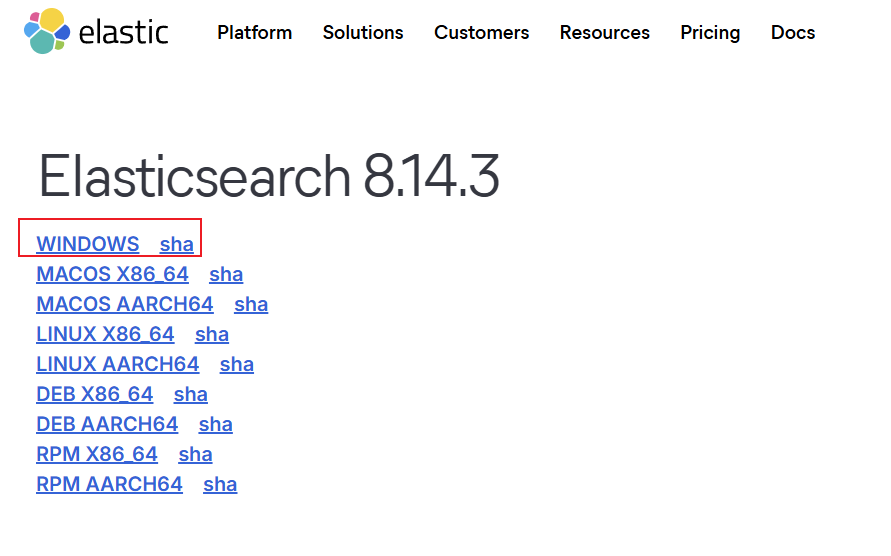
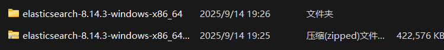
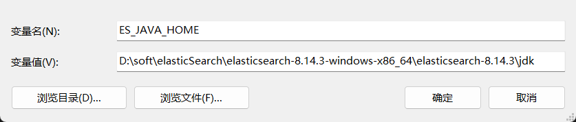
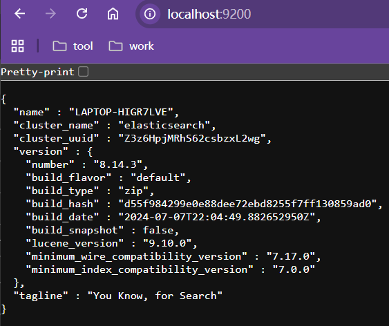
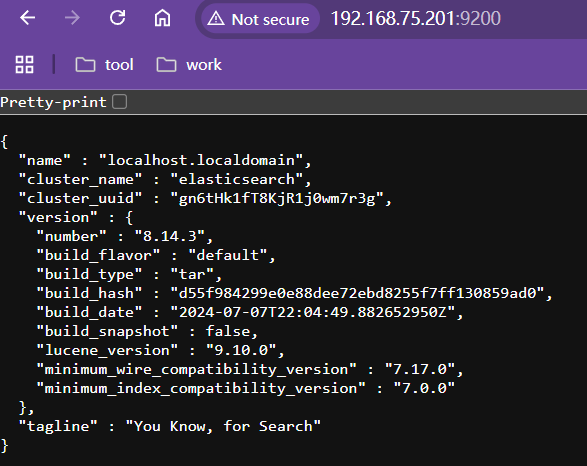

# ElasticSerch8安装

**本文档使用的ElasticSearch版本为`8.14.3`**


## 一、Window版

### 1、下载

https://www.elastic.co/downloads/past-releases/elasticsearch-8-14-3




解压文件




### 2、配置

- 系统环境变量配置

  - `ES_HOME`：ES安装目录

    

  - `ES_JAVA_HOME`：ES安装目录下的JDK目录。

    ES基于Java环境，ES8之后自带JDK，建议使用自带的JDK，避免自己安装的JDK版本未达到使用ES的最低版本要求

    

  

- 关闭ES的Security安全认证

  修改安装目录下`D:\soft\elasticSearch\elasticsearch-8.14.3-windows-x86_64\elasticsearch-8.14.3\config`的`elasticsearch.yml`文件。在该文件下添加如下配置

  ```yaml
  # 关闭ES安全认证
  xpack.security.enabled: false
  ```


### 3、启动

运行`D:\soft\elasticSearch\elasticsearch-8.14.3-windows-x86_64\elasticsearch-8.14.3\bin`目录下的`elasticsearch.bat`


### 4、测试

访问：http://localhost:9200/




如果出现异常可去`D:\soft\elasticSearch\elasticsearch-8.14.3-windows-x86_64\elasticsearch-8.14.3\logs\elasticsearch.log`下查看


## 二、Linux版

**Linux中ES不允许Root用户下运行**

### 1、创建非Root用户

```shell
# 添加yangguo用户
adduser yangguo

# 修改用户密码
passwd yangguo
```


### 2、下载

https://www.elastic.co/downloads/past-releases/elasticsearch-8-14-3

```shell
# 安装wget
yum install wget

# 下载ES
wget https://artifacts.elastic.co/downloads/elasticsearch/elasticsearch-8.14.3-linux-x86_64.tar.gz

# 解压：将当前目录下的elasticsearch-8.14.3-linux-x86_64.tar.gz文件解压到当前目录下的es目录下
tar -xvzf elasticsearch-8.14.3-linux-x86_64.tar.gz -C es
```


### 3、配置

- 配置环境变量

  ```shell
  # 进入用户目录
  cd ~
  
  # 在用户目录的.bash_profile文件中添加环境变量
  vi .bash_profile
  
  # 环境变量
  export ES_HOME=/home/yangguo/es/elasticsearch-8.14.3
  export ES_JAVA_HOME=/home/yangguo/es/elasticsearch-8.14.3/jdk
  
  # 刷新配置
  source .bash_profile
  ```

  

- 修改ES配置

  ```shell
  # 进入ES配置目录
  cd /home/yangguo/es/elasticsearch-8.14.3/config
  
  # 修改elasticsearch.yml
  vi elasticsearch.yml
  	
  	# elasticsearch.yml文件中新增以下内容
  	# 开启远程访问支持
  	network.host: 0.0.0.0
  	# 关闭安全认证
  	xpack.security.enabled: false
  	# 设置开发模式绕过引导检查，避免出现各种异常（仅限开发使用）
  	discovery.type: single-node
  ```

  ```shell
  # 进入ES配置目录
  cd /home/yangguo/es/elasticsearch-8.14.3/config
  
  # 修改JVM虚拟机堆内存
  vi jvm.options
  
  # 原配置
  ##-Xms4g
  ##-Xmx4g
  
  # 新配置（视具体情况而定）
  -Xms2g
  -Xmx2g
  ```


### 4、启动

```shell
# 进入ES安装目录
cd /home/yangguo/es/elasticsearch-8.14.3

# 执行bin下的启动脚本 （-d为后台启动）
[yangguo@localhost elasticsearch-8.14.3]$ bin/elasticsearch -d
```


### 5、测试

访问：http://虚拟机ip:9200

