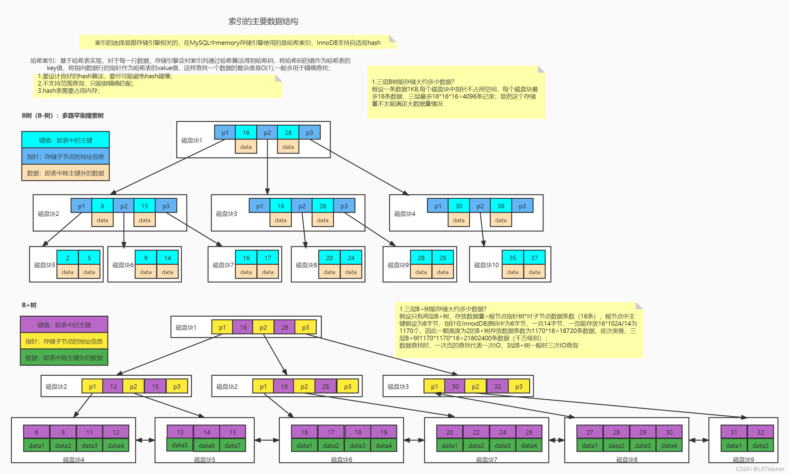

# MYSQL笔记

## 一、数据库的基础概念

### 1.数据库就是存储数据的仓库

### 2.数据库分为两大类

1. 关系型数据库：

   - 关系型数据库的"关系"其实指的就是二维表结构，也就是说这样的数据库是由众多的表组成，而表又有许许多多的字段组成（使用二维表结构存储数据的数据库就是关系型数据库）。

   - 常见的关系型数据库有mysql(oracle公司的开源的免费的数据库)，oracle(oracle公司的收费数据库)，db2（最大的关系型数据库），sql server（微软公司的数据库，只能在windows平台使用，不可以跨平台）。

2. 非关系型数据库

   - 非关系型数据库与其说是数据库不如说是一种数据结构（非表结构）。

   - 常见的非关系型数据库有redis。
   - 非关系型数据库的存在并不是否定关系型数据库而是作为关系型数据库的补充使用（关系型数据库有着清晰的表结构，但是查询效率慢；而非关系型数据库虽然没有清晰的表结构，但是具有更高的查询效率）。

### 3.关系型数据库和非关系型数据库的区别

1. 
2. 关系型数据库sql语句通用，所以与非关系型数据库相比具有更小的学习成本。
3. 在面对大数据量的情况下，关系型数据库的数据一般存储在硬盘，读写速度慢，而非关系型数据库的数据一般存储在内存中，读写速度非常快。
4. 持久化存储选择关系型数据库，而需要高速的读写选择非关系型数据库。

### 4.SQL语句的特点

- <u>所有的关系型数据库通用SQL语句</u>
- <u>SQL语句不区分大小写</u>
- SQL语句使用分号作为每个语句的结尾
- SQL语句的单行注释“  --  ”和“  #  ”，多行注释/*    */

## 二、MYSQL数据类型

### 1.数值类型

- 整数类型

  1. tinyint（1字节）

  2. smallint（2字节）

  3. mediumint（3字节）

  4. int/integer（4字节）

  5. bigint（8字节）

     ```
     #无符号数据
     create table t(
     	a int unsigned
     )
     ```

- 小数类型

  1. float（4字节）

  2. double（8字节）double(a,b)

     - 设置double型数据的时候，可以指定长度也可以不指定

     - 如果a<b，则报错

     - 如果a=b，则意味着没有整数部分，即只能输入.123,.321之类的数据

     - 如果a>b，则正常

       - 如果整数部分大于a-b，则报错
       - 如果小数部分大于b，则多出来的部分会进行四舍五入
       - 如果小数部分小于b，则会在末尾补0

     - 特别注意小数的负号和小数点是不占位数的

       ```
       #无符号数据
       create table t(
       	a double unsigned
       )
       ```

### 2.字符串类型

- 定长字符串（char）

  - char类型定义的时候可以指定长度（char(n)），也可以不指定（char）
  - char类型在定义时不指定长度默认长度为1
  - char定义时指定了长度，假如char(10)，此时存入一个字符，那么字符串的长度仍未10，它会在字符串的末尾自动补空格

- 不定长字符串（varchar）

  - varchar在定义时必须要指定长度不然报错
  - varchar指定长度后，假如varchar(10)，现在存一个字符的数据，此时字符串的长度就是一个字符的长度

- 长文本类型（text）

  

  <u>注意：</u>

  - 效率比较：char>varchar>text
  - 存储数据长度：text>varchar>char(255)
  - varchar和char均支持default默认约束，而text不支持

### 3.时间类型

- date（年月日）

- time（时分秒）

- year（年）

- datetime（年月日时分秒）

- timestamp（年月日时分秒）

  <u>注意：datetime表示的范围大于timestamp，所以一般是用datetime，而不是timestamp；但是timestamp在时间运算上更有优势。</u>

## 三、MYSQL四种类型的语句

### 1.DDL：数据库定义语言

~~~
#------数据库相关------
#1.创建指定字符集的数据库
create database `数据库名` default character set 'utf8';
create database if not exists '数据库名' edfault character set 'utf8';

#2.查看所有的数据库
show databases;

#3.切换数据库
use '数据库名';

#4.查看数据库的建库语句
show create database '数据库名';

#5.删除数据库
drop database '数据库名';
drop database if exists '数据库名';

#6.修改数据库的编码方法
alter database '数据库名' character set 'utf8';

##------表相关------
#7.建表
create table '表名'(
	字段1 类型 约束1 约束2，
	字段2 类型 约束1 约束2，
			.
			.
	字段n 类型 约束1 约束2
);

create table if not exists '表名'(
	字段1 类型 约束1 约束2，
	字段2 类型 约束1 约束2，
			.
			.
	字段n 类型 约束1 约束2
);

#8.查看当前数据库中的所有表
show tables;

#9.查看建表语句
show create table '表名';

#10.添加表字段
alter table '表名' add 字段名 字段类型 约束1 约束2;

#11.删除表字段
alter table '表名' drop 字段名

#12.修改表字段
alter table '表名' change 旧字段 新字段 新字段类型 新字段的约束1 新字段的约束2

#13.修改表名
alter table '旧表名' rename to '新表名';

#14.删除表
drop table '表名';
drop table if exists '表名';

#15.截断表
truncate table '表名';

~~~

<u>**注意**</u>

1. sql语句中所有名字（包括数据库名，表名，字段名等）如果要跟关键字进行区分的话，均要使用`（esc下方的反引号）进行标识，字符串的话使用''（单引号）进行标识。

2. 在创建数据库，表时可加上if not exists意为如果不存在的时候才会进行创建，避免由于重复建库建表，报错。

   同理在删除数据库或者表的情况下，可以加入if exists 意为当数据库或者表存在的时候才会去删除，避免由于数据库或者表不存在的情况下删除报错。

3. 每条sql语句使用；进行结尾。

4. 在建表的时候，其一，表中一个字段最多可以加两个约束，也就是说表中的字段可以不加约束，也可以加一个，也可以加两个，但是不能加超过两个的约束；其二，表中可以写多个字段，多个字段之间要是用逗号分隔，但是最后一个字段末尾一定不能加逗号，应该什么都不加；其三，建表表中字段是放在（）里面的，语句最后不要忘记加；。

5. <u>截断表和删除表的区别</u>：删除表是删除表中所有的数据，这其中还包括表的结构（所谓表的结构就是表中的字段），也就是说删除表（drop）是彻底的删除；而截断表（truncate）则只是删除表中数据，并没有删除表中的字段。

### 2.DML：数据库操作语句

#### （1）insert语句

```
#两种insert语句
#第1种
##（1）表名后如果不加字段约束的话，则必须按顺序为所有字段进行赋值	
insert into 表名 value (字段1值，字段2值，字段3值...)
##（2）value的话一次只能写一组值，values可以一次写多组值
insert into 表名 values (字段1值，字段2值，字段3值...),(字段1值，字段2值，字段3值...)...

#第2种
insert into 表名(字段1，字段2，字段3) values (字段1值，字段2值，字段3值),(字段1值，字段2值，字段3值)...

```

#### （2）update语句

```
update 表名 set 字段名 = 字段值，字段名 = 字段值... where ...

#注意
#一般情况下,update语句一定要配合where语句进行使用，如果没有where的话，会将某一字段中的所有值给修改
#比方说：表A，存在两个字段，a和b，并且其中有两行数据（1，1），（2，2）,现在执行update A set b = 3 此时就是不加where的情况，执行完之后，数据库中的数据就会变为（1，3），（2，3），结果是它把b字段中所有的数据都改成了3
```

#### （3）delete语句

```
delete from 表名 where ...

#delete和update一样，也要配合where进行使用，如果不使用where，直接delete from 表名;则会将指定表中的所有数据删除
```

### 3.DCL：数据库控制语句

#### （1）DCL的作用

DCL主要用于控制数据库的访问权限和用户数据管理

#### （2）DCL用户操作

```
#引申：
#    1.MYSQL中的所有用户信息都存储在mysql库中的user表中
#    2.user表中有很多的字段，主要有三类host，user，权限字段；host代表用户可以在哪个主机上访问数据库，user是用户名，权限就是用户的各种权限
#    3.在mysql中通过用户名加主机地址就可以唯一的去定位到某一个用户：'用户名'@'主机地址'

#1.查看所有用户
use mysql;
select * from user;

#2.创建用户（使用一下方式创建的用户一开始没有任何权限）
create user '用户名'@'主机地址' identified by '密码';
#user只能在本机访问数据库
（1）create user 'user'@'localhost' identified by '123456';
#user可以在任意主机访问数据库
（2）create user 'user'@'%' identified by '123456';

#3.修改用户密码
alter user '用户名'@'主机地址' identified with mysql_native_password by '新密码';

#4.删除用户
drop user '用户名'@'主机地址';

```

#### （3）DCL权限操作

```
#1.查询某一个用户的所有权限
show grants for '用户名'@'主机地址';

#2.授予用户某些权限
grant 权限列表 on 数据库名.表名 to '用户名'@'主机地址';

#补充：
	1.常见的用户权限：all(所有权限),select,insert,update,delete,drop..
	2.*.*代表  授权给所有数据库的所有表
	
#3.撤销用户的某些权限
revoke 权限列表 on 数据库名.表名 from '用户名'@'主机地址';

```

### 4.DQL：数据库查询语句

#### 	（1）基本查询

```
#1.查询全部字段
select * from t;

#2.查询部分字段
select a,b from t;

#3.字段别名显示
select a as aa,b as bb from t;
	#（1）as可以省略使用空格代替
	#（2）使用别名后查询显示的字段名是别名而不是原始字段名
	#（3）使用了别名之后，sql语句中就不能再使用它的原始的名字了

#4.去重查询
select distinct a from t;
select distinct a,b from t;
#去重查询如果有多个字段的话，是对组合数据进行去重
```

#### （2）聚合函数

```
***注意***
	1.null值不参与所有聚合函数的运算
	2.聚合函数针对的是一列数据
	3.聚合函数一定不能放在where语句之后
	4.聚合函数可以在select和having之后使用
#1.count:统计某一列的数量（行数，如果某一个值为null则不参与运算）
select count(字段名) from t ;

#2.max:统计指定一列的最大值
select max(字段名) from t;

#3.min：统计指定一列的最小值
select min(字段名) from t;

#4.avg:统计一列的平均值
select avg from t;

#5.sum:统计一列的和
select sum(字段名) from t;
```

#### （3）分组查询

```
###对分组的理解###
	#分组就是将某一列数据，按照相同的值一组的条件再分成好几列，并且每一列的字段名一样（并且跟原来一样）
	
#1.普通分组
select sex,count(sex) from t group by sex;

#2.带where和having的分组
#对年龄小于60的人，按性别进行分组，然后获取人数大于3的组
select sex,count(sex) from t where age<60 group by sex having count(sex)>3;

***where和having的区别***
1.from是从某一个数据库中获取数据，where是在获取到数据库的数据之前对数据库的数据进行过滤，而having是在获取到了数据库的数据之后对数据进行过滤（说白了就是where是在我们获得到数据库的数据之前对数据进行过滤，而having是已经获取了数据库的数据，然后对数据进行过滤）
2.where之后不可以使用聚合函数，having之后可以使用聚合函数

***注意***
having通常和group by组合使用，但不是必须的
```

#### （4）排序查询

```
#1.单字段排序
#（1）升序（默认方式）
select * from t order by 字段名 asc; 
select * from t order by 字段名;

#（2）降序
select * from t order by 字段名 desc;

#2.多字段查询
select * from t order by 字段1 asc ，字段2 desc;
#意思是先按字段1进行升序排序，如果字段1的值一样的就是按字段2逆序排序
```

#### （5）分页查询

```
***注意***
1.分页查询limit是mysql中的方言语句，也就是说在mysql中使用limit进行分页，但在其他的数据库分页可能就不是使用limit
2.limit a,b; a是起始索引，b是每页查询的数据条数
3.起始索引的计算公式：（当前页数-1）*每页条数
4.如果是第一页的话，起始索引0可以省略不写，limit b;

#使用
select * from t limit 0 10;
```

#### （6）DQL语句的执行顺序问题（重点）

- DQL语句的执行顺序是先执行

  ​				1.from

  ​				2.where

  ​				3.group by 和 having

  ​				4.select

  ​				5.order by

  ​				6.limit

- ***<u>由执行顺序可以总结的几个知识点</u>***

  1. from中的别名可以在任意位置上使用，因为from是最先被执行的语句
  2. select中的别名不可在where之中使用
  3. select中的别名可以在order by 和 limit中使用

### 5.约束

#### （1）主键约束（primary key）

1. 主键约束的作用：添加主键约束的字段需要保证唯一非空。

   如果主键是int类型的话，可以配合auto_increment实现主键自增；对于auto_increment需要知道自增过程出现的数值之后都不会再次出现，什么意思呢，比如说，主键值现在已经有了1，2，3，现在将3号删除，然后在添加一条数据，由于自增的存在所有会自动给予主键值，但是此时主键的值是4，而不是3。这种现象可以使用截断表解决，使用截断表也相当于在保留整张表结构的基础上，进行了表的重置。

2. 主键约束的分类：

   - 单值主键：只有一个字段构成的主键，只需保证一个字段的唯一非空即可。

     ```
     #添加单值主键的方式
     
     #1.字段后
     create table t(
     	a int primary key
     )
     
     #2.所有字段后
     create table t(
     	a int ,
     	b int ,
     	primary key(a)
     )
     
     #3.表外追加主键约束
     alter table 表名 add primary key(字段名);
     alter table 表名 add constriant 约束名 primary key(字段名);
     #第二种方法的好处是如果之后不需要约束可以通过约束名删除约束
     alter table 表名 drop constraint 约束名;
     ```

     

   - 复合主键：多个字段组合而成的主键，要求组合成主键的多个字段的组合值唯一非空。

     ```
     #添加复合主键的方式
     
     #1.所有字段后
     create table t(
     	a int ,
     	b int ,
     	primary key(a,b)
     )
     
     #2.表外追加主键
     alter table 表名 add primary key(字段名1，字段名2);
     alter table 表名 add constraint 约束名 primary key(字段名1，字段名2);
     #删除约束
     alter table 表名 drop constraint 约束名;
     ```

#### （2）唯一约束（unique）

1. 唯一约束的作用：保证字段的值唯一（但是这个唯一不包括null，也就是说可以存在多个null）。

2. 唯一约束的使用：

   ```
   #添加唯一约束的方式
   #1.字段后
   create table t(
   	a int unique
   )
   
   #2.所有字段后(a的值唯一)
   create table t(
   	a int ,
   	b int ,
   	unique(a)
   )
   #3.所有字段后(a和b的组合值唯一)
   create table t(
   	a int ,
   	b int ,
   	unique(a,b)
   )
   
   #4.表外追加唯一约束
   alter table 表名 add unique(a);
   alter table 表名 add unique(a,b);
   alter table 表名 add constraint 约束名 unique(a);
   #删除约束
   alter table 表名 drop constraint 约束名;
   ```

#### （3）非空约束（not null）

1. 非空约束的作用：字段值不能为空

2. 非空约束的使用：

   ```
   #注意非空约束not null 只能在字段后添加
   
   create table t(
   	a int not null
   )
   ```

#### （4）默认约束（default）

1. 默认约束的作用：当字段没有赋值的时候自动赋予默认值（一般配合非空进行使用）

2. 默认约束的使用：

   ```
   #注意默认约束default 只能在字段后添加
   
   create table t(
   	a int default 100
   )
   ```

#### （5）检查约束（check）

1. 检查约束的作用：限定字段输入的值。（<u>检查约束在mysql8之前是无效的</u>）

2. 检查约束的使用：

   ```
   #添加检查约束的方式(a大于10才能成功添加)
   #1.字段后
   create table t(
   	a int check(a>10)
   )
   
   #2.所有字段后
   create table t(
   	a int ,
   	b int ,
   	check(a>10)
   )
   
   #3.表外追加检查约束
   alter table 表名 add constraint 约束名 check(a>10);
   #删除约束
   alter table 表名 drop constraint 约束名;
   ```

#### （6）外键约束（foreign key）

1. 外键约束的作用：外键约束时对多张表中的数据进行限制

   <u>比方说：两张表A和B，A中存在一个外键字段a，参考的时B中的主键字段b，此时B中b字段的值只有1，2，3，那么在A表中填写a字段时，只能填写B表中b字段所取的值，也就是A中a只能填写1，2，3。</u>

2. 外键约束的使用：

   ```
   #添加外键约束的方式(t1表中的b为外键字段，参考字段是t2表的c字段)
   #1.所有字段后
   create table t1(
   	a int ,
   	b int ,
   	foreign key(b) references t2(c)
   )
   
   #2.表外追加外键约束
   alter table 表名 add constraint 约束名 foreign key(外键字段) references 参照表(参照表中的参照字段);
   #删除约束
   alter table 表名 drop constraint 约束名;
   ```

3. <u>外键约束注意事项：</u>

   - 外键字段参考的字段不一定必须为另一张表的主键字段，只要是唯一即可，比方说被unique约束的字段就可以作为参照字段。
   - 外键约束中一定要保证外键字段和参考字段类型的一致。

### 6.级联

​	<u>级联操作主要为了维护外键字段数据和参照字段数据在进行删除和修改时的数据一致性。</u>（因为外键字段和参照字段是	一种绑定的关系）

1. 级联操作应对的两种修改情况（同一时间可以全写，也可以写其中一个，甚至可以不写）

   - on delete （当删除参照字段时）
   - on update（当修改参照字段时）

2. 四种级联操作

   ```
   #四种级联操作
   #1.restrict（默认的一种级联方式，也就是说如果不手动写的话就是restrict）
   #作用：如果参照字段被外键字段使用，那么参照字段不可以被删除，也不可以被修改
   #方式1：
   create table t1(
   	a int，
   	foreign key(a) references t2(b) on delete restrict on update restrict 
   )
   
   #方式2
   alter table t1 constraint 约束名 foreign key(a) references t2(b) on update restrict
   on delete restrict;
   
   #2.cascade
   #作用：如果参照字段修改，则外键字段也修改；如果参照字段删除，外键字段所在的一整行也会被删除
   #方式1
   create table t1(
   	a int ,
   	foreign key(a) references t2(b) on update cascade on delete cascade
   )
   
   #方式2
   alter table t1 add constraint 约束名 foreign key(a) references t2(b)
   on delete cascade onupdate cascade;
   
   #3.set null
   #作用：如果参照字段修改，则相应的外键字段为null；如果参照字段删除，相应的外键字段也为null；
   #方式1
   create table t1(
   	a int ,
   	foreign key(a) references t2(b) on delete set null on update set null
   )
   
   #4.no action（作用与restrict一样）
   ```

### 7.其他语句

#### （1）where用法

1. 比较运算符（>,>=,<,<=）注意!=和<>（<u>mysql中<>是不等于的意思</u>）

   ```
   #查询a>10的所有数据
   select * from t1 where a>10;
   ```

2. 字段名 between  最小值  and  最大值

   ```
   #查询a在1到10之间的数据
   #a between 1 and 10 相当于 a>=1 and a<=10
   select * from t1 where a between 1 and 10;
   ```

3. 字段名 is null , 字段名 is not null

   ```
   #判断某一个字段值是否为空
   select * from t1 where a is null;
   select * from t1 where a is not null;
   ```

4. 字段名 in (value1,value2,value3...),字段名 not in (value1,value2,value3...)

   ```
   select * from t1 where a in (1,2,3);
   select * from t1 where a not in (1,2,3);
   ```

5. like模糊查询

   ```
   #三种模糊查询的方式
   #第一种(a字段以m开头的数据)
   select * from t1 where a like 'm%';
   #第二种(a字段以m结尾的数据)
   select * from t1 where a like '%m';
   #第三种(a字段中包含m的数据)
   select * from t1 where a like '%m%';
   ```

   6.正则验证格式

   ```
   #查询满足正则表达式的a的数据
   select * from t where a regexp '正则表达式';
   ```

   7.逻辑运算符

   ```
   #and
   select * from t where a = 1 and b = 2;
   #or 
   select * from t where a = 1 or b = 2;
   #not 
   select * from t where a not 1;
   ```

## 四、多表查询

### 1.笛卡尔积

- ***<u>在数据库中笛卡尔积就是在多表查询时，由于没有设置查询条件，导致驱动表A中的每一条数据，都可以匹配被驱动表B的所有数据，最终查询出来的数据量就是两个表数据量的乘积。</u>***
- 解释笛卡尔积的产生原因：比方说A表数据{1，2}，B表数据{3，4，5}；此时A作为驱动表的话，则会将A表中的每一条数据去B表中匹配，假如说是A表中的1先去匹配，由于没有条件限制，所以A表中的1可以匹配B表中的所有数据，结果就是{1，3}，{1，4}，{1，5}，A表中的2也是一样，所以最终的数据量就是2*3=6。
- <u>笛卡尔积中采用小表驱动大表</u>
- ***<u>如何怕判断那个表是驱动表</u>***：使用explain去运行某一个语句，出现在结果最上面的就是驱动表。

### 2.连接查询

#### （1）内连接

1. 隐式内连接

   ```
   select * from 多个表 where 查询条件（一般是两个表相关的数据）;
   ```

2. 显式内连接

   ```
   select * from 表1 inner join 表2 on 查询条件;
   
   ***注意***
   #1.显式内连接关键字inner join ，其中inner可以省略。
   #2.在内连接查询中不论是显式还是隐式采用的均是小表驱动大表的策略。
   ```

   <u>***内连接说白了就是取两个表格公共部分！*</u>**

#### （2）外连接

1. 左外连接

   ```
   select * from A left outer join B on 条件;
   
   ***注意***
   #1.左外连接的关键字是left outer join ，其中outer可以省略。
   #2.左外连接中，左表为驱动表，左表出全部数据（也就是说A表出全部数据）
   ```

2. 右外连接

   ```
   select * from A right outer join B on 条件;
   
   ***注意***
   #1.右外连接的关键字是right outer join ，其中outer可以省略
   #2.右外连接中，右表是驱动表，右表出全部数据（也就是说B表出全部数据）
   ```

******<u>外连接中on和where的区别</u>******

```
#正常的查询语句
select * from A;
#外连接查询的语句（以左外连接查询为例）
select * from A left outer join B on 条件1 where 条件2;

#综上：第一条语句中的‘A’就相当于第二条语句的‘A left outer join B on 条件1’，所以连接查询后可以使用where

***区别***
#1.on是在连接查询的时候使用的，而where则是对连接查询完之后对结果集进行过滤使用的。
#2.而where是数据出数据库之前的过滤，having则是出了数据库之后对数据的过滤
```


#### （3）自连接

```
#子连接查询就是一张表，当两张表来使用，自己查询自己（经典案例就是员工和上司，员工和上司都是员工，查询上司就是子连接查询）
select * from 表1 a,表1 b where a.aid = b.bid;

***注意***
#1.子连接查询是一张表当两张表来用，所以子连接一定要设置别名。
#2.上面的写法仅仅是内连接的子连接查询。子连接既可以是内连接，又可以是外连接
```

#### （4）驱动表和被驱动表

- <u>判断驱动表和被驱动表</u>：可以使用explain关键字，去执行相应的sql语句，出现在最上方的表就是驱动表，下方的表就是被驱动表
- <u>驱动表驱动被驱动表的过程</u>：
  - 在多张表连接查询的过程中，驱动表中的每一条数据都会单独拿出来根据给定的条件去被驱动表中进行匹配
  - 在内连接查询中，驱动表会拿自己的每一行数据，去被驱动表中进行匹配，当然这个过程或有三种情况。第一种情况就是驱动表中的一条数据匹配了被驱动表中的一条数据，那么最后的结果就是驱动表中的一条数据对应被驱动表中的一条数据；第二种情况就是驱动表种的一条数据匹配到了被驱动表种的多条数据，那么最后的结果就是驱动表中的一条数据对应被驱动表中的多条数据，一对多，缺少的部分仍使用驱动表中的那一条数据去填补；第三种情况就是驱动表中的一条数据匹配到了被驱动表中的0条数据，这里就要注意了，<u>*驱动表虽然是拿出它的每一条数据去被驱动表中匹配，但是这不意味着在最终的结果中会包含驱动表中的所有数据*</u>，在内连接中如果驱动表没有匹配到被驱动表中的数据，那么最终的结果中同时没有驱动表和被驱动表中的数据。
  - 在外连接查询中，这里只拿左外连接来说，因为左外连接和右外连接差不多。在左外连接中左表是驱动表，所以左表会拿出每一行的数据去右表也就是被驱动表中进行匹配，同样的也有三种情况，如果匹配数据为一条，那么最终的结果就是驱动表和被驱动表，一条数据对应一条数据的情形；如果匹配了多条数据，最终的结果就是一条数据对应多条数据，空白的位置使用驱动表中去匹配的那一条数据填补；而第三种情况与内连接不同，如果一条数据都没有匹配到的话，在最终的结果中仍有这一条数据，因为左外连接坐标出全部数据，而右表中没有与之匹配的数据就使用null来补位。

### 3.子查询

​		<u>*所谓的子查询就是select语句的查询结果作为另一条sql语句的条件，嵌套进另一条sql语句的查询*</u><u>*就是子查询*</u>。

#### （1）标量子查询

1. 标量子查询就是在B表中查询出一个值b，然后用这一个值b作为A表查询语句的一个条件，查询出A表中的一个或者多个数据
2. A表在B表查询的基础上常用的运算符：
   - =,!=,<>：查询出A表中等于或者不等于B表中<u>某一个</u>数据的A表中的数据
   - <,<=,>,>=:查询出A表中大于或者大于等于或者小于或者小于等于B表中<u>某一个</u>数据的A表中的数据

#### （2）列子查询

1. 列子查询就是在B表中通过查询获取了一列的数据，然后用这一列的数据作为A表的查询条件，查询出A表中一个或者多个数据
2. A表在B表查询出的一列数据的基础上常用的运算符：
   - in , not in: 查询出A表中可以匹配上或匹配不上B表数据的数据
   - any/some：只要A表中至少有一条满足就行
   - all：A表中必须所有数据都满足B表的数据

#### （3）行子查询

1. 行子查询就是B表中查询获取了一行的数据，然后用这一行的数据去A表中查询一条或者多条数据

   ```
   ***注意***
   #两种一样的写法
   #第一种
   select * from A where a.a = 1 and a.b = 2;
   #第二种
   select * from A where (a.a,a.b) = (1,2);
   
   #此时就可以将一行的数据放入（1，2）的位置，然后（a.a,a.b）中的字段就会去自动匹配
   ```

#### （4）表子查询

1. 表子查询就是B表通过查询获取的是一张表，也就是多行多列的数据，然后用这些数据去A表中查询出一条或者多条的数据

   ```
   ***注意***
   #表子查询实际上就是行子查询和列子查询的一个综合
   
   select * from A where (A.a,A.b) in (表);
   #理解
   #1.A.a去匹配表的第一列字段，然后看A.a的值是否在这一列数据之中
   #2.A.b去匹配表的第二列字段，然后看A.b的值是否在这一行数据之中
   ```

### 4.联合查询

```
#联合查询就是*将两个查询结果的数据整合起来*

#方式1
select * from A
union all
select * from B;

#方式2
select * from A
union 
select * from B;

***注意***
#1.union all和union的区别：
	union all不会对整合的结果集进行去重，而union会对整合的进行去重
#2.union all和union的使用注意
	联合查询只能联合两个*列数*和*字段类型*一致的
```

## 五、事务

### 1.事务的四个特性

- 原子性：原子性就是多个sql语句的操作是一个不可分割的整体，要么同时成功，要么同时失败。
- 一致性：一致性就是数据的一致性，比方说银行转账问题，一个人减少100元，另一个人就要增加100元。但是这个过程中虽然有钱的增和减，但是在这个过程中不论是转账前，还是转账后，两个人的总钱数都是一样的，不会凭空多出钱，也不会凭空少了钱，这就是事务的一致性。
- 隔离性：隔离性就是事务并发执行的时候，多条事务之间是互不干扰的。
- 持久性：持久性就是事务一旦提交之后，对数据库的修改就是永久的。只要事务没有提交就可以通过回滚来撤销对数据库的修改，一旦提交则不可以在对数据库进行修改

### 2.事务的并发问题

- 脏读：假设现在有A和B两个事务，其中A事务读取到了B未提交的数据，比方转账问题，B事务负责收钱，而A事务负责检查是否收到了，如果A事务读取到了B收钱后的数据，但是B事务在执行的过程中发生了异常，导致数据回滚，对于B事务来说，他是做收钱失败的，但是由于A事务读取了是B的未提交数据所以A事务认为B事务已经收到钱了。总的来说就是A读取B未提交数据，而B发生数据回滚，导致A读取到的是一个不存在或者说不合法的数据。

- 不可重复读：假设现在有A和B两个事务，A事务读取了B事务的某个数据，而在接下来的过程中B事务对数据进行了修改，而A事务此时读取数据发生了变化，这就是不可重复读的现象。

- 幻读：假设现在有两个事务A和B，A事务获取一个满足条件的数据个数为a，此时B事务添加或者减少了满足条件的数据，在A事务中再次获取满足条件的数据发生数据发生改变了，这就是幻读现象。(幻读针对的也是已提交的数据)

  <hr></hr>

  *<u>幻读和不可重复读的区别</u>*

  <font>不可重复读关键在于由于数据的修改，引起一个事务前后查询一个数据的不同；而幻读是由于对数据的删减，而引起在一个事务中前后读取一个数据的不同</font>。

  可重复读和幻读其实是一个级别的问题，只不过都是在读已提交的基础上，在不可重复读的约束下，就会有可重复读的需求，在可重复读的约束下就会有不可重复读的需求。

  

  <font color="red">*以上所有的事务并发中的问题它都不是一个绝对性的问题，也就是说产生这种现象并不一定是一种坏的现象。只能针对不同的情况来分析产生这种问题到底是好还是坏。需要根据具体的问题给事务设置隔离级别，来解决相应的问题。*</font>

### 3.事务的隔离级别

- 读未提交：事务可以读取未提交事务的数据，最直接产生的影响就是脏读（当读取某一事务的数据之后，该事务回滚导致读取的是一个不存在或者说违法的数据）。当然读未提交也会引起不可重复读，和幻读问题。

- 读已提交：只允许读已经提交的事务，这样就可以解决脏读问题，因为脏读就是因为读取了未提交的数据，然后事务回滚导致发生错误。而允许读已提交就会产生另一种问题，就是在某些情况下不可重复度的情况。

- 可重复读：可重复可以解决脏读（因为可重复读，是在读已提交的基础上进行的）和不可重复读（不允许重复读，那么只要允许就可以了），但是可重复读又会出现幻读的问题。

- 串行化：可重复读在某些情况下又会引起幻读，而使用串行化，让事务排序一个个来就会解决所有问题，这就好比同步锁对多线程的约束一样，只要一次只允许一个线程执行，化多线程为单线程，就不会有数据不安全之类的多线程问题。

  ***注意***

  1. 串行化可以避免很多问题，但是执行效率很低，所以一般很少使用
  2. mysql默认的隔离级别就是可重复读
  3. oracle默认的隔离级别就是读已提交

## 六、存储引擎

### 1.存储引擎的概念问题

（1）什么是存储引擎：存储引擎说白了就是指定数据库如何存储数据，如何查询数据，如何建立索引等功能的代码。

​			自身条件允许的化甚至可以自己定义如何存储，查询数据，自己定义数据库的存储引擎。

（2）MYSQL的默认存储引擎是Innodb，而在早期的MYSQL版本使用的是myisam引擎。

（3）MYSQL的存储引擎采用的是插件式存储引擎架构，也就是说存储引擎可以跟插件一样自由拔插，所以MYSQL中不止			存在一个存储引擎，而是多个，所以需要根据实际的情况选取不同的存储引擎。

（4）MYSQL中的存储引擎是基于表，而不是基于库。在普通的建表中如果没有指定存储引擎默认使用Innodb引擎。

​			由这里也可以看出MYSQL中的存储引擎是基于表的。<font color="red">存储引擎基于表，而索引是在存储引擎层实现的</font>。

```
#建表时指定存储引擎，如果不指定存储引擎默认是Innodb引擎

create table if not exists 表名(
	a int primary key auto_increment,
	b int 
) engine=存储引擎名
```

<u>面试：讲一下MYSQL的存储引擎：在mysql中存储引擎实际上就是定义了如何查询，如何存储数据的代码，自身有条件的话甚至可以自定义存储引擎；为什么可以自定义存储引擎呢？因为mysql采用的是插件式存储引擎架构，存储引擎可以跟插件一样自由拔插，这同时也说明了mysql中不止只有一个存储引擎而是有多个，所以需要根据实际的情况选择不同的存储引擎；而mysql中目前默认的存储引擎是Innodb引擎，而在早期的mysql中采用的是myisam引擎；mysql中的存储引擎可以在建表的时候定义，这也从另一方面说明了存储引擎是基于表而不是基于库的。</u>

### 2.InnoDB引擎和MyIsAm引擎的区别

- innodb引擎支持事务，而myisam引擎不支持事务
- innodb引擎支持行级锁，myisam支持表锁，innodb相较于myisam能更好的处理并发问题
- innodeb支持外键约束，myisam不支持，所以innodb相较于myisam更有利于维护数据的一致性和准确性

*补充：MYSQL中还存在memory引擎，而该引擎是将数据存储在内存之中的，所以读写速度很快，但是不能实现数据的持久化存储。*


## 七、索引

### 1.索引概念

1. 什么是索引：索引一种可以高效获取数据的有序的数据结构。

2. 数据库中除了要保存基本的数据之外，还需要维护数据的索引，而索引一般较大所以不是存储在内存中而是存储在磁盘中。

3. 全表扫描：比方说查询数据where a=1; 开始查询数据从表的第一行开始，当查询到where a=1; 时查询并不会终止，而是继续，直到扫描全表，因为可能后面还有where a = 1的数据。

4. <u><b>索引的优劣</b></u>：

   - 优点:

     1. 提高数据查询效率。
     2. 因为索引本身就是一种有序的数据结构，所以索引可以用来对数据进行排序。

   - 缺点：

     1. 由于索引作为一种数据结构也需要进行维护和管理，所以索引需要占用一些硬盘空间。

     2. 索引虽然可以提高查询的效率，但是会降低增删改的效率。

        

   *<u>补充：</u>*对于索引的两个缺点其实是可以粗略不记的，首先索引不会占据太大的空间，其次磁盘比较便宜，不会增加太多的成本，其次虽然使用索引的同时会降低增删改的效率，但是对于一个基本的项目来说，增删改的比例远小于查询的比例。

5. Innodb引擎的默认索引是B+树索引（数据结构）。

### 2.B树和B+树 数据结构

#### （1）树的概念

- 度数：树的父节点的子节点个数。
- 阶数：树的父节点的最大子节点个数，也就是说阶数等于最大度数。
- 树高：树有几层数据，树高就是几。
- 页：mysql中树中的一个节点就是一页，一页有16k。
- 叶子节点：如果一个节点没有子节点，那么这个节点就可以看作是叶子节点。
- 根节点：如果一个节点没有父节点，那么这个节点就是根节点

#### （2）二叉树

1. 对于普通的二叉树来说用于存储数据库数据存在两个问题（<u>为什么mysql不使用二叉树存储数据？</u>）：<u>第一个问题</u>是二叉树每一个节点最多只能由两个，所以面对数据库海量的数据，树高一定非常高，影响查询效率；<u>第二个问题</u>是当数据是依次插入时（就是说数据从小到大或者从大到小），这样形成的数据结构与其说是树不如说是链表，这种数据结构在查询数据时就相当于全表扫描，影响查询效率。
2. （<u>为什么mysql不使用红黑树进行数据存储？</u>）由于数据如果是依次插入的话，有可能形成链表，影响查询效率，所以可以采用自平衡的二叉查找树红黑树类解决这个问题，但是红黑树本质上也是一个二叉树，既然是一个二叉树，每个节点最多由两个子节点，这样在面对大数据量是层级也会非常的深，影响查询效率。

#### （3）B树

1. <u>B树的阶数不是固定的</u>（当然B+树的阶数也不是固定的），可以指定阶数。

2. 对于5阶B树来说，每个节点中最多有5个子节点（也就是有五个指针），也就是最多可以有4个key（key就是存储数据库中每行数据的主键值）

3. <font style="font-weight:700">B树分裂的原则</font>：当节点中的key的个数超过它的最大值时，就会产生分裂；奇数阶B树，每个节点最多有奇数个指针，奇数个指针对应偶数个key，此时再来一个key时就会进行分裂，也就是说对于<u>奇数阶B树，分裂的时候是有奇数个key的，所以当奇数个key进行分裂时，中间的key向上分裂，剩下的两部分形成两个节点</u>；而偶数阶B树最多可以有偶数个指针，而偶数个指针最多可以有奇数个key，此时再来一个key就会进行分裂，也就是说，<u>偶数阶B树当偶数个key时会进行分裂，此时要分裂的节点中间有两个key，位于左边的key向上分裂，剩下的两部分形成两个节点。</u>

4. <b>5阶B树的存储过程</b>：现在存储1，2，3，4，一共四个数据也就是4个key，满足每个节点最多4个key的条件，但是当存入5时，此节点就会不满足每个节点最多4个key的条件，就会分裂，此时位于中间的key：3就会向上进行分裂单独作为一个节点，而剩下的12和34均会单独的形成一个节点；<u>当再有数据存储进来时，优先从顶层节点的每一个key进行判断，大的在右，小的在左；</u>现在存储6，发现6大于顶层3这个key所以放在3的右边45节点上，然后变为456，然后继续存入7，当存储8时由于4567节点上达到了key存储的最大值，再来一个key就会进行分裂，此时位于中间的6就会向上分裂形成，树的第一层为36，树的第二层第一个节点为12，第二个几点45，第三个节点为78；树第一层的3这个key有两个指针分别指向第二层的12和45两个节点，树的第一层的6这个key又有两个指针，不过其中一个和3key公用，指向45和78；当再次添加数据4.5时，4.5从树的第一层开始判断，4.5大于3所以在3的右边而又小于6所以最终4.5会进入树第二层的45节点，形成4，4.5，5这一节点。

   （<font color="red">总的来说就是存储数据时，从树的根节点开始，跟每个节点中的key从左到右一次比较，直到遇到大于左边key小于右边key的情况，然后顺着这条路径的指针下放到子结点中，然后在子结点中又继续如上进行比较直到key到达叶子节点之后终止</font>）

   <font color="red"><u>总结</u></font>

   - B树存储数据是从树的第一层开始一层一层存储的

   - B树存储的每一个数据都会跟这一个节点中的每一个key进行比对，大在右，小在左，直到比较到比前面的key大比后面的key小，然后根据指针下方到下面的节点中

   - B树在进行分裂的时如果有奇数个key则中间的key向上分裂；如果有偶数个key那么中间两个key的左边的key向上分裂

   - B树存储可视化网站：https://www.cs.usfca.edu/~galles/visualization/BTree.html

     B+树可视化网站：https://www.cs.usfca.edu/~galles/visualization/BPlusTree.html

#### （4）B+树

1. B+树的特点：
   - N阶B+树每个节点最多有N-1个key，N个指针
   - 偶数阶B+树分裂时中间的两个key，右边的key向上分裂，并且向上分裂的key仍在原节点中保留一份，断裂成两份的节点，左节点指向右节点
   - 奇数阶B+树分裂时中间的key向上分裂，并且向上分裂的key仍在原节点中保留一份，断裂成两份的节点，左节点指向右节点
2. B+树的存储过程：以4阶B+树为例，当存储1，2，3时满足每个节点中key的数量不超过3的条件，当再次插入4时，此时就破坏了条件，然后B+树就会进行分裂，中间的两个key，右边的那个会向上分裂，并且在原节点中保留一份，此时B+树为两层，第一层为3，第二层有两个节点，左节点指向右节点，两个节点分别为12和34，由此可见向上分裂的3key让保留在原来的节点中，原来的节点分裂成两个节点（B树和B+树存储过程相似，差别主要在分裂方式上）

<font style="font-weight:700" color="red">面试题</font>

1. B树和B+树的区别
   - 在B树中每个节点的key下都会下挂data数据，但是在B+树中只有叶子节点中的key下会下挂data数据，非叶子节点的key下不会下挂data数据（B树中叶子和非叶子节点中都存储行数据，而B+树中只有叶子节点中才会存储行数据）
   - 在B树中所有节点的key不会重复，而B+树所有节点的key值可能会重复，并且B+树中所有的key都会出现在叶子节点中
   - B树叶子节点之间没有联系，而B+树的每个叶子节点存储了相邻叶子节点的地址形成单向列表，当然mysql中对B+树进行了改进，最终叶子节点之间形成的是双向链表
2. B树和B+树中key，data，指针的含义
   - key：key就是数据库表中每一行数据的主键
   - data：每一个key对应一个data，key是表中每一行的主键值，而data是每一行数据除了主键值其余的数据
   - 指针：父节点指向子节点的地址
3. 为什么Innodb引擎选择B+树作为默认索引
   - 对于二叉树而言，由于每个节点最多含有两个节点，所以大数据量的情况下，树的层级很深，导致查询效率降低；并且对于一些特殊的情况比方说一串从小到大的数据，最终在二叉树中形成的时类似链表的二叉树结构，此时二叉树的查询效率跟全表扫描差不多，查询效率也很低
   - 自平衡二叉查找树和红黑树，都是可以实现自平衡的二叉树，可以避免上述的第二种情况，但是无论是自平衡的二叉查找树还是红黑树，它们本质上仍是二叉树，在大数据量的情况下会导致树的层级很深。影响查询效率
   - 对于B树来说，由于B树的每个节点除了存储key值和下个节点的地址之外还存储了data数据，而mysql中的一个节点就是一页，每一页的大小是由限制的16k，所以当存储了data之后存储的key就会减少，key减少指针也会减少，就会导致树的每一层节点数的减少，最终导致树的层级变高影响查询效率
   - 对B+数来说，由于只有叶子节点中的key下才会下挂data数据，所以在非叶子节点中就可以存储更多的key，存储的key多了，指针也就多了，指针多了数每一行的节点数就多了，层级减少，提高查询效率

</img>


### 3.索引的分类

<u>索引就可以看作是一种数据结构</u>

#### （1）按数据结构分类

1. B+树索引

   B+树索引是Innodb引擎默认的索引。之所以采用B+树索引主要因为B+树索引的行数据全部存储在叶子节点中，这样的好处相较于B树（B树中不光叶子节点存储行数据，非叶子节点也存储行数据）的好处就是，每一个节点中存储的key值的数量就会提高，key的数量增加，那么每个节点的子节点个数就会增加，子节点个数增加就会导致树结构中一层的节点数增加，在总数据量一定的情况下，行节点增多就会导致树高降低，提高了查询效率。

2. hash索引

   - <u>hash索引是memory引擎（memory引擎是将数据存储在内存中，所以查询效率很高，但是无法实现数据的永久化存储）的默认索引</u>，使用hash索引生成数据结构时会根据表中某个字段中的每一个数值，计算出与数值相对的hash值，然后根据这个hash值和底层的hash表（hash表本质上就是一个数组）的长度计算出这个与这个hash值相对应数值在hash表中的存储位置，然后将数据存储在hash表中。
   - hash碰撞：当数据量足够大的时候，就会出现多个数据存储在hash表中同一位置的问题，此时位置重复的数据就会已链表的数据结构外挂在hash表的相应位置上
   - hash索引的缺点：首先hash索引只能进行等值匹配，比如果要查询name为  ‘小红’  的数据，它会先计算出  ‘小红’  的hash值，然后再根据hash值和hash表的长度计算出存储位置，这里的等值就是计算后的hash值，而不能进行范围查询；其二hash值本身无法进行排序，所以使用hash索引构建数据结构中的数据不可以进行排序；其三在正常情况hash索引的查询效率是高于B+树索引的，通常情况只需要一次查询就可以查询出数据，但是如果碰到大数据量且出现hash碰撞的情况下，hash索引除了通过hash值进行定位数据在hash表中的位置，还需要去链表中查询数据，而去链表中查询数据之一过程就可以看作是回表查询，此时hash索引的查询效率不一定高于B+树索引

3. full-text全文索引

   在遇到大文本的情况下，如果需要索引文本中的某一些数据（文本中的关键字），使用sql中的模糊查询效率是非常低的；所以此时全文索引是一个更好的选择，全文索引主要采用倒排索引的方式将大文本转化成许许多多的单词，进行文本索引的时候，就会通过这些单词来进行索引，提高查询效率

#### （2）按物理存储分类

1. 聚簇索引

   - 聚簇索引叶子节点上存储的是行数据

   - 一张表必须要有一个聚簇索引，并且只能有一个聚簇索引

   - 聚簇索引的选取：

     1. 如果存在主键的话，主键索引就是聚簇索引

     2. 如果不存在主键索引的话，就选择第一个唯一索引作为聚簇索引

     3. 如果不存在主键和唯一索引，那么Innodb引擎就会默认生成一个自增的id作为聚簇索引

        <font color="red">(这也同时证明了在mysql中，在建表中不论是否添加了主键，表中一定会存在一个主键，如果写了主键已写的为准，不写的话，Innodb引擎会默认加一个自增的id作为主键)</font>

2. 非聚簇索引（二级索引）

   - 非聚簇索引一个表中可以不存在也可以存在多个

   - 非聚簇索引B+树数据结构中叶子节点中存储的是索引值所在行（比方说name表字段中有一个yg的值，yg的值就是索引值）的主键值，查询到主键值后会进行回表回查，通过聚簇索引查询到一整行的数据

     ```
     select * from t where name="yg";
     
     ###查询name=“yg” 的数据，首先name不是主键所以不能通过聚簇索引直接查询到一整行数据，其次如果name是非聚簇索引（二级索引），那么通过name字段构建的索引数据结构就可以找到“yg”所在行对应的主键，因为二级索引叶子节点中存储的数据所在行的主键值，找到这个主键值之后又可以通过回表查询去聚簇索引中找到这一行中的所有数据
     ```

#### （3）按字段特性分类

1. 主键索引（primary key）
   - 添加了主键约束的字段就是主键索引
   - 主键索引在一个表中只能存在一个
   - 主键索引和聚簇索引不一样的一点是，聚簇索引必须存在，而主键索引可以不存在，如果不存在会找其他索引作为聚簇索引，但是主键索引存在的话只能存在一个
   
   ```
   #1.添加主键索引的三种方式
     #（1）主键约束
     create table t(
     	a int primary key
     );
     #（2）建表时添加
     create table t(
     	a int ,
     	primary key aaa(a)
     );
     #（3）建表后追加
     alter table t add primary key aaa(a);
     
   #2.索引的基本操作
     #（1）查看某一表中的所有索引
     show index from 表名;
     #（2）删除某一表中的某一个索引
     drop index 索引名 on 表名;
   ```
   
   
   
2. 唯一索引（unique）
   - 添加了唯一约束的字段就是唯一索引（只要加上唯一约束就会自动成为唯一索引）
   - 唯一索引可以不存在也可以存在多个
   
   ```
   #1.添加唯一索引的三种方式
     #（1）唯一约束
     create table t(
     	a int unique
     );
     #（2）建表中添加唯一索引
     create table t(
     	a int,
     	unique key aaa(a)      #--unique key 索引名（索引字段）;--
     );
     #（3）建表后追加唯一索引
     alter table t add unique key aaa(a);
     
   #2.索引的基本操作
     #（1）查看某一表中的所有索引
     show index from 表名;
     #（2）删除某一表中的某一个索引
     drop index 索引名 on 表名;
   ```
   
   
   
3. 普通索引（index）
   - 建立在普通字段（没有主键和唯一约束）的索引就是普通索引
   
   ```
   #1.添加普通索引的两种方式
     #（1）建表时添加普通索引
     create table t(
     	a int ,
     	index aaa(a)   #--index 普通索引名(表中字段名)--
     );
     #（2）建表后追加普通索引
     alter table t add index aaa(a);
     
   #2.索引的基本操作
     #（1）查看某一表中的所有索引
     show index from 表名;
     #（2）删除某一表中的某一个索引
     drop index 索引名 on 表名;
   ```

#### （4）按字段个数分类

1. 单列索引

   - 单列索引是使用一个字段作为索引
   - 主键索引，唯一索引，普通索引都可以看作是单列索引，前提是只有一个索引字段

   

2. 复合索引

   - 复合索引使用多个字段组合而成的索引

   - 主键索引，唯一索引，普通索引都可以看作是复合索引，前提是只有多个索引字段

   - ```
     #复合索引的两种创建方式
     #1.建表时
     create table t(
     	a int ,
     	b int ,
     	c int ,
     	primary key aaa(a,b),
     	unique key bbb(a,b),
     	index ccc(a,b)
     );
     
     #2.建表后追加复合索引
     alter table t add primary key aaa(a,b);
     ```

### 4.Explain使用

<font color="red"><u>Explain用于查看sql查询语句的执行计划</u></font>

1. id（*）
   - id代表表的执行顺序，id值越大越先被执行，如果id值一样则在上面的表最先被执行
   - 多表连接查询中位于在上方的为驱动表
2. select_type
   - 查询的类型（参考意义不大）
3. type（*）
   - 连接类型（访问类型）（从连接类型中可以反应查询性能的高低，可以以它作为指标进行sql性能优化）
   - 几种连接类型（性能由大到小）
   - null   在实际的业务中几乎不可能出现，出现null类型是类似   select 1;   select  'aaa';   诸如此类查询一个定值才会出现的连接类型
   - system   在访问mysql系统数据库中的数据才会出现的连接类型
   - const   在使用主键和唯一约束（主键索引和唯一索引）的字段进行查询时才会出现的连接类型，比如 主键字段a和唯一字段b，select * from table where a=1;和select * from table where b=1;   都会出现const的连接类型
   - ref   使用带普通单值索引的字段（如果该字段没有添加索引，那么就是全表扫描）进行查询就会出现ref类型
   - index_merge   在explain检查查询语句执行过程，key出现多个索引的时候，也就是说查询不止使用了一种索引，此时就会出现index_merge的连接类型
   - range   带索引的字段（不带索引就是全表扫描）不管是主键索引，唯一索引还是单值索引，只要使用了>,<,>=,<=（=除外）之类的比较运算符结果都是range的连接类型
   - index   全文索引扫描，根据查询条件获取索引字段多个对应的主键值（在非聚簇索引中叶子节点中存放的是相应的主键值），然后会进行回表查询，去聚簇索引中查询一整行的数据
   - all   使用不加任何索引的字段进行查询，会产生的连接类型
4. possible_key
   - 可能用到的索引
5. key
   - 实际用到的索引
6. key_len  
   - 索引的长度
   - 索引的长度越长，说明参与走索引的字段越多，查询越精确，查询效率越高
7. filtered
   - 结果数据（我们需要查询的数据）占查询数据的比例，这个结果值越大越好，越大代表查询的越有意义（查10数据，有效数据10条和查100条数据，有效数据10条，肯定前者效果更好，因为前者避免了做无用的查询）

### 5.索引失效情况

1. 最左前缀法则（联合索引）
   - 什么是最左前缀法则：最左前缀法则就是当使用<u>联合索引</u>时，比方说联合索引index(a,b,c)；在查询的时候where a = 1 and b = 1 and c = 1;依次使用参与联合索引的几个字段，此时三个字段查询时均走索引查询，查询效率最高。
   - 失效：
     - 当查询时跳过最左侧字段时，比方说index in(a,b,c)；where b = 1 and c = 1;此时最左前缀法则失效；还有一种特殊的情况就是假设表中现在只有三个字段，如果使用这三个字段构建一个联合索引，此时查询时不论是否有最左侧字段，查询均走联合索引。
     - 当查询时跳过联合索引中间的某一个或者几个字段后，之后字段的索引失效，但是前面字段的索引仍然有效，比方说 where a  = 1 anfd c = 1; 此时走联合索引，但是只有a字段走了索引，因为缺少了b这个字段，所以b之后所有的字段，索引均失效。
2. 范围查询（联合索引）
   - 失效：在联合索引中如果前面的联合索引字段使用了范围查询（这里的范围查询主要是使用了>,<这两个比较运算符）,比方说index in（a,b,c）；现在开始查询where a = 1 and b = 2 and c = 3;  此时满足最左前缀法则，所以的字段在查询的时候均走索引，此时查询效率最高，但是如果一旦出现了范围查询 ，比方说where a  = 1 and b >2 and c = 1; 此时在b处时使用了范围查询，那么此时b字段之后的索引会全部失效，但是b字段仍会走索引
   - 避免：由于使用>,<会引起索引失效，所以可以使用>=,<=来代替>,<。
3. 索引字段运算（单列索引）
   - 在查询中如果使用了单列索引字段进行运算，就会导致该单列索引失效
   - 比方说index bbb(b); 此时为b字段添加了单值索引，现在进行查询where b = 1；此时正常走b的索引，查询效率高；现在改为where b = b-1；此时b字段进行了运算，那么b字段的索引就会失效，失效之后走全表扫描
4. 索引字段隐式类型转换
   - 字符串类型字段查询时不加单引号会导致索引失效（mysql中字符串不加引号默认有隐式转换）。比方说，index aaa(a); 现在进行查询 where a = 'abc'; 此时字符串加了单引号，可以正常查询出结果，并且也会走该字段的索引；如果where a = abc；此时字符串不加引号，虽然不影响查询结果，但是此时aaa索引就会失效，查询已不走索引了
5. 模糊查询的三种情况
   - 第一种情况，使用尾部模糊查询（%在后面），索引不会失效
   - 第二种情况，使用头部模糊查询（%在前面），索引会失效
   - 第三种情况，使用部分模糊查询（%在前和后均有，例如%内容%），索引失效
6. or使用导致的索引失效问题
   - 当使用or连接多个条件时，如果or前的字段有索引，而or后面的字段没有索引，那么这个过程中涉及的所有索引均失效
7. mysql表数据分布引起的索引失效
   - 比方说，为表中字段a添加索引  index  aaa(a)；并且a字段中存储了许多数据，但是小于0的数据只有一条。此时有两条查询语句，第一条，where a >0 ；此时aaa索引就会失效，因为a字段中的数据几乎全部大于0，所以如果查询的话几乎将整个查询出来，所以此时mysql会认为如果此时走全表扫描的话，它的查询效率是要高于走索引的（<u>因为通过索引进行查询首先根据查询条件在相应字段的索引数据结构（非聚簇索引）中查询到所有符合条件的所有行的主键值，然后通过这个主键值，去聚簇索引的数据结构中（主键索引，回表查询）查询一整行的数据，每次查询一条数据都要在每个节点中的每个key进行比对，直到找到对应的数据，查询量相对于全表扫描效率很低</u>）。第二条，where a< 0; 此时索引就会生效，因为mysql认为就一条数据满足条件，走索引的话一下就能找到，就没有必要去搜寻整张表，此时索引就会生效。
   - is not null和is null 是否会引起索引失效主要取决于，空和非空的数据比例。
   - <font color="red">关键：对于结果数据（就是我们真正想要查询的数据）和所有数据的比值，这个比值越大的话，全表扫描越优于索引扫描；越小的话，索引扫描优势越大</font>

### 6.索引面试问题

1. 不宜使用索引的情况
   - 数据量少的表（第一数据量少的情况下没那个必要，毕竟索引也是需要一定的存储空间进行存储和维护的；第二数据量少的情况下未必全表扫描的性能就一定弱于索引查询）
   - 有些专门做增删改，而查询较少的表（因为索引的一个缺点就是，虽然索引可以提高查询的效率，但是会降低增删改的效率，所以对于大量使用增删改，而不经常使用查询的表可以减少使用索引）
   - 某一个字段中可选数据少（比方说性别这个字段，它只有两个值，要么男要么女，此时使用索引的性能未必由于全表扫描）
2. 建议使用索引的情况（索引的设计原则）
   - 含有大量查询的表（没什么好说的，索引可以提高查询效率）
   - 索引数量不宜过多（第一过多的索引需要占据一定的存储空间进行维护和管理；第二索引虽然可以提高查询效率，但是会降低增删改的效率；第三在正常情况下mysql执行一条sql语句，一般只使用一个索引（但是有index_merge这一性能指标，所以mysql执行查询语句可以使用多个索引），如果查询条件中含有过多的索引，就会使mysql付出更多时间去选择索引）
   - 建议使用唯一索引（主键索引和唯一索引由于它们的唯一性，所以查询效率很高，由于主键索引只能有一个但是唯一索引可以有多个）
   - 建议使用复合索引

