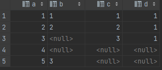
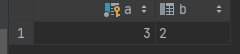
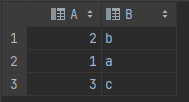
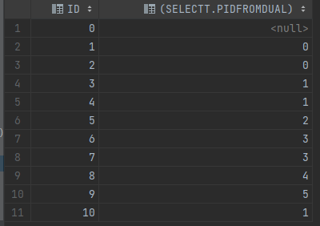
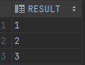
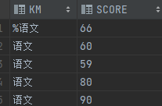
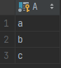

# Oracle 知识点

### 1、错误信息中英文之间的切换

```
#1、中文切换为英文
alter session set nls_language = 'American';

#2、英文切换为简体中文
alter session set nls_language = 'simplified chinese';
```

<hr></hr>

### 2、sysdate问题

```
#1、作用：获取当前系统的时间（年月日时分秒）
#2、sysdate相关的运算：
	a、sysdate+1；			-- 当前时间加一天
	b、sysdate+1/24；			-- 当前时间加一个小时
	c、sysdate+1/24/60； 	 	-- 当前时间加一分钟
	d、sysdate+1/24/60/60；	-- 当前时间加一秒
```

<hr></hr>

### 3、dual

```
oracle中dual是一个单行单列的虚拟表
```

<hr></hr>

### 4、varchar2和nvarchar2的注意

```
（1）当使用varchar(5)
	如果存入的是字母或者数字，那么一个长度可以存放一个数字或者字母
（2）当使用nvarchar(5)，如果存入的是数字或者字母，那么一个长度可以存放一个数字或者字母。如果存放的是汉字的话，那么也是一个长度可以存放一个汉字
```

<hr></hr>

### 5、date和timestamp的强转问题

```
#1、date的强制转换问题
（1）select date '2022-12-12' from dual;
	注：只有形如‘YYYY-MM-DD’的字符串才可以使用（date 字符串）的格式进行转换
（2）select to_date(字符串，字符串格式) from dual;
	注：字符串格式表示的范围一定要大于等于字符串
	select to_date('2022-12-12','YYYY-MM-DD') from dual;			正确
	select to_date('2022-12-12','YYYY-MM-DD hh24:mi:ss') from dual;	正确
	select to_date('2022-12-12 12:21:12','YYYY-MM-DD') from dual;	错误
	
#2、timestamp
（1）select timestamp '2022-12-12 12:21:21' from dual;
	注：只有形如‘YYYY-MM-DD HH:MI:SS’才可以使用（timestamp 字符串）进行格式的强制转换
（2）select to_timestamp(字符串，字符串格式) from dual;
	注：字符串格式表示的范围一定要大于等于字符串
	select to_timestamp('2022-12-12','YYYY-MM-DD') from dual;				正确
	select to_timestamp('2022-12-12','YYYY-MM-DD hh24:mi:ss') from dual;	正确
	select to_timestamp('2022-12-12 12:21:12','YYYY-MM-DD') from dual;		错误
```

<hr></hr>

### 6、分组问题

```
###重要###：
（1）oracle中的分组需要遵守一个规则，那就是使用group by分组之后，那么select中的字段必须是group by的字段，如果不是group by的字段，那么这个字段就必须配合聚合函数使用。否则的话就会报不是分组表达式的错误。
（2）oracle的select列表中一旦出现了聚合函数,并且还出现了其他的字段，就必须使用分组。光使用聚合函数但却不分组（group by），会报错


比如说，现在存在一个表tab，含有三个字段a，b，c。
	（1）select * from tab group by a;			错误
	（2）select a from tab group by a;			正确
	（3）select count(b) from tab group by a; 	正确
	（4）select a,b from tab group by a;			错误
	（5）select count(1),a,b from tab ;			错误（select中出现聚合函数，则该sql语句必须要进行分组）
```

<hr></hr>

### 7、on和and问题

（1）存在两个表test和test2

| 表名  | 表结构                                                       |
| ----- | ------------------------------------------------------------ |
| test  |  |
| test2 |  |

（2）三个查询

| SQL                                                          | 图片                                                         |
| ------------------------------------------------------------ | ------------------------------------------------------------ |
| select * from test <br />left join test2 on test.a = test2.c ; |  |
| select * from test left join test2 on test.a = test2.c and test2.d = 1; |  |
| select * from test left join test2 on test.a = test2.c and test.b is not null ; |  |

（3）结论

```
1、左连接查询
	a、当and后面的条件限制是针对左表的话，那么左表这些被约束的数据不会参与连表，但是仍会出现在最终的结果中
	b、当and后面的条件限制是针对右表的话，那么右表这些被约束的数据不会参与连表，并且不会出现在最终的结果中
	
2、右连接查询
	a、当and后面的条件限制是针对右表的话，那么右表这些被约束的数据不会参与连表，但是仍会出现在最终的结果中
	b、当and后面的条件限制是针对左表的话，那么左表这些被约束的数据不会参与连表，并且不会出现在最终的结果中
	
3、内连接查询
	不论针对的是左表还是右表的数据，约束的数据都不会出现在最终结果中
```

<hr></hr>

### 8、物理表，虚拟表

```
（1）物理表
创建后永久存在在磁盘上的表，用于长期保存数据使用
```

```
（2）虚拟表
虚拟表本质上就是视图（物化视图是特殊的物理表），而视图的本质就是一个查询sql，对视图的查询相当于对一个sql进行子查询。

比方说存在一个视图view1，view1是由select * from table1;获取的。现在我们想查询这个视图，使用select * from view1;这个查询实际上是转化成了select * from (select * from table1);进行查询的，所以说视图对于提高查询速度上没有本质的影响
```

<hr></hr>

### 9、Null产生的问题

```
SQL中null不支持大小和等于的比较。
a、对于任何与null的比较结果全部为null或者说是未知，未知就是可以true也可以false，未知结果是不会被筛选出来的。
b、null与任何结果and结果均为null或者未知，与任何结果or结果取决于其他的结果

比方说：
	select * from test where a = null; -> 结果就是什么也查不出来，a=null不为true也不为false
	select * from test where a > null; -> 结果就是什么也查不出来，a>null不为true也不为false
```

| 解释                                                         | 图片                                                         |
| ------------------------------------------------------------ | ------------------------------------------------------------ |
| 先存在一个test1表<br />表结构如图                            |  |
| select * from test1 where b = null;                          |  |
| select * from test1 where b > null;                          |  |
| select * from test1 where a != b;<br />其中的a = 4 和 a = 5没有筛选出来，原因<br />就是4 != null 和 5 != null全是未知，所以<br />不会被筛选出来 |  |
| select * from test1 where b not in (1,null);<br />因为这个sql可以拆分成<br />select * from test1 where b= 1 and b = null;<br />而任何结果与null做and比较的话结果均为null<br />不会被筛选出来 |  |
| select * from test1 where b in (1,null);<br />因为这个sql可以拆分成<br />select * from test1 where b= 1 or b = null;<br />而任何结果与null做or比较的话结果不取决于null |  |

```
注意：那怕是null = null的结果也是未知的，未知就是可以是任何值，所以null = null可以为true也可以为false
```

<hr></hr>

### 10、分组后的附加运算

现存在一个表test1，数据如下：

|  |
| ------------------------------------------------------------ |

#### （1）rollup

```
a、rollup的作用：为参与分组的字段添加一个汇总值
```

| SQL                                                   | 图片                                                         |
| ----------------------------------------------------- | ------------------------------------------------------------ |
| select b,count(*) from TEST1 group by rollup(b);      |  |
| select b,c,count(b) from test1 group by rollup (b,c); |  |

```
解析：
	a、对于第一个sql来说对b字段进行分组然后进行附加运算，所以最终b字段分组后有两个结果0和1，然后他们的数量分别为2和3.由于附加运算的存在所以为参与分组的b字段进行了一次汇总字段值为null，数量为5
	b、对于第二个sql来说先对b进行分组，所以rollup会先对b字段进行汇总，汇总字段值为null，数量为5.然后在每个分好组的b字段的基础上在对c字段进行分组，然后由于b分组之后有两组，所以rollup之后会对c字段进行两次汇总，汇总字段的值都是null，数量分别为2和3
```

<hr></hr>

### 11、select查询列表问题

#### （1）问题1

```
现存在一个表test,其中含有a，b，c三个字段

mysql：
select *,a from test; -> 正确

oracle：
select *,a from test; -> 错误
注意：
	a、oracle中select中*后面必须得是from。如果*后面不是from会报：ORA-00923: 未找到要求的 FROM 关键字
	b、oracle中如果select列表中如果存在*，那么如果再出现其他字段，则*前必须要加上表的别名
		·· select *,rownum from test; => 错误
		·· select a.*,rownum from a.test; => 正确，由此可发现如果*前加了表的别名，那么*后就可以不是from
总结：oracle中的*要么单独出现，如果不是单独出现，那么一定要在*前加上表的别名
```

#### （2）问题2

```
select列表中可以使用的三种情况：
	a、具体的字段（比方说a，b，c）
	b、表达式（比方说聚合函数，字符串拼接表达式之类）
	c、select查询（注意：select列表中含有select查询，那么这个查询的结果必须要保证是一行一列，否则报错）
	select a,b,c,(select 'test' from dual) from test;
	注意：如果采用这种在select后面添加select查询的方式，那么生成的结果集的每一行可能都要执行一下这个查询，如果数据量比较大的情况下，查询的效率会非常的低下
```

<hr></hr>

### 12、排序问题

```
（1）排序之前oracle优化器会根据数据量（不是数据的数量而是数据的字节大小）的大小决定排序的位置
（2）一般情况下较小的数据量会在内存中完成排序，而大的数据量会在临时磁盘中完成排序。而内存中排序会比在磁盘中排序速度快的多。
（3）一般情况下，排序操作在一个sql查询中是开销非常大的，所以如果是优化的话可以考虑从排序上入手
```

<hr></hr>

### 13、null和''的关系

```
在oracle中，oracle会将''空字符串看作是null
```

| SQL                                     | 图片                                                         |
| --------------------------------------- | ------------------------------------------------------------ |
| select '' from dual;                    |  |
| insert into test1 (a, b) values (3,''); |  |

<hr></hr>

### 14、插入

#### （1）单表插入

```
a、通过values子句实现
insert into test (a,b) values (1,2);

b、通过子查询实现
insert into test select * from test_temp;
insert into test select * from test_temp1 union all select * from test_temp2;
```

#### （2）多表插入

*<u>**a、现存在表test1，test1_1，test1_2**</u>*

| 表名    | 数据                                                         |
| ------- | ------------------------------------------------------------ |
| test1   |  |
| test1_1 |  |
| test1_2 |  |

*<u>**b、当执行**</u>*

```
insert first

when b < 60 then into test1_2
when b >= 60 then into test1_1

select a,b
from TEST1;
```

| 表名    | 数据                                                         |
| ------- | ------------------------------------------------------------ |
| test1_1 |  |
| test1_2 |  |

**<u>*c、first和all的区别*</u>**

```
（1）all
每次执行when之后，不论when后是true还是false，都会继续向下判断下面的when

（2）first
每次执行when之后，如果when是true，则不会再往下判断下面的when。然后继续看下一条数据


总结：all和first的区别相当于java中switch语句case后是否加break，all相当于不加break，而first相当于加break
```

***<u>d、补充</u>***

```
insert first

when b < 60 then into test1_2(b,a)
when b >= 60 then into test1_1(b,a)

select a,b
from TEST1;

***可以通过指定待插入表的字段，来实现灵活的插入数据。
```

<hr></hr>

### 15、表数据备份

（1）法1

```
insert into test_bf
select * from test;

**注意**
（1）test：需要备份的表
（2）test_bf：备份后的表
（3）两张表的字段类型和数量要保持一致
```

（2）法2

```
create table test_bf as
select * from test;

**注意**
（1）test：需要备份的表
（2）test_bf：备份后的表
（3）两张表的字段类型和数量要保持一致
```

<hr></hr>

### 16、特殊update操作

*<u>**现存在两张表**</u>*

| 表名    | 数据                                                         |
| ------- | ------------------------------------------------------------ |
| test1_1 |  |
| test1_2 |  |


#### （1）一列值

```
update test1_2 set b = (select test1_1.b from test1_1  where test1_1.a = test1_2.a)  where 1=1;
```

| 结果（test1_2）                                              |
| ------------------------------------------------------------ |
|  |


<font color = 'red'>*--更新过程--*</font>

```
*数据的更新是一条一条的更新的*，也就是说先更新test1_2表的第一条，开始set的时候又开始子查询，使用test1_2表中要更新的那一行的a的值与test1_1连表，查询出test1_1表中对应a值的b的值，而这个b的值就是要设置的值。这里需要注意的是如果test1_2表的a在test1_1表中匹配不到的话，那么如果test1_2表中b后面要是有数据的话会被直接置为null。然后一次类推，逐行的更新数据。
```


<font color='red'>-注意（这种更新方法可能出现的bug）-</font>

| test1_1                                                      |
| ------------------------------------------------------------ |
|  |
| test1_2                                                      |
|  |

此时如果执行

```
update test1_2 set b = (select test1_1.b from test1_1  where test1_1.a = test1_2.a)  where 1=1;
```

当更新到test1_2表中的a=6这一行数据的时候，由于子查询的时候发现test1_2表中的a=6的数据在test1_1中无法匹配到，所以set b的时候，test1_2表中a=6的那一行数据就会被修改成null

#### （2）一行值

```
update test1_2 set (a,b) = (select test1_1.a,test1_1.b from test1_1  where test1_1.a = test1_2.a)  where 1=1;
```

| 结果（test1_2）                                              |
| ------------------------------------------------------------ |
|  |

#### （3）一张表

```
update (select test1_1.b b1,test1_2.b b2
        from test1_1,test1_2 where test1_1.a = test1_2.a
       )  set b1 = b2 where 1=1;
```

| 结果（test1_1）                                              |
| ------------------------------------------------------------ |
|  |

<font color = 'red'>-注意-</font>

这种更新方法既适用于单表，也适用于多表

```
（1）单表
update (select a,b from test1_1 ) set b = a where 1=1;

（2）多表
update (select test1_1.b b1,test1_2.b b2
        from test1_1,test1_2 where test1_1.a = test1_2.a
       )  set b1 = b2 where 1=1;
```

<hr></hr>

### 17、`merge into`

**<u>merge语句的优势</u>**

1. merge语句整体是原子性的，要么同时成功，要么同时失败
2. merge语句将多个增删改合并成一条数据，减少往返数据库的次数
3. oracle对merge语句进行的优化，处理大量数据性能很高，推荐使用

```
1、结构

merge into 目标表  alias1            --目标表 可以用别名
using (数据源表) alias2      		 --数据源表：表、视图、子查询
on (判断是否匹配的条件)               --关联条件
when matched then             	    --当关联条件成立时
  --更新
  update set  col1=colvalue  where……
  --删除  
  delete from table_name  where……
when not matched then                --当关联条件不成立时   
  --插入
  insert values (col3values)  where…… 
```

#### 2、注意

- `merge into`语句中的增删改针对的都是目标表，与源表无关
- `when not matched then`接`insert`语句
- `when matched then`接`update`语句
- `merge into`语句不会自动提交，执行完毕之后需要手动提交


<hr></hr>

### 18、having 和 group by 顺序问题

```
--总结--
having和group by没有顺序问题，也就是说having，group by谁在前谁在后没有区别
```

<hr></hr>

### 19、绑定变量问题

```
--问题引出--

由于在oracle中存在共享池这一概念，也就是说已经执行过的sql的解析内容会被缓存在共享池中。当再次执行完全一样的sql的时候，会优先判断共享池中是否存在一样的sql，存在的话执行软解析，不存在执行硬解析。而硬解析需要费更多的时间。
```

```
--相同的sql--

（1）区分大小写。 select * from tab;和 SELECT * FROM TAB;是两个不同的语句。所以在共享池中会被存储两条
（2）sql中添加注释和不添加注释也是完全不一样的sql。 select /*注释*/ * from tab;和select * from tab;是两个完全不一样的sql
```

```
--oracle中查看共享池中的sql--

select * from v$sql;
v$sql是存储共享池中sql的一个视图
```

```
--oracle中绑定变量--

select * from tab where id = :a;
在这里a就是绑定的变量。你在客户端执行执行这句sql会要求你为变量a赋值。这样的话不论你赋多少值给a，在共享区域内均存在一个sql
```

```
--#{}和${}的问题--

在sql中使用#{}就相当于绑定变量。在mybatis中使用select * from tab where id = #{id}; 不论id赋值多少次，实际共享区域存储的sql只有一条。
而在sql中使用${}，比如说select * from tab where id = ${id}; 这样的话id赋值多少次就会产生多少sql，对于提高查询效率没有好处
```

<hr></hr>

### 20、数据块

```
（1）数据块是oracle最小的操作单元，也是最小的io单元
（2）oracle数据库数据的查询或者数据的添加都是要先经过数据块的。
（3）当进行查询数据的时候，先去内存中共享池中的数据缓冲区查找是否有相应的数据块，有的话直接使用，这一过程称之为逻辑读取。如果数据不存在的时候，就需要oracle从磁盘中将数据读取出来以数据块的形式存放至缓冲区，再从缓冲区中读取数据块返回，这一过程称之为物理读取。很明显逻辑读取远远快于物理读取
```

<hr></hr>

### 21、表作用范围问题

***<u>先存在一个表test</u>***

| test                                                         |
| ------------------------------------------------------------ |
|  |

*<u>**两个查询**</u>*

| select id,(select t.PID from DUAL)<br/>from TEST t;          | select id,(select * from (select t.PID from DUAL))<br/>from TEST t; |
| ------------------------------------------------------------ | ------------------------------------------------------------ |
| <br /><br />t.PID就是test表中的pid | 提示t.PID标识符不存在                                        |

<hr></hr>

### 22、SQL中的谓语

```
（1）SQL中的谓语主要指的是where或者having后面的条件
（2）SQL中的主要谓语有like，is null，is not null，between，exists，not exists，in，not in
```

<hr></hr>

### 23、分组排序函数

```
1、作用
	分组后排序
```


```
2、格式
	row_number() over (partition by col1 order by col2)
	
注意：
	（1）col1是参与分组的字段，col2是分组后排序的字段
	（2）partition by相当于group by，但是有区分详见"25"
	（3）row_number() over (partition by col1 order by col2) 最终的结果是行号。每个组的行号都是从1开始的
```


| 3、演示                                                      |
| ------------------------------------------------------------ |
| 分组排序前<br />select *<br/>from TEST;                      |
|  |
| 分组排序后<br />select *row_number*() over (partition by KM order by SCORE desc ) rank, KM, SCORE<br/>from TEST; |
| <br />可以看出每一个新组排序编号都是从1开始的 |

<hr></hr>

### 24、Oracle索引底层实现

1、表在磁盘上的存储形式

```
表中有聚簇索引和没有聚簇索引的在磁盘上的存储形式是不一样。没有聚簇索引的话就是跟普通的表格一样，一行一列。有聚簇索引的话，那么就会根据聚簇索引生成一个树状结构，其中的叶子节点下存放的就是每个主键所对应的那一行的行数据
```

| 表中有无聚簇索引在磁盘上的存储形式                           |
| ------------------------------------------------------------ |
| a、没有聚簇索引（没有主键）                                  |
| <br />与普通的表结构没有区别 |
| b、有聚簇索引                                                |
| <br />表以树状结构的形式存储，叶子节点下挂着行数据 |


2、通过主键查询数据行的过程

|  |
| ------------------------------------------------------------ |

```
通过主键查询，走聚簇索引，从根节点开始查询，按照小在左，大在右的规则找到叶子节点的位置，而叶子节点下挂的就是主键所对应的一整行的数据
```

```
通过索引可以大幅的提高查询效率，根本原因就是树状的数据结构可以快速的过滤大量的数据。但是表中过多的索引会导致DML的效率变低。
因为如果没有树状结构，表在磁盘上就是以普通表结构的形式存储的话，进行DML的话就是对表结构做简单的删一行，加一行。但是如果是树状结构的话，在每次DML操作之后，为了保证树状结构的正确性，都会花费一定的系统资源来保证其正确性。而建立的索引越多花费自然也就越多。所以说索引虽然可以提高查询效率，同时也会降低增删改的效率
```


3、不同类型索引的数据结构

```
（1）不光聚簇索引（一个表中只能有一个聚簇索引）会在磁盘上维护一个树状的数据结构，非聚簇索引也会。
（2）每新建一个非聚簇索引，都会用建立非聚簇索引的字段的所有数据，构成一个树状数据结构，此时叶子节点下挂的不是行数据，而是索引字段的这个数据所在行的主键值。
（3）由于每建一个非聚簇索引都会将字段所对应的数据全部取出，重新建立一个该字段的树状结构。所以建立过多的索引会导致表的体积增大，占用磁盘空间
```

|  |
| ------------------------------------------------------------ |


4、非聚簇索引获取行数据

```
从非聚簇索引的根节点开始找到叶子节点上所对应的主键值，然后利用这个主键值去主键的树状结构中查出一整行数据
```

|  |
| ------------------------------------------------------------ |

<hr></hr>

### 25、partition by 和 group by的区别

<font color=red>group by将多行汇总成一行，partition by为每行进行汇总</font>

```
（1）group by属于分组函数，partition by属于分析函数
```

```
（2）一般sql的执行顺序：where -> group -> having -> order by -> select 
	而partition by的执行顺序在select之后
```

```
（3）group by 分组之后select列表中只能使用分组字段和聚合函数
	partition by 分组之后select列表中可以使用任何表中已有的字段
```

| 演示                                                         |
| ------------------------------------------------------------ |
| （1）原始表                                                  |
|  |
| （2）group by<br />······对class进行分组之后发现score不能放在select列表中，因为score不是分组字段 |
|  |
| （3）partition by<br />······由下图可知，使用partition by分组之后仍可以展示非分组字段 |
| <br /> |

```
（4）对某一字段分组就是根据字段的值，将相同值化为一组。不同的值就会产生多组数据。
	
	a、使用group by之后，每一组中相同的数据的分组字段会变成一个。
	比方说：
	a	b
	1	11
	1	22
	2	33
	对这张表的a进行分组的话会分成两组：
	一组：
	a	b
	1	11
	1	22
	二组：
	a	b
	2	33
	而在使用group by之后所有组中的a会变成一条记录
	一组：
	a	b
	1	？
	二组：
	a	b
	2	？
	
	由于变成了由之前的多条变成了现在的一条，原本相同的a的值对应多条不同的b值，分组之后如果仍能使用b这一字段，那么在展示的时候与a=1相对于的b值，不知该展示11还是22，所以说group by分组之后，只能使用分组字段或者聚合函数对分组后的一列数据进行计算
	
	b、使用partition by进行分组，使用聚合函数需要注意
	由于partition by分组之后仍可以使用其他的字段值，那么其他字段不同的值与分组字段匹配之后，必然会产生多行。
	比方说：
	a	b
	1	11
	1	20
	2	33
	使用partition by分组后：
	a	b
	1	11
	1	20
	2	33
	那么此时假如说我们在使用聚合函数对b进行求和的话，那么分组值的和为31，那么每个1之后都要是31：
	a	b	分组后
	1	11	31
	1	20	31
	2	33	33
```

<hr></hr>

### 26、存储过程中非空判断

```
（1）存在表（tab）：
	a	b
	1	11
	2	22
	
（2）情形1：
	select a into test from tab where b = 33;
	 ···然后通过a是否为null来判断表tab中是否存在b=33这条数据，但是这个如果将一个null值赋值给一个变量的话就有可能出现赋予空值的异常.所以不能采用这种方法

（3）情形2：
	select count(a) into test from tab where b = 33;
	...如果不存在b=33这条数据的话结果就是0，当不是0的话就说明存在。采用这种方法的话就不会出现这个问题

（4）结论：
	一般采用count的形式看数据的条数是否为0，而不是直接让一个变量接受一个空值，然后判断是否为空
```

<hr></hr>

### 27、列转行,行转列

#### （1）列转行

```
使用：listagg()函数
```

| 演示                                                         |
| ------------------------------------------------------------ |
| a、先存在表 "test5"                                          |
|  |
| b、将a字段一列拼接成一条数据 select *listagg*(a,',') within group ( order by a) from test5; |
|  |
| c、将a字段一列，根据b字段的排序，拼接成一条数据 select *listagg*(a,',') within group ( order by b) from test5; |
|  |

#### （2）行转列

```
使用：

SELECT
    regexp_substr('1,2,3', '[^,]+', 1, level) result
FROM
    dual CONNECT BY level <= (regexp_count('1,2,3','\,')+1);
```

| 演示                                                         |
| ------------------------------------------------------------ |
| 执行后：<br />SELECT *REGEXP_SUBSTR*('10,20,30', '[^,]+', 1, LEVEL, 'i') AS TEST<br/>FROM DUAL<br/>CONNECT BY LEVEL <= *LENGTH*('10,20,30') - *LENGTH*(*REGEXP_REPLACE*('10,20,30', ',', ''))+1 |
|  |

<hr></hr>

### 28、转义字符

```sql
1. 转义单引号
	SELECT 'I''m using Oracle database.' FROM dual;
	=> I'm using Oracle database.
	=> 字符串中两个连续的单引号相当于一个单引号;

2. 转义双引号
	SELECT 'This is a ""quoted"" string.' FROM dual;
	=> This is a "quoted" string.
	=> 字符串中两个连续的单引号相当于一个单引号;

3. 转义反斜杠
	SELECT 'C:\\Program Files\\Oracle' FROM dual;
	=> C:\Program Files\Oracle
	=> 字符串中两个连续的单引号相当于一个单引号;

4. 转义特殊字符：一些特殊字符在 SQL 查询中具有特殊的含义，如通配符（%和_）和换行符等。如果你想在字符串中使用这些字符而不是作为特殊的含义，可以使用 ESCAPE 关键字来转义
```

| Escape使用演示                                               |
| ------------------------------------------------------------ |
| 1、存在表Test，现在想查询以"%语文"开头的数据                 |
|  |
| 2、第一种查询：select * from TEST where KM like '%语文%';    |
| <br />由于%具有模糊匹配的作用，所以%语文%相当于查找km字段中含有语文的数据，导致查询有误 |
| 3、第二种查询：select * from TEST where km like '\%语文%' escape '\\'; |
| <br />使用escape关键，对特殊字符进行转义，让特殊字符仅作字符使用 |

<hr></hr>

### 29、rowid和rownum的区别

#### （1）rownum

a、rownum是oracle中的一个伪列

```
oracle中的伪列就是oracle为查询出的数据集自动添加的一列数据。
伪列由于是oracle自动添加的一列所以伪列可以直接使用。
比方说：select obj.*,rownum from test obj; 虽然表test中没有rownum这个字段，但也可以直接使用
```

b、rownum是添加在结果集上的伪列，所以先有结果集后添加rownum

c、rownum不是固定的，但一定是从1开始的

```
比方说，现存在一张表test
A	B
1	1
2	2
3	3	
4	4	
5	5

select obj.*,rownum from test obj; 
结果：
A	B	ROWNUM
1	1	1
2	2	2
3	3	3
4	4	4
5	5	5

select obj.*,rownum from test obj where obj.a > 2; 
结果：
A	B	ROWNUM
3	3	1
4	4	2
5	5	3

总结：由此可以发现rownum针对不同的结果集是变化，但是rownum总是从1开始
```

d、rownum不推荐使用>,>=,=，推荐<,<=,!=，不然可能一条数据都查询不出

```
现存在一张表test
A	B
1	1
2	2
3	3	
4	4	
5	5

·· 如果使用（>）
	比方说：select * from test where rownum>2;
	执行完select * from test后会将五条数据全部取出，然后使用where进行过滤，过滤进行判断是对结果集进行逐行判断的，第一行rownum=1，不满足rownum>2所以会过滤掉。过滤完一条数据之后，生成新的结果集，oracle就会重新生成rownum伪列，所以原本的rownum=2的一行，又会变成rownum=1，所以又会被过滤掉，依次类推，当开始过滤最后一条数据的时候rownum仍然为1，仍会被过滤掉。所以最终会一条数据也查询不出。造成这一问题的原因就是rownum=1位置的数据一直被过滤掉，而结果集又必须从1开始，所以就会导致所有数据都会被过滤掉
	
·· 如果使用（>=）
	比方说：select * from test where rownum>=2;
	最终也会什么也查询不出，原因就是rownum=1一直会被过滤，而rownum必须从1开始，所以所有数据都会被过滤掉
	比方说：select * from test where rownum>=1;
	这个需要注意的一点是，当从第一条数据开始进行过滤的时候，rownum满足rownum>=1，当有一条数据为rownum=1的时候，后面的也都满足，所以这种写法等同于select * from test;
	
·· 如果使用（=）
	比方说：select * from test where rownum=2;
	同理，当对结果集进行过滤的时候，rownum=1的时候由于一直不等于2会被不断过滤最终什么也查询不出
	比方说：select * from test where rownum=1;
	会将结果集的第一行返回

·· 如果使用（<,<=）
	由于<,<=会保证rownum=1的存在，所以不会出现一条数据都查不出的情况

·· 如果使用（!=）
	比方说：select * from test where rownum!=3;
	这种写法相当于:select * from test where rownum<3;
	当执行完select * from test之后获取了待过滤的结果集，当rownum=1的时候满足rownum!=3，所以会保留，rownum=2也满足也会保留，但是当rownum=3的时候不满足rownum!=3，所以会去除，结果集变了，所以重新赋予rownum，之前rownum=4的数据，会变成rownum=3，也会被过滤掉，依次类推2之后的所有数据会被过滤掉
```

e、rownum和order by同时使用，rownum优先于order by

```
现存在一张表test
A	B
1	1
2	2
3	3	
4	4	
5	5

select obj.*,ROWNUM from test2 obj order by a desc;
按照rownum是oracle对结果集添加的伪列可以预测一下最终的查询结果：
A	B	ROWNUM
5	5	1
4	4	2
3	3	3
2	2	4
1	1	5

A	B
5	5
4	4
3	3
2	2
1	1
A和B是 select obj.* from test2 obj order by a desc的查询结果，然后在他的基础上添加上伪列rownum，则就是上述结果

但是实际上结果却是：
A	B	ROWNUM
5	5	5
4	4	4
3	3	3
2	2	2
1	1	1 
由此可以说明是在执行完 select obj.* from test2 obj order by a desc 的时候伪列rownum就被加上了，然后再进排序，导致第一行的rownum不是1
```

#### （2）rowid

```
oracle中每一张数据表都会存在伪列rowid，用来唯一标识某一行数据，只要行数据存在，那么这一行的rowid就不会变
```

<hr>

### 30、递归查询理解

```
现存在一张表Test
pre		suf
1		2
2		3
3		4
4		5
5		6
6		7	

四种情形：
（1）select * from test pre = 3 connect by prior pre = suf;
	理解：将“select * from test pre = 3”查询结果中的pre，放入prior中的pre中。然后查询“select * from test suf = 3”。再将它的查询结果中的pre再次放入prior中的pre，以此类推
	结果：
		pre 	suf
		3		4
		2		3
		1		2
		
（2）select * from test pre = 3 connect by prior suf = pre;
	理解：将“select * from test pre = 3”查询结果中的suf，放入prior中的suf中。然后查询“select * from test pre = 3”。再将它的查询结果中的suf再次放入prior中的suf，以此类推
	结果：
		pre 	suf
		3		4
		4		5
		5		6
		6		7
		
（3）select * from test suf = 3 connect by prior pre = suf;
	理解：将“select * from test suf = 3”查询结果中的pre，放入prior中的pre中。然后查询“select * from test suf = 3”。再将它的查询结果中的pre再次放入prior中的pre，以此类推
	结果：
		pre 	suf
		2		3
		1		2
		
（4）select * from test suf = 3 connect by prior suf = pre;
	理解：将“select * from test suf = 3”查询结果中的suf，放入prior中的suf中。然后查询“select * from test pre = 3”。再将它的查询结果中的suf再次放入prior中的suf，以此类推
	结果：
		pre 	suf
		2		3
		3		4
		4		5
		6		7
```

<hr>

### 31、保留原始数据的统计方式

```
现存在表Test2
```

| a    | b    |
| ---- | ---- |
| 1    | 10   |
| 2    | 6    |
| 3    | 4    |
| 2    | 3    |

<u>**需求：统计a字段中，每个值的b小于10的个数**</u>

> 方式1

```sql
select a,count(1) from test2 where b < 10 group by a;
```

注意：根据sql的执行过程from，where，group，select。使用这种方式会将不满足b<10的数据排除。那么最终分组的时候a=1就不会被分组。最终结果：

| a    | count |
| ---- | ----- |
| 2    | 2     |
| 3    | 1     |

> 方式2

```sql
select a,count(case when b < 10 then 1 end) from test2 group by a;
```

注意：使用这种方式所有的原始数据都会得到保留，只是最终执行select开始统计数据

`case when b < 10 then 1 end)` 中b<10 时返回 1，否则返回空值。`COUNT` 聚合函数会统计非null的个数

<hr>

### 32、connect by 单独使用

> 生成连续数字序列

（1）基本使用

```sql
select LEVEL from DUAL connect by LEVEL <= 3;
```

（2）使用情形

<u>a、通过笛卡尔积可以为表中的每一条数据添加一列取值为1-n的数据</u>

```sql
-- 存在表Test
INSERT INTO YGBING.TEST (A) VALUES ('a');
INSERT INTO YGBING.TEST (A) VALUES ('b');
INSERT INTO YGBING.TEST (A) VALUES ('c');

-- 表中每一条数据添加1，2，3
select * from TEST,(select LEVEL l from DUAL connect by LEVEL <= 3);
```

| Test表                                                       |
| ------------------------------------------------------------ |
|  |
| **查询结果**                                                 |
|  |

<u>b、将某一行数据转化成一列数据</u>

```sql
-- 存在表Test
INSERT INTO YGBING.TEST (ID, A, B, C) VALUES (1, 'a', 'b', 'c');
INSERT INTO YGBING.TEST (ID, A, B, C) VALUES (2, 'aa', 'bb', 'cc');

-- 将a，b，c 三个字段根据其对应的id转化成一列数据
select id,
       case
           when l = 1 then a
           when l = 2 then b
           when l = 3 then c
           end
from (select *
      from TEST,
           (select LEVEL l from DUAL connect by LEVEL <= 3));
```

| Test表                                                       |
| ------------------------------------------------------------ |
|  |
| **查询结果**                                                 |
|  |
| 数据结构生成流程：<br />1、Test表和通过connect by生成的数字序列虚拟表做笛卡尔积。Test表中的每一条数据都会和虚拟表中的数字序列匹配<br />2、当数字=1，则展示a字段；数字=2，则展示b字段；数字=3，则展示c字段.<br />注意:这种写法那么要求一列展示的的字段的数据类型是一样 |

> 生成指定时间序列

```sql
select sysdate+1 from DUAL connect by LEVEL <= 3;
```

<hr></hr>


### 33、exception使用注意

1. exception必须被放在`begin-end`代码块之间使用

   ```sql
   -- 正确使用
   begin
   	exception
   		when others then
   			rollback;
   end;
   ```

   ```sql
   -- 错误使用
   begin
   	for i in 1..10 loop
   		-- 必须要放在begin-end代码块之间
   		when others then
   			rollback;
   	end;
   end;
   ```

2. exception使用之前必须要有其他代码

   ```sql
   -- 正确使用
   begin
   	dbms_output.put_line('前置语句');
   	exception
   		when others then
   			rollback;
   end;
   ```

   ```sql
   -- 错误使用
   begin
   	-- begin-end之间直接使用exception会报错
   	exception
   		when others then
   			rollback;
   end;
   ```

3. 预定义异常处理

   ```sql
   /* 处理自定义异常 */
   
   declare
   	-- 声明自定义异常·
   	my_exception exception;
   begin
   	-- 抛出异常
   	raise my_exception;
   	
   	exception
   		when my_exception then
   			rollback;
   end;
   ```

   ```sql
   /* 处理预定义异常 */
   
   declare
   	table_row TABLE_NAME%rowtype;
   begin
   	-- 此时会抛出太多数据的异常对应预定义异常中的：too_many_rows
   	select * into table_row where id in (1,2);
   	
   	exception
   		when too_many_rows then
   			rollback;
   end;
   ```

   **<u>常用的预定义异常</u>**

   | 预定义异常名  | 产生原因                               |
   | ------------- | -------------------------------------- |
   | no_data_found | select into 没有获取到数据             |
   | too_many_rows | select into 获取多行数据给一个变量接收 |


### 34、

