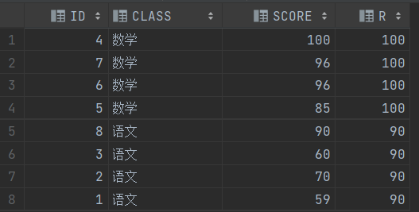

# 	Oracle 笔记

## 一、Oracle基础知识

### 	1、基本概念

- TBALENAME：表空间。一个数据库有若干个表空间(Oracle有默认的几个表空间)。一个表空间中有多个数据库文件(dbf后缀文件)组成，但是一个数据库文件只能属于一个表空间。
- USER：用户。用户所持有的是系统的资源和权限。
- SCHEMA：对象。
  1. schema是user所持有的数据库对象的一个逻辑集合。
  2. 刚创建完用户之后schema是不存在的，只有当在该用户下创建了第一个数据库对象的时候schema才会存在。每个user都有一个与user同名的schema，user和schema一一对应。
  3. oracle中不存在创建或者删除schema的操作。
  4. 在访问数据库对象的时候，比方说`select * from my_table;`，实际上是`select * from current_user_schema.my_table;`。实际上访问的是当前user的schema中的数据库对象。
  5. user1可以访问user2的schema中的数据库对象，前提是user2授权user1访问。
  6. <font color=skyblue>user和schema之间关系的理解：user可以比作一个人，schema是人的房子，数据库对象是房子中的物件。其他人如果被你授权的话，就可以使用你房子中的物件。</font>
- NAMESPACE：命名空间。
  1. 每个schema都有一个与之对应的namespace，所以可以将schema理解为namespace。
  2. 命名空间的作用主要是为了保证在同一个命名空间下数据库对象名不可重复，不同的命名空间下数据库对象名可以重复。
  3. 注意数据库对象分为受schema局限的对象和不受schema局限的对象。
     - 受schema局限的对象：tables，views，sequences，procedures，functions，packages，materialized views，这些对象受一个命名空间约束。
     - 不受schema局限的对象：indexs，triggers，这些对象受一个表空间约束。
     - <font color=red>综上：在一个schema中表名和索引以及触发器名可以一样。</font>


### 2、权限问题

<font color=pink>新建的用户没有任何权限，需要system和sys赋予其权限。需要注意的是不论赋予新建用户多么高的权限，都不可能超过sys的权限，哪怕赋予所有的权限。除了sys之外其他所有用户的权限都是可以更改的，包括system用户。sys用户不可删除，不可改名。</font>

**<u>oracle中的权限分为系统权限和对象权限</u>**：

1. 系统权限：DBA，RESOURCE，CONNECT。DBA是最高的权限可以创建数据库结构，RESOURCE只有创建实体的权限，CONNECT只有登录的权限
2. 对象权限：对象权限主要针对数据库对象的权限，比如说表；SELECT，UPDATE，INSERT，DELETE，ALL(<u>全部权限</u>)等


### 3、表前缀: DBA,ALL,USER

- DBA_：代表所有，例如dba_tables代表的就是数据库中的所有表
- ALL_：代表当前用户拥有以及可以使用的，例如all_tables代表当前用户自己拥有的表以及可以访问的其他用户的表
- USER_：代表当前用户拥有的，例如user_tables代表当前用户自己拥有的表

### 4、数据库对象

1. **表(Tables)**:
   - 数据存储的基本单元,由行和列组成。
2. **视图(Views)**:
   - 基于一个或多个表的虚拟表,提供了一种数据抽象层。
3. **序列(Sequences)**:
   - 用于生成唯一的数字序列,通常用于主键的自动生成。
4. **索引(Indexes)**:
   - 用于提高数据查询的性能。
5. **同义词(Synonyms)**:
   - 为数据库对象提供替代名称,用于简化对象引用。
6. **存储过程(Stored Procedures)**:
   - 包含一组 SQL 和 PL/SQL 语句的命名程序单元。存储过程就是提前编译好的SQL和PL/SQL，因此存储过程的执行速度较快。
7. **函数(Functions)**:
   - 接受输入参数并返回单个值的程序单元。
8. **触发器(Triggers)**:
   - 与特定表、视图或事件关联的自动执行的程序单元。
9. **包(Packages)**:
   - 包含相关的过程、函数、变量和游标的程序单元集合。
10. **数据类型(Data Types)**:
    - 包括内置数据类型(如 `NUMBER`, `VARCHAR2`, `DATE` 等)以及用户自定义数据类型。

<hr></hr>


## 二、数据类型

### 	1.字符型

```
#（1）char（type=96）
	a、定长字符串
	b、可指定长度也可以不指定（不指定长度默认长度为1）
	c、每个char值最大为2000字节
	
#（2）varchar2（type=1）
	a、不定长字符串
	b、必须要指定长度，不然报错
	c、每个varchar2值最大为4000字节
	
#（3）long（type=8）
	a、大文本类型（类比mysql中的text）
	b、每个long类型的值最大为2G
	
#（4）nchar
	a、unicode编码，不论汉字还是字母数字，一律2字节

#（5）nvarchar2
	a、unicode编码，不论汉字还是字母数字，一律2字节
```

### 	2.数值型

```
#（1）number（type=2）（数值型最常用类型）
	三种用法情况：
	a、number：可存小数，可存整数
	b、number（5）：相当于number（5，0），只能存整数，小数部分自动进行四舍五入
	c、number（5，2）：整数部分加小数部分长度为5，小数部分为2；整数部分超过3则报错；小数部分不足2自动补0，超过2则自动四舍五入
	
#（2）float

#（3）integer

#注意：number几乎可以满足其他所有的数值型数据类型
```

### 	3.日期型

```
#（1）date（type=12）
	a、date默认的格式是DD-MM-YYYY（存入时间的时候需要进行格式的转换），但是存储的格式是YYYY-MM-DD，也就是说即使你添加数据时，使用的是DD-MM-YYYY的格式，但是在数据库中显示的是YYYY-MM-DD的格式；其次date类型的数据如果不指定时分秒，则不会自动加上时分秒，也就是说如果你存2022-10-01，则数据库中就是2022-10-01，而不是2022-10-01 00：00：00
	b、插入date数据的几种方法：  
		*···*insert into tab1 values ('31-12月-2022'); #注意月份一定要加‘月’，不然无法添加
			insert into tab1 values('01-1月-2022');
		*···*insert into tab1 values (to_date('2022-10-01','YYYY-MM-DD'));
		*···*insert into tab1 values (to_date('2022-10-01 13:01:01','YYYY-MM-DD hh24:mi:ss')); 
		#···hh代表最大小时为12，hh24代表最大小时为24
		#···mi代表分钟，而不是mm；有sql中不区分大小写，如果分钟的地方也写mm，则分钟处会被月份代换
```

```
#（2）timestamp（type=180）
	a、timestamp和date的区别就是timestamp相较于date具有更高的精度（timestamp秒之后还有六位小数）
	b、插入timestamp的几种方式：
		*...*insert into tab1 values('01-1月-2022');
		#此时最终在数据库中存储的是2022-01-01 00：00：00.000000
		*...*
```

### 4.大数据类型

```
#（1）clob
	存储字符，最多4g

#（2）blog
	存储图片，音频，视频等二进制数据，最多4g
```

## 三、约束

### 	1、主键约束

​		（1）注意

- <u>oracle中每张表中的主键不是必须的</u>，但是如果有主键的话，主键只能存在一个
- 主键唯一且非空，相当于not null+unique

​		（2）两种创建方式

```
#1.建表
create table 表名(
	字段名 字段类型 primary key
)

#2.追加
alter table 表名 add constriant 约束名 primary key(添加主键约束的字段名);
```

### 	2、唯一约束

​		（1）注意

​			唯一约束不约束null值，也就是说唯一约束的字段可以出现多个null值

​		（2）两种创建方式

```
#1.建表
create table 表名(
	字段名 字段类型 unique
)

#2.追加
alter table 表名 add constraint 约束名 unique(添加唯一约束的字段名);
```

### 	3、非空约束

​		（1）两种创建方式

```
#1.建表
create table 表名(
	字段名 字段类型 not null
)

#2.追加
alter table 表名 modify 字段名 not null;
```

### 	4、默认约束

​		（1）两种创建方式

```
#1、建表
create table 表名(
	字段名 字段类型 default 默认值
);

#2、追加
alter table 表名 modify 字段名 default 默认值;
```


### 	5、检查约束

​		（1）两种创建方式

```
#1.建表
create table 表名(
	字段名 字段类型 check(字段条件)
)

#2.追加
alter table 表名 add constraint 约束名 check(字段条件);
```

### 	6、外键约束

​		（1）注意

- 外键字段和参照字段的名字可以不一样，但是类型必须一致
- 如果一个表中的某一个字段被其他表参照，那么这个表必须要有主键
- 外键字段虽然值被参照字段限制，但是可以为null

​		（2）两种创建方式

```
#1.建表
create table 表名(
	字段名 字段类型 references 参照表名(参照字段)
)

#2.追加
alter table 表名 add constraint 约束名 foreign key(外键字段) references 参照表(参照字段);
```

## 四、级联

​	<u>级联主要适用于当***（参照字段）***修改（on update）和参照字段（on delete）删除两种情形，以及针对这两种情形的处理方式。</u>

1. restrict（默认）

   ```
   #1.on update restrict -- 当参照字段某一个值被参照的时候，不允许被更新
   #2.on delete restrict -- 当参照字段某一个值被参照的时候，不允许被删除
   ```

2. no action （作用等同于restrict）

3. cascade 

   ```
   #1.on update cascade -- 当参照字段某一个值被参照的时候，修改的时候，外键字段也会跟着修改
   #2.on delete cascade -- 当参照字段某一个值被参照的时候，删除的时候，外键字段也会跟着删除
   ```

4. set null

   ```
   #1.on update set null -- 当参照字段某一个值被参照的时候，修改的时候，外键字段会设为null
   #2.on delete set null -- 当参照字段某一个值被参照的时候，删除的时候，外键字段会设为null
   ```

## 五、ORACLE SQL

### 	1、DDL

#### 	（1）表相关

```
#1.建表
create table 表名(
	字段名 字段类型 约束,
			.
			.
);

#2.复制表（重要：常用于数据备份）
create table 表名 as 查询语句;
例如：create table tab1 as select * from tab2; -- 将tab2中的全部数据复制到tab1表中

#3.删除表
	a、drop table 表名; -- 完全删除表
	b、truncate table 表名; -- 删除表中数据，保留表结构
	
#4.追加字段
alter table 表名 add 字段名 字段类型 字段约束;

#5.删除字段
alter table 表名 drop column 字段名;

#6.字段改名
alter table 表名 rename column 旧字段名 to 新字段名;

#7.表改名
rename 旧表名 to 新表名;

#8.更改字段类型
alter table 表名 modify 字段名 字段类型;
```

### 	2、DML

#### 	（1）插入（insert）

```
#1.完整插入一行
insert into 表名 values(所有字段的值);

#2.自定义插入一行
insert into 表名(需要插入的字段名) values(对应的字段值);

#3.插入多条
	-- 方法一：
	insert all
	into 表名 values(...)
	into 表名 values(...)
	...
	select * from dual;  -- select 1 from dual;亦可！
	
	-- 方法二：
	insert into 表名
	select 插入的值 from dual
	union all
	select 插入的值 from dual
	union allselect 插入的值 from dual
	union all
	...;
```

#### 	（2）更新（update）

```
#1.基本
update 表名 set k1=v1,k2=v2... where 条件;

#2.特殊
update 表名 set (k1,k2..) = (select k1,k2.. from 表名) where 条件;
```

#### 	（3）删除（delete）

```
delete from 表名 where 条件;
```

### 	3、DQL

#### 	（1）基础查询

###### 			a、查询语法

```
select 查询列表
from 表名
where 查询条件
group by 分组依据
having 分组后的过滤条件
order by 排序依据 asc（从小到大）/desc（从大到小） 
nulls last（null值放在最后）/first（null放在最前）
```

###### 		b、执行顺序

```
1.from
2.where
3.group by
4.having
5.select
6.order by
```

###### 		c、基本查询

```
#1.查询全部
select * from 表名;

#2.别名查询
select A a from 表名;
select A as a from 表名;
	
#3.去重查询
select distinct * from 表名;
```

###### 		d、分页查询

```
#总结：oracle中每个表中存在一个隐藏的字段rownum，代表行数

#分页格式（外大于，内小于等于）
select * from 
	(
		select t.*,rownum rn from tab t 
		where rownum<=page*pagesize
	)
where rn > (page - 1)*pagesize;
```

###### 	e、运算符

```
#1.算术运算符：+，-，*，/

#2.比较运算符：>,>=,=,<,<=,!=
	***特殊的比较运算符：
		1）<>作用等同于！=
		2）like，not like 模糊查询
			.. like 'xx%';  -- 以xx开头
			.. like '%xx';	-- 以xx结尾
			.. like '%xx%';	-- 包含xx
		3）in，not in
		4）between and 等同于（>= 且 <=）
#3.连接运算符
	|| 用于字符串的拼接
	例如：'1'||'2' 结果为 '12'

#4.逻辑运算符
	1）and -- select * from tab where a = 1 and b =2;
	2）or 	-- select * from tab where a = 1 or b = 2;
			-- 减少使用or，因为or可能会使索引失效；or可以使用in来代替
	3）not	-- select * from tab where not a = 3； --筛选a不等于3的情况

#5.集合运算符
	1）并集
		a、union all（不去重）
		b、union（去重）
	注意：
		a、两个取并集的表的列数和字段的类型一定要一样（null可以对应任何类型的字段，所以可以用null进行位置填充）
		b、联合查询最终生成的表的字段是以前面的表的字段为准
	2）差集
		a、minus
		b、
		select * from A
		minus
		select * from B;
		差集是用前表减去后表得到的新表。（减去的部分是两个表那几行的字段的数据完全一致）
	3）交集
		a、intersect
		b、交集取的是两个表公共的部分。（减去的部分是两个表那几行的字段的数据完全一致）
```

#### （2）连接查询

<font color = 'red'>不论是内连接还是外连接，进行连接查询之前一定会先进行笛卡尔积，然后根据on条件筛选获取最终的查询结果</font>

###### 	a、内连接

```
#1.隐式内连接
select * from test,test2 where test.id = test2.id;

#2.显式内连接
select * from test inner join test2 on test.id = test2.id;
```

<u>总结：内连接根据连表条件出两表都有的数据</u>	

###### b、左外连接

```
#1.显式左外连接
select * from test left outer join test2 on test.id = test2.id;
-- outer可以省略

#2.隐式左外连接（test做驱动表）
select * from test,test2 where test.id = test2.id(+);
-- +加在不做驱动表的字段上
```

<u>总结：左外连接，左表出全部数据根据连表条件去右表中匹配，匹配上则获取右边的数据，匹配不上则右表数据为null</u>	

###### c、右外连接

```
#1.显式右外连接
select * from test right outer join test2 on test.id = test2.id;
-- outer可以省略

#2.隐式右外连接（test2做驱动表）
select * from test,test2 where test.id(+) = test2.id;
-- +加在不做驱动表的字段上
```

<u>总结：右外连接，右表出全部数据根据连表条件去左表中匹配，匹配上则获取左边的数据，匹配不上则左表数据为null</u>

###### d、全外连接

```
select * from test full outer join test2 on test.id = test2.id ;
-- outer可以省略
```

<u>总结：连表的两个表均出所有数据根据连表条件去对方的表中匹配，能匹配到最好，匹配不到，对方表相应位置为null</u>

###### e、交叉连接（笛卡尔积）

```
#1.隐式交叉连接
select * from test,test2;

#2.显式交叉连接
select * from test cross join test2;
```

<u>总结：小表驱动达标，小表中的数据匹配大表中的每一条数据，最终产生的临时表的数据量是两表数据量的乘积（与全外连接的区别是笛卡尔积每一行数据会匹配另一个表的所有数据，全外连接是一行数据匹配另一个表可以对应上的数据（一个），没有对应上的数据用null代替）</u>

#### （3）子查询

###### a、标量子查询

```
#标量子查询：子查询结果为一个值
select * from test where id = (select 1 from dual);
```

###### b、列子查询

```
#列子查询：子查询结果为一列数据
select * from test where id in (select id from test2);
```

###### c、行子查询

```
#行子查询：子查询结果为一行数据
select * from test where (id,contents) = (select 1,'123' from DUAL);
```

###### d、表子查询

```
#表子查询：子查询结果为一张表
```

###### e、其他

​	1）子查询中常用运算符

```
#1.in 和 not in
#2.any/some 满足任意一个即可
#3.all 满足所有
#4.exists 存在与否
```

2）with子查询

```
#1.格式：
with 
临时表名1 as (子查询1),
临时表名2 as (子查询2),
		...
临时表名n as (子查询n)
select * from 整合后的表;
```

### 4、DCL

#### （1）表空间相关

```
#1.创建表空间
create tablespace name      --创建表空间名
datafile 'C:/a.dbf'		    --指定表空间DBF文件存储在磁盘的位置	
size 100m					--规定DBF文件的最大空间（单位m）
autoextend on				--当达到最大空间时是否进行扩容（on/off）
next 10m;					--当达到最大空间时每次扩容的大小
	
注意：
（1）以上顺序不可颠倒
（2）如果是使用docker技术的话，需要进入docker容器中进行创建

#2.删除表空间
drop tablespace name;
```

#### （2）用户相关

```
#1.创建用户
create user ygbing			--创建用户名
identified by 123456		--指定用户的密码
default tablespace name;	--为用户指定表空间

#注意：新建的用户没有任何权力，甚至不可以登录

#2.删除用户
drop user 用户名;
drop user 用户名 cascade; 
#cascade的作用就是删除用户的同时将用户创建的其他的对象比如表，索引之类的东西一并删除；如果只是一个孤零零的用户则不需要，如果不是则必须加上cascade才能删除用户

#3.查看当前登录的用户
	a、select user from dual;   		#只能查询当前登录的用户名
	b、select * from user_users;  	#查询当前登陆用户的信息			
	
#4.赋予用户权限（系统权限只能有DBA用户授予）
	a、赋予单个系统权限：grant dba to 用户名；
	b、赋予多个系统权限：grant dba，resource，connect to 用户名；
	c、赋予单个对象权限：grant insert on 表名 to用户名；
	d、赋予多个对象权限：grant insert，select，delete on 表名 to 用户名；

#5.撤销用户权限（系统权限只能有DBA用户撤销）
	a、撤销单个系统权限：revoke dba from 用户名；
	b、撤销多个系统权限：revoke dba，resource，connect from 用户名；
	c、撤销单个对象权限：revoke insert on 表名 from 用户名；
	d、撤销多个对象权限：revoke insert，select，delete on 表名 from 用户名；
	
#6.修改用户密码
alter user 用户名 identified by "密码";
```

<hr></hr>

## 六、ORACLE高级

### 	1、序列

#### 		（1）序列基础

###### 	a、序列创建

```
#创建序列
create sequence 序列名
start with 序列起始值（默认minvalue）
increment by 步长（默认1）
maxvalue 序列最大值| nomaxvalue（没有最大值）
minvalue 序列最小值（默认1）| nominvalue（没有最小值）
cycle|nocycle （序列达到最大值之后是否从头开始循环）
order|noorder
cache 缓存值（默认20）|nocache;

***注意***：
a、序列中没有create or replace的写法
b、如果设置了nocycle和最大值，在达到最大值时在增加的话就会报错
c、缓存部分序列有利于提高序列的效率，缓存就是在内存中提前生成部分序列，当第一次缓存的序列全部用完，就再次缓存一组。但是使用cache虽然可以提高效率，但是cache容易导致数据库shutdown，所以可以使用nocache来避免这种情况发生。
d、start with的默认值时minvalue，如果同时设定了minvalue和start with 那么start with的值必要要大于等于minvalue，否则报错
e、order和noorder是为了保证在并行的情况下请求序列的顺序和序列本身的顺序是一致的。比方说序列的currvalue为10，现在有两个请求A和B（A先B后），那么此时序列的顺序就是10，11；请求的顺序就是A10，B11
（补充：并行是多个cpu在同一时刻同时去执行某一件事‘并发是单个cpu交替的执行多个线程）
```

###### 	b、序列删除

```
#删除序列
drop sequence 序列名;
```

###### 	c、序列的修改

```
#序列修改，先删除原序列，在重新将修改后的序列创建即可
```

###### 	d、序列的两个特殊值

```
#序列中的两个特殊值
序列名.currval  (序列当前值)
序列名.nextval  (序列下一个值)

***注意***：
a、序列刚刚创建完之后立马使用currval的值会直接报错，要想使用currval的值之前要至少使用一次nextval的值
```

#### 		（2）序列应用	

###### 	a、主键自增

```
#1.实现主键自增
	（1）创建表
	create table table_name(
		id number primary key
	);
	（2）创建序列
	create sequence sequeence_name
	start with 1
	nomaxvalue
	minvalue 1
	increment by 1
	nocache;
	（3）创建触发器
	create or replace trigger trigger_name
	before insert on table_name
	for each row
	declare
	begin
		select sequence_name.nextval into :new.id from dual;
	end;
```

### 	2、PL/SQL

#### 		（1）PL/SQL基础概念

```
#1.PLSQL是将多条sql语句封装成一个语句块，一块送去数据库执行，减少了多条sql语句频繁的与数据库创建和断开连接

#2.PL/SQL的结构：
	declare				-- 声明部分（声明用到的变量等）
	begin				-- 执行部分
		exception		-- 异常处理部分
	end;

#3.PLSQL的注释：-- 单行注释 	/**/ 多行注释

	***注意：
	a、在PLSQL中declare和exception都不是必须的，而begin..end;则是必须的
	
#4.begin..end之间必须要写内容，如果什么都没有的话就会报错。
```

#### 		（2）变量

###### 	a、变量声明

```
#情形-1
格式：变量名 变量类型;
声明：vname number; 

#情形-2
格式：变量名 变量类型 := 值;
声明：vname number := 100;
调用：DBMS_OUTPUT.PUT_LINE(vname);

#情形-3
格式：变量名 变量类型 not null := 100;
声明：vname number not null := 100;
调用：DBMS_OUTPUT.PUT_LINE(vname);
注意：这种情况下，定义的变量必须要赋予初始值

#情形-4
格式：变量名 constant 变量类型 := 100;
声明：vname constant number := 100;
调用：DBMS_OUTPUT.PUT_LINE(vname);
注意：被constant修饰的变量是一个常量，其值不可以被修改

#情形-5
格式：变量名 表名.字段名%type;
-- 声明一个与指定表中的指定字段类型一致的变量
声明：vname tablename.colname%type;
调用：DBMS_OUTPUT.PUT_LINE(vname);
-- 声明一个tablename表中的colname字段类型一致的变量vname

#情形-6
格式：变量名 表名%rowtype;
-- 声明一个与指定表中行类型一致的变量（行类型就是一整行，类似（1，2，3...）之类的数据）
声明：vname tablename%rowtype;
调用：DBMS_OUTPUT.PUT_LINE(vname.一行中某个字段名);
注意：如果声明了一个行类型的数据，在使用的时候不能直接使用，而是要通过行数据使用行中字段的值
```

###### 	b、变量命名规范

```
#oracle，plsql中变量的命名规范
1.开头只能是字母
2.变量名可以由字母，数字，下划线，#，$组成
3.长度不能超过30
4.不能是关键字，不能有空格
5.不区分大小写
```

#### （3）运算符

###### 	a、算术运算符

+（加），-（减），*（乘），/（除）

特别：

​	1）** 幂运算符  使用：A**B相当于A的B次方

​	2）mod(a,b)  取余

###### 	b、逻辑运算符

and（且），or（或），not（非）

###### 	c、关系运算符

&gt;,&lt;,<=,>=,=

特别：

​	1）不等于：!=,<>,~=

​	2）<=,>=这两个运算符>和=之间，<和等号之间不能含有空格。	

###### 	d、其他运算符

​		1）is null 或 is not null

​		2）between..and..

​		3）in

​		4）赋值：:=

​		5）字符串拼接：||

​		6）范围运算符：.. （比如说1..10就代表1，2，3，4，5，6，7，8，9，10）

​		7）=>：常用于存储过程调用时，给指定变量赋值

#### （4）Null语句

```
#注意：
null语句是不执行任何操作的语句(占位符)。它存在的意义只是可以让程序的逻辑更加的完整。
比方说：
if a>1 then null;
else dbms.output.put_line('1');
end if;
在这种情形下a>1如果没有具体的操作就可以用null来取代空白的部分。
```

#### （5）Select语句

​	a、两种用法

```
#1.为单一变量赋值
格式：select 具体的值/表字段名 into 变量名 from 表名 where 查询条件；
使用：select A into vname from tablename where rownum = 1;

#2.为多个变量赋值
格式：select 具体的值/表字段名,具体的值/表字段名... into 变量名1,变量名2... from 表名 where 查询条件；
使用：select v1,v2,v3 into f1,f2,f3 from tablename where rownum = 1; 
```

​	b、注意

```
#1.select A into vname from tablename where rownum = 1;
..当查询出多个值或者一条数据都没有的时候都会报错
```

#### （6）控制语句

###### 		a、条件控制

​		1）IF语句

```
#---第一种---
if .. 
	then ..
end if;

#---第二种---
if ..
	then ..
else
	..
end if;

#---第三种---
if ..
	then..
elsif ..
	then..
else
	..
end if;
```

​		2）CASE语句

```
#第一种
--格式：
case ..
	when .. then..
	when .. then ..
		...
	else .. 
end case;

--使用：
select names,
	case sex
	    when 1 then '男'
	    when 0 then '女'
	end 
from student;

#第二种
--格式：
case 
	when .. then..
	when .. then ..
		...
	else ..
end case;

--使用：
select names,
	case 
	    when sex = 1 then '男'
	    when sex = 0 then '女'
	end
from student;

#***注意：else可以省略
```

###### 	b、循环控制

​		1）跳出循环

```
#1.exit;（执行到之后立马跳出）

#2.exit when 条件语句;（满足条件后退出循环）

#注意：上面两种循环终止方式可以出现在以下三种循环中的任意位置来终止循环
```

​		2）loop循环

```
#格式：
loop
	循环体;
end loop;

#使用：
loop
    DBMS_OUTPUT.PUT_LINE('执行了！');
    test1 := test1 - 1;
    exit when test1 = 5;
end loop;
```

​		3）while循环

```
#格式：
while 条件 loop
	循环体;
end loop;

#使用：
while test1>5 loop
   test1 := test1-1;
   DBMS_OUTPUT.PUT_LINE('执行了！');
end loop;
```

​		4）for循环

```
#格式：
for 临时变量名(i,j之类) in [reverse](控制遍历的顺序) 起始值..结束值 loop
	循环体;
end loop;

#使用：
for i in reverse 1..10 loop
    DBMS_OUTPUT.PUT_LINE(i);
end loop; --- 结果为10，9，8，7，6，5，4，3，2，1

for i in 1..10 loop
            DBMS_OUTPUT.PUT_LINE(i);
end loop; --- 结果为1，2，3，4，5，6，7，8，9，10
```

#### （7）动态SQL

<u>*注意：通常情况下，PL/SQL中不可以执行DDL语句*</u>

```
#1、在begin..end之间可以通过字符串拼接出sql的形式。
#2、通过 -- execute immediate 拼接后的sql字符串;-- 来执行sql

#总结：
	1、实现了在pl/sql中执行DDL语句
	2、动态sql不仅仅可以拼接DDL语句，也可以是其他的DML语句
	3、拼接的动态sql结尾不能加分号
```

#### （8）异常处理

###### 	a、异常处理格式以及注意事项

```
#格式：
	begin
		exception
			when 异常类型1 then 异常处理1;
			when 异常类型2 then 异常处理2;
			when 异常类型3 then 异常处理3;
						...
	end;
	
#注意：
***PL/SQL中异常的处理只会处理sql运行过程中出现的异常，而不会处理sql编译期间出现的异常
```

###### 	b、异常分类

```
#1.预定义异常
	1）Oracle中提前定义好的异常；特别注意others这个异常，相当于Java中的Exception异常，可以捕获任何异常。
	2）出现异常处理一般搭配rollback;进行使用。出现异常回滚数据~
	3）存在多个异常处理则others异常必须放在所有异常的后面
	4）异常处理多个when只会执行一个
	
#2.自定义异常
	格式：
	declare
		自定义异常名 exception;
	begin
		raise 自定义异常名;
	
		exception
			when 自定义异常名 then 异常处理;
					...
	end;
	
	注意：
	a、自定义异常使用前必须先进行定义 -- 异常名 exception;
	b、抛出异常 -- raise 异常名;
```

### 3、索引

#### 	（1）创建索引

```
#1、普通索引（B树索引）
create index 索引名 on 表名(字段名);

#2、唯一索引
create unique index 索引名 on 表名(字段名);

#3、复合索引
create index 索引名 on 表名(字段名，字段名...);
```

#### 	（2）修改索引

```
#1、修改索引的名字
alter index 旧索引名 rename to 新索引名;

#2、重建索引
alter index 索引名 rebuild;
```

#### 	（3）删除索引

```
drop index 索引名;
```

<font color=red>补充（更好的理解oracle索引）</font>：https://blog.csdn.net/qq_42590938/article/details/108104540

### 4、视图

<u>*视图是一张对其他表数据查询结果进行封装的一张虚拟表*</u>。

<u>*视图本身不存储数据，数据是来源于其他的表。（虚拟表；查询结果封装）*</u>

#### （1）创建视图

```
#***创建语句***#
create or replace force view 视图名
as
查询语句
with check option
with read only;

#解读：（已知存在一个student表，有names和age两个字段，age有10，20，30）

	--a、or place：视图不存在则创建，存在则取代原先的视图
	
	--b、force：强制创建视图即便视图中存在错误。
	（比方说创建一个视图，视图中查询语句查询的某一个表中的某一个字段不存在，此时如果没有force则会提示创建失败；但是在加上force之后即便不存在那个字段，视图也是可以创建成功）
	---------------------------------------展示-----------------------------------------
	情形：
	create or replace view view_name as 
	select name,age from student;
	此时由于name字段不存在会提示创建失败
	使用：
	create or replace force view view_name as
	select name,age from student ;
	此时使用force之后即便name字段不存在也是可以创建视图成功
	
	--c、with check option：对视图进行DML操作的时候要满足创建视图时查询语句后的where的规则
	---------------------------------------展示-----------------------------------------
	情形：
	（1）create or replace view view_name as
	select names,age from student where age <= 50;
	此时这个视图中只会有只会出现age<50的数据。
	此时往视图中插入一条age为60的数据，这条数据会插入student，但是视图中不存在
	此时往视图中插入一条age为40的数据，发现不仅原表中存在，视图中也存在
	（2）create or replace view view_name as
	select names,age from student where age <= 50 with check option;
	此时往视图中插入age为40的数据，可以添加成功
	此时往视图中插入age为60的数据，添加失败，因为60违反了创建视图时视图的where语句的条件
	
	-- d、with read only：视图只能用来查询，不可以进行DML操作
```

#### （2）查看视图

```
select * from 视图名;
```

#### （3）删除视图

```
drop view 视图名;
```

### 5、游标

<u>*游标就是存储在内存中一个结果集（提高sql执行效率；但是占用内存资源）*</u>

#### （1）游标使用

```
#格式：
declare
	#1、声明游标
	cursor 游标名 is 查询语句;
	变量名 游标名%rowtype; 		-- 该变量用于存储游标每次fetch的数据
begin
	#2、开启游标
	open 游标名;
	#3、从有游标中获取数据
	fetch 游标名 into 变量名;
	#4、关闭游标
	close 游标名;
end;

特别：（student表是一个只有两个字段分别为names和age的表）
declare
    cursor cname is select * from student;
    name varchar2(20);
    age number;
begin
    open cname;
    fetch cname into name,age;				-- 游标中的值会按照循序赋值给多个变量

    DBMS_OUTPUT.PUT_LINE(name||'  '||age);
end;
```

#### （2）游标的四个属性

```
#1、游标名%isopen：判断游标是否开启
演示：
declare
	cursor cur_name is select 1 from dual;
	v number;
begin
	if cur_name%isopen
		dbms_output.put_line('未开启！');
	else
		dbms_output.put_line('开启了！');
	end if;
	
	open cur_name;
end;
-- 结果为未开启！

#2、游标名%found：游标是否获取了值（注意这个属性只能在开启游标之后使用）
演示：
declare
	cursor cur_name is select 1 from dual;
	v number;
begin
	open cur_name;			-- 如果在open之前使用会报错
	if cur_name%found
		dbms_output.put_line('使用了！');
	else
		dbms_output.put_line('未使用！');
	end if;
	
	fetch cur_name into v;
	
	if cur_name%found
		dbms_output.put_line('使用了！');
	else
		dbms_output.put_line('未使用！');
	end if;
end;

-- 结果为
	未使用！
	使用了！

#3、游标名%notfound：判断游标是否没获取值

#4、游标名%rowcount：成功执行的行数（fetch成功了几次）
```

### 6、存储过程

<u>*存储过程实际上就是存储在oracle服务器上已经编译好的sql语句，执行效率比较高。*</u>

#### （1）创建存储过程

```
#1、创建存储过程
create or replace procedure 存储过程名(参数列表)
as
	变量声明
begin
	执行过程
	
	异常处理
	exception
		when .. then ..
end;
```

#### （2）删除存储过程

```
drop prodecure 存储过程名;
```

#### （3）调用存储过程

```
#1、方法1
call 存储过程名(参数列表); 

#2、方法2
declare 
	变量声明
begin
	存储过程名(参数列表);
end;
```

#### （4）存储过程参数的赋值方法

```
create or replace procedure pro(a in number,b in varchar2)... -- 注意形参varchar2不能指定长度
#1、第一种
按循序赋值：call pro(1,'1');

#2、第二种
指定赋值对象:call pro(b => '1',a => 1);   -- 这种方式可以无视形参的顺序
```

#### （5）in，out，in out

```
#1、in（形参定义时不写默认为in）
#定义：
create or replace procedure pro_name(a in number);
create or replace procedure pro_name(a number);
#注意：
	a、in的变量只能由存储过程外部传入，并且在存储过程中不可以对in类型变量重新进行赋值
	b、in的变量不能以作为存储过程的输出
	
#2、out
#定义：
create or replace procedure pro_name(a in number);
#注意：
	a、out的变量只能作为存储过程的输出，并且在存储过程中可以对out类型变量进行赋值
	b、out的变量在存储过程调用的时候不可以给它传参，但是可以给它传一个变量，用作输出使用

#3、in out
#定义：
create or replace procedure pro_name(a in out number);
#注意：
	a、in out变量在调用存储过程传参的时候只能给它赋一个变量，变量有没有初始值没关系，但一定要是变量，这样就可以将传入的变量的值赋给in out变量，以及将存储过程处理结果通过这个变量返回
```

### 7、函数

*<u>函数和存储过程没有本质的区别，最大的区别就是函数有return返回值。</u>*

#### （1）创建函数

```
create or replace function 函数名 return 返回值类型
as
	变量声明
begin
	逻辑处理
	reuturn 返回值;
end;
```

#### （2）删除函数

```
drop function 函数名;
```

#### （3）调用函数

```
#1、方法1
select 函数名(参数) into 返回值变量 from 表名;

#2、方法2
declare	
	声明变量
begin
	变量 := 函数名(参数列表);
end;
```

### 8、触发器

#### （1）创建触发器	

```
#格式：
create or replace trigger 触发器名
before|after
insert|update|delete
on 表名
for each row
declare 
	声明变量
begin
	逻辑部分
end;

#解析：
a、before|after：触发触发器的时间
b、insert|update|delete：针对哪个动作执行触发器
c、for each row
	.. 如果加上了for each row就说明时行级触发器，不加的话就是语句级触发器
	.. 语句级触发器和行级触发器的区别：（拿一下子删除三行数据来说，注意是一条sql，一下子删除三行数据，而不是三条sql，比方说delete from tab where id <=3;）
		. 对于行级触发器来说，删除这三行数据每一次执行删除都会触发一次触发器。（一条sql，影响了表中多少行，就触发多少次）
		. 对于语句级触发器来说，删除这三行数据对于整个表来说就是删除了一次，所以只会触发一次触发器。（一条sql，只要这条sql影响到了表，就触发一次；多条sql才触发多次）
		. 总的来说就是，行级触发器以行作为对象，只要行变化就会触发；语句级触发器以表作为对象，只要表变化了就会触发，但是是一个sql触发一次
```

#### （2）删除触发器

```
drop trigger 触发器名；
```

#### （3）触发器中的两个值new和old

```
#1、new和old只有在for each row（行级触发器）中才会有，语句级触发器没有old和new
#2、insert的触发器只有new，delete的触发器只有old，update的触发器既有new也有old
#3、：new和：old代表的是一整行的数据，具体要用某一个字段的值，需要使用：new.字段名来使用
#4、如果想要修改：new中某个字段的值，那么只有在行级前触发器才可以修改：new中字段的值。行级前触发器也就是触发器被before和for each row修饰的触发器；被after和for each row的触发器就是行级后触发器。
```

#### （4）触发器事务问题

```
#1、触发器和触发触发器的那一条insert，update，delete语句是出于一个事务中的。commit是由insert，update，delete来做的，所以触发器中不可以使用commit，rollback来提交和回滚事务。
#2、触发器中不可以使用DDL语句（通常情况下PLSQL中就不可以使用DDL语句，但是可以使用动态sql来使用DDL语句）
#3、如果触发器中想要单独处理事务，可在declare声明中写上pragma autonomous_transaction; 


create or replace trigger trigger_name
before update on TEST
for each row
declare
	-- 加上这一条那么触发器中的执行过程就和触发这条触发器的sql语句分为了两个事务。
    pragma autonomous_transaction ;
begin
end;
```

### 9、定时任务

#### （1）创建定时任务

```
#格式
declare
  job number;
BEGIN
  DBMS_JOB.SUBMIT(  
        JOB => job, 
        WHAT => 'testJob;',
        NEXT_DATE => sysdate, 
        INTERVAL => 'trunc(sysdate,''mi'')+1/(24*60)' 
      );  
  commit;
end;

#解析
#1、job number;声明一个用来存储定时任务id的变量
#2、JOB => job 将job的值赋值给JOB（这样写的话会自动的生成定时任务id）
#3、WHAT => 'testJob;' 执行的存储过程（注意如果是存储过程的话只需要写存储过程名即可，但是必要要加上；）；除了可以写调用存储过程之外，还可以直接调用sql语句，比方说WHAT => 'select 1 from dual;'
#4、NEXT_DATE => sysdate 下一次执行的时间（如果写sysdate的话那就是立即执行）
#5、INTERVAL => 'trunc(sysdate,''mi'')+1/(24*60)'  每次执行的时间间隔
```

#### （2）查看定时任务

```
#1、dba_jobs：查看所有定时任务

#2、all_jobs：查看所有有权限查看的定时任务

#3、user_jobs：查看用户所含有的定时任务
```

### 10、物化视图

#### （1）概念

```
a、什么是物化视图：物化视图就是一张物理表，所谓的物理表就是实实在在存储在磁盘上，永久存在，用于存储数据的表。表中的数据会根据用户的设定进行定期的更新
b、物化视图和普通视图的区别：
	1、普通视图不占用存储空间，因为普通视图本质上就是一个sql语句；而物化视图是一个实实在在的表，用于存储数据，所以占用内存空间
	2、查询的时候，对于物化视图来说是直接查询物化视图所对应的表，而对于普通视图来说查询的时候是将普通视图转化成sql后进行查询。所以普通视图对于提高查询效率没有明显的影响，而物化视图可以提高查询效率
```

#### （2）语法

```
create materialized view 物化视图名          -- 1. 创建物化视图
build [immediate | deferred] 			   -- 2. 创建方式，默认 immediate
refresh [force | fast | complete | never]  -- 3. 物化视图刷新方式，默认 force
on [commit | demand] 					   -- 4. 刷新触发方式
start with 开始时间						     -- 5. 设置开始时间
next 间隔时间				               	 -- 6. 设置间隔时间
with [primary key | rowid]                 -- 7. 类型，默认 primary key
[enable | disable] query rewrite           -- 8. 是否启用查询重写
as	                                       -- 9. 关键字
查询语句;                                    -- 10. select 语句
```

```
解释：

a、build：生效时间
	1、immediate：立即生效（默认）（物化视图中立马会有满足条件的数据）
	2、deferred：推迟到下一次刷新才会生效（在这里需要注意的一点是如果刷新方式是on commit则不论提交多少次都不会刷新。只有当刷新方式是on demand，在start with之后才会进行刷新）
	
b、refresh：刷新方式
	1、never：从不刷新
	2、complete：清空整个物化表，重新生成物化表中的数据
	3、fast：快速刷新（增量刷新），只同步变化的数据（同步update，insert，delete之后变化的数据）（注意：使用fast之前一定要先创建物化日志，不然无法创建物化视图）
	4、force：允许fast就fast，不允许就是complete
	
c、on：刷新时机
	1、commit：基表中有提交就会进行刷新（on commit不能和start with以及next连用）
	2、demand：根据自己的需求进行刷新（一般和start with以及next组合使用）
	
d、start with：刷新物化表的开始时间

e、next：刷新物化表的间隔时间

f、[enable | disable] query rewrite ：是否开启查询重写（当你开启的时候，如果你对基表进行查询的时候，oracle查询优化器发现从物化表中也可以获取我们想要的结果，那么查询就会直接从物化表中进行查询，减少了表连接等开销了）

g、with [primary key | rowid]：基于基表的主键还是rowid创建物化视图
```

#### （3）删除

```
-- 删除物化视图
drop materialized view 视图名;
```

#### （4）物化日志

###### a、创建

```
create materialized view log on 添加物化日志的表名
with [primary key][rowid] 		-- 通过主键还是行id创建
[including new values] ;		-- 是否允许物化视图中保留表数据的新旧值
```

###### b、删除

```
drop materialized view log on 添加物化日志的表名;
```


## 七、函数

#### 1、数值函数

##### （1）abs()

```
作用：绝对值

使用：
	select abs(-1) from DUAL;   -- 结果1
```

##### （2）sign()

```
作用：判断正负（正：1，负：-1，零：0）
使用：
    select sign(-2) from DUAL;   -- 结果-1
    select sign(2) from DUAL;    -- 结果1
    select sign(0) from DUAL;    -- 结果0
```

##### （3）ceil()

```
作用：向上取整
```

##### （4）floor()

```
作用：向下取整
```

##### （5）power(x，y)

```
作用：x的y次幂
```

##### （6）mod(x，y)

```
作用：x除以y的余数
```

##### （7）sqrt(x)

```
作用：返回x的平方根
```

##### （8）round()

```
作用：四舍五入
使用：
	select round(123.5) from dual;		-- 默认截取到整数位
	select round(123.345,1) from dual;	-- 123.3
	select round(123.345,2) from dual;	-- 123.35
```

##### （9）trunc()

```
作用：截取数字或者日期
使用：
	A、处理数字
        a、trunc（123.456）；			-- 123：此时相当于trunc（123.456,0）;截取0位
        b、trunc（123.456，2）；			-- 123.45：此时直接截取小数点后两位，不会进行四舍五入
        c、trunc（123.456，-2）；		-- 100：此时截取的是整数位，截取几位几位就变成0，去除小数位
	B、处理时间
        a、trunc(sysdate);
        截取年月日---2022-12-28（这样截取之后，时分秒均是0）
        b、trunc(sysdate,'yyyy');
        截取到当前年的第一天---2022-01-01
        c、trunc(sysdate,'mm');
        截取到当前年当前月的第一天---2022-12-01
        d、trunc(sysdate,'dd');
        作用等同于trunc(sysdate)；截取年月日
        e、trunc(sysdate,'hh');
        截取到当年当月当天，当前小时的起始---2022-12-28 15:00:00
        f、trunc(sysdate,'mi');
        截取到当年当月当天，当前小时当前分钟的起始---2022-12-28 15:32:00
```


#### 2、字符函数

##### （1）concat()

```
作用：用于两个字符串的拼接（注意：只能是两个字符串）
使用：
	select concat('1','2') from DUAL;   -- 结果：12
```

##### （2）upper()

```
作用：转大写
```

##### （3）lower()

```
作用：转小写
```

##### （4）length()

```
作用：返回字符串字符的长度
引申：
	lengthb -> 返回字节数
	lengthc -> unicode编码
	length2 -> UCS2码
	length4 -> UCS4码
```

##### （5）replace()

```
作用：字符串替换
使用：replace(字段/字符串, 旧的字符串中的内容, 替换后的内容)
```


#### 3、转换函数

##### （1）to_number();

```
作用：转数字
```

##### （2）to_char();

```
作用：转字符串	
```

##### （3）to_date();‘

```
作用：转date
```


<font color=red>**格式字符串**</font>

```
（1）数字格式化字符串：
	a、0：对应位置存在数字，则就是数字本身；不存在数字就为0
	select to_char('123','000') from dual;   -- 123
	select to_char('12','000') from dual;	-- 012
	
	b、9：整数部分数字存在则显示数字，不存在则用空格代替，如果某一位置存在但是是0并且0还是开头，那么用空格代替；小数部分数字存在显示数字，不存在显示0
	select to_char('123.456','999.999') from dual;
	-- '123.456'
	select to_char('23.456','999.999') from dual;
	-- ' 23.456'
	select to_char('0.123','9.999') from dual;
	-- ' .123'
	select to_char('123.45','999.999') from dual;
	-- '123.450'

	c、fm：转化成字符串的整数前有空格去除，小数后有0去除
（2）时间格式化字符串
	a、select to_char(sysdate,'YYYY-MM-DD');
```


#### 4、聚簇函数

##### （1）sum()

##### （2）max()

##### （3）min()

##### （4）count()

##### （5）avg()


#### 5、分析函数

##### （1）row_number() over()

```
作用：排序
注意：over函数中一定要写order by排序
```

| 演示                                                         |
| ------------------------------------------------------------ |
| （1）原表                                                    |
|  |
| （2）排序<br />select score.*,row_number() over (order by id) from score;<br />解释：根据id升序排序 |
|  |
| （3）分组排序<br />select score.*,row_number() over (partition by class order by score desc ) r from score;<br />解释：根据课程分组，然后在每组中按照分数进行降序排序 |
|  |

##### （2）*first_value*() over ()

```
作用：获取第一行数据
注意：partition by 和 order by 都是可加可不加的。
	a、不加partition by：取所有数据的第一行
	b、加partition by：取分组后每组数据的第一行
```

| 演示                                                         |
| ------------------------------------------------------------ |
| （1）原表                                                    |
|  |
| （2）select score.*,first_value(score) over () r from score;<br />解释：不加partition by的话 r 取得是所有数据的第一行 |
|  |
| （3）select score.*,first_value(score) over (partition by class) r from score;<br />解释：加partition by的话 r 取得是每组数据的第一行 |
|  |

##### （3）*last_value*() over ()

```
与 first_value() over () 完全一样，只不过取得是最后一行
```

##### （4）max/min/count/avg/sum() over()

```
a、聚合函数max/min/count/avg/sum的分析函数形式
b、聚合函数对于分组的一组数据来说只会生成一条记录，而使用分析函数则会为每组中的每行数据都生成一条聚合数据
```

##### （5）*lead*() over ( )

```
使用：lead(字段A,n,m) over ( )
	获取每一行数据之下，第n条数据，字段A的值，如果下面不存在的话就用m来替代
	
注意：使用的时候必须要加排序
```

| 演示                                                         |
| ------------------------------------------------------------ |
| （1）原表                                                    |
|  |
| （2）select score.*,lead(score,2,1) over (order by score desc) from score;<br />解释：使用score降序排序，然后取每一行之下第二个score的值，没有的话就用1来代替 |
|  |

##### （6）*lag*() over ( )

```
与 lead() over () 完全一样，只不过lead从下面取，lag从上面取
```


#### 6、日期加减函数

##### （1）+-运算符

```
a、select sysdate + 1 from DUAL;
	=> 当前日期加一天
	
b、select sysdate - 1 from DUAL;
	=> 当前日期减一天

c、select sysdate + 1/24 from DUAL;
	=> 当前日期加一小时

d、select sysdate - 1/24 from DUAL;
	=> 当前日期减一小时

e、select sysdate + 1/24/60 from DUAL;
	=> 当前日期加一分钟

f、select sysdate - 1/24/60 from DUAL;
	=> 当前日期减一分钟

g、select sysdate + 1/24/60/60 from DUAL;
	=> 当前日期加一秒
	
h、select sysdate - 1/24/60/60 from DUAL;
	=> 当前日期减一秒
```

##### （2）interval关键字

```
a、select sysdate + interval '1' day from DUAL;
	=> 当前日期加一天
	
b、select sysdate - interval '1' day from DUAL;
	=> 当前日期减一天
	
c、select sysdate + interval '1' month from DUAL;
	=> 当前日期加一个月
	
d、select sysdate - interval '1' month from DUAL;
	=> 当前日期减一个月
	
e、select sysdate + interval '1' year from DUAL;
	=> 当前日期加一年

f、select sysdate - interval '1' year from DUAL;
	=> 当前日期减一年

g、select sysdate + interval '1' second from DUAL;
	=> 当前日期加一秒
	
h、select sysdate + interval '1' second from DUAL;
	=> 当前日期减一秒
	
i、select sysdate + interval '1' minute from DUAL;
	=> 当前日期加一分
	
j、select sysdate - interval '1' minute from DUAL;
	=> 当前日期减一分
	
k、select sysdate + interval '1' hour from DUAL;
	=> 当前日期加一小时
	
l、select sysdate + interval '1' hour from DUAL;
	=> 当前日期加一小时
```

##### （3）ADD_MONTHS()

```
作用：指定日期加减月份
```

```
使用：
	select add_months(sysdate,2) from DUAL; => 当前日期加2个月
	select add_months(sysdate,-2) from DUAL; => 当前日期减2个月
```


#### 7、JSON字符串解析

##### （1）json_value()

<font color=red>注意：json_value函数是oracle12引入的函数</font>

```
作用：提取json字符串中属性
```

```
使用：
	json_value(数据为json字符串的表字段,'$.json字符串中的属性')
```

```
演示：
	select json_value('{"aaa":"111","bbb":"222"}',"$.aaa") from dual;
	=> 111
	
	select json_value('{"aaa":"111","bbb":"222"}',"$.bbb") from dual;
	=> 222
```

##### （2）自定义"json_value"

**<u>*模板*</u>**

```
CREATE OR REPLACE FUNCTION F_GET_FRO_JSON(
    KREC_ID VARCHAR2,   --唯一主键值
    JSON VARCHAR2       --想要获取的key
) RETURN VARCHAR2 IS
    JSON_VALUE VARCHAR(30);
    JSON_INS INTEGER;
    M_INS INTEGER;
    D_INS INTEGER;
BEGIN

    -- 获取json key位置
    select instr(TO_CHAR("目标字段"),JSON) INTO JSON_INS from "目标表" T
    WHERE "表唯一主键"=KREC_ID;

    -- 获取json后第一个冒号
    select instr(TO_CHAR("目标字段"),':',JSON_INS) INTO M_INS from "目标表" T
    WHERE "表唯一主键"=KREC_ID;

    -- 获取json后第一个逗号
    select instr(TO_CHAR("目标字段"),',',JSON_INS) INTO D_INS from "目标表" T
    WHERE "表唯一主键"=KREC_ID;

    -- 最后一位json无逗号，直接取长度
    if JSON_INS<>0 AND D_INS =0 then
        select length(TO_CHAR("目标字段")) INTO D_INS from "目标表" T
        WHERE "表唯一主键"=KREC_ID;
    end if;

    -- 截取,字符串类型去除引号
    select replace(SUBSTR(TO_CHAR("目标字段"),M_INS+1,D_INS-M_INS-1),'"','') INTO JSON_VALUE from "目标表" T
    WHERE "表唯一主键"=KREC_ID;

    RETURN JSON_VALUE;

END;
```

***<u>演示</u>***

--  建表

```sql
create table TEST
(
    A VARCHAR2(100) primary key,
    B VARCHAR2(100)
);
```

-- 添加数据

```sql
INSERT INTO TEST (A, B) VALUES ('1', '{"aaa":"111"}');
INSERT INTO TEST (A, B) VALUES ('2', '{"aaa":"222"}');
INSERT INTO TEST (A, B) VALUES ('3', '{"aaa":"333"}');
INSERT INTO TEST (A, B) VALUES ('4', '{"aaa":"444"}');
INSERT INTO TEST (A, B) VALUES ('5', '{"aaa":"555"}');
```

-- 函数

```sql
CREATE OR REPLACE FUNCTION F_GET_FRO_JSON(
    KREC_ID VARCHAR2,   --唯一主键值
    JSON VARCHAR2       --想要获取的key
) RETURN VARCHAR2 IS
    JSON_VALUE VARCHAR(30);
    JSON_INS INTEGER;
    M_INS INTEGER;
    D_INS INTEGER;
BEGIN

    -- 获取json key位置
    select instr(TO_CHAR(T.B),JSON) INTO JSON_INS from TEST T
    WHERE T.A=KREC_ID;

    -- 获取json后第一个冒号
    select instr(TO_CHAR(T.B),':',JSON_INS) INTO M_INS from TEST T
    WHERE T.A=KREC_ID;

    -- 获取json后第一个逗号
    select instr(TO_CHAR(T.B),',',JSON_INS) INTO D_INS from TEST T
    WHERE T.A=KREC_ID;

    -- 最后一位json无逗号，直接取长度
    if JSON_INS<>0 AND D_INS =0 then
        select length(TO_CHAR(T.B)) INTO D_INS from TEST T
        WHERE T.A=KREC_ID;
    end if;

    -- 截取,字符串类型去除引号
    select replace(SUBSTR(TO_CHAR(T.B),M_INS+1,D_INS-M_INS-1),'"','') INTO JSON_VALUE from TEST T
    WHERE T.A=KREC_ID;

    RETURN JSON_VALUE;

END;
```

-- 测试

```sql
-- 提取表TEST中B字段中JSON的aaa属性值 
select b,F_GET_FRO_JSON(A,'aaa') from TEST;
```

-- 结果

```
B				   F_GET_FRO_JSON(A,'AAA')
-------------------------------------------
{""aaa"":""111""}	111
{""aaa"":""222""}	222
{""aaa"":""333""}	333
{""aaa"":""444""}	444
{""aaa"":""555""}	555

```


#### 8、其他

##### （1）nvl(x，y)

```
作用：x为null返回y；x不为null返回x
```

##### （2）decode()

```
a、decode(字段,值1,结果1,结果2);
	如果字段的值等于值1，那么返回结果1，不等于的话返回结果2
	
b、decode(字段,值1,结果1,值2,结果2,值3,结果3,...,默认值);
	如果字段的值等于值1返回结果1，如果等于值2返回结果2，如果等于值3返回结果3，没有满足的返回默认值
```

##### （3）trim()

```
作用：去除字符串两端的空格
```

##### （4）substr

```
作用：截取字符串（注意：起始索引是0和1都是从第一个字符开始截取的）
使用：substr(字符串，起始索引，截取长度)
```

##### （5）rpad()

```
作用：用于截取或者填充字符串（右边）
使用：
	a、rpad('123',2)：当长度小于字符串实际长度，则进行截取。结果为'12'
	b、rpad('123',5)：当长度大于字符串实际长度，则进行填充，默认使用空格填充。结果为'123  '
	c、rpad('123',5,'*')：指定字符填充。结果为'123**'
```

##### （6）lpad()

```
作用：用于截取或者填充字符串（左边）
使用：
	a、lpad('123',2)：当长度小于字符串实际长度，则进行截取。结果为'12'
	b、lpad('123',5)：当长度大于字符串实际长度，则进行填充，默认使用空格填充。结果为'  123'
	c、lpad('123',5,'*')：指定字符填充。结果为'**123'
```

##### （7）wm_concat()

<font color=red>已废弃</font>

```
作用：将分组后，每组中的某个字段的所有值使用","分隔开
使用：	
	假设存在表（班级表）：
	id  name class 
	1	张三	1
	2	李四	2
	3	王五	1
	4	赵六	2
	5	孙七	3
	6	周八	1

	查询：select class,wm_concat(name) from student group by class;
	class	WM_CONCAT(NAME)	
	1		张三,周八,王五
	2		李四,赵六
	3		孙七
```

##### （8）least()

```
作用：判断一组数据中的最小值
使用：
	a、least函数中可以输入任意个值
	b、least函数会返回输入的多个值中的最小值
	c、如果函数输入的值中有null，则必定返回null
```

##### （9）greatest()

```
作用：判断一组数据中的最大值
使用：
	a、greatest函数中可以输入任意个值
	b、greatest函数会返回输入的多个值中的最大值
	c、如果函数输入的值中有null，则必定返回null
```

##### （10）listagg()

```
作用：将一列数据拼接成一条数据
```

```
使用：listagg( 拼接字段 ,拼接字符) within group ( order by 排序字段名）
	a、拼接字段：用来拼接的字段
	b、拼接字符：将拼接字段每个值连接起来的字符
	c、排序字段名：决定拼接字段拼接顺序的字段，可以是拼接字段本身，也可以是其他字段
```

| 演示                                                         |
| ------------------------------------------------------------ |
| a、先存在表 "test5"                                          |
|  |
| b、将a字段一列拼接成一条数据<br />select *listagg*(a,',') within group ( order by a) from test5; |
|  |
| c、将a字段一列，根据b字段的排序，拼接成一条数据<br />select *listagg*(a,',') within group ( order by b) from test5; |
|  |

##### （11）instr()

```
作用：搜寻某个子串，在某个字符串中出现的位置
```

```
使用：
	instr(str,subStr,start,count)
	str：字符串
	subStr：在str中进行查询的子字符串
	start：开始搜索的位置，默认是1
	count：subStr第几次出现的位置，默认是1
		
	注意：
		·· oracle中搜索的位置是从1开始而不是0开始
		·· 如果搜寻的子串不存在的返回0
```

