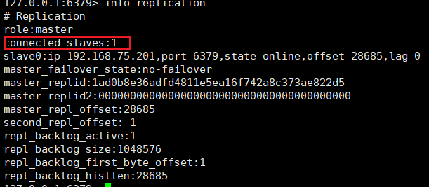

# Redis 笔记

## 一、Redis概述

1、Redis（remote dictionary server：远程字典服务器）

```
（1）存在于内存
（2）基于键值对
（3）可持久化
（4）数据库
```

2、Redis与传统数据库的区别

```
（1）Redis是非关系型数据库，使用键值对存储数据；传统的数据库是关系型数据库，使用表结构存储数据
（2）Redis数据库存放在内存；传统数据库存放在硬盘
（3）Redis和传统数据库之间的关系并不是取代与被取代的关系，而是相辅相成的关系，Redis可以减轻高并发（并发：一个处理器同时处理多个任务）情况下对传统数据库的访问压力
（4）关系型数据库通用SQL语句进行增删改查，而作为非关系型数据库的Redis则不使用SQL，使用专门的指令
```

3、Redis的应用

```
（1）高并发情况下减轻对传统数据库的访问压力（Redis挡在传统数据库前面）
（2）Redis的数据存储在内存，避免断电之后内存中的数据丢失，Redis支持内存中的数据持久化到磁盘
（3）排行榜，点赞，验证码
```

<hr></hr>

## 二、基本指令

<font color='red'>**1、注意所有的指令最后面不要加；否则可能会无效**</font>

<font color='red'>**2.、Redis的命令不区分大小写，但是Key区分大小写**</font>

```
（1）keys *	-- 查看所有key
```

```
（2）exists
exists k1		-- 判断k1存不存在，1：存在 0：不存在
exists k1 k2	-- 判断多个key的时候 存在几个就返回几
```

```
（3）type k1	-- 判断key下存储的数据类型的数据类型
```

```
（4）del k1	-- 删除key 删除成功：1 删除失败：0 （立刻真正的删除）
```

```
（5）unlink k1	-- 非阻塞删除 （立刻删除，但不是真正的删除，而是返回删除成功的信息，然后在后续异步去慢慢的删除）
```

```
（6）expire k1 5	-- 为key设置过期时间，单位秒
```

```
（7）ttl k1	-- 查看key距离过期的剩余时间（-1：为永不过期 -2：已过期）（不设置过期时间就是永久不会过期的）
```

```
（8）select 0	-- 切换数据库 （每个redis服务器自带16个库，0-15，默认使用0号库）
```

```
（9）move k1 1	-- 将key移动至指定的数据库（0-15）
```

```
（10）dbsize		-- 当前数据库中key的数量
```

```
（11）flushdb		-- 清空当前库
```

```
（12）flushall	-- 清空所有库
```

```
（13）set k1 v1 	-- 添加键值对
```

```
（14）get k1 		-- 获取value值
```

<hr></hr> 

## 三、Redis 数据类型

### 1、String

#### （1）概念

```
a、String是redis中最基本，最常用的数据类型
b、key是字符串，value是字符串（k:v）
c、String类型value可以序列化，也就是说String类型的数据value不仅仅可以是字符串，也可以是图片视频之类
d、String类型的value的最多可以是512M
```

#### （2）指令

```
a、set k1 v1		//不论是否已经存在相应的key，均能创建成功，会覆盖之前的kv值

（1）set k1 v1 nx			//不存在才创建，存在的话创建失败，也就是说不能通过新建kv来覆盖之前的kv
（2）set k1 v1 xx			//存在才创建，不存在则创建失败
（3）set k1 v1 get		//先返回旧值，再将新value值赋值给key
（4）set k1 v1 ex 5		//5秒后过期
（5）set k1 v1 px 5000	//5秒后过期
（6）情形：
	set k1 v1 
	expire k1 10
	ttl k1				//10
	set k1 v11			
	ttl k1 				//-1（永不过期）
	//结果：当你为一个key指定过期时长之后，再次添加这个key之后，这个key的过期时长就会被重置
	
	set k1 v1 keepttl 	//keepttl保证再次添加这个key的时候过期时长不会被重置
```

```
b、mset k1 v1 k2 v2 k3 v3...		//同时设置多个kv键值对
	mget k1  k2 k3 ...			//同时获取多个value值
//注意：同时添加多条的时候，使用三条指令执行三遍插入性能不如一条指令插入三条数据
```

```
c、set k1 123456789
getrange k1 0 3					//1234		//getrange k1 0 -1 其中-1代表到末尾
setrange k1 0 111				//111456789  //会从0开始依次覆盖之前的数据
```

```
d、set k1 100					//仅限于数字字符串
incr k1							//101
incr k1							//102
incrby k1 2						//104
incrby k1 2						//106

decr k1							//105
decr k1							//104
decrby k1 2						//102
decrby k1 2						//100
```

```
e、set k1 123456789
strlen k1						//9（返回字符串的长度）
append k1 000					// 123456789000  拼接字符串
```

```
f、setnx k1 v1					//如果不存在k1，那么就创建k1（返回true），存在就无法创建（返回false）
//注意：该指令常用于分布式锁，多个分布式模块使用同一个资源的时候之前先在redis中使用setnx创建一个kv键值对，其他的模块请求这一资源之前看看内存中这个键值对是否存在，存在就代表此资源被占用不可访问，否则未被占用可以访问。当一个占用该资源的模块使用完之后再通过del指令删除该键值对，就可以保证其他模块可以访问到该资源了
```

```
g、setex k1 10 v1
//注意：该指令将set和expire指令相结合，保证这两个指令的原子性（要么同时成功，要么同时失败）
```

```
h、getset k1 v1
//先获取k1的旧值，再赋予新值
```

#### （3）用途

```
a、朋友圈点赞：通过incr或者decr点赞之后就++（实现++则string类型的value值必须得是数字型的）
```


### 2、List

#### （1）概念

```
a、key是字符串，value是一个有序的String列表或者说集合（k:{v1,v2..}）
b、底层是一个双向链表
c、插入数据是有顺序的
d、value中列表长度可达2^32-1
```

#### （2）指令

```
a、lpush list1 1 2 3 4 5
//每次插入数据放在已有数据的左边
```

```
b、rpush list2 1 2 3 4 5
//每次插入数据放在已有数据的右边
```

```
c、lrange list1 0 -1				//5 4 3 2 1
	lrange list 0 -1 			 //1 2 3 4 5
//遍历list
```

```
d、lpop list
// 删除list左边的一个元素

lpop list n
//删除list左边的n个元素
```

```
e、rpop list
// 删除list右边的一个元素

rpop list n
//删除list右边的n个元素
```

```
f、lindex list n
//获取list中n索引位置的值
```

```
g、llen list
//获取集合中元素的个数
```

#### （3）用途

```
a、消息队列：比方说订阅了某个作者，作者发布文章的时候就可以将文章的id存入list中。查询的时候就可以按照消息的发布顺序取出消息
```


### 3、Hash

#### （1）概念

```
a、key是字符串，value是键值对（k:(k1:v1)）（一个key对应多个键值对）
b、hash适合存储对象
c、hash的每个key最多可以存储2^32-1个键值对
```

#### （2）指令

```
a、hset k k1 v1 k2 v2...
//设置hash数据
```

```
b、hget k k1
//注意同时只能获取一个key中的一个key的value值，hget k k1 k2（错误）
```

```
c、hmget k k1 k2...
//同时获取一个hash数据中多个key的value值
```

```
d、hgetall k
//获取hash数据k的所有键值对
```

```
e、hdel k k1 k2...
//删除hash数据k中的多个key
```

```
f、hlen k
//获取hash数据k中所有键值对的数量
```

```
g、hexists k k1
//判断hash数据k中的某个key是否存在
```

```
h、hkeys k
//获取hash数据k中的所有key
```

```
i、hvals k
//获取hash数据k中的所有value值
```

```
j、hincrby k k1 1
//将hash数据k中的k1中的value值加指定步长的数据
```

```
k、hincrbyfloat k k1 0.5
//将hash数据k中的k1中的value值加指定步长（小数）的数据
```

```
m、hsetnx k k1 v1 k2 v2...
//添加hash数据k的时候，k不存在添加成功，存在则添加失败
```


### 4、Set

#### （1）概念

```
a、key是字符串，value是无序（无序指的是插入顺序和存储顺序不一致）且不可重复的集合（k:{v1,v2...}）
```

#### （2）指令

```
a、sadd k v1 v2 v3...
//插入一条set数据
```

```
b、smembers k
//查询某个set数据中的所有value值
```

```
c、sismember k v
//判断某个value值是否是set数据中的value值
```

```
d、srem k v
//删除set数据中的某个value值
```

```
e、scard k
//统计某个set数据下value值的个数
```

```
f、srandmember k n
//随机从set数据中抽取n个value值（对原来的value值没有任何的影响）
```

```
g、spop k n
//随机从set数据中弹出n个value值（弹出相当于删除原set数据中的value值）
```

```
h、集合运算
set k1 a b c 1 2
set k2 1 2 3 a x

（1）差集
sdiff k1 k2
//k1中的value减去k2中的value值，k1中剩余的value。如果是sdiff k2 k1则就是k2中的value减去k1中的value值，k2中剩余的value
（2）并集
sunion k1 k2
//将k1和k2中的数据组合并去重的结果
（3）交集
sinter k1 k2 
//获取k1和k2value值的公共部分
```

#### （3）案例

```
a、社交软件共同好友之类（使用交集运算）
b、抽奖（srandmember 随机获取一位或者几位中奖者）
```


### 5、Zset

#### （1）概念

```
a、key是字符串，value是有序且不可重复的集合（k:{score1 v1,score2 v2...}）
b、value中的每个value都带有一个score值，Zset就是通过score进行排序（默认按照分数从小到大进行排序）
```

#### （2）指令

<font color='red'>以下所有的withscores都是可写可不写的</font>

```
a、zadd k score1 v1 score2 v2 score3 v3...
//添加zset数据
```

```
b、zrange k 0 -1
//不带分数，遍历zset数据
```

```
c、zrange k 0 -1 withscores
//带分数，遍历zset数据
```

```
d、zrevrange k 0 -1 withscores
//按分数从大到小进行排序（默认从小到大进行排序）
```

```
e、zrangebyscore k minScore maxScore limit 0 -1 withscores
//通过分数区间选择value值
//zrangebyscore k1 1 20 ：k1中score大于等于1，小于等于20之间的value值
//zrangebyscore k1 （1 （20 ：k1中score大于1，小于20之间的value值
//limit相当于对结果在进行分页，左右两个值相当于zrange k 0 -1
```

```
f、zscore k v1
//获取某个value值的scores
```

```
g、zcard k 
//获取zset数据中value的个数
```

```
h、zrem k v
//删除某个value值
```

```
i、zincrby k 3 v
//对某个value值加3
```

```
j、zcount k minScore maxScore
//统计指定分数区间内value值的个数
```

#### （3）案例

```
a、商品价格排序
```


### 6、Geo

#### （1）概念

```
a、主要用于存储地理位置信息
b、Geo数据相当于Zset数据（有序且不重复）（Zset数据的指令也可以用于Geo数据）
```

#### （2）指令

```
a、geoadd k score1 score1 v1 score2 score2 v2... 
//添加Geo数据
```

```
b、geopos k v1 v2...
//获取v1,v2...的坐标值
```

```
c、geohash k v1 v2...
//获取v1,v2...位置的hash值
```

```
d、geodist k v1 v2
//获取v1和v2两个坐标点之间的距离

geodist k v1 v2 m
//获取v1和v2两个坐标点之间的距离（米）

geodist k v1 v2 km
//获取v1和v2两个坐标点之间的距离（千米）
```

```
e、georadius city 0 0 500 km withcoord withdist withhash count 2 asc
city：key
0 0：中心点经纬度坐标
500：半径
km：半径单位
withcoord：返回的数据带经纬度
withdist：返回的数据带距离中心点的距离
withhash：返回的数据带hash值
count 2：查询的结果取前两条
asc/desc：根据距离中心点的距离从小到大/从大到小返回
```

```
f、georadiusbymember city 天安门 500 km withcoord withdist withhash
//中心坐标不需要手动输入而是以key中的value对应的坐标作为中心点，其他的和georadius指令一样
```

#### （3）案例

```
a、地图
```


### 7、HyperLogLog

#### （1）概念

```
a、key是字符串，value是字符串
b、hyperloglog数据只能统计输入的不重复的数据的个数而不能获取数据本身
c、大数据量的情况下hyperloglog不能完全准确的算出基数，而会存在误差（0.81%的数据会有误差）
d、hyperloglog本质上也是string类型（datagrip中可以在string下查看到hyperloglog数据）
```

#### （2）指令

```
a、pfadd k v1 v2 v3...
//添加hyperloglog数据

注意：
	（1）pfadd可以对一个key重复使用，比方说 pfadd key 1 2，pfadd key 3;这两个指令最终的执行结果并不是3把1和2覆盖了，而是说1，2，3都会被添加到key中
	（2）当往hyperloglog的key中添加key中已经存在的数据的时候会添加添加失败。比方说pfadd key 1 2，pfadd key 1；指令第一个指令会返回true，而当执行第二个指令的时候由于1已经存在所以会返回false
```

```
b、pfcount k
//获取hyperloglog数据的基数值
```

```
c、pfmerge k3 k1 k2
//将k1和k2的数据合并至k3
```

#### （3）案例

```
a、统计网站UV，文章UV。（UV：unique visitor 独立访客。可以指客户端的独立ip，比方说一个用户以同一个ip都一个网站访问多次，那么对于这个网站来说这个用户今天只算做一人次）
```


### 8、Bitmap

#### （1）概念

```
a、key是字符串，value是由0和1组成的字符串
b、bitmap本质上仍是一个string（以字符串的形式存储）（在DataGrip中创建bitmap数据，会发现bitmap数据存放在string类型下）
```

#### （2）指令

```
a、setbit k 0 1
//在bitmap数据k的0位置上设置1
```

```
b、getbit k 0
//获取bitmap数据k的0位置处的值
```

```
c、strlen k
//获取bitmap数据的字节数（在bitmap中8位为一组是为一个字节，超出8位自动扩容，比方说现在有9位，那么此时的长度就是2）
```

```
d、bitcount k
//获取bitmap数据k中1的数量
```

```
e、位运算
bitop and k3 k1 k2
//将k1和k2对应位置"与"之后存放至k3中

bitop or k3 k1 k2
//将k1和k2对应位置"或"之后存放至k3中

bitop not k2 k1
//将k1的所有位置取"非"之后存放至k2中

bitop xnor k3 k2 k1
将k1和k2对应位置"异或"之后存放至k3中
```

#### （3）案例

```
a、签到（状态统计）
```


### 9、Bitfield

了解

### 10、Stream

## 四、Redis持久化

### 1、持久化概念

```
（1）Redis是一种内存数据库，也就是说redis中的数据是存储在内存中的。而内存中的数据虽然有很高的读写速度但是无法做到数据的持久化，断电之后内存中缓存的数据就会全部消失。大量的请求绕过redis对于mysql来说是灾难性的。所以需要对redis中的数据进行持久化，在系统重启之后可以更快的将数据从磁盘重新恢复到内存中
（2）redis中有三种持久化的方案：a、RDB（redis database） b、AOF（append only file） c、RDB+AOF
（3）RDB和AOF两种持久化方案，其中的RDB是redis默认开启的，而AOF是默认关闭的，需要手动配置开启
（4）如果只配置了RDB，启动redis时以rdb文件恢复数据；如果只配置了AOF，启动redis时以aof文件恢复数据；如果AOF和RDB均配置了，那么启动redis时使用aof文件恢复数据（通常情况下aof保存的数据相较于rdb更加完整,因为RDB一次保存是保存的整个数据，而AOF则是保存新增数据的指令，所以在保存频率上RDB肯定要慢于AOF）
```

### 2、RDB

#### （1）概念

```
a、在某一个时刻，满足一定条件之后，将redis数据库中的所有数据整体打包成一个快照rdb文件（dump.rdb）（这个rdb文件会保存在到）存储到硬盘上。当系统重启的时候就会通过redis自身的持久化机制，将这个rdb文件从磁盘重新读会到内存中实现持久化
b、RDB是Redis默认开启的一种持久化方式
c、RDB持久化记录的是数据本身
d、每次redis进行rdb备份，都会在原来的父进程上fork一个子进程，产生新的rdb文件并替换旧的rdb文件
e、rdb文件是一个压缩的二进制文件，所以在内存中恢复数据的速度快，而且文件体积小
```

#### （2）自动触发

##### 		a、备份

```
*--配置文件--*

#RDB保存数据频率（60秒内redis中的数据有5次写入）(注意是每60秒检查一次看是不是够了5次，够了则生成rdb不够不生成)
save 60 5

#RDB文件的保存路径（默认路径d：dir ./）（注意/home/redis/data路径必须要提前建好）
dir /home/redis/data

#更改RDB文件的名字(Redis集群的时候可以作为区分)
dbfilename dump.rdb
```

##### 		b、恢复

```
*--注意--*
（1）当我们通过flushall或者flushdb两个指令执行删除操作的时候，redis为了保证数据的同步性也会覆盖之前有数据的rdb文件产生一个没有任何数据的rdb文件
（2）关闭redis服务器之后，redis不论是否达到自动保存的条件会立即保存一个rdb文件（注意这里的关闭是正常的关闭redis，通过适当的指令关闭redis，此时redis再关闭之前会保存一个RDB文件。如果是非正常的关闭redis服务，比方说kill -9杀死redis进程，此时redis不会在关闭前产生一个RDB文件）
（3）生产机的rdb文件一定不能存储在生产机本地，而是存储到远程机器。生产机定期的将rdb备份文件传给远程机器进行数据备份
```

```
*--恢复数据步骤--*
（1）关闭redis服务器
（2）删除现有的rdb文件
（3）将备份的rdb文件放在相应的rdb文件存储的位置（配置文件中dir后面指定的路径）
（4）重启redis服务器
```

#### （3）手动触发

|  |
| ------------------------------------------------------------ |

```
*--理解--*
（1）手动触发的适用场景：当往redis中添加了一个比较重要的数据，但是没有到自动触发备份的时候，怕此时这条数据丢失，我们就可以手动的去备份数据
（2）***手动触发备份的过程***：redis默认自动开启RDB备份，也就是说RDB备份的那条线程一直在运行。而手动备份就是在这个线程的基础上在拉出一个子线程去进行备份，最终产生的rdb文件将覆盖之前的rdb文件，实现立即备份
```

##### a、save

```
save指令会阻塞redis主线程（redis在执行save指令的期间不会执行其他任何的指令），当数据量比较大，备份一次时间比较久的时候，此时在备份的过程中redis是卡死的，无法处理任何客户端发出的数据处理指令。所以save指令在实际的生产环境中是严禁使用的
```

##### b、bgsave

```
bgsave会立马响应，然后后台会fork一个子进程去实现数据备份（不阻塞，生产中推荐使用）
```

##### c、lastsave

```
获取系统最后一次执行快照（RDB）的时间

*注意*：lastsave执行之后会获取一个时间戳。可以在linux的命令行中使用“ date -d @时间戳 ”将时间戳转化成可以直接看的日期
```

#### （4）RDB优缺点

```
*优点*：
（1）适合灾难恢复（因为RDB可以自定义备份数据的频率，比方说一天备份一次，一个月备份一次，然后传送至远程服务器储存备份数据。这样的话灾难过后就就会将数据恢复成灾难前的任何一个时期或者版本的数据。而对于AOF来说备份的是指令，最终是根据指令恢复数据，那么AOF最终恢复的数据只是数据的最终的版本，想要恢复到不同时期的数据需要删减aof文件中的指令，实现起来没有rdb文件那么方便）
（2）相同数据量的情况下，RDB文件在内存中的加载速度是要优于AOF文件的（因为RDB文件备份的是数据本身，而AOF备份的产生数据的指令，RDB文件直接恢复数据，而AOF文件则是重新执行一遍之前的指令来恢复数据，所以RDB比AOF恢复数据的效率更高）
（3）RDB文件是压缩的二进制文件，而aof文件保存的是生成数据的指令。所以相同数据量的情况下，RDB文件的大小要小于AOF文件
```

```
*缺点*：
（1）容易丢失数据（从当前时间点到上一次备份之间的数据在异常终止（比方说kill -9杀死redis进程）的情况下可能会丢失）
（2）RDB，每一次的备份都是备份redis数据库中所有的数据，如果数据量比较大的情况下，每一次fork出来的子进程会花费更多的时间和资源来进行备份
```

#### （5）禁用RDB

```
*--配置文件--*

save ""
```


### 3、AOF

#### （1）概念

```
AOF（append only file）是将redis的每一次的写操作指令（增删改）（读指令不记录），以日志的形式记录下来，保存到AOF文件中。当redis重启之后，将所有的指令重新执行一遍将数据重新恢复至内存中。
```

```
AOF默认关闭，如果想开启AOF，则只需要在配置文件中加入"appendonly yes" 即可，此项默认为"appendonly no"
```


#### （2）执行流程


```
步骤解释：
（1）用户向redis发出指令，redis只会将写操作指令（增删改）记录下来保存至aof文件
（2）redis接受到写操作指令之后并不会立即将指令记录在aof文件中，而是率先将指令保存在aof缓冲区中，当满足写入条件的时候才会将指令写入aof文件中，这样做避免了频繁的磁盘IO操作
（3）redis根据用户设定的写回策略将写操作指令写回aof文件
（4）随着指令的不断写入，aof文件会逐渐的变得庞大，然后aof文件会根据自身的重写机制，减少冗余指令，实现文件的压缩
（5）当redis重启之后，就会加载aof文件将指令重新执行一遍，以恢复所有数据
```

#### （3）AOF缓冲区三种写回策略

<font color = 'red'>注意：三种写回策略针对的是从aof缓冲区写到磁盘中的aof文件的过程</font>

```
a、always
#每次执行完一个指令之后会立马将指令写回到磁盘上的aof文件中
#优点：不会丢失数据
#缺点：频繁的磁盘io，降低redis服务器的性能
```

```
b、no
#每次执行完指令之后，并不是立即将指令写回到磁盘的aof文件中，而是放在aof缓冲区中，而具体什么时候将aof缓冲区中的内容写回到磁盘中的aof文件中则由操作系统来决定
#优点：没有频繁的io
#缺点：较易丢失数据
```

```
c、everysec
#每次执行完指令之后，指令存放至aof缓冲区中，每经过1秒就将aof缓冲区中的数据写回到磁盘的aof文件中
#优点：折中的办法；宕机丢失的数据量较小（丢失1秒的数据）
```

#### （4）配置文件

```
*--配置文件--*
```

```
#开启aof（redis持久化机制中的aof默认是关闭的，需要手动开启）
appendonly yes

#redis写回策略（默认everysec：没隔一秒就将aof缓冲区的指令写回到磁盘的aof文件中）
appendfsync everysec

#redis aof文件的生成路径
#redis 6：6版本中rdb和aof同时使用dir控制文件的生成位置。比方说dir /home/redis，那么rdb文件的生成位置就在/home/redis/dump.rdb，而aof文件的生成位置就在/home/redis/appendonly.aof。所以是共用的
#redis 7：7版本中由于6版本中rdb和aof共用一个路径，所以为了进行区分，7的配置文件中新加了一个"appenddirname appendonlydir"。比方说dir /home/redis 那么生成的rdb文件为/home/redis/dump.rdb，而aof文件的生成位置则发生了改变/home/redis/appendonlydir/appendonly.aof
appenddirname appendonlydir

#redis aof文件的名字
#redis 6：在6版本，redis只会根据配置文件 appendfilename "appendonly.aof" 生成一个名字为appendonly.aof的文件
#redis 7：在7版本，redis会产生三个aof文件，而 appendfilename "appendonly.aof" 配置只会决定产生的配置文件的前缀。三个aof分别为base（基本文件：aof重写之后的文件，只会存在一个），incr（增量文件：每次执行指令根据写回策略将指令写回到aof文件中，这样产生的aof文件就是增量文件，简单的来说增量文件就是没有重写的aof文件，可以存在多个），manifest（清单文件：对历史版本的aof文件进行跟踪和管理的文件）
appendfilename "appendonly.aof"
```

#### （5）AOF的优缺点

```
优点：
a、AOF相比RDB有更低的丢失数据的风险
b、AOF可做紧急恢复（AOF持久化的方式就是记录redis执行的写操作指令，然后redis重启之后就会执行所有指令将数据恢复至内存中。如果在redis服务器中执行了具有破坏性的指令，就可以找到aof文件然后定位到这个指令，把这个指令从aof文件中删除后重启redis服务器之后就可以恢复数据。比方说执行flushall指令，将数据库中的所有数据都清空了。解决方法就是找到aof文件，然后在aof文件中找到flushall指令，将该指令删除后重启redis服务器就可以恢复数据）
```

```
缺点：
a、同数据量的情况下，aof文件要大于rdb文件（因为rdb是压缩的二进制文件，而aof是保存指令的文件）
b、aof保存的频率更频繁，所以在运行效率上要低于rdb
c、在重启redis后，aof文件由于是执行指令恢复所以数据的恢复速度要慢于rdb
```

#### （6）AOF重写机制

```
a、aof文件逐渐产生的问题
随着写入指令的不断增多，会出现两个问题。
第一个问题就是aof文件大小的增大，占用更高的磁盘空间。
第二个问题就是大量的指令使得redis重启之后数据的恢复速度越来越慢。
```

```
b、重写机制
（1）当aof文件的大小超过了我们设定的峰值大小的时候，redis就会自动的对aof文件进行压缩，只保留可以恢复数据的最小指令集（比方说set k 1，set k 2，set k 3这三条指令最终产生的结果就是一个k=3的数据，所以经过redis重写之后只会变成set k 3这一条指令）
（2）注意：aof重写并不是对旧的aof文件中的指令进行整理，而是会根据redis数据库中现有的数据，生成一些新的指令，将指令存放至新的aof文件，然后用新的aof文件去替换旧的aof文件
```

```
c、重写实现
（1）自动
*--配置文件--*
auto-aof-rewrite-percentage 100
auto-aof-rewrite-min-size 64mb
//aof文件相较于上一次重写之后的文件变大了1倍，并且文件的大小不小于64mb的时候开始重写。（注意两个条件必须同时满足才会触发重写）
（2）手动：bgrewriteaof
```

```
d、重写过程
开启重写之后，redis会拉出一个子进程读取redis数据库中的所有数据，然后根据这些数据生成一条条指令，存放至一个新的aof文件。同时redis的主进程仍然会继续的处理客户端发来的各种指令。为了避免在产生新的aof文件过程中数据发生改变（比方说重写之前set k v，重写后就会读取到key为k这条数据，然后将这条数据转化成set k v这条指令写入新的aof文件中，又因为在重写的过程中redis仍然会处理客户端的各种指令。如果说此时set k vv，那么重写之后的文件仍然是set k v，此时重写之后重写的aof文件所代表的数据和redis数据库中的数据不一致），保证redis重写之后redis数据库中的数据和重写后aof文件中代表的数据保持一致，redis又增加了重写缓冲区，重写过程中主进程处理的写操作指令都会存放在redis重写缓冲区中，当重写完成之后，redis重写缓冲区中的指令会追加到新的aof文件中，保证了数据的一致性。最后由新的aof文件替换之前旧的aof文件。
```


#### （7）AOF文件修复

```
a、当redis重启之后无法读取aof文件，则可以通过如下指令修复aof文件：
redis-check-aof --fix "aof文件名"

b、注意经过修复的aof文件可能会出现数据丢失的问题
```


### 4、纯缓存模式

```
redis最让人耳熟能详的功能就是来做缓存，而为了进一步提高缓存效率，可以通过关闭持久化来实现（全心全意来做缓存）。
（1）关闭RDB：save ""，自动rdb持久化关闭，但是save，bgsave指令仍可以使用
（2）关闭AOF：appendonly no，自动aof持久化关闭，但是bgrewriteaof指令仍然可以使用
```


## 五、Redis事务

<font color='red'>事务：在一次与数据库的连接过程中，期间执行的所有SQL要么同时成功，要么同时失败。而redis中的事务和mysql等关系型数据库的事务不一样</font>

### 1、概念

```
（1）redis中网络IO和指令操作是单线程的。（一个redis服务器可以由多个用户访问，多个用户可以对redis服务器下达指令，这许许多多的指令到了redis之后是被单线程逐条的执行的）
（2）在redis中的每个指令都是原子性的
（3）一个用户瞬间发出多条指令，但是这多条指令仍然不是原子性的，这些指令任何一条在执行之前都有可能在redis服务器上收到其他用户的干扰，并不是连续执行的。而redis中的事务就是要保证“多条指令在redis中连续的一次性执行完，而不会受打断或者中间插入其他的指令”
（4）redis的事务不保证所有指令都能执行成功，但一定保证所有的指令连续的被执行，不会被其他用户的指令打断
```

### 2、特点

```
（1）不保证原子性：两种情况：一种是多条指令要么同时成功要么同时失败（一组指令中有无法加入事务队列的指令，在执行指令之前就检测出来了，所以所有的指令都不会执行），第二种就是成功执行的指令成功执行，失败的则就失败（所有指令均成功加入事务队列，但是在执行的过程中出现错误，导致正确的指令执行成功，错误的指令执行失败）
（2）不存在事务隔离：redis事务队列的这种机制就决定了，只要没有exec，队列中的所有指令都不算真正的执行，所以说外部是看不到的（redis是单线程执行的，而其他关系型数据库是多线程的）
（3）redis没有回滚
（4）redis的事务保证多条指令连续不被打断的被执行完毕，但不保证全部执行成功
（5）开启事务之后，每次执行一条指令都会返回queued，当执行exec后会返回所有的这些指令的执行结果。注意：开启事务之后执行的每一条指令都是直接发送到redis服务器的，而不是说当exec之后才将所有指令打包发送到redis一起执行
```

### 3、常用指令

```
（1）multi ：开启事务

a、开启事务后，每次执行指令都会返回queued，表示指令已经加入redis事务队列中（此时指令已经发送给了redis服务器）
b、开启事务之后如果没有exec或者discard，再次执行multi会报一个不允许嵌套事务的错误（redis中的事务不可以嵌套）
```

```
（2）discard ：放弃事务
```

```
（3）exec ：运行事务
```

```
（4）原子性验证
a、redis事务不保证原子性 ：同时失败

multi
set k1 1
set k2
exec

运行事务之后由于第二条指令没有添加入队列中所有两条指令全部执行失败
-------------------------------------------------------------------------------------------------------------------
b、redis事务不保证原子性 ：部分失败

multi
set k1 1
set k2 a
incr k2
exec

运行事务之后，所有指令添加队列成功。但是在执行的过程中第三条指令会执行失败，但是前两条指令会成功
```

```
（5）watch监控
a、悲观锁和乐观锁的区别
	悲观锁：悲观锁就是说在并发的情况下，当获取完数据后我们悲观的认为，这条数据同时会被其他人修改，所以当我们获取到这个数据的时候就会对这个数据加锁，不让其他人获取这个数据。当其他人试图获取这个锁住的数据的时候就会阻塞，只有当我们使用完这个数据释放锁之后才可以重新获取这个数据。悲观锁保证了同一时刻只能有一个人来使用这个数据保证了数据的安全性，但是却阻塞了其他人，降低了并发的性能。
	乐观锁：乐观锁就是说在并发的情况下，当获取完一个数据的时候我们乐观的认为我们获取这个数据之后，其他人不会再获取这个数据。在这个过程中对于其他人来说仍然可以获取到这个数据。当我们需要真正的去修改这个数据的时候就会判断一下我们最初取得的这条数据和现在的这条数据之间有没有变化，有变化说明已经被人修改过了，那不允许我们进行修改。如果没有改变，那就说明没有人修改过，那就允许我们进行修改
	
b、watch

set k 100 
watch k 
multi 
set k 200
exec

watch指令的作用就是监控某一个key，也就是对这个key添加乐观锁，当对这个key进行修改的时候，就判断这个key的现在的值和我们当时取得值是不是一致的，如果是一致的就可以修改，否则不允许修改

*注意*：
	（1）当我们监控的key存在于事务中的时候，在修改这个监控的key之前，这个监控的key被修改了，然后我们执行事务，这样会导致事务中的所有指令执行失败，事务最终返回null
	（2）当我们执行了exec指令之后，之前所有的监控全部取消
	（3）当客户端与redis服务器的连接断开了之后，断开之前客户端所监控的所有key也全部取消监控
	
c、unwatch	取消监控
```


## 六、Redis管道

### 1、概念

```
（1）redis中指令的处理过程：
	a、客户端发送指令
	b、指令进入redis服务器，进入指令等待队列，等待执行
	c、redis服务器执行指令
	d、redis服务器返回执行结果
（2）问题的产生（一次搬家，搬运多趟）：
	当处理大量的请求指令的时候，redis服务器频繁的，接受指令，执行指令，响应结果，客户端和redis服务器之间频繁的进行通信（指令的传输和响应结果的传输），客户端和redis服务器之间频繁的建立和断开连接，最终对性能有很大的影响。
（3）问题的解决（一次搬家，搬运一趟）：
	当有客户端有大量的指令请求的时候，可以将指令打包，一次性的传送给redis服务器，然后redis服务器执行这些指令，响应给客户端结果。通过减少客户端与redis服务器之间的通信来提高性能
（4）redis管道：redis管道的提出就是为了解决大量指令导致客户端和redis服务器之间频繁的通信，而影响性能。类似redis的原生处理命令mset。客户端发送打包的指令给redis服务器之后，服务器会收集这些指令放入执行队列中，然后执行指令，当所有指令执行完毕之后将所有的指令执行结果响应给客户端。一次打包的指令不宜过多，一般不超过10k
（5）redis管道和redis事务的区别
	a、redis事务中执行多条指令，这多条指令是一条一条的发给redis服务器的，最后的exec是统一执行这些指令的；而对于管道来说就是一次性的将所有指令送至redis服务器执行
	b、redis事务中的指令执行的过程中是一次性的不会被打断的执行完毕；而管道中的指令只是一次性送至redis服务器，它们的执行过程可能并不是连续的

*注意*：redis管道其实并不是redis服务器提供的技术，其实是针对客户端来说的。因为对于redis来说接受指令，执行指令，响应结果是一直没变的，变得是客户端，由发送一条指令变成发送多条指令
```

### 2、优缺点

```
（1）优点
	a、一次发送多条指令到redis服务器，减少客户端与redis服务器之间的通信，提高性能
```

```
（2）缺点
	a、管道技术只适用于单个redis服务器，不适用于redis服务器集群
	b、当打包多条指令送往redis服务器执行的时候，在等待所有指令执行完毕之前，已经执行的指令的执行结果会被暂时缓存，占用内存
```


## 七、Redis复制

### 1、概念

```
（1）Redis的复制实际上就是redis的主从复制
（2）一主多从，读写分离。主机（master）负责写，从机（slave）负责读。（主机也可以读，只不过可以忽略，主要是写；从机只能读，不能写）
（3）主机数据变化的时候就会异步的同步给从机，实现主机和从机数据的一致性（但是这种异步同步并不保证数据的强一致性）
```

### 2、优点

```
（1）读写分离
（2）数据备份
```

### 3、配置文件

```
注意：
（1）主从复制，配从不配主。
（2）从机既可以指定密码，也可以不指定
```

```
主机：
bind 0.0.0.0 或者 直接注释掉

bind配置的作用就是规定允许访问redis服务器的ip，直接注释掉或者bind 0.0.0.0就是说可以由任意的ip来访问这个redis服务器
```

```
从机：

#允许任何ip进行访问
bind 0.0.0.0 

#配置从机连接主机，主机的密码
masterauth 7539515 

#从机是否只读
replica-read-only yes

#连接的主机ip：redis开放的端口
replicaof 192.168.75.200 6379
```


*<u>测试主从复制是否配置成功</u>*

```
（1）进入主机的redis客户端
docker exec -it redis容器名 redis-cli

（2）输入密码
auth 密码

（3）查看主从复制的信息（如下便是主从配置成功）
info replication
```

| 主机（192.168.75.200:6379）                                  |
| ------------------------------------------------------------ |
|  |

| 从机（192.168.75.201:6380）（192.168.75.202:6381）           |
| ------------------------------------------------------------ |
|  |
|  |


### 4、相关问题

```
（1）从机可以写吗？
首先在从机的配置文件中已经明确定义了replica-read-only yes，所以说主从复制，读写分离的从机是绝对不可以写的。从机只有读的权力，而没有写的权力。
对于主机来说，它是既可以读也可以写的，但是主机主要是进行写的
```

```
（2）从机宕机重启的数据同步问题
主机再写的时候，如果从机宕机了，在从机宕机的期间主机继续写的内容，从机重启之后仍然可以恢复。
比如现在主机和从机中没有k1，现在把从机关掉，主机中执行set k1 v1，然后重启从机，发现从机中仍然存在k1
```

```
（3）主机宕机重启的数据同步问题
主机宕机之后，从机中的数据仍然存在，也仍然可以正常的读取，主从关系仍然存在。原来的从机仍然是从机，主机重启之后一切照旧
```


### 5、从机暂做主机

Redis集群结构

|  |
| ------------------------------------------------------------ |

出现的问题：

```
如果说所有的从机都是直接连接主机的那么主机的性能损耗会非常大（对主机写入一条数据之后，那么所有的从机中的数据均需要主机参与同步，而如果一个主机只连接一个从机和一个主机连接100个从机，他们的数据同步速度肯定是1台的大于100台的），也就是说主机连的越多，响应速度就会越慢
```

解决办法：

```
从机对上为从机，对下为主机
```

|  |
| ------------------------------------------------------------ |

具体做法：

```
（1）动态更改：在redis客户端中执行：slaveof 主机ip 端口 可以实现切换
（2）静态修改：修改配置文件中的：replicaof 主机ip 端口
```

| 主机（192.168.75.201:6380）                                  |
| ------------------------------------------------------------ |
|  |

| 从机（暂代主机）（192.168.75.200:6379）                      |
| ------------------------------------------------------------ |
|  |

| 从机（192.168.75.202:6381）                                  |
| ------------------------------------------------------------ |
|  |

注意：

```
暂代主机的从机仍然只可以读，不可以写
```


### 6、从机变成主机

```
从机redis客户端中执行：slaveof no one

从机执行slaveof no one之后就会脱离之前的主从复制关系，自己独立成为一台主机
```

### 7、工作流程

```
（1）slave启动后连接master，向master发送一个同步请求。然后slave中的数据会被master中现存的数据给完全覆盖
（2）（全量复制）master收到slave的同步请求后，后台就会保存一个RDB文件，也就是说master同步slave的时候会触发RDB，在保存快照期间redis服务器仍然继续接受客户端的请求，这期间执行的所有指令都会被缓存起来，当rdb文件生成完毕后和缓存的指令一起发给slave。然后slave根据rdb文件和缓存的指令就可以和master的数据保持一致
（3）根据配置文件中的relp-ping-replica-period 10 master每10秒ping一次slave，保持master和slave之间的通信
（4）（增量复制）之后master每次收到指令都会自动的同步给slave，保证master和slave之间数据的一致性
（5）当slave宕机重启后，master只会把master和slave之间所差的数据复制给slave
```

### 8、复制的缺点

```
（1）主从复制，读写分离。主机只负责写，从机只负责读。当主机写完之后就会将数据同步给从机，而同步势必会有延迟，特别是在网络波动或者系统繁忙的时候。并且为了应对高并发并且实现高可用，从机的数量肯定是逐级向下，越来越多。这样的话也会造成主机的同步信号向下逐渐减弱
（2）由于主从复制的系统只有主机可以写入，所以如果主机宕机，则系统就不再有主机，也就是说系统现在只能读取，而不能写入
```


## 八、Redis哨兵

### 1、概念

```
（1）为什么需要哨兵：因为在最基本的主从复制中如果主机宕机，则整个redis系统会处于一种半瘫痪的状态，系统会失去写的能力，只可以读。所以需要在主机宕机的时候，能够从剩下的从机中重新选取一个主机，让redis系统能够继续正常的对外提供服务
（2）哨兵服务器监控后台的master和slave主机，当主机宕机之后，根据投票数选出leader哨兵，再由leader哨兵重新选取一个从机作为主机，继续对外服务
（3）哨兵本身也属于redis服务器，只不过哨兵并不用于读写数据，而是作为一个监控者，它的唯一作用就是监控主机和从机，当主机宕机后，发出预警，并且根据选举算法，选出一个leader哨兵，再由leader哨兵选出新的主机，继续对外提供服务。由于哨兵不参与读写数据，所以一般情况下哨兵的工作压力是比较低的。
（4）注意：master是不是真的宕机不重要，关键是哨兵觉得你宕机了你就真的宕机了（如果是因为网络的原因导致哨兵连接不到master或者slave），所以这就体现了投票的重要性。当由于网络波动的情况可能出现有的哨兵连接不到master，但是个别的哨兵认为master宕机了是不行的，只有当大部分哨兵都认为master宕机了，那不论master是否真的宕机，都会被投票选举出的新的master所替代。这样也排除了个别哨兵自身的问题而认为master宕机，就是说光它自己认为master宕机了不管用，只有大部分人都认为你宕机了才行
（5）哨兵监控的对象有三类：主机，从机，其他哨兵
```

### 2、哨兵演示

```
（1）当master宕机之后
	a、所有从机的数据仍然保持完好
	b、redis哨兵会从剩下的从机中选取一个主机，选取出来的从机变成主机，具备了读和写的能力，而其他的从机仍然只有读的能力
	
（2）当之前的master重启之后
	a、之前的master重启之后，会变成从机，只能读，不可重新恢复为主机
```

### 3、客观下线和主观下线

```
--注意--

每个哨兵的监控对象有三个：主机，从机，其他哨兵。每个哨兵每隔一段时间就会去主动的ping主机，从机，其他哨兵，等待它们的响应。
其中有效的响应有：pang，loading，masterdown，而除了这三个之外的响应都属于无效的响应，或者在规定的时间内没有响应成功，也属于响应失败。
```

```
（1）主观下线
当某一个哨兵ping主机的时候，收到了无效响应，那么该哨兵就认为主机已经宕机了。由于只是它一个人认为主机宕机了，所以这种的就是哨兵主观的认为主机下线了，这就是主观下线

（2）客观下线
当某一个哨兵认为它所监控的主机主观下线之后，就会去询问其他的监控同一个主机的哨兵，看一下其他的哨兵是否也认为主机是主观下线的。当大多数（少数服从多数）的哨兵都主观认为该主机宕机，然后哨兵就会认为主机真的宕机了，然后就会去投票选出新的主机。这就是客观下线。
```

```
--补充--

如果哨兵集群客观下线的节点是从节点或者哨兵节点，那么就不会做任何的处理。
只有哨兵集群检测到主机客观下线，才会进行故障转移。
```

### 4、哨兵运行流程

<font color = 'red'>**<u>重点</u>**</font>

<font color = 'red'>以下操作均由leader哨兵独立，自动完成，无需人为干预。</font>

```
（1）主机宕机，选出leader哨兵，进而选出主机
	a、哨兵主观下线
	b、哨兵集群客观下线
	c、哨兵集群选出leader哨兵
	d、leader哨兵选出主机
		aa、priority
		bb、偏移量
		cc、runid

哨兵集群同时监控主机和从机，当某个哨兵发现主机无法对自己的请求做出响应的时候，就会认为该主机主观下线。然后去询问其他的哨兵，当大多数哨兵一致的认为主机宕机的时候，此时主机就被认定为客观下线。然后哨兵之间就会通过"Raft算法"选出一个leadr哨兵，leader哨兵负责选出新的主机。

leader哨兵按照顺序从以下三个方面选出主机。第一，看redis服务器配置文件中的priority配置的数值，数值越小优先级越大。第二、看每个从机相较于主机的数据偏移量，数据偏移量越大代表从机中保存的数据相较于主机越完整，越会被选为主机。第三、每个redis服务器启动之后都会产生一个runid作为其一个唯一的标识，而如果前两项都没能成功选出主机，那么就会将runid最小的redis服务器作为主机
```

```
（2）所有从机重新确定主机
	a、leader哨兵通过slaveof no one指令将新的主机由原来的从机变为主机
	b、leader哨兵通过slaveof ip port指令将其他的从机所连接的主机更改为新产生的主机
```

```
（3）旧主机重新上线后，leader哨兵将其降级为新主机的从机，继续工作
```

### 5、哨兵的使用建议

```
（1）哨兵只要使用就要集群（单个哨兵意义不大，宕机之后主从复制系统缺失写的功能）
（2）哨兵集群的哨兵数量应为奇数（选举leader哨兵的时候，尽可能避免出现平票的情况）
```

### 6、哨兵的缺点

```
（1）主从复制+哨兵的组合并不能防止数据的丢失问题，因为在主机宕机，哨兵投票选出leader哨兵，再由leader哨兵选出新的主机这一过程中一般需要较长的时间，而这段时间内系统是没有写入的功能的，所以这一时间段的写入数据就会全部丢失。

（2）主从复制+哨兵集群本质上仍然是以一台主机为主，所以并没有解决主机压力过大的问题
```


## 九、Redis集群

### 1、概念

```
（1）为了解决主从复制+哨兵集群的缺点（哨兵选出新主机之前的时间里会丢失写入的数据），提出了redis集群的概念
（2）redis集群中可以存在多个主机，每个主机下又可以挂载多个从机
（3）redis集群自带类似redis哨兵的故障转移机制，所以说使用了redis集群就不再需要使用redis哨兵了
（4）主机之间通过ping来彼此检测彼此的健康状况
（5）redis集群中主机和从机之间是异步同步数据的，所以redis集群是不保证数据的强一致性的，也就是说redis集群也会丢失数据
```

### 2、槽位

*<u>**（1）概念**</u>*

```
（1）redis集群中最多有16384个插槽

（2）redis集群中节点（也就是redis服务器）的个数一般不超过1000个

（3）当你要插入key的时候首先对key的有效部分使用crc16算法，然后使用结果对16384取余（取余的结果为0-16383），取余的结果就是这个key存放到插槽的位置。0-16383共16384个槽位。
	计算公式：slot = CRC16(key) % 16383
	
（4）key的有效值问题，当key中不含{}则key的有效值就是key本身，如果key中含有{}，则key的有效值就是{}之间的内容。比方说存在两个key，第一个为key1，则其有效值为key1，在计算的槽位的过程中使用的就是key1。第二个为{key2}hah，由于存在{}所以计算槽位过程中的有效值为key2

（5）redis集群中16384个槽位被分配给集群的所有节点（主机和从机），但是需要注意的是在redis集群中只有主机才有槽位的所有权，而主机下属的从机只有槽位的使用权

（6）注意：不同的key可能最终计算的槽位是同一个，这就说明了不是一个槽位对应一个key，而是一个槽位对应多个key。16384个插槽不代表redis集群只能存储16384个key，redis集群具体能存储多少key完全取决于内存的大小
```

<u>***（2）演示***</u>

```
（1）假设现在存在3个节点的redis集群，16384个槽位平均的分配给这三个节点
	1号节点：0-5460
	2号节点：5461-10922
	3号节点：10923-16383
	
	a、先要添加一个key：key1，则需要先通过slot = CRC16(key1) % 16383计算出key1的槽位，如果说发现结果为3000则代表key1要放到1号节点处
	b、如果说现在要查询key1，则同样先是通过slot = CRC16(key1) % 16383计算出key1的槽位，结果为3000，然后就去1号节点去获取key1的value值
	
	--可以这样读和写的原因就是如果是同一个key的话经过同一个算法，最终得到的结果（槽位）也是同一个
```

### 3、分片

```
通过redis的槽位，我们在存储数据的时候会将数据分散的存储到多个redis服务器上（由key定位到插槽，再由插槽定位到redis），这就是分片。

总结：简单来说就是一个redis服务器就是一个分片
```

### 4、槽位+分片的好处

```
总结：方便添加或者移除节点，添加和移除的过程中不会影响现有集群的运作

	a、当添加节点的时候，我们将其他节点的槽位匀一点给新的节点
	b、当移除节点的时候，我们将将移除节点上的槽位匀给剩余的节点
	
注意：可以这么做的最主要的原因是key的位置是由槽位决定而不是redis节点，所以说你不论新增还是减少redis节点，相同的一个key的槽位是固定的，读写的时候只会根据槽位去定位节点
```

### 5、三种槽位映射方案

#### （1）哈希取余分区

```
a、基本概念

比方说现在存在三个redis服务器：
	0号redis
	1号redis
	2号redis
当需要插入一个key的时候，首先计算出key的hash值（同一个key的hash值是固定的），然后使用计算得到的值，对redis服务器的真实数量（实际能正常工作的redis）取余 => 公式：hash(key)/3，获取的值在0-2之间，这样就能决定key到底存放在哪一个redis服务器上。
在获取key的value的时候同样的通过hash(key)/3获取key存放的redis服务器，然后去到对应的服务器获取对应key的value即可。
```

```
b、缺陷

哈希取余分区的缺陷在于，当我们新增或者减少redis服务器的时候，现存的key与redis服务器之间的映射关系可能会被完全打乱。
比方说新增一个redis服务器，现在一共有4台redis服务器了。假如说之前存放的key的hash值为10（同一个key的hash值是固定的），当有三台的时候，计算hash(key)/3的结果为1，那么10就会被存放至1号服务器。但是现在由于新增了一个redis服务器，所以当我们在想要查询这个可以的时候，计算的公式就要变成hash(key)/4，此时的结果为2，那么我们就会去2号redis服务器去查询这个key，但是很明显这是一定查不到的。
所以说当新增或者减少redis服务器的时候，现存的部分key与redis服务器之间的映射关系可能会发生改变
```

#### （2）一致性哈希算法分区

```
a、问题产生

哈希取余分区在正常情况下是没有问题的，但是当出现节点的增加或者减少的情况，那么当再次修改和查询之前的key的时候，key具体存放的节点的位置就有可能发生变化。（比方说某个key的hash值为10，当节点的个数由3变成4的时候，那么查询或者设置key的位置就变成了2号节点，但是现在key却还是存放在1节点上）
```

```
b、解决方法

（1）哈希环：既然节点个数的变化会破坏之前的key与节点之间的映射关系，那么解决办法就可以是保持分母不变，那么不论节点是增加了还是减少了，映射关系都是没有变化的。我们将分母固定为2^32，那么最终取余的结果就可能为0-2^32-1，当我们逻辑上让0=2^32-1的时候，结果集就变成了一个闭环，这就是哈希环。
（2）节点在哈希环的位置：我们可以根据redis服务器的ip或者其他信息计算出hash值，然后利用这个值对2^32取余获取服务器在哈希环上的位置。
（3）key的存放节点：同样的先根据key计算key的hash值，然后定位到哈希环上，如果刚好落在服务器节点自然是最理想的情况。如果没有落在服务器节点上，那么就由这个key当前的落脚点开始顺时针寻找，寻找到的第一个服务器节点就是key应该存放的服务器节点。查询的话是同理的。
```

```
c、优缺点

优点：
	假设哈希环上顺时针依次存在a，b，c，d四个节点。
	（1）当c宕机之后，由于分母为2^32保持不变所以该落在a，b，d的仍然落在它们身上，查找的时候同理。受影响的数据只有原本落在b和c之间的这部分数据。这部分数据会重新存储在d中。
	（2）当在b和c之间新增一个x，受影响的数据只有b和x之间的，b和x之间原本应该存储在c中，而现在是存储在x中
	（3）一致性哈希算法分区相较于哈希取余分区的好处就是只有部分数据会受到影响，而不是全部
缺点：
	当哈希环上的节点数目较少的时候，比方说现在只有A和B两个节点，A和B两个节点将整个哈希环分成两个部分，只有当key坐落的位置在A和B之间的时候，key才会存入B中，其余地方均存入A中，而当A和B之间较小的时候，存入A和B之间的几率就会大大减少，当大部分的key都存入A中之后，就产生了数据量的倾斜问题，大部分的key都进入了A，A的压力就会大大增加，集群的作用大打折扣
```

#### （3）哈希槽分区

```
a、问题的产生

一致性hash算法的缺点就是，当系统的节点的数量较少的时候可能出现数据倾斜问题，导致数据主要分布在某一些甚至是某一个节点上，增加了部分节点的压力，大大的削弱了集群的作用
```

```
b、解决方法

使用hash槽位。之前的做法是key通过hash取余直接与节点产生映射关系，而hash槽的使用就是在节点和key之间建立了一个桥梁，让原先的key与节点的之间对应改为了key对应槽位，而槽位对应节点。而hash槽会被大致均等的分配到系统的所有节点上。这样做的话key对于节点也会相对的分布的更加均匀，解决了数据倾斜的问题
```


## 十、Redis高级

### 1、单线程VS多线程

（1）Redis到底是单线程还是多线程？

```
a、不论说redis是单线程还是说redis是多线程的，其实都没有错。

b、举个例子来说，如果有人问你Java中是否支持泛型，是否支持lambda表达式，你肯定会毫不犹豫的说支持。可是java是在java5才开始支持泛型的，在java8才开始支持lambda表达式的。所以说当讨论是否支持某一种技术的时候，一定要看版本说话。

c、针对上面的问题的正确回答应该是redis4之后才开始慢慢支持支持多线程的（此时主要的处理客户端请求的线程仍然是单线程，只不过加了一点多线程的东西，比如说异步删除），在redis6和redis7的多线程趋于完善，也就是说现在我们常用的redis6和redis7均是多线程的

d、redis6和redis7的多线程是默认关闭的，需要手动开启

e、redis处理指令仍然是单线程的，但是读写数据变成了多线程
```

（2）Redis的单线程指的是什么？

```
Redis的单线程主要指的是redis服务器处理多个客户端的读写请求的线程是单线程。客户端发出指令给redis服务器，然后指令进入redis服务器的等待队列，当轮到它执行的时候，就会执行，然后返回结果给客户端。这个过程虽然有多个客户端，但是在redis服务器执行指令的时候是单线程的。
但是redis服务器整体是多线程的。比方说redis数据的持久化，不论是RDB还是AOF当开启持久化后都会在主进程的基础上拉出一个子进程去完成这件事。还是数据的异步删除，以及redis集群的数据同步，都是异步完成的。
```


### 2、Redis速度快的原因

<font color='red'>面试回答</font>

```
（1）redis是内存数据库，所有的操作都是基于内存，而内存的运算速度是非常快的（在计算机中运算速度：cpu>内存>磁盘）
（2）redis数据库采用的是k-v键值对的数据结构，相对简单，可以更加迅速的定位数据
（3）多路复用和非阻塞IO
（4）处理客户端请求的主线程是单线程的，避免了线程争夺和切换带来的性能损耗；同时单线程也不会有各种各样的锁，没有锁就不会阻塞，运行效率更高
```

<font color='red'>个人理解</font>

```
redis之所以快的主要原因就是redis的所有操作都是基于内存的，如果说非要再加上一个原因，那就是redis的数据结构比较简单。
像多线程切换性能损耗，以及非阻塞io以及多路io复用都是次要的原因。

（1）多线程切换性能损耗：不做主要因素，先不说到底有没有真正的损耗，就算有损耗也是微乎其微，并且以cpu高速切换进程的速度凭人的感知是根本感觉不出来的。一个系统的运行速度根本不是单线程或者多线程来决定的。
（2）非阻塞io以及多路io复用：从redis诞生到现在的最新版本，一直没有变化的就是redis始终是一个内存数据库。从redis的早期版本开始，那时候还没有多线程，redis那时还是纯单线程，即便是单线程也同样因为它的运行速度而被人所熟知。难道说就因为加了个非阻塞io以及多路io复用运行速度就有了质变？非阻塞io以及多路io复用可能对速度有所提高但绝不是主要的。而如果将redis从内存移动到硬盘，那速度的变化才绝对是质变的。非阻塞io以及多路io复用更多的是锦上添花，而不是引起质变的主要因素
```


### 3、Redis从单线程转变为多线程的原因

```
问题的产生：由于redis处理客户端指令的线程是单线程的，当redis要删除某些大key的时候，如果使用阻塞删除del的话，可能会删除很久，而删除的期间由于是单线程的，所以整个redis处理指令的主线程是卡死的，其他客户端的指令无法得到即使的处理，导致整个系统出现卡顿。

所以redis开始考虑异步删除，unlink之后立马得到响应，然后后台慢慢的删除
```


### 4、Redis性能瓶颈的影响因素

```
（1）cpu
（2）内存
（3）网络io

注意：其中的cpu相较于内存和网络io并不属于主要影响因素。剩下的内存和网络io比较容易解决的就是内存（加几个内存条就完了）。所以说目前影响redis性能的主要是网络io
```


### 5、BigKey问题

#### （1）危险指令

```
***问题***

在生产环境（数据量在百万千万甚至更高的情况下）中严谨使用：
keys *
save
del
flushall
flushdb
等等可能会引起redis阻塞的危险指令。
因为redis处理指令是单线程的，所以如果使用上述的指令可能会引起redis处理指令的线程阻塞，导致redis服务器无法响应其他客户端的请求
```

```
***解决***

禁用危险指令

通过修改配置文件实现，在配置文件中加上：
rename-command KEYS ""
rename-command flushall ""
rename-command flushdb ""

模板 ： rename-command redis要禁用的指令 ""
```

#### （2）key的遍历

```
由于在数据量较大的情况下，在生产环境下严禁使用keys *，所以取而代之的遍历key的指令为scan
```

```
***使用的指令***
scan：针对string类型
ssacn：针对set类型
hscan：针对hash类型
zscan：针对zset类型
```

```
***指令语法***
scan 0 match 匹配样式 count 匹配到指定样式的数据个数

0：从零开始扫描，当重新回到零之后代表对于一个样式的所有可能结果遍历的结束
匹配样式：比方说*代表匹配全部，a*代表以a开头的key，*a代表以a结束的key，*a*代表包含a的key
匹配到指定样式的数据个数：count后面虽然指定了遍历的个数但是不一定返回和指定个数一样的key的数目，可能多也可能少

每次遍历会返回两个结果，第一个结果就是下一次scan后面的值（当再次返回0代表整个遍历的结束），另一个就是本次扫描满足条件数据的一个数组
```

scan使用

| scan 0 match * count 1 |  |
| ---------------------- | ------------------------------------------------------------ |
| scan 1 match * count 1 |  |
| scan 3 match * count 1 |  |

```
假设redis数据库中含有三个key，k1，k2，k3
scan从0开始，匹配样式是*，也就是说匹配所有。每次匹配返回两个结果，第一个就是下一次scan的值，另一个就是本次匹配的结果。下一次scan使用上一次产生的1，再下一次使用上一次的3，知道最后返回0说明对于*这个样式的匹配结束了
```

#### （3）BigKey的标准

```
***标准***

以下标准基于阿里云redis规范

a、*原则上拒绝大key。也就是说能不使用就不使用*
b、string类型的value最大可以为512m，但是一般超过10k大小就可以认为这个key是一个大key
c、hash，list，set，zset这个key类型的value中含有多个数值，理论上最大为2^32-1个，但是一般超过5000就可以认为是大key

为什么是这些标准呢？
存在于理论的值就应该一直存在在理论中，就比如说string类型value的最大值是512m，但是真正的网络间传输是不可能让你带着512m的数据乱跑的。
```

```
***删除key注意***
a、在redis的官方文档中可以看出删除一个key的耗时，与这个key的类型有关。相较于string这种value中只有一个值的数据类型，hash，set，zset，list这些数据类型中的value中含有多个值，而要删除这些数据类型的数据就要逐个的释放每个key value中每个值所占据的内存空间，这个过程是比较耗时的。
b、string类型一般情况下可以使用del删除，但是不是绝对的
c、hash，set，zset，list这些数据类型不推荐使用del删除，一般少量多次进行删除（慢慢的删除key下的多个值->渐进式删除）
```

```
***大key的危害***
a、删除的时候可能会阻塞redis，因为redis处理指令是单线程的
b、网络间传输可能会阻塞网络，比方说get k，k是一个大key，那么如果是512m，那么redis就会将512m的数据传输给你，传输肯定会慢。而接受指令，处理指令，响应结果然后再处理其他指令这些都是单线程的，所以不仅会造成网络阻塞，也会造成redis阻塞
```

```
***判断是否为大key***
memory usage key 
通过这个指令就会可以获取key所占用的字节数，从而来判断key是否为大key
```

#### （4）BigKey删除

<font color='red'>针对于大key的删除，除了string类型，严禁使用del，一般采取渐进式删除。所谓的渐进式删除就是说不是一次性的删除完整个key，而是说先逐渐的删除key中的一部分，当key的大小变小了之后，再一次性删除。</font>

<font color = 'red'>以下思路的Java代码实现，可以百度</font>

```
a、string
	可以使用del（string类型删除很快），如果不放心或者为了保险起见最好使用unlink
```

```
b、hash

	思路：通过hscan扫描出key中的多个value值，对这些value值进行删除，当key逐渐的变小之后，在使用del完全删除key。
	
	***具体操作***：
	（1）通过hscan扫描key-value
		hscan hkey 0 match * count 100
	（2）对扫描出来的k-v进行进行删除
		hdel hkey k1
	（3）当hash大key变小之后，直接删除
		del hkey
```

```
c、list
	
	思路：通过ltrim，对list类型的key进行渐进式删除
	
	***具体操作***：
	（1）循环的使用ltrim指令减小list类型key的大小
		ltrim lkey 0 100
		ltrim指令的作用是只保留你选中的那些数据，其他的全部删除。例如上面的示例，执行完毕之后保留的就是0-100的数据，其他的全部删除
	（2）当key变小后直接del
		del lkey
```

```
d、set

	思路：通过sscan扫描出key中的多个value值，对这些value值进行删除，当key逐渐的变小之后，在使用del完全删除key。
	
	***具体操作***
	（1）通过sscan扫描key中value
		sscan skey 0 match * count 5
	（2）对扫描出来的value进行删除
		srem skey 2
	（3）当key变小之后直接删除
		del skey
```

```
e、zset 通过的是zscan，其余同理
```

### 6、双写一致性问题

<font color='red'>①所谓的双写就是当更新数据的时候，数据需要写入redis和mysql，这就是双写。而双写的数据一致性问题就是在更新完redis和mysql之后redis和mysql中数据不一致。比方说最终的库存数量应该是10，但是mysql中为10，redis中为8这就产生了数据的一致性问题</font>

<font color='red'>②双写数据一致性问题主要发生在读写缓存中，rredis做缓存有两种，第一种是只读缓存，如果是只读缓存的话就不会有写入数据的需求，那自然就没有数据一致性问题了；另一种就是读写缓存，而双写的数据一致性问题就是发生在读写缓存写入数据的时刻</font>

<font color='red'>③在一般情况下基本上不会发生双写一致性问题，只有在高并发的才会发生</font>


#### （1）Redis回写

|  |
| ------------------------------------------------------------ |

```
在正常的Java业务中，如果我们要查询一个数据的话首先由Java代码访问redis服务器，如果redis服务器中有响应的数据的话直接返回。如果没有的话就要绕过redis去访问mysql，从mysql中获取我们想要的数据（前提是mysql中有我们想要的数据）。在从mysql中获取到数据之后，需要把数据回写到redis中。
```

#### （2）双检加锁

```
（1）问题产生
在一般的双写流程中是存在一定的隐患的，在高并发的情况下图中步骤2和步骤3有很大的问题。

a、在步骤2中如果多个线程检查redis中是否存在我们想要的key，在正常的流程中检查到redis中没有，然后去查mysql然后回写redis，等到下一个线程来的时候就发现redis中存在这个key就会被redis挡回去，但是由于查mysql到回写redis需要一定的时间，而在这段时间内cpu资源就可能被其他的线程抢走，由于此时还没有完成redis重写，那么这段时间里抢到执行资源的线程都会进入if判断里，都会去mysql中回查，这里就会出现第一个问题，大量的请求绕过redis访问mysql，容易导致mysql宕机。

b、在步骤3中会进行多次回写，如果此时mysql中的数据发生了变化，就可能导致redis中的数据被覆盖问题。比方说有两个线程要查询mysql并进行回写，当第一个线程查到的是10，但是还没来的及回写redis，执行权就被第二个线程抢走，而当第二个线程查mysql之前，mysql中这个值被修改成了8，那么第二个线程查出来的就是8，然后回写redis为8，再然后第一个线程重新获得执行的资格，把10又回写了一遍，这样就导致了redis和mysql中数据不一致的问题
```

```
（2）问题解决
使用双检加锁思路

当我们检测到redis中没有我们想要的数据的时候，当数据没有的话进入if。这里需要注意，到这一步为止并没有加锁，也就是说当进入if之后执行资格就有可能被其他的线程抢走，其他线程抢走之后再去redis中查询也同样是null进入if，也就是说redis为null进入if的可能会有多个线程。此时为了避免多线程的都会去访问mysql数据库造成数据库压力过大，我们采用加锁，让同一时刻只有一个线程可以去访问数据库。获取锁之后我们再次检查redis中是否有我们想要的数据，这也就是第二次检测（双检）。如果第二次检查发现redis中仍然不存在的话，就去数据库中查询然后回写redis。至于为什么需要两次检查，因为如果没有第二遍检查，所有认为redis中没有我们想要数据的线程都会进入if，也都会去mysql查询，而要是在检查一遍的话，只要进入if中的任意一个线程完成回写redis，其他线程都不在需要再次查询mysql，减少了数据库的访问压力。而加锁的话就可以避免回写redis数据被覆盖的问题，因为加锁只有只要有一个线程正在回写就不允许其他线程去回写，依次会回写redis就不会发生数据覆盖问题。
```

| 一般双写思路的Java实现                                       |
| ------------------------------------------------------------ |
|  |
| <b>双检加锁思路的Java实现</b>                                |
|  |

#### （3）最终一致性

<font color='red'>对于双写(redis和mysql数据的更新)的一致性问题，主流思想是不保证强一致性（当然强一致性也是无法做到的），而是做到最终一致性。</font>

```
通常的做法就是我们以mysql中的数据为基准，为redis中的key设置过期时间，这样在更新的时候redis中的数据更新成功最好不过，更新失败或者出问题了也无妨，当key过期被redis清理之后某个请求再次想要获取这个key的时候，就会去数据库中查询然后重新把数据回写到redis中，这样就会保证redis和mysql中数据的一致性。

这种做法的关键就是可以不保证redis数据的准确性，但是一定要保证mysql数据的准确性，以mysql的数据为最终数据
```

#### （4）四种更新策略

<font color='red'>单线程几乎不会出现双写一致性问题，所以以下均是在多线程高并发的情况下考虑的</font>

###### a、先更新mysql,后更新redis

| 理想情况                                                     |
| ------------------------------------------------------------ |
| 线程1更新mysql为10，然后回写redis为10；线程2更新mysql为6，然后回写redis为6 |

| 问题情况                                                     |
| ------------------------------------------------------------ |
| 线程1更新mysql为10，还没来得及回写redis，执行权就被线程2抢走了，线程2更新mysql为6，然后立马回写redis为6，再然后线程1重新拿回执行权再将未完成的回写完成但是此时它回写的值仍是10。最终mysql为6而redis为10，双写数据不一致。 |
|  |

###### b、先更新redis,后更新mysql

| 理想情况                                                     |
| ------------------------------------------------------------ |
| 首先需要明确的一点是不推荐使用这种方法，因为一般业务上最终是以mysql中的数据为最终数据的，但不是绝对的。<br />理想情况：线程1更新redis为10，然后更新mysql为10；线程2更新redis为6，然后更新mysql为6，最终mysql和redis中均是6，保证了数据的一致性。 |

| 问题情况                                                     |
| ------------------------------------------------------------ |
| 线程1更新redis为10，然后执行权被线程2抢走。线程2更新redis为6，然后更新mysql为6。再然后线程1重新获取执行权更新redis为10。最终redis为6而mysql为10，双写数据不一致。 |

###### c、先删除redis，再更新mysql

| 理想情况                                                     |
| ------------------------------------------------------------ |
| 注意：<br />（1）在这种情况下修改数据对redis来说只有删除没有更新，通过的是先更新mysql然后通过之后的线程访问redis发现没有数据然后查mysql将数据回写到redis中保证redis和mysql中数据的一致性。<br />（2）原则上这种方法很不推荐，原因就是先删除redis，在高并发的情况下先删除缓存，那么就有可能出现大量的请求请求到mysql上，导致mysql宕机<br />理想情况：线程1想要修改数据先把redis中相关的数据删除掉，然后更新mysql为10，之后不再去回写redis，因为要是再去回写redis就会产生和先更新mysql再更新redis一样的问题。线程1修改完毕mysql之后线程2去获取数据发现redis中没有然后去mysql中获取然后再回写到redis（这一步可参照redis回写，产生的问题也可从redis回写中找到解决方法-双检加锁），此时redis和mysql中的数据就会保持一致，都会10。 |

| 问题情况                                                     |
| ------------------------------------------------------------ |
| 当线程1删除redis中相应数据然后更新mysql时，如果在mysql更新期间，线程2想要获取这个数据，由于这个数据在redis已被删除，所以根据redis回写的流程会去mysql中查询然后回写redis，再由于mysql还没有更新完毕，线程2获取并回写到redis是旧的数据，然后线程1更新完毕mysql，此时redis和mysql中的数据就会不一致。 |

| 解决方法           |
| ------------------ |
| 详情看(5) 延时双删 |

###### d、先更新mysql，在删除redis

<font color='red'>*主流选择*</font>

```
（1）需要注意的是在任何的一个系统中都无法百分之百满足redis和mysql中数据的强一致性，我们能做到的往往是最终一致性。
（2）先更新mysql，在删除redis这种方法是目前的处理双写一致性的问题的主流方法。
（3）先更新mysql，在删除redis方案的正常情况：线程1更新mysql为10，然后将redis中的缓存删除；线程2来访问的时候发现redis中没有相应的数据然后从mysql中获取并回写至redis中，最终实现redis和mysql中数据的一致性
（4）先更新mysql，在删除redis方案的问题情况：线程1更新mysql的过程中，线程2抢到执行权，然后线程2读到的redis中的数据是旧值，但这是无妨的，毕竟mysql还没有更新完成，使用旧值也是理所应当。其次当线程1更新完毕之后但是还没来得及删除或者删除失败了，那么线程2读到的缓存中的旧值就是不合理的值。但这种缺陷最终可以考系统的运行来修正，只要线程1能够删除完成那系统就会走上正轨，出问题的不过是一小段时间，而其他三种一旦出现问题可能对于系统来说很难去除，所以更优
```

#### （5）延时双删

```
a、问题
	在四种更新策略中当我们选用先删除redis后更新数据库，再有其他线程访问没有有效缓存的redis进而再次从mysql中获取更新后的数据会写到redis中以实现双写的一致性。但是在高并发多线程的情况下容易在更新mysql的情况下，其他线程访问redis由于没有缓存然后去查询mysql中旧的数据回写至redis，然后之后所有线程都会被旧的数据的缓存挡住，而mysql中新更新的数据就无法回写至redis
	
b、解决
	延时双删：先删除redis中的缓存，然后更新mysql，当更新完mysql之后再次删除redis中的缓存，让其他线程访问一个空的缓存然后访问mysql获取最新数据回写redis
```

### 7、大数据统计

#### （1）hyperloglog

```
a、hyperloglog主要是用来做基数统计算法的，比如说网站的pv，uv，dau，mau之类
b、hyperloglog的优点就是当输入元素的体积或者数量很大的情况下，所占用的空间是固定的并且是很小的。每个hyperloglog键只需要花费12k就可以计算接近2^64个元素的基数
c、hyperloglog在统计大数据的基数时，结果并不是一个准确的值，是存在误差的。主要也是因为hyperloglog本身并不存储数据，得到的基数值也是根据概率算法得出的
d、hyperloglog的键不存储数据本身，而是存储数据去重后的元素的个数
e、hyperloglog通过牺牲准确率换取内存空间占用减少，误差率大概0.81%
```

#### （2）geo

略

#### （3）bitmap

略

### 8、布隆过滤器

<font color=red>布隆过滤器存在则不一定存在，不存在则一定不存在</font>

#### （1）布隆过滤器

```
a、布隆过滤器实际上就是由一个很长的二进制数组和一系列无偏hash映射函数构成。
	..二进制数组：数组的每一位只能是0和1
	..无偏hash函数：无偏hash函数就是能把元素的hash值计算的比较均匀的hash函数，能使得计算后的元素在数组中分散的比较均匀
b、布隆过滤器主要作用就是用于快速判断某一个数据是否在集合中,不存储数据本身
```

#### （2）数据结构

|  |
| ------------------------------------------------------------ |

```
k1、k2代表增加的元素，a、b、c即为无偏hash函数，最下层则为二进制数组
```

###### a、空间分配

```
当第一次使用布隆过滤器，首先要初始化布隆过滤器的空间。在这里需要两个参数：
	1、布隆过滤器预计存放数据的数量
	2、运行允许的最大错误率（误判率）
	
布隆过滤器根据这两个参数就可以计算出：底层数组的大小和无偏hash函数的个数。

一般来说：
	错误率越小，无偏hash函数数目越多，判断的时候运算的时间就越多，响应越慢，用户体验不好
	错误率越小，底层数据的大小就越大，占用的内存空间就越大
```

###### b、增加元素

```
（1）首先多个无偏hash函数会针对这个元素计算出多个hash值
（2）多个hash值对于数组长度取余，计算出在数组的位置
（3）根绝多个hash值计算出的多个数组位置，为数组相应位置上赋值1，代表存在
```

###### c、查询元素

```
（1）根据要查询的元素，多个无偏hash函数会计算出多个hash值
（2）多个hash值对数组长度取余，计算出在数组的索引值
（3）根据多个索引值找到数组的相应位置：
	..如果所有位置上均为1，则该元素可能存在
	..如果所有位置上只要有一个为0，则该元素一定不存在
```

```
***注意***
	使用布隆过滤器查询某一个元素是否存在。如果查询结果是存在，则是可能存在；如果查询结果是不存在，则一定不存在
	
***原因***
	因为不论使用多少个无偏hash函数，但只要是hash函数，那么当数据量达到一定程度后就一定会出现hash碰撞。也就是说可能有两个或者多个数据计算的数组位置是同一个，此时根据数组上的位置是1就不能判断我们要查询的那个数据是否存在了。比方说a和b，a和b在数组的位置是一样的，但是b存在a不存在，那么当查询a是否存在的时候，数组上相应位置上的值就是1，也就是说是存在的，但是这里的1其实代表的是b存在，而a实际上是不存在的。
	而不存在那必然就是不存在的
```

###### d、删除元素

```
***注意***
	需要明确的是布隆过滤器不推荐删除数据。
```

```
由于hash冲突的存在，不同的数据计算出的在数组上的位置可能是同一个。那么如果一旦删除某一个的话，不仅仅只是把它本身删除了，相当于把hash值一样的其他的数据都删除了。比方说a，b，c三个数据，三个数据的hash值是一样的，你删除了a之后，再次查询a，发现a不存在。但是你再去查询b或者c的时候，你就会发现，你没有删除b和c，但是b和c却显示不存在。
```

#### （3）使用场景

```
a、解决缓存穿透问题
	缓存穿透：正常情况下的访问是，我们先访问redis，如果redis中有我们想要的数据则直接返回，没有则去mysql中查询，如果mysql中有的话返回数据的同时将数据回写到redis，那么当再有请求访问相同的数据的时候，就会被redis挡住，减小对MySQL的压力。但是如果redis和mysql都没有这条数据，那么那么就无法回写数据到redis，那么每次访问这个数据都会请求到mysql中，当出现大量的请求的时候mysql的压力就会特别的大。
	布隆过滤器是挡在redis之前，根据布隆过滤器的特点，如果存在则可能存在，如果不存在则一定不存在。如果布隆过滤器没有的话就不会让你访问redis，也就不会访问mysql
```

```
b、黑白名单
	当黑白名单的数据量比较大的时候，存储和查询都需要花费大量成本的时候，可以采取布隆过滤器。因为布隆过滤器不存储数据本身，只是提供一个数据是否存在的依据
```

### 9、四大问题

#### （1）缓存预热

```
预->提前的意思,提前把mysql中的数据放到redis中，而不是通过用户访问redis回写来将数据缓存。当mysql中增加数据后，通常情况是用户访问redis，然后redis中没有，然后从数据库中查询出后回写到redis中，实现数据数据缓存

******缓存预热就是将mysql中的数据提前同步到redis中，避免后续通过访问redis不存在，然后访问mysql回写redis来同步数据，改善用户体验
```

#### （2）缓存雪崩

```
***问题***：

a、redis整个宕机（缓存整个挂掉），导致所有请求绕过redis进入mysql（偏硬件运维）
b、redis中的大量的key同一时间失效，导致大量的请求进入mysql（偏软件开发）（比方说开始一个活动期限为7天，那么活动中可能用到的数据的有效期都设置为了7天，时间到了自动全部过期，但是活动之后访问量仍然居高不下，此时大量请求都会绕过redis进入mysql）
```

```
***解决***：

a、key设置为永不过期或者错开过期时间段（解决开发问题）
b、redis集群实现高可用（解决运维问题）
c、多缓存结合防止雪崩（本地缓存+redis缓存，对于热点数据保存至本地，优先访问本地缓存）
d、服务降级（比如给出服务器繁忙之类的响应，减小对mysql的压力）
```

#### （3）缓存穿透

```
***问题***：

当用户访问一个数据，正常情况下是先访问redis，如果redis有直接返回，没有则访问mysql，然后回写到redis中，下一次再访问同样的数据请求就会被挡在redis中。但是现在的问题是redis和mysql中均没有这个数据，那么访问这个数据之后就无法回写到redis中，之后每次请求都会去访问mysql。当有大量的请求访问时，mysql的压力就会非常大
```

```
***解决***：

a、布隆过滤器
	现在的问题是redis和mysql中都没有，每次访问redis都会进到mysql中，而要是在redis之前加上一个布隆过滤器，根据布隆过滤器存在则不一定存在，不存在则一定不存在的特点，如果不存在后面指定没有，就没有必要访问redis，更没有必要访问mysql，如果存在的话由于布隆过滤器可能存在误判则查询redis，之后就是正常的redis回写了。关键是当redis和mysql均没有的时候，布隆过滤器就可以阻止访问redis和mysql。
	当然布隆过滤器也不是完美解决的，可能存在错杀的情况，也就是说正常的请求发现redis中没有，这时候我们是希望能够查mysql回写到redis中，但此时就会被布隆过滤器误杀掉，无法回写数据
	
b、缓存空值或者默认值
	穿透的根本原因：mysql中没有不会回写redis，redis就无法再次对相似的请求做出拦截
	当黑客恶意攻击的时候，由于redis和mysql中都没有数据，所以请求就会频繁的请求到mysql中。为了解决这个隐患，可以通过在redis中设置空对象或者与业务部分商量好的默认值来解决。
	正常查询redis查询不到会去mysql中查询如果mysql中没有的话直接返回null不会回写redis，而现在如果mysql中也没有的话也会回写redis，会根据响应的key回写redis一个空值或者默认值。这样下一次请求再来的时候就会被redis挡住。如果请求的key是多种多样的为了避免大量的空值或者默认值的key被缓存到redis中可以对这些key设置过期时间
```

#### （4）缓存击穿

```
***问题***：

一开始用户正常访问redis中的某个热点key，但是突然热点key过期，导致大量的请求绕过redis进入mysql，mysql压力过大。这种情况下mysql中是有数据的。
```

```
***解决***：

a、设置热点key永不过期
b、双检加锁（使用双检加锁最主要的原因就是MySQL中存在数据，可以通过某个线程第一次的完整访问将数据重新回写到redis，之后其他的线程由于第二次检查发现redis中已经存在数据，所以就不会访问mysql）
```

### 10、分布式锁

#### （1）锁的种类

```
a、单个JVM：在单个JVM中Synchronized和Lock接口均是可以实现多线程锁的
b、多个JVM：Synchronized和Lock接口对于多线程的控制失效（比方说在两个JVM中，在A中执行到锁住的代码块后首先获取锁，当其他的线程再来的时候发现被锁住了，就只能等待已获取锁的线程执行完毕之后再去执行。但是如果还有一个B，当在A中获取锁之后，并不影响B在这个位置，所以B执行到这后仍可以获取锁）（采用redis的分布式锁）
```

<font color=red>Synchronized和Lock接口锁只在单个JVM中才有效</font>

#### （2）思路架构

|  |
| ------------------------------------------------------------ |

```
用户通过前端（vue）发送请求至ngix，然后ngix通过反向代理和负载均衡将请求分发给不同的服务器去处理。每个服务器处理业务之前都会先通过setnx命令去redis中建立一个key（相当于加锁，以阻止其他服务器同时访问相同的数据），根据setnx的特性，当key不存在添加成功，当key存在添加失败。如果服务器去添加key的时候添加失败，则说明已经有这个key，也说明已经有其他的服务器正在处理业务，为了保证多线程高并发的情况下数据的安全性，当前服务器不允许也去处理业务。之后为了能够去处理业务，只能等上一个服务器处理完毕将该key删除，当前服务器在此期间就需要不断的去重试，直到可以添加key成功，说明取得处理业务的资格。
```

#### （3）重试思想

```
重试：当某一个服务器setnx但是失败的时候，为了保证业务能够进行下去，就需要不断的重试直到上一个服务器处理完业务删除key之后，重新setnx然后执行业务
```

```
a、递归重试
	递归-递归的是方法。当setnx返回false之后，我们就再调一次当前方法依次类推，直到setnx返回true
	注意：当进行递归的时候原来的方法是没有结束的。Java中方法是被加载到栈内存中执行，执行完毕之后弹栈释放空间。而如果一直没有结果一直递归的话，之前的方法就一直存在在栈中，内存无法释放，容易导致栈内存溢出
```

```
b、自旋重试
	自选-说白了就是while循环，只要setnx返回的结果是false就一直走while循环，直到setnx结果为true，跳出循环。
	注意：使用这种方法的好处就是避免了栈内存溢出的可能。因为不论while循环多少次都是在一个方法中执行的，不像递归，会有大量的方法被加载进栈中，一时间无法释放
```

#### （4）Key的过期问题

```
***问题***

（1）key始终不过期问题：需要执行业务的时候setnx，处理完毕之后删除key。
当setnx后key不设置过期时间，如果说此时当前服务器彻底挂掉（没有执行finaly的机会，finaly中删除key），那么这个key就会一直存在。其他的服务器来访问的时候setnx一直失败，业务无法进行下去
（2）key提前过期问题：不论你的过期时间设置的有多长，都是有业务还没处理完，但是key提前过期的情况。key过期之后在外边自旋的其他服务器的线程就可以setnx处理业务，当之前的线程彻底执行完毕之后就会删除key，由于所有线程setnx的key都是同一个，这就导致前一个线程将会删除后一个线程设置的key，然后后面的线程又可以setnx，恶行循环下去，业务出现错误
```

```
***解决***

（1）key始终不过期问题解决：为解决当setnx之后服务器意外宕机无法删除key，所以要为key设置过期时间（过期时间尽量设置的远大于业务处理时间，确保自动过期的时候设置该key的那个线程务必执行完毕）
（2）key提前过期问题解决：分布式（多个服务器）中，虽然要保证设置的分布式锁的key值是同一个（必须使用同一把锁），但是key的value却是可以不一样的。所以可以为每一个线程key的value设置一个单独且唯一的值，当在删除key之前先判断key的value是不是我们之前设置的value，由于value设置的是唯一的，所以当和我们之前设置的值一样的话就说明这个锁就是属于我们的，我们就可以放心的删除，否则的话不删除，保证自己的锁自己删除，不能删除别人的锁
```

```
***注意***

setnx和expire（添加key和设置过期时间）这两步一定要保证原子性
```

#### （5）Lua脚本

<font color=red>生产环境中如果某个指令的执行影响其他指令的执行与否，那么需要保证相关联指令的原子性。</font>

<font color=red>比方说在key过期问题中改进key提前过期问题中，通过判断key中的value值确保删除的是否为自己的锁的问题中，查询和删除就要保证其原子性</font>

```
redis通过eval指令唤醒执行lua脚本的功能，通过lua脚本实现redis指令的原子性执行
```

以下使用的eval指令均是redis指令

###### a、基本案例

1、案例一

```
问题：
	输出hello lua

指令：
	eval "return 'hellw lua'" 0

解释：
	eval：以lua脚本的方式解析
	return：返回值
	0：代表redis中0个key参与（必须写）
```

2、案例二

```
问题：
	原子性执行set k1 v1 ，expire k1 60 ，get k1
	
指令：
	eval "redis.call('set','k1','v1') redis.call('expire','k1','60') return redis.call('get','k1')" 0
	
解释：
	redis.call：在lua脚本中执行redis指令使用redis.call()方法，redis指令的每一部分都作为call方法的参数
```

3、案例三

```
问题：
	执行mset k1 v1 k2 v2
	
指令：
	eval "return redis.call('mset',KEYS[1],ARGV[1],KEYS[2],ARGV[2])" 2 k1 k2 v111 v222
	
解释：
	KEYS[1]：形式参数，用于传入第一个key值（lua脚本中参数下标是从1开始的）
	KEYS[2]：用于传入第二个key值
	ARGV[1]：用于传入第一个value值
	ARGV[2]：用于传入第二个value值
	2：存在两个key的参数，后面连续的两个值代表key，再后面的就是value值（注意：后面的key必须是redis数据库中存在的key，value的话则是任意的）
```

###### b、条件判断案例

```
***语法***
if (布尔条件) then
	业务代码
elseif (布尔条件) then
	业务代码
elseif (布尔条件) then
	业务代码
else 
	业务代码
end

注意：
	1、注意最后需要添加一个end
	2、if后面的布尔条件的括号可有可无
	3、使用eval开启lua脚本后，遵循外双内单
	4、在判断时候需要注意，redis中如果是string类型的key返回值也是string类型，比较的对象也得是string类型。比方说
	set key 1
	eval "if redis.call("get",KEYS[1]) == '1' return 'true' else return 'false' end" 1 key 
	redis.call("get",KEYS[1])所比较的对象也必须得是string类型的'1'，而如果只是1，则会报错
```

```
***案例***
	根据key的value判断性别

指令：
	set sex 1
	eval "if(KEYS[1] == 1) then return ARGV[1] else return ARGV[2] end " 1 sex 男 女
```

