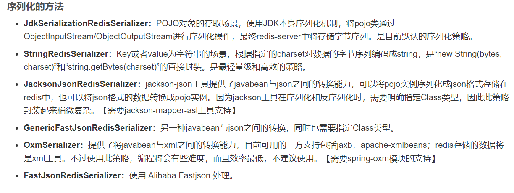

# SpringBoot集成Redis

## 一、Jedis

### 1、依赖

```
<dependency>
 	<groupId>redis.clients</groupId>
 	<artifactId>jedis</artifactId>
 	<version>4.3.1</version>
</dependency>
```

### 2、使用

（1）方法1：*通过**new**获取**Jedis**连接对象*

```
public class Main {
    public static void main(String[] args) {

        //1、通过url和port获取redis的连接对象
        Jedis jedis = new Jedis("192.168.75.200",6379);

        //2、设置redis的连接密码
        jedis.auth("7539515");

        //3、ping方法返回pang说明redis连接成功
        System.out.println(jedis.ping());

        //4、通过依赖中的方法可以想redis指令一样操作redis
        Set set = jedis.keys("*");
        System.out.println(set);
    }
}	
```

（2）方法2：*通过 连接池 获取**Jedis**连接对象*

```
public class Main2 {
    public static void main(String[] args) {
        JedisPoolConfig jedisPoolConfig = new JedisPoolConfig();
        jedisPoolConfig.setMaxTotal(30);
        jedisPoolConfig.setMaxIdle(10);

        JedisPool jedisPool = new JedisPool(jedisPoolConfig,"192.168.75.200",6379);
        Jedis jedis = jedisPool.getResource();

        System.out.println(jedis.ping());
    }
}
```

### 3、优缺点

```
a、优点：
	提供的方法与redis中的指令一致，学习成本变低
	
b、缺点：
	具有线程安全问题（可通过使用jedis提供的连接池来解决）
```


## 二、Lettuce

### 1、依赖

```
<dependency>
	<groupId>io.lettuce</groupId>
	<artifactId>lettuce-core</artifactId>
	<version>5.1.8.RELEASE</version>
</dependency>
```

### 2、使用

```
public class Main {
    public static void main(String[] args) {

        //1、创建连接信息对象（url，port，password）
        RedisURI redisURI = RedisURI.builder()
                .withHost("192.168.75.200")
                .withPort(6379)
                .withPassword("7539515")
                .build();

        //2、创建并连接redis客户端，获取连接对象
        RedisClient redisClient = RedisClient.create(redisURI);
        StatefulRedisConnection<String, String> connect = redisClient.connect();

        //3、创建用于操作的命令对象
        RedisCommands<String, String> commands = connect.sync();

        //4、开始操作
        List<String> keys = commands.keys("*");
        System.out.println("所有的key："+keys);

        //5、关闭连接
        if (connect != null){
            connect.close();
        }
        if (redisClient != null){
            redisClient.shutdown();
        }
    }
}
```

### 3、优缺点

```
a、优点
	线程安全
	
b、缺点
	方法和redis指令有出入，增加学习成本
```


## 三、RedisTemplete

### 1、单机版

#### （1）依赖

```
<dependency>
     <groupId>org.springframework.boot</groupId>
	<artifactId>spring-boot-starter-data-redis</artifactId>
</dependency>
<dependency>
     <groupId>org.apache.commons</groupId>
     <artifactId>commons-pool2</artifactId>
</dependency>
```

```
注意：redisTemplate的依赖中自带lettuce
```

#### （2）配置文件

```
#redis配置（单机版）
spring:
  redis:
    #redis 0-15个数据库
    database: 0
    #ip
    host: 192.168.75.200
    #端口
    port: 6379
    #密码
    password: 7539515
    lettuce:
      pool:
        max-active: 8
        max-wait: -1ms
        max-idle: 8
        min-idle: 0
```

#### （3）Redis配置类

```
@Configuration
public class RedisConfig {
    
    @Bean
    public RedisTemplate<Object, Object> redisTemplate(RedisConnectionFactory redisConnectionFactory) {
        RedisTemplate<Object, Object> redisTemplate = new RedisTemplate<>();
        redisTemplate.setConnectionFactory(redisConnectionFactory);

        ObjectMapper objectMapper = new ObjectMapper();
        objectMapper.setVisibility(PropertyAccessor.ALL, JsonAutoDetect.Visibility.ANY);
        objectMapper.enableDefaultTyping(ObjectMapper.DefaultTyping.NON_FINAL);


        // 设置key和value的序列化规则
        redisTemplate.setKeySerializer(new StringRedisSerializer());
        redisTemplate.setValueSerializer(new StringRedisSerializer());
        redisTemplate.setHashKeySerializer(new StringRedisSerializer());
        redisTemplate.setHashValueSerializer(new StringRedisSerializer());
        redisTemplate.afterPropertiesSet();
        return redisTemplate;
    }
}
```

```
注意：
（1）redis配置类的主要作用就是更改redisTemplate的序列化模板。
（2）redisTemplate默认的序列化方式为JdkSerializationRedisSerializer，这种序列化方式会导致存入redis的key和value或者取出redis的value的时候对数据进行数据化，这样数据格式就会变为字节序列，例如 \xac\xed\x00\x05t\x00\x04 这种格式
（3）如果redis存在String类型的数据k1，但是通过redisTemplate获取数据获取不到为null的话，除了可以改变序列化方式还可以使用String专用的StringRedisTempalte来代替RedisTemplate来处理String类型的数据。（StringRedisTempalte是RedisTemplate的子类）
```

| 常见的序列化方式以及其作用                                   |
| ------------------------------------------------------------ |
|  |

#### （4）使用

```
import lombok.extern.slf4j.Slf4j;
import org.springframework.data.redis.core.RedisTemplate;
import org.springframework.data.redis.core.StringRedisTemplate;
import org.springframework.stereotype.Controller;
import org.springframework.web.bind.annotation.RequestMapping;
import org.springframework.web.bind.annotation.RequestMethod;
import org.springframework.web.bind.annotation.ResponseBody;

import javax.annotation.Resource;

@Slf4j
@ResponseBody
@Controller
@RequestMapping(value = "/StringController")
public class StringController {

    //通用redis模板
    @Resource
    private RedisTemplate redisTemplate;

    //String类型redis模板
    @Resource
    private StringRedisTemplate stringRedisTemplate;

    /**
     * 获取String类型value
     * */
    @RequestMapping(value = "get",method = RequestMethod.POST)
    public String get(String key){
        String value =(String) redisTemplate.opsForValue().get(key);
        log.info("***key:"+key);
        log.info("***value:"+value);
        return value;
    }

    /**
     * 设置String类型value
     * */
    @RequestMapping(value = "/set",method = RequestMethod.POST)
    public void set(String key,String value){
        log.info("***key:"+key);
        log.info("***value:"+value);
        redisTemplate.opsForValue().set(key,value);
    }
}
```


### 2、集群版

#### （1）配置文件

```
spring:
  #redis常规配置
  redis:
    password: 7539515
    lettuce:
      pool:
        max-active: 8
        max-wait: -1ms
        max-idle: 8
        min-idle: 0
    #Spingboot自适应动态刷新redis集群的拓扑结构
      cluster:
        refresh:
          adaptive: true
          period: 2000
    #redis集群配置
    cluster:
      max-redirects: 3
      nodes: 192.168.75.200:6379,192.168.75.201:6380,192.168.75.202:6381
```

#### （2）问题

```
（1）假设现在存在3台主机，以及它们的从机11，22，33。
（2）Java后台访问redis集群，访问的是1号主机。
（3）当1号主机宕机之后，11从机会上位变成主机。
（4）此时Java后台访问的redis服务器仍然后1号服务器（已宕机）。

结论：springboot不能够自动的实时的获取最新的redis集群的拓扑机构。也就是说哪怕redis中要访问的某一个主机宕机了，哪怕实际上宕机的主机的从机已经上位可以继续提供服务了。springboot中访问的仍然是原来的主机（已宕机）。
```

```
解决方法：
spring:
  redis:
    lettuce:
      cluster:
        refresh:
          adaptive: true
          period: 2000
```

