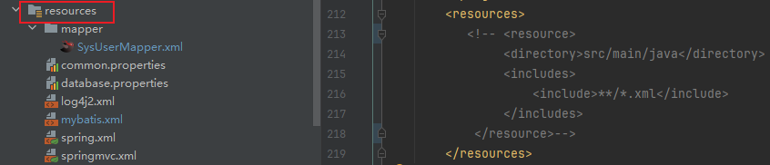
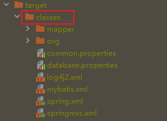
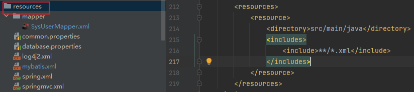
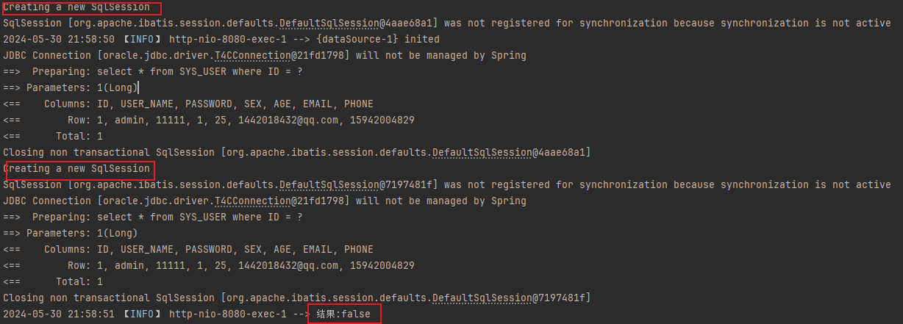
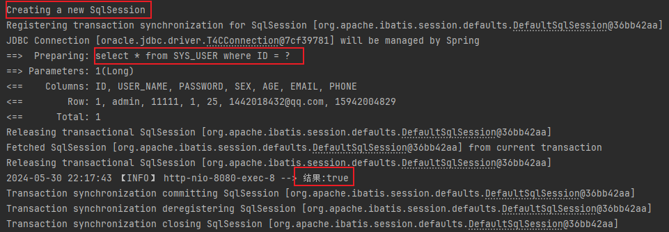
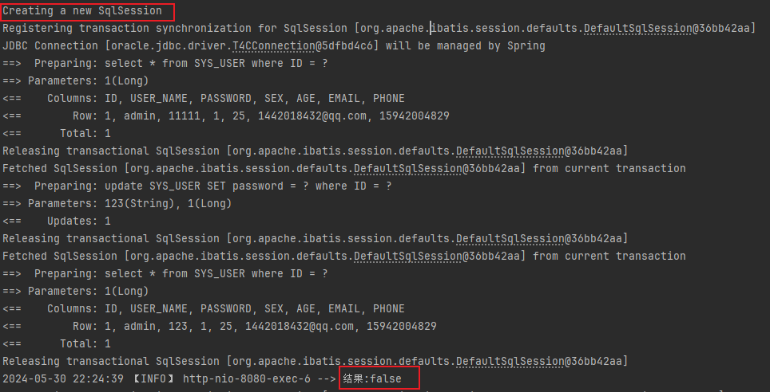

# Mybatis

## 一、Mybatis 搭建


## 二、Mybatis 基本使用

### 1、Sql传参

> 两种方式

- `#{}`

  ```sql
  select * from SYS_USER where ID = #{id}
  ```

- `${}`

  ```sql
  select * from SYS_USER where ID = ${id}
  ```

> 两种传参方式的区别

- `#{}` ：先对sql进行解析，将`#{}`替换成`?`占位符，解析完毕之后sql就固定了，然后对占位符进行赋值，此时赋值的内容不会在被当成sql解析，所以可以有效解决sql注入攻击的问题，最终执行sql。但是`#{}`灵活性不及`${}`。

  | `select * from SYS_USER where ID = #{id}`                    |
  | ------------------------------------------------------------ |
  |  |
  | 由控制台可知，使用`#{}`，`#{}`会被替换成`?`                  |

- `${}`：先对sql进行赋值，然后解析sql，由于赋值是在解析之前进行的，所以赋值完毕之后赋值的内容会被当成sql的一部分进行解析，所以如果赋值的内容是sql语句的话，就会有sql注入攻击的问题。

  <font color=skyblue> 由于`${}`是纯粹的字符串拼接因此灵活性更高，甚至可以赋值一段sql语句，比方说`select * from SYS_USER ${sql}`，那么赋值就可以赋值`where id = 1`最后作为`select * from SYS_USER where id = 1`来执行。而对于`#{} 来说就无法做到，因为它不会将`#{}`所替换的内容作为sql来执行</font>

  | `select * from SYS_USER where ID = ${id}`                    |
  | ------------------------------------------------------------ |
  |  |
  | 由控制台可知，使用`${}`，会先赋值在解析sql                   |


### 2、数据输入

#### （1）简单类型

<font color=pink>简单类型：String，基本数据类型(int,double,long)，基本数据类型的包装类(Integer,Double,Long)</font>

- **<u>单个简单类型的参数</u>**

  ```java
  SysUserEntity selectById(Long id);
  ```

  ```xml
  <select id = "selectById" resultType = "org.yg.ssm_template.entity.system.SysUserEntity">
  	select * from sys_user where id = #{key}
  </select>
  ```

  此时`#{key}`的名字是任意的，但是一般默认是传入参数的名字。

- **<u>多个简单类型的参数</u>**

  ```java
  SysUserEntity selectByCondition(String userName,Integer age);
  ```

  ```xml
  <select id="selectByCondition" resultType="org.yg.ssm_template.entity.system.SysUserEntity">
      select *
      from SYS_USER where USER_NAME = #{key1} and AGE = #{key2}
  </select>
  ```

  <u>*三种处理方式*</u>

  - 使用`@Param`注解手动指定参数名

    ```java
    SysUserEntity selectByCondition(@Param("aaa") String userName, @Param("bbb") Integer age);
    ```

    ```xml
    <select id="selectByCondition" resultType="org.yg.ssm_template.entity.system.SysUserEntity">
        select *
        from SYS_USER where USER_NAME = #{aaa} and AGE = #{bbb}
    </select>
    ```

  - 使用mybatis内置的arg0,arg1,arg2...... 其中arg0代表参数列表的第一个参数，arg1代表第二个，以此类推

    ```java
    SysUserEntity selectByCondition(String userName, Integer age);
    ```

    ```xml
    <select id="selectByCondition" resultType="org.yg.ssm_template.entity.system.SysUserEntity">
        select *
        from SYS_USER where USER_NAME = #{arg0} and AGE = #{arg1}
    </select>
    ```

  - 使用mybatis内置的param1,param2,param3...... 其中param1代表参数列表的第一个参数，param2代表第二个，以此类推

    ```java
    SysUserEntity selectByCondition(String userName, Integer age);
    ```

    ```xml
    <select id="selectByCondition" resultType="org.yg.ssm_template.entity.system.SysUserEntity">
        select *
        from SYS_USER where USER_NAME = #{param1} and AGE = #{param2}
    </select>
    ```

#### （2）复杂类型

<font color=pink>复杂类型：实体类型，List集合，Map集合</font>

- **<u>实体类参数</u>**

  ```java
  int insert(SysUserEntity sysUserEntity);
  ```

  ```xml
  <insert id = "insert" parameterType = "com.yg.entity.SysUserEntity">
  	insert into sys_user(user_name,password) values(#{key},#{key});
  </insert>
  ```

  此时`#{key}`的名字必须得是实体类中成员变量的名字，如果不存在该变量名则会报错

- **<u>Map集合参数</u>**

  ```java
  SysUserEntity selectByCondition(Map map);
  ```

  ```xml
  <select id="selectByCondition" resultType="org.yg.ssm_template.entity.system.SysUserEntity">
      select *
      from SYS_USER where USER_NAME = #{key1} and AGE = #{key2}
  </select>
  ```

  此时`#{key1}`,`#{key2}`为Map集合的key
  
- **<u>List集合参数</u>**

  List集合的使用多半是在sql中进行遍历，使用方法和单个简单类型的参数是一样的。

  *情形1：使用`@Param注解`*

  ```java
  List<SysUserEntity> selectByList(@Param("ids") List<Long> ids);
  ```

  ```xml
  <select id="selectByList" resultType="org.yg.ssm_template.entity.system.SysUserEntity">
      select *
      from SYS_USER
      <!-- 集合名就是@Param声明的名字 -->
      <foreach collection="ids" close=")" open="where id in (" item="item" separator=",">
          #{item}
      </foreach>
  </select>
  ```

  *情形2：使用mybatis内置参数*

  <font color=red>**<u>其中对于集合参数的内置参数：arg0，collection，list 均可。</u>**</font>
  
  ```java
  List<SysUserEntity> selectByList(List<Long> ids);
  ```
  
  ```xml
  <select id="selectByList" resultType="org.yg.ssm_template.entity.system.SysUserEntity">
      select *
      from SYS_USER
      <!-- arg0代表参数列表的第一个参数，也就是对应的List集合 -->
      <foreach collection="arg0" close=")" open="where id in (" item="item" separator=",">
          #{item}
      </foreach>
  </select>
  ```


### 3、数据输出

<font color=pink>对于`DML语句(insert,delete,update)`来说返回值是固定的，就是操作数据的数量。接口方法使用`int`或者`long`类型接收均可，在mapper的xml文件中不需要使用`resultType`手动的指定返回值类型。所以说返回值类型的指定主要针对于`select语句`。</font>

#### （1）mybatis别名问题

<font color=red>规定返回值类型的xml标签属性是`resultType`。该属性有两种写法，第一种是填类的全类名`(java.lang.String)`，第二种填类的别名简称`(string)`。</font>

**<u>mybatis开启别名</u>**：

- 开启单个别名

   优点：可以随意的指定类的别名；缺点：需要为每个类单独配置，很麻烦

  ```xml
   <typeAliases>
       <typeAlias type="org.yg.ssm_template.entity.system.SysUserEntity" alias="aaa"></typeAlias>
       <typeAlias type="org.yg.ssm_template.entity.system.SysMenuEntity" alias="bbb"></typeAlias>
   </typeAliases>
  ```

- 批量开启别名

   优点：可以批量的为某个包中的所有类开启别名；缺点：这种批量开启的方法，别名是固定的（类名首字母小写）

  ```xml
   <typeAliases>
       <package name="org.yg.ssm_template.entity"/>
   </typeAliases>
  ```

- 批量开启别名并自定义别名

  ```xml
   <typeAliases>
       <package name="org.yg.ssm_template.entity"/>
   </typeAliases>
  ```

  ```java
  @Alias("aaa")
  public class SysUserEntity implements Serializable {}
  ```

  <font color=pink>通过使用`@Alias`注解可以单独为某些类指定别名，但是需要注意的是`@Alia`注解必须要配合第二种批量开启别名的方法才会生效。</font>

#### （2）简单类型

- 全类名

  ```xml
  <!-- java.lang.String -->
  <select id="selectNameById" resultType="java.lang.String">
      select user_name from sys_user where id = #{id}
  </select>
  ```

- 别名

  ```xml
  <!-- string -->
  <select id="selectNameById" resultType="string">
      select user_name from sys_user where id = #{id}
  </select>
  ```

  [Mybatis内置别名参考网站](https://mybatis.net.cn/configuration.html#typeAliases)

#### （3）复杂类型

- 单个实体类

  ```xml
  <select id="selectById" resultType="org.yg.ssm_template.entity.system.SysUserEntity">
      select *
      from SYS_USER where ID = #{id}
  </select>
  ```

  <font color=pink>返回单个实体类，mybatis会将查询的所有字段封装进实体类的成员变量中，前提是查询出的字段名和成员变量名一样。</font>

  <font color=pink>如果sql查询出的字段名和实体类中的成员变量名不一致，那么可以考虑开启mybatis的驼峰命名映射来封装实体类或者使用`resultMap`手动配置字段名和成员变量名的映射关系来解决。</font>

  **<u>开启mybatis的驼峰命名映射</u>**

  ```xml
  <settings>
      <!-- 开启数据库字段驼峰命名转换:比方说数据库字段MY_MANE,则会自动转化成myName的Java属性名 -->
      <setting name="mapUnderscoreToCamelCase" value="true"/>
  </settings>
  ```

- Map集合

  - 查询结果集为单行

    <font color=pink>单行：在返回map集合的情况下，`resultType`其实指定的是map集合中value的类型，只不过如果返回单行数据的话`resultType`得指定为map而已。</font>

    ```xml
    <!-- 单行数据：resultType指定为map -->
    <select id="selectMapByCondition" resultType="map">
        select *
        from SYS_USER
        <if test="id != null">
            where ID = #{id}
        </if>
    </select>
    ```

    结果：`{PASSWORD=12312300, SEX=1, PHONE=15942004829, ID=1, USER_NAME=admin, EMAIL=1442018432@qq.com, AGE=25}`，从结果可知最终的map集合的key是数据库的字段，value是字段所对应的值。

  - 查询结果集为多行

    <font color=pink>如果返回多行数据那么必须要配合`@MapKey`注解指定map集合的key，通过`resultType`指定map集合value的类型。如果`resultType`为map，那么`@MapKey`的值就是map集合中某个key的值，如果`resultType`为某个实体类类型，那么`@MapKey`就是实体类中某个成员变量的变量名。</font>

    ```java
    //map集合的key为SysUserEntity这个实体类的userName成员变量
    @MapKey("userName")
    Map<String,SysUserEntity> selectMapByCondition(Long id);
    ```

    ```xml
    <!-- 多行数据：resultType指定map集合的value值类型为SysUserEntity -->
    <select id="selectMapByCondition" resultType="org.yg.ssm_template.entity.system.SysUserEntity">
        select *
        from SYS_USER
        <if test="id != null">
            where ID = #{id}
        </if>
    </select>
    ```

    最终结果：

    ```json
    // userName为key，SysUserEntity为value
    {
      "root":{
        "id":21,
        "userName":"root",
        "password":"12312300",
        "sex":1,
        "age":25,
        "email":"1442018432@qq.com",
        "phone":"15942004829"
      },
      "admin":{
        "id":1,
        "userName":"admin",
        "password":"12312300",
        "sex":1,
        "age":25,
        "email":"1442018432@qq.com",
        "phone":"15942004829"
      }
    }
    ```

- List集合

  <font color=pink>如果要返回List那么`resultType`为集合的泛型类型而不是集合类型。</font>

  

### 4、主键回显

- 自增长主键回显

  `useGeneratedKeys`：是否获取数据库生成的主键

  `keyColumn`：从数据库哪个字段上获取主键

  `keyProperty`：接收主键值的实体类成员变量

  ```xml
  <insert id="insert" useGeneratedKeys="true" keyColumn="id" keyProperty="id">
      insert into SYS_USER (USER_NAME, PASSWORD)
      values (#{userName},#{password})
  </insert>
  ```

- 非自增长主键回显

  `insert`标签中含有一个`selectKey`的标签，该标签中的sql可以控制在正式插入语句执行前或者执行后被执行，一般用于插入前插入对象的初始化。

  `order`：控制`selectKey`标签中sql的执行时机。BEFORRE：在insert语句执行之前被执行，AFTER：在insert语句执行之后被执行。

  `keyProperty`：sql查询结果最终要存入对象的成员变量

  `resultType`：sql查询结果的类型

  ```xml
  <insert id="insert" useGeneratedKeys="true" keyColumn="id" keyProperty="id">
      <!-- 在insert语句执行之前执行该sql，然后将执行的结果放入要插入对象的password属性中 -->
      <selectKey resultType="string" keyProperty="password" order="BEFORE">
          select sys_guid() from DUAL
      </selectKey>
      insert into SYS_USER (USER_NAME, PASSWORD)
      values (#{userName},#{password})
  </insert>
  ```


### 5、结果集映射

<u>*数据库字段名和实体类成员变量名不一致的解决方案：*</u>

- 别名

  数据库字段起别名使其与实体类成员变量名保持一致。比方说数据库字段为`USER_NAME`，那么就可以在查询的时候使用`userName`代替`USER_NAME`。

  ```sql
  select user_name as userName from sys_user;
  ```

- 驼峰命名映射

  开启驼峰命名就可以自动的将`user_name`转化成其驼峰命名`userName`.

  <font color=red>对于`resultType`属性来说即便开启了驼峰命名映射也不是完美的。第一点，如果数据库字段为a，但是要用实体类中的b来接受，那使用`resultType`属性是无论如何都无法映射的；第二点，如果数据库的字段为a，但是实体类的直接成员变量中是没有名为a的成员变量的，但实体类中的一个成员变量b的成员变量中却有a，此时也是无法映射到b中的a的，也就是说`resultType`只能映射一层结构。</font>

  ```xml
  <settings>
      <!-- 开启数据库字段驼峰命名转换:比方说数据库字段MY_MANE,则会自动转化成myName的Java属性名 -->
      <setting name="mapUnderscoreToCamelCase" value="true"/>
  </settings>
  ```

- 自定义映射关系

  <font color=red>`resultMap`可以为任意层结构赋值。</font>

  <u>*resultMap属性*</u>

  - id：resultMap的唯一标识，用于select查询标签引用
  - type：需要自定义映射关系的类

  <u>*resultMap映射一层结构*</u>

  - id：用于映射主键id：column-数据库字段名，property-实体类属性名
  - result：用于映射普通字段：column-数据库字段名，property-实体类属性名

  ```xml
  <resultMap id="map1" type="org.yg.ssm_template.entity.system.SysUserEntity">
      <id column="id" property="id"></id>
      <result column="user_name" property="userName"></result>
  </resultMap>
  ```

  <u>*resultMap映射多层结构：一对一映射*</u>

  <font color=pink>使用`association`标签将查询结果映射给一层成员变量的实体类成员变量。</font>

  `association`标签的`property`属性代表实体类成员变量名，`javaType`代表实体类成员变量的类型。

  ```java
  //实体类结构
  @Data
  @AllArgsConstructor
  @NoArgsConstructor
  @Accessors(chain = true)
  @Builder
  public class SysUserEntity implements Serializable {
      private Long id;
      private String userName;
      private String password;
      private Integer sex;
      private Integer age;
      private String email;
      private String phone;
      
      //一对一
      private SysMenuEntity sysMenu;
  }
  ```

  ```xml
  <resultMap id="map1" type="org.yg.ssm_template.entity.system.SysUserEntity">
      <id column="id" property="id"></id>
      <result column="user_name" property="userName"></result>
      
      <!-- 使用association标签将查询结果映射给成员变量的成员变量 -->
      <association property="sysMenu" javaType="org.yg.ssm_template.entity.system.SysMenuEntity" >
          <id column="id" property="id"></id>
          <result column="menu_name" property="menuName"></result>
      </association>
  </resultMap>
  ```

  <u>*resultMap映射多层结构：一对多映射*</u>

  <font color=pink>使用`collection`标签将查询结果映射给一层成员变量的集合成员变量。</font>

  `collection`标签的`property`属性代表集合成员变量名，`ofType`代表集合成员变量的泛型类型。

  ```java
  //实体类结构
  @Data
  @AllArgsConstructor
  @NoArgsConstructor
  @Accessors(chain = true)
  @Builder
  public class SysUserEntity implements Serializable {
      private Long id;
      private String userName;
      private String password;
      private Integer sex;
      private Integer age;
      private String email;
      private String phone;
      
      //一对多
      private List<SysMenuEntity> sysMenus;
  }
  ```

  ```xml
  <resultMap id="map1" type="org.yg.ssm_template.entity.system.SysUserEntity">
      <id column="id" property="id"></id>
      <result column="user_name" property="userName"></result>
      
      <!-- 使用collection标签将查询结果映射给集合成员变量 -->
      <collection property="sysMenu" ofType="org.yg.ssm_template.entity.system.SysMenuEntity" >
          <id column="id" property="id"></id>
          <result column="menu_name" property="menuName"></result>
      </collection>
  </resultMap>
  ```


## 三、Mybatis 动态SQL

### 1、if

```xml
<if test = "">
	<!-- sql语句 -->
</if>
```

- 如果`test`中的判断为true，那么拼接`if`标签中的sql；如果为false则不拼接。
- test中用于判断的参数就是`#{}`或者`${}`中的参数名。详见（"数据输入"）


### 2、where + if

```xml
 <where>
	<if test = "">
     	<!-- sql语句 -->
     </if>
</where>
```

- 只要`where`标签中有一个`if`标签的`test`为true，那么就会自动在最前面添加一个`where`

- 如果`where`标签中没有一个`if`标签的`test`为true，那么就不会在最前面添加`where`

- `where`标签会自动去除多余的`and`和`or`。

  ```xml
  <!-- 
  	此时每个if中都含有一个and，如果第一个if也满足的话就会拼成“ where and a = 1 and b = 1 and c = 1 ” ，但是where会自动的将第一个前多余的and给去除，保证sql的正确
   -->
  <where>
  	<if test = "a != null">
       	and a = 1
       </if>
       <if test = "b != null">
       	and b = 1
       </if>
       <if test = "c != null">
       	and c = 1
       </if>
  </where>
  ```


### 3、set + if

<font color=pink>主要用于`update`更新语句。</font>

```xml
 <set>
	<if test = "">
     	<!-- sql语句 -->
     </if>
</set>
```

- 使用`set`标签会自动的添加`set`关键字

- 使用`set`标签会自动去除多余的`,`

  ```xml
  <!-- 
  	加入说三个if全部满足,那么就会拼成" set a = 1,b = 2,c = 3, ",由此可以发现最后多余了一个逗号，如果使用set标签的话，那么就会自动将末尾的逗号去掉 
  -->
  <set>
  	<if test = "a != null">
       	a = 1,
       </if>
       <if test = "b != null">
       	b = 1,
       </if>
       <if test = "c != null">
       	c = 1,
       </if>
  </set>
  ```

- 注意：`set`标签和`where`标签的一个区别是：`where`标签中如果没有一个`if`满足那么就不会加`where`；但是对于`set`标签来说如果没有一个`if`标签满足，那么就会报错。因为对于sql语句来说`where`是可有可无的，但是更新语句的时候必须要有`set`。


### 4、trim 

<font color=pink>万能标签</font>

<u>*四个常用属性*</u>

- prefix：定义动态sql的前缀。`<trim prefix = "where"></trim>`
- suffix：定义动态sql的后缀。`<trim suffix = ")"></trim>`
- prefixoverrides：定义动态sql排除的前缀，多个选项使用`|`隔开。`<trim prefixoverrides = "and|or"></trim>`
- suffixoverrides：定义动态sql排除的后缀，多个选项使用`|`隔开。`<trim suffixoverrides = ",|;"></trim>`


### 5、choose + when + otherwise

<font color=pink>类比Java中的`switch-case`语句。</font>

<font color=red>`choose`标签和`if`标签最大的区别：存在多个`if`那么会从上到下依次判断，只要满足就会拼接；而对于`choose`来说从上到下判断`when`，只要有一个满足其他的`when`就不会再判断，如果一个`when`都不匹配，那么就会拼接`otherwise`中的sql。</font>

```xml
<choose>
	<whern test="a != null">
    	a = 1
    </whern>
 	<whern test="b != null">
    	b = 1
    </whern>
    <otherwise>c = 1</otherwise>
</choose>
```


### 6、foreach

<u>*常用属性*</u>：

- collection：待遍历的集合（@Param指定，内置参数：arg0，list，collection，param1）
- open：遍历起始字符串
- close：遍历截至字符串
- item：每个遍历项（每个遍历项`#{key}`的key值）
- separator：每个遍历项的分隔符

<u>*两种遍历情况*</u>：

- 单语句遍历

  <font color=pink>将一个sql语句其中的一部分遍历多次。</font>

  ```xml
  <select id = "selectByList" resultType = "org.yg.ssm_template.entity.system.SysUserEntity">
  	select * from sys_user where id in
      <foreach collection="list" separator="," item="id" open="(" close=")">
         #{id}
      </foreach>
  </select>
  ```

- 多语句遍历

  <font color=pink>将整个sql语句遍历多次，通过配合`begin-end`同时执行多条sql语句。</font>

  ```xml
  <insert id="insertList" parameterType="org.yg.ssm_template.entity.system.SysUserEntity">
      <foreach collection="list" item="user" open="begin" close="end;">
          insert into SYS_USER (USER_NAME, PASSWORD) values (#{user.userName},#{user.password});
      </foreach>
  </insert>
  ```


### 7、sql片段

```xml
<!-- 通过"sql标签"定义sql片段,id就是sql片段的唯一标识,用于sql片段的引用 -->
<sql id="sqlId">
	select * from sys_user
</sql>
```

```xml
<!-- 通过"include"标签引用sql片段,refid就是用来指定引用sql片段的id -->
<include refid="sqlId"></include>
```


## 四、Mybatis 注解

<font color=pink>（了解）</font>

- `@Select`

  ```java
  public interface UserMapper {
      
      @Select("select * from usertest where usid = #{usid}")
      Usertest test1(int usid);
  }
  ```

- `@Insert`

  ```java
  public interface UserMapper {
      
      @Insert("insert into usertest(usname,uspass) value (#{usname},#{uspass})")
      int test2(String usname,String uspass);
  }
  ```

- `@Update`

  ```java
  public interface UserMapper {
      
      @Update("update usertest set uspass=#{uspass} where usname=#{usname}")
      int test3(String usname,String uspass);
  }
  ```

- `@Delete`

  ```java
  public interface UserMapper {
      
      @Delete("delete from usertest where usname = #{usname}")
      int test4(String usname);
  }
  ```

- @Param

  ```java
  public interface UserMapper {
      
      @Select("select * from usertest where usid = #{aaa}")
      Usertest test1(@Param("aaa") int usid);
  }
  ```


## 五、Mybatis 扩展

### 1、Mapper批量处理

<font color=pink>以下两种方式都是mybatis.xml配置文件中的标签。</font>

<u>方式1</u>：

```xml
<!-- 这种方式每次写一个mapper.xml文件都要来此配置，比较麻烦 -->
<mappers>
    <mapper resource="mapper/SysUserMapper.xml"/>
    <mapper resource="mapper/SysMenuMapper.xml"/>
</mappers>
```

<u>*方式2*</u>：

```xml
<!-- 
	两个要求：
 	（1）mapper接口和mapper.xml文件最终要打包到同一个包下。由于mapper.xml放在resources文件夹下，最终mapper.xml文件会打包到类路径的根路径，要想和mapper接口打到同一个包下，那就要求在resources下建立和mapper接口一样的包路径。
	（2）mapper接口和mapper.xml文件名要一样
-->
<mappers>
    <package name="org.yg.ssm_template.mapper"/>
</mappers>
```


### 2、PageHelper

- 依赖

  ```xml
  <dependency>
     <groupId>com.github.pagehelper</groupId>
     <artifactId>pagehelper</artifactId>
     <version>6.1.0</version>
  </dependency>
  ```

- Mybatis配置文件

  <u>*xml配置文件*</u>

  ```xml
  <plugins>
       <!-- 开启pageHelper分页插件 -->
      <plugin interceptor="com.github.pagehelper.PageInterceptor">
           <!-- 设置分页数据库方言 -->
          <property name="helperDialect" value="oracle"/>
      </plugin>
  </plugins>
  ```

  <u>*Java配置类*</u>

  <font color=pink>如果数据源是mybatis默认支持的数据库（mysql，oracle...），则mybatis会根据数据源自动选择分页方言</font>

  ```java
  /**
   * 数据库相关Bean配置
   */
  @Import({DataResourceConfig.class})
  public class MybatisConfig {
  
      /**
       * 注册SqlsessionFactoryBean: 负责获取sqlSession对象
       *
       * @param dataSource
       * @return
       */
      @Bean(name = "sqlSessionFactoryBean")
      public SqlSessionFactoryBean getSqlsessionFactroyBean(DataSource dataSource,
                                                            @Value("${mapper.xml.location}") String mapperPath,
                                                            @Value("${alias.package}") String aliasPackagePath
      ) throws IOException {
          SqlSessionFactoryBean sqlSessionFactoryBean = new SqlSessionFactoryBean();
  
          //配置数据源
          sqlSessionFactoryBean.setDataSource(dataSource);
  
          //读取mybatis的xml配置文件
          //sqlSessionFactoryBean.setConfigLocation(new ClassPathResource("mybatis.xml"));
  
          //设置mapper.xml文件位置
          sqlSessionFactoryBean.setMapperLocations(new PathMatchingResourcePatternResolver().getResources(mapperPath));
          //设置实体类别名
          if (StrUtil.isNotBlank(aliasPackagePath)) sqlSessionFactoryBean.setTypeAliasesPackage(aliasPackagePath);
          //设置分页插件（如果数据源是mybatis默认支持的数据库则mybatis会根据数据源自动选择分页方言）
          sqlSessionFactoryBean.setPlugins(new PageInterceptor());
  
          // mybtis配置类
          org.apache.ibatis.session.Configuration config = new org.apache.ibatis.session.Configuration();
          //1、开启mybatis日志：日志实现-StdOutImpl.class
          config.setLogImpl(StdOutImpl.class);
          //2、开启二级缓存
          config.setCacheEnabled(false);
          //3、开启驼峰命名转换
          config.setMapUnderscoreToCamelCase(true);
  
          //添加配置
          sqlSessionFactoryBean.setConfiguration(config);
  
          return sqlSessionFactoryBean;
      }
  
  }
  ```

- 使用

  ```java
  @Service
  @Slf4j
  public class SysUserServiceImpl implements SysUserService {
      @Resource
      private SysUserMapper sysUserMapper;
  
      @Override
      public void test(Long id,Integer flag) {
          //开启分页
          PageHelper.startPage(1,5);
          //查询语句
          List<SysUserEntity> sysUserEntities = sysUserMapper.selectAll();
          //获取分页信息(总页数,总条数...,泛型为实体类类型)
          PageInfo<SysUserEntity> pageInfo = new PageInfo<>(sysUserEntities);
          
          //获取总条数
          long total = pageInfo.getTotal();
          //获取总页数
          int pages = pageInfo.getPages();
          //获取当前页号
          int pageNum = pageInfo.getPageNum();
          //获取当前页数据
          List<SysUserEntity> list = pageInfo.getList();
      }
  }
  
  ```


## 六、Mybatis 常见问题

### 1、if标签test中的等号问题

- `==`：等号

  ```xml
  <!-- 只有a=1时才会拼接sql -->
  <if test = "a == 1"></if>
  ```

- `=`：赋值

  ```xml
  <select id="selectById" resultType="org.yg.ssm_template.entity.system.SysUserEntity">
      select *
      from SYS_USER
      <if test="id = 2">
          where ID = #{id}
      </if>
  </select>
  ```

  此时如果传入参数`id = 1`，而最终查询的是`id = 2`的数据，因为`=`是为id赋值成2，赋值后用新的值去查询导致。

- `!=`：不等于

  ```xml
  <!-- 只有a!=1时才会拼接sql -->
  <if test = "a != 1"></if>
  ```


### 2、if标签test中字符和字符串问题

<font color=red>注意：在`if`标签的test属性中：字符和数字比较，字符会转化成`Ascii`码表对应的数字然后与数字进行比较；字符串和数字比较，那么会将字符串强制转化成数字然后和数字比较，如果字符串比方说`"a"`无法强转成数字就会抛出数字格式转化异常；字符串和字符比较恒不等，可对字符使用`toString()`转成字符串后进行比较。</font>

<font color=pink>判断字符和字符串：在`test`属性中的字符就是单个字符并且使用了`''`单引号。单个字符但是使用`""`双引号那么属于字符串，多个字符哪怕是使用了单引号也是属于字符串的。</font>


### 3、mapper文件打包问题

由于`src/main/java`默认是源码路径所以只会将Java源代码进行编译和打包，而不会打包其他的文件。所以，如果将mapper文件放在该文件夹下，mapper文件最终不会被打包。

**<u>解决方法</u>**：

<font color=pink>该配置的作用是将`src/main/java`目录下的所有xml文件进行打包</font>

```xml
<build>
    <resources>
        <resource>
            <directory>src/main/java</directory>
            <includes>
                <include>**/*.xml</include>
            </includes>
        </resource>
    </resources>
</build>
```

**<u>产生的问题</u>**：

|  |
| ------------------------------------------------------------ |

不添加该配置之前，resources文件夹是项目的资源路径，打包后其中的所有文件都会出现在类路径的根路径里。

|  |
| ------------------------------------------------------------ |

但是使用配置之后便变成了普通的文件夹，其中所有的文件都不会被打包

|  |
| ------------------------------------------------------------ |

**<u>完美解决</u>**：

<font color=pink>出现上述问题的原因是maven默认的打包会将resources文件夹下的所有文件打包，但是如果手动添加了`<resources></resources>`配置，那么默认配置就会被完全覆盖，以最新配置的为准。所以此时就只会将`src/main/java`文件夹下的xml文件打包。如果想解决这个问题，就需要再配置将`src/main/resources`文件夹下的文件打包。</font>

```xml
<build>
    <resources>
        <resource>
            <directory>src/main/java</directory>
            <includes>
                <include>**/*.xml</include>
            </includes>
        </resource>
        <resource>
            <directory>src/main/resources</directory>
            <includes>
                <include>**/*.*</include>
            </includes>
        </resource>
    </resources>
</build>
```


### 4、数据库：连接和会话

<font color=red>连接是项目和数据库之间的一个通信通道，而会话则是与数据库的一次交互。</font>

<font color=pink>与数据库一次通信的过程：项目首先生成SQL会话，然后去连接池中看有没有正在连接的连接，有的话使用该连接完成交互，没有的话新建连接完成交互，交互完成之后立马销毁会话，连接则放入连接池，等待下一次会话。</font>

<u>在未开启事务的情况下，每次执行一个SQL语句都会建立一个SQL会话完成与数据库的交互，交互完成之后立马提交事务并关闭会话。在开启事务的情况下，一个方法内执行的所有SQL都在一个会话中，最终一起提交或回滚事务。</u>

项目与数据库连接的建立是一个比较耗时的操作，所以为了避免频繁的与数据库建立连接，影响执行效率，采用连接池来解决。连接池的作用就是当要进行数据库操作的时候先去连接池中看看有没有处于连接中的连接，如果存在的话直接使用该连接，不存在的话再去与数据库建立新的连接，并且交互完成之后连接并不会被销毁，而是重新放入连接池中。这样可以避免频繁的与数据库建立连接，提高执行效率。


### 5、Mybatis一级缓存

<font color=pink>Mybatis中一级缓存默认是打开的。</font>

<font color=pink>一级缓存是sqlsession级别的缓存，也就是说当sqlsession关闭之后缓存就会全部清空。</font>

**<u>一级缓存的特点</u>**：

1. （前提：方法中只进行查询）不开启事务的时候，每次执行一条SQL都会创建一个新的sqlsession，执行完毕之后关闭sqlsession（close方法）。<font color=skyblue>通过缓存返回的是相同对象的引用。</font>

   ```java
   @Service
   @Slf4j
   public class SysUserServiceImpl implements SysUserService {
       @Resource
       private SysUserMapper sysUserMapper;
   
       @Override
       //@Transactional 不开启事务
       public void test(Long id,Integer flag) {
           SysUserEntity sysUserEntity = sysUserMapper.selectById(1l);
           SysUserEntity sysUserEntity1 = sysUserMapper.selectById(1l);
           log.info("结果:{}",sysUserEntity == sysUserEntity1);
       }
   }
   ```

   |  |
   | ------------------------------------------------------------ |
   | <font color=skyblue>由此可以发现，未开启事务的时候每次查询都会开启一个新的sqlsession，每次查询完毕sqlsession关闭之后缓存就会清空，所以两次获取的是两个不一样的对象。</font> |

2. （前提：方法中只进行查询）开启事务的时候，在一个方法内只会创建一个sqlsession，整个方法执行完毕之后才会关闭sqlsession。

   ```java
   @Service
   @Slf4j
   public class SysUserServiceImpl implements SysUserService {
       @Resource
       private SysUserMapper sysUserMapper;
   
       @Override
       @Transactional //开启事务
       public void test(Long id,Integer flag) {
           SysUserEntity sysUserEntity = sysUserMapper.selectById(1l);
           SysUserEntity sysUserEntity1 = sysUserMapper.selectById(1l);
           log.info("结果:{}",sysUserEntity == sysUserEntity1);
       }
   }
   ```

   |  |
   | ------------------------------------------------------------ |
   | <font color=skyblue>由此可以发现，开启事务后整个方法内只创建了一个sqlsession，所以当mybatis发现第二次的查询与第一次一模一样的时候，就不会再去数据库查询（只有一条sql语句的原因），并且直接从sqlsession的缓存中获取的对象的引用（两次查询两个对象是同一个的原因）。</font> |

   

3. 不论是否开启事务，两次查询之间有任何一条"增删改"的语句，都会清理缓存(clearCache方法)，并且每执行一次增删改都会清理一次缓存。

   ```java
   @Service
   @Slf4j
   public class SysUserServiceImpl implements SysUserService {
       @Resource
       private SysUserMapper sysUserMapper;
   
       @Override
       @Transactional //开启事务
       public void test(Long id,Integer flag) {
           SysUserEntity sysUserEntity = sysUserMapper.selectById(1l);
           int i = sysUserMapper.updateById(SysUserEntity.builder().id(1l).password("123").build());
           SysUserEntity sysUserEntity1 = sysUserMapper.selectById(id);
           log.info("结果:{}",sysUserEntity == sysUserEntity1);
       }
   }
   ```

   |  |
   | ------------------------------------------------------------ |
   | <font color=skyblue>不开启事务自不必说，每个sql的执行都会创建一个新的sqlsession，没有使用sqlsession的缓存，导致两次相同查询的对象不是同一个。开启事务之后虽然仍然只创建了一个会话，但是两次查询之间添加了增删改之类的sql，导致每次增删改后都会清理sqlsession缓存，导致第二次查询的时候缓存没有命中，重新去数据库中查询。</font> |


### 6、Mybatis二级缓存

<font color=pink>Mybatis中二级缓存默认是关闭的，也不推荐开启。</font>

**<u>二级缓存详解</u>**：

1. 二级缓存是基于sqlsessionfactory的缓存，也就是说由sqlsessionfactory创建的所有sqlsession都会共享二级缓存。

2. 二级缓存是以命名空间为单位，每个mapper.xml文件都可以作为一个命名空间，对应一个二级缓存。命名空间中的所有select语句都会被缓存，命名空间中执行任意的增删改语句都会清空**<u>当前命名空间</u>**的二级缓存，同时一级缓存也会被清空。

   <font color=red>下面两种开启二级缓存的前提是mybatis开启了二级缓存，即`<setting name="cacheEnabled" value="true"/>`。</font>

   - 通过在Java中使用`@CacheNamespace`注解开启当前mapper命名空间二级缓存

     ```java
     @CacheNamespace
     public interface SysUserMapper {
         //使用CacheNamespace注解那么必须就全部使用注解，如果sql在xml中配置的话，那么二级缓存就会失效
         @Select("select * from sys_user where id = #{id}")
         SysUserEntity selectById(Long id);
     }
     ```

   - 通过在mapper.xml中使用`<cache/>`开启当前mapper命名空间二级缓存

     ```xml
     <?xml version="1.0" encoding="UTF-8" ?>
     <!DOCTYPE mapper PUBLIC "-//mybatis.org//DTD Mapper 3.0//EN" "http://mybatis.org/dtd/mybatis-3-mapper.dtd" >
     <mapper namespace="org.yg.ssm_template.mapper.SysUserMapper">
         <select id="selectById" resultType="org.yg.ssm_template.entity.SysUserEntity">
         </select>
     
         <update id="updateById" parameterType="org.yg.ssm_template.entity.SysUserEntity">
         </update>
         
         <!-- 开启命名空间缓存 -->
         <cache/>
     </mapper>
     ```


**<u>二级缓存存在的问题</u>**：

在一个命名空间内进行单表的增删改查是没有问题的。查询使用缓存，增删改清空缓存影响的都是同一个命名空间的缓存。

<font color=red>但是一旦当前命名空间所对应的表在其他的命名空间中使用，那就有可能出现问题。比方说，存在一个A和B表，在BMapper中使用了A表做查询，然后A表的数据就在BMapper这个命名空间中缓存。此时使用AMapper进行A表数据的修改，此时会清空AMapper这个命名空间中的缓存，但是不影响BMapper的缓存。所以此时再使用BMapper查询A会从BMapper的缓存中获取旧的A表的数据。</font>


### 7、一级和二级缓存的执行顺序问题

<font color=red>如果一级缓存和二级缓存都开启的话，那么先查询二级缓存，再查询一级缓存，都没有查询到的话才去查询数据库。</font>

<font color=red>Sqlsession关闭之后，一级缓存会写入二级缓存。</font>


### 8、mapper接口的扫描问题

<u>*两种扫描mapper接口的方式*</u>：

- `@Mapper`

  扫描单个mapper接口

- `@MapperScan`

  扫描mapper接口的包路径

<font color=pink>这两个注解的作用都是扫描mapper接口，然后在spring容器中创建mapper接口的代理类对象。因此可以使用`@Autowired`或者`@Resource`注解注入mapper接口的代理类对象。</font>

在ibatis中，dao层调用sql，是通过`sqlsession`中的`selectList`,`selectOne`,`insert`,`update`,`delete`等方法通过每个方法中的`statement`参数找到mapper.xml文件中对应的sql执行。`statement`参数实际上就是mapper.xml文件中`namespace + id`。

```java
sqlSession.selectList("com.yg.ssm_template.SysUserMapper.selectList",param);
```

此时statement是随便填写的，只要保证`namespace + id`是唯一的即可。

但是这种做法容易出现的问题就是statement是自己手填的，容易填错。所以mybatis就对ibatis做了进一步的封装，使用一个mapper接口，通过`接口全类名 + 方法名`代表这个statement。我们只需要关注调用接口方法即可，而statement的拼接以及调用`sqlsession`中的方法完成数据库操作，则是由mapper接口的代理类对象完成。

<font color=red>注意：`@Mapper`和`@MapperScan`不能组合使用，组合使用的话`@Mapper`不生效。</font>
