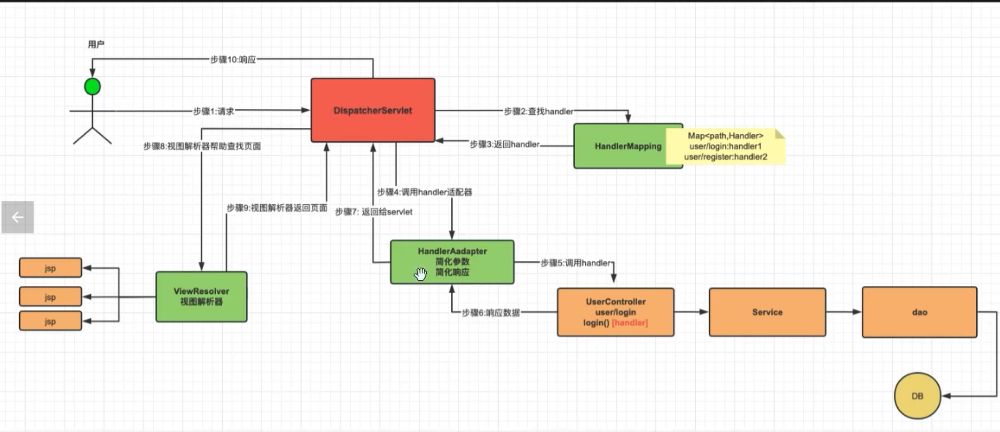
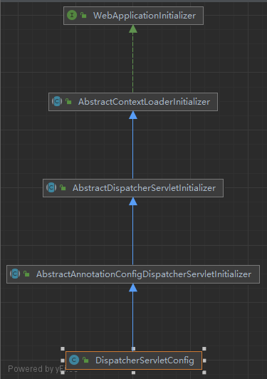
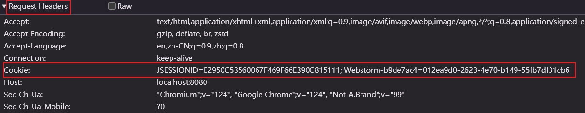
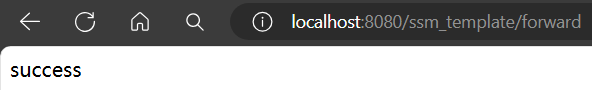
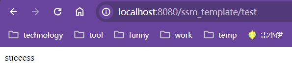
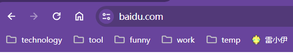
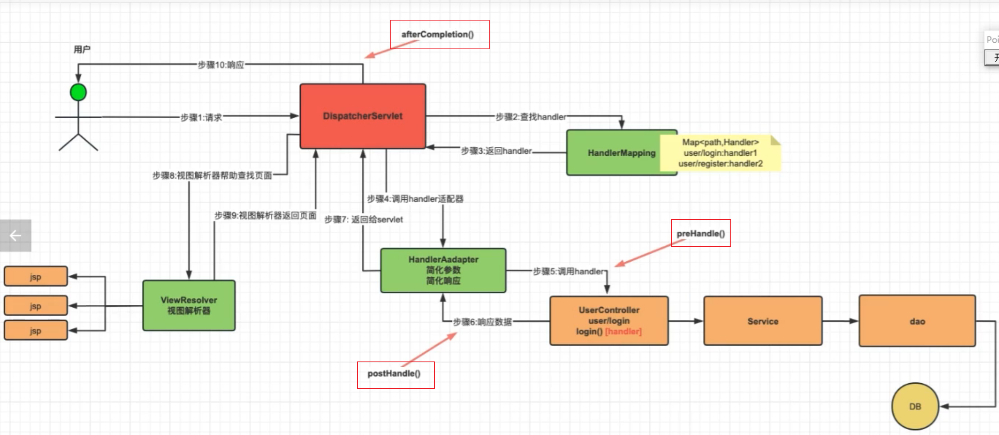

# Spring MVC 笔记

## 一、Spring MVC 执行流程

<font color=red>**<u>面试重点</u>**</font>

|  |
| ------------------------------------------------------------ |

1. <font color=limegreen>流程详解：（1）当用户发起请求，请求会被dispatcherServlet拦截，然后dispatcherServlet会调用handlerMapping解析请求路径。（2）handlerMapping会解析请求路径找到对应的handler，handler也就是controller中的一个个方法，每个方法都与一个请求路径对应。（3）handlerMapping将获取到的handler返回给dispatcherServlet，dispatcherServlet会再调用handlerAdapter适配handler，也就是将请求中携带的请求参数注入到controller方法的参数列表中。然后handler执行，执行结果再由handlerAdapter封装到响应中返回给dispatcherServlet。（4）如果响应的数据不是json而是一个视图，那么dispatcherServlet会将返回的数据给viewResolver，viewResolver根据响应的数据查找页面并返回给dispatcherServlet。由于每个handler并不是都会响应视图所以这一步并不是必须的（5）最终由dispatcherServlet将最终视图展示给用户</font>
2. <font color=skyblue>组件作用：</font>
   - dispatcherServlet：前端调度器，springMVC核心组件，所有请求都会经由dispatcherServlet分发和处理
   - handlerMapping：处理器映射器，其中缓存请求路径和handler之间的对应关系，可以根据请求路径获取对应的handler
   - handler：处理器，可以理解为controller中的一个个方法
   - handlerAdapter：处理器适配器，主要用于将请求中的参数封装进handler的参数列表以及将handler返回的数据封装进响应中返回
   - viewResolver：视图解析器，根据响应数据查找视图并返回给dispatcherServlet，由dispatcherServlet返回给用户
   
   

## 二、SpringMVC 环境搭建


## 三、SpringMVC 容器

1. **<u> Web应用初始化接口</u>**

   <font color=pink>实现`WebApplicationInitializer`接口并重写`onStartup`方法，那么web应用启动的时候就会自动调用`onStartup`方法。方法中可添加初始化相关的逻辑</font>

   ```java
   @Slf4j
   public class WebApplicationStartConfig implements WebApplicationInitializer {
       @Override
       public void onStartup(ServletContext servletContext) 
           throws ServletException {
           log.info("WebApplication Start ~~");
       }
   }
   ```

2. **<u>Web初始化流程</u>**

   - 自定义类继承`AbstractAnnotationConfigDispatcherServletInitializer`类

     ```java
     /**
      * 配置DispatcherServlet
      */
     public class DispatcherServletConfig extends AbstractAnnotationConfigDispatcherServletInitializer {
         /**
          * 指定读取的配置类,初始化Spring容器（父容器）
          * 注意：父容器不可获取子容器Bean
          *
          * @return
          */
         @Override
         protected Class<?>[] getRootConfigClasses() {
             return new Class[]{BaseConfig.class};
         }
     
         /**
          * 指定读取的配置类,初始化SpringMVC容器（子容器）
          * 注意：子容器可以获取父容器Bean
          *
          * @return
          */
         @Override
         protected Class<?>[] getServletConfigClasses() {
             return new Class[]{HandlerAboutConfig.class};
         }
     
         /**
          * 指定DispatcherServlet的处理路径
          *
          * @return
          */
         @Override
         protected String[] getServletMappings() {
             return new String[]{"/"};
         }
     }
     ```

   - `AbstractAnnotationConfigDispatcherServletInitializer`类是WebApplicationInitializer接口的间接实现类。由此可知自定义类在应用启动的时候会被加载

     |  |
     | ------------------------------------------------------------ |

   - 上级父类中存在`AbstractDispatcherServletInitializer`和`AbstractContextLoaderInitializer`，其中`AbstractDispatcherServletInitializer`是`AbstractContextLoaderInitializer`的子类。

     ```java
     //Java源码
     public abstract class AbstractDispatcherServletInitializer 
         extends AbstractContextLoaderInitializer{
         // ......
     }
     ```

   - 这两个类中均有`onStartup`方法。并且可以由源码得知子类`AbstractDispatcherServletInitializer`的`onStartup`显式调用了父类`AbstractContextLoaderInitializer`的`onStartup`方法。而父类中的`onStartup`方法用于Spring容器的初始化，子类中的`onStartup`方法用于SpringMVC容器的初始化

     ```java
     //Java源码
     //AbstractDispatcherServletInitializer的onStartup方法
     public abstract class AbstractDispatcherServletInitializer 
         extends AbstractContextLoaderInitializer {
         public void onStartup(ServletContext servletContext) 
             throws ServletException {
             super.onStartup(servletContext);
             this.registerDispatcherServlet(servletContext);
         }
     }
     ```

     ```java
     //Java源码
     //AbstractContextLoaderInitializer的onStartup方法
     public abstract class AbstractContextLoaderInitializer 
         implements WebApplicationInitializer {
         
         public void onStartup(ServletContext servletContext) 
             throws ServletException {
             this.registerContextLoaderListener(servletContext);
         }
     }
     ```

   - 创建Spring容器的配置类从自定义类的`getRootConfigClasses`方法中获取，创建SpringMVC容器的配置类从自定义类的`getServletConfigClasses`方法中获取

3. **<u>SSM中的两个容器</u>**

   <u>**<font color=red>SSM项目启动会依次初始化Spring容器和SpringMVC容器。其中Spring容器是根容器或者父容器，SpringMVC容器是子容器。其中子容器可以获取父容器中的Bean，但是父容器却无法获取子容器中的Bean。</font>**</u>

   Controller相关的Bean会被SpringMVC容器管理和维护，而Service相关Bean会被Spring容器管理和维护。由于子容器可获取父容器Bean，所以Controller中可以注入Service；又由于父容器不可获取子容器中的Bean，所以Service中不可以注入Controller


## 四、SpringMVC 基础知识

### 1、注册路径

#### （1）@RequestMapping

- **<u>`@RequestMapping`注解是SpringMVC指定请求路径最基本的注解，它既可以添加在方法上也可以添加在类上。</u>**

  <font color=skyblue>添加在方法上，指定请求路径</font>

  ```java
  //添加在方法上：此时通过请求"/B"就可以访问到TestController.test1这个handler
  @Slf4j
  @Controller
  public class TestController {
      @RequestMapping("/B")
      public void test1(){
          log.info("请求成功！");
      }
  }
  ```

  <font color=skyblue>添加在类上，指定请求路径的前置路径</font>

  ```java
  /*
  	添加在类上
  	（1）通过请求"/A/B"就可以访问到TestController.test1这个handler，此时如果只请求"/B"则无法访问TestController.test1
  	（2）通过请求"/A/C"就可以访问到TestController.test2这个handler，此时如果只请求"/C"则无法访问TestController.test2
  */
  @Slf4j
  @Controller
  @RequestMapping("/A")
  public class TestController {
      @RequestMapping("/B")
      public void test1(){
          log.info("请求成功！");
      }
      @RequestMapping("/C")
      public void test2(){
          log.info("请求成功！");
      }
  }
  ```

- **<u>请求路径和handler的对应关系必须唯一</u>**

  比方说同一类中存在同一个路径指定不同handler或者不同类中同一个路径指向不同handler都会报错

  ```java
  //错误情况1：同一类中存在同一个路径指定不同handler
  @Slf4j
  @Controller
  @RequestMapping("/A")
  public class TestController {
      @RequestMapping("/B")
      public void test1(){
          log.info("请求成功！");
      }
      @RequestMapping("/B")
      public void test2(){
          log.info("请求成功！");
      }
  }
  ```

  ```java
  //错误情况2：不同类中存在同一个路径指定不同handler
  @Slf4j
  @Controller
  @RequestMapping("/A")
  public class TestController {
      @RequestMapping("/B")
      public void test1(){
          log.info("请求成功！");
      }
  }
  @Slf4j
  @Controller
  @RequestMapping("/A")
  public class TestController2 {
      @RequestMapping("/B")
      public void test2(){
          log.info("请求成功！");
      }
  }
  ```

  

#### （2）路径模糊

- <font color=skyblue>/*/：匹配一层路径</font>

  `@RequestMapping(value = "/A/*")`，此时诸如"/A/a","/A/b"...均会被定位到同一个handler。但是需要注意的是使用"/*/"，那么该位置处有且只能有一层，比方说"/A"，一层都没有的以及"/A/a/b"，有超过一层的路径的都是不满足条件的

- <font color=skyblue>/**/：匹配任意层路径</font>

  `@RequestMapping(value = "/A/**")`，此时诸如"/A/a","/A/b/c"...均会被定位到同一个handler。但是需要注意的是使用"/**/"，那么该位置处的层数要大于等于0，比方说"/A"，一层都没有的以及"/A/a/b"，有超过一层的路径的都是满足条件的

- 使用`@RequestMapping指定请求路径，路径开头既可以添加"/"也可以不添加。比方说"A"也是可以的


#### （3）请求方式

<font color=skyblue>使用`@RequestMapping`指定请求路径，那么可以使用post，get等任意方式请求。如果想限定请求方式可以使用注解的method属性指定</font>

<font color=red>如果前端请求方式和后端不一致那么就会报405</font>

```java
//情况1：通过使用mehod指定一种请求方式
@Slf4j
@Controller
public class TestController2 {
    //指定请求为Get请求
    @RequestMapping(value = "/A", method = RequestMethod.GET)
    public void test2(){
        log.info("请求成功！");
    }
}
```

```java
//情况2：通过使用mehod指定多种请求方式
@Slf4j
@Controller
public class TestController2 {
    //指定请求为Get，POST请求
    @RequestMapping(value = "/A", method = {RequestMethod.GET,RequestMethod.POST})
    public void test2(){
        log.info("请求成功！");
    }
}
```


#### （4）注解进阶

`@GetMapping`：等同于`@RequestMapping(method = RequestMethod.GET)`

`@PostMapping`：等同于`@RequestMapping(method = RequestMethod.POST)`

`@PutMapping`：等同于`@RequestMapping(method = RequestMethod.PUT)`

`@DeleteMapping`：等同于`@RequestMapping(method = RequestMethod.DELETE)`

<font color=red>以上四种注解只能添加在方法上而不能添加到类上</font>


### 2、参数接收

#### （1）param参数

<font color=skyblue>param参数是拼接在URL后以键值对的形式出现的字符串，例如"?k1=v1&k2=v2&k3=v3"</font>

1. 变量接收

   - **<u>根据变量名接收</u>**

     ```java
     @Slf4j
     @Controller
     public class TestController {
     
         @GetMapping("/aaa")
         @ResponseBody
         public String test1(String name,Integer age){
             //请求路径：http://localhost:8080/ssm_template/aaa?name=yg&age=12
             //结果：name = yg, age = 12
             System.out.println("name = " + name + ", age = " + age);
             return "name = " + name + ", age = " + age;
         }
     }
     ```

   - **<u>使用`@RequestParam`注解限定变量接收</u>**

     - name或value属性：定义接收参数变量名。主要用于解决请求参数名和参数列表参数名不一致导致参数列表中参数无法正常接收数据的问题。

       <font color=red>注意：使用@RequstParam指定接收参数名之后，即便再使用原参数名发起请求也是无效的。比方说http://localhost:8080/ssm_template/aaa?name=yg&age=12而此时@RequestParam(name = "myName")，此时参数列表的name仍然接收不到数据</font>

       ```java
       @Slf4j
       @Controller
       public class TestController {
       
           @GetMapping("/aaa")
           @ResponseBody
           public String test1(@RequestParam(name = "myName") String name,Integer age){
              	//请求路径：http://localhost:8080/ssm_template/aaa?myName=yg&age=12
               //结果：name = yg, age = 12
               System.out.println("name = " + name + ", age = " + age);
               return "name = " + name + ", age = " + age;
           }
       }
       ```

     - required：指定参数是否必传，默认必传。如果在必传的情况下没有传值那么就会报错

     - defaultValue：在参数没传的情况下指定参数的默认值。只有在required=false的情况下才有意义

2. **<u>实体类接收</u>**

   <font color=red>实体类接收数据是根据实体类中变量名和请求参数名一一对应进行接收的</font>

   ```java
   @Data
   public class Component1 {
       private Integer id;
       private String name;
   }
   ```

   ```java
   @Controller
   @Slf4j
   public class TestController {
       @GetMapping("/aaa")
       @ResponseBody
       public String test1(Component1 component1){
           //请求路径：http://localhost:8080/ssm_template/aaa?id=1&name=yg
           //结果：component1 = Component1(id=1, name=yg)
           System.out.println("component1 = " + component1);
           return "ok";
       }
   }
   ```

3. **<u>单列集合接收</u>**

   <font color=red>主要用于一key多值的情况，比如说"/a?k=1&k=2&k=3"</font>

   <font color=red>注意：接收参数名要和请求参数名一致；必须使用@RequestParam注解才可以转化成集合接收</font>

   ```java
   @Controller
   @Slf4j
   public class TestController {
       @GetMapping("/aaa")
       @ResponseBody
       public String test1(@RequestParam List<Integer> list){
           //请求路径：http://localhost:8080/ssm_template/aaa?list=1&list=2&list=3
           //结果：list = [1, 2, 3]
           System.out.println("list = " + list);
           return "ok";
       }
   }
   ```

4. **<u>双列集接收</u>**

   <font color=red>注意：必须使用`@RequestParam`注解才能将请求路径后的键值对封装到Map集合中</font>

   ```java
   @Controller
   public class TestController {
       private static final Logger log = LoggerFactory.getLogger(TestController.class);
   
       @RequestMapping("aaa")
       @ResponseBody
       public String test1(@RequestParam Map<String,String> map){
           //请求路径：http://localhost:8080/ssm_template/aaa?k1=v1&k2=v2&k3=v3
           //结果：请求参数：{k1=v1, k2=v2, k3=v3}
           log.info("请求参数：{}",map);
           return "ok";
       }
   }
   ```

#### （2）json参数

<font color=red>Json参数一般是存放在请求体中的Json数据。</font>

**<u>两个关键注解</u>**：

1. `@RequestBody`

   请求体中获取请求数据，封装成实体类对象

   - required：默认值true，也就是说只要添加了`@RequestBody`注解如果无法获取数据就会报错

2. `@EnableWebMvc`

   - 注册处理器映射器 `RequestMappingHandlerMapping`
   - 注册处理器适配器`RequestMappingHandlerAdapter`
   - 配置处理器适配器(HandlerAdapter)的Json转化器（原生Java无法转换Json数据，需要引入第三方依赖处理Json数据）

**<u>使用注意</u>**：

1. 一个handler的参数列表中只能有一个`@RequestBody`注解，使用多个会报错
2. 如果handler中使用String接收Json数据，比方说`@RequestBody String data`。此时获取的data是请求体中的Json字符串。

#### （3）路径参数

<font color=skyblue>路径参数：举个例子来说，请求路径  ***<u>'/1/a/b'</u>***  其中1，a，b就属于路径参数</font>

- 路径参数需要使用  { }  定义路径参数。比如 `/aaa/{bbb}/{ccc}`，其中bbb和ccc就是自定义的路径参数
- 使用`@PathVariable`注解接收路径参数
  - name或者value：指定路径参数名
  - required：默认值true，也就是说只要添加了`@PathVariable`注解如果无法获取数据就会报错

```java
@Controller
@Slf4j
public class TestController {
   
    /*
    	注意：此时请求的路径必须是/aaa/XXX/XXX格式的
    */
    @GetMapping("/aaa/{bbb}/{ccc}")
    @ResponseBody
    public String test1(@PathVariable("bbb") String bbb,@PathVariable("ccc") String ccc){
        //请求路径：http://localhost:8080/ssm_template/aaa/bb/cc
        //结果：请求参数：bbb:bb,ccc:cc
        log.info("bbb:{},ccc:{}",bbb,ccc);
        return "yes";
    }
}
```

#### （4）Cookie参数

**<u>Cookie简介</u>**

- Cookie是服务端发送给客户端并且由客户端存储的一小段数据

  ```java
  //服务端响应Cookie给客户端的示例
  @Controller
  @Slf4j
  public class TestController {
      @GetMapping("/setCookie")
      @ResponseBody
      public String setCookie(HttpServletResponse response){
          Cookie cookie = new Cookie("name","yangguo");
          response.addCookie(cookie);
          return "yes";
      }
  }
  ```

- 只要存在Cookie，客户端每次请求都会自动携带Cookie进入服务端（Cookie存在在请求头中）

  |  |
  | ------------------------------------------------------------ |

- Cookie可以设置过期时间

  ```java
  cookie.setMaxAge(1000);
  ```

- Cookie的大小一般不超过4K

**<u>Cookie参数接收</u>**

`@CookieValue` 注解（从请求头中获取Cookie参数）：

- name或者value：指定路径参数名
- required：默认值true，也就是说只要添加了`@CookieValue`注解如果无法获取数据就会报错

```java
@Controller
@Slf4j
public class TestController {
    @GetMapping("/getCookie")
    @ResponseBody
    public String getCookie(@CookieValue() String name){
        log.info("name:{}",name);
        return "yes";
    }
}
```

#### （5）请求头参数

`@RequestHeader` 注解（从请求头中获取参数）：

- name或者value：指定路径参数名
- required：默认值true，也就是说只要添加了`@RequestHeader`注解如果无法获取数据就会报错

```java
@Controller
@Slf4j
public class TestController {
    @PostMapping("/aaa")
    @ResponseBody
    public String test1(@RequestHeader String token){
        log.info("token:{}",token);
        return "yes";
    }
}
```

#### （6）原生对象参数

- 原生对象参数就是SpringMVC会自动为handler传入的内置对象。

- 常用的有`HttpServletRequest`,`HttpServletResponse`,`HttpSession`,`ServletContext`,这些对象不需要做特殊的处理，只要在handler参数列表中声明，SpringMVC就会自动的传入这些类的对象。

  ```java
  @Controller
  @Slf4j
  public class TestController {
      @GetMapping("/test")
      @ResponseBody
      public String test(HttpServletRequest request,HttpServletResponse response,HttpSession session){
          return "yes";
      }
  }
  ```

- `ServletContext`是Web应用的全局上下文，所有的Servlet和JSP都共享其中的数据。ServletContext也可以看作SSM框架中最大的配置文件

  ```java
  //Web应用启动添加全局变量
  @Slf4j
  public class WebApplicationStartConfig implements WebApplicationInitializer {
      // Web应用全局上下文对象
      @Resource
      private ServletContext servletContext;
  
      @Override
      public void onStartup(ServletContext servletContext) throws ServletException {
          //添加Web应用全局属性
          servletContext.setAttribute("appName","ssm_template");
      }
  }
  ```

  ```java
  //获取ServletContext中的全局变量
  @Controller
  @Slf4j
  public class TestController {
      @GetMapping("/test")
      @ResponseBody
      public String test(HttpServletRequest request,HttpServletResponse response,HttpSession session){
          ServletContext servletContext = request.getServletContext();
          Object appName = servletContext.getAttribute("appName");
          log.info("appName:{}",appName);
          return "yes";
      }
  }
  ```

#### （7）共享域参数

**<u>三种共享域</u>**：

1. Request：同一个请求中共享数据

   ```java
   @Controller
   @Slf4j
   public class TestController {
   
       @ResponseBody
       @RequestMapping("test")
       public String test(HttpServletRequest request){
           request.setAttribute("name","yg");
           return "success";
       }
   }
   ```

2. Session：同一个会话(浏览器)多次请求共享数据

   ```java
   @Controller
   @Slf4j
   public class TestController {
   
       @ResponseBody
       @RequestMapping("test")
       public String test(HttpSession session) {
           session.setAttribute("name", "yg");
           return "success";
       }
   }
   ```

3. ServletContext：整个应用程序全局共享数据

   ```java
   @Controller
   @Slf4j
   public class TestController {
   
       @ResponseBody
       @RequestMapping("test")
       public String test(HttpServletRequest request){
           ServletContext servletContext = request.getServletContext();
           servletContext.setAttribute("name","yg");
           return "success";
       }
   }
   ```


### 3、响应数据

#### （1）响应视图

- 配置SpringMVC视图解析器

  <font color=skyblue>**<u>实现`WebMvcConfigurer`接口重写`configureViewResolvers`方法</u>**</font>

  ```java
  @Configuration
  public class WebMvcConfig implements WebMvcConfigurer {
  
      @Override
      public void configureViewResolvers(ViewResolverRegistry registry) {
          /*
          	注意："/WEB-INF/views/"和"/WEB-INF/views"有很大区别
          	controller中返回的字符串会和视图解析器中配置的视图路径前后缀进行拼接，使用"/WEB-INF/views/"拼接完成之后是"/WEB-INF/views/index.jsp"；使用"/WEB-INF/views"拼接完成之后是"/WEB-INF/viewsindex.jsp"。
          */
          registry.jsp("/WEB-INF/views/", ".jsp");
      }
  }
  ```

- 响应视图

  <font color=red>**<u>注意：如果要将Controller的返回值当成视图来解析，那么controller不能使用`@ResponseBody`注解。</u>**</font>

  <font color=skyblue>**<u>`@ResponseBody`作用：</u>**</font>

  - <u>*将controller返回值封装进响应体中*</u>
  - *<u>如果controller返回值为一个对象，那么会将对象自动转化成Json字符串进行传输</u>*
  - *<u>使用`@ResponseBody`会跳过视图解析步骤，直接响应数据；不使用则会将响应数据当成视图进行解析</u>*

  ```java
  @Controller
  @Slf4j
  public class TestController {
      @GetMapping("/test")
      public String test(){
          //响应字符串会被视图解析器处理自动拼上前后缀然后查询相应的视图返回
          return "index";
      }
  }
  ```

#### （2）转发和重定向

- <u>***转发和重定向的区别***</u>

  1. 转发属于一次请求，浏览器路径不变；重定向属于两次请求，浏览器地址改变
  2. 转发只能访问项目内的资源，重定向不仅可以访问项目内的资源，也可以访问项目外的资源

- **<u>*转发实现*</u>**

  <font color=skyblue>转发路径："forward:项目内接口路径"</font>

  ```java
  @Controller
  @Slf4j
  public class TestController {
      @GetMapping("/test")
      @ResponseBody
      public String test(){
          return "success";
      }
  
      @GetMapping("/forward")
      public String forward(){
          return "forward:/test";
      }
  }
  ```

  |  |
  | ------------------------------------------------------------ |
  | <font color=pink>请求"/forward"，项目内转发给"/test"，并且浏览器路径没变化。属于一次请求</font> |

- **<u>*重定向实现*</u>**

  <font color=skyblue>重定向路径："redirect:项目内接口路径或项目外资源路径"</font>

  ```java
  @Controller
  @Slf4j
  public class TestController {
      @GetMapping("/test")
      @ResponseBody
      public String test(){
          return "success";
      }
  
      // 重定向到项目内资源
      @GetMapping("/redirect1")
      public String redirect1(){
          return "redirect:/test";
      }
  
      // 重定向到项目外资源
      @GetMapping("/redirect2")
      public String redirect2(){
          return "redirect:https://www.baidu.com";
      }
  }
  ```

  | <font color=skyblue>重定向到项目内资源</font>                |
  | ------------------------------------------------------------ |
  |  |
  | <font color=pink>请求路径"/redirect1"，重定向到"/test"，浏览器路径改变，属于两次请求</font> |
  | <font color=skyblue>**重定向到项目外资源**</font>            |
  |  |
  | <font color=pink>请求路径"/redirect2"，重定向到"https://www.baidu.com"，浏览器路径改变，属于两次请求，并且证明重定向可以访问项目外的资源</font> |

#### （3）响应Json

<font color=red>响应Json数据的关键是使用`@ResponseBody`注解。controller方法上添加`@ResponseBody`注解，那么方法的返回值就会被处理器适配器（HandlerAdapter）转化成Json字符串并封装进响应体中返回给前端。使用`@ResponseBody`之后不仅会跳过视图解析，而且会使转发和重定向全部失效。</font>

`@ResponseBody`注解既可以添加在方法上也可以添加在类上，如果添加在类上那么相当于类中所有的方法上都加上了`@ResponseBody`。并且`@ResponseBody`和`@Controller`这两个注解可以使用`@RestController`一个注解代替。

#### （4）响应静态资源

<font color=red>访问静态资源，例如"/static/images/tp.png"。首先由于对DispatcherServlet配置了处理所有请求路径，所以DispatcherServlet会通过handlerMapping查找与路径对应的handler。如果找不到的话就会找自定义的handler有没有处理该请求路径如果也没有的话，就会找DefaultServlet。DefaultServlet就是处理访问项目中静态资源的servlet。</font>

```java
@EnableWebMvc
public class WebMvcConfig implements WebMvcConfigurer {
    /**
     * 配置静态资源访问（配置默认Servlet）
     * @param configurer
     */
    @Override
    public void configureDefaultServletHandling(DefaultServletHandlerConfigurer configurer) {
        configurer.enable();
    }
    
    /**
     * 配置静态资源映射路径
     * @param registry
     */
    @Override
    public void addResourceHandlers(ResourceHandlerRegistry registry) {
        //将web项目根目录下的/static/html/，/static/picture/，/static/css/，/static/js/ 映射到项目的根目录
        //Web项目的根目录就是WebApp的根目录
        registry.addResourceHandler("/**")
            	//可以理解成在请求路径前拼上配置的映射路径
                .addResourceLocations(
                        "/static/html/",
                        "/static/picture/",
                        "/static/css/",
                        "/static/js/");
    }
}
```

<font color=red>注意：对于配置静态资源映射路径，配置之后不论使用原路径还是映射路径都可以访问静态资源。比方说存在在`/static/html/start.html`，此时使用`http://localhost:8080/static/html/start.html`和`http://localhost:8080/start.html`都能成功访问静态资源。也就是说当访问静态资源的时候，先按照请求路径进行原路径查找，如果找不到那就为请求路径拼上配置的映射路径查找静态资源。</font>


## 五、SpringMVC 扩展

### 1、全局异常处理

#### （1）注解

- `@RestControllerAdvice`

  声明类为controller，并且响应参数为JSON格式

- `@ControllerAdvice`

  声明类为controller，并且响应参数可以进行视图解析，重定向，请求转发

- `@ExceptionHandler`

  声明异常处理handler

<font color=red>注意：全局异常处理类可以看作是一个controller。每个ExceptionHandler都可以看作是controller中的一个个接口，甚至可以在ExceptionHandler方法的参数列表中传入HttpServletRequest，HttpServletResponse等内置参数。</font>

#### （2）实例

```java
@Slf4j
@ControllerAdvice
public class GlobeExceptionProcessor {
    
    @ExceptionHandler(value = {Exception.class})
    public String processUnknowException(HttpServletRequest request, Exception e) {
        log.error("【系统异常】{}", e);
        return "/system/error";
    }
}
```

#### （3）`@ResponseStatus`

`@ResponseStatus`注解如果添加到异常处理器`ExceptionHandler`上则会决定最终请求响应的`code`。注意该`code`不是自定义响应实体类中的`code`而是`Response`类中的`code`。

<font color=pink>**如果全局异常处理器中使用`@ResponseStatus(HttpStatus.INTERNAL_SERVER_ERROR)`也就是常见的`500 Internal Server Error`，此时即便捕获异常之后异常处理也并没有结束。此时相当于全局异常处理器捕获异常之后再将异常继续抛出，之后如果有其他的处理逻辑那么异常会被继续处理。**</font>


### 2、拦截器

#### （1）过滤器和拦截器的区别

- 过滤器(Filter)是JavaWeb中的功能，而拦截器(Interceptor)则是SpringMVC中的功能。
- 一次请求的流程：请求进入Servlet，Servlet找对应的handler，然后执行handler，最终返回结果。过滤器是在请求进入Servlet前进行拦截，拦截器是请求进入handler前进行拦截。

#### （2）拦截器使用

- 自定义类实现`HandlerInterceptor`接口

- 重写`HandlerInterceptor`接口中的三个方法：
  1. `preHandle()`
  
     - 进入handler之前执行。
     - 返回值为布尔值，true代表放过请求进入handler，false代表拦截请求禁止进入handler。
     - 作用：编码格式设置，登陆保护，权限处理
  
  2. `postHandle()`
  
     - 执行完handler后执行
     - 作用：返回数据脱敏
  
  3. `afterCompletion()`
  
     - 整体全部执行完毕后执行（请求离开Servlet后执行）（了解）
  
  4. 三个方法执行位置图解
  
     |  |
     | ------------------------------------------------------------ |
  
  5. 创建拦截器代码
  
     ```java
     /**
      * 配置SpringMVC拦截器
      */
     @Component
     public class WebMvcInterceptor implements HandlerInterceptor {
         /**
          * handler执行之前触发
          * @param request 请求对象
          * @param response 响应对象
          * @param handler 待执行的handler方法
          * @return 返回 true-放行 false-拦截
          * @throws Exception
          */
         @Override
         public boolean preHandle(HttpServletRequest request, HttpServletResponse response, Object handler) throws Exception {
             return HandlerInterceptor.super.preHandle(request, response, handler);
         }
     
         /**
          * handler执行之后触发
          * @param request 请求对象
          * @param response 响应对象
          * @param handler 待执行的handler方法
          * @param modelAndView 响应的参数和视图
          * @throws Exception
          */
         @Override
         public void postHandle(HttpServletRequest request, HttpServletResponse response, Object handler, ModelAndView modelAndView) throws Exception {
             HandlerInterceptor.super.postHandle(request, response, handler, modelAndView);
         }
     
         /**
          * 请求全部处理完毕之后触发
          * @param request 请求对象
          * @param response 响应对象
          * @param handler 待执行的handler方法
          * @param ex 异常
          * @throws Exception
          */
         @Override
         public void afterCompletion(HttpServletRequest request, HttpServletResponse response, Object handler, Exception ex) throws Exception {
             HandlerInterceptor.super.afterCompletion(request, response, handler, ex);
         }
     }
     ```

- 注册拦截器
  1. 注册拦截器代码

     ```java
     @EnableWebMvc
     public class WebMvcConfig implements WebMvcConfigurer {
         @Resource
         private WebMvcInterceptor webMvcInterceptor;
         
         /**
          * 注册拦截器
          * @param registry
          */
         @Override
         public void addInterceptors(InterceptorRegistry registry) {
             registry.addInterceptor(webMvcInterceptor);
         }
     }
     ```

  2. 拦截器可以注册多个，当存在多个拦截器的时候拦截器的执行顺序等于注册顺序

     ```java
     //注册顺序 1 -> 2
     registry.addInterceptor(webMvcInterceptor1);
     registry.addInterceptor(webMvcInterceptor2);
     
     /*
     	执行顺序：（类比洋葱切面）
     	拦截器1：preHandle
     	拦截器2：preHandle
     	拦截器2：postHandle
     	拦截器1：postHandle
     	拦截器2：afterCompletion
     	拦截器1：afterCompletion
     */
     ```

     ```java
     //注册顺序 2 -> 1
     registry.addInterceptor(webMvcInterceptor2);
     registry.addInterceptor(webMvcInterceptor1);
     
     /*
     	执行顺序：（类比洋葱切面）
     	拦截器2：preHandle
     	拦截器1：preHandle
     	拦截器1：postHandle
     	拦截器2：postHandle
     	拦截器1：afterCompletion
     	拦截器2：afterCompletion
     */
     ```

  3. 指定拦截路径

     默认注册的拦截器会对所有的路径进行拦截

     ```java
     //指定路径拦截
     @EnableWebMvc
     public class WebMvcConfig implements WebMvcConfigurer {
         @Resource
         private WebMvcInterceptor webMvcInterceptor;
         
         /**
          * 注册拦截器
          * @param registry
          */
         @Override
         public void addInterceptors(InterceptorRegistry registry) {
             registry.addInterceptor(webMvcInterceptor)
                 //声明拦截路径
                 .addPathPatterns("/**")
                 //声明排除拦截的路径
                 .excludePathPatterns("/aaa");
         }
     }
     ```

### 3、跨域请求

<font color=pink>由于浏览器自身的**<u>同源策略</u>**导致不同站点之间无法完成正常请求。同源指的是两个站点的**<u>协议，IP，端口</u>**均一致，只要有一个不一致就是非同源，浏览器就会处于安全考虑禁止请求。</font>

**<u>解决跨域请求</u>**：

1. `@CrossOrigin`

   - 该注解既可以添加到controller类上，也可以添加到handler方法上。添加到类上意为类中所有方法均可以跨域访问，添加到方法上意为只有该方法可以跨域访问。
   - `@CrossOrigin`意为所有站点均可访问，可以通过value属性指定某几个站点访问
   - 只能针对某个controller开启跨域请求，不能实现全局跨域请求

2. `MVC`配置类

   <font color=pink>可以实现全局跨域请求</font>

   ```java
   @Configuration
   @EnableWebMvc
   public class WebMvcConfig implements WebMvcConfigurer {
   
       /**
        * 配置跨域访问
        *
        * @param registry
        */
       @Override
       public void addCorsMappings(CorsRegistry registry) {
           registry.addMapping("/**")
                   .allowedMethods("*")
                   .allowedHeaders("*")
                   .allowedOrigins("http://localhost:8081");
       }
   }
   ```

3. 过滤器

   ```java
   @Component
   public class CorsFilter extends OncePerRequestFilter {
   
       @Override
       protected void doFilterInternal(HttpServletRequest request, HttpServletResponse response, FilterChain filterChain)
               throws ServletException, IOException {
           response.setHeader("Access-Control-Allow-Origin", "*");
           response.setHeader("Access-Control-Allow-Methods", "GET, POST, PUT, DELETE, OPTIONS");
           response.setHeader("Access-Control-Allow-Headers", "Authorization, Content-Type");
           response.setHeader("Access-Control-Allow-Credentials", "true");
   
           if ("OPTIONS".equalsIgnoreCase(request.getMethod())) {
               response.setStatus(HttpServletResponse.SC_OK);
           } else {
               filterChain.doFilter(request, response);
           }
       }
   }
   
   ```

4. `Nignx`配置

通过Nignx反向代理对客户端隐藏真实服务器的地址。客户端请求的时候请求一个同域下的接口，然后通过Nignx将本次请求转发给目标服务器，对浏览器来说不知道目标服务器的存在，它只会认为浏览器是请求的同一个域名下的接口，所以就不会产生跨域。


> 正向代理和反向代理

正向代理的关键是客户端知道代理服务器的存在，并且客户端对目标服务器隐藏。比方说客户端被目标服务器拉黑导致客户端无法直接访问目标服务器，那么此时就可以通过一个可以访问到目标服务器的代理服务器来进行对目标服务器的访问。对于目标服务器来说访问的人是代理服务器没有被拉黑可以正常访问，却不知真正的访问者是被拉黑的客户端。

反向代理的关键是客户端不知道代理服务器的存在，目标服务器对客户端隐藏。比方说安全访问，用户访问目标服务器，用户以为请求是目标服务器，但是实际上请求的是代理服务器，这样目标服务器就被很好的隐藏了，保证了其安全性。


### 4、参数校验

详见 Validated比较


## 六、RestFul风格

### 1、URI,URL,URN

| URI     | 统一资源标识符(Uniform Resource Identifier)   |
| ------- | --------------------------------------------- |
| **URL** | **统一资源定位符(Uniform Resource Location)** |
| **URN** | **统一资源命名符(Uniform Resource Name)**     |

<font color=red>URI包含URL和URN，由于几乎不使用URN，所以可以说URI就是URL。</font>

<u>**URL通过路径定位网络资源的路径。**</u>比方说一个图片（https://www.aaa.com/image/cat.jpg），那么它指的就是在https://www.aaa.com这个主机上image文件夹下的一张名为cat.jpg的图片。但是一旦将这张图片转移到其他文件夹下，那么原来的路径就会失效。

**<u>URN通过一个唯一的名字来定位网络资源。</u>**比方说一个图片在网络间的唯一名字是asda12sad12sd23345，通过这个名字可以唯一定位到图片，不论文件的路径如何改变，但是需要一个解析器可以将不同的路径映射到同一个名字上，实现起来比较困难，所以URN并不常用。

### 2、四种RestFul风格的请求方式

| 请求方式 | 使用场景 |
| -------- | -------- |
| Get      | 查询     |
| Post     | 新增     |
| Put      | 修改     |
| Delete   | 删除     |

**<u>判断两个接口是否是同一个：（1）接口名 （2）接口请求方式 以下两种情况全部一样的话，就可以说这两个接口是一样的，并且会抛出接口映射模糊的异常</u>**

传统的请求路径比方说要查询一个用户的信息，一般采用诸如`/selectUser?id=1`。这样做明显的一个缺点就是接口名是一个动作的名，容易被有心人推测出接口用途。而RestFul推荐的请求路径则是`/user/1`，这样可以有效解决上述问题。

