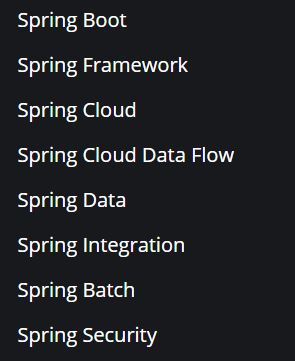
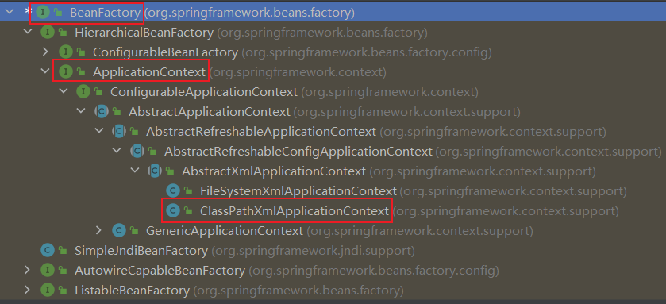
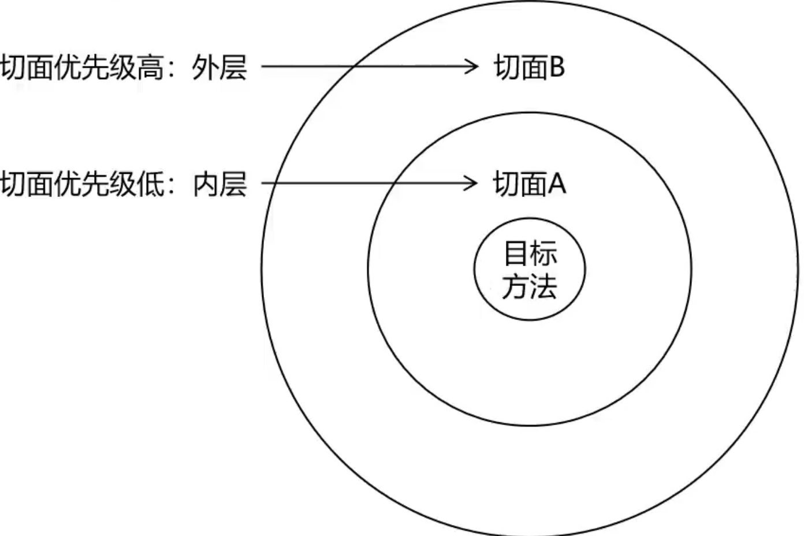
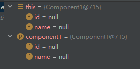
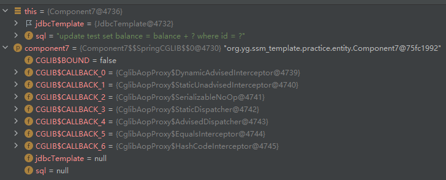

# Spring 笔记


<font color=red>SSM框架就是Spring，SpringMVC，Mybatis三类框架的简称。</font>

<font color=red>一般的Java项目都遵循三层架构：控制层，业务层，持久层。控制层就是跟前端进行交互处理请求，业务层就是处理业务逻辑，持久层就是业务数据的存储。</font>

<font color=red>Sping框架是基础，服务于三层架构；SpringMVC()则是针对控制层，简化控制层开发的一个框架；Mybatis则是针对持久层的一个框架</font>

<font color=red>SpringBoot则是对SSM的进一步整合和简化。</font>


## 一、Spring

### 1、概念

spring从广义上讲就是以spring framework为核心的技术栈，从狭义上来说spring指的就是spring framework

| spring家族的所有技术（所有的技术都是基于spring framework）   |
| ------------------------------------------------------------ |
|  |

### 2、入门案例

1. 新建maven项目

2. 引入依赖

   ```xml
   <!-- junit依赖 -->
   <dependency>
      <groupId>org.junit.jupiter</groupId>
      <artifactId>junit-jupiter-api</artifactId>
      <version>5.7.2</version>
   </dependency>
   
   <!-- spring核心依赖 -->
   <dependency>
      <groupId>org.springframework</groupId>
      <artifactId>spring-context</artifactId>
      <version>6.0.2</version>
   </dependency>
   ```

3.  创建spring配置文件和对应类

   ```java
   public class User {
       private String userName;
       private String password;
   
       public User() {
           System.out.println("User的无参构造！");
       }
   }
   ```

    

   ```xml
   <!--
   	（1）spring配置文件是一个xml文件，并且名字是任意的。由于名字是任意的，所以需要通过读取指定配置文件创建ioc容器
   	（2）通过在spring配置文件中配置bean可以将某个类交由spring管理和维护，其中bean标签的id代表类的唯一标识，class代表类的全类名
   -->
   
   <?xml version="1.0" encoding="UTF-8"?>
   <beans xmlns="http://www.springframework.org/schema/beans"
          xmlns:xsi="http://www.w3.org/2001/XMLSchema-instance"
          xsi:schemaLocation="http://www.springframework.org/schema/beans http://www.springframework.org/schema/beans/spring-beans.xsd">
       
       <!-- 配置User类的bean -->
       <bean id="user" class="org.yg.entity.User"></bean>
   </beans>
   ```

4. 创建测试类

   ```java
   public class Test {
       @org.junit.jupiter.api.Test
       public void test(){
           /*
           	（1）通过读取spring的配置文件创建容器
           	（2）ClassPathXmlApplicationContext是BeanFactory子接口的实现类，用于读取spring配置文件，创建容器
           */
           ApplicationContext applicationContext = new 					ClassPathXmlApplicationContext("SpringConfig.xml");
           /*
           	（1）在spring中类对象的创建不再使用new关键字，而是通过反射创建
           	（2）ioc容器初始化的时候就会通过反射调用类的无参构造创建对象，如果不存在无参构造则会报错。
           	（3）所有通过spring创建的对象会存放在一个map集合的容器之中
           */
           User user = applicationContext.getBean("user", User.class);
           System.out.println(user);
       }
   }
   ```
   
   | BeanFactory的继承体系                                        |
   | ------------------------------------------------------------ |
   |  |
   
   

## 二、IOC

### 1、容器

BeanFactory和ApplicationContext都可以看作是Spring的容器。BeanFactory是Spring最顶级的接口，ApplicationContext是其子接口。

BeanFactory容器提供对象的实例化，装配以及销毁等功能，而ApplicationContext则是对BeanFactory接口功能的增强。Spring默认使用的ApplicationContext容器。

BeanFactory容器是懒加载，也就是说BeanFactory容器初始化的时候并不会实例化容器中维护的Bean。只有当使用到某个Bean的时候才会进行初始化。而ApplicationContext容器默认情况下初始化的时候会通过反射实例化其中所有单例的Bean，多例的Bean只有当使用的时候才会实例化。当然ApplicationContext也可以通过配置实现懒加载。

ApplicationContext容器中单例的Bean在容器初始化的时候会被容器通过反射创建，当在程序中需要用到单例的Bean，容器并不会在创建，而是从已创建好的单例中获取，并且单例Bean使用完毕之后也不会被销毁，而是继续被容器维护着，只有容器被销毁的时候单例Bean才会被销毁。而对于多例的Bean来说容器初始化并不会创建多例的Bean，而只有使用多例的Bean的时候才会创建并返回，并且使用完毕之后多例的Bean就会由垃圾回收处理机制销毁。

```java
//如果是想让某几个Bean懒加载的话，可以在类上添加@Lazy注解。此时该类在容器初始化的时候就不会实例化
@Data
@Component
@Lazy
public class User {
    private String userName;
    private String password;
}
```

```properties
#通过配置文件可以实现所有单例的Bean懒加载
spring.main.lazy-initialization=true
```


###  2、IOC

IOC意为控制反转，将创建和维护对象的权力交由容器管理。也就是说之前创建对象是通过我们手动new对象，而现在想创建一个对象只需要在配置一下，容器会通过反射为我们创建对象。

<font color=red>新解释：使用Spring之前对象的生命周期是由引用它的对象控制的，当一个对象不在被其他对象引用的时候，对象就会被垃圾回收处理机制销毁。而使用spring之后对象的创建，维护，销毁都是由容器控制，所以说控制的反转了</font>

容器中管理的java对象称为spring bean，bean和java对象没有本质上的区别，主要是为了和我们通过new创建的对象区分开，new的是普通java对象，而由容器创建的则是bean。

<font color=red>**IOC的主要目的是解耦合**</font>

<font color=red>**IOC的设计模式是工厂模式**</font>


### 3、Bean命名策略

1. 如果定义Bean的时候指定了name，

   `<bean name='bName' class="cn.yg.Test"></bean>`

   `@Component(value="bName")`

   那么以指定的name作为Bean的name。

2. 如果定义Bean的时候没有手动指定，

   `<bean class="cn.yg.Test"></bean>`

   `@Component`

   那么如果类名从开头开始有连续两及以上个大写字母，那么Bean的name就是类名；如果类名从开头开始只有一个大写字母，那么Bean的name就是类名首字母小写。比方说AAbb->AAbb，AaBB->aaBB
   
   <font color=pink>详细解释：SpringBoot笔记 - SpringBoot自动配置 - @ComponentScan注解</font>


### 4、getBean三种方式

> 三种从容器中获取Bean的方法
>

```java
/**
 * Bean的三种创建方式
 */
public class ThreeBeanCreationMethods {
    private Logger logger = LoggerFactory.getLogger(ThreeBeanCreationMethods.class);
    
    @Test
    public void main(){

        //创建容器
        ApplicationContext ioc = new ClassPathXmlApplicationContext("spring-config.xml");

        //（1）根据id
        User user1 = (User) ioc.getBean("user");
        logger.info("根据id创建bean：{}",user1);

        //（2）根据类型
        User user2 = ioc.getBean(User.class);
        logger.info("根据类型创建bean：{}",user2);

        //（3）根据id+类型
        User user3 = ioc.getBean("user",User.class);
        logger.info("根据id+类型创建bean：{}",user3);

        //单例模式验证
        boolean flag = false;
        if ((user1 == user2)
                && (user1 == user3)
                && (user2 == user3)){
            flag = true;
        }
        logger.info("单例模式验证结果：{}",flag);
    }
}
```


### 5、XML配置Bean

<font color=red>**<u>Spring中存在一个`BeanDefinition`接口，注册到容器中的所有Bean的信息都会在容器初始化的时候解析到BeanDefinition对象中，包含Bean的实例化基本信息，依赖关系，作用范围等。Spring容器会根据BeanDefinition提供的信息来初始化Bean。</u>**</font>

> XML配置Bean

1. 实体类

   ```java
   public class Component1 {
       private Integer id;
       private String name;
   }
   ```

   ```java
   @Data
   @AllArgsConstructor
   @NoArgsConstructor
   public class Component2 {
       private Integer id;
       private String name;
   }
   ```

   ```java
   public class Component3 {
       private Integer id;
       private String name;
   }
   ```

   ```java
   public class Component4 {
       private Integer id;
       private String name;
   }
   ```

   

2. 配置文件

   ```xml
   <?xml version="1.0" encoding="UTF-8"?>
   <beans xmlns="http://www.springframework.org/schema/beans"
          xmlns:xsi="http://www.w3.org/2001/XMLSchema-instance"
          xsi:schemaLocation="http://www.springframework.org/schema/beans http://www.springframework.org/schema/beans/spring-beans.xsd">
       
       <!-- 通过无参构造实例化Bean -->
       <bean id="component1" class="org.yg.ssm_template.practice.entity.Component1"></bean>
       
       <!-- 通过有参构造实例化Bean（注意：必须要有有参构造才可以使用） -->
       <bean id="component2" class="org.yg.ssm_template.practice.entity.Component2">
           <constructor-arg name="id" value="1"></constructor-arg>
           <constructor-arg name="name" value="名字"></constructor-arg>
       </bean>
       
       <!-- 通过静态工厂实例化Bean -->
       <bean id="component3" class="org.yg.ssm_template.practice.factory.Factory1" factory-method="getComponent3"></bean>
       
       <!-- 通过非静态工厂实例化Bean -->
       <bean id="factory2" class="org.yg.ssm_template.practice.factory.Factory2"></bean>
       <bean id="component4" factory-bean="factory2" factory-method="getComponent4"></bean>
   
   </beans>
   ```

3. 测试类

   ```java
   @Slf4j
   public class SSMTemplateTest {
       /**
        * 测试IOC
        */
       @Test
       public void test1() {
           //初始化容器
           ApplicationContext applicationContext = new ClassPathXmlApplicationContext("spring-config-practice.xml");
   
           Component1 component1 = applicationContext.getBean("component1", Component1.class);
           Component2 component2 = applicationContext.getBean("component2", Component2.class);
           Component3 component3 = applicationContext.getBean("component3", Component3.class);
           Component4 component4 = applicationContext.getBean("component4", Component4.class);
   
           log.info(component1.toString());
           log.info(component2.toString());
           log.info(component3.toString());
           log.info(component4.toString());
       }
   }
   ```


### 6、注解配置Bean<a name="md1"></a>

> 标记类可被Spring容器管理和维护的注解

1. @Component：将类标记为Spring容器管理和维护的组件
2. @Controller：作用等同于Component，作用于控制层
3. @Service：作用等同于Component，作用于业务层
4. @Repository：作用等同于Component，作用于持久层
5. @Configuration：作用等同于Component，标记的类作为spring的配置类

<font color=red>注意：使用以上所有注解将类注册到容器中，默认是单例的，如果想更改作用范围可以配合使用`@Sope`注解</font>

> 注解使用

1、@Component，@Controller，@Service，@Repository

- 四个注解功能上没有本质的区别，主要用于区分类的作用。
- Controller，Service，Repository是Component的别名注解，作用与Component一样。Controller，Service，Repository上均添加了Component注解

这四个注解都有一个value属性，该属性的主要作用就是为类起一个别名。当进行依赖注入匹配了多个Bean的时候可以根据这个别名指定注入某个Bean。

```java
//接口
public interface Test {
}

//实现类
@Component("test1")
public class Test1 implements Test{
}
@Component("test2")
public class Test2 implements Test{
}
```

```java
@SpringBootTest
class SbTemplateApplicationTests {
    
    /*
    	resource注解默认是根据变量名注入的，如果与变量名同名的Bean不存在就会根据类型进行注入.当然可以通过resource的type属性强制使用类型进行注入或者通过name指定匹配Bean的name而不是使用变量名作为Bean的name
    */
    @Resource
    /*
    	变量名为test，由于name为test的Bean不存在（接口Test上没有注解），所以根据类型进行匹配，由于Test是一个接口，所以匹配其实现类，发现有两个实现类被spring容器管理和维护，spring不知道注入哪一个，所以此时会抛出异常
    */
    private Test test;
    /*
    	变量名为test1，所以会去找name为test1的Bean，所以注入类Test1的Bean
    */
    private Test test1;
    /*
    	变量名为test2，所以会去找name为test2的Bean，所以注入类Test2的Bean
    */
    private Test test2;

    @Test
    void contextLoads() {
        System.out.println("测试Bean：" + test);
    }
}
```

2、@Configuration注解所在的类相当于spring的配置文件，比方说配合@Bean注解配置bean的方法就相当于spring配置文件的`<bean></bean>`，所以说配置类中添加了任何配置，都相当于直接加在了配置文件中

***@Configuration注解的使用***

<font color=pink>问题引出：（1）通过使用@Component，@Controller。@Service，@Repository等注解可以将类注册到容器中。但是这种方法却无法将第三方的类注册到容器中，因为第三方的类不可被修改，不能在类上添加这些注解。所以要想将第三方的类注册到容器中只能使用注解加xml配置文件的方式。（2）spring默认情况下是不知道去哪里找@Component，@Controller。@Service，@Repository等注解的，所以也需要xml配置文件指定扫包路径。（3）当需要引入外部的配置文件的时候也需要xml配置文件引。</font>

<font color=skyblue>完全注解开发：完全注解开发的中心思想就是彻底取代xml配置文件，完全使用注解完成类的注册和依赖的注入。（1）@Configuration和@Bean解决第三方类的注册问题（2）@Configuration和@ComponentScan解决扫包路径的问题（3）@Configuration和@PropertySource解决引入外部配置文件的问题。</font>

- `@Bean`注解：添加到成员方法上将方法返回的对象注册到容器中

  （1）通过@Bean注解将Bean注册到容器中，Bean的默认name为方法名。可以使用@Bean注解的name属性手动指定Bean的name

  ```java
  @Configuration
  public class MyConfiguration {
      
      //Bean的name就是方法名
      @Bean
      public MyBean myBean() {
          return new MyBean();
      }
      
      //Bean的name就是@Bean注解指定的名字
      @Bean(name = "myBean111")
      public MyBean1 myBean1() {
          return new MyBean1();
      }
  }
  ```

  （2）第三方Bean的依赖注入

  ```java
  //第三方实体类A
  @Data
  public class A{
      private B b;
  }
  ```

  ```java
  //第三方实体类B
  public class B{
      
  }
  ```

  ```java
  //Spring配置类
  @Configuration
  public class SpringConfig{
      
      //将B类注册到容器中,name为b1
      @Bean(name="b1")
      public B getB1(){
          return new B();
      }
      
      //将B类注册到容器中,name为b2
      @Bean(name="b2")
      public B getB2(){
          return new B();
      }
      
      //解决方法1(不推荐)：如果需要注入的对象也是同方法的通过@Bean注册的Bean,那么可以直接通过方法调用完成依赖注入
      @Bean
      public A getA1(){
          A a = new A();
          a.setB(getB1());
          //或者 a.getB(getB2());
          return a;
      }
      
      //解决方法2(推荐)：被@Bean注解标记的方法的形参,会自动的被spring容器完成依赖注入。注入的方式类似@Autowired注解，默认根据类型进行注入，如果没有找到对应类型的Bean就会报错，如果找到多个Bean，那么就根据形参名进行注入，如果根据形参名注入失败就会报错
      @Bean
      public A getA1(B b1){
          A a = new A();
          a.setB(b1);
          return a;
      }
  }
  ```

  （3）@Bean配置@Scope可以指定第三方Bean的作用范围。通过@Bean注解注册的Bean默认都是单例的

  ```java
  //测试实体类
  public class A{}
  ```

  ```java
  @Configuration
  public class SpringConfig{
      
      @Bean
      @Scope("singleton")
      public A getA(){
          return new A();
      }
  }
  ```

- `@Import`注解：引入其他配置类中配置的Bean

  ```java
  @Configuration
  //将配置类Config1和Config2中定义的Bean引入到配置类MyConfiguration中
  /*
  	重要：在配置类上通过@Import注解引入的其他类，默认在这些类上添加了@Configuration注解。比方说@Import({Config1.class, Config2.class})，相当于Config1和Config2都加了@Configuration，即便config1和config2本身没有加@Configuration注解
  */
  @Import({Config1.class, Config2.class})
  public class MyConfiguration {
      
  }
  ```

- `@ComponentScan`注解：指定搜索@Component，@Controller，@Service，@Repository等注解的包名，spring启动时将在指定路径上搜寻添加了这些注解的类并将这些类注册到spring容器中。*<u>详见：二、IOC 9、扫包路径</u>*

- `@PropertySource`注解：在配置文件中引用以properties为后缀的文件。之后可以在任何被Spring管理的类的Bean中通过`@Value(${name})`来注入依赖。*<u>详见：三、DI 2、DI注入方式 （3）注解注入 5、@Value</u>*


### 7、Bean生命周期方法

<font color=red>Bean的生命周期方法必须是public void且没有形式参数</font>

### （1）初始化

<font color=red>以下所有的初始化操作都会在Bean初始化完成并且完成依赖注入后自动执行</font>

1. 通过`@Bean`的initMethod属性

   ```java
   @Data
   @Slf4j
   public class Test3 {
       public void init(){
         log.info("Test3初始化操作...");
       }
   }
   ```

   ```java
   @Configuration
   public class AliTranslation {
       @Bean(initMethod = "init")
       public Test3 test3(){
           return new Test3();
       }
   }
   ```

   注意：使用`@Bean`的initMethod属性，指定的初始化方法是从要注册的类中寻找的。比方说例子中的Test3这个类，通过initMehod指定的初始化方法init，init方法要在Test3这个类中查找，如果找不到则会报错

2. 使用`@PostConstruct`注解

   ```java
   @Data
   @Slf4j
   @Component
   public class Test3 {
       @PostConstruct
       public void init(){
         log.info("Test3初始化操作...");
       }
   }
   ```

   - `@PostConstruct`注解可以添加到类中的多个方法上，所有的方法都是在Bean初始化完成并且完成依赖注入后被执行

   - `@PostConstruct`注解如果添加到多个方法上，执行的顺序是按照方法在类中的顺序。先出现后执行，后出现先执行

     ```java
     @Data
     @Slf4j
     @Component
     public class Test3 {
         
         /*
         	根据先出现后执行，后出现先执行的规则，在该类中init2先执行，init后执行
         */
         @PostConstruct
         public void init(){
           log.info("Test3初始化操作1...");
         }
         
         @PostConstruct
         public void init2(){
             log.info("Test3初始化操作2...");
         }
     }
     ```

3. 实现InitializingBean接口重写afterPropertiesSet方法

   ```java
   @Data
   @Slf4j
   @Component
   public class Test3 implements InitializingBean {
       @Override
       public void afterPropertiesSet() throws Exception {
           System.out.println("初始化方法");
       }
   }
   ```

### （2）销毁

1. 通过`@Bean`的destroyMethod属性

   <u>***配置类***</u>

   ```java
   @Configuration
   public class SpringConfig {
       
       //配置之后当容器销毁后自动在Component1类中寻找destroy这个方法作为销毁方法
       @Bean(destroyMethod = "destroy")
       public Component1 getComponent1(){
           return new Component1();
       }
   }
   ```

   <u>***实体类***</u>

   ```java
   public class Component1 {
       public void destroy(){
           System.out.println("Component1销毁方法！");
       }
   }
   ```

2. 通过`@PreDestroy`注解

   ```java
   @Component
   public class Component1 {
       
       //添加该注解后当容器销毁后Component1类中的destroy这个方法作为销毁方法自动执行
       @PreDestroy
       public void destroy(){
           System.out.println("Component1销毁方法！");
       }
   }
   ```

3. 实现DisposableBean接口重写destroy方法

   ```java
   @Data
   @Slf4j
   @Component
   public class Test3 implements DisposableBean {
       @Override
       public void destroy() throws Exception {
           System.out.println("销毁方法");
       }
   }
   ```


### 8、Bean作用域

> 常见作用域

- `singletion`（默认）

  单例，不论getBean多少次获取的都是同一个对象。在spring容器初始化的时候会被容器创建，只有当容器销毁的时候才会被销毁

- `prototype`

  多例，每次getBean都会获取一个全新的对象。在spring容器初始化的时候不会被初始化，只有用到的时候才会被创建，使用完毕之后会被Java的垃圾回收处理机制回收

- `request`

  同一个请求中不论getBean多少次获取的都是同一个Bean；不同的请求中获取的是不同的Bean

- `session`

  同一个会话中不论getBean多少次获取的都是同一个Bean；不同的会话中获取的是不同的Bean

> 配置

1. xml

   通过Bean标签的scope属性

   ```xml
   <?xml version="1.0" encoding="UTF-8"?>
   <beans xmlns="http://www.springframework.org/schema/beans"
          xmlns:xsi="http://www.w3.org/2001/XMLSchema-instance"
          xsi:schemaLocation="http://www.springframework.org/schema/beans http://www.springframework.org/schema/beans/spring-beans.xsd">
   
       <Bean id='bean' class='com.yg.Bean' scope='singleton'></Bean>
   </beans>
   ```

2. Java

   通过`@Scope`注解

   ```java
   @Component
   @Scope("singleton")
   public class Bean{
       
   }
   ```


### 9、扫包路径

Spring中无法自动扫描添加了@Component，@Service，@Controller，@Repository等注解的类。需要手动指定扫包路径，Spring检测到添加了@Component，@Service，@Controller，@Repository等注解的类就会自动的将这些类注册的Spring容器中。

> XML配置

```xml
<?xml version="1.0" encoding="UTF-8"?>
<beans xmlns="http://www.springframework.org/schema/beans"
       xmlns:xsi="http://www.w3.org/2001/XMLSchema-instance"
       xmlns:context="http://www.springframework.org/schema/context"
       xsi:schemaLocation="http://www.springframework.org/schema/beans http://www.springframework.org/schema/beans/spring-beans.xsd http://www.springframework.org/schema/context https://www.springframework.org/schema/context/spring-context.xsd">
    
    <!-- 配置扫描注解路径 -->
    <context:component-scan base-package="org.yg.ssm_template.practice,org.yg.ssm_template.practice"></context:component-scan>
</beans>
```

**<u>注意：</u>**

- 配置的路径包括路径的根路径，以及子包的路径
- 如果需要配置多个，多个路径之间使用逗号隔开

> 注解配置

- 扫描单一包路径

  ```java
  @Configuration
  @ComponentScan("org.yg.ssm_template")
      public class BaseConfig {
  }
  ```

- 扫描多个包路径

  ```java
  @Configuration
  @ComponentScans({
          @ComponentScan("org.yg.ssm_template1"),
          @ComponentScan("org.yg.ssm_template2")
  })
  public class BaseConfig {
  }
  ```

  ```java
  @Configuration
  @ComponentScan({"org.yg.ssm_template1","org.yg.ssm_template2"})
      public class BaseConfig {
  }
  ```

  


## 三、DI

### 1、DI

DI的意思就是依赖注入。所谓的依赖，举个例子来说。比方说现在存在一个Student类，类中含有两个属性，其中name属性代表学生的名字是String类型，age代表学生的年龄是Integer类型。那么此时就可以说Student这个类依赖于String类型的name和Integer类型的age。依赖注入就是容器在实例化Student的时候，同时将Student所依赖String类型的name和Integer类型的age两个成员变量赋值的过程。

### 2、DI 注入方式

DI注入说白了就是给对象的成员变量进行赋值。而普通的Java对象成员变量的赋值方式有三种：第一种就是创建对象的时候直接通过类的有参构造方法为成员变量赋值；第二种就是通过类的无参构造创建完对象之后通过set方法进行赋值。所以DI注入的根本方式有两种构造器注入和setter注入；第三种是直接在类所依赖的成员变量上添加注解，当spring扫描到注解之后就会自动创建对象并注入。

其中构造器注入和Setter注入又可以看作是XML注入，使用注解注入则就是注解注入。

#### （1）Setter注入

<font color=red>使用Setter注入时，依赖并不是强制注入的。</font>

比方说如下案例，创建A的对象的时候，并不强制为B注入依赖。

```java
@Component
class A {
    private B b;

    public void setB(B b) {
        this.b = b;
    }
}
```


#### （2）构造器注入

<font color=red>使用构造器注入（有参构造）时，依赖是强制注入的。</font>

比方说如下案例，创建A的对象的时候，要强制为B注入依赖，也就是说当A的对象创建完成后依赖注入也完成了，A的对象此时是一个完整的对象。

```java
@Component
class A {
    private final B b;
    
    //此时A中只提供了一个有参构造那么就只会进行构造器注入，此时就必须要求容器中存在一个B类型的Bean，在创建A的对象之前将B的对象注入其中完成A的创建
    //如果使用这种方法时容器中没有B的对象就会报错
    public A(B b) {
        this.b = b;
    }
}
```

```java
@Component
class A {
    private final B b;
    
    //如果提供了有参构造那么就不会有限使用有参构造注入，此时创建的对象中的b为null，此时不强制要求依赖注入
    public A() {
    }
    
    public A(B b) {
        this.b = b;
    }
}
```


#### （3）成员变量注入

<font color=red>成员变量注入与Setter注入本质类似。</font>

```java
@Component
class A {
    @Autowired
    private B b;
}
```


#### （4）注解注入

*<u>使用注解注入的前提是被注入的类要被spring容器管理和维护。</u>*

[注解配置Bean](#md1)

1. `@Primary`注解：出现同一类型匹配多个Bean的情况，优先注入带有`@Primary`注解的Bean

2. `@Resource`注解：

   - JavaEE中的注解 (需要引入专门依赖)

     ```xml
     <!-- Spring5使用(Spring6中使用的话@Resource注解无效) -->
     <dependency>
          <groupId>javax.annotation</groupId>
          <artifactId>javax.annotation-api</artifactId>
          <version>1.2</version>
     </dependency>
     
     <!-- spring6使用 -->
     <dependency>
         <groupId>jakarta.annotation</groupId>
         <artifactId>jakarta.annotation-api</artifactId>
         <version>3.0.0</version>
     </dependency>
     ```

   - 常用属性

     - name：按名字注入
     - type：按类型注入

   - 依赖注入场景

     - 不指定name和type：`@Resource`

       默认按name装配，找不到得对应name的Bean则按类型进行装配

     - 指定name：`@Resource(name="name")`

       只按name进行装配，如果找不到则会抛出异常

     - 指定type：`@Resource(type="type")`

       只按type进行装配，如果找不到或者找到多个会抛出异常

     - 指定name和type：`@Resource(name="name",type="type")`

       同时使用name和type去容器中查找唯一的Bean，找不到则抛出异常

   - `@Resource`注解注入和Setter方法和构造方法无关

3. `@Autowired`注解：

   - spring中的注解
   - 默认是根据类型进行搜寻Bean。
     - 如果一个Bean都找不到，抛出异常
     - 如果同类型搜寻出多个Bean再根据name注入，name就是成员变量的名字
   - 常用属性
     - required：true-如果找不到Bean会抛出异常 false-如果找不到Bean不会抛出异常
   - `@Autowired`注解注入和Setter方法和构造方法无关

4. `@Qualifier`注解：配合`@Autowired`或者`@Resource`注解指定Bean的name进行注入

   ```java
   @SpringBootTest
   class SbTemplateApplicationTests {
       @Autowired
       @Qualifier("test1")//通过Qualifier指定注入Bean的name
       private Test test;
       
       @Test
       void contextLoads() {
           System.out.println(test);
       }
   
   }
   ```

5. `@Value`注解

   - 注入常量

     ```java
     @SpringBootTest
     class SbTemplateApplicationTests {
     
         //意义不大，等同于 private String str = "123";
         @Value("123")
         private String str;
     
         @Test
         void contextLoads() {
             System.out.println(str);//结果：123
         }
     
     }
     ```

   - 读取properties配置文件注入

     ```properties
     # properties文件
     TEST_DATA=HELLO
     ```

     ```java
     //spring配置类
     @Configuration
     //读取类路径下的common.properties配置文件
     @PropertySource("classpath:/common.properties")
     public class TestConfig {
     }
     ```

     ```java
     @SpringBootTest
     class SbTemplateApplicationTests {
         
         //通过读取properties文件注入配置值
         @Value("${TEST_DATA}")
         private String testData;
         
         //通过读取properties文件注入配置值
         @Value("${TEST_DATA}")
         private String testData;
     
         @Test
         void contextLoads() {
             System.out.println(testData);//结果：HELLO
         }
     }
     ```
     
   - 读取yml配置文件注入

     <font color=red>SpringBoot读取配置默认是从application.yml或者application.properties中，如果随便建一个yml文件或者properties文件SpringBoot是不知道从哪里读取的</font>

     ```yaml
     # application.yml文件
     spring:
       config:
       #通过在application.yml引入其他yml文件就可以读取其他的yml文件
         import: classpath:common.yml 
     ```

     ```yaml
     # common.yml文件
     test:
     	name: hello
     ```

     ```java
     @SpringBootTest
     class SbTemplateApplicationTests {
         
         @Value("${test.name}")
         private String testData;
     
         @Test
         void contextLoads() {
             System.out.println(testData);//结果：hello
         }
     }
     ```
     
   - 设置默认值

     ```java
     @SpringBootTest
     class SbTemplateApplicationTests {
         
         /*
         	注意：
         		1、如果使用@Value("${test.name}")找不到test.name的值，@Value注解会将"${test.name}"这个字符串赋值给testData。也就是testData=${test.name:testData}
         		2、使用:可以在找不到test.name值的时候注入默认值。比方说@Value("${test.name:hhh}")，如果找不到test.name，那么就会将hhh赋值给testData,testData=hhh
         */
         @Value("${test.name:hhh}")
         private String testData;
     
         @Test
         void contextLoads() {
             System.out.println(testData);//结果：hello
         }
     }
     ```

6. `@ConfigurationProperties`注解

   读取配置文件中指定前缀所有属性值，将属性值注入到类中。默认根据属性名严格注入，如果配置中的属性名和类中成员的属性名不一致，那么就是用驼峰命名注入

   ```yaml
   database:
     url: jdbc:mysql://localhost:3306/mydb
     username: user
     password: secret
   ```

   ```java
   /*
   	通过读取配置文件中前缀是database的所有属性，注入到DatabaseConfig的成员中
   */
   @ConfigurationProperties(prefix = "database")
   @Component
   public class DatabaseConfig {
   
       private String url;
       private String username;
       private String password;
   }
   ```
   
   

### 3、循环依赖问题

循环依赖：比方说A依赖B，B又依赖A。A创建的时候发现需要B的对象，然后就要去创建B的对象，此时A仍处于创建过程中。B创建对象的时候发现还需要A的对象，但是此时A还处于创建中，那么这样就会导致创建过程进入死循环。

```java
//循环依赖问题

@Data
@Component
public class A {
    @Autowired
    private B b;
}


@Data
@Component
public class B {
    @Autowired
    private A a;
}
```

循环依赖通过三级缓存解决。

其中一级缓存中存储完全创建的对象，二级缓存中存放未进行依赖注入的对象，三级缓存中存放相应类的工厂对象用于动态的创建类的原始对象或者代理对象。

以A依赖B，B依赖A为例。当创建A对象时，首先创建A的工厂对象存入三级缓存，然后进行依赖注入，发现需要B对象，那么就要去创建B的对象，同样的也是先创建B的工厂对象存入三级缓存中，然后需要为B的对象进行依赖注入，此时可以在三级缓存中找到A的工厂对象，可以获取到一个未进行依赖注入的A的对象，并将这个对象放入二级缓存中，随后这个A的对象会被注入到B中，那么此时B的对象就被完全创建完成放入一级缓存中，然后A的对象会从一级缓存中获取到B的完整对象，最终也完成依赖注入。


## 三、AOP

### 1、AOP

AOP：面向切面编程。<font color=red><u>**核心思想就是代理模式**</u></font>。在使用代理模式之前，所有的逻辑都会放在一个方法中，这就导致核心逻辑和其他逻辑混合在一起。通过使用代理模式可以将其中的其他逻辑提取到代理方法中，当要执行的时候代理方法执行一部分，核心方法执行一部分。举个例子，现在存在一个代理方法A和核心方法B，核心方法B中有日志打印和核心逻辑两部分，现在将日志打印逻辑放在A方法中，当调用B方法的时候先调用A方法，然后在A方法中在调用B方法，完成代理执行。

### 2、代理模式

1. 静态代理

   > 代码演示

   ```java
   //业务类
   public class B{
       public int add(int i, int j){
           return i + j;
       }
   }
   ```

   ```java
   //代理类
   public class A{
       
       private B b;
       
       //构造方法（由A代理B）
       public A(B b){
           this.b = b;
       }
       
       public int add(int i, int j){
           //执行其他逻辑
           System.out.println("请求参数：i = "+i+",j = "+j);
           
           //执行核心逻辑
           int result = b.add(i,j);
           
           //执行其他逻辑
           System.out.println("响应参数：result = "+ result);
           
           return result;
       }
   }
   ```

   ```java
   //代理模式执行
   public class Test{
       public statis main(String[] args){
           //创建被代理类
           B b = new B();
           //用代理类代理被代理类
           A a = new A(b);
           //增强执行被代理方法
           a.add(1,2);
       }
   }
   ```

   > 模式缺陷

   <font color=pink>假设存在代理类A，被代理类B。静态代理的缺陷，其一B的代理类写死了就是A，不能再是其他了，A和B之间的耦合性大大增强。其二如果有新的类C需要被代理而A只能为B服务，那么还需要手动去新建一个代理类去代理C，灵活性很差。</font>

2. 动态代理

   - JDK动态代理：Java原生实现方式

     <font color=skyblue>实现要求：要求被代理的类要有实现的接口，然后程序运行的过程中自动生成一个实现该接口的代理类来代理被代理类。比方说存在一个被代理类B，要想使用JDK动态代理那么B必须要实现一个A接口，然后代理类是在运行的过程中动态生成的一个实现了A接口的C类。</font>

   - CGLIB动态代理：第三方技术（spring内置）

     <font color=skyblue>实现要求：被代理类的代理类就是被代理类的子类。比方说存在一个被代理类B，那么代理类就会在运行的过程中自动生成一个B的子类A类代理B类。</font>

<font color=red>**<u>Spring AOP底层的工作模式就是代理模式。采用的是动态代理：JDK动态代理和CGLIB动态代理。具体使用哪一种动态代理取决于被代理类是否有实现接口：如果被代理类实现了接口那么使用JDK动态代理，代理类就是一个实现了被代理类接口的类；如果被代理类没有实现接口那么就使用CGLIB动态代理，代理类就是被代理类的一个子类。</u>**</font>

### 3、AOP应用场景

1. 日志记录：核心逻辑执行前记录请求参数，核心逻辑执行后记录响应参数
2. 性能检测：核心逻辑执行前记录起始时间戳，核心逻辑执行后记录截止时间戳
3. 事务管理：核心逻辑执行开启事务，核心逻辑执行后提交事务（Spring事务处理方式）

### 4、AOP相关概念

1. 目标类

   需要进行功能增强的类就是目标类

2. 连接点

   目标类中所有可能会被增强的方法都是连接点

3. 通知（增强）

   需要对目标类中方法进行增强的代码逻辑

4. 切点

   目标类中所有被增强的方法都是切点

5. 织入

   将通知添加到连接点的动作就是织入

6. 切面

   通知添加到连接点之后，通知和切点就会形成切面

7. 代理类

   将通知添加到连接点之后，连接点就会变成切点，目标类就会变成代理类

<font color=red><u>**总结：当一个类需要被增强那么这个类就是目标类，目标类中可能会有很多的方法，但是不一定所有的方法都会被增强，而所有可能会被增强的方法都属于一个个的连接点。而新增的代码逻辑就属于通知，将通知加到连接点上之后，连接点就属于彻底被加上增强，就变成了切点。而将通知添加到连接点的这一动作又被称为织入。织入完毕之后，切点和通知就会组成切面。此时目标类就会变成代理类。**</u></font>

<font color=red>**<u>注意：当使用AOP代理了某个类，那么此时IOC容器中存储的便不再是被代理类的对象，而是代理类的对象。解释如下。</u>**</font>

```java
//切面类
/*
	在这个切面类中为org.yg.ssm_template.practice.service.impl包下的所有类的所有方法增强
*/
@Component
@Aspect
@Slf4j
public class TestAop {

    @Resource
    private Gson gson;

    @Pointcut("execution(* org.yg.ssm_template.practice.service.impl.*.*(..))")
    public void getLocation(){}

    @Before("getLocation()")
    public void requestParam(JoinPoint joinPoint) throws JsonProcessingException {
        String classPath = joinPoint.getTarget().getClass().getName();
        String methodName = joinPoint.getSignature().getName();
        Object[] args = joinPoint.getArgs();
        log.info("【方法参数】{}#{}:{}", classPath, methodName,gson.toJson(args));
    }
}
```

```java
//被代理类实现的接口
public interface TestBaseService {
    Integer add(Integer arg1,Integer arg2);
}
```

```java
//被代理类
@Service
public class TestBaseServiceImpl implements TestBaseService {
    @Override
    public Integer add(Integer arg1,Integer arg2)
    {
        return arg1 + arg2;
    }
}
```

```java
//测试类
@Slf4j
@SpringJUnitConfig(value = {BaseConfig.class})
public class SSMTemplateTest {
    /*
    	由于被代理类TestBaseServiceImpl实现了TestBaseService接口，所以Spring会对它使用JDK动态代理，使用一个实现了TestBaseService接口的类来代理TestBaseServiceImpl。也就是说此时代理类和被代理类是同级的关系，都属于子类的级别。
    	子类之间是无法相互承接的。比方说现存在A，B和C都继承A。B b = new C();和C c = new B();均是错误的，同级之间不可相互承接。而A a = new B();或A a = new C();确实正确的。
    */
    @Resource
    /*
    	如果使用接口承接是没问题的，此时不论是代理类还是被代理类，使用TestBaseService均可接收
    */
    private TestBaseService testBaseService;
    /*
    	假如说一个类被代理之后，它在容器中仍然存储的是本类的对象，那么如下注入是没有问题的。但实际上如下的注入方式会提示诸如"jdk.proxy2.$Proxy44'"，进一步说明了，如果一个类被代理类代理，那么此时容器中存储的是代理类的对象，注入的也是代理类的对象，所以只能用接口接收。
    */
    private TestBaseServiceImpl testBaseServiceImpl;
    
    @Test
    public void test1() {
        
    }
}
```


### 5、AOP注解

1. `@Before`
   - 前置通知注解
   - 通知(增强代码)将在目标方法执行前被执行
2. `@AfterReturning`
   - 返回后通知注解
   - 通知(增强代码)将在目标方法成功执行完毕返回返回值后被执行（<font color=red>目标方法执行异常不会执行</font>）
   - <font color=red>可以获取到方法返回值的通知</font>
3. `@AfterThrowing`
   - 异常后通知注解
   - 通知(增强代码)将在目标方法执行出现异常之后才会被执行（<font color=red>目标方法没有异常不会执行</font>）
   - <font color=red>可以获取到方法异常信息的通知</font>
4. `@After`
   - 后置通知注解
   - 通知(增强代码)将在目标方法成功执行完毕之后执行（<font color=red>不论目标方法执行是否成功均会被执行</font>）
5. `@Round`
   - 环绕通知
   - 可以在目标方法执行的任意时刻添加通知
6. `@Aspect`
   - 定义切面类的注解
7. `@PointCut`
   - 定义切点表达式
8. `@Component`
   - 切面类必须要注册到容器中才能完成增强
9. `@EnableAspectJAutoProxy`
   - 开启AOP增强的注解
   - <font color=red>添加到配置类上开启</font>


### 6、五种通知

1. 前置通知

   注解

   ```java
   @Before("getLocation()")
       public void beforeParam(JoinPoint joinPoint) throws JsonProcessingException {
           //获取类路径
           String classPath = joinPoint.getTarget().getClass().getName();
           //获取方法名
           String methodName = joinPoint.getSignature().getName();
           //获取参数
           Object[] args = joinPoint.getArgs();
           log.info("【方法参数】{}#{} ==> {}", classPath, methodName,gson.toJson(args));
       }
   ```

2. 后置通知

   ```java
   @After("getLocation()")
       public void after(JoinPoint joinPoint) throws JsonProcessingException {
           //获取类路径
           String classPath = joinPoint.getTarget().getClass().getName();
           //获取方法名
           String methodName = joinPoint.getSignature().getName();
           log.info("【方法结束】{}#{}", classPath, methodName);
       }
   ```

3. 异常通知

   ```java
   @AfterThrowing(throwing = "throwable", pointcut = "getLocation()")
       public void afterThrowing(JoinPoint joinPoint,Throwable throwable) throws JsonProcessingException {
           //获取类路径
           String classPath = joinPoint.getTarget().getClass().getName();
           //获取方法名
           String methodName = joinPoint.getSignature().getName();
           log.info("【方法异常信息】{}#{} ==> {}", classPath, methodName,throwable);
       }
   ```

4. 返回通知

   ```java
   @AfterReturning(returning = "result", pointcut = "getLocation()")
       public void afterParam(JoinPoint joinPoint,Object result) throws JsonProcessingException {
           //获取类路径
           String classPath = joinPoint.getTarget().getClass().getName();
           //获取方法名
           String methodName = joinPoint.getSignature().getName();
           log.info("【方法返回值】{}#{} ==> {}", classPath, methodName,gson.toJson(result));
       }
   ```

5. 环绕通知

   ```java
   /*
   	环绕通知可以实现其他四类通知的功能
   */
   @Around("org.yg.ssm_template.practice.aop.pointcut.TestPointCutManagement.getLocation()")
   public Object testRound(ProceedingJoinPoint proceedingJoinPoint) {
       Object result = null;
       Object[] args = proceedingJoinPoint.getArgs();
       try {
           log.info("前置通知");
           result = proceedingJoinPoint.proceed(args);
           log.info("返回后通知");
       } catch (Throwable e) {
           log.info("异常通知");
           //代理方法不处理异常，需要抛出目标方法的异常，否则方法的调用者无法获取到异常
           throw new RuntimeException(e);
       } finally {
           log.info("后置通知");
       }
       return result;
   }
   ```


### 6、切点表达式

> 切点表达式语法

结构：`execution(<1> <2> <3>.<4>.<5>(<6>))`

1. 位置1：访问修饰符。比方说public就是匹配所有修饰符是public的方法

2. 位置2：返回值类型。比方说String就是匹配所有返回值是String类型的方法

   <font color=red>如果权限修饰符和返回值类型都是任意的话，那么可以使用"*"代表任意权限修饰符和任意返回值类型的方法。但是权限修饰符和返回值类型只能同时忽略，而不能一个忽略另一个不忽略。比方说public * 或者 * String都是错误的，只能是都忽略或者都不忽略，比方说 * 或者 public String</font>

3. 位置3：包路径。

   - com.yg.test：意为指定com.yg.test包下的所有方法
   - com.*.test：意为二级路径可以是任意名，也就是com包下的任意包下的test文件夹中的所有方法。<font color=red>一个 * 在包路径中代表任意名字的一层包路径</font>
   - com..test：意为从com文件夹开始任意路径下的test包中的所有方法.<font color=red>一个 .. 在包路径中代表任意名字，任意层级的包路径。但是 .. 不可以作为包路径的开头，比方说..test是错误的，如果想实现从任意包开头可以使用 * 开头，比方说 *..test</font>

4. 位置4：类名。

   - *：任意类
   - *impl：以impl结尾的类

5. 位置5：方法名

   - *：任意方法名
   - *impl：以impl结尾的方法名

6. 位置6：方法参数列表

   - (String)：方法参数列表中只有一个String类型的方法
   - (*)：方法参数列表中只有一个参数并且参数类型是任意的方法
   - (String,*)：方法参数列表中第一个参数是String，第二个是任意类型的方法
   - (..)：方法参数列表中是任意参数个数，任意参数类型的方法

> 提取切点表达式

1. 当前类中提取（不推荐）

   ```java
   @Component
   @Aspect
   @Slf4j
   public class TestAop {
   
       /*
       	切点方法的作用就是用来承载@PointCut注解。
       	注意：切点方法必须要是一个空方法，并且被public void修饰，而方法名任意
       */
       @Pointcut("execution(* org.yg.ssm_template.practice.service.impl.*.*(..))")
       public void getLocation(){}
   
       @Before("getLocation()")
       public void requestParam(JoinPoint joinPoint) {
       }
   }
   ```

2. 其他类中提取（推荐）

   ```java
   //切点管理类
   @Component
   public class TestPointCut {
       /**
        * TestAop切面切点
        */
       @Pointcut("execution(* org.yg.ssm_template.practice.service.impl.*.*(..))")
       public void getLocation(){}
       
       @Pointcut("execution(* org.yg.ssm_template.practice.service.impl.*.*(..))")
       public void getLocation2(){}
   }
   ```

   ```java
   //切面类
   @Component
   @Aspect
   @Slf4j
   public class TestAop {
       //引用当前类外的切点需要使用类的全类名指定方法
       @Before("org.yg.ssm_template.practice.aop.pointcut.TestPointCut.getLocation()")
       public void requestParam(JoinPoint joinPoint) throws JsonProcessingException {
           //获取类路径
           String classPath = joinPoint.getTarget().getClass().getName();
           //获取方法名
           String methodName = joinPoint.getSignature().getName();
           //获取参数
           Object[] args = joinPoint.getArgs();
       }
   }
   ```


### 7、切面的优先级

> 理解图

|  |
| ------------------------------------------------------------ |

> 切面优先级设置

 <font color=pink>一个切点可以被添加多个通知，形成多个切面。可以通过使用`@Order`注解控制切面执行的优先级</font>

<font color=skyblue>`@Order只有一个value属性，value属性的默认值是Integer.MAX_VALUE，并且value的值越大优先级越低，value的值越小优先级越高，越先被执行。`</font>

```java
//切面A
@Aspect
@Component
@Order(10)
public class A {
   @Before("pc1()")
   public void beforeMethod(){
       System.out.println("切面A的前置通知 - （记录起始日志）");
   }
    
   @After("pc1()")
   public void afterMethod(){
       System.out.println("切面A的后置通知 - （记录截至日志）");
   }
}
```

```java
//切面B
@Aspect
@Component
@Order(1)
public class B {
   @Before("pc1()")
   public void beforeMethod(){
       System.out.println("切面B的前置通知-（开启事务）");
   }
    
   @After("pc1()")
   public void afterMethod(){
       System.out.println("切面B的后置通知- （提交事务）");
   }
}
```

```java
//切点
@Component
public class pc{
    @PointCut("execution(* com.yg.test.*.*(..))")
    public void pc1(){}
}
```

```java
//当调用com.yg.test包下的任意类的任意方法时的调用结果
/*
	切面B的前置通知-（开启事务）
	切面A的前置通知 - （记录起始日志）
	
	方法的执行结果
	
	切面A的后置通知 - （记录截至日志）
	切面B的后置通知- （提交事务）
*/
```


### 8、@Order注解

<font color=red>`@Order`注解定义在类上，但是它并不会改变容器初始化时Bean的创建顺序。只会改变Bean的使用顺序</font>

1. 控制切面的执行顺序

   ```java
   //切面类A
   @Aspect
   @Component
   @Order(10)
   public class A{
       @Before("pc1()")
       public void beforeNotice(){
           System.out.println("增强A");
       }
   }
   ```

   ```java
   //切面类B
   @Aspect
   @Component
   @Order(1)
   public class B{
       @Before("pc1()")
       public void beforeNotice(){
           System.out.println("增强B");
       }
   }
   ```

   ```java
   //切点管理类
   @Component
   public class PointCutManagement{
       @PointCut("execution(com.yg.test.*.*(..))")
       public void pc1(){}
   }
   ```

   假设存在一个C类，C类中的c方法同时添加了A和B两个切面类的增强，此时调用c方法，那么就会先执行B增强后执行A增强，因为B上添加`@order(1)`比A上的`@order(10)`优先级更高

2. 控制集合Bean的装配顺序

   ```java
   //接口
   public interface Inf1 {
   }
   ```

   ```java
   //实现类Component5
   @Component
   @Order(3)
   public class Component5 implements Inf1{
   }
   ```

   ```java
   //实现类Component6
   @Component
   @Order(1)
   public class Component6 implements Inf1{
   }
   ```

   ```java
   //实现类Component7
   @Component
   @Order(2)
   public class Component7 implements Inf1{
   }
   ```

   ```java
   //测试类
   @SpringJunitConfig(value = BaseConfig.class)
   public class MyTest{
       @Resource
       List<Inf1> inf1List;
       
       @Test
       public void test1(){
           /*
           	结果：
           	inf1List:[
           		org.yg.ssm_template.practice.entity.Component6@26d820eb, 					org.yg.ssm_template.practice.entity.Component7@507d20bb, 					org.yg.ssm_template.practice.entity.Component5@314c8b4a
           	]
           */
           System.out.println(inf1List);
       }
   }
   ```

3. 拦截器排序

4. 过滤器排序


### 9、`@EnableAspectJAutoProxy`

`@EnableAspectJAutoProxy`注解的主要作用开启`Aop`。

其中的`exposeProxy`属性默认为false即不暴露代理对象，为true即暴露代理对象。

主要应用场景是同类中方法间的调用。Spring中比如事务`@Transactional`或者异步任务`@Asyn`等都是依赖于Spring的Aop的代理对象实现的，同类中的调用本质上就是`this`调用，而`this`不属于容器中的代理对象因此使用`this`的调用会导致事务或者异步失效。

当`exposeProxy = true`时，那么便可以通过`AopContext.currentProxy();`获取到`this`对应的代理对象，使用`AopContext.currentProxy()`获取的代理对象的调用就不会使事务或者异步等失效。

```java
/**
 * Aop工具类
 */
public class AopUtil {
    /**
     * 获取当前this对象的代理对象
     */
    @SuppressWarnings(value = {"unchecked"})
    public static <T> T getThisProxyObject(T t) {
        return (T) AopContext.currentProxy();
    }
}
```


## 四、SpringTest

1. 依赖

   ```xml
   <!-- spring-test依赖 --->
   <dependency>
         <groupId>org.springframework</groupId>
         <artifactId>spring-test</artifactId>
         <version>6.0.6</version>
         <scope>test</scope>
   </dependency>
   
   <!-- log4j2依赖 -->
   <dependency>
       <groupId>org.apache.logging.log4j</groupId>
       <artifactId>log4j-core</artifactId>
       <version>2.19.0</version>
   </dependency>
   ```

2. 使用

   <font color=pink>通过使用spring-test可以自动的创建spring容器，而不是手动new一个容器</font>

   - 读取配置类自动创建容器

     ```java
     @SpringJUnitConfig(value = {BaseConfig.class})
     public class SSMTemplateTest {
     
        	@Autowired
         private Component7 component7;
     
         @Test
         public void test1() {
             log.info("component7:{}", component7);
         }
     }
     ```

   - 读取配置文件自动创建容器

     ```java
     @SpringJUnitConfig(locations = "classpath:spring-config-practice.xml")
     public class SSMTemplateTest {
     
        	@Autowired
         private Component7 component7;
         
         @Test
         public void test1() {
             log.info("component7:{}", component7);
         }
     }
     ```

   

## 五、Transaction

### 1、事务使用

1. 依赖

   ```xml
   <dependency>
         <groupId>org.springframework</groupId>
         <artifactId>spring-tx</artifactId>
         <version>6.0.6</version>
   </dependency>
   ```

2. 配置数据源以及为数据源配置事务管理器

   ```java
   public class DataBaseBeanConfig {
       /**
        * 配置Druid数据源
        * @param driver 驱动类路径
        * @param url oracle连接url
        * @param username 用户名
        * @param password 用户密码
        * @return
        */
       @Bean(name = "druidDataSource")
       public DruidDataSource getDataResource(
               @Value("${jdbc.driver}") String driver,
               @Value("${jdbc.url}") String url,
               @Value("${jdbc.username}") String username,
               @Value("${jdbc.password}") String password
       ) {
           DruidDataSource druidDataSource = new DruidDataSource();
           druidDataSource.setDriverClassName(driver);
           druidDataSource.setUrl(url);
           druidDataSource.setUsername(username);
           druidDataSource.setPassword(password);
           return druidDataSource;
       }
   
       /**
        * 配置JdbcTemplate
        * @param druidDataSource Druid数据源
        * @return
        */
       @Bean(name = "jdbcTemplate")
       public JdbcTemplate getJdbcTemplate(DruidDataSource druidDataSource) {
           JdbcTemplate jdbcTemplate = new JdbcTemplate();
           jdbcTemplate.setDataSource(druidDataSource);
           return jdbcTemplate;
       }
   
       /**
        * 为数据源配置事务管理器
        */
       @Bean(name = "transactionManager")
       public TransactionManager getDataSourceTransactionManager(DruidDataSource druidDataSource) {
           return new DataSourceTransactionManager(druidDataSource);
       }
   }
   ```

3. 开启事务支持

   ```java
   @Configuration
   @ComponentScan(value = {"org.yg.ssm_template"})
   @PropertySource(value = {"classpath:common.properties", "classpath:database.properties"})
   @Import({BaseBeanConfig.class})
   @EnableAspectJAutoProxy
   //开启事务支持
   @EnableTransactionManagement
   public class BaseConfig {
   
   }
   ```

4. 声明式事务

   ```java
   @Component
   @Order(2)
   public class Component7 implements Inf1{
       @Resource
       private JdbcTemplate jdbcTemplate;
       
       //通过在需要进行事务管理的方法上添加@Transactional注解，为方法开启事务
       @Transactional
       public void testTransaction(){
           String updateSql = "update test set balance = balance + ? where id = ?";
           int r1 = jdbcTemplate.update(updateSql, -200, 1);
           int i = 1/0;
           int r2 = jdbcTemplate.update(updateSql, 200, 2);
           if (r1 != 1 || r2 != 1) {
               throw new RuntimeException("事务回滚");
           }
       }
   }
   ```


### 2、@Transactional

<font color=red>`@Transactional`注解既可以添加到方法上也可以添加到类上。添加到方法上意为只为这一个方法开启事务，如果添加到类上，那么就会为类中所有的public方法都添加事务。</font>

<font color=red>如果类上和方法上都添加了注解，那么方法上的注解会覆盖类上的注解，包括注解中的属性都会一起覆盖。比方说现在在类上添加`@Transactional(readOnly = true)`，此时相当于类中所有public方法上都添加`@Transactional(readOnly = true)`，但是如果此时在某一个方法上添加`@Transactional(readOnly = false)`，那么新加的会覆盖之前的，但不影响其他的方法</font>

> 常用属性

1. readOnly

   - readOnly：默认为false。不开启只读模式。只读模式的意思就是只对数据库进行查询操作不进行增删改的操作，这样会提高查询效率。 
   - 主要应用于当在类上添加了`@Transactional`注解导致类中所有的方法都添加了事务，但是有些方法是纯查询的方法，开启了事务会导致查询查询速度变慢，此时可以再次通过`@Transactional`注解指明该方法是只读方法就会解决问题。
   - 开启只读模式之后仍在方法中进行增删改的操作则会报错。

   ```java
   @Transactional
   public class A {
       
       //开启只读模式
       @Transactional(readOnly = true)
       public void f1(){
           //纯查询
       }
       
       public void f2(){
           //查询和修改
       }
   }
   ```

2. rollbackFor

   - rollbackFor：抛出指定的异常才会回滚，默认是RuntimeException。也就是说默认情况下使用`@Transactional`注解只有方法中抛出运行时异常才会回滚事务，其他的非运行时异常均不会回滚。
   - rollbackFor的值是一个class数组并且只能是Throwable的子类的class

   ```java
   public class A {
       
       //最常用的就是改成方法中抛出的所有异常都会回滚
       @Transactional(rollbackFor = {Exception.class})
       public void f1(){
           
       }
   }
   ```

3. noRollbackFor

   - noRollbackFor：抛出指定的异常不回滚。
   - 使用noRollbackFor指定不回滚的异常必须要在rollbackFor指定的回滚异常的范围内。

4. isolation

   - isolation：指定事务的隔离级别
   - 常用属性
     - 读未提交（Isolation.READ_UNCOMMITTED） <font color=pink>（不推荐）</font>
     - 读已提交（Isolation.READ_COMMITTED）<font color=pink>（推荐）</font>
     - 可重复读（Isolation.REPEATABLE_READ）
     - 串行化（Isolation.SERIALIZABLE）
     - 默认（取决于数据库的默认事务隔离级别）

5. <u>**propagation**</u><font color=red>（<u>**重要**</u>）</font>

   - propagation：设置事务的传递方式

   - 常用属性

     - Propagation.REQUIRED<font color=pink>（默认）</font>：如果调用方法中含有事务，那么加入调用方法的事务。如果调用方法没有事务那么被调用方法就单独作为一个事务。
     
       <font color=limegreen>现存在一个A方法和B方法，A方法调用B方法（A和B在不同的Bean中）。**<u>第一种情况</u>**，A方法上添加@Transactional，B方法上没有，那么此时A方法和B方法中的所有逻辑都在一个事务中；<u>**第二种情况**</u>，A方法上没有，B方法上添加@Transactional，此时A方法中的逻辑不受事务管理，B方法中的逻辑受事务管理，A方法报错不影响B方法事务，B方法报错则B方法中操作数据库的逻辑会被回滚；<u>**第三种情况**</u>，A方法和B方法上都添加了@Transactional注解，此时A方法和B方法的所有逻辑也都在一个事务里，不论A方法还是B方法中报错，所有操作数据库的逻辑都会回滚。</font>
     
     - Propagation.REQUIRES_NEW：不论调用方法中是否含有事务，被调用方法均单独作为一个事务。调用者执行到被调方法时，调用者中的事务暂时挂起，被调用者新建一个事务，当被调用者执行完毕
     
       <font color=limegreen>现存在一个A方法和B方法，A方法调用B方法（A和B在不同的Bean中）。<u>**第一种情况**</u>，方法A上添加@Transactional注解，方法B上添加@Transactional(propagation = Propagation.REQUIRES_NEW)，此时A方法中除了方法B之外的所有逻辑被一个事务管理，当在A方法中执行到B方法的时候，A方法的事务会暂时挂起，B方法中所有的逻辑会新建一个事务管理，当B方法的所有逻辑执行完毕之后事务提交，A方法的事务恢复，即便再出现异常也不会影响到B方法，因为B的事务已经提交。但是如果B方法中出现异常，B方法的事务会回滚，如果A方法中没有对B方法的异常做出处理，那么A方法的事务也会回滚。**<u>第二种情况</u>**，A方法上不添加，B方法上添加@Transactional(propagation = Propagation.REQUIRES_NEW)，A方法中除了B方法之外的逻辑不受事务管理，B方法中单独生成一个事务进行管理。</font>
     


### 3、@Transactional注解失效的场景

1. `@Transactional`注解添加到private方法上。

   因为声明式事务是通过AOP实现的，也就是说被代理类的方法上之所以有事务是因为代理类调用被代理类的方法的时候在方法调用前后开启和提交事务。而如果被代理类的事务方法是private的话，那么在代理类中是无法调用的，private方法只能在被代理类内部使用，因此Spring不会对private方法添加事务。

   <font color=red>总结：要想使事务生效那么必须得用代理类对象调用，而代理类中无法调用被代理类中的private方法，因此事务不会生效。</font>

2. `@Tranactional`注解默认情况下只会回滚运行时异常(RuntimeException)和错误(Error)，对于例如IoException等非运行时异常则不会回滚。可以通过设置所有异常都回滚来解决`@Transactional(rollBackFor = Exception.class)`。

3. 方法中抛出的异常被try-catch捕获处理了，则不会触发事务回滚。因为即便方法中抛出了异常，但是方法内部通过try-catch自行处理了，方法整体相当于没有出现异常，所以不会回滚。

4. 调用同类中的其他方法，其他方法上即便加事务也是无效的。

   > 失效事务样式

   <font color=red>声明式事务本质上是通过AOP将开启、提交、回滚事务的代码添加到声明的方法上的。也就是说只有代理对象的方法上才会有事务相关的逻辑。普通的类对象上是没有的。而如果将一个类注册到spring容器中，容器中维护的其实是这个类的代理类对象。通过依赖注入注入的也是代理类对象。只有通过代理类对象调用方法事务才会有效。而在类中调用其他方法实际就是this调用，this也就是普通的类对象（new出来的对象）。所以事务会失效。</font>

   ```java
   //组件类
   @Component
   public class A {
       
       public void m1(){
           //此时相当于this调用，在m2方法上添加事务，事务失效
           m2();
       }
       
       @Transactional
       public class B {
           //数据库操作逻辑
       }
   }
   ```

   ```java
   //测试类
   @Slf4j
   @SpringJUnitConfig(value = {BaseConfig.class})
   public class MyTest {
       @Resource
       private A a;
       
       @Test
       public void test() {
           a.m1();
       }
   }
   ```

   > 解决事务失效

   <font color=red>在代理对象调用的方法上添加事务，而不是this调用的方法上添加事务</font>

   ```java
   //组件类
   @Component
   public class A {
       
       @Transactional
       public void m1(){
           m2();
       }
       
       public class B {
           //数据库操作逻辑
       }
   }
   ```

   > spring环境：调用方法的对象和方法中this不是同一个对象

   - 非spring环境

     <font color=limegreen>测试结果为true，说明在非spring环境下调用方法的对象就是方法中的this对象</font>

     ```java
     //测试类
     public class Component1 {
         public void c1(Component1 component1){
             System.out.println("测试："+(this == component1));
         }
     }
     ```

     ```java
     //测试
     public class MyTest {
         public static void main(String[] args) {
             Component1 component1 = new Component1();
             component1.c1(component1);
         }
     }
     ```

     |  |
     | ------------------------------------------------------------ |
     | <font color=limegreen>this和调用对象完全一致</font>          |

   - spring环境

     <font color=limegreen>测试结果为false，说明在spring环境下通过依赖注入的对象调用方法，调用对象和方法中的this对象并不是同一个对象。此时方法中的this对象相当于new出来的对象，而依赖注入的对象则是该类的一个代理类对象。</font>

     ```java
     //组件类
     @Component
     public class Component7 {
         public void m1(Component7 component7) {
             System.out.println("结果:"+(this == component7));
         }
     }
     ```

     ```java
     //测试类
     @Slf4j
     @SpringJUnitConfig(value = {BaseConfig.class})
     public class JdbcTemplateTest {
         
         @Resource
         private Component7 component7;
         
         @Test
         public void test() throws IOException {
             component7.m1(component7);
         }
     }
     ```

     |  |
     | ------------------------------------------------------------ |
     | <font color=limegreen>this和调用对象完全不同</font>          |

 <font color=red>**<u>注意：SpringMVC和SpringBoot中在Controller上开启事务后都是有效的。</u>**</font>


## 六、i18h

## 七、Validation

## 八、AOT


