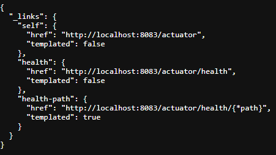

# Spring Actuator 笔记


<font color=pink>了解</font>

## 一、Actuator 基本使用

<font color=pink>`SpringBoot`自带监控功能`Actuator`，可以帮助实现对程序内部运行情况监控，比如监控状况、`Bean`加载情况、环境变量、日志信息、线程信息等</font>

### 1、依赖

```xml
<!-- spring-actuator 场景启动器 -->
<dependency>
    <groupId>org.springframework.boot</groupId>
    <artifactId>spring-boot-starter-actuator</artifactId>
</dependency>
```


### 2、端点

项目启动后访问`/actuator`可查询当前应用开放的所有端点

| 访问`http://localhost:8083/actuator`                         |
| ------------------------------------------------------------ |
|  |

由上图可知，`actuator`默认开放两个端点，一个是`self`也就是`/actuator`本身，从`self`中的`href`属性可以看出使用端点需要访问`actuator`。

其次是`heath`端点需要访问`/actuator/health`，可以获取应用的状态

| 访问`http://localhost:8083/actuator/health`                  |
| ------------------------------------------------------------ |
|  |


### 3、配置

#### （1）端点路径

```yaml
# 此时想查询暴露的所有端点就不能使用`/actuator`而要使用`/aaa`
management:
  endpoints:
    web:
      base-path: /aaa
```


#### （2）端点暴露

```yaml
# 暴露所有端点
management:
  endpoints:
    web:
      base-path: /actuator
      exposure:
        include: "*"

# 暴露指定端点（health，beans）
# 注意self端点即便不显式声明也是会暴露的
management:
  endpoints:
    web:
      base-path: /actuator
      exposure:
        include: 
        	- "health"
        	- "beans"
```


