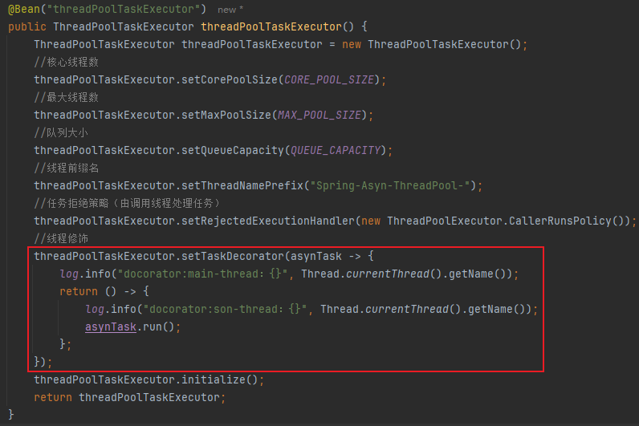

# SpringAsyn 笔记


## 一、注解

1. `@EnableAsync`：开启异步支持

2. `@Asyn`：需要异步执行的方法上添加该注解，当执行该方法后就会从线程池中获取一个线程来异步执行该任务。

   `value`属性：通过指定`@Asyn`的`value`属性可以手动指明使用哪个线程池完成异步任务，没有手动指明使用默认的线程池。`value`的值代表线程池`bean`的`name`。


## 二、线程池

- 配置线程池

  ```java
  @Slf4j
  public class ThreadPoolConfig {
      private static final Integer CORE_POOL_SIZE = 4;
      private static final Integer MAX_POOL_SIZE = 8;
      private static final Integer QUEUE_CAPACITY = 10000;
  
      /**
       * SpringAsyn 线程池
       *
       * @return
       */
      @Bean("threadPoolTaskExecutor")
      public ThreadPoolTaskExecutor threadPoolTaskExecutor() {
          ThreadPoolTaskExecutor threadPoolTaskExecutor = new ThreadPoolTaskExecutor();
          //核心线程数
          threadPoolTaskExecutor.setCorePoolSize(CORE_POOL_SIZE);
          //最大线程数
          threadPoolTaskExecutor.setMaxPoolSize(MAX_POOL_SIZE);
          //队列大小
          threadPoolTaskExecutor.setQueueCapacity(QUEUE_CAPACITY);
          //线程前缀名
          threadPoolTaskExecutor.setThreadNamePrefix("Spring-Asyn-ThreadPool-");
          //任务拒绝策略（由调用线程处理任务）
          threadPoolTaskExecutor.setRejectedExecutionHandler(new ThreadPoolExecutor.CallerRunsPolicy());
          //线程修饰
          threadPoolTaskExecutor.setTaskDecorator(asynTask -> {
              log.info("docorator:main-thread：{}", Thread.currentThread().getName());
              return () -> {
                  log.info("docorator:son-thread：{}", Thread.currentThread().getName());
                  asynTask.run();
              };
          });
          threadPoolTaskExecutor.initialize();
          return threadPoolTaskExecutor;
      }
  }
  ```

  

- 异步调用

  ```java
  // 控制层
  @Controller
  @RequestMapping("/test")
  @Slf4j
  public class TestController {
  
      @Resource
      private TestService testService;
  
      @PostMapping("/t1")
      @ResponseBody
      public String t1() {
          log.info("controller main thread ~~");
          testService.test();
          return "success";
      }
  }
  ```

  ```java
  // 业务层接口
  public interface TestService extends BaseService{
      void test();
  }
  ```

  ```java
  // 业务层实现类
  @Slf4j
  @Service
  public class TestServiceImpl implements TestService {
      @Async("threadPoolTaskExecutor")
      @Override
      public void test() {
          log.info("异步执行的任务~~");
      }
  }
  ```

  

  **<u>结果</u>**：

  ```
  2024-07-11 11:43:03 【INFO】 http-nio-8080-exec-10 --> controller main thread 
  2024-07-11 11:43:08 【INFO】 Spring-Asyn-ThreadPool-1 --> 异步执行的任务~~
  ```

  由此可以发现控制层所在的线程`http-nio-8080-exec-10`和异步任务所在的线程`Spring-Asyn-ThreadPool-1`不是同一个，可知异步执行成功。

  

- 异步使用注意事项

  <font color=red>注意：如果通过`@Asyn`使用多线程的话，那么调用`@Asyn`注解修饰的方法的对象必须是容器中的对象，也就是代理类对象(容器中本质上维护的是注册类的代理类对象)。如果不是代理类对象那么异步执行就会失效，比方说调用同类中被`@Asyn`修饰的方法，就会导致异步执行失效。</font>

  

  **<u>错误使用</u>**：

  ```java
  @Slf4j
  @Service
  public class TestServiceImpl implements TestService {
  
      @Override
      public void test() {
          // 调用同类中的异步方法
          test2();
      }
  
      @Async("threadPoolTaskExecutor")
      public void test2(){
          try {
              Thread.sleep(1000 * 5);
          } catch (InterruptedException e) {
              e.printStackTrace();
          }
          log.info("异步执行的任务~~");
      }
  }
  ```

  

  **<u>结果</u>**：

  ```
  2024-07-11 11:49:18 【INFO】 http-nio-8080-exec-9 --> controller main thread
  2024-07-11 11:49:23 【INFO】 http-nio-8080-exec-9 --> 异步执行的任务~~
  ```

  由此可以发现控制层线程和异步任务线程是同一个，异步任务执行失败。


## 三、线程修饰

|  |
| ------------------------------------------------------------ |

线程修饰的原理就是代理模式。配置类中的`asynTask`就是线程池中的异步线程，它作为函数式接口的入参`asynTask -> {...}`，由函数式接口代理该线程，函数式接口内部在将`asynTask`封装成新的`Runnable`并返回，在新的`Runnable`中通过`run`方法处理修饰前的线程。

注意：在返回新的`Runnable`线程之前都属于主线程(准备开启异步线程的线程)，在新的`Runnable`中的线程就属于修饰后新的线程。

**<u>添加线程修饰之后的执行结果</u>**：

```java
// 控制层
@Controller
@RequestMapping("/test")
@Slf4j
public class TestController {

    @Resource
    private TestService testService;

    @PostMapping("/t1")
    @ResponseBody
    public String t1() {
        log.info("controller main thread ~~");
        testService.test();
        return "success";
    }
}
```

```java
// 业务层
@Slf4j
@Service
public class TestServiceImpl implements TestService {

    @Override
    @Async("threadPoolTaskExecutor")
    public void test(){
        try {
            Thread.sleep(1000 * 5);
        } catch (InterruptedException e) {
            e.printStackTrace();
        }
        log.info("异步执行的任务~~");
    }
}
```


```
【请求路径】:class org.yg.ssm_template.controller.TestController.t1
2024-07-11 14:23:48 【INFO】 http-nio-8080-exec-8 --> controller main thread ~~
2024-07-11 14:23:48 【INFO】 http-nio-8080-exec-8 --> docorator:main-thread：http-nio-8080-exec-8
2024-07-11 14:23:48 【INFO】 Spring-Asyn-ThreadPool-1 --> docorator:son-thread：Spring-Asyn-ThreadPool-1
【响应参数】:"success"
2024-07-11 14:23:53 【INFO】 Spring-Asyn-ThreadPool-1 --> 异步执行的任务~~
```

- `2024-07-11 14:23:53 【INFO】 Spring-Asyn-ThreadPool-1 --> 异步执行的任务~~`

  在

  `【响应参数】:"success"` 之后。

  说明请求`controller`立马响应，异步线程在后台执行执行需要`5s`的任务

- `2024-07-11 14:23:48 【INFO】 http-nio-8080-exec-8 --> controller main thread ~~`

  和

  `2024-07-11 14:23:48 【INFO】 http-nio-8080-exec-8 --> docorator:main-thread：http-nio-8080-exec-8`

  说明进入控制层的线程是`http-nio-8080-exec-8`，并且线程修饰之前的线程仍然是该线程

- `2024-07-11 14:23:48 【INFO】 Spring-Asyn-ThreadPool-1 --> docorator:son-thread：Spring-Asyn-ThreadPool-1`

  说明从线程池中获取到的线程是`Spring-Asyn-ThreadPool-1`

- `2024-07-11 14:23:53 【INFO】 Spring-Asyn-ThreadPool-1 --> 异步执行的任务~~`

  可以证明最终执行异步任务的线程正是从线程池中获取的线程


