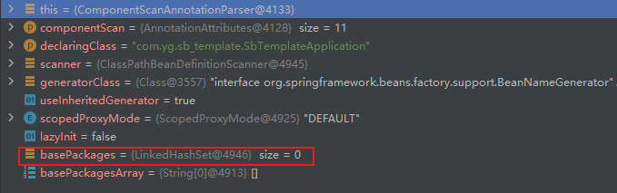
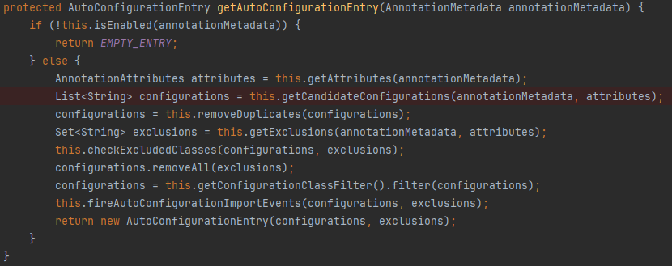
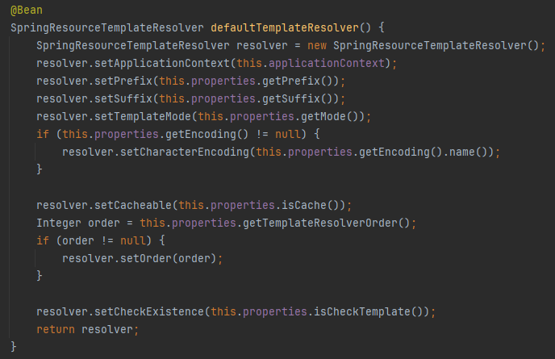
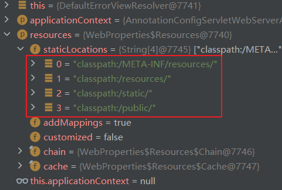

# SpringBoot 笔记


## 一、SpringBoot 配置文件

<font color=pink>Spring Boot默认从名为`application.properties`或者`application.yaml`的文件中读取配置。</font>

### 1、命令行配置文件

<u>*启动jar包*</u>

```cmd
java -jar myproject.jar --server.port = 8081
```

|  |
| ------------------------------------------------------------ |
| <font color=pink>在配置文件中port=8080的情况下，启动时使用了启动指令中的port=8081</font> |

<u>*禁用命令行配置*</u>

```java
@SpringBootApplication
public class SbTemplateApplication {
    public static void main(String[] args) {
        SpringApplication springApplication = new SpringApplication(SbTemplateApplication.class);
        // 禁用命令行更改application.yaml配置
        springApplication.setAddCommandLineProperties(false);
        springApplication.run(args);
    }
}
```

|  |
| ------------------------------------------------------------ |
| <font color=pink>禁用后以配置文件中的8080为准</font>         |


### 2、外部配置文件

<font color=red>注意：保证配置文件的名字为`application.properties`或者`application.yaml`</font>

<font color=pink>如果配置文件放在jar外边，那么启动时会自动的从外部配置文件中获取配置。</font>

- 当前目录 / config目录

  |  |
  | ------------------------------------------------------------ |

- 当前目录

  |  |
  | ------------------------------------------------------------ |

- classpath / config目录

  |  |
  | ------------------------------------------------------------ |

- classpath根目录

  |  |
  | ------------------------------------------------------------ |

  

### 3、自定义配置文件

<font color=pink>了解</font>

```cmd
java -jar myproject.jar --spring.config.location=classpath:/default.properties,classpath:/override.properties
```

或者

```java
@SpringBootApplication
@PropertySource(value={"file:config.properties"})
public class SpringbootrestdemoApplication {

    public static void main(String[] args) {
        SpringApplication.run(SpringbootrestdemoApplication.class, args);
    }
}
```


### 4、三种配置方式的优先级

优先级从高到低如下：

- 命令行
- 当前目录 / config目录
- 当前目录
- classpath / config目录
- classpath根目录


### 5、Spring profile

<u>*配置文件命名*</u>

- 主配置文件：`application.properties`

- profiles配置文件：

   <font color=red>命名规则：`application-{profiles}.yml` 或 `application-{profiles}.properties`</font>

  1. prod环境配置文件`：application-prod.properties`
  2. dev环境配置文件`：application-dev.properties`


<u>*profiles配置文件指定*</u>

```properties
# application.properties文件
spring.profiles.active = dev
```

```yaml
# application.yaml文件
spring:
  profiles:
    active: dev
```

```cmd
# jar包启动指定
java -jar myproject.jar --spring.profiles.active = prod
```

*<u>注意事项</u>*

- 主配置文件必定生效，profiles配置文件由主配置文件配置生效
- 主配置文件和profiles配置文件中配置相同的配置时以profiles配置文件中配置的为准


### 6、配置文件属性绑定语法

1. `properties`配置文件(不常用)

   <font color=pink>`properties`配置文件类比`yaml`配置文件。</font>

2. `yaml`配置文件

   <font color=pink>`yaml`文件中推荐使用`-`来表示驼峰命名的成员变量。比方说`agentNumber`，那么在`yaml`文件中使用`agent-number`表示。当然使用普通的`agentNumber`也是可以的。</font>

   <font color=pink>`Date`类型数据默认的格式`yyyy/mm/dd hh:mi:ss`，比方说`2023/01/01 23:59:59`</font>

   - `String`,`Integer`,`Boolean`,`Date`等类型

     ```java
     // 测试实体类
     
     @Data
     @Component
     @ConfigurationProperties(prefix = "test")
     public class Test {
         // String
         private String name;
         // Integer
         private Integer age;
         // Boolean
         private Boolean isMan;
         // Date
         private Date birthday;
     }
     ```

     ```yaml
     # 配置文件
     
     test:
       name: yangguo
       age: 18
       is-man: true
       birthday: 1995/01/01 00:00:00
     ```

     ```java
     // 测试类
     @SpringBootTest
     @Slf4j
     class SbTemplateApplicationTests {
         @Resource
         private com.yg.sb_template.config.Test test;
     
         @Test
         void contextLoads() {
             // 结果：test:Test(name=yangguo, age=18, isMan=true, birthday=Sun Jan 01 00:00:00 HKT 1995)
             log.info("test:{}", test);
         }
     ```

     

   - 实体类

     ```java
     // 测试实体类
     @Data
     @Component
     @ConfigurationProperties(prefix = "test")
     public class Test {
         private SonTest sonTest;
     }
     
     // 测试子实体类
     @Data
     public class SonTest {
         private String name;
         private Integer age;
     }
     ```

     ```yaml
     # 配置文件
     
     # 方式1
     test:
       son-test: {name: "yangguo",age: 18}
       
     # 方式2（name和age放在下一层代表name和age是son-test中的属性）
     test:
       son-test:
         name: yangguo
         age: 18
     ```

     ```java
     // 测试类
     @SpringBootTest
     @Slf4j
     class SbTemplateApplicationTests {
         @Resource
         private com.yg.sb_template.config.Test test;
     
         @Test
         void contextLoads() {
             // 结果：test:Test(sonTest=SonTest(name=yangguo, age=18))
             log.info("test:{}", test);
         }
     }
     ```

     

   - `List`集合

     ```java
     // 测试实体类
     @Data
     public class SonTest {
         private String name;
         private Integer age;
     }
     
     // 测试子实体类
     @Data
     public class SonTest {
         private String name;
         private Integer age;
     }
     ```

     ```yaml
     # 配置文件
     
     # 方式1
     test:
       list1: ["1","2"]
       list2: [{name: "name1", age: 1},{ name: "name2", age: 2 }]
       
     # 方式2（- 代表集合中的某一项）
     test:
       list1:
         - 1
         - 2
       list2:
         - name: name1
           age: 1
         - name: name2
           age: 2
     ```

     ```java
     // 测试类
     @SpringBootTest
     @Slf4j
     class SbTemplateApplicationTests {
         @Resource
         private com.yg.sb_template.config.Test test;
     
         @Test
         void contextLoads() {
             // 结果:test:Test(list1=[1, 2], list2=[SonTest(name=name1, age=1), SonTest(name=name2, age=2)])
             log.info("test:{}", test);
         }
     }
     ```

     

   - `Map`集合

     ```java
     // 测试实体类
     @Data
     public class SonTest {
         private Map<String,SonTest> map;
     }
     
     // 测试子实体类
     @Data
     public class SonTest {
         private String name;
         private Integer age;
     }
     ```

     ```yaml
     # 配置文件
     
     # 方式1
     test:
       map:
         str1: {name: '张三', age: 18}
         str2: {name: '李四', age: 20}
         
     # 方式2
     test:
       map:
         str1:
           name: '张三'
           age: 18
         str2:
           name: '李四'
           age: 20
     ```

     ```java
     // 测试类
     @SpringBootTest
     @Slf4j
     class SbTemplateApplicationTests {
         @Resource
         private com.yg.sb_template.config.Test test;
     
         @Test
         void contextLoads() {
             // 结果:test:Test(map={str1=SonTest(name=张三, age=18), str2=SonTest(name=李四, age=20)})
             log.info("test:{}", test);
         }
     }
     ```


## 二、SpringBoot 依赖管理

### 1、场景启动器

- SpringBoot中形如`spring-boot-starter-*`的依赖都属于SpringBoot官方的场景启动器依赖，比方说`spring-boot-starter-web`,`spring-boot-starter-test`。

- 引入不同的场景启动器，就相当于引入了不同开发环境下的所有依赖。比方说引入`spring-boot-starter-web`就相当于引入了Javaweb开发的所有依赖，诸如`springmvc`,`json`,`tomcat`等。引入`spring-boot-starter-test`就相当于引入了Test的所有依赖。

- 部分场景启动器，都依赖`spring-boot-starter`

  ```xml
  <dependency>
    <groupId>org.springframework.boot</groupId>
    <artifactId>spring-boot-starter</artifactId>
    <version>3.3.0</version>
    <scope>compile</scope>
  </dependency>
  ```

  而`spring-boot-starter`则依赖`spring-boot-autoconfigure`

  ```xml
  <dependency>
    <groupId>org.springframework.boot</groupId>
    <artifactId>spring-boot-autoconfigure</artifactId>
    <version>3.3.0</version>
    <scope>compile</scope>
  </dependency>
  ```

  `spring-boot-autoconfigure`依赖中定义了所有场景下的配置类，在引入不同场景的启动器之后就会进行自动配置。

- 第三方场景启动器的命名规则`*-spring-boot-starter`


### 2、版本控制

<font color=pink>所有的SpringBoot项目都依赖的一个场景启动器是`spring-boot-starter-parent`</font>，而`spring-boot-starter-parent`又依赖

```xml
<groupId>org.springframework.boot</groupId>
<artifactId>spring-boot-dependencies</artifactId>
<version>3.3.0</version>
```

通过查看`spring-boot-dependencies`的pom文件可以发现，在`spring-boot-dependencies`中没有引入任何一个依赖，而是使用`<dependencyManagement></dependencyManagement`标签进行了依赖声明，规定了依赖的版本，也就是说我们在引入依赖的时候只要是`spring-boot-dependencies`中声明的依赖，都是可以不用声明版本号的。如果自己声明的话，那么用的就是自己声明的版本，没有声明的话用的就是`spring-boot-dependencies`中的版本。


## 三、SpringBoot 注解

<font color=pink>SpringBoot摒弃了Spring中Xml配置的方式，改为了**<u>全注解驱动</u>**</font>

<font color=skyblue>大部分注解参考：Spring 笔记</font>

### 1、条件注解

<font color=pink><u>**SpringBoot中所有以`@Conditional...`开头的注解，主要用于根据特定的条件决定是否注册Bean到容器中以及配置类是否生效问题。**</u></font>

- `@Conditional`

  <font color=pink>所有以`@Conditional...`开头的注解上均添加了`@Conditional`</font>

  比方说常见的：

  | `@ConditionalOnClass注解`<br /> |
  | ------------------------------------------------------------ |
  | `@ConditionalOnProperty注解`<br /> |
  | <font color=skyblue>`Conditional`注解及其衍生注解均可以作为元注解添加到其他的注解上，赋予其他注解根据条件注册Bean到容器的功能</font> |

  

  ```java
  // Conditional注解源码
  @Target({ElementType.TYPE, ElementType.METHOD})
  @Retention(RetentionPolicy.RUNTIME)
  @Documented
  public @interface Conditional {
      Class<? extends Condition>[] value();
  }
  ```

  `@Conditional`注解中的value属性是实现了`Condition`接口类的class对象数组。

  ```java
  // Condition接口源码
  public interface Condition {
      boolean matches(ConditionContext context, AnnotatedTypeMetadata metadata);
  }
  ```

  `Condition`接口中有一个`matches`方法，该方法的作用是定义判断方法，方法返回true代表Bean将被注册，返回false则Bean不会注册。由于`@Conditional`注解中的value属性值是一个数组，所以说如果添加多个条件的class，那么必须所有的条件类的matches方法均是true，才会将Bean注册至容器。比方说：

  ```java
  // 自定义类实现Condition接口重写matches方法
  // 此时matches方法的返回值恒为true，也就是说@Conditional使用MyCondition的判断规则的话，那么必定注册Bean
  public class MyCondition implements Condition {
      @Override
      public boolean matches(ConditionContext context, AnnotatedTypeMetadata metadata) {
          return true;
      }
  }
  ```

  ```java
  @Configuration
  public class MyConfig {
      @Bean("sys")
      // 根据自定义条件MyCondition注册Bean
      @Conditional(MyCondition.class)
      public SysUserEntity sysUserEntity() {
          return SysUserEntity.builder().id(100l).build();
      }
  }
  ```

  ```java
  // 测试类
  @SpringBootTest
  @Slf4j
  class SbTemplateApplicationTests {
      @Resource
      private ApplicationContext applicationContext;
  
      @Test
      void contextLoads() {
          String[] beanNamesForType = applicationContext.getBeanNamesForType(SysUserEntity.class);
          List<String> list = Arrays.asList(beanNamesForType);
          log.info("所有类型是SysUserEntity的Bean的名字:{}", list);
      }
  }
  ```

  |  |
  | ------------------------------------------------------------ |
  | <font color=pink>此时由于必定可以注册成功，所以容器中存在一个名为sys的Bean</font> |
  |  |
  | <font color=pink>如果将MyCondition中的结果改成必定false，那么就会导致注册失败，容器中不存在名为sys的Bean</font> |

- `@ConditionalOnProperty`

  根据应用上下文中是否存在某个属性值的属性来决定是否注册Bean到容器中。

  <u>*常用属性：*</u>

  - `prefix`：配置前缀
  - `name`：配置属性名
  - `havingValue`：当配置文件中的属性值与`havingValue`的属性值一致则注册Bean，否则不注册
  - `matchIfMissing`：默认值为false。当要验证的属性值不存在的时候，默认不注册。如果设置为true，那么当要验证的属性不存在的时候也会注册Bean。

  <u>*举个例子：*</u>

  ```java
  @Configuration
  public class MyConfig {
      @Bean("sys")
      /*
      	此时会判断配置文件中是否存在test.flag这一属性，如果存在那么验证配置文件中的属性值是否与havingValue的值一致，如果一致那么注册Bean，否则不注册。如果在查找配置文件的过程中发现要判断的属性并不存在，那么就要看matchIfMissing属性设置的值，如果为false不注册，否则注册。
      */
      @ConditionalOnProperty(prefix = "test", name = "flag", havingValue = "true",matchIfMissing = true)
      public SysUserEntity sysUserEntity() {
          return SysUserEntity.builder().id(100l).build();
      }
  }
  ```

  <u>*项目例子：*</u>

  ```java
  // 自定义注解 @Candypay：开店宝应用
  @Target(ElementType.TYPE)
  @Retention(RetentionPolicy.RUNTIME)
  @Documented
  @Inherited
  @ConditionalOnProperty(prefix = "payment", name = "type", havingValue = Constants.CANDYPAY)
  public @interface Candypay {
  }
  ```

  ```java
  // 自定义注解 @Qtopay：中付应用
  @Target(ElementType.TYPE)
  @Retention(RetentionPolicy.RUNTIME)
  @Documented
  @Inherited
  @ConditionalOnProperty(prefix = "payment", name = "type", havingValue = Constants.QTOPAY)
  public @interface Qtopay {
  }
  ```

  以上两个注解中均使用了`@ConditionalOnProperty`注解，通过读取配置文件中的`payment.type`属性，来决定添加了`@Qtopay`或者`@Candypay`注解的Bean是否注册到容器。

  先存在一个`ASerice`接口

  ```java
  public interface ASerice {}
  ```

  `AService`接口拥有两个实现类`A1SericeImpl`,`A2SericeImpl`

  ```java
  // 实现类A1SericeImpl
  @Qtopay
  public class A1SericeImpl implements ASerice {}
  ```

  ```java
  // 实现类A2SericeImpl
  @Candypay
  public class A2SericeImpl implements ASerice {}
  ```

  此时由于开店宝应用和中付应用启动时使用的配置文件不一样，那么`payment.type`的属性值不一样。此时在开店宝应用中`A1SericeImpl`就不会被注册，那么通过`@Resource`注入`ASerice`接口的Bean的时候就只会注入`A2SericeImpl`，而不会出现同一个接口对应多个Bean的错误。这样将开店宝和中付的处理逻辑隔离。
  
- `@ConditionalOnClass`

  <font color=pink>根据类路径`classpath`中是否存在某个类的字节码文件来决定Bean的注册。如果存在那么注册，不存在则不注册。</font>

  <font color=red>SpringBoot项目打包后的类路径包括两个：（1）项目自身的类文件：`sb_template-1.0.0.jar\BOOT-INF\classes`；（2）项目依赖的其他Jar包中的类文件：`sb_template-1.0.0.jar\BOOT-INF\lib`。</font>

  <font color=pink>两种类路径的写法</font>：

  - `classpath:/mapper/**/*.xml`

    含义：当前应用程序类路径下mapper文件夹下任意路径中所有的xml文件

  - `classpath*:/mapper/**/*.xml`

    含义：当前应用程序类路径下以及当前应用程序所依赖的Jar包中的类路径下的mapper文件夹下任意路径中所有的xml文件

  

  | （1）项目自身的类文件                                        |
  | ------------------------------------------------------------ |
  |  |
  | **（2）项目依赖的其他Jar包中的类文件**                       |
  |  |

  <u>常用属性</u>：

  - `value`：待检测类的class对象数组

    ```java
    @Configuration
    public class MyConfig {
        
        @Bean("sys1")
        // 如果类路径中有MyTest的类文件那么注册Bean，否则不注册
        @ConditionalOnClass(value = {MyTest.class})
        public SysUserEntity sysUserEntity1() {
            return new SysUserEntity();
        }
    }
    ```

  - `name`：待检测类的全类名数组

    ```java
    @Configuration
    public class MyConfig {
        @Bean("sys1")
        // 如果类路径中有com.yg.sb_template.config.MyTest的类文件那么注册Bean，否则不注册
        @ConditionalOnClass(name = {"com.yg.sb_template.config.MyTest"})
        public SysUserEntity sysUserEntity1() {
            return new SysUserEntity();
        }
    }
    ```

- `@ConditionalOnBean`

  <font color=pink>根据容器中是否存在某个Bean来决定Bean的注册，存在注册，否则不注册。</font>

  <u>*常用属性*</u>：

  - `value`：待检测Bean的class对象

    ```java
    @Configuration
    public class MyConfig {
        @Bean("sys1")
        
        // 容器中存在MyTest的Bean那么注册Bean，否则不注册
        @ConditionalOnBean(value = {MyTest.class})
        public SysUserEntity sysUserEntity1() {
            return new SysUserEntity();
        }
    }
    ```

  - `name`：待检测Bean的名字

    ```java
    @Configuration
    public class MyConfig {
        @Bean("sys1")
        
        // 容器中存在名为myTest的Bean那么注册Bean，否则不注册
        @ConditionalOnBean(name = {"myTest"})
        public SysUserEntity sysUserEntity1() {
            return new SysUserEntity();
        }
    }
    ```

  

### 2、属性绑定注解

- `@ConfigurationProperties`

  <u>*作用*</u>：

  将配置文件中配置的属性转化成Java类中的成员变量。

  <u>*注意*</u>：要想完成转化那么Java类必须要注册到容器中，也就是说`@ConfigurationProperties`要配合`@Component`使用

  ```yaml
  # 配置文件
  test:
    name: yangguo
    id: 1
  ```

  ```java
  // 组件类
  @Component
  @ConfigurationProperties(prefix = "test")
  public class MyProperties {
      private Long id;
      private String name;
  }
  ```

  ```java
  // 测试类
  @SpringBootTest
  @Slf4j
  class SbTemplateApplicationTests {
      @Resource
      private MyProperties myProperties;
  
      @Test
      void contextLoads() {
          
          // 结果：myProperties:MyProperties(id=1, name=yangguo)
          log.info("myProperties:{}", myProperties);
      }
  }
  ```

- `@EnableConfigurationProperties`

  <u>*作用*</u>：

  - 开启配置属性自动配置Java类
  - 指定的类，默认被注册到容器中（不需要额外添加`@Component`注解）

  *<u>属性</u>：value：指定需要自动配置的类的class对象（数组：可以指定多个类）*

  *<u>使用</u>*：

  ```java
  // 配置类
  @Configuration
  // 开启MyProperties类的自动配置
  @EnableConfigurationProperties({MyProperties.class})
  public class MyConfig {
  }
  ```

  ```java
  // 组件类（不需要@Component注解）
  @ConfigurationProperties(prefix = "test")
  public class MyProperties {
      private Long id;
      private String name;
  }
  ```

  注意：<font color=red>`@EnableConfigurationProperties`注解主要用于第三方Jar中添加了`@ConfigurationProperties`的类。因为在第三方jar中即便添加了`@Component`注册组件，但是SpringBoot中启动扫描注解只会扫描启动类所在包及其子包中的注册Bean的注解，所以第三方jar中即便使用`@Component`也是无效的。于是可以通过`@EnableConfigurationProperties`注解将配置文件中的属性指定给第三方jar中的类。</font>


> 补充

- SpringBoot中所有的内置配置项都对应一个Java类。

  ```yaml
  # SpringBoot中数据源配置项
  spring:
    datasource:
      type: com.zaxxer.hikari.HikariDataSource
      driver-class-name: oracle.jdbc.OracleDriver
      url: jdbc:oracle:thin:@192.168.75.201:1521:helowin
      username: yangguo
      password: yangguo
  ```

  ```java
  // 通过 ctrl+右击 任意一个属性名即可以进入到一个Java类中
  
  // 通过ConfigurationProperties注解将配置文件中的配置项转化成Java类中的成员变量
  @ConfigurationProperties(prefix = "spring.datasource")
  public class DataSourceProperties implements BeanClassLoaderAware, InitializingBean {
      private ClassLoader classLoader;
      private boolean generateUniqueName = true;
      private String name;
      private Class<? extends DataSource> type;
      private String driverClassName;
      private String url;
      private String username;
      private String password;
      private String jndiName;
      private EmbeddedDatabaseConnection embeddedDatabaseConnection;
      private Xa xa = new Xa();
      private String uniqueName;
  }
  ```

  

- 如果一个类依赖一个配置属性类，并且配置属性类被`final`修饰，那么即便不使用`@Resource`或者`@Autowired`，此时配置类依然会从容器中获取。

  ```java
  // 配置类
  @Data
  @Component
  @ConfigurationProperties(prefix = "test")
  public class Test {
      private String a;
      private String b;
  }
  ```

  ```java
  // 依赖配置类的类
  @Data
  @Component
  public class SonTest {
      private Test test;
  }
  ```

  ```java
  // 测试类
  @SpringBootTest
  @Slf4j
  class SbTemplateApplicationTests {
      @Resource
      private SonTest sonTest;
  
      @Test
      void contextLoads() {
          // 结果：sonTest:SonTest(test=null)
          log.info("sonTest:{}", sonTest);
      }
  }
  ```

  <font color = pink>由如下结果可以得出如果使用`private Test test;`此时`sonTest`中的`test`并不是从容器中获取。</font>

  ```java
  // 测试类
  @SpringBootTest
  @Slf4j
  class SbTemplateApplicationTests {
      @Resource
      private SonTest sonTest;
      
      @Resource
      private Test test;
  
      @Test
      void contextLoads() {
          // 结果：fale，由此可以证明
          System.out.println(sonTest.getTest() == test);
      }
  }
  ```

  <font color=pink>使用``private final Test test;`此时`Spring`会使用构造器注入，也就是说此时的`test`会从容器中获取。</font>

  ```java
  // 测试类
  @SpringBootTest
  @Slf4j
  class SbTemplateApplicationTests {
      @Resource
      private SonTest sonTest;
      
      @Resource
      private Test test;
  
      @Test
      void contextLoads() {
          // 结果：true，由此可以证明
          System.out.println(sonTest.getTest() == test);
      }
  }
  ```


### 3、别名注解

- `@AliasFor`

  - 同注解中属性互为别名

    <font color=pink>同注解中A和B两个属性互为别名，那么对A赋值相当于对B赋予了相同的值，对B赋值相当于对A赋予了相同的值。</font>

    <font color=red>注意：互为别名的属性必须要有默认值；互为别名的属性类类型和默认值必须一样</font>

    ```java
    // 自定义注解
    @Retention(value = RetentionPolicy.RUNTIME)
    @Target(value = {ElementType.TYPE})
    public @interface MyAnno {
        String value() default "";
    
        // name1是name2的别名
        @AliasFor("name2")
        String name1() default "";
    
        // name2是name1的别名
        @AliasFor("name1")
        String name2() default "";
    }
    ```

    ```java
    // 添加自定义注解的类
    @MyAnno(name1 = "name1")
    public class MyTest {
    }
    ```

    ```java
    // 测试类
    @Slf4j
    public class Test {
        public static void main(String[] args) {
            // 注意：由于AliasFor是spring中的注解，所以需要使用spring中的方式获取注解属性值。使用Java原生的方式无法获取
            MyAnno annotation = AnnotationUtils.getAnnotation(MyTest.class, MyAnno.class);
            log.info("name1:{}", annotation.name1());
            log.info("name2:{}", annotation.name2());
        }
    }
    ```

    测试结果：

    name1和name2互为别名之后，在对其中一个赋值之后，也相当于同时对另一个赋值。

    ```
    [main] INFO com.yg.sb_template.config.Test -- name1:name1
    [main] INFO com.yg.sb_template.config.Test -- name2:name1
    ```

  - 不同注解属性互为别名

    <font color=pink>A注解上添加B注解，A注解中的a属性与B注解的b属性互为别名，那么此时给A注解的a属性赋值，那么相当于为B注解的b属性赋值。</font>

    ```java
    // 自定义注解
    @Retention(value = RetentionPolicy.RUNTIME)
    @Target(value = {ElementType.TYPE})
    /*
    	自定义注解上添加@Component注解，此时自定义注解具有了@Component注解的功能。
    */
    @Component
    public @interface MyAnno {
        /*
        	（1）通过使用@AliasFor中的annotation属性，将自定义注解中的value属性作为@Component中的别名属性。也就是说给自定义注解的value赋值相当于给@Component注解的value属性赋值，@MyAnno("aaa")相当于@Component("aaa")
        	（2）使用@AliasFor(annotation = Component.class)相当于与@Component中同名的属性互为别名，如果@Component中不存在同名的属性那么就会报错。如果@Component中不存在同名的属性可以通过@AliasFor中的attibute属性指明与@Component注解中的哪个属性互为别名。比方说@AliasFor(annotation = Component.class,attribute = "name")的作用就是与@Component中的name属性互为别名。
        */
        @AliasFor(annotation = Component.class)
        String value() default "";
    }
    ```

    ```java
    // 使用自定义注解：给@MyAnno注解的value属性赋值相当于给@Component注解的value赋值，@MyAnno("aaa")在这里的作用就是向容器中注册一个名为aaa的Bean。
    @MyAnno("aaa")
    public class MyTest {
    }
    ```

    ```java
    @SpringBootTest
    @Slf4j
    class SbTemplateApplicationTests {
        @Resource
        private ApplicationContext applicationContext;
    
        @Test
        void contextLoads() {
            MyAnno annotation = AnnotationUtils.getAnnotation(MyTest.class, MyAnno.class);
            // 通过"aaa"从容器中获取对象
            MyTest bean = (MyTest) applicationContext.getBean("aaa");
            // 结果：bean:com.yg.sb_template.config.MyTest@7404aff2
            // 获取Bean成功，说明@MyAnno注解的value属性和@Component注解的value属性互为别名
            log.info("bean:{}", bean);
        }
    }
    ```

  

## 四、SpringBoot 自动配置

<font color=red>**面试重点**</font>

### 1、`@SpringBootApplication`注解

<font color=pink>`@SpringBootApplication`注解是`@SpringBootConfiguration`,`@EnableAutoConfiguration`,`@ComponentScan`三个核心注解的复合注解，`@SpringBootApplication`注解同时具有这三个注解的功能。</font>

### 2、`@SpringBootConfiguration` 注解

<font color=pink>`@SpringBootConfiguration`注解是`@Configuration`注解的别名注解。</font>

|  |
| ------------------------------------------------------------ |

两者的作用是一样的：将类作为配置类注册到容器中。`@Configuration`是Spring的注解，`@SpringBootConfiguration`是SpringBoot中的注解。看到`@Configuration`标记的类那该类就是Spring中的配置类，看到`@SpringBootConfiguration`标记的类就是SpringBoot中的配置类。它们的关系可以类比`@Controller`,`@Service`,`@Repository`，这三个注解的作用都是一样的，之所以分成三个主要是为了将Bean标记成不同场景的Bean，控制层使用`@Controller`，业务层使用`@Service`，持久层使用`@Repository`。


### 3、`@ComponentScan` 注解

`@SpringBootApplication`注解上添加了`@ComponentScan`注解，并且通过`@AliasFor`注解将`@SpringBootApplication`注解中的`scanBasePackages`属性与`@ComponentScan`中的`basePackages`属性互为别名，也就是说`@SpringBootApplication(scanBasePackages = {"com.yg.sb_template"})`相当于`@ComponentScan(basePackages = "com.yg.sb_template")`。

| `@SpringBootApplication`注解源码                             |
| ------------------------------------------------------------ |
|  |

又由于在`@ComponentScan`注解中`value`和`basePackages `互为别名，综上可知，`@SpringBootApplication(scanBasePackages = {"com.yg.sb_template"})`就相当于在Spring中常用的`@ComponentScan("com.yg.sb_template")`。

| `@ComponentScan`注解源码                                     |
| ------------------------------------------------------------ |
|  |

此外`@SpringBootApplication`上不可以再次使用`ComponentScan`进一步说明了`@SpringBootApplication`是`@ComponentScan`的别名注解。

|  |
| ------------------------------------------------------------ |


<font color=red><u>SpringBoot应用程序启动后默认会自动扫描主程序所在包及其子包中的组件。主程序就是添加了`@SpringBootApplication`注解的类。</u></font>

注意：如果使用了`@SpringBootApplication(scanBasePackages = {"com.yg.sb_template.controller"})`更改了扫包路径，那么就会将默认的扫包路径(主程序所在包及其子包)给覆盖掉，此时除了`controller`下的组件会被扫描，其他的所有包均不会被扫描。

**<u>源码分析</u>**：

<font color=pink>源码基于SptingBoot3</font>

- 获取`@ComponentScan`注解属性

  | 方法路径：`org.springframework.context.annotation.ConfigurationClassParser#doProcessConfigurationClass` |
  | ------------------------------------------------------------ |
  |  |

  

- 解析注解属性

  | 方法路径：`org.springframework.context.annotation.ConfigurationClassParser#doProcessConfigurationClass` |
  | ------------------------------------------------------------ |
  |  |

  

  **Debug**：

  | `@SpringBootApplication`                                     |
  | ------------------------------------------------------------ |
  |  |
  | **`@SpringBootApplication(scanBasePackages = "com.yg.sb_template.controller")`** |
  |  |

  

- 获取`@ComponentScan`注解的`basePackages`和`basePackageClasses`

  | 方法路径：`org.springframework.context.annotation.ComponentScanAnnotationParser#parse` |
  | ------------------------------------------------------------ |
  |  |

  

  **Debug**：

  | `@SpringBootApplication`                                     |
  | ------------------------------------------------------------ |
  |  |
  | **`@SpringBootApplication(scanBasePackages = "com.yg.sb_template.controller")`** |
  |  |

  

- 获取默认扫包路径（仅限不配置的情况下）

  | 方法路径：`org.springframework.context.annotation.ComponentScanAnnotationParser#parse` |
  | ------------------------------------------------------------ |
  |  |

  

  **Debug**：

  |  |
  | ------------------------------------------------------------ |
  | <font color=pink>由此可知，如果在没有配置`basePackages`的情况下会使用启动类所在的包作为扫包路径。</font> |

  

- 最终扫包路径

  **Debug**：

  | `@SpringBootApplication`                                     |
  | ------------------------------------------------------------ |
  |  |
  | **`@SpringBootApplication(scanBasePackages = "com.yg.sb_template.controller")`** |
  |  |

  

- 开始扫描包

  | 方法路径：`org.springframework.context.annotation.ComponentScanAnnotationParser#parse` |
  | ------------------------------------------------------------ |
  |  |

  


**<u>补充</u>**：

Spring容器中Bean的命名方式：在上述的开始扫包方法中存在`generateBeanName`方法生成Bean的name

```java
String beanName = this.beanNameGenerator.generateBeanName(candidate, this.registry);
```

而该方法有一个注解扫描Bean的命名生成的实现

```java
public class AnnotationBeanNameGenerator implements BeanNameGenerator {

    public String generateBeanName(BeanDefinition definition, BeanDefinitionRegistry registry) {
        if (definition instanceof AnnotatedBeanDefinition annotatedBeanDefinition) {
            String beanName = this.determineBeanNameFromAnnotation(annotatedBeanDefinition);
            if (StringUtils.hasText(beanName)) {
                return beanName;
            }
        }

        // 默认方法
        return this.buildDefaultBeanName(definition, registry);
    }
}
```

而默认命名方法取决于`StringUtils.uncapitalizeAsPropert()`

```java
protected String buildDefaultBeanName(BeanDefinition definition) {
        String beanClassName = definition.getBeanClassName();
        Assert.state(beanClassName != null, "No bean class name set");
        String shortClassName = ClassUtils.getShortName(beanClassName);
        return StringUtils.uncapitalizeAsProperty(shortClassName);
}
```

`StringUtils.uncapitalizeAsPropert()`源码

```java
public static String uncapitalizeAsProperty(String str) {
    /*
    	（1）如果开头连续两个是大写字母那么直接返回原字符串(return str;)
    	（2）如果开头不是两个连续的大写字母那么返回首字母小写(return changeFirstCharacterCase(str, false);)
    */
        return hasLength(str) 
            && 
            (str.length() <= 1 
             || !Character.isUpperCase(str.charAt(0)) 
             || !Character.isUpperCase(str.charAt(1))
            ) ? 
            changeFirstCharacterCase(str, false) : str;
}
```


### 4、`@EnableAutoConfiguration` 注解

<font color=pink>`@EnableAutoConfiguration`是`@AutoConfigurationPackage`和`@Import`的复合注解。</font>

- `@AutoConfigurationPackage`

  <font color=red>**<u>澄清</u>**：虽然该注解的名字是自动配置包路径，但是该注解配置的包路径和SpringBoot启动扫描注解包路径没有关系。SpringBoot默认的扫包路径是启动类所在包及其子包，是由`@SpringBootApplication`上的`@ComponentScan`决定的。并且根据debug可知处理`@ComponentScan`注解的时机是在`@AutoConfigurationPackage`注解之前的。</font>

  

  `@AutoConfigurationPackage`注解上添加了`@Import({AutoConfigurationPackages.Registrar.class})`

  |  |
  | ------------------------------------------------------------ |

  通过debug可知，项目启动过程会执行内部类`AutoConfigurationPackages.Registrar`中的`registerBeanDefinitions`方法

  |  |
  | ------------------------------------------------------------ |

  其中`new PackageImports(metadata)`之中根据获取自动配置包路径。如下图，首先获取`@AutoConfigurationPackage`注解的配置属性，如果配置属性存在的话就用配置属性，而由`@AutoConfigurationPackage`源码可知`@AutoConfigurationPackage`没有配置任何属性值。如果没有配置属性值，那么就获取`@AutoConfigurationPackage`注解所标注类所在的包路径作为SpringBoot默认的自动配置包路径。

  |  |
  | ------------------------------------------------------------ |

  <font color=red>自动扫包路径和自动配置路径的区别：自动扫包路径指的是项目启动扫描组件创建Bean的路径，该路径被当前SpringBoot项目使用，用来扫描`@Component`,`@Controller`,`@Service`,`@Repository`等注解。自动配置路径是SpringBoot项目接入其他框架，其他框架扫描组件所使用的路径，比方说Mybatis中`@Mapper`组件的扫描，SpringBoot扫描组件的时候不会将`@Mapper`注解标注的类注册到容器中，自动配置包路径就是为第三方框架指明扫描组件的包路径。</font>

  如果此时项目结构如下：

  | mapper接口在启动类所在包以及子包中                           |
  | ------------------------------------------------------------ |
  |  |

  ```java
  // mapper接口上添加@Mapper注解
  @Mapper
  public interface SysUserMapper extends BaseMapper<SysUserEntity> {
  }
  ```

  ```java
  // 测试类
  @SpringBootTest
  @Slf4j
  class SbTemplateApplicationTests {
      @Resource
      private SysUserMapper sysUserMapper;
  
      @Test
      void contextLoads() {
          // 结果：SysUserMapper:com.baomidou.mybatisplus.core.override.MybatisMapperProxy@65b7678a
          log.info("SysUserMapper:{}", sysUserMapper);
      }
  }
  ```

  由测试结果可知添加了`@mapper`注解的接口会被注册到容器中，说明组件扫描成功，因为mapper接口与启动类在同一包路径下。

  但是如果项目结构如下：

  | mapper接口不在启动类所在包以及子包中                         |
  | ------------------------------------------------------------ |
  |  |

  此时再次测试就会提示容器中不存在mapper的Bean，说明组件扫描失败，因为mapper接口与启动类不在同一包路径下。

  |  |
  | ------------------------------------------------------------ |

  

- `@Import({AutoConfigurationImportSelector.class})`

  `@Import`注解中有一个value属性，value属性是一个Class对象数组。

  |  |
  | ------------------------------------------------------------ |

  <u>value属性可以有三种情况</u>：

  - 普通类的class

    ```java
    // 普通类
    public class Test123 {
    }
    ```

    <font color=pink>`@Import(Test123.class)`相当于隐式的在`Test123`上添加`@Configuration`注解，这样容器启动的时候就会将`Test123`作为配置类注册到容器中。</font>

    ```java
    // 配置类
    @Configuration
    @Import(Test123.class)
    public class TestConfig {
    }
    ```

    

  - 配置类的class

    ```java
    // 配置类
    @Configuration
    public class Test2Config {
        @Bean
        public SysUserEntity abc() {
            return new SysUserEntity().setUserName("abc");
        }
    }
    ```

    <font color=pink>`@Import(Test2Config.class)`相当于隐式的在`Test2Config`上添加`@Configuration`注解，这样容器启动的时候就会将`Test123`作为配置类注册到容器中，如果`Test2Config`中有通过`@Bean`配置的Bean的话，也会一起被注册到容器中。</font>

    ```java
    // 配置类
    @Configuration
    @Import(Test2Config.class)
    public class TestConfig {
    }
    ```

    

  - `ImportSelector`接口实现类的class

    <font color=pink>实现`ImportSelector`接口重写的`selectImports`方法。此时会根据`selectImports`方法的执行结果动态的向容器中注册配置类。`selectImports`方法的返回值是要注册配置类的全类名数组，方法参数是添加`@Import`注解配置类上所有注解的元信息。</font>

    下方`selectImports`方法的作用就是如果`@Import`注解所在类上有`@MyAnno`注解的话，就将`Test2Config`作为配置类注册到容器中，没有`@MyAnno`注解的话就不注册。

    ```java
    // ImportSelector接口实现类
    public class TestSelector implements ImportSelector {
        @Override
        public String[] selectImports(AnnotationMetadata importingClassMetadata) {
            boolean myAnno = importingClassMetadata.hasAnnotation("com.yg.sb_template.config.MyAnno");
            if (myAnno) {
                return new String[]{"com.yg.sb_template.config.Test2Config"};
            } else {
                return new String[0];
            }
        }
    }
    ```

    ```java
    // 自定义注解
    @Target(ElementType.TYPE)
    @Retention(RetentionPolicy.RUNTIME)
    public @interface MyAnno {
        String value() default "";
    }
    ```

    ```java
    // 待注册的配置类
    public class Test2Config {
        @Bean
        public SysUserEntity abc() {
            return new SysUserEntity().setUserName("abc");
        }
    }
    ```

    ```java
    // 配置类
    @Configuration
    @Import(TestSelector.class)
    @MyAnno
    public class TestConfig {
    }
    ```

    ```java
    // 测试类
    @SpringBootTest
    @Slf4j
    class SbTemplateApplicationTests {
        @Test
        void contextLoads() {
            SysUserEntity sysUserEntity = (SysUserEntity)applicationContext.getBean("abc");
            log.info("sysUserEntity:{}",sysUserEntity);
        }
    }
    ```

    

  <u>自动配置原理</u>：

  `@Import({AutoConfigurationImportSelector.class})`上添加的`AutoConfigurationImportSelector`就是间接实现`ImportSelector`接口，在应用启动的时候进行自动配置，按需向容器中注册组件。

  关键方法：

  | 方法路径：`org.springframework.boot.autoconfigure.AutoConfigurationImportSelector#getAutoConfigurationEntry` |
  | ------------------------------------------------------------ |
  |  |

  | 方法路径：`org.springframework.boot.autoconfigure.AutoConfigurationImportSelector#getCandidateConfigurations` |
  | ------------------------------------------------------------ |
  |  |
  | **方法路径：`org.springframework.boot.context.annotation.ImportCandidates#load`** |
  |  |

  其中`String location = String.format("META-INF/spring/%s.imports", annotation.getName());`就是用来获取所有自动配置类元文件路径。`annotation.getName()`就是获取`@AutoAnnotation`注解的全类名，通过`String.format`格式化，最终的路径为`META-INF/spring/org.springframework.boot.autoconfigure.AutoConfiguration.imports`
  
  |  |
  | ------------------------------------------------------------ |

  需要自动配置的jar中会有该元文件
  
  |  |
  | ------------------------------------------------------------ |

  元文件中规定了所有需要自动配置的类，所有的自动配置类都是`**AutoConfiguration`结尾的，通过`@Import`注解和`ImportSelector`接口配置，动态的按需将所需要的配置类自动的注册到容器中，完成自动配置。
  
  |  |
  | ------------------------------------------------------------ |
  
  
  
  还需要注意的一点：写在元文件中的需要SpringBoot启动时自动配置的类最终可能并不会全部的注册到容器中。因为有的自动配置类项目中可能并没有导入它的依赖，比方说`org.springframework.boot.autoconfigure.amqp.RabbitAutoConfiguration`
  
  |  |
  | ------------------------------------------------------------ |
  
  |  |
  | ------------------------------------------------------------ |
  
  这是消息队列的自动配置类，在应用中没有消息队列的依赖的话去注册配置类的Bean就会报错，并且进入自动配置类中也可以发现有很多报错的地方，这都是由于没有相关依赖导致的。
  
  <font color=pink>SpringBoot中通过`@ConditionalOnClass`注解控制自动配置类是否注册到容器中，如果没有相关依赖那么类路径上没有`RabbitTemplate`以及`Channel`的类文件，而`@ConditionalOnClass`注解的作用就是如果类路径上没有相关的类，那么就不会注册Bean，也就不会将自动配置类注册到容器中。</font>
  
  
  
  **<u>补充</u>**：
  
  `SpringBoot`中存在一些以`@EnableXXX`开头的注解，比方说`@EnableAsync`,`@EnableScheduling`等。这些注解的作用就是用来手动的开启某些特定的功能，功能的开启与否取决于是否向容器中注入了与这些功能相关的组件。
  
  比方说`@EnableAsync`注解开启了异步支持
  
  ```java
  // @EnableAsync 源码
  @Target({ElementType.TYPE})
  @Retention(RetentionPolicy.RUNTIME)
  @Documented
  @Import({AsyncConfigurationSelector.class})
  public @interface EnableAsync {
      Class<? extends Annotation> annotation() default Annotation.class;
  
      boolean proxyTargetClass() default false;
  
      AdviceMode mode() default AdviceMode.PROXY;
  
      int order() default Integer.MAX_VALUE;
  }
  ```
  
  `@Import({AsyncConfigurationSelector.class})`中的`AsyncConfigurationSelector`类间接的实现了`ImportSelector`接口，也就是说在`SpringBoot`启动时会根据`ImportSelector`接口的`selectImports`方法动态的向容器中放入开启相应功能所需要的组件，以达到开启响应功能的作用。


## 五、SpringBoot 日志

### 1、日志门面和日志实现

- 日志门面

  `Slf4j`，`Commons-logging`

- 日志实现

  `Log4j`，`Log4j2`，`Logback`

**<u>理解日志门面和日志实现之间的关系</u>**：

比方说现在存在一个接口A

```java
@Component
public interface A {}
```

接口A有两个实现类A1和A2

```java
@Component
public class A1 implements A{}
```

```java
@Component
public class A2 implements A{}
```

假如说有一个B类要依赖A类，此时就有三种情况。

第一种情况：B类依赖A1类。假如说后期B类要依赖A2类，那么就需要改B类中的代码，将`private A1 a1;`换成`private A2 a2;`

```java
@Component
public class B {
    @Resource
    private A1 a1;
}
```

第二种情况：B类依赖A2类。假如说后期B类要依赖A1类，那么就需要改B类中的代码，将`private A2 a2;`换成`private A1 a1;`

```java
@Component
public class B {
    @Resource
    private A2 a2;
}
```

第三种情况：B类依赖A接口。此时B类依赖抽象A，B类依赖A1还是A2主要取决于容器中存在A1还是A2的对象，所以即便B类后期的频繁的变更依赖，只需要变更A1和A2的对象在容器中存在与否即可，不需要改动源代码。

```java
@Component
public class B {
    @Resource
    private A a;
}
```

总结：

<font color=pink><u>应用程序直接依赖日志门面而不直接依赖日志实现，主要是为了解耦合。符合Java开发中可以依赖抽象但不能依赖具体实现的原则。</u></font>日志门面就好比上述的A接口，日志实现就好比上述的A1和A2。想要变更项目的日志实现只需要在容器中放入不同日志实现的对象即可。


### 2、默认日志

<font color=red>SpringBoot默认日志：`Slf4j` + `Logback`</font>

部分的场景启动器依赖`spring-boot-starter`

```xml
<dependency>
  <groupId>org.springframework.boot</groupId>
  <artifactId>spring-boot-starter</artifactId>
  <version>3.3.0</version>
  <scope>compile</scope>
</dependency>
```

而`spring-boot-starter`中又依赖`spring-boot-starter-logging`

```xml
<dependency>
  <groupId>org.springframework.boot</groupId>
  <artifactId>spring-boot-starter-logging</artifactId>
  <version>3.3.0</version>
  <scope>compile</scope>
</dependency>
```

而`spring-boot-starter-logging`依赖如下三个依赖，由此可知SpringBoot中默认的日志是`Logback + Slf4j`。

```xml
<!-- logback 日志实现 -->
<dependency>
  <groupId>ch.qos.logback</groupId>
  <artifactId>logback-classic</artifactId>
  <version>1.5.6</version>
  <scope>compile</scope>
</dependency>

<!-- slf4j日志门面 -->
<dependency>
  <groupId>org.apache.logging.log4j</groupId>
  <artifactId>log4j-to-slf4j</artifactId>
  <version>2.23.1</version>
  <scope>compile</scope>
</dependency>
<dependency>
  <groupId>org.slf4j</groupId>
  <artifactId>jul-to-slf4j</artifactId>
  <version>2.0.13</version>
  <scope>compile</scope>
</dependency>
```


### 2、日志级别

<u>级别由低到高</u>：

- `ALL`：所有日志
- `TRACE`：追踪框架详细流程日志
- `DEBUG`：开发调试日志
- `INFO`：关键日志
- `WARN`：警告日志
- `ERROR`：错误日志
- `FATAL`：致命错误日志
- `OFF`：不打印任何日志


<u>日志级别注意事项</u>：

- 只会打印大于等于当前日志级别的日志。比方说设置的日志级别是`INFO`，那么只会打印`INFO`，`WARN`，`ERROR`，`FATAL`等级别的日志。

- 开发中可以操作的日志只有`TRACE`，`DEBUG`，`INFO`，`WARN`，`ERROR`

  ```java
  @SpringBootTest
  @Slf4j
  class SbTemplateApplicationTests {
      @Test
      void contextLoads() {
          log.trace("trace");
          log.debug("debug");
          log.info("info");
          log.warn("warn");
          log.error("error");
      }
  }
  ```

  在代码中可以发现`log`对象中只有`TRACE`，`DEBUG`，`INFO`，`WARN`，`ERROR`五种级别的日志方法。

- SpringBoot中默认的日志级别：`INFO`

  ```java
  @SpringBootTest
  @Slf4j
  class SbTemplateApplicationTests {
      @Test
      void contextLoads() {
          log.trace("trace");
          log.debug("debug");
          log.info("info");
          log.warn("warn");
          log.error("error");
      }
  }
  ```

  测试结果：

  ```
  2024-06-19 22:31:43 [main] INFO com.yg.sb_template.SbTemplateApplicationTests -> info
  2024-06-19 22:31:43 [main] WARN com.yg.sb_template.SbTemplateApplicationTests -> warn
  2024-06-19 22:31:43 [main] ERROR com.yg.sb_template.SbTemplateApplicationTests -> error
  ```

  由于只会打印大于等于当前日志级别的日志，由此可以推断出SpringBoot中默认的日志级别是`INFO`


### 4、日志配置

- 日志格式配置

  ```yaml
  logging:
    pattern:
    	# 控制台日志格式
      console: "%d{yyyy-MM-dd HH:mm:ss} [%thread] %-4level %logger{100} -> %msg%n"
      # 文件日志格式
      file: "%d{yyyy-MM-dd HH:mm:ss} [%thread] %-4level %logger{100} -> %msg%n"
  ```

- 日志级别配置

  ```yaml
  logging:
    level:
    	# root代表整个项目的日志级别
      root: debug
      # com.yg.sb_template代表指定包下的日志级别
      com.yg.sb_template: debug
      
  # 如果root和com.yg.sb_template都配置了，那么就要看输出日志的位置是不是在指定包内，如果在那么就走指定包配置的日志级别，不在的话就走root配置的日志级别
  ```

- 日志分组配置

  ```yaml
  logging:
    group:
    	# 将多个包分成一组，组名为group1（组名自定义）
      group1: com.yg.sb_template.controller,com.yg.sb_template.service
    level:
    	# 设置分组的日志级别（组内所有包都走这个）
      group1: info
  ```

  

### 5、更换日志实现

<font color=pink>`log4j2`性能优于`logback`</font>

日志实现由`logback`转`log4j2`：

- `pom`文件修改

  ```xml
  <!-- 排除logback依赖 -->
  <!-- 
  	由于部分场景启动器中依赖了spring-boot-starter，根据依赖的继承性，当前项目也会依赖spring-boot-starter，从而使当前项目间接依赖logback。
  	解决方法：当前项目主动依赖spring-boot-starter，根据就近原则整个项目依赖当前项目中的spring-boot-starter，而此时再排除掉logback依赖，那么此时当前项目中就没有日志实现的依赖。
  -->
  <dependency>
      <groupId>org.springframework.boot</groupId>
      <artifactId>spring-boot-starter</artifactId>
      <exclusions>
          <exclusion>
              <groupId>org.springframework.boot</groupId>
              <artifactId>spring-boot-starter-logging</artifactId>
          </exclusion>
      </exclusions>
  </dependency>
  
   <!-- log4j2场景启动器 -->
  <dependency>
      <groupId>org.springframework.boot</groupId>
      <artifactId>spring-boot-starter-log4j2</artifactId>
  </dependency>
  ```

- resources根目录下新增`log4j2-spring.xml`日志配置文件

  ```xml
  <?xml version="1.0" encoding="UTF-8"?>
  
  <!--
      日志级别以及优先级排序: FATAL > ERROR > WARN > INFO > DEBUG > TRACE
      不同级别的日志文件中只能展示>=当前日志级别的日志。比如说设置的日志级别是info，那么日志文件中只能展示fatal，error，warn等级别的日志，而其他级别的日志则不会展示
  -->
  
  <!--
      configuration:
          （1）status：用于设置log4j2自身内部的信息输出，可以不设置，当设置成trace时，你会看到log4j2内部各种详细输出
          （2）monitorInterval：自动检测配置文件中的配置项，并重新配置的间隔时间（单位：秒）
  -->
  <configuration monitorInterval="5">
  
      <!-- 定义全局变量 -->
      <Properties>
          <!-- 格式化输出：
              %date：日期
              %thread：线程名
              %level：日志级别
              %msg：日志消息
              %n；换行符
              %logger{1024}：名字最长1024个字符
          -->
          <property name="LOG_PATTERN" value="%date{yyyy-MM-dd HH:mm:ss} 【%level】 %thread --> %msg%n" />
          <!-- 定义日志存储的路径 -->
          <property name="FILE_PATH" value="./logs" /> <!-- 项目根目录的logs文件夹下 -->
          <property name="FILE_NAME" value="sbTemplate" />
      </Properties>
  
      <appenders>
          <!-- 控制台日志输出配置 -->
          <console name="Console" target="SYSTEM_OUT">
              <!--输出日志的格式-->
              <PatternLayout pattern="${LOG_PATTERN}"/>
              <!--控制台只输出level及其以上级别的信息（onMatch），其他的直接拒绝（onMismatch）-->
              <ThresholdFilter level="debug" onMatch="ACCEPT" onMismatch="DENY"/>
          </console>
  
          <!--文件会打印出所有信息，这个log每次运行程序会自动清空，由append属性决定，适合临时测试用-->
          <File name="Filelog" fileName="${FILE_PATH}/test.log" append="false">
              <PatternLayout pattern="${LOG_PATTERN}"/>
          </File>
  
          <!-- 打印出所有的info及以上级别的信息，每次大小超过size，则这size大小的日志会自动存入按年份-月份建立的文件夹下面并进行压缩，作为存档-->
          <RollingFile name="RollingFileInfo" fileName="${FILE_PATH}/info.log" filePattern="${FILE_PATH}/backup/info/${FILE_NAME}-INFO-%d{yyyy-MM-dd}_%i.log.gz">
              <!--控制台只输出level及以上级别的信息（onMatch），其他的直接拒绝（onMismatch）-->
              <ThresholdFilter level="info" onMatch="ACCEPT" onMismatch="DENY"/>
              <PatternLayout pattern="${LOG_PATTERN}"/>
              <Policies>
                  <!--interval属性用来指定多久滚动一次，默认是1 hour-->
                  <TimeBasedTriggeringPolicy interval="1"/>
                  <SizeBasedTriggeringPolicy size="10MB"/>
              </Policies>
              <!-- DefaultRolloverStrategy属性如不设置，则默认为最多同一文件夹下7个文件开始覆盖-->
              <DefaultRolloverStrategy max="15"/>
          </RollingFile>
  
          <!-- 打印出所有的warn及以上级别的信息，每次大小超过size，则这size大小的日志会自动存入按年份-月份建立的文件夹下面并进行压缩，作为存档-->
          <RollingFile name="RollingFileWarn" fileName="${FILE_PATH}/warn.log" filePattern="${FILE_PATH}/backup/warn/${FILE_NAME}-WARN-%d{yyyy-MM-dd}_%i.log.gz">
              <!--控制台只输出level及以上级别的信息（onMatch），其他的直接拒绝（onMismatch）-->
              <ThresholdFilter level="warn" onMatch="ACCEPT" onMismatch="DENY"/>
              <PatternLayout pattern="${LOG_PATTERN}"/>
              <Policies>
                  <!--interval属性用来指定多久滚动一次，默认是1 hour-->
                  <TimeBasedTriggeringPolicy interval="1"/>
                  <SizeBasedTriggeringPolicy size="10MB"/>
              </Policies>
              <!-- DefaultRolloverStrategy属性如不设置，则默认为最多同一文件夹下7个文件开始覆盖-->
              <DefaultRolloverStrategy max="15"/>
          </RollingFile>
  
          <!-- 打印出所有的error及以上级别的信息，每次大小超过size，则这size大小的日志会自动存入按年份-月份建立的文件夹下面并进行压缩，作为存档-->
          <RollingFile name="RollingFileError" fileName="${FILE_PATH}/error.log" filePattern="${FILE_PATH}/backup/error/${FILE_NAME}-ERROR-%d{yyyy-MM-dd}_%i.log.gz">
              <!--控制台只输出level及以上级别的信息（onMatch），其他的直接拒绝（onMismatch）-->
              <ThresholdFilter level="error" onMatch="ACCEPT" onMismatch="DENY"/>
              <PatternLayout pattern="${LOG_PATTERN}"/>
              <Policies>
                  <!--interval属性用来指定多久滚动一次，默认是1 hour-->
                  <TimeBasedTriggeringPolicy interval="1"/>
                  <SizeBasedTriggeringPolicy size="10MB"/>
              </Policies>
              <!-- DefaultRolloverStrategy属性如不设置，则默认为最多同一文件夹下7个文件开始覆盖-->
              <DefaultRolloverStrategy max="15"/>
          </RollingFile>
  
      </appenders>
  
      <!--Logger节点用来单独指定日志的形式，比如要为指定包下的class指定不同的日志级别等。-->
      <!--然后定义loggers，只有定义了logger并引入的appender，appender才会生效-->
      <loggers>
  
          <!-- 记录JdbcTemplate框架日志 -->
          <Logger name="org.springframework.jdbc.core" level="debug">
              <AppenderRef ref="Console"/>
          </Logger>
          <Logger name="org.springframework.jdbc.core.StatementCreatorUtils" level="trace">
              <AppenderRef ref="Console"/>
          </Logger>
  
          <root level="info">
              <appender-ref ref="Console"/>
              <appender-ref ref="Filelog"/>
              <appender-ref ref="RollingFileInfo"/>
              <appender-ref ref="RollingFileWarn"/>
              <appender-ref ref="RollingFileError"/>
          </root>
      </loggers>
  
  </configuration>
  ```


## 六、SpringBoot Web

<font color=red>源码解析基于`SpringBoot3`</font>

### 1、三种使用场景

- 全自动

  全部使用SpringBoot针对Web的默认配置，不做任何额外配置

- 半自动

  - 自定义`WebMvcConfigurer`接口实现类，并将其注册到容器中
  - 不使用`@EnableWebMvc`注解

- 全手动

  - 自定义`WebMvcConfigurer`接口实现类，并将其注册到容器中
  - 使用`@EnableWebMvc`注解：<font color=red>使用`@EnableWebMvc`注解可以禁用SpringBoot自动配置Web</font>


### 2、静态资源访问

`org.springframework.boot.autoconfigure.web.servlet.WebMvcAutoConfiguration` 在`webmvc`自动配置类中存在一个静态内部类`WebMvcAutoConfigurationAdapter`，而该类实现一个`webmvc`中的一个重要接口`WebMvcConfigurer`。并且内部类`WebMvcAutoConfigurationAdapter`被`@Configuration`注解修饰最终会被作为配置类注册到容器中。

```java
// WebMvcAutoConfiguration：webmvc自动配置类
@AutoConfiguration(after = { DispatcherServletAutoConfiguration.class, TaskExecutionAutoConfiguration.class,
		ValidationAutoConfiguration.class })
@ConditionalOnWebApplication(type = Type.SERVLET)
@ConditionalOnClass({ Servlet.class, DispatcherServlet.class, WebMvcConfigurer.class })
@ConditionalOnMissingBean(WebMvcConfigurationSupport.class)
@AutoConfigureOrder(Ordered.HIGHEST_PRECEDENCE + 10)
@ImportRuntimeHints(WebResourcesRuntimeHints.class)
public class WebMvcAutoConfiguration {

    //实现WebMvcConfigurer接口的内部类
	@Configuration(proxyBeanMethods = false)
	@Import(EnableWebMvcConfiguration.class)
	@EnableConfigurationProperties({ WebMvcProperties.class, WebProperties.class })
	@Order(0)
	public static class WebMvcAutoConfigurationAdapter implements WebMvcConfigurer, ServletContextAware {
        // 相关配置方法
    }
```

其中内部类中存在重写方法`addResourceHandlers`，该方法用于控制静态资源方法的映射路径。

|  |
| ------------------------------------------------------------ |

其中首个`if`判断是用来决定是否开启静态资源映射的，`addResourceHandler`方法就是用来添加<u>**处理静态资源请求的样式**</u>和<u>**静态资源映射位置**</u>。

- 开启静态资源映射与否

  ```java
  if (!this.resourceProperties.isAddMappings()) {
  	logger.debug("Default resource handling disabled");
  	return;
  }	
  ```

  源码中`this.resourceProperties.isAddMappings()`，`resourceProperties`是`Resources`的对象，也就是说静态资源映射是否开启是由`Resources`这个类中的`addMappings`属性决定的。

  ```java
  // WebMvcProperties类
  @ConfigurationProperties(prefix = "spring.mvc")
  public class WebMvcProperties {
      private Resources resources;
      
  	// Resources类
  	public static class Resources {
  		private boolean addMappings = true;
  	    // 其他省略
  	}
  }
  ```

  由此可以发现`addMappings`默认为`true`，也就是说SpringBoot中默认是开启静态资源映射的。

  同时可以通过如下配置修改`addMappings`关闭静态资源映射

  ```yaml
  spring:
  	mvc:
  		resources:
  			add-mappings: false
  ```

  

- 获取处理静态资源请求的样式

  <u>**处理静态资源请求的样式**</u>就是当用户的请求为哪些样式的请求的时候才会去静态资源路径上找对应的静态资源，不是这些样式的当成普通请求来处理。源码中`this.mvcProperties.getStaticPathPattern()`，`mvcProperties`是`WebMvcProperties`的对象。

  ```java
  // WebMvcProperties:属于Java配置属性类
  // 通过@ConfigurationProperties注解可以将配置文件中以spring.mvc开头的配置注入到其成员变量中
  @ConfigurationProperties(prefix = "spring.mvc")
  public class WebMvcProperties {
      private String staticPathPattern = "/**";
      //其他省略
  }
  ```

  由此可以发现所有的请求路径`/**`都会进行静态资源处理，并且可以通过配置文件修改`private String staticPathPattern = "/**";`的属性值。

  ```yaml
  spring:
  	mvc:
  		statis-path-pattern: /**
  ```

  

- 获取静态资源映射路径

  <u>**静态资源映射位置**</u>就是当请求静态资源的时候去哪些位置查找静态资源。源码中`this.resourceProperties.getStaticLocations()`，`resourceProperties`是`Resources`的对象。

  ```java
  // WebMvcProperties类
  @ConfigurationProperties(prefix = "spring.mvc")
  public class WebMvcProperties {
      private Resources resources;
  	
      // Resources类
  	public static class Resources {
  	
  			private static final String[] CLASSPATH_RESOURCE_LOCATIONS = 
  	        { 
  	            "classpath:/META-INF/resources/",
  			   "classpath:/resources/",
  	            "classpath:/static/", 
  	            "classpath:/public/" 
  	        };
  			private String[] staticLocations = CLASSPATH_RESOURCE_LOCATIONS;
  	    
  	    // 其他信息省略
  	}
  }
  
  ```

  由此可以发现`this.resourceProperties.getStaticLocations()`获取的其实就是`CLASSPATH_RESOURCE_LOCATIONS`的值。也就是说：

  <u>SpringBoot中默认的静态资源位置</u>：

  - `classpath:/META-INF/resources/`
  - `classpath:/resources/`
  - `classpath:/static/`
  - `classpath:/public/`

  

  同时可以通过如下配置修改`private String[] staticLocations = CLASSPATH_RESOURCE_LOCATIONS;`

  ```yaml
  spring:
  	mvc:
  		resources:
  			static-locations:
  				- 路径1
  				- 路径2
  				- 路径3
  ```


### 3、内容协商

<font color=pink>了解</font>

- 问题场景

  同一个接口面对不同的情况可能需要返回不同类型的数据：比方说A方需要`json`类型的数据，而B方需要`xml`类型的数据。通常的解决方法是同一接口写两套，一套返回`json`，另一套返回`xml`，但这种解决方法无法有效解决大量接口的情况。

  

- SpringBoot xml数据格式转换

  SpringBoot中的web场景下默认就可以转换`json`，如果想转换`xml`的话，需要进行如下操作

  - 添加转化`xml`的依赖

    ```xml
    <dependency>
        <groupId>com.fasterxml.jackson.dataformat</groupId>
        <artifactId>jackson-dataformat-xml</artifactId>
        <version>2.17.1</version>
    </dependency>
    ```

  - 在需要转`xml`的实体类上添加注解`@JacksonXmlRootElement`

    ```java
    @Data
    @AllArgsConstructor
    @NoArgsConstructor
    @Accessors(chain = true)
    @Builder
    @TableName("SYS_USER")
    // 关键注解
    @JacksonXmlRootElement
    public class SysUserEntity {
        private Long id;
        private String userName;
        private String password;
        private Integer sex;
        private Integer age;
        private String email;
        private String phone;
    
    }
    ```

  

- SpringBoot多端场景配置

  1. 基于请求头进行内容协商（SpringBoot默认开启）

     <font color=pink>请求方在请求头中的`Accept`参数中添加需要的类型例如`application/json`，`application/xml`。响应方根据请求方想要的数据类型进行动态返回。</font>

     现有如下接口（根据id查询用户信息，并根据请求方要求响应对应类型的数据）：

     ```java
     @Controller
     @ResponseBody
     @RequestMapping("/sysUser")
     @Slf4j
     public class SysUserController {
         @Resource
         private SysUserService sysUserService;
     
         @PostMapping("/getUserById")
         public SysUserEntity getUserById(@RequestBody BaseReq baseReq) {
             SysUserEntity sysUserEntity = sysUserService.getById(baseReq.getId());
             return sysUserEntity;
         }
     }
     ```

     - 响应`json`

       Http请求：`Accept: application/json`

       ```http
       ### 根据id查询用户信息
       POST http://localhost:8080/sysUser/getUserById
       Content-Type: application/json
       Accept: application/json
       
       {
         "id": 1
       }
       ```

       响应结果

       ```json
       {
         "id": 1,
         "userName": "admin",
         "password": "12312300",
         "sex": 1,
         "age": 25,
         "email": "1442018432@qq.com",
         "phone": "15942004829"
       }
       ```

     - 响应`xml`

       Http请求：`Accept: application/xml`

       ```http
       ### 根据id查询用户信息
       POST http://localhost:8080/sysUser/getUserById
       Content-Type: application/json
       Accept: application/xml
       
       {
         "id": 1
       }
       ```

       响应结果

       ```xml
       <SysUserEntity>
           <id>1</id>
           <userName>admin</userName>
           <password>12312300</password>
           <sex>1</sex>
           <age>25</age>
           <email>1442018432@qq.com</email>
           <phone>15942004829</phone>
       </SysUserEntity>
       ```

     

  2. 基于请求参数进行内容协商（<u>SpringBoot需要手动开启</u>）

     SpringBoot配置

     ```yaml
     spring:
       mvc:
         contentnegotiation:
         # 开启基于请求参数的内容协商
           favor-parameter: true
         # 指定用于内容协商的参数名：默认是format
           parameter-name: contentnegotiationType
     ```

     

     - 响应`json`

       http请求：`http://localhost:8080/sysUser/getUserById?format=json`

       ```http
       ### 根据id查询用户信息
       POST http://localhost:8080/sysUser/getUserById?format=json
       Content-Type: application/json
       
       {
         "id": 1
       }
       ```

       响应结果

       ```json
       {
         "id": 1,
         "userName": "admin",
         "password": "12312300",
         "sex": 1,
         "age": 25,
         "email": "1442018432@qq.com",
         "phone": "15942004829"
       }
       ```

       

     - 响应`xml`

       http请求：`http://localhost:8080/sysUser/getUserById?format=xml`

       ```http
       ### 根据id查询用户信息
       POST http://localhost:8080/sysUser/getUserById?format=xml
       Content-Type: application/json
       
       {
         "id": 1
       }
       ```

       响应结果

       ```xml
       <SysUserEntity>
           <id>1</id>
           <userName>admin</userName>
           <password>12312300</password>
           <sex>1</sex>
           <age>25</age>
           <email>1442018432@qq.com</email>
           <phone>15942004829</phone>
       </SysUserEntity>
       ```

  


### 4、Thymeleaf

<font color=pink>了解</font>

**<u>两种开发模式</u>**：

|  |
| ------------------------------------------------------------ |

- 前后端分离

  前端页面和后端服务器分离，前端请求服务器获取服务器数据，然后渲染页面展示

- 服务端渲染

  前端页面存放在后端服务器中，称之为模板页面，也就是没有填充数据的页面的。当浏览器发起请求后，后台获取对应的数据和模板页面，两者组合渲染，最终将页面返给浏览器展示。

<font color=red>`SpringBoot`中默认不支持`jsp` ，`SpringBoot`中推荐使用`thymeleaf`。</font>

<font color=pink>`thymeleaf`和`vue`的区别：`vue`请求后台拿到数据去浏览器上渲染；`thymeleaf`请求后台后台解析页面组装完数据后返回浏览器展示。</font>

#### （1）thymeleaf 自动配置

<font color=pink>以下源码分析基于`SpringBoot3`</font>

**<u>引入依赖</u>**：

```xml
<!-- thymeleaf 场景启动器 -->
<dependency>
    <groupId>org.springframework.boot</groupId>
    <artifactId>spring-boot-starter-thymeleaf</artifactId>
</dependency>
```


**<u>自动配置类</u>**：

路径：`org.springframework.boot.autoconfigure.thymeleaf.ThymeleafAutoConfiguration`

|  |
| ------------------------------------------------------------ |


**<u>默认模板解析器配置</u>**：

| 方法路径：`org.springframework.boot.autoconfigure.thymeleaf.ThymeleafAutoConfiguration.DefaultTemplateResolverConfiguration#defaultTemplateResolver` |
| ------------------------------------------------------------ |
|  |

解析：

- `resolver.setPrefix(this.properties.getPrefix());`：获取模板前缀。<font color=pink>默认从`classpath:/templates/`下查找模板。</font>

  |  |
  | ------------------------------------------------------------ |

  

- `resolver.setSuffix(this.properties.getSuffix());`：获取模板后缀。<font color=pink>默认的后缀是`.html`</font>

  |  |
  | ------------------------------------------------------------ |


**<u>基本使用</u>**：

```java
// 模板请求controller
@Controller
public class BaseTemplateController {
    @GetMapping("/welcome")
    public String welcome(){
        return "welcome";
    }
}
```

默认前缀：`classpath:/templates/`，默认后缀是`.html`。那么最终请求`/welcome`会从`classpath:/templates/welcome.html`路径下获取`welcome.html`页面。

<u>注意：类或者方法上不能添加`@ResponseBody`注解，因为该注解会禁用视图解析，会将返回值放入响应体中返回给前端。</u>


#### （2）thmeleaf 语法

<font color=pink>详见 `Thymeleaf笔记.md`</font>

**<u>语法提示</u>**：

在`html`页面中想获取`thymeleaf`语法提示，需要在`<html></html>`标签上添加属性：`xmlns:th="http://www.thymeleaf.org"`

```html
<!DOCTYPE html>
<html lang="en" xmlns:th="http://www.thymeleaf.org">
<head>
    <meta charset="UTF-8">
    <title>welcome</title>
</head>
<body>
    <span>欢迎~~</span>
</body>
</html>
```


### 5、错误处理机制

#### （1）默认异常处理

- 存在自定义异常处理

  <font color=pink>存在自定义异常处理走自定义异常处理。</font>

  ```java
  // 测试controller
  
  @Controller
  @RequestMapping("/test")
  public class TestController {
      @RequestMapping("/test1")
      @ResponseBody
      public String test() {
          // 抛出异常
          if(true) throw new RuntimeException("测试异常");
          return "ok";
      }
  
      // 自定义异常处理
      @ExceptionHandler(value = {RuntimeException.class})
      @ResponseBody
      public String exceptionHandler(Exception e) {
          return "error handler";
      }
  }
  ```

  | 结果                                                         |
  | ------------------------------------------------------------ |
  |  |

  

  **<u>补充</u>**：

  `@ExceptionHandler`注解如果添加到某个`@Controller`中那么只能处理该handler中的异常，如果添加到`@ControllerAdvice`中那么可以处理全局异常。

  

- 不存在自定义异常处理

  <font color=pink>不存在自定义异常处理，那么转发给`/error`对应的handler进行默认异常处理。</font>

  ```java
  // 测试controller
  
  @Controller
  @RequestMapping("/test")
  public class TestController {
      @RequestMapping("/test1")
      @ResponseBody
      public String test() {
          // 抛出异常
          if(true) throw new RuntimeException("测试异常");
          return "ok";
      }
  }
  ```

  | 结果（默认处理结果`whitelabel`）                             |
  | ------------------------------------------------------------ |
  |  |


**<u>补充</u>**：

在`SpringBoot`中不能定义`/error`接口，比方说

```java
// 自定义接口error

@Controller
@RequestMapping("/error")
public class ErrorController {
    @RequestMapping
    @ResponseBody
    public String error() {
        return "error";
    }
}
```

此时启动就会报错

```
Caused by: java.lang.IllegalStateException: Ambiguous mapping. Cannot map 'basicErrorController' method
```

说明`/error`是`SpringBoot`中的一个已经定义好的默认接口，如果手动在定义一个那么就会出现映射模糊的错误，即一个请求路径`/error`对应了多个handler处理器。


#### （2）源码解析

- <font color=red>`SpringBoot`中出现异常，如果有自定义的异常处理那么执行自定义的异常处理，如果没有的话就走默认的异常处理，那就是转发给`SpringBoot`中的一个默认接口`/error`进行处理。</font>
- <font color=red>`SpringBoot`会根据不同的请求方响应不同的数据，浏览器的话响应`html`页面，终端的话响应`json`数据，判断方法的话就是`SpringBoot`的内容协商机制，默认基于请求头进行内容协商，比方说请求方的请求头为`Accept:text/html`响应`html`页面，`Accept:application/json`响应`json`。</font>
- <font color=red>在响应页面的过程中`SpringBoot`有一套自己默认的解析流程：首先根据错误的状态码进行精确匹配，如果项目中引入了模板引擎那么就会优先查找`classpath:/templates/error/精确状态码.html`，比方说`classpath:/templates/error/500.html`，如果存在的话就使用该页面处理异常，如果不存在的话就会去静态路径下查找是否存在`/error/精确状态码.html`，`SpringBoot`中默认的静态路径有四个，会遍历这四个位置是否存在异常处理页面，四个默认静态路径详见`静态资源访问`章节，比方说`classpath:/static/error/500.html`，如果精确匹配查找不到对应的页面时，就会进行模糊查找。模糊查找的流程也是先看模板目录`classpath:/templates/error/模糊状态码.html`下是否存在，不存在再去静态目录下查找`classpath:/static/error/模糊状态码.html`。`SpringBoot`中定义的模糊状态码有`4xx`和`5xx`对应`classpath:/templates/error/4xx.html`或者`classpath:/static/error/5xx.html`。如果还是找不到的话那么就去找`classpath:/templates/error.html`，如果还是找不到那么使用默认的错误页`whitelable`来进行处理。</font>

<hr>
<font color=pink>以下源码分析基于`SpringBoot3`</font>

<font color=pink>`ErrorMvcAutoConfiguration`错误自动配置类中对默认异常处理进行了配置。</font>

- 注册错误处理接口

  | 路径：`org.springframework.boot.autoconfigure.web.servlet.error.ErrorMvcAutoConfiguration#errorPageCustomizer` |
  | ------------------------------------------------------------ |
  |  |

  

  | 路径：`org.springframework.boot.autoconfigure.web.servlet.error.ErrorMvcAutoConfiguration.ErrorPageCustomizer` |
  | ------------------------------------------------------------ |
  |  |
  | <font color=skyblue>注册错误处理接口路径，`this.properties.getError().getPath()`就是配置文件中`server.error.path`的值，默认是`/error`。这里的作用就是定义发生异常时默认的异常处理handler。</font> |
  |  |
  |  |

  

- 注册错误处理handler

  <font color=red>`SpringBoot`会根据不同的请求方响应不同的数据，浏览器的话响应`html`页面，终端的话响应`json`数据，判断方法的话就是`SpringBoot`的内容协商机制，默认基于请求头进行内容协商，比方说`Accept:text/html`响应`html`页面，`Accept:application/json`响应`json`。</font>

  | 路径：`org.springframework.boot.autoconfigure.web.servlet.error.ErrorMvcAutoConfiguration#basicErrorController` |
  | ------------------------------------------------------------ |
  | <font color=skyblue>在容器中注册错误处理handler</font>       |
  |  |

  

  | 路径：`org.springframework.boot.autoconfigure.web.servlet.error.BasicErrorController` |
  | ------------------------------------------------------------ |
  | <font color=skyblue>`BasicErrorController`中通过`@RequestMapping("${server.error.path:${error.path:/error}}")`可知如果配置了`server.error.path`使用该配置值作为`SpringBoot`的默认异常处理转发的接口，如果没有配置就是用`error.path`，如果两个都没有配置的话就使用`/error`作为默认值，也就是说默认情况下，出现不能处理的异常会转发给`/error`对应的handler进行处理。</font> |
  |  |
  | <font color=skyblue>在`BasicErrorController`中存在两个`@RequestMapping`方法其中`errorHtml()`是针对浏览器的响应内容，调用该方法响应的是`html`页面，`error()`是针对终端(`Android`,`Ios`,`postman`)的响应内容，调用该方法响应的是`json`。具体调用哪个方法由`SpringBoot`判断。</font> |
  |  |

  

  | 浏览器默认异常处理 返回页面                                  |
  | ------------------------------------------------------------ |
  |  |
  | **终端异常处理 返回`Json`**                                  |
  |  |

  

- 错误视图解析

  <font color=red>在响应页面的过程中`SpringBoot`有一套自己默认的解析流程：首先根据错误的状态码进行精确匹配，如果项目中引入了模板引擎那么就会优先查找`classpath:/templates/error/精确状态码.html`，比方说`classpath:/templates/error/500.html`，如果存在的话就使用该页面处理异常，如果不存在的话就会去静态路径下查找是否存在`/error/精确状态码.html`，比方说`classpath:/static/error/500.html`，如果精确匹配查找不到对应的页面时，就会进行模糊查找。模糊查找的流程也是先看模板目录`classpath:/templates/模糊状态码.html`下是否存在，不存在再去静态目录下查找`classpath:/static/模糊状态码.html`。`SpringBoot`中定义的模糊状态码有`4xx`和`5xx`对应`classpath:/templates/4xx.html`或者`classpath:/static/5xx.html`。如果还是找不到的话那么就去找`classpath:/templates/error.html`，如果还是找不到那么使用默认的错误页`whitelable`来进行处理。</font>

  | 路径：`org.springframework.boot.autoconfigure.web.servlet.error.ErrorMvcAutoConfiguration.DefaultErrorViewResolverConfiguration` |
  | ------------------------------------------------------------ |
  | <font color=skyblue>注册默认视图解析器</font>                |
  |  |

  

  | 路径：`org.springframework.boot.autoconfigure.web.servlet.error.BasicErrorController#errorHtml` |
  | ------------------------------------------------------------ |
  | <font color=skyblue>解析入口</font>                          |
  |  |

  

  `resolveErrorView`解析方法：

  ```java
  // DefaultErrorViewResolver默认错误视图解析器
  
  public class DefaultErrorViewResolver implements ErrorViewResolver, Ordered {
      
      // 方法1
      // ErrorViewResolver接口对象执行的resolveErrorView方法
      @Override
  	public ModelAndView resolveErrorView(HttpServletRequest request, HttpStatus status, Map<String, Object> model) {
          // 精确查找 错误处理页
  		ModelAndView modelAndView = resolve(String.valueOf(status.value()), model);
  		if (modelAndView == null && SERIES_VIEWS.containsKey(status.series())) {
              // 模糊查找 错误处理页
  			modelAndView = resolve(SERIES_VIEWS.get(status.series()), model);
  		}
  		return modelAndView;
  	}
  
      // 方法2
  	private ModelAndView resolve(String viewName, Map<String, Object> model) {
          // error/状态码 => 默认情况下最终会被解析成：前缀+ （error/状态码）+ .html
  		String errorViewName = "error/" + viewName;
          // 先查询模板目录下是否存在 classpath:/templates/error/状态码.html
  		TemplateAvailabilityProvider provider = this.templateAvailabilityProviders.getProvider(errorViewName,
  				this.applicationContext);
          // 存在的话直接使用该页面处理异常
  		if (provider != null) {
  			return new ModelAndView(errorViewName, model);
  		}
          // 不存在执行方法3
  		return resolveResource(errorViewName, model);
  	}
  
      // 方法3
  	private ModelAndView resolveResource(String viewName, Map<String, Object> model) {
          // 遍历静态目录 this.resources.getStaticLocations() 所有静态目录如下
  		for (String location : this.resources.getStaticLocations()) {
  			try {
  				Resource resource = this.applicationContext.getResource(location);
  				resource = resource.createRelative(viewName + ".html");
                  
                  // 查询这些目录下是否存在，如果存在使用页面作为异常处理页
  				if (resource.exists()) {
  					return new ModelAndView(new HtmlResourceView(resource), model);
  				}
  			}
  			catch (Exception ex) {
  			}
  		}
  		return null;
  	}
  }
  ```

  | 静态目录                                                     |
  | ------------------------------------------------------------ |
  |  |

  

- 默认错误页`whitelabel`

  | 路径：`org.springframework.boot.autoconfigure.web.servlet.error.BasicErrorController#errorHtml` |
  | ------------------------------------------------------------ |
  | <font color=skyblue>如果上述流程无法解析出具体视图，那么就是用默认的`error`视图</font> |
  |  |

  

  | 路径：`org.springframework.boot.autoconfigure.web.servlet.error.ErrorMvcAutoConfiguration.WhitelabelErrorViewConfiguration#defaultErrorView` |
  | ------------------------------------------------------------ |
  | <font color=skyblue>向容器中注册名为`error`的视图对象</font> |
  |  |

  

  路径：`org.springframework.boot.autoconfigure.web.servlet.error.ErrorMvcAutoConfiguration.StaticView`

  自动配置类`ErrorMvcAutoConfiguration`中的`StaticView`就是默认的`whitelabel`视图

  ```java
  private static final class StaticView implements View {
  
  		private static final MediaType TEXT_HTML_UTF8 = new MediaType("text", "html", StandardCharsets.UTF_8);
  
  		private static final Log logger = LogFactory.getLog(StaticView.class);
  
  		@Override
  		public void render(Map<String, ?> model, HttpServletRequest request, HttpServletResponse response)
  				throws Exception {
  			if (response.isCommitted()) {
  				String message = getMessage(model);
  				logger.error(message);
  				return;
  			}
  			response.setContentType(TEXT_HTML_UTF8.toString());
  			StringBuilder builder = new StringBuilder();
  			Object timestamp = model.get("timestamp");
  			Object message = model.get("message");
  			Object trace = model.get("trace");
  			if (response.getContentType() == null) {
  				response.setContentType(getContentType());
  			}
  			builder.append("<html><body><h1>Whitelabel Error Page</h1>")
  				.append("<p>This application has no explicit mapping for /error, so you are seeing this as a fallback.</p>")
  				.append("<div id='created'>")
  				.append(timestamp)
  				.append("</div>")
  				.append("<div>There was an unexpected error (type=")
  				.append(htmlEscape(model.get("error")))
  				.append(", status=")
  				.append(htmlEscape(model.get("status")))
  				.append(").</div>");
  			if (message != null) {
  				builder.append("<div>").append(htmlEscape(message)).append("</div>");
  			}
  			if (trace != null) {
  				builder.append("<div style='white-space:pre-wrap;'>").append(htmlEscape(trace)).append("</div>");
  			}
  			builder.append("</body></html>");
  			response.getWriter().append(builder.toString());
  		}
  
  		private String htmlEscape(Object input) {
  			return (input != null) ? HtmlUtils.htmlEscape(input.toString()) : null;
  		}
  
  		private String getMessage(Map<String, ?> model) {
  			Object path = model.get("path");
  			String message = "Cannot render error page for request [" + path + "]";
  			if (model.get("message") != null) {
  				message += " and exception [" + model.get("message") + "]";
  			}
  			message += " as the response has already been committed.";
  			message += " As a result, the response may have the wrong status code.";
  			return message;
  		}
  
  		@Override
  		public String getContentType() {
  			return "text/html";
  		}
  
  	}
  ```


