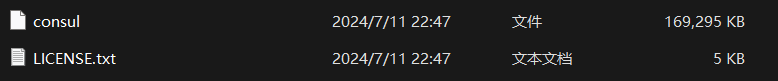

# Consul


<font color=skyblue>以下内容基于：https://cloud.spring.io/spring-cloud-consul/reference/html/#spring-cloud-consul-install</font>

<font color=skyblue>`Consul`和`Nacos`相较于其他的服务注册技术，它们并不集成到项目中，而是单独的一个项目，下载后开箱即用，降低了与项目之间的耦合度。</font>


## 一、`Consul`下载安装

### 1、`Windows`

- 下载地址

  https://developer.hashicorp.com/consul/install?product_intent=consul#windows

  

- 下载`Consul`

  |  |
  | ------------------------------------------------------------ |
  |  |
  |  |

  

- 验证`Consul`

  <font color=pink>在`consul.exe`所在的目录进入`cmd`命令行</font>

  ```cmd
  consul --version
  ```

  出现版本号代表`consul`与系统兼容可以使用

  |  |
  | ------------------------------------------------------------ |

  

- 启动`Consul`

  <font color=pink>在`consul.exe`所在的目录进入`cmd`命令行</font>

  ```cmd
  consul agent -dev -client=0.0.0.0
  ```

  等待启动完成

  <font color=pink>**`-client=0.0.0.0`代表其他任何地方均可以访问`Consul`**</font>

  

- 访问`Consul`

  启动完毕之后访问：http://localhost:8500/

  |  |
  | ------------------------------------------------------------ |


### 2、`Linux`

- 下载地址

  https://developer.hashicorp.com/consul/install?product_intent=consul#linux

  

- 安装`Consul`

  |  |
  | ------------------------------------------------------------ |
  |  |
  |  |

  

- 启动`Consul`

  [持久化启动 跳转链接]: #1、`Linux`

  

  <font color=pink>将下载解压出来的`Consul`文件赋值到`Linux`中的`/usr/local/bin/`目录下</font>

  - ```shell
    nohup consul agent -dev -client=0.0.0.0
    ```

    1. `nohup`：当前会话关闭后，使用 `nohup` 启动的进程仍会继续运行
    2. `-dev`：`consul`开发模式下启动不保存配置文件
    3. `-client=0.0.0.0`：其他任何地方均可访问，如果是`127.0.0.1`那么只有本机可以访问

  - ```shell
    nohup consul agent -dev -ui -node=consul-dev -client=0.0.0.0 > consul.log 2>&1 &
    ```

    1. `nohup`：当前会话关闭后，使用 `nohup` 启动的进程仍会继续运行
    2. `-dev`：`consul`开发模式下启动不保存配置文件
    3. `-client=0.0.0.0`：其他任何地方均可访问，如果是`127.0.0.1`那么只有本机可以访问
    4. `> consul.log`：将日志输出到当前文件夹下，如果想指定日志位置`> /home/consul/logs/consul.log`
    5. `2>&1`：`2`代表标准错误，`1`代表标准输出，`2>&1`的意思就是将错误信息也输出到标准输出里面，也就是`consul.log`里既存错误信息，也存正确信息。
    6. `&`：指令在后台执行

  

- 验证`Consul`

  访问：`http://linux服务器ip:8500`


## 二、`Consul`服务注册与发现

<font color=red>**服务注册**：服务主动向`consul`注册自己，`consul`则记录服务的名称，IP，端口等信息。</font>

<font color=red>**服务发现：**当服务与服务之间通信的时候，`consul`就会告诉`发起服务`存储在自己内部的`目标服务`的注册信息，帮助服务与服务之间的通信。</font>

### 1、`Consul`配置

- 依赖

  ```xml
  <!-- Consul依赖 -->
  <dependency>
      <groupId>org.springframework.cloud</groupId>
      <artifactId>spring-cloud-starter-consul-discovery</artifactId>
  </dependency>
  
  <!-- Actuator依赖 -->
  <dependency>
      <groupId>org.springframework.boot</groupId>
      <artifactId>spring-boot-starter-actuator</artifactId>
  </dependency>
  ```

  

  | 引入`Actuator`依赖的原因是`Consul`通过`Actuator`暴露出来的`health`端点来检测应用的存活情况。 |
  | ------------------------------------------------------------ |
  |  |

  

- 配置

  ```yaml
  Spring:
  	cloud:
  	    consul:
  	      # Consul端口
  	      port: 8500
  	      # Consul服务器ip地址
  	      host: 192.168.75.201
  	      discovery:
  	      	# 定义注册到Consul中的服务名（如果存在_会被转化成-）
  	        service-name: sys_order
  	        # 定义优先使用ip进行通信
  	        # 默认false,会使用主机名进行通信,比方说:http://LAPTOP-HIGR7LVE:8081/actuator/health
  	        prefer-ip-address: true
  ```

  

- 开启(可选)

  配置类添加`@EnableDiscoveryClient`注解


### 2、`Consul`应用

#### （1）接口硬编码问题

在引入微服务之前两个项目之间的接口调用往往使用过基本的`http`请求实现。

比方说现在存在两个项目`sys_shop`和`sys_order`，`sys_shop`项目运行过程中需要调用`sys_order`的`/order/userOrder/add`接口，那么此时`sys_shop`就需要发送`Http://order-ip:order-port/order/userOrder/add`的请求来访问`sys_order`的`/order/userOrder/add`接口。然而实际开发过程中`sys_order`项目的`ip`和`port`均可能会发生变化，变化之后再次请求就会出现错误。

使用`Consul`之后将`sys_shop`和`sys_order`的服务注册到其中，那么`sys_shop`和`sys_order`之间的通信就可以基于服务名，也就是说此时`sys_shop`可以通过请求`http://sys-prder/order/userOrder/add`来访问`/order/userOrder/add `接口。


<font color=pink>注意：使用`Consul`必须要是用负载均衡的方式发送请求，不然根据服务名无法找到对应的服务。</font>

- 一般方式请求

  ```java
  @Configuration
  public class BaseConfig {
      // 向容器中放入RestTemplate用于发送请求
      @Bean
      public RestTemplate restTemplate() {
          return new RestTemplate();
      }
  }
  ```

  ```java
  @Controller
  @Slf4j
  @RequestMapping("/shop/shopping")
  public class ShoppingController {
      // 服务注册后可使用服务名进行调用
      private static final String BASE_URL = "http://sys-order";
  
      @Resource
      private RestTemplate restTemplate;
  
      @PostMapping("/shop")
      @ResponseBody
      public BaseRespData<Void> shop(@Validated @RequestBody UserOderAddParam param) {
          BaseRespData result = restTemplate.postForEntity(
              StrUtil.concat(true,BASE_URL,"/order/userOrder/add"), 
              param, 
              BaseRespData.class).getBody();
          return ObjectUtil.isNotNull(result) && result.isSuccess() ? 
              BaseRespData.success() : BaseRespData.fail();
      }
  }
  ```

  | <font color=skyblue>出现未知主机的错误：也就是说如果是普通请求的话，那么就相当于认准了请求`http://sys-order`，只有使用负载均衡请求的时候`Consul`才会根据服务名选择对应的服务器进行执行。</font> |
  | ------------------------------------------------------------ |
  |  |

  

- 负载均衡方式请求

  ```java
  @Configuration
  public class BaseConfig {
      
      @Bean
      // 开启负载均衡的方式发送请求
      @LoadBalanced
      public RestTemplate restTemplate() {
          return new RestTemplate();
      }
  }
  ```


（2）


## 三、`Consul`服务配置和刷新

### 1、服务配置

- 依赖

  ```xml
  <dependency>
      <groupId>org.springframework.cloud</groupId>
      <artifactId>spring-cloud-starter-consul-config</artifactId>
  </dependency>
  
  <dependency>
      <groupId>org.springframework.cloud</groupId>
      <artifactId>spring-cloud-starter-bootstrap</artifactId>
  </dependency>
  ```

- `SpringBoot`配置

  ```yaml
  # bootstarp.yaml文件
  spring:
    cloud:
      consul:
        # consul服务器端口
        port: 8500
        # consul服务器ip
        host: 192.168.75.201
        discovery:
        	# consul注册的服务名
          service-name: ${spring.application.name}
          prefer-ip-address: true
        config:
        	# 使用远程配置文件的文件类型
          format: yaml
          # spring.application.name 和 spring.profiles.active之间的分隔符：默认是,
          profile-separator: '-'
    application:
      name: sys-order
  ```

  <font color=pink>注意：由于`bootstrap.yaml`的加载顺序在`application.yaml`之前，因此`spring.application.name`需要添加到`bootstrap.yaml`之中。</font>

  详见：

  [bootstrap.yaml和application.yaml的区别]: ../SpringCloud知识点.md#1、`bootstrap.yaml`和`application.yaml`的区别

  

- 远程配置

  1. 配置位置

     |  |
     | ------------------------------------------------------------ |

  2. 配置格式

     <font color=pink>`config/${spring.application.name}-${spring.profiles.active}/data`</font>

     | 官方配置格式                                                 |
     | ------------------------------------------------------------ |
     |  |

     其中：`config`和`${spring.application.name}-${spring.profiles.active}`均是文件夹，而`data`就是配置文件

     举例说：配置`config/sys-order-prod/data`意为生产环境下`sys-order`这个服务将使用该配置文件。如果是配置`config/sys-order/data`意为在不配置`spring.profiles.active`的情况下才会使用该配置文件。

     |  |
     | ------------------------------------------------------------ |

- 注册服务

  <font color=pink>配置类上添加`@EnableDiscoveryClient`注解，意为将当前服务注册至服务注册中心（`consul`等）。注意，这一步可能不是必须的对于高版本的可能自动开启服务注册，但是固定加上`@EnableDiscoveryClient`必定能够注册服务成功。</font>

  ```java
  @Configuration
  @EnableDiscoveryClient
  public class BaseConfig {
  }
  ```

  
  
- 测试

  ```java
  //测试类
  @Controller
  @RequestMapping("/test")
  public class TestController {
      @RequestMapping("/test1")
      @ResponseBody
      public String getConfigInfo(@Value("${application.version}") String version){
          return version;
      }
  }
  ```

  | 结果                                                         |
  | ------------------------------------------------------------ |
  |  |


### 2、配置刷新

- `@RefreshScope`：该注解标注的`bean`会在不重启应用的基础上更新并应用最新配置

  **该注解本身并不提供检测配置变化的功能，一般与其他远程配置中心技术组合使用用于在配置发生变化的时候，添加了该注解的`Bean`便会被销毁并重新创建，做到配置的刷新，因此会有一定的性能损耗。没有添加该注解的`Bean`便不会被销毁重建刷新配置。**

  **如果使用了`Spring Actuator`技术并且暴露了`refresh`端点，可以通过`/actuator/refresh`手动刷新配置。**

  ```java
  @Controller
  @RequestMapping("/test")
  
  @RefreshScope
  public class TestController {
      @RequestMapping("/test1")
      @ResponseBody
      public String getConfigInfo(@Value("${application.version}") String version){
          return version;
      }
  }
  ```

- `bootstrap.yaml`配置

  ```yaml
  spring:
    cloud:
      consul:
        port: 8500
        host: 192.168.75.201
        discovery:
          service-name: ${spring.application.name}
          prefer-ip-address: true
          enabled: true
        config:
          format: yaml
          profile-separator: '-'
          enabled: true
          watch:
            # 设置consul配置更新后的刷新等待时间单位是秒，默认55秒
            wait-time: 10
    application:
      name: sys-order
  ```


## 四、`Consul` 配置持久化

<font color=pink>**<u>默认情况下,`Consul`重启后之前所有的配置全部丢失。</u>**</font>

### 1、`Linux`

1. 创建配置持久化存储的文件夹

   ```shell
   mkdir /home/consul/data
   ```

2. 添加`Consul`配置文件

   位置：`/home/consul/config/consul-config.json`

   ```json
   {
     //配置持久化位置
     "data_dir": "/home/consul/data",
     "ui": true,
     "server": true,
     "bootstrap_expect": 1,
     //其他任何地方均可访问
     "bind_addr": "127.0.0.1",
     "client_addr": "0.0.0.0"
   }
   ```

3. 启动`Consul`

   ```shell
   nohup consul agent -config-file=/home/consul/config/consul-config.json > /home/consul/logs/consul.log 2>&1 &
   ```


### 2、`Windows`

详见：https://developer.aliyun.com/article/989639


## 五、其他

### 1、手动删除服务实例

- 查询服务实例ID

  ```shell
  curl http://192.168.68.201:8500/v1/catalog/service/sys-order
  ```

  |  |
  | ------------------------------------------------------------ |

- 删除服务实例

  ```shell
  curl -X PUT http://192.168.68.201:8500/v1/agent/service/deregister/sys-order-8083
  ```


