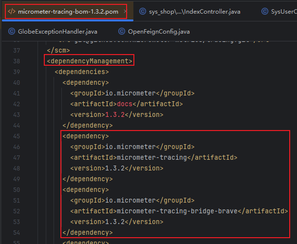
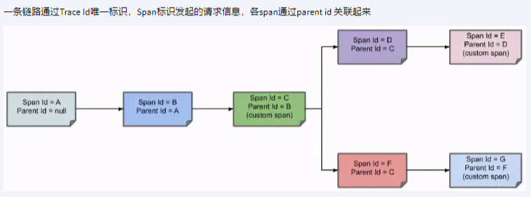
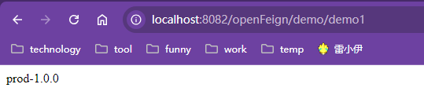
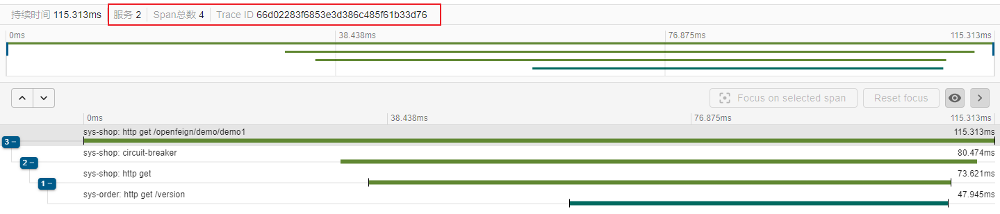
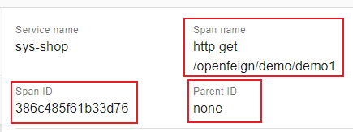
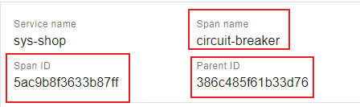

# Micrometer-Tracing


## 一、`Micrometer-Tracing`+`Zipkin`

<font color=red>**所有需要进行链路追踪的子服务均需要添加如下`Micrometer-Tracing`和`Zipkin`的配置，所有添加了配置的服务之间的调用记录都会被`Micrometer-Tracing`收集，最终由`Zipkin`展示。**</font>

### 1、`Zipkin`安装

详见`Zipkin.md`

[Zipkin安装笔记]: ./Zipkin.md

### 2、`SpringCloud`集成`Micrometer-Tracing`

- 父工程

  ```xml
  <dependencyManagement>
      <dependencies>
  		<dependency>
  		    <groupId>io.micrometer</groupId>
  		    <artifactId>micrometer-tracing-bom</artifactId>
  		    <version>1.3.2</version>
  		    <type>pom</type>
  		    <scope>import</scope>
  		</dependency>
  		<dependency>
  		    <groupId>io.github.openfeign</groupId>
  		    <artifactId>feign-micrometer</artifactId>
  		    <version>13.3</version>
  		</dependency>
  		<dependency>
  		    <groupId>io.micrometer</groupId>
  		    <artifactId>micrometer-observation</artifactId>
  		    <version>1.13.2</version>
  		</dependency>
  		<dependency>
  		    <groupId>io.zipkin.reporter2</groupId>
  		    <artifactId>zipkin-reporter-brave</artifactId>
  		    <version>3.4.0</version>
  		</dependency>
      </dependencies>
  </dependencyManagement>
  ```

  <font color=pink>其中的`micrometer-tracing-bom`主要用来做版本统一，并不是作为依赖引入的，通过查看`micrometer-tracing-bom`的`pom`文件可以发现，该项目没有引入任何依赖，仅仅有一个依赖声明，其中声明了多个依赖的版本。</font>

  

- 子工程

  ```xml
  <dependencies>
  	<dependency>
  	    <groupId>io.micrometer</groupId>
  	    <artifactId>micrometer-tracing</artifactId>
  	</dependency>
  	<dependency>
  	    <groupId>io.micrometer</groupId>
  	    <artifactId>micrometer-tracing-bridge-brave</artifactId>
  	</dependency>
  	<dependency>
  	    <groupId>io.micrometer</groupId>
  	    <artifactId>micrometer-observation</artifactId>
  	</dependency>
  	<dependency>
  	    <groupId>io.zipkin.reporter2</groupId>
  	    <artifactId>zipkin-reporter-brave</artifactId>
  	</dependency>
  	<dependency>
  	    <groupId>io.github.openfeign</groupId>
  	    <artifactId>feign-micrometer</artifactId>
  	</dependency>
  </dependencies>
  ```

  <hr/>

  

  由上述依赖配置可以发现子工程比父工程多出来的两个依赖

  ```xml
  <dependency>
      <groupId>io.micrometer</groupId>
      <artifactId>micrometer-tracing</artifactId>
  </dependency>
  <dependency>
      <groupId>io.micrometer</groupId>
      <artifactId>micrometer-tracing-bridge-brave</artifactId>
  </dependency>
  ```

  这两个依赖均是来自`micrometer-tracing-bom`，也就是用来同一版本的依赖，所以此时在子工程中引入父工程中没有声明的依赖的时候可以不声明版本，自动使用父工程`micrometer-tracing-bom`中定义的版本。

  ```xml
  <dependency>
      <groupId>io.micrometer</groupId>
      <artifactId>micrometer-tracing-bom</artifactId>
      <version>1.3.2</version>
      <type>pom</type>
      <scope>import</scope>
  </dependency>
  ```

  |  |
  | ------------------------------------------------------------ |


### 3、`SpringCloud`集成`Zipkin`

```yaml
management:
  zipkin:
    tracing:
      # Zipkin服务
      endpoint: http://192.168.68.201:9411/api/v2/spans
  tracing:
    sampling:
      # 采样比例：0.1意为10次服务间调用将会有1次被记录,1意为服务间的所有调用都会被记录
      probability: 1.0
```


## 二、`Micrometer-Tracing`链路追踪原理



用户完整请求的整个生命周期就是一个`trace`，每个`trace`都有唯一的一个`traceId`。`traceId`被本次`trace`中所有的`span`共享。

`span`就是请求过程中一个个小任务，微服务之间的一次请求可能涉及多个服务器，每个服务上可能执行多个`span`任务，比如说发起一个`http`请求就可以看作是一个`Span`，查询一次数据库也是可以看作是一个`Span`。

每个`Span`含有两个重要的信息：`spanId`和`parentId`。`spanId`用来唯一标识该任务，而`parentId`则用来记录处理本次`span`之前的一次`span`任务，这样就可以将多个`span`关联起来形成一个`trace`，原理类似数据结构里的链表。

> 案例演示

完成一次服务间的调用，如下：

|  |
| ------------------------------------------------------------ |

本次请求的`traceId`为`66d02283f6853e3d386c485f61b33d76`，涉及了两个服务调用`sys-order`和`sys-shop`，并且生成了`span`数量为4的链路调用。

|  |
| ------------------------------------------------------------ |

对于起点`span`只有自己的`spanId`没有`parentId`

|  |
| ------------------------------------------------------------ |

对于非起点的`span`它既有自己的`spanId`也有`parentId`

|  |
| ------------------------------------------------------------ |

