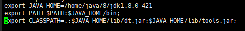
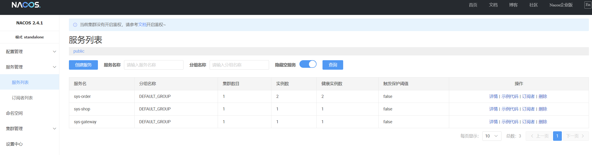
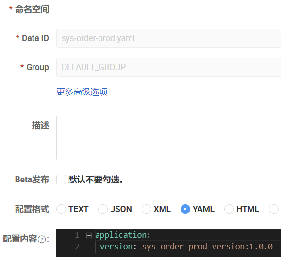
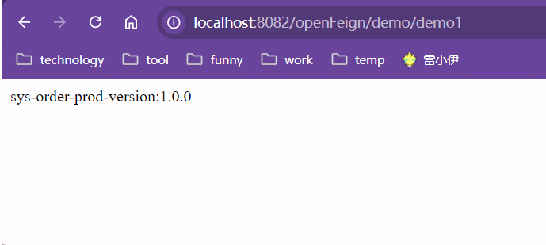
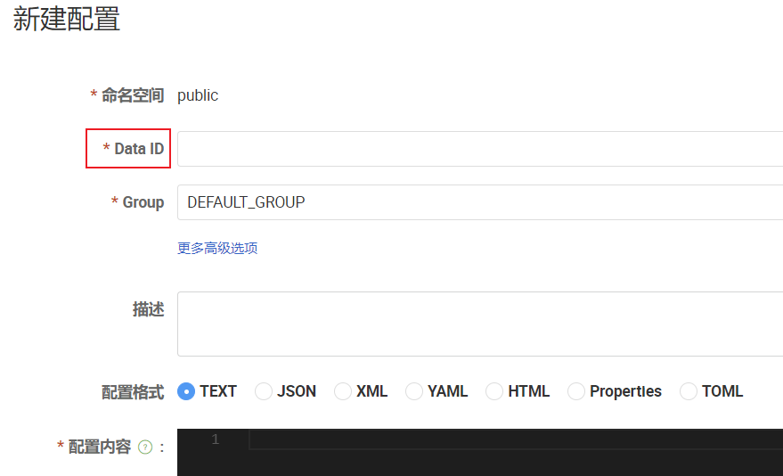
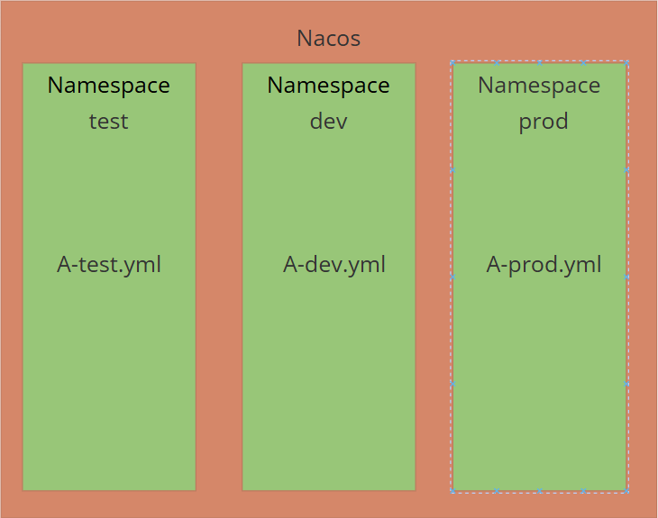
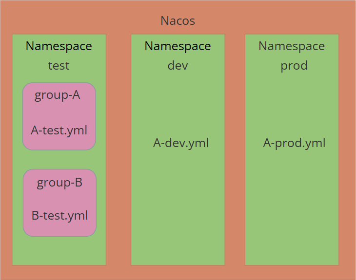
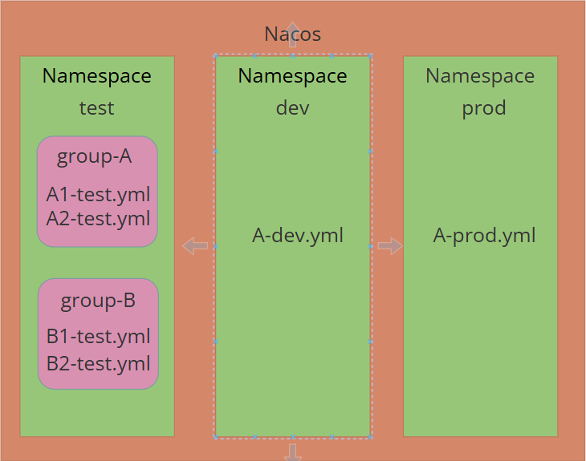

# Nacos


## 一、`Nacos`下载安装

文档：[Nacos使用文档](https://nacos.io/zh-cn/docs/quick-start-spring-cloud.html)

安装：[Nacos官网](https://nacos.io/docs/latest/quickstart/quick-start/)

| `Jdk`版本       | `jdk1.8.0_421` |
| --------------- | -------------- |
| **`Nacos`版本** | **`2.4.1`**    |


### 1、`Linux`

1. 下载安装包

   下载地址：https://nacos.io/download/nacos-server/

   

2. 解压安装包

   ```shell
   tar -xzvf /home/nacos/nacos-server-2.4.1.tar.gz -C /home/nacos
   ```

   

3. 安装`Java`环境（`jdk1.8.0_421`）

   详见`Java安装.md`，链接如下

   [Java安装笔记]: ../../../../back/java/Java安装.md

   <font color=red>注意：如果`linux`中存在多个版本的`JDK`，那么环境变量`/etc/profile`中要修改成当前版本的`JDK`。</font>

   |  |
   | ------------------------------------------------------------ |

   

4. 启动`Nacos`服务器

   ```shell
   # 单机启动：standalone
   sh startup.sh -m standalone
   ```

   

5. 查询日志

   日志存放位置：`${nacos.home}/logs/start.out`

   

6. `Nacos`控制台

   访问：http://127.0.0.1:8848/nacos

   <font color=pink>`Nacos`默认端口`8848`，默认的用户名和密码`nacos/nacos`。</font>


### 2、`Windows`

详见官网：https://nacos.io/docs/latest/quickstart/quick-start/


## 二、`Nacos`注册中心

### 1、依赖

- 父项目

  ```xml
  <!-- spring-cloud依赖 -->
  <dependency>
      <groupId>org.springframework.cloud</groupId>
      <artifactId>spring-cloud-dependencies</artifactId>
      <version>2023.0.3</version>
      <type>pom</type>
      <scope>import</scope>
  </dependency>
  
  <!--spring-cloud-alibaba依赖-->
  <dependency>
      <groupId>com.alibaba.cloud</groupId>
      <artifactId>spring-cloud-alibaba-dependencies</artifactId>
      <version>2023.0.1.2</version>
      <type>pom</type>
      <scope>import</scope>
  </dependency>
  ```

- 子项目

  ```xml
  <!-- consul 注册中心依赖 -->
  <dependency>
      <groupId>org.springframework.cloud</groupId>
      <artifactId>spring-cloud-starter-consul-discovery</artifactId>
  </dependency>
  ```


### 2、`Yaml`配置

- 注解

  配置类添加：`@EnableDiscoveryClient`开启服务注册发现

- 配置文件

  ```yaml
  spring:
    cloud:
      nacos:
        discovery:
          enabled: true
          server-addr: 192.168.68.201:8848
  ```


### 3、测试结果

|  |
| ------------------------------------------------------------ |


## 三、`Nacos`配置中心

### 1、依赖

- 父项目

  ```xml
  <!-- spring-cloud依赖 -->
  <dependency>
      <groupId>org.springframework.cloud</groupId>
      <artifactId>spring-cloud-dependencies</artifactId>
      <version>2023.0.3</version>
      <type>pom</type>
      <scope>import</scope>
  </dependency>
  
  <!--spring-cloud-alibaba依赖-->
  <dependency>
      <groupId>com.alibaba.cloud</groupId>
      <artifactId>spring-cloud-alibaba-dependencies</artifactId>
      <version>2023.0.1.2</version>
      <type>pom</type>
      <scope>import</scope>
  </dependency>
  ```

- 子项目

  ```xml
  <!-- nacos配置中心依赖 -->
  <dependency>
      <groupId>com.alibaba.cloud</groupId>
      <artifactId>spring-cloud-starter-alibaba-nacos-config</artifactId>
  </dependency>
  <!-- Bootstrap依赖 -->
  <dependency>
      <groupId>org.springframework.boot</groupId>
      <artifactId>spring-boot-starter-aop</artifactId>
  </dependency>
  ```

  <font color=pink>**分布式配置中心的配置需要放在`bootstrap.yml`文件中，以便能够优先加载，提前获取远程配置中心中的配置信息，用于程序启动。**</font>


### 2、`Yaml`配置

```yaml
spring:
  cloud:
    nacos:
      # 注册中心配置
      discovery:
        server-addr: 192.168.75.201:8848
        enabled: true
      # 配置中心配置
      config:
      	enabled: true
        server-addr: 192.168.75.201:8848
        file-extension: yaml
```


### 3、远程配置

`Data Id`命名详见`Data Id`

[Data Id]: #1、Data-Id

- 创建`sys-order-dev.yaml`

  |  |
  | ------------------------------------------------------------ |

- 创建`sys-order-prod.yaml`

  |  |
  | ------------------------------------------------------------ |


### 4、测试结果

|  |
| ------------------------------------------------------------ |

<font color=pink>**如果想实现远程配置的即时刷新，那么对应的`Bean`上需要添加`@RefreshScope`。只要某个注册到容器的`Bean`上添加了该注解，那么当远程配置变更的时候，`Bean`就会被销毁重建，实现配置的即时刷新。**</font>


## 四、`Nacos`高级特性

### 1、`DataId`命名问题

| 在`nacos`配置中心添加远程配置的时候可以发现需要填写一个`Data ID`的选项，其主要作用就是用来决定使用哪个远程配置文件。 |
| ------------------------------------------------------------ |
|  |


<font color=pink>**`Data Id`的命名规则为`${prefix}-${spring.profiles.active}.${file-extension}`，其中`${prefix}`默认为`${spring.application.name}`，也可通过`nacos`中的`spring.cloud.nacos.config.prefix`来特殊指定。如果没有配置`${spring.profiles.active}`，那么`-`也不会存在。**</font>

<font color=pink>由此可见，`Data Id`本质上就是一个存放在远程配置中心的配置文件的文件名。</font>

```yaml
# `${prefix}`默认为`${spring.application.name}`
spring:
  application:
    name: sys-shop
```

```yaml
# `${prefix}`特殊指定为`spring.cloud.nacos.config.prefix`
spring:
  cloud:
    nacos:
      config:
        prefix: filePrefix
```

```yaml
# `${spring.profiles.active}`
spring:
  profiles:
    active: dev
```

```yaml
# `${file-extension}`就是远程配置文件的文件后缀
spring:
  cloud:
    nacos:
      config:
        file-extension: yaml
```


### 2、三元组

#### 2.1 三元组概念

<font color=red>**`namespace + group + dataId`就是`nacos`的命名三元组，`nacos`通过`namespace + group + dataId`唯一确定一个`工程/模块`的配置文件。**</font>

- `namespace`：主要用于对不同环境的配置文件进行分组，比方说测试`test`，开发`dev`，生产`prod`等环境，使用`namespace`可以将不同环境下的配置文件隔离开来。比方说存在一个A项目，那么就可以将A项目的不同环境的配置文件`A-dev.yaml`，`A-test.yaml`，`A-prod.yaml`分别放在不同的`namespace`下进行隔离。

  <font color=pink>默认`namespace`为`public`，默认`namespace-id`为空字符串，配置文件中使用的是命名空间ID，而不是命名空间名。</font>

  |  |
  | ------------------------------------------------------------ |

- `group`：`group`用于在同一`namespace` 下，不同项目的分组。比方说现在存在A和B两个项目，那它们在同一命名空间下就可以分成`group-A`和`Group-B`。

  <font color=pink>默认的`Group`为`DEFUALT_GROUP`，分组名自定义，配置文件中使用的就是分组名。</font>

  |  |
  | ------------------------------------------------------------ |

- `Data ID`：一个项目可能有多个子模块，每个子模块又是一个单独的微服务，`Data ID`用于在一个项目下区分不同子微服务的配置文件

  |  |
  | ------------------------------------------------------------ |

  

#### 2.2 三元组使用

```yaml
spring:
  cloud:
    nacos:
      ### nacos注册中心
      discovery:
        server-addr: 192.168.75.201:8848
        enabled: true
        # 命名空间：命名空间ID，默认空字符串。将服务注册到不同的命名空间
        namespace: 
      ### nacos配置中心
      config:
        server-addr: 192.168.75.201:8848
        file-extension: yaml
        enabled: true
        # DataId前缀
        prefix: ${spring.application.name}
        # 分组：组名，默认DEFAULT_GROUP
        group: DEFAULT_GROUP
        # 命名空间：命名空间ID，默认空字符串
        namespace:
```

