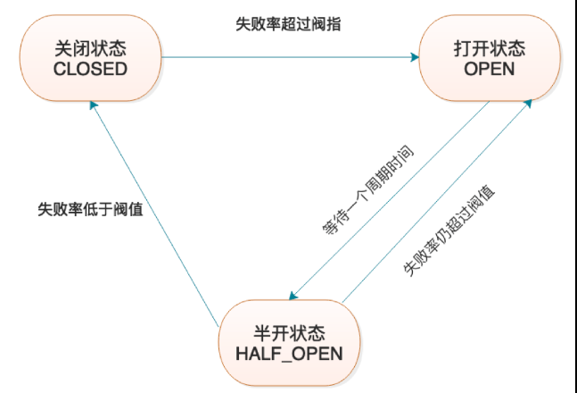
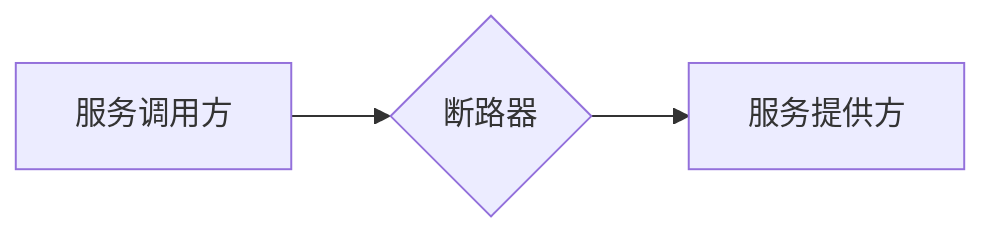
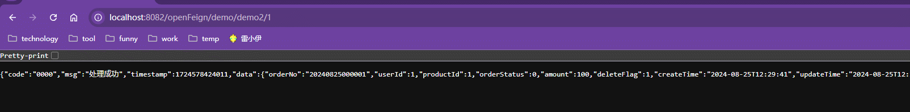

# Resilience4j


## 一、`Resilience4j-CircuitBreaker`

<font color=red>**`CircuitBreak`断路器定义的是一套规范，它有两个具体的实现`Resilience4j`和`Spring Retry`，以`Resilience4j`为主。`CircuitBreak`的主要作用是当下游服务器出现过多异常时可以断开与下游服务器的连接，待其恢复之后重新连接。**</font>

### 1、断路器状态

| 原理图<font color=skyblue> （类似保险丝的作用）</font>       |
| ------------------------------------------------------------ |
|  |




1. `close`<font color=red>（重要）</font>

   默认断路器是处于`close`状态的，也就是说此时`服务调用方`的所有请求都会通过断路器到达`服务提供方`

2. `open`<font color=red>（重要）</font>

   当请求的失败率达到设定的阈值时，断路器就会处于`open`状态，此时所有的请求都会被拦截。

3. `half_open`<font color=red>（重要）</font>

   当断路器处于`open`状态时，等待一段时间后，就会自动处于`half_open`状态，此时断路器会放过少量的请求，如果这些请求能够被处理并且不会到达失败阈值，那么断路器就会重新处于`close`状态，否则仍会处于`open`状态。

   断路器之所以要等待一段时间才会转变成`half_open`状态，是因为需要给`服务提供方`恢复的时间。

4. `disabled`<font color=pink>（次要）</font>

   断路器始终关闭，即不论失败次数是否达到阈值，均会通过所有请求。

5. `force_open`<font color=pink>（次要）</font>

   断路器始终打开，所有请求均会被拦截。


### 2、断路器滑动窗口

滑动窗口就是统计服务调用结果的统计维度。`resilence4j`存在两个统计维度：

1. 次数统计`COUNT_BASED`：统计最近n次调用的失败率
2. 时间统计`TIME_BASED`：统计最近n秒内的调用失败率


### 3、熔断降级

<font color=red>**<u>断路器放在请求方，由请求方控制是否与服务提供方断开连接。</u>**</font>

#### （1）`COUNT_BASED`

- 依赖

  ```xml
  <!-- resilience4j依赖 -->
  <dependency>
      <groupId>org.springframework.cloud</groupId>
      <artifactId>spring-cloud-starter-circuitbreaker-resilience4j</artifactId>
  </dependency>
  <dependency>
      <groupId>org.springframework.boot</groupId>
      <artifactId>spring-boot-starter-aop</artifactId>
  </dependency>
  ```

  <font color=pink>`Resilience4j`依赖于`Spring Aop` 因此也需要引入`Spring Aop`依赖。</font>

  

- 配置文件

  ```yaml
  spring:
    cloud:
      openfeign:
        circuitbreaker:
          # 开启断路器
          enabled: true
          group:
            enabled: true
  ```

  ```yaml
  resilience4j:
    circuitbreaker:
      configs:
        default:
          # 定义断路器从 close->open 失败调用的阈值比例
          # 50:当调用的失败占总调用的50%时断路器会从 close->open
          failure-rate-threshold: 50
          # 滑动窗口类型
          # COUNT_BASED:按次数统计 | TIME_BASED:按时间统计
          sliding-window-type: COUNT_BASED
          # 滑动窗口大小
          # 6:统计最近6次调用的失败率
          sliding-window-size: 6
          # 开启open自动过渡到half_open
          automatic-transition-from-open-to-half-open-enabled: true
          # half_open状态下尝试恢复close放过的请求数量
          permitted-number-of-calls-in-half-open-state: 4
          # 断路后等待服务方恢复的时间,只有在服务提供方恢复之后断路器才会恢复至close
          wait-duration-in-open-state: 5s
          # 计算失败率至少有多少次调用才生效
          minimum-number-of-calls: 6
          # 指定出现了哪些异常才会被计入失败率中
          record-exceptions:
            - java.lang.Exception
      instances:
        order-instance:
          base-config: default
  ```

  1. <font color=pink>`resilience4j.circuitbreaker.configs`：用于定义配置模板，可以定义多个配置模板（模板名字随意）。上述配置定义的是默认模板`default`，覆盖了`Resilience5j`的`default`模板。</font>

  2. <font color=pink>`resilience4j.circuitbreaker.instances`：用于定义断路器实例。上述配置意为定义了名为`order-instance`的断路器实例，该断路器使用默认配置模板`default`。</font>

     <font color=skyblue>断路器实例完全就可以理解成保险丝，定义了一个断路器实例相当于买了一根保险丝，当使用断路器实例的时候就相当于在两个服务之间添加了一个保险丝，当下游服务出现故障的时候可以被上游服务器断开，等到下游服务器恢复之后便会重新连接。</font>

  

- 降级方法

  ```java
  @Controller
  @RequestMapping("/openFeign/demo")
  public class OpenFeignController {
      
      @Resource
      private OrderUserOrderApi orderUserOrderApi;
  
      /**
      * 通过Feign客户端orderUserOrderApi调用`sys-order`根据订单id获取订单信息
      */
      @GetMapping("/demo2/{id}")
      @CircuitBreaker(name = "order-instance", fallbackMethod = "demo2Fallback")
      @ResponseBody
      public BaseRespData<UserOrderEntity> demo2(@PathVariable(name = "id") Long id) {
          BaseReqParam param = new BaseReqParam(id);
          return orderUserOrderApi.getById(param);
      }
  
      // 降级方法
      private BaseRespData<String> demo2Fallback(Throwable e) {
          return BaseRespData.fail("系统繁忙,请稍后重试~");
      }
  }
  ```

  <font color=pink>注意：如果存在全局异常处理那么需要在全局异常处理上添加`@ResponseStatus(HttpStatus.INTERNAL_SERVER_ERROR)`</font>

  ```java
  // 全局异常处理类
  @Slf4j
  @RestControllerAdvice
  public class GlobeExceptionHandler {
      @ExceptionHandler({Exception.class})
      @ResponseStatus(HttpStatus.INTERNAL_SERVER_ERROR)
      public BaseRespData<Void> exceptionHandler(Exception e) {
          log.error("全局系统异常:{},", e.getMessage(), e);
          return BaseRespData.fail("系统异常");
      }
  }
  ```


> 演示结果

<u>注意时间戳的变化，时间戳每变一次代表一次请求。</u>

上述请求方法的作用：当输入`http://localhost:8082/openFeign/demo/demo2/0`也就是`id=0`会报错，输入`http://localhost:8082/openFeign/demo/demo2/1`则正常显示`id=1`的数据。

| 对错错错错对             |
| ------------------------ |
|  |

由此可知当`http://localhost:8082/openFeign/demo/demo2/0`的多次异常导致断路器达到断路阈值时断路器就会处于`open`状态，此时即便原来正常的`http://localhost:8082/openFeign/demo/demo2/1`也会收到影响变成`系统繁忙,请稍后重试~`，此时代表与下游服务提供方服务器完全断开，走降级方法。


#### （2）`TIME_BASED`

略：推荐使用`COUNT_BASED`


#### （3）核心注解:`@CircuitBreaker`

<font color=pink>**`@CircuitBreaker`添加到`controller`的`hanlder`方法上，意为该`handler`方法受`Resilience4j`断路器的保护。**</font>

常用属性：

1. `name`：断路器实例名

   <font color=pink>指定使用哪个断路器实例(保险丝)保护`handler`方法</font>

   断路器实例配置在配置文件中`resilience4j.circuitbreaker.instances`，其中可以定义断路器以及断路器使用哪个配置模板。

2. `fallbackMethod`：降级方法名

   <font color=pink>当断路器处于`open`状态或者`handler`方法中异常没有被处理时，降级方法才会被调用。</font>

   - 注意降级方法中的方法名只能填写同类中的方法。
   - 如果同类中含有多个同名方法，那么优先使用参数列表一致的方法。
   - 降级方法中可以获取原`handler`方法中的所有参数，并且还额外接收一个`Throwable`类型的参数，该参数就是方法中发生的异常


## 二、`Resilience4j-BulkHead`

<font color=red>`Resilience4j-BulkHead`的主要作用是限制下游服务器接收上游服务器请求的并发数量，避免上游服务器发送过多的请求导致下游服务器崩溃，保证下游服务器并发量的稳定。</font>

### 1、信号量舱壁

#### （1）原理

<font color=pink>**当上游服务器请求下游服务器，而上游服务器设定的下游服务器的并发处理量不足以处理本次请求，那么请求就会陷入阻塞状态，直到下游服务器有空闲的线程来处理。陷入阻塞的请求并不会一直等待下去，当达到设定时间之后仍未被处理那么就不会继续等待，直接进入降级方法返回结果。**</font>

#### （2）使用（<font color=red>未成功</font>）

- 依赖

  ```xml
  <!-- resilience4j-bulkhead依赖 -->
  <dependency>
      <groupId>io.github.resilience4j</groupId>  
      <artifactId>resilience4j-bulkhead</artifactId>  
  </dependency>
  ```

- 配置文件

  ```yaml
  resilience4j:
    bulkhead:
      configs:
        default:
          # 下游服务器最大的并发量
          max-concurrent-calls: 3
          # 陷入阻塞请求的等待时间
          max-wait-duration: 1s
      instances:
        order-bulkhead-instance:
          base-config: default
  ```

- 控制层`Controller`

  ```java
  @Controller
  @RequestMapping("/openFeign/demo")
  @Slf4j
  public class OpenFeignController {
      @Resource
      private OrderUserOrderApi orderUserOrderApi;
  
      @GetMapping("/demo3/{id}")
      @Bulkhead(name = "order-bulkhead-instance", 
                fallbackMethod = "demo3Fallback", 
                type = Bulkhead.Type.SEMAPHORE)
      @ResponseBody
      public BaseRespData<UserOrderEntity> demo3(@PathVariable(name = "id") Long id) {
          BaseReqParam param = new BaseReqParam(id);
          return orderUserOrderApi.getById(param);
      }
      private BaseRespData<String> demo3Fallback(Long id, Throwable e) {
          return BaseRespData.fail("系统繁忙,请稍后重试~");
      }
  }
  ```

- 测试结果

#### （3）核心注解`@Bulkhead`

- `name`：配置文件配置的`bulkhead`实例
- `fallbackMethod`：降级方法
- `type`：`Bulkhead.Type.SEMAPHORE`基于信息量隔离限流，`Bulkhead.Type.THREADPOOL`基于线程池隔离限流


### 2、线程池舱壁


## 三、

