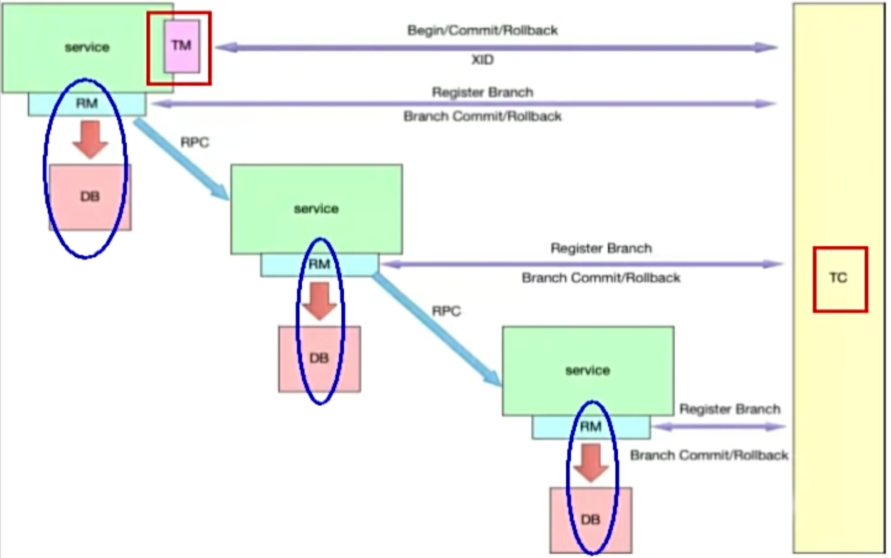
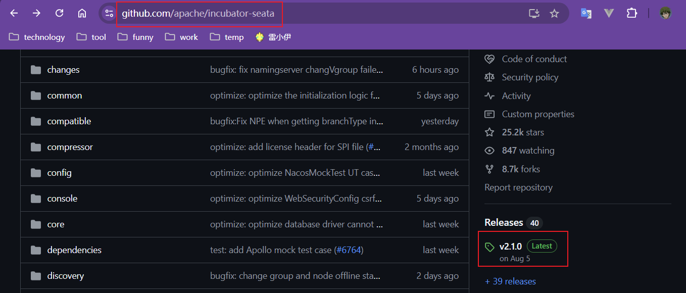
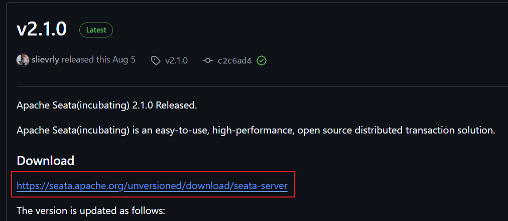
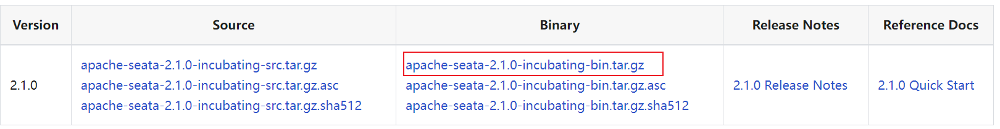
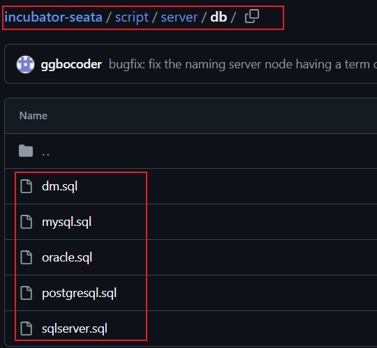
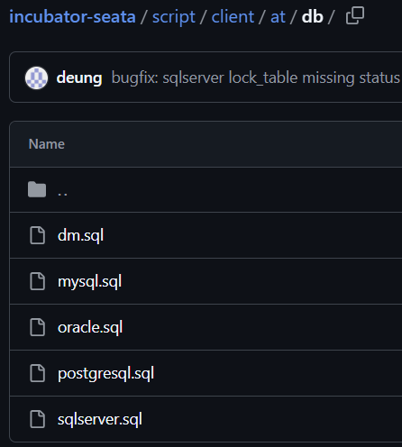
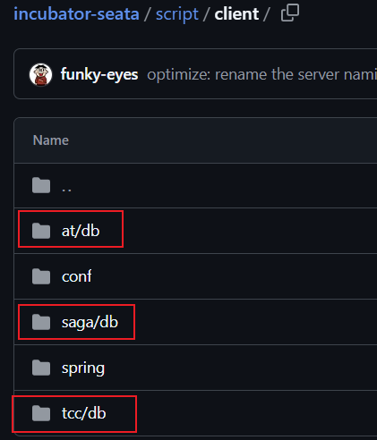
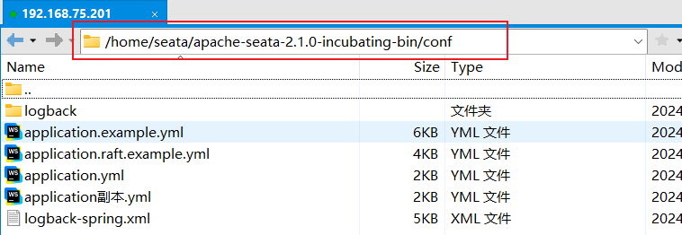
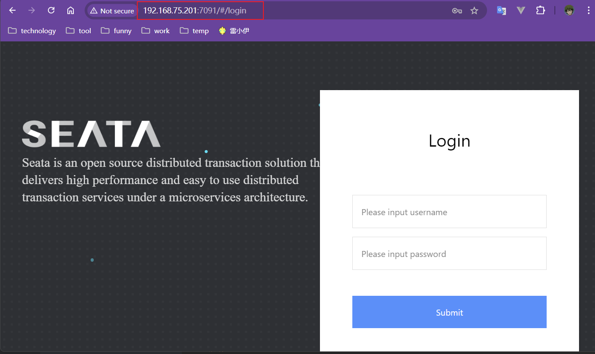

# Seata


[<font color=pink>Seata参考文档</font>](https://seata.apache.org/zh-cn/docs/user/quickstart/)

[<font color=pink>Seata Github 源码</font>](https://github.com/apache/incubator-seata)


## 一、`Seata`概念

### 1、`Seata`使用场景

传统的`@Transactional`注解适用于单个服务的事务管理，而`@GlobalTransactinal`注解适用于多个服务之间的事务管理。

<font color=red>**重点：不论是多个服务连接同一个数据库还是多个服务连接多个数据库，只要是跨服务的调用链路，想要进行开启事务管理那么必须使用分布式事务(`Seata`)。而如果服务调用链路仅仅在本服务之内，那么只需要使用传统的事务管理即可。**</font>


### 2、`TC`,`TM`,`RM`

| `TC`,`TM`,`RM`三者图解                                       |
| ------------------------------------------------------------ |
|  |
|  |


#### 2.1`TC`

<font color=pink>`TC`(`Transaction Coordinator`)：事务协调器，本质上指的就是`Seata`，其主要负责驱动全局事务的提交和回滚（控制全局事务）。</font>

#### 2.2`TM`

<font color=pink>`TM`(`Transaction Manager`)：事务管理器，就是事务的发起方，也就是添加了`@GlobalTransactinal`注解的模块。添加了`@GlobalTransactinal`注解代表从此处开始开启了一个分布式事务管理，之后不论开启了多少个分支事务，分支事务之间使用同一个`XID`被一个分布式事务管理。</font>

#### 2.3`RM`

<font color=pink>`RM`(`Reource Manager`)：资源管理器，就是数据库本身，其主要负责驱动分支事务的提交和回滚（控制分支事务）。</font>


## 二、`Seata`安装

### 1、`Seata`下载

通过`Seata github`下载`Seata`

[下载链接](https://github.com/apache/incubator-seata)

|  |
| ------------------------------------------------------------ |
|  |
|  |


上传`Linux`服务器并解压

```shell
# 解压指令
tar -xzvf /home/seata/apache-seata-2.1.0-incubating-bin.tar.gz -C /home/seata
```


### 2、`Seata`数据库

#### 2.1`Seata`服务端脚本

`Seata`本身是一个`SpringBoot`项目，需要连接数据库记录事务信息。

数据库的脚本文件可以从`Seata github`项目的`script/server/db`路径下找到（即该`SQL`脚本是`Seata`服务器端的脚本），选择对应数据库的脚本文件创建`Seata`服务启动所需要的表。

|  |
| ------------------------------------------------------------ |

在`Seata`服务连接的数据库中执行以下脚本：

```sql
-- -------------------------------- The script used when storeMode is 'db' --------------------------------
-- the table to store GlobalSession data
CREATE TABLE global_table
(
    xid                       VARCHAR2(128) NOT NULL,
    transaction_id            NUMBER(19),
    status                    NUMBER(3)     NOT NULL,
    application_id            VARCHAR2(32),
    transaction_service_group VARCHAR2(32),
    transaction_name          VARCHAR2(128),
    timeout                   NUMBER(10),
    begin_time                NUMBER(19),
    application_data          VARCHAR2(2000),
    gmt_create                TIMESTAMP(0),
    gmt_modified              TIMESTAMP(0),
    PRIMARY KEY (xid)
);

CREATE INDEX idx_status_gmt_modified ON global_table (status, gmt_modified);
CREATE INDEX idx_transaction_id ON global_table (transaction_id);

-- the table to store BranchSession data
CREATE TABLE branch_table
(
    branch_id         NUMBER(19)    NOT NULL,
    xid               VARCHAR2(128) NOT NULL,
    transaction_id    NUMBER(19),
    resource_group_id VARCHAR2(32),
    resource_id       VARCHAR2(256),
    branch_type       VARCHAR2(8),
    status            NUMBER(3),
    client_id         VARCHAR2(64),
    application_data  VARCHAR2(2000),
    gmt_create        TIMESTAMP(6),
    gmt_modified      TIMESTAMP(6),
    PRIMARY KEY (branch_id)
);

CREATE INDEX idx_xid ON branch_table (xid);

-- the table to store lock data
CREATE TABLE lock_table
(
    row_key        VARCHAR2(128) NOT NULL,
    xid            VARCHAR2(128),
    transaction_id NUMBER(19),
    branch_id      NUMBER(19)    NOT NULL,
    resource_id    VARCHAR2(256),
    table_name     VARCHAR2(32),
    pk             VARCHAR2(36),
    status         NUMBER(3)   DEFAULT 0 NOT NULL,
    gmt_create     TIMESTAMP(0),
    gmt_modified   TIMESTAMP(0),
    PRIMARY KEY (row_key)
);

comment on column lock_table.status is '0:locked ,1:rollbacking';
CREATE INDEX idx_branch_id ON lock_table (branch_id);
CREATE INDEX idx_lock_table_xid ON lock_table (xid);
CREATE INDEX idx_status ON lock_table (status);

CREATE TABLE distributed_lock (
    lock_key     VARCHAR2(20)  NOT NULL,
    lock_value        VARCHAR2(20)  NOT NULL,
    expire       DECIMAL(18)   NOT NULL,
    PRIMARY KEY (lock_key)
);

INSERT INTO distributed_lock (lock_key, lock_value, expire) VALUES ('AsyncCommitting', ' ', 0);
INSERT INTO distributed_lock (lock_key, lock_value, expire) VALUES ('RetryCommitting', ' ', 0);
INSERT INTO distributed_lock (lock_key, lock_value, expire) VALUES ('RetryRollbacking', ' ', 0);
INSERT INTO distributed_lock (lock_key, lock_value, expire) VALUES ('TxTimeoutCheck', ' ', 0);
```


#### 2.1`Seata`客户端脚本

<font color=pink>客户端即连接到`Seata`服务的业务微服务。</font>

- `TA`模式：`script/client/at/db`

  |  |
  | ------------------------------------------------------------ |

  所有连接到`Seata`的微服务都需要执行以下脚本：

  ```sql
  # Oracle版
  CREATE TABLE undo_log
  (
      id            NUMBER(19)    NOT NULL,
      branch_id     NUMBER(19)    NOT NULL,
      xid           VARCHAR2(128) NOT NULL,
      context       VARCHAR2(128) NOT NULL,
      rollback_info BLOB          NOT NULL,
      log_status    NUMBER(10)    NOT NULL,
      log_created   TIMESTAMP(0)  NOT NULL,
      log_modified  TIMESTAMP(0)  NOT NULL,
      PRIMARY KEY (id),
      CONSTRAINT ux_undo_log UNIQUE (xid, branch_id)
  );
  CREATE INDEX ix_log_created ON undo_log(log_created);
  COMMENT ON TABLE undo_log IS 'AT transaction mode undo table';
  COMMENT ON COLUMN undo_log.branch_id is 'branch transaction id';
  COMMENT ON COLUMN undo_log.xid is 'global transaction id';
  COMMENT ON COLUMN undo_log.context is 'undo_log context,such as serialization';
  COMMENT ON COLUMN undo_log.rollback_info is 'rollback info';
  COMMENT ON COLUMN undo_log.log_status is '0:normal status,1:defense status';
  COMMENT ON COLUMN undo_log.log_created is 'create datetime';
  COMMENT ON COLUMN undo_log.log_modified is 'modify datetime';
  
  CREATE SEQUENCE UNDO_LOG_SEQ START WITH 1 INCREMENT BY 1;
  ```

  

- 其他模式详见`script/client`

  |  |
  | ------------------------------------------------------------ |


### 3、`Seata`配置

在步骤1中解压后的`seata`中的`conf`文件夹下修改配置信息。

|  |
| ------------------------------------------------------------ |

其中`application.yml`为`Seata`的原始配置，也是项目启动读取的配置文件，建议备份一下原始配置为`application副本.yml`。

`application.example.yml`中的配置是配置案例，用于根据实际情况修改`application.yml`文件。

修改后的配置如下：

```yaml
# 启动Seata服务的端口
server:
  port: 7091

# Seata服务的端口的应用名
spring:
  application:
    name: seata-server

# Seata服务的日志配置（默认即可）
logging:
  config: classpath:logback-spring.xml
  file:
    path: ${log.home:${user.home}/logs/seata}
  extend:
    logstash-appender:
      destination: 127.0.0.1:4560
    kafka-appender:
      bootstrap-servers: 127.0.0.1:9092
      topic: logback_to_logstash

# Seata控制台的用户名和密码
console:
  user:
    username: seata
    password: seata

seata:
  # seata的配置中心
  # 以下使用nacos作为配置中心。application.example.yaml中还有其他类型的配置中心的使用可参考。
  config:
  	# 指定配置中心类型
    type: nacos
    nacos:
      server-addr: 127.0.0.1:8848
      namespace:
      group: SEATA_GROUP
      username: nacos
      password: nacos
      data-id: seataServer.properties
  # Seata的注册中心
  # 以下使用nacos作为注册中心。application.example.yaml中还有其他类型的注册中心的使用可参考。
  registry:
  	# 指定注册中心类型
    type: nacos
    nacos:
      application: seata-server
      server-addr: 127.0.0.1:8848
      group: SEATA_GROUP
      namespace:
      cluster: default
      username: nacos
      password: nacos
  # Seata事务信息的存储位置（即第2步中准备的数据库）
  store:
  	# 指定存储方式
    mode: db
    db:
      datasource: druid
      db-type: oracle
      driver-class-name: oracle.jdbc.OracleDriver
      url: jdbc:oracle:thin:@127.0.0.1:1521:helowin
      username: db_sc
      password: 7539515
      min-conn: 10
      max-conn: 100
      # 以下四个表就是第2步中SQL脚本创建的表
      global-table: global_table
      branch-table: branch_table
      lock-table: lock_table
      distributed-lock-table: distributed_lock
      query-limit: 1000
      max-wait: 5000
  # 默认即可
  security:
    secretKey: SeataSecretKey0c382ef121d778043159209298fd40bf3850a017
    tokenValidityInMilliseconds: 1800000
    ignore:
      urls: /,/**/*.css,/**/*.js,/**/*.html,/**/*.map,/**/*.svg,/**/*.png,/**/*.jpeg,/**/*.ico,/api/v1/auth/login,/version.json,/health,/error
```


### 4、`Seata`启动

```shell
# 进入/bin目录
cd /home/seata/apache-seata-2.1.0-incubating-bin/bin

# 启动Seata
sh seata-server.sh
```

访问`http://192.168.75.201:7091/`，默认配置的账号密码为`seata/seata`。

|  |
| ------------------------------------------------------------ |


## 三、`Seata`集成

### 1、依赖

```xml
<!-- Seata依赖 -->
<dependency>
    <groupId>com.alibaba.cloud</groupId>
    <artifactId>spring-cloud-starter-alibaba-seata</artifactId>
</dependency>
```


### 2、配置

```yaml
seata:
  registry:
    type: nacos
    nacos:
      namespace:
      group: SEATA_GROUP
      application: seataServer.properties
  tx-service-group: default_tx_group
  service:
    vgroup-mapping:
      default_tx_group: default
```


### 3、`@GlobalTransactional`

`@GlobalTransactional`用于开启全局事务。
