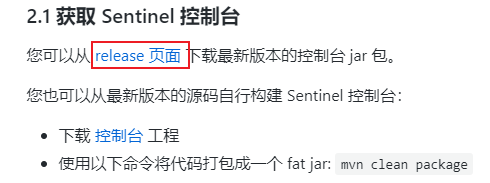
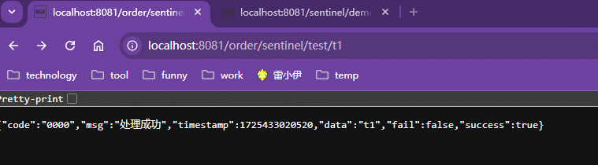
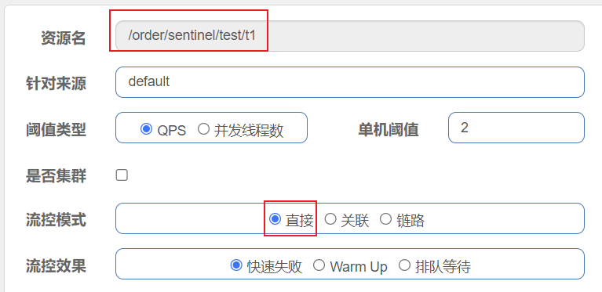

# Sentinel

<font color=red>整体参考文档：[Sentinel官方文档](https://sentinelguard.io/zh-cn/docs/introduction.html)</font>


## 一、`Sentinel`控制台启动

<font color=pink>参考文档：[Sentinel控制台文档](https://sentinelguard.io/zh-cn/docs/dashboard.html)</font>

### 1、`Sentinel`控制台下载

|  |
| ------------------------------------------------------------ |

|  |
| ------------------------------------------------------------ |


### 2、`Sentinel`控制台启动

<font color=pink>**启动`sentinel`需要使用`JDK8`及以上的版本**</font>

将`sentinel`的`jar`上传至`linux`

|  |
| ------------------------------------------------------------ |

官方启动指令

```shell
java -Dserver.port=8080 -Dcsp.sentinel.dashboard.server=localhost:8080 -Dproject.name=sentinel-dashboard -jar sentinel-dashboard.jar
```

后台运行`sentinel`并输出日志指令

```shell
# 进入Sentinel Jar包所在位置
cd /home/sentinel

# 启动Sentinel
nohup java -jar sentinel-dashboard-1.8.8.jar > //home/sentinel/logs/sentinel.out 2>&1 &
```


### 3、`Sentinel`控制台访问

访问：http://192.168.68.201:8080/

|  |
| ------------------------------------------------------------ |

<font color=pink>`Sentinel`控制台默认账户密码`sentinel/sentinel`</font>


## 二、`SpringCloud`接入`Sentinel`

### 1、`Sentinel`依赖

```xml
<!-- sentinel依赖 -->
<dependency>
    <groupId>com.alibaba.cloud</groupId>
    <artifactId>spring-cloud-starter-alibaba-sentinel</artifactId>
</dependency>
```

### 2、`Sentinel`配置

```yaml
spring:
  cloud:
    sentinel:
      transport:
      	# 微服务接入sentinel控制台地址
        dashboard: 192.168.75.201:8080
        # sentinel应用端口
        port: 8719
```

### 3、`Sentinel`两个端口

#### 3.1 `8080`

`8080`端口是`Sentinel`前端控制台访问端口，通过该端口可以访问到`Sentinel`的控制台图形用户界面。

#### 3.2 `8719`

`8719`端口是`Sentinel`控制台和`Sentinel`客户端通信的端口，`Sentinel`客户端负责收集微服务的统计信息，以及向`Sentinel`控制台报告信息，如果`8719`端口被占用，那么会从`8719`开始依次加一递增查询没有使用的端口。

### 4、`@SentinelResource`

以下为属性说明

#### 4.1 `value`

将系统资源指定为`Sentinel`资源，并通过`value`为其命名。添加了`@SentinelResource`注解的系统资源可以被扫描到`Sentinel`控制台的簇点链路中，也可以被`Sentinel`指定流控，熔断，热点，授权等规则。

|  |
| ------------------------------------------------------------ |
|  |

系统资源可以是类，方法，接口资源之类。

| <font color=skyblue>`@SentinelResource`注解可以添加到类，方法上。</font> |
| ------------------------------------------------------------ |
|  |


#### 4.2 `blockHandler`

用于处理`BlockException`异常，该异常属于`Sentinel`中的异常，当`Sentinel`资源发生限流的时候就会抛出该异常，返回`Sentinel`默认的限流信息`Blocked by Sentinel (flow limiting)`。

|  |
| ------------------------------------------------------------ |

`blockHandler`属性的属性值为一个字符串，该字符串代表发生限流时候的降级方法的方法名。对于`blockHandler`中指明的降级方法有如下要求：

- 降级方法的方法声明和`Sentinel`资源代表的方法的方法声明一致
- 降级方法只能和`Sentinel`资源处于同一个类中
- 降级方法中可以额外添加一个类型为`BlockException`的入参


使用案例：

- `Java`代码

  ```java
  @Controller
  @RequestMapping("/order/sentinel/test")
  @Slf4j
  public class SentinelTestController {
  
      @RequestMapping("/t1")
      @ResponseBody
      //定义Sentinel资源t1，并指定降级方法
      @SentinelResource(value = "t1",blockHandler = "t1BlockHandler")
      public BaseRespData<String> t1() {
          log.info("t1 ~~");
          return BaseRespData.success("t1");
      }
  
      //处理BlockException异常的降级方法
      public BaseRespData<String> t1BlockHandler(BlockException blockException){
          return BaseRespData.success("系统繁忙，请稍后重试~~");
      }
  }
  ```

- 测试结果

  |  |
  | ---------------------------------------- |


#### 4.3 `blockHandlerClass`

`blockHandlerClass`的值为一个类的`Class`对象，其作用用于指定降级方法的查找位置。与`blockHandler`组合使用就可以唯一定位降级方法，这种方式可以将降级方法分离出去单独管理，推荐使用。

`blockHandlerClass`降级方法声明要求：

- 降级方法的方法声明和`Sentinel`资源代表的方法的方法声明一致
- 降级方法中可以额外添加一个类型为`BlockException`的入参
- 降级方法在指定类中必须声明为`static`


使用案例：

```java
// Sentinel资源类
@Controller
@RequestMapping("/order/sentinel/test")
@Slf4j
public class SentinelTestController {

    @RequestMapping("/t1")
    @ResponseBody
    // 定义Sentinel资源t1
    // 使用blockHandlerClass指定降级方法查找位置
    // 使用blockHandler指定降级方法名字
    @SentinelResource(value = "t1", 
                      blockHandlerClass = {FallBackMethodList.class}, 
                      blockHandler = "t1BlockHandler")
    public BaseRespData<String> t1() {
        log.info("t1 ~~");
        return BaseRespData.success("t1");
    }
}
```

```java
//降级方法类
public class FallBackMethodList {
    public static BaseRespData<String> t1BlockHandler(BlockException blockException){
        return BaseRespData.success("系统繁忙，请稍后重试~~");
    }
}
```


#### 4.4 `fallback`

`fallbackd`的使用类似`blockHandler`，只不过`blockHandler`只能处理`BlockException`，而`fallback`用于处理`Throwable`异常，即所有的异常。

`fallback`和`blockHandler`可以共存，如果发生`BlockException`异常优先使用`blockHandler`，其他异常则使用`fallback`。


使用案例：

```java
@Controller
@RequestMapping("/order/sentinel/test")
@Slf4j
public class SentinelTestController {

    @RequestMapping("/t1/{flag}")
    // 定义Sentinel资源，指定限流降级方法以及异常降级方法
    @SentinelResource(value = "t1", blockHandler = "t1BlockHandler", fallback = "t1Handler")
    @ResponseBody
    public BaseRespData<String> t1(@PathVariable("flag") Integer flag) {
        log.info("t1 ~~");
        if (flag == 1) throw new RuntimeException();
        return BaseRespData.success("t1");
    }

    // 限流降级方法
    public static BaseRespData<String> t1BlockHandler(Integer flag, BlockException blockException) {
        return BaseRespData.success("系统繁忙，请稍后重试~~");
    }

    // 异常降级方法
    public static BaseRespData<String> t1Handler(Integer flag, Throwable throwable) {
        return BaseRespData.success("系统异常，请稍后重试~~");
    }
}
```


#### 4.5 `fallbackClass`

作用类比`blockHandlerClass`


#### 4.6 `exceptionsToIgnore`

指定哪些异常不需要`fallback`降级处理。


## 三、`Sentinel`流控规则

| `Sentinel`新增流控规则                                       |
| ------------------------------------------------------------ |
|  |

### 1、流控模式

#### 1.1 直接

<font color=pink>针对单个接口，当接口的访问量超过设定阈值，接口将被限流，多余的请求不会再处理。</font>

- 接口

  ```java
  @Controller
  @RequestMapping("/order/sentinel/test")
  @Slf4j
  public class SentinelTestController {
      
      @RequestMapping("/t1")
      @ResponseBody
      @SentinelResource
      public BaseRespData<String> t1() {
          log.info("t1 ~~");
          return BaseRespData.success("t1");
      }
  }
  ```

- `Sentinel`流控规则配置

  阈值`QPS`的意思就是每秒查询的次数，比方说`QPS`阈值为2，意思就是每秒的请求次数最大为2，超过了就会被限流，限流的请求便不会在处理，直接响应降级处理结果。

  |  |
  | ------------------------------------------------------------ |

- 测试结果

  - 浏览器测试

    如果每秒请求不超过2次的话，可以正常响应，超过的请求不会处理而是直接响应`Blocked by Sentinel (flow limiting)`，意为被限流。

    |  |
    | ------------------------------------------------------------ |

  - `Jmeter`测试

    两秒发送10个请求，但是有控制台可知只有4个请求被处理，其中6个请求被限流丢弃，没被处理。

    |  |
    | ------------------------------------------------------------ |
    |  |


#### 1.2 关联

<font color=pink>两个关联接口，其中一个请求量超过阈值之后，与之关联的另一个接口就会被限流。A接口关联B接口，B接口超出最大阈值后A接口被限流，而B接口不受影响。</font>

- 接口

  ```java
  @Controller
  @RequestMapping("/order/sentinel/test")
  @Slf4j
  public class SentinelTestController {
      @RequestMapping("/t1")
      @ResponseBody
      @SentinelResource
      public BaseRespData<String> t1() {
          log.info("t1 ~~");
          return BaseRespData.success("t1");
      }
  
      @RequestMapping("/t2")
      @ResponseBody
      public BaseRespData<String> t2() {
          log.info("t2 ~~");
          return BaseRespData.success("t2");
      }
  }
  ```

- `Sentinel`流控规则配置

  设定`/order/sentinel/test/t1`接口关联`/order/sentinel/test/t2`接口，当`/order/sentinel/test/t2`超过`QPS`为1的阈值后，那么`/order/sentinel/test/t1`就会被限流。

  |  |
  | ------------------------------------------------------------ |

- 测试结果

  正常情况下`/order/sentinel/test/t1`和`/order/sentinel/test/t2`均是正常的(注意时间戳变化)，当使用`Jmeter`开启5秒内向`/order/sentinel/test/t2`发送100个请求之后，`/order/sentinel/test/t2`就会超出设定的阈值，那么此时再访问`/order/sentinel/test/t1`发现其被限流，而`/order/sentinel/test/t2`不受任何影响。

  |  |
  | ------------------------------------------------------------ |


#### 1.3 链路

<font color=pink>针对不同的链路限流。</font>

<font color=skyblue>前提：<u>**`Sentinel`中可以通过`@SentinelResource`定义一个`Sentinel`资源，而`Sentinel`资源就是流控规则作用的对象，`Sentinel`针对`Sentinel`资源配置流控规则，同一`Sentinel`资源可以配置多个流控规则</u>。**默认情况下所有的`controller`接口资源都在同一个链路下，可以通过使用`spring.cloud.web-context-unify: false`配置将每个接口资源作为一个单独的链路。</font>

使用`spring.cloud.web-context-unify: true`，也是默认情况下的链路情况：`/order/sentinel/test/t1`和`/order/sentinel/test/t2`属于一个链路。

|  |
| ------------------------------------------------------------ |

而使用`spring.cloud.web-context-unify: false`之后，那么每个接口就会单独作为一个链路。

|  |
| ------------------------------------------------------------ |


- 接口 + 自定义`SentinelResource` `r1` + `yaml`配置

  ```yaml
  # Sentinel配置中添加如下配置,使从每个接口开始作为一个单独的链路
  spring:
  	cloud:
  		web-context-unify: false
  ```

  

  ```java
  // 接口类
  // 每个接口都会调用自定义Sentinel资源，形成一个单独的链路
  @Controller
  @RequestMapping("/order/sentinel/test")
  @Slf4j
  public class SentinelTestController {
      
      @Resource
      private SentinelTestService sentinelTestService;
      
      @RequestMapping("/t1")
      @ResponseBody
      public BaseRespData<String> t1() {
          log.info("t1 ~~");
          sentinelTestService.test();
          return BaseRespData.success("t1");
      }
  
      @RequestMapping("/t2")
      @ResponseBody
      public BaseRespData<String> t2() {
          log.info("t2 ~~");
          sentinelTestService.test();
          return BaseRespData.success("t2");
      }
  }
  ```

  

  ```java
  // 自定义Sentinel资源类，被接口调用会加入接口所在的链路
  @Service
  @Slf4j
  public class SentinelTestService {
      //@SentinelResource注解用于定义Sentinel资源
      @SentinelResource(value = "r1")
      public void test() {
      }
  }
  ```

- `Sentinel`流控规则配置

  `/order/sentinel/test/t1`和`/order/sentinel/test/t2`两个链路中都有`r1`，而此时只对`/order/sentinel/test/t1`链路中的`r1`添加限流，那么此时`/order/sentinel/test/t1`访问`r1`超过阈值之后就会限流，`/order/sentinel/test/t2`则不受影响。

  |  |
  | ------------------------------------------------------------ |

- 测试结果

   访问`/order/sentinel/test/t1`超过阈值之后会出现`系统异常`，而`/order/sentinel/test/t2`完全不受影响。

  |  |
  | ------------------------------------------------------------ |


### 2、流控效果

#### 2.1 快速失败

<font color=pink>只要接口访问量超过设定的最大阈值，不再处理多余的请求，直接响应降级处理结果。</font>

上面`流控模式`的所有测试均是`快速失败`模式，可做参考。


#### 2.2 Warm Up

<font color=pink>`Warm Up`主要用于接口瞬时流量增大时，保证接口的流量阈值能够逐步的上升到设定的阈值，比方说接口设定的阈值是10，但是初始阈值却是3，从3开始经过设定的预热时间之后才到达设定的阈值，有利于增强系统的稳定性。</font>

- 接口

  ```java
  @Controller
  @RequestMapping("/order/sentinel/test")
  @Slf4j
  public class SentinelTestController {
      
      @RequestMapping("/t1")
      @ResponseBody
      @SentinelResource
      public BaseRespData<String> t1() {
          log.info("t1 ~~");
          return BaseRespData.success("t1");
      }
  }
  ```

- `Sentinel`流控规则配置

  设置接口流控效果为预热效果`Warm Up`，那么接口调用的阈值会从初始阈值逐步的增大为最高阈值，而不是瞬间达到最高阈值。

  初始阈值计算：`设定的最高阈值 / 预热因子` 取整，预热因子默认为3。

  如下配置，最高阈值为10，那么接口初始阈值为3，经过预热时长5s后达到最大阈值10。

  |  |
  | ------------------------------------------------------------ |

- 测试结果

  由如下结果可以看出初始一秒3个请求快速点击，当达到阈值3后出现限流提示，5s之后到达阈值10之后，手动点击的速度没有达到一秒10次，所以就不会在出现限流，此时趋于稳定。

  测试发现当到达阈值之后访问量下来之后，瞬时流量再增大，那么接口的阈值会再次`Warm Up`预热，重复上述过程。

  |  |
  | ---------------------------------------- |


#### 2.3排队等待

<font color=pink>不论是`快速失败`还是`Warm Up`，只要某个时刻，某个接口访问量超过阈值，在超过阈值的状态下，所有其他请求过来的请求均会被舍弃，这样做虽然保证过量的请求不会造成系统的崩溃，但是会丢弃大量的请求。而排队等待的意思是当接口访问量超过阈值之后，多余的请求不会被丢弃，而是进入待处理的队列，只要在请求的超时时间之内被处理，那么请求就算成功，如果请求超过的了设定的超时时间，此时请求才会被丢弃。</font>

- 接口

  ```java
  @Controller
  @RequestMapping("/order/sentinel/test")
  @Slf4j
  public class SentinelTestController {
      
      @RequestMapping("/t1")
      @ResponseBody
      @SentinelResource
      public BaseRespData<String> t1() {
          log.info("t1 ~~");
          return BaseRespData.success("t1");
      }
  }
  ```

- 测试结果

  通过`Jemeter`1秒发送10个请求，快速等待和排队等待比较：

  - 快速失败

    设定接口阈值为1，也就是1秒只能访问一次该接口。

    |  |
    | ------------------------------------------------------------ |

    由最终后台接口的访问情况来看，`Jmeter`1秒发送的10个请求，只有一个被处理，说明了只要没有使用排队等待，只要超过阈值的所有请求都会被丢弃。

    |  |
    | ------------------------------------------------------------ |

  - 排队等待

    排队等待接口阈值为1，也就是1秒只能处理一个请求，使用排队等待，请求超时时间为5000ms。

    |  |
    | ------------------------------------------------------------ |

    由最终后台接口的访问情况来看，`Jmeter`1秒发送的10个请求，其中6个被处理，说明使用排队等待之后超过阈值之后的请求不会被丢弃而是被放在等待执行的队列中，等待执行。

    1秒发送10个请求，第1个请求开始处理，并且根据阈值可知接口的处理能力是1秒一个请求，那么其他的9个请求都会进入等待队列，被1秒一个的依次处理，当超过5秒后还没被处理的请求全部会被丢弃。结果之所以是6个而不是5个是因为时间的误差，因为第32秒可能是快结束的第32秒即32.999999，不是完整的一秒钟 ~~

    |  |
    | ------------------------------------------------------------ |


## 四、`Sentinel`熔断规则

<font color=pink>`Sentinel`的熔断原理，类似`Circuit Breaker`的断路器。</font>

[`Circuit Breaker`的断路器原理]: ./Resilience4j.md#1、断路器状态


### 1、慢调用比例

|  |
| ------------------------------------------------------------ |


参数解析：

- `RT`：一次请求的最大响应时长(ms)，如果一次请求的响应时间超过设定的最大响应时长，那么视本次请求为一次慢调用。
- 比例阈值：规定时间内`慢调用数量 / 总调用数量`为慢调用率。规定时间内慢调用率超过设定的比例阈值，接口熔断，不可被访问。
- 熔断时长：接口熔断不可被访问持续的时间，也是下一次熔断统计开始的间隔时间。
- 最小请求数量：在一次统计时长内达到多少请求数量才会开始统计是否熔断。避免一次调用结果为慢调用，此时慢调用率为`100%`，达到比例阈值直接熔断接口。如果一次统计时长结束时没有达到设定的最小请求数量，则不会统计。
- 统计时长：判断接口是否需要熔断的间隔时间。


判断流程：

<font color=pink>以上述图片配置为例说明，在任意1000ms内，接口调用至少达到5次调用时，并且接口响应时间超过500ms的次数占总调用次数的比例大于设定比例阈值时接口将被熔断不可访问，当熔断后经历5s后会再重复上述过程，如果慢调用率比例低于设定的阈值，那么接口重新恢复，否则继续熔断。</font>


### 2、异常比例

|  |
| ------------------------------------------------------------ |

判断流程：

<font color=pink>以上述图片配置为例说明，在任意1000ms内，接口调用至少达到5次调用时，并且接口出现异常（接口异常指的是接口没有正常响应`200`）次数占总调用次数的比例大于设定比例阈值时接口将被熔断不可访问，当熔断后经历5s后会再重复上述过程，如果慢调用率比例低于设定的阈值，那么接口重新恢复，否则继续熔断。</font>


### 3、异常数

|  |
| ------------------------------------------------------------ |

判断流程：类比`异常比例`，只不过将统计时长内的异常比例换成统计时长内的异常数量。


## 五、`Sentinel`热点规则

<font color=pink>热点规则主要用于对热点信息(高频信息)的访问进行限流。</font>

```java
// 测试类
@Controller
@RequestMapping("/order/sentinel/test")
@Slf4j
public class SentinelTestController {

    /*
    	接口存在两个从URI中获取的参数，其中一个代表访问用户的id，另一个代表用户访问新闻的id
    */
    @RequestMapping("/t3/{userId}/{newId}")
    @ResponseBody
    @SentinelResource(value = "t3", blockHandler = "t1BlockHandler", fallback = "t1Handler")
    public BaseRespData<String> t3(@PathVariable("userId") Integer userId, 
                                   @PathVariable("newId") Integer newId) {
        return BaseRespData.success("t3");
    }

    // Sentinel针对BlockException处理的降级方法
    public static BaseRespData<String> t1BlockHandler(Integer userId, 
                                                      Integer newId, 
                                                      BlockException blockException) {
        return BaseRespData.success("系统繁忙，请稍后重试~~");
    }

    // Sentinel针对Throwable处理的降级方法
    public static BaseRespData<String> t1Handler(Integer userId,
                                                 Integer newId,
                                                 BlockException blockException) {
        return BaseRespData.success("系统异常，请稍后重试~~");
    }

}
```


### 1、参数限流

<font color=pink>参数限流的意思是针对接口上指定位置的参数进行限流，只要请求中携带该参数且请求访问量超过设定阈值，那么接口就会被限流。</font>

比方说上述接口，针对其中的第二个参数`newId`进行限流，那么只要请求中携带了该参数，不论`newId`的值是多少，只要访问量超过设置的访问阈值，都会被限流，也就是说此时会对所有的新闻进行限流。

| `Sentinel`配置                                               |
| ------------------------------------------------------------ |
|  |

<font color=skyblue>参数索引`n`的意思就是对接口方法上的第`n+1`个参数进行限流，索引值从0开始。比方说设置0就代表要对接口上的第一个参数进行限流。</font>


| 测试结果                                 |
| ---------------------------------------- |
|  |


### 2、参数值限流

<font color=pink>参数限流的意思是针对接口上指定位置参数的指定值进行限流。</font>

假如说上述接口中现在`newId=2`的新闻属于热点新闻，那么此时只有访问`http://localhost:8081/order/sentinel/test/t3/1/2`的请求才会被限流，其他的请求则不会。

| `Sentinel`配置                                               |
| ------------------------------------------------------------ |
| <font color=skyblue>此时对于`newId`进行限流，对非特殊值来说只有超过每秒1000次的访问，才会被限流。而对于特殊值为`2`时，那么当超过每秒2次的访问就会被限流。</font> |
|  |


| 测试结果（注意时间戳变化）                                   |
| ------------------------------------------------------------ |
| 访问`http://localhost:8081/order/sentinel/test/t3/1/1`（手动点击的话不会限流(每秒1000次)） |
|                      |
| 访问`http://localhost:8081/order/sentinel/test/t3/1/2`（每秒2次便会限流） |
|                      |


## 六、`Sentinel`授权规则

<font color=pink>授权规则主要是针对请求的来源进行限流操作。</font>


<font color=skyblue>定义`Sentinel`授权规则需要解析的值，需要实现`RequestOriginParser`重写`parseOrigin`方法，方法的返回值就是`Sentinel`需要校验的值。</font>

```java
@Component
public class SentinelOriginParcer implements RequestOriginParser {
    @Override
    public String parseOrigin(HttpServletRequest httpServletRequest) {
   		// 获取请求的远程Ip,Sentinel根据Ip值进行限流
        // 当可以解析其他的值，比方说httpServletRequest.getParameter("host");请求中一个参数
        return httpServletRequest.getRemoteHost();
    }
}
```


> 测试过程

授权规则测试时使用请求参数中携带的`host`参数的值来模拟`httpServletRequest.getRemoteHost()`：

```java
@Component
public class SentinelOriginParcer implements RequestOriginParser {
    @Override
    public String parseOrigin(HttpServletRequest httpServletRequest) {
        return httpServletRequest.getParameter("host");
    }
}
```

| `Sentinel`配置                                               |
| ------------------------------------------------------------ |
| <font color=skyblue>配置解释：当访问名为`/order/sentinel/test/t2`的`Sentinel`资源时，如果`httpServletRequest.getParameter("host")`的值为`10.10.30.51`或者`10.10.30.52`时，那么就会被限流，其他正常访问。多个配置值使用`,`分隔。</font> |
|  |


| 测试结果                                 |
| ---------------------------------------- |
| 限流访问：`10.10.30.51`或者`10.10.30.52` |
|  |
| 不限流访问：`10.10.30.53`                |
|  |


## 七、`Sentinel`配置持久化

<font color=pink>原本在`Sentinel`控制台上添加`Sentinel`配置实际上是将配置存储在内存中，微服务重启之后配置就会消失。而`Sentinel`配置持久化本质上就是将原本配置在控制台上的配置，以配置文件的形式配置到`Nacos`配置中心中实现配置的持久化。</font>

### 1、依赖

```xml
<!-- sentinel配置持久化依赖 -->
<dependency>
    <groupId>com.alibaba.csp</groupId>
    <artifactId>sentinel-datasource-nacos</artifactId>
</dependency>
```


### 2、配置

```yaml
spring:
  cloud:
    sentinel:
      transport:
        dashboard: 192.168.68.201:8080
        port: 8719
      # sentinel规则配置在nacos 实现配置持久化
      datasource:
      	# 名字自定义可配置多个
        flow:
          nacos:
          	# nacos服务地址
            server-addr: ${spring.cloud.nacos.server-addr}
            # nacos通过namespace+groupId+dataId唯一定位配置文件
            dataId: ${spring.application.name}-flow-rules
            namespace: ${spring.cloud.nacos.config.namespace}
            groupId: SENTINEL_GROUP
            # nacos配置文件的文件扩展名是json
            data-type: json
            # 针对持久化的规则类型
            # com.alibaba.cloud.sentinel.datasource.RuleType 提供所有的规则类型
            rule-type: flow
```


