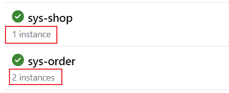
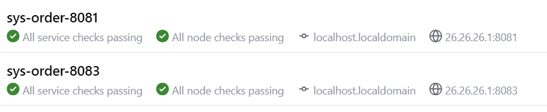
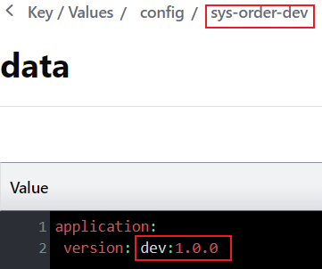
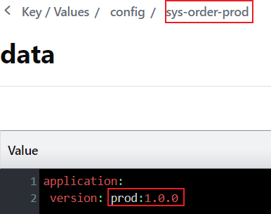
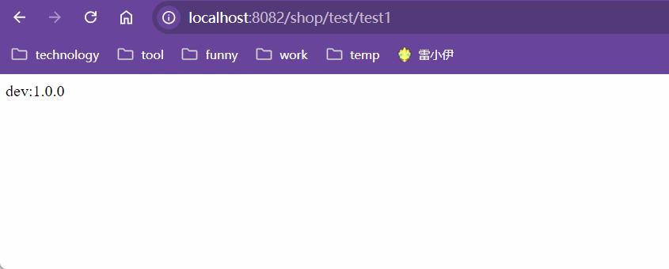

# Spring-Cloud-LoadBalancer

<font color=red>前置：需要了解客户端负载均衡和服务器端负载均衡</font>

<font color=skublue>笔记参照：https://docs.spring.io/spring-cloud-commons/docs/current/reference/html/#spring-cloud-loadbalancer</font>

[客户端负载均衡和服务器端负载均衡]: ../SpringCloud知识点.md#2、客户端负载均衡与服务端负载均衡


## 一、`LoadBalancer`基本使用

### 1、依赖

```xml
<dependency>
    <groupId>org.springframework.cloud</groupId>
    <artifactId>spring-cloud-starter-loadbalancer</artifactId>
</dependency>
```

<font color=pink>由于`LoadBalancer`属于客户端负载均衡，所以其依赖应该放在请求方而不是服务方。</font>

<font color=pink><u>`SpringCloud`中`LoadBalancer`归属于`Spring Cloud Commons`。因此引入`Spring Cloud Commons`也可以间接引入`LoadBalancer`</u></font>

### 2、注解

`@LoadBalanced`添加到`RestTemplate`，那么**经由`RestTemplate`发起的请求时就会先从远程服务注册中心拉去对应服务名的所有服务列表，然后进行负载均衡计算选出处理请求的服务器**。

```java
@Configuration
public class BaseConfig {
    @Bean
    @LoadBalanced
    public RestTemplate restTemplate() {
        return new RestTemplate();
    }
}
```

### 3、流程

现在存在三个服务其中一个`sys-shop`为客户端服务，用于发起请求。另外两个都是`sys-order`服务，用于提供服务。

|  |
| ------------------------------------------------------------ |

`sys-order`服务名下存在两个服务实例，当`sys-shop`请求服务名`sys-order`时，客户端就会经过负载均衡计算，选取两个服务中的一个来处理请求。

|  |
| ------------------------------------------------------------ |

此时`consul`配置中心中存在`dev`和`prod`配置

|  |
| ------------------------------------------------------------ |
|  |

当`sys-shop`通过`RestTemplate`向`sys-order`发起请求获取`application.version`配置的时候，就会在`sys-order-8081`和`sys-order-8083`之间轮询，而这两个服务一个开启的是`dev`配置，另一个开启的是`prod`配置，因此最终结果如下：

|  |
| ------------------------------------------------------------ |


## 二、`LoadBalancer`负载均衡算法切换

<font color=pink>`Loadbalancer`提供两种负载均衡算法：轮询和随机。默认情况下使用轮询。</font>

1. 自定义负载均衡算法

   ```java
   /**
    * LoadBalancer 自定义负载均衡算法
    */
   @Configuration
   @Slf4j
   public class CustomLoadBalancerConfig {
       /**
        * 随机
        */
       @Bean
       @ConditionalOnProperty(prefix = "loadbalancer", name = "model", havingValue = "random")
       ReactorLoadBalancer<ServiceInstance> randomLoadBalancer(
           Environment environment, 
           LoadBalancerClientFactory loadBalancerClientFactory) {
           String serviceName = environment.getProperty(LoadBalancerClientFactory.PROPERTY_NAME);
           return new RandomLoadBalancer(loadBalancerClientFactory.getLazyProvider(
               serviceName, 
               ServiceInstanceListSupplier.class), serviceName);
       }
   
       /**
        * 轮询
        */
       @Bean
       //如果没有设定负载均衡算法为随机，那么就是轮询
       @ConditionalOnMissingBean(value = {RandomLoadBalancer.class})
       ReactorLoadBalancer<ServiceInstance> roundRobinLoadBalancer(
           Environment environment, 
           LoadBalancerClientFactory loadBalancerClientFactory) {
           String serviceName = environment.getProperty(LoadBalancerClientFactory.PROPERTY_NAME);
           return new RoundRobinLoadBalancer(loadBalancerClientFactory.getLazyProvider(
               serviceName, 
               ServiceInstanceListSupplier.class),serviceName);
       }
   }
   ```

   

2. 配置负载均衡算法

   ```java
   @Configuration
   //服务名为sys-order下的所有实例均使用CustomLoadBalancerConfig配置的负载均衡算法
   @LoadBalancerClient(name = "sys-order",configuration = CustomLoadBalancerConfig.class)
   public class WebClientConfig {
       @Bean
       @LoadBalanced
       public RestTemplate restTemplate() {
           return new RestTemplate();
       }
   }
   ```


