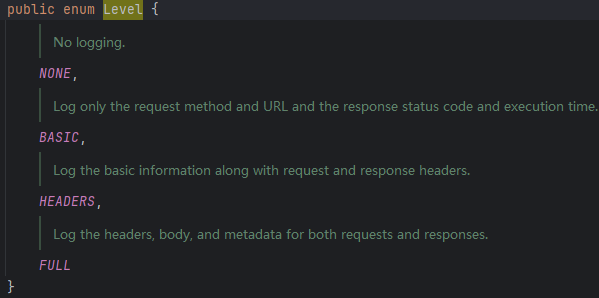

# Spring-Cloud-OpenFeign


<font color=red>**`OpenFeign`集成了`LoadBalancer`，因此自带负载均衡功能。**</font>


## 一、`OpenFeign`基本使用

### 1、依赖

```xml
<dependency>
    <groupId>org.springframework.cloud</groupId>
    <artifactId>spring-cloud-starter-openfeign</artifactId>
</dependency>
```

<font color=pink>`OpenFeign`集成`LoadBalancer`因此拥有客户端负载均衡的功能，其依赖需要添加到客户端即服务的请求方。</font>

| `OpenFeign`依赖`LoadBalancer`                                |
| ------------------------------------------------------------ |
|  |

### 2、注解 

#### 2.1`@EnableFeignClients`

<font color=pink>开启`Feign`客户端功能，扫描添加了`@FeignClient`注解的接口，通过`JDBC`动态代理将接口的代理类对象注册到容器中。</font>

`@EnableFeignClients`的作用类似：`@ComponentScan`，`@MapperScan`等注解。

1. `@ComponentScan`或者`@SpringBootApplication(scanBasePackages={...})`：其主要作用就是扫描添加了`@Component`，`@Controller`，`@Service`，`@Repository`等注解，将这些注解所标注的类注册到容器中进行管理。
2. `@MapperScan`：主要作用就是指定扫描包，指定的包路径下的所有接口都会被动态代理注册至容器，其代理类对象调用方法其实就是通过`接口全类名 + 方法名`来查找指定`sql`来执行，这是`mybatis`通过对`ibatis`进一步的封装，简化调用。
3. `@EnableFeignClients`：主要作用就是指定扫描路径，扫描路径下添加了`@FeignClient`的接口会被注册到容器，其代理类对象方法的调用其实就是通过服务名去服务注册中心找到对应的服务实例（具体找哪一个实例主要通过负载均衡实现），通过方法上的接口`url`指定调用服务实例的那一个接口，从而将服务间的`http`调用转化成对象方法的调用。


**常用属性**：

- `basePackages`：指定扫包路径


#### 2.2`@FeignClient`

<font color=pink>扫描路径时添加了`@FeignClient`的接口会被注册到容器，其代理类对象方法的调用其实就是通过服务名去服务注册中心找到对应的服务实例（具体找哪一个实例主要通过负载均衡实现），通过方法上的接口`url`指定调用服务实例的那一个接口，从而将服务间的`http`调用转化成对象方法的调用。</font>


**常用属性**：

##### 2.2.1 `name`或`value`

指定远程调用的服务名。`OpenFeign`会根据服务名从注册中心拉去相应服务名的所有服务实例，然后根据负载均衡算法选取一个服务实例处理请求。

##### 2.2.2`path`

指定基础路径，即当前`FeignClient`下的所有请求方法的路径前都会默认加上`path`路径。

如下：当调用`version()`方法是会在方法对应的路径上添加上`path`，`http://sys-order/test/version`

```java
@FeignClient(name = "sys-order",path = "/test")
public interface IndexApi {

    @GetMapping("/version")
    String version();
}
```

##### 2.2.3`url`

指定固定的请求服务地址。使用`url`之后`name`或`value`就不再生效，当调用方法时会固定请求指定的地址，不会再使用负载均衡。

如下，使用`url = "http://localhost:80`，那么当调用`version()`方法会固定请求`http://localhost:80/version`。

```java
@FeignClient(name = "sys-order",url = "http://localhost:80")
public interface IndexApi {
    @GetMapping("/version")
    String version();
}
```

##### 2.2.4`contextId`

用于区分同一个服务名下的不同的`Feign`客户端，实际上即便不同的服务名也不能存在相同的`contextId`的`Feign`客户端。

| <font color=skyblue>由测试可知，即便服务名不一致但是`contxtId`一致也是无法创建`Feign`客户端的。</font> |
| ------------------------------------------------------------ |
|  |
|  |
|  |

使用`@FeignClient`，如果仅仅指定了`name`或者`value`属性，那么创建的`Feign`客户端的`Bean`的`name`为`${name}.FeignClientSpecification`或者`${value}.FeignClientSpecification`。此时如果一个微服务下的所有接口暴露在一个接口里是没有问题的，如果暴露在多个接口里，此时创建`Feign`客户端的`Bean`的时候就会出现重名的问题，而`Spring`默认不开启相同`Bean`的处理，所以此时启动时会提示如下错误。

|  |
| ------------------------------------------------------------ |
| <font color=skyblue>意为：`sys-order.FeignClientSpecification`已经定义了不能再次定义同名的Bean。</font> |

而`ContextId`的作用就是为同一个服务创建多个`Feign`客户端，如果使用了`ContextId`那么`Bean`的`name`为`${contextId}.FeignClientSpecification`，此时便可以解决上述问题。


> [!WARNING]
>
> 使用了`contextId`，那么在配置自定义`OpenFeign`配置模板的时候必须使用`contextId`

[相关配置-超时控制配置]: #1、超时控制

```java
//OpenFeign contextId 为 OrderUserOrderApi，那么配置OpenFeign配置模板的时候必须使用 OrderUserOrderApi
@FeignClient(value = "sys-order", path = "/order/userOrder", contextId = " OrderUserOrderApi")
public interface OrderUserOrderApi {
    @PostMapping("/getById")
    public BaseRespData<UserOrderEntity> getById(@Validated @RequestBody BaseReqParam param);
}
```

```yaml
spring:
  cloud:
    openfeign:
      client:
        config:
          # OpenFeign默认超时配置
          default:
            connect-timeout: 3000
            read-timeout: 3000
          # OrderUserOrderApi Feign客户端配置模板
          OrderUserOrderApi:
            connect-timeout: 20000
            read-timeout: 20000
```


##### 2.2.5`fallback`

用于指定远程调用方法失败的降级处理。


### 3、流程

- 服务提供方：服务接口

  ```java
  // sys-order模块
  @Controller
  public class IndexController {
  
      //获取当前服务的版本
      @GetMapping("/version")
      @ResponseBody
      public String version(@Value("${application.version}") String version) {
          return version;
      }
  }
  ```

- 创建服务接口的`Feign`客户端

  ```java
  @FeignClient(name = "sys-order")
  public interface IndexApi {
  
      @GetMapping("/version")
      String version();
  }
  ```

  <font color=pink>创建`Feign`客户端，其中`name = "sys-order"`代表该`Feign`客户端会去请求服务名为`sys-order`的服务实例。接口方法上的`@GetMapping("/version")`代表当调用`version()`方法的时候就会去找`sys-order`服务下的`/version`接口。</font>

  

- 请求方

  ```java
  // sys-shop模块
  @Controller
  @RequestMapping("/openFeign/demo")
  public class OpenFeignController {
      @Resource
      private IndexApi indexApi;
  
      //通过IndexApi实例调用version方法，完成服务间的调用
      @GetMapping("/demo1")
      @ResponseBody
      public String demo1() {
          return indexApi.version();
      }
  }
  ```


## 二、`OpenFeign`高级特性

### 1、超时控制

```yaml
spring:
  cloud:
    openfeign:
      client:
        config:
          # OpenFeign默认超时配置
          default:
            connect-timeout: 8000
            read-timeout: 8000
          # OpenFeign自定义超时配置
          sys-order:
            connect-timeout: 5000
            read-timeout: 5000
```

- `default`：默认配置。所有的服务调用均遵循的配置。
- `sys-order`：服务名为`sys-order`所遵循的配置。可通过自定义服务名来为不同的服务定制超时配置。如果`@FeignClient`上添加了`contextId`，那么需要使用`contextId`代替`serviceName`。
- <font color=red>注意：如果一个服务既存在自定义超时配置，也存在默认超时配置，那么以自定义的为准。</font>


### 2、重试机制

```java
@Configuration
@Slf4j
public class OpenFeignConfig {
    /**
     * OpenFeign 重试机制配置
     */
    @Bean
    public Retryer retryer() {
        //默认不开启重试
        //return Retryer.NEVER_RETRY;

        //服务调用失败间隔50毫秒开启重试,每次间隔100毫秒,最多重试三次
        return new Retryer.Default(50, 100, 3);
    }
}
```

- `OpenFeign`支持调用失败重试，但是重试机制默认是关闭的：`Retryer.NEVER_RETRY`
- <font color=red>注意：重试次数包含首次。比方说正常第一次调用失败了，配置要重试3次，所以之后会再重试2次。</font>


### 3、默认`HttpClient`修改

<font color=pink>**`OpenFeign`进行服务间调用默认使用的是`Jdk`自带的`HttpUrlConnection`。其性能不佳推荐使用`apache httpclient5`。**</font>

**引入`Apache HttpClient5`**：<font color=skyblue>注意：如果容器中已存在其他的`HttpClient`例如`RestTemplate`，那么以下方式就会失效。</font>

- 依赖

  ```xml
  <!-- apache httpclient5依赖 -->
  <dependency>
      <groupId>org.apache.httpcomponents.client5</groupId>
      <artifactId>httpclient5</artifactId>
      <version>5.3</version>
  </dependency>
  
  <!-- openfeign支持httpclient5依赖 -->
  <dependency>
      <groupId>io.github.openfeign</groupId>
      <artifactId>feign-hc5</artifactId>
      <version>13.1</version>
  </dependency>
  ```

- 配置

  ```yaml
  spring:
    cloud:
    	openfeign:
        httpclient:
          hc5:
            enabled: true
  ```


### 4、请求/响应压缩

```yaml
spring:
  cloud:
    openfeign:
      compression:
      	# OpenFeign开启请求压缩
        request:
          enabled: true
          min-request-size: 2048
          mime-types: application/json,application/xml,text/xml
        # OpenFeign开启响应压缩
        response:
          enabled: true
```


### 5、日志打印

- 开启`OpenFeign`日志。默认`OpenFeign`是关闭日志的。

  ```java
  @Configuration
  @Slf4j
  public class OpenFeignConfig {
  
      /**
       * OpenFeign 日志级别配置
       */
      @Bean
      public Logger.Level feignLoggerLevel() {
          return Logger.Level.FULL;
      }
  }
  ```

  | `OpenFeign`的四个日志级别，默认是`None`。                    |
  | ------------------------------------------------------------ |
  |  |

  

- 配置控制台打印`OpenFeign`日志。注意：`OpenFeign`的日志只有在`debug`的日志级别下才能打印。

  ```yaml
  logging:
    level:
      # OpenFeign指定feign客户端打印日志（仅用于debug|正常执行关闭即可)
      com.yg.sys_api.apis.order.IndexApi: debug
  ```
