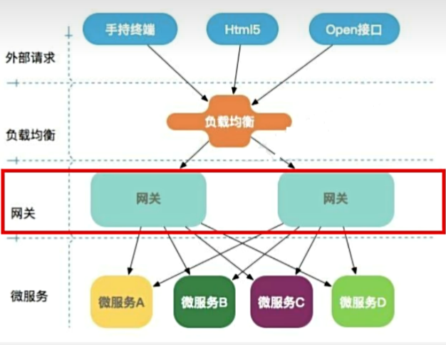
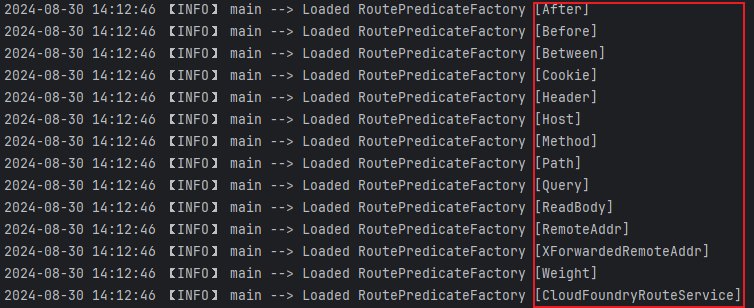
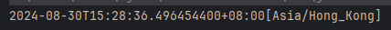
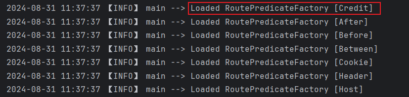
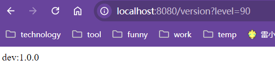
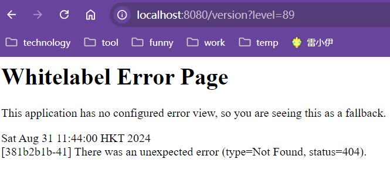
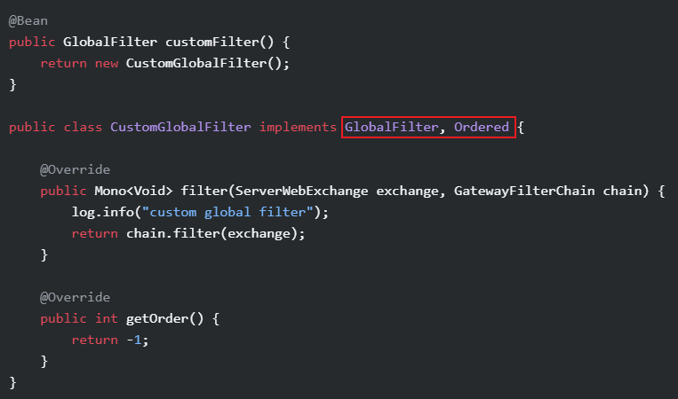

# SpringGateway

## 一、`Spring Gateway`基本概念

`Spring Gateway`网关是所有微服务的入口，其本身也是一个微服务，需要注册进服务注册中心。

外部的所有请求并不会直接到对应的微服务，而是统统经过网关，经由网关路由转发后送往各自的微服务处理请求。

<font color=pink>网关与`Nginx`的关系：`Nginx`负责请求转发至不同的网关，再由网关路由转发将请求送至不同的微服务处理。</font>

|  |
| ------------------------------------------------------------ |


## 二、`Spring Gateway`三大核心

### 1、路由`Route`

### 2、断言`Predicate`

### 3、过滤器`Filter`


## 三、`Spring Gateway`基本使用

1. 新建`gateway`微服务

   - 依赖

     ```xml
     <!-- Consul依赖 -->
     <dependency>
     	<groupId>org.springframework.cloud</groupId>
     	<artifactId>spring-cloud-starter-consul-discovery</artifactId>
     </dependency>
     <dependency>
         <groupId>org.springframework.cloud</groupId>
         <artifactId>spring-cloud-starter-consul-config</artifactId>
     </dependency>
     <dependency>
         <groupId>org.springframework.cloud</groupId>
         <artifactId>spring-cloud-starter-bootstrap</artifactId>
     </dependency>
     
     <!-- Actuator依赖 -->
     <dependency>
         <groupId>org.springframework.boot</groupId>
         <artifactId>spring-boot-starter-actuator</artifactId>
     </dependency>
     
     <!-- Spring-Gateway依赖 -->
     <dependency>
         <groupId>org.springframework.cloud</groupId>
         <artifactId>spring-cloud-starter-gateway</artifactId>
     </dependency>
     ```

   - 配置文件

     1. 配置中心和注册中心配置

        <font color=pink>网关本身也是一个微服务，需要注册到服务注册中心。</font>

        ```yaml
        spring:
          cloud:
            # Consul配置
            consul:
              port: 8500
              host: 192.168.68.201
              discovery:
                service-name: ${spring.application.name}
                prefer-ip-address: true
                # Consul开启注册中心开关
                enabled: true
              config:
                format: yaml
                profile-separator: '-'
                # Consul开启配置中心开关
                enabled: true
                watch:
                  wait-time: 10
          application:
            name: sys-gateway
        ```

     2. 网关配置

        ```yaml
        spring:
          cloud:
            gateway:
              # 网关开关
              enabled: true
              # 网关路由配置
              routes:
                - id: sys-order_gateway
                  uri: http://localhost:8081
                  predicates:
                    - Path=/version
        ```

        <font color=pink>解释：`routes`配置是一个`List`集合，因此可以配置多个路由转发的方案。其中`id`为路由的唯一标识，正常命名保证唯一即可。`uri`为路由转发的地址，代表如果所有断言校验全部为`true`那么就会转发到该路径处理请求。`predicate`代表进行路由转发的断言，也是一个集合，代表可以配置多个断言，只有所有的断言均为`true`请求才会被转发到对应的服务处理。</font>

   

2. 微服务调用方直接请求网关，由网关将请求路由转发给服务提供方处理请求

   <font color=pink>服务提供方微服务被网关保护起来，对外只暴露网关。外部请求通过负载均衡将请求送到网关，再由网关路由转发请求到服务提供方处理请求。</font>

   ```java
   // Feign客户端绑定`sys-gateway`网关微服务
   @FeignClient(name = "sys-gateway",contextId = "OrderIndexApi")
   public interface OrderIndexApi {
       @GetMapping("/version")
       String version();
   }
   ```


## 四、`Spring Gateway`高级特性

### 1、路由转发至服务名

上述`Spring Gateway`的基本使用中，在网关微服务配置中路由转发的服务器直接写死`ip:port`。

```yaml
spring:
  cloud:
    gateway:
      enabled: true
      routes:
        - id: sys-order_gateway
          # 写死的路由转发路径
          uri: http://localhost:8081
          predicates:
            - Path=/version
```

这种情况就会出现两个问题：其一如果转发服务器的`ip`或者`port`改变，那么路由转发就会出问题，无法完成路由转发，其二如果转发的服务器存在多个，这种写死`ip:port`的方式就无法实现多个服务方服务器的负载均衡。解决方式如下：

```yaml
spring:
  cloud:
    gateway:
      enabled: true
      routes:
        - id: sys-order_gateway
          # 改进
          uri: lb://sys-order
          predicates:
            - Path=/version
```

<font color=pink>`lb://`中的`lb`代表`loadbalancer`负载均衡，也就是在路由转发时会使用负载均衡的方式转发到服务名为`sys-order`的微服务上。</font>


### 2、断言使用

断言以键值对的形式存在(使用`=`分开`key`与`value`)，比方说如下配置`Path=/version`，其中`key`为`Path`，而`value`为`/version`，如果存在多个`value`使用逗号`,`分隔，比方说`Path=/version,/version/**`。

```yaml
spring:
  cloud:
    gateway:
      enabled: true
      routes:
        - id: sys-order_gateway
          uri: lb://sys-order
          predicates:
            - Path=/version
```

默认内置一些`key`，在网关微服务启动之后可以在控制台发现，比方说上述的`Path`。

| 红色部分就是内置的`key`值                                    |
| ------------------------------------------------------------ |
|  |

#### 2.1 使用注意

- 断言中的时间需要使用特定的格式。

  ```java
  // 获取断言中的时间格式
  public class ZoneTimeUtil {
      public static void main(String[] args) {
          System.out.println(ZonedDateTime.now());
      }
  }
  ```

  | 断言时间格式                                                 |
  | ------------------------------------------------------------ |
  |  |

- <font color=red>注意：针对断言的所有配置都是针对**<u>*直接请求网关的请求*</u>**来说的。比方说配置了`Cookie`，也就是说请求中必须要携带对应名称的`Cookie`才能够被网关转发。但是如果是请求A微服务，再由A微服务请求网关通过网关进行请求转发的话，那么在请求A的请求里添加`Cookie`是不生效的，只有在A微服务请求网关的请求中添加`Cookie`才会生效。</font>

#### 2.2 内置断言

##### 2.2.1 `After`|`Before`|`Between`

<font color=pink>这三种断言主要用于在通过网关访问微服务时，只有在设定的时间段才能被访问。</font>

使用场景：比方说秒杀活动，功能上线之后只有在固定的时间段开放，也就是响应相应的微服务只能在固定的时间段访问，那么就可以使用。

- `After`

  ```yaml
  spring:
    cloud:
      gateway:
        enabled: true
        routes:
          - id: sys-order_gateway
            uri: lb://sys-order
            predicates:
              - Path=/version
              # 只有在2024-08-30 15:32:36之后才可以访问
              - After=2024-08-30T15:32:36.496454400+08:00[Asia/Hong_Kong]
  ```

- `Before`

  ```yaml
  spring:
    cloud:
      gateway:
        enabled: true
        routes:
          - id: sys-order_gateway
            uri: lb://sys-order
            predicates:
              - Path=/version
              # 只有在2024-08-30 15:32:36之前才可以访问
              - After=2024-08-30T15:32:36.496454400+08:00[Asia/Hong_Kong]
  ```

- `Between`

  ```yaml
  spring:
    cloud:
      gateway:
        enabled: true
        routes:
          - id: sys-order_gateway
            uri: lb://sys-order
            predicates:
              - Path=/version
              # 只有在2024-08-30 15:32:36至2024-08-30T15:35:36期间才可以访问 
              - Between=2024-08-30T15:32:36.496454400+08:00[Asia/Hong_Kong],2024-08-30T15:35:36.496454400+08:00[Asia/Hong_Kong]
  ```

##### 2.2.2 `Cookie`

```yaml
spring:
  cloud:
    gateway:
      enabled: true
      routes:
        - id: sys-order-gateway
          uri: lb://sys-order
          predicates:
            - Path=/version
            # 请求需要携带cookie
            # product：cookie的名字
            # sc：cookie的value：普通值或正则表达式
            - Cookie=product,sc
```

##### 2.2.3 `Header`

```yaml
spring:
  cloud:
    gateway:
      enabled: true
      routes:
        - id: sys-order-gateway
          uri: lb://sys-order
          predicates:
            - Path=/version
            # 请求头中需要包含定义的某个属性
            # product：属性的名字
            # sc：属性的value：普通值或正则表达式
            - Header=product,sc
```

##### 2.2.4 `Path`

```yaml
spring:
  cloud:
    gateway:
      enabled: true
      routes:
        - id: sys-order_gateway
          uri: lb://sys-order
          predicates:
          	# 匹配指定格式的请求路径
            - Path=/version
```

##### 2.2.5`Query`

```yaml
spring:
  cloud:
    gateway:
      enabled: true
      routes:
        - id: sys-order_gateway
          uri: lb://sys-order
          predicates:
         	# 请求路径上必须携带的参数
         	# product：请求路径上携带的参数名
         	# sc：请求路径上携带参数的值，既可以是具体的值，也可以是正则表达式
            - Query=product,sc
```

##### 2.2.6`Method`

```yaml
spring:
  cloud:
    gateway:
      enabled: true
      routes:
        - id: sys-order_gateway
          uri: lb://sys-order
          predicates:
          	# 指定哪些请求类型才能实现路由转发
            - Method=GET,POST
```


#### 2.3 自定义断言

<font color=pink>**定义自定义断言可以直接参照内置断言，所有的内置断言都是以`RoutePredicateFactory`结尾的，比方说`After`断言就是`AfterRoutePredicateFactory`。**</font>

1. 定义自定义断言

   ```java
   /**
    * 自定义信用分断言:Credit
    */
   @Component
   @Slf4j
   public class CreditRoutePredicateFactory extends AbstractRoutePredicateFactory<CreditRoutePredicateFactory.Config> {
       private final String LEVEL = "level";
   
       public CreditRoutePredicateFactory() {
           super(Config.class);
       }
   
       /**
        * 定义自定义断言使用shortcut配置时的属性绑定顺序 <br/>
        * <p>
        * 比方说配置为: Credit=90,100 此时就会根据集合中配置的顺序依次将90,100绑定至配置类的属性中
        */
       public List<String> shortcutFieldOrder() {
           return Collections.singletonList(LEVEL);
       }
   
       /**
        * Credit断言校验
        */
       public Predicate<ServerWebExchange> apply(final CreditRoutePredicateFactory.Config config) {
           return (serverWebExchange) -> {
               String level = CollectionUtil.getFirst(serverWebExchange.getRequest().getQueryParams().get(LEVEL));
               log.info("最低信用分:{},实际信用分:{}", config.getLevel(), level);
               return Objects.nonNull(level) 
                   && NumberUtil.isNumber(level) 
                   && Integer.parseInt(level) >= config.getLevel();
           };
       }
   
       /**
        * Credit断言对应的配置类
        */
       @Data
       @NoArgsConstructor
       @AllArgsConstructor
       @Validated
       public static class Config {
           @NotNull(message = "信用积分断言配置不能为空")
           private Integer level;
       }
   }
   ```

   - 定义自定义断言的两种选择
     1. （推荐）继承抽象类`AbstractRoutePredicateFactory`，该抽象类实现了`RoutePredicateFactory`接口，对功能进行了一定的实现。
     2. 直接实现`RoutePredicateFactory`接口，完全重写。

   - `shortcutFieldOrder`方法用于指定在使用`shortcut`的方式配置时属性的绑定顺序。如果不提供此方法直接使用`shortcut`的方式配置那么就会报错，因为此时不知道如何绑定属性，此时就只能使用完整的配置方式来配置。

   - 内部类`Config`是用来接收配置文件中配置的断言属性的。

   - <font color=red>注意：配置断言的`key`就是自定义断言类的前缀，即`RoutePredicateFactory`的前缀，比方说`CreditRoutePredicateFactory`，那么最终配置断言时候用的`key`就是`Credit`。</font>

     当启动`gateway`微服务时，控制台出现如下内容时就说明自定义断言添加成功

     |  |
     | ------------------------------------------------------------ |

   

2. 配置自定义断言

   ```yaml
   spring:
     cloud:
       gateway:
         enabled: true
         routes:
           - id: sys-order_gateway
           # 解释：当通过网关访问/version时，并且请求携带的信用分大于等于90时会路由转发至sys-order处理
             uri: lb://sys-order
             predicates:
               - Path=/version
               - Credit=90
   ```

   

3. 测试

   | 当信用分大于等于90:`http://localhost:8080/version?level=90`  |
   | ------------------------------------------------------------ |
   |  |
   | **当信用分小于90:`http://localhost:8080/version?level=89`**  |
   |  |


### 3、网关过滤器

<font color=red>**网关过滤器的主要作用是对于请求到的网关微服务的请求和响应进行修改调整。**</font>

<font color=pink>重点：`3.1.4 请求路径相关` 和 `3.1.5 默认过滤器`</font>

[3.1.4 请求路径相关]: #3.1.4-请求路径相关
[3.1.5 默认过滤器]: #3.1.5-默认过滤器


#### 3.1 内置过滤器

##### 3.1.1 请求头相关

###### （1）`AddRequestHeader`

为请求到网关的请求的请求头添加指定信息

```yaml
spring:
  cloud:
    gateway:
      enabled: true
      routes:
        - id: sys-order_gateway
          uri: lb://sys-order
          predicates:
            - Path=/version
          filters:
          	# 请求头添加yangguo=yangguo
            - AddRequestHeader=yangguo,yangguo
```

###### （2）`RemoveRequestHeader`

为请求到网关的请求的请求头移除指定信息

```yaml
spring:
  cloud:
    gateway:
      enabled: true
      routes:
        - id: sys-order_gateway
          uri: lb://sys-order
          predicates:
            - Path=/version
          filters:
          	# 请求头移除yangguo
            - RemoveRequestHeader=yangguo
```

###### （3）`SetRequestHeader`

为请求到网关的请求的请求头修改指定信息

```yaml
spring:
  cloud:
    gateway:
      enabled: true
      routes:
        - id: sys-order_gateway
          uri: lb://sys-order
          predicates:
            - Path=/version
          filters:
          	# 请求头修改yangguo=yangguo，如果请求头不存在则会新增
            - SetRequestHeader=yangguo,yangguo
```


##### 3.1.2 请求参数相关

###### （1）`AddRequestParameter`

在请求的`Url`上添加指定参数

```yaml
spring:
  cloud:
    gateway:
      enabled: true
      routes:
        - id: sys-order_gateway
          uri: lb://sys-order
          predicates:
            - Path=/version
          filters:
          	# 在请求的`Url`上添加指定参数yangguo
            - AddRequestParameter=yangguo,yangguo
```

###### （2）`RemoveRequestParameter`

移除请求`Url`上的指定参数

```yaml
spring:
  cloud:
    gateway:
      enabled: true
      routes:
        - id: sys-order_gateway
          uri: lb://sys-order
          predicates:
            - Path=/version
          filters:
          	# 移除请求`Url`上的指定参数yangguo
            - RemoveRequestParameter=yangguo
```


##### 3.1.3  响应头相关

为请求到网关的请求的响应头添加指定信息

###### （1）`AddResponseHeader`

```yaml
spring:
  cloud:
    gateway:
      enabled: true
      routes:
        - id: sys-order_gateway
          uri: lb://sys-order
          predicates:
            - Path=/version
          filters:
          	# 响应头添加yangguo=yangguo
            - RemoveResponseHeader=yangguo,yangguo
```

###### （2）`RemoveResponseHeader`

为请求到网关的请求的响应头删除指定信息

```yaml
spring:
  cloud:
    gateway:
      enabled: true
      routes:
        - id: sys-order_gateway
          uri: lb://sys-order
          predicates:
            - Path=/version
          filters:
          	# 响应头添加yangguo=yangguo
            - AddRequestHeader=yangguo,yangguo
```

###### （3）`SetResponseHeader`

为请求到网关的请求的响应头修改指定信息

```yaml
spring:
  cloud:
    gateway:
      enabled: true
      routes:
        - id: sys-order_gateway
          uri: lb://sys-order
          predicates:
            - Path=/version
          filters:
          	# 响应头添加yangguo=yangguo
            - SetResponseHeader=yangguo,yangguo
```


##### 3.1.4 请求路径相关

###### （1）`PrefixPath`

<font color=pink>为请求路径添加前缀</font>

```yaml
spring:
  cloud:
    gateway:
      enabled: true
      routes:
        - id: sys-order_gateway
          uri: lb://sys-order
          predicates:
            - Path=/version
          filters:
          	# 请求路径添加前缀:/sys-order。
          	# 比方说请求路径为/version,那么实际路由转发到sys-order的请求路径为`/sys-order/version`
            - PrefixPath=/sys-order
```

###### （2）`SetPath`

<font color=pink>修改请求路径，类似路径映射</font>

```yaml
spring:
  cloud:
    gateway:
      enabled: true
      routes:
        - id: sys-order_gateway
          uri: lb://sys-order
          predicates:
            - Path=/version
          filters:
          	# 比方说请求路径为/version,那么实际路由转发到sys-order的请求路径为`/myversion`
            - SetPath=/myVerison
```


##### 3.1.5 默认过滤器

 <font color=pink>**<u>默认过滤器被所有的路由共享，也就是说所有经过网关路由转发的请求都会经过默认过滤器处理。</u>**</font>

比方说通过默认过滤器在请求头上添加某个参数，那么所有请求到网关的请求的请求头上均会出现该参数。

```yaml
spring:
  cloud:
    gateway:
      enabled: true
      # 默认过滤器
      default-filters: 
        - AddRequestHeader=yangguo,yangguo
```


#### 3.2 自定义过滤器

##### 3.2.1 自定义全局过滤器

| `Spring Gateway`官网案例                                     |
| ------------------------------------------------------------ |
| 路径：https://docs.spring.io/spring-cloud-gateway/reference/spring-cloud-gateway/global-filters.html#gateway-combined-global-filter-and-gatewayfilter-ordering |
|  |


<font color=pink>**自定义类实现`GlobalFilter`和`Ordered`，其中`GlobalFilter`用于定义网关全局过滤器，`Ordered`用于指定过滤器在过滤器链中执行的优先级。自定义全局过滤器对所有的请求均有效，类似默认过滤器`default-filter`。**</font>

以下为统计接口调用时长的网关全局过滤器：

```java
/**
 * 接口调用时长 网关全局过滤器
 */
@Component
@Slf4j
public class InfStatisticsTimeGlobalFilter implements GlobalFilter, Ordered {

    /**
     * 过滤器处理逻辑
     */
    @Override
    public Mono<Void> filter(ServerWebExchange exchange, GatewayFilterChain chain) {
        // 起始时间戳
        long startTime = System.currentTimeMillis();

        ServerHttpRequest request = exchange.getRequest();
        // 接口路径
        String path = request.getURI().getPath();
        // 主机
        String host = request.getURI().getHost();
        // 端口
        int port = request.getURI().getPort();

        // `chain.filter`继续执行过滤器链中的所有过滤器
        // `then`当所有的过滤器执行完毕后执行
        return chain.filter(exchange).then(Mono.fromRunnable(() -> {
            // 截止时间戳
            long endTime = System.currentTimeMillis();
            // 总调用时长
            long duration = endTime - startTime;

            log.info("【Inf statistics】host：{}:{} path：{} took {} ms", host, port, path, duration);
        }));
    }

    /**
     * 定义过滤器加载的顺序:返回值越小优先级越高
     */
    @Override
    public int getOrder() {
        return Ordered.HIGHEST_PRECEDENCE;
    }
}
```


##### 3.2.2 自定义条件过滤器

类比`自定义断言`，模仿内置过滤器自定义即可

[自定义断言]: #2.3-自定义断言

