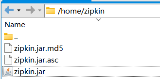
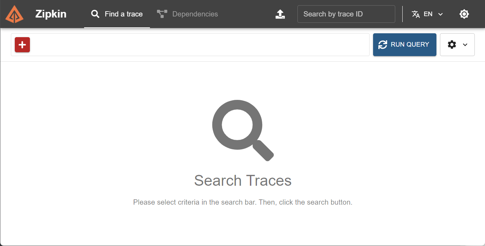

# Zipkin


<font color=red>**`ZipKin`主要用于分布式链路追踪信息的图形化展示。**</font>


## 一、`Zipkin` 安装

<font color=pink>以下使用`Java`方式安装，其他方式可参考官网：https://zipkin.io/pages/quickstart.html</font>

- 安装`java`环境

  详见

  [Java安装笔记]: ../../../../back/java/Java安装.md

  

- 下载`zipkin`的`jar`包

  ```shell
  # 下载至指令执行处
  curl -sSL https://zipkin.io/quickstart.sh | bash -s
  ```

  |  |
  | ------------------------------------------------------------ |

  

- 启动`zipkin`

  ```shell
  # 前往zipkin.jar的位置
  cd /home/zipkin
  
  # 启动zipkin
  nohup java -jar zipkin.jar > /home/zipkin/logs/zipkin.out 2>&1 &
  ```

  

- 测试`zipkin`

  访问：`http://localhost:9411/zipkin/`

  |  |
  | ------------------------------------------------------------ |


