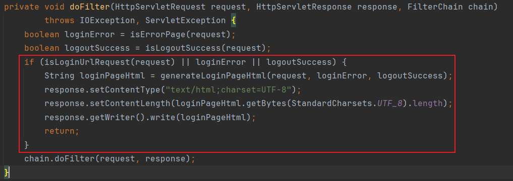
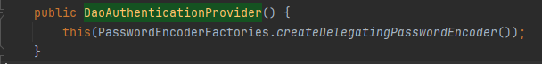
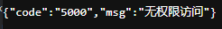
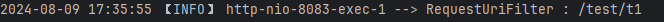
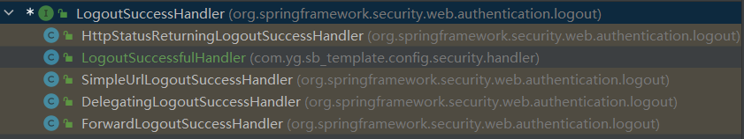

# SpringSecurity 笔记

<font color=pink>以下所有的源码分析都基于`SpringBoot3`</font>


## 一、SpringSecurity 依赖

```xml
<dependency>
    <groupId>org.springframework.boot</groupId>
    <artifactId>spring-boot-starter-security</artifactId>
</dependency>
```


## 二、SpringSecurity 架构

### 1、JavaWeb过滤器

- 原理图示

  <font color=pink>过滤器是请求进入`sevlet`之前进行拦截的，请求会被过滤器拦截一次，响应也会被过滤器拦截一次。</font>

  | 过滤器原理图示                                               |
  | ------------------------------------------------------------ |
  |  |

  

- 代码示例

  - 定义过滤器

    1. 自定义类实现`Filter`接口，重写`doFilter`方法。
    2. `doFilter`方法就是过滤方法，方法中的`filterChain.doFilter(servletRequest, servletResponse);`作用是放过请求。
    3. `filterChain.doFilter(servletRequest, servletResponse);`之前的内容会在请求时被拦截执行，之后的内容会在响应时被拦截执行，所以过滤器在请求和响应的时候都会拦截请求。
    4. `filterChain.doFilter(servletRequest, servletResponse);`放过请求，必须要有，不然请求会被卡死。
    5. `@WebFilter(urlPatterns = {"/test/example/*"})`该注解的作用是定义拦截的请求路径样式。

    

    ```java
    @Slf4j
    @WebFilter(urlPatterns = {"/test/example/*"})
    public class ExampleFilter implements Filter {
        
        @Override
        public void doFilter(ServletRequest servletRequest, 
                             ServletResponse servletResponse, 
                             FilterChain filterChain) throws IOException, ServletException {
            log.info("ExampleFilter:request-filter");
            //放过请求
            filterChain.doFilter(servletRequest, servletResponse);
            log.info("ExampleFilter:response-filter");
        }
    }
    ```

    

  - 定义控制层

    ```java
    @Controller
    @RequestMapping("/test")
    @Slf4j
    public class TestController {
    
        @Resource
        private TestService testService;
    
        @GetMapping("/example/t1")
        @ResponseBody
        public String t1() {
            log.info("testController started ~~");
            return "success";
        }
    }
    ```

    

  - 测试结果

    ```java
    //请求在进入servlet之前被过滤器拦截
    2024-07-12 23:11:26 【INFO】 http-nio-8081-exec-6 --> ExampleFilter:request-filter
    //进入controller
    【请求路径】:class org.yg.ssm_template.controller.TestController.t1
    //controller内容被执行
    2024-07-12 23:11:26 【INFO】 http-nio-8081-exec-6 --> testController started ~~
    //完成响应
    【响应参数】:"success"
    //请求在成功响应后再次被过滤器拦截
    2024-07-12 23:11:26 【INFO】 http-nio-8081-exec-6 --> ExampleFilter:response-filter
    ```

  

- 过滤器和拦截器的区别

  <font color=red>**<u>过滤器是在请求进入`servlet`之前进行过滤；拦截器是请求进入`controller`之前进行拦截。</u>**</font>

  | 拦截器和过滤器区别图示                                       |
  | ------------------------------------------------------------ |
  |  |


### 2、基本架构

#### （1）DelegatingFilterProxy

<font color=red>总结：`DelegatingFilterProxy`的主要作用就是从`Spring`容器中获取`FilerBean`然后执行`doFilter`方法。也就是说将过滤的工作委托给`Spring`容器中的`Bean`。</font>

```java
// 上述`DelegatingFilterProxy`工作的伪代码
public class DelegatingFilterProxy {
    
    public void doFilter(ServletRequest request, 
                         ServletResponse response,
                         FilterChain chain) {
    	// 从Spring容器中获取过滤器的Bean
		Filter delegate = getFilterBean(someBeanName);
    	// 执行过滤
		delegate.doFilter(request, response);
	}
}
```


> `DelegatingFilterProxy`原理图

|  |
| ------------------------------------------------------------ |


> `DelegatingFilterProxy`源码分析

- `DelegatingFilterProxy`调用其中的`doFilter`方法。其中的`this.delegate`就是`Filter`接口的一个对象，如果它是`null`，那么就会从`initDelegate`方法中获取的。获取到过滤器后通过`invokeDelegate`方法执行过滤。

  | 路径：`org.springframework.web.filter.DelegatingFilterProxy#doFilter` |
  | ------------------------------------------------------------ |
  |  |

  

  - `initDelegate`方法的主要作用就是调用`getTargetBeanName()`获取`BeanName`，通过`wac.getBean(targetBeanName, Filter.class)`根据`BeanName`从`Spring`容器中获取`FilterBean`，并进行初始化然后返回。

  | 路径：`org.springframework.web.filter.DelegatingFilterProxy#initDelegate` |
  | ------------------------------------------------------------ |
  |  |


#### （2）FilterChainProxy

> `FilterChainProxy`的原理图

<font color=red>总结：`FilterChainProxy`是`Spring Security`过滤的起点。其中存在一个过滤器链集合`filterChains`，也就是说过滤器链是可以存在很多个的，过滤请求的时候会判断到底使用哪一个过滤器链进行过滤。比方说下图中的，当请求样式是`/api/**`的时候就会选用第一个`securityFilterChain`进行过滤，如果所有的过滤器链都不匹配就会使用`/**`对应的过滤器链进行过滤。</font>

|  |
| ------------------------------------------------------------ |

| `FilterChainProxy`中存在的过滤器链集合`filterChains`         |
| ------------------------------------------------------------ |
|  |


> `FilterChainProxy`源码分析

- 从`FilterChainProxy`的继承关系可以看出本质上其也是`Filter`接口的一个实现类。所以从其中的`doFilter`方法开始执行过滤，`doFilter`方法调用`doFilterInternal`

  | 路径：`org.springframework.security.web.FilterChainProxy#doFilter` |
  | ------------------------------------------------------------ |
  |  |

  

- `doFilterInternal`方法中存在`getFilters`，并将请求对象传入，该方法的作用就是根据请求选取执行过滤的过滤器链`SecurityFilterChain`，使用返回的过滤器链执行过滤请求。

  | 路径：`org.springframework.security.web.FilterChainProxy#doFilterInternal` |
  | ------------------------------------------------------------ |
  |  |

  

- `getFilters`方法中对`FilterChainProxy`中的过滤器链集合`filterChains`进行遍历，通过`matches`方法为请求对象匹配过滤器链，并将第一个满足条件的过滤器链返回

  | 路径：`org.springframework.security.web.FilterChainProxy#getFilters(java.lang.String)` |
  | ------------------------------------------------------------ |
  |  |


#### （3）SecurityFilterChain

> `SecurityFilterChain`原理图

| 一个`SecurityFilterChain`中存在多个`filter`                  |
| ------------------------------------------------------------ |
|  |


> `SecurityFilterChain`源码分析

- `SecurityFilterChain`代表一个过滤器链。导入`spring-security`场景启动器之后，`SpringBoot`会自动向容器中放入一个名为`defaultSecurityFilterChain`的`SecurityFilterChain`的`Bean`.

  `SecurityFilterChain`有一个实现类`DefaultSecurityFilterChain`，那么下图中`bean`的注册实际上就是在容器中创建了一个`DefaultSecurityFilterChain`类的对象 。

  | 路径：`org.springframework.boot.autoconfigure.security.servlet.SpringBootWebSecurityConfiguration.SecurityFilterChainConfiguration` |
  | ------------------------------------------------------------ |
  |  |

  

- `DefaultSecurityFilterChain`类中含有一个过滤器集合`filters`。说明如果一个请求匹配的是某个过滤器链的话，那么就要按顺序使用这个过滤器链中的过滤器集合中的每个过滤器进行过滤。

  | 路径：`org.springframework.security.web.DefaultSecurityFilterChain` |
  | ------------------------------------------------------------ |
  |  |

  

  | `DefaultSecurityFilterChain`过滤器链中的16个过滤器           |
  | ------------------------------------------------------------ |
  |  |

  

  | 过滤器链构建时会将其中的过滤器进行排序                       |
  | ------------------------------------------------------------ |
  | （1）过滤器链构建。<br />路径：`org.springframework.boot.autoconfigure.security.servlet.SpringBootWebSecurityConfiguration.SecurityFilterChainConfiguration` |
  |  |
  | （2）过滤器排序<br />路径：`org.springframework.security.config.annotation.web.builders.HttpSecurity#performBuild` |
  |  |
  | （3）排序依据<br />路径：`org.springframework.security.config.annotation.web.builders.HttpSecurity#performBuild` |
  |  |

  

- `DefaultSecurityFilterChain`类中重写了`SecurityFilterChain`中的两个方法`matches`和`getFilters`。这两个方法其实就是在`FilterChainProxy`中被使用（详见：`FilterChainProxy`源码分析的第三张图）

  `FilterChainProxy`中的过滤器链集合`filterChains`中就包含`defaultSecurityFilterChain`这个`bean`对象。通过对`filterChains`进行遍历并调用`matches`方法来判断当前请求是否使用该过滤器链进行过滤。如果`matches`成功，那么就调用`getFilters`方法获取过滤器链中的过滤器集合，进行过滤。

  | 路径：`org.springframework.security.web.FilterChainProxy#getFilters(java.lang.String)` |
  | ------------------------------------------------------------ |
  |  |


### 3、认证架构

| <font color=skyblue>认证架构模型图</font>                    |
| ------------------------------------------------------------ |
|  |


#### （1）`SecurityContextHolder`

<font color=pink>`SpringSecurity`上下文持有者，用于存储`SpringSecurity`上下文。</font>


#### （2）`SecurityContext`

<font color=pink>`SpringSecurity`上下文，用于存储认证信息`Authentication`。</font>

```java
// 获取SpringSecurity上下文
SecurityContext securityContext = SecurityContextHolder.getContext();
```


#### （3）`Authentication`

<font color=pink>认证成功后存入`SpringSecurity`中的认证信息。</font>

```java
// 获取认证信息
Authentication authentication = SecurityContextHolder.getContext().getAuthentication();
```

<hr/>

<font color=red><u>**注意：默认情况下，`Authentication`只能在主线程中访问，子线程中无法访问。**</u></font>

```java
// 测试代码
@Controller
@RequestMapping("/test")
@Slf4j
public class TestController {

    @GetMapping("/t1")
    @ResponseBody
    public String t1(String param) {
        //在主线程中获取userName
        String username = SecurityContextUtil.getUsername();
        log.info("username: {}", username);
        //在子线程中获取userName
        Thread thread = new Thread(() -> {
            String username1 = SecurityContextUtil.getUsername();
            log.info("username1: {}", username1);
        });
        thread.start();
        return "success";
    }
}
```

| <font color=skyblue>由测试结果可知，主线程中可以成功获取`Authentication`并从认证信息中获取到`userName`；而在子线程中获取`Authentication`为`null`导致空指针异常。</font> |
| ------------------------------------------------------------ |
|  |


###### **`SpringSecurity`三种安全策略**

- `MODE_THREALOCAL`：用户信息只能由当前线程访问
- `MODE_INHERITABLETHREADLOCAL`：用户信息可以由当前线程及其子线程访问
- `MODE_GLOBAL`：用户信息没有线程限制，全局都可以访问

<font color=pink>默认情况下，采用`MODE_THREALOCAL`也就是说只有当前线程中才能获取用户认证信息。</font>


###### **`SpringSecurity`安全策略修改**

- 调整`JVM`参数

  ```shell
  # MODE_THREALOCAL
  -Dspring.security.strategy=MODE_THREALOCAL
  
  # MODE_INHERITABLETHREADLOCAL
  -Dspring.security.strategy=MODE_INHERITABLETHREADLOCAL
  
  # MODE_GLOBAL
  -Dspring.security.strategy=MODE_GLOBAL
  ```

- 调整步骤

  | 第一步                                                       |
  | ------------------------------------------------------------ |
  |  |
  | **第二步**                                                   |
  |  |
  | **第三步**                                                   |
  |  |

- 将安全策略调整至`MODE_INHERITABLETHREADLOCAL`再次测试结果

  | <font color=skyblue>由测试结果可知，变更策略之后主线程和子线程中均可以获取到用户的认证信息</font> |
  | ------------------------------------------------------------ |
  |  |


#### （4）AuthenticationManager

`AuthenticationManager`是`SpringSecurity`提供的一个定义具体认证逻辑的接口。

```java
// AuthenticationManager源码
public interface AuthenticationManager {
    //该抽象方法的实现用于提供具体的认证逻辑
	Authentication authenticate(Authentication authentication) throws AuthenticationException;
}
```


其最常用的实现是`ProviderManager`，`ProviderManager`中存在一个`List<AuthenticationProvider>`集合，`AuthenticationProvider`接口提供了是否支持当前认证和认证的两个抽象方法。

```java
// AuthenticationProvider源码
public interface AuthenticationProvider {
    //该抽象方法的具体实现提供特定认证的认证逻辑
	Authentication authenticate(Authentication authentication) throws AuthenticationException;
    //该抽象方法的具体实现提供是否支持认证的判断
	boolean supports(Class<?> authentication);
}
```

在认证的时候会遍历`List<AuthenticationProvider>`集合，通过`AuthenticationProvider`中的`support`方法判断是否支持当前认证类型，选择合适的`AuthenticationProvider`来提供认证操作，如果所有的`AuthenticationProvider`均不支持就会抛出`ProviderNotFoundException`的异常。

常用的`AuthenticationProvider`的实现`DaoAuthenticationProvider`就是用于提供用户名和密码认证的具体逻辑。

| 路径：`org.springframework.security.authentication.ProviderManager#authenticate` |
| ------------------------------------------------------------ |
|  |


| `ProviderManager`原理图                                      |
| ------------------------------------------------------------ |
|  |


#### （5）AuthenticationProvider

<font color=pink>用于执行特定类型的认证，比方说`DaoAuthenticationProvider`用于用户名/密码的认证。</font>


## 三、SpringSecurity 表单认证


<font color=red>**<u>整体认证流程：认证的本质就是过滤</u>**</font>

1. 过滤起点：过滤器链代理类`FilterChainProxy`
2. 根据请求选取过滤器链`SecurityFilterChain` 
3. 顺序执行过滤器链中的每个过滤器`doFilter`
4. 获取过滤器中的认证管理器`AuthenticationManager`
5. 根据待认证的信息`Authentication`选取认证管理器`AuthenticationManager`中的某个`AuthenticationProvider`
6. 通过`UserDetailService`获取用户真实信息
7. 通过`PasswordEncoder`加密器校验用户密码
8. 通过`AuthenticationSuccessHandler`和`AuthenticationFailureHandler`进行认证成功或失败的处理


### 1、表单认证

1. 登录授权

   - 未添加`SpringSecurity`依赖，`SpringBoot`应用程序启动访问时可以直接访问。

     | <font color=skyblue>访问`http://localhost:8080/`</font>      |
     | ------------------------------------------------------------ |
     |  |

   - 添加`SrpingSecurity`依赖之后，`SpringBoot`应用程序启动访问时，默认情况下任何非授权的请求都会重定向给`/login`进行登录授权。

     | <font color=skyblue>访问`http://localhost:8080/`重定向至`http://localhost:8080/login`</font> |
     | ------------------------------------------------------------ |
     |  |

     `SpringSecurity`的默认`username`为`user`，`password`展示在控制台。

     |  |
     | ------------------------------------------------------------ |

2. 取消登录授权

   `SpringSecurity`中除了存在一个用于登录的`/login`外，还存在一个用于登出的取消授权操作`/logout`。

   |  |
   | ------------------------------------------------------------ |
   |  |

   

### 2、表单认证 源码分析

#### （1）默认拦截路径

默认情况下，添加`SpringSecurity`场景启动器之后所有的请求都需要认证之后才能访问

`SpringSecurity`自动配置的默认过滤器链：要求所有的请求都需要认证。

| 路径：`org.springframework.boot.autoconfigure.security.servlet.SpringBootWebSecurityConfiguration.SecurityFilterChainConfiguration` |
| ------------------------------------------------------------ |
|  |

`anyRequest()`意为任何请求，`authenticated()`意为需要被授权。


如果手动修改默认的过滤器链

|  |
| ------------------------------------------------------------ |

此时，`/`的请求(`requestMatchers("/")`)会被放过(`permitAll()`)，其他的所有请求(`anyRequest()`)都需要认证(`authenticated()`)才能访问。

| 请求：`http://localhost:8083/`                               |
| ------------------------------------------------------------ |
|  |
| **请求：`http://localhost:8083/welcome`**                    |
|  |


#### （2）UserDetailsService

`SpringSecurity`提供一个`UserDetailsService`接口用于根据输入的用户名获取真实的用户信息，用于在认证的时候与用户手动输入的用户信息进行比较。

```java
// SpringSecurity 接口源码
public interface UserDetailsService {
    // 提供了一个根据用户名获取真实用户信息的loadUserByUsername方法
	UserDetails loadUserByUsername(String username) 
        throws UsernameNotFoundException;
}
```


#### （3）默认用户信息

`SpringSecurity`提供的默认的用户名和密码

| `第2条`中的`UserDetailsService`接口的继承图                  |
| ------------------------------------------------------------ |
|  |


`SpringSecurity`默认在容器中放入一个`UserDetailsService`接口的实现类`InMemoryUserDetailsManager`的`bean`。

| 路径：`org.springframework.boot.autoconfigure.security.servlet.UserDetailsServiceAutoConfiguration#inMemoryUserDetailsManager` |
| ------------------------------------------------------------ |
|  |

从上述构建过程中可以发现默认的用户信息就是从`SecurityProperties`这个属性配置类中获取的。

```java
// SecurityProperties属性配置
@ConfigurationProperties(prefix = "spring.security")
public class SecurityProperties {
    // 其他信息略~~
    private User user;
    
    // 内部类User
    public static class User {
		private String name = "user";
		private String password = UUID.randomUUID().toString();
	}
}
```

从`SecurityProperties`这个属性配置类中又可以知道`SpringSecurity`中默认在内存中放入了一个`name`为`user`，`password`为`UUID.randomUUID().toString()`的用户。

由于`SecurityProperties`通过`@ConfigurationProperties`注解与配置文件中`Spring.security`开头的配置项所绑定因此可以通过修改配置文件，来改变`SpringSecurity`默认的存放在内存中的用户信息。

```yaml
# 修改SpringSecurity默认的用户
spring:
	security:
		user: yangguo
		# 以下为加密后的密码
		password: $2a$10$XU8YfWeThsOFH/3c.O1.AOVeLAJE39cnF3p8O/cOknHmx9B7ulJT6
```


最终创建的默认用户会存放在`InMemoryUserDetailsManager`类中的成员变量`users`中，`users`是一个`map`集合。

| InMemoryUserDetailsManager中的`map`集合                      |
| ------------------------------------------------------------ |
|  |


`SpringSecurity`创建默认的`InMemoryUserDetailsManager`对象的过程

| 路径：`org.springframework.boot.autoconfigure.security.servlet.UserDetailsServiceAutoConfiguration#inMemoryUserDetailsManager` |
| ------------------------------------------------------------ |
|  |
| **路径：`org.springframework.security.provisioning.InMemoryUserDetailsManager#InMemoryUserDetailsManager(java.util.Collection<org.springframework.security.core.userdetails.UserDetails>)`**** |
|  |
| **路径：`org.springframework.security.provisioning.InMemoryUserDetailsManager#createUser`** |
|  |


#### （4）表单认证核心过滤器

###### `UsernamePasswordAuthenticationFilter`

<font color=pink>用户名密码认证过滤器</font>

其提供如下几个关键组件：

- `AuthenticationManager`：认证管理器，提供认证逻辑
- `AuthenticationSuccessHandler`：认证成功处理器
- `AuthenticationFailureHandler`：认证失败处理器


###### `DefaultLoginPageGeneratingFilter`

<font color=pink>默认登陆页过滤器</font>

| 路径：`org.springframework.security.web.authentication.ui.DefaultLoginPageGeneratingFilter#doFilter(jakarta.servlet.http.HttpServletRequest, jakarta.servlet.http.HttpServletResponse, jakarta.servlet.FilterChain)` |
| ------------------------------------------------------------ |
|  |

在`DefaultLoginPageGeneratingFilter`中的`doFilter`方法中可以发现只要是登录请求`(/login)`，登录失败的请求，登出成功的请求都会被`DefaultLoginPageGeneratingFilter`过滤器拦截下返回一个默认的登录页面。

默认的登录页由`generateLoginPageHtml()`方法生成。路径：`org.springframework.security.web.authentication.ui.DefaultLoginPageGeneratingFilter#generateLoginPageHtml`


###### `DefaultLogoutPageGeneratingFilter`

<font color=pink>默认登出页过滤器</font>

| 路径：`org.springframework.security.web.authentication.ui.DefaultLogoutPageGeneratingFilter#doFilterInternal` |
| ------------------------------------------------------------ |
|  |

由`DefaultLogoutPageGeneratingFilter`中的`doFilterInternal`（`DefaultLogoutPageGeneratingFilter`中的`doFilter`方法继承自父类，父类的`doFilter`方法调用`DefaultLogoutPageGeneratingFilter`的`doFilterInternal`方法）可知，如果请求路径是`/logout`并且请求方式是`Get`请求那么就会拦截并响应登出页面。

登出页面是由`renderLogout`方法生成，路径：`org.springframework.security.web.authentication.ui.DefaultLogoutPageGeneratingFilter#renderLogout`


<font color=pink>如果禁用了表单认证，那么上述三个过滤器均不会出现在默认过滤器链中。</font>

禁用表单认证

```java
public class FilterChainConfig {
    @Bean
    SecurityFilterChain defaultSecurityFilterChain(HttpSecurity http) throws Exception {

        // 认证配置
        http.authorizeHttpRequests((requests) -> requests.anyRequest().authenticated());

        // 禁用表单认证
	   // http.formLogin(withDefaults());

        return http.build();
    }
}
```

禁用表单认证之后，默认过滤器链中的过滤器集合中只剩下13个过滤器，上述的三个过滤器均不存在。

|  |
| ------------------------------------------------------------ |


#### （5）表单认证流程分析

<font color=red>（重点）</font>

###### Ⅰ、执行过滤器

按顺序执行默认过滤器链中的16个过滤器，其中用于用户密码验证的`UsernamePasswordAuthenticationFilter`中的`doFilter`方法继承自父类`AbstractAuthenticationProcessingFilter`。

| <font color=skyblue>`AbstractAuthenticationProcessingFilter`中的`doFilter`方法</font> |
| ------------------------------------------------------------ |
| **路径：`org.springframework.security.web.authentication.AbstractAuthenticationProcessingFilter#doFilter(jakarta.servlet.http.HttpServletRequest, jakarta.servlet.http.HttpServletResponse, jakarta.servlet.FilterChain)`** |
|  |


上述过滤方法中的第一个判断是用于判断请求是否是表单登录请求，如果是表单登录就继续执行用户认证逻辑，如果不是表单登录请求那么就`chain.doFilter(request, response);`放过请求。

| <font color=skyblue>判断请求是否是表单登录请求`/login`</font> |
| ------------------------------------------------------------ |
|  |
|  |
| <br /><font color=skyblue>由此可判断，`requiresAuthenticationRequestMatcher`是用于判断请求是否是`/login`</font> |


###### Ⅱ、尝试认证

如果上述`if`判断的结果是表单登录请求，那么就是尝试后续的尝试认证的操作`attemptAuthentication`

| <font color=skyblue>尝试认证操作，`UsernamePasswordAuthenticationFilter`实现了该抽象方法</font> |
| ------------------------------------------------------------ |
|  |
| **路径：`org.springframework.security.web.authentication.UsernamePasswordAuthenticationFilter#attemptAuthentication`** |
|  |

在上述方法中表明只有`post`请求才支持认证。认证前获取登录时输入的用户名和用户密码，并将用户输入的用户名和密码封装成`UsernamePasswordAuthenticationToken`对象。最终由`UsernamePasswordAuthenticationFilter`中成员变量`authenticationManager`对`UsernamePasswordAuthenticationToken`对象进行认证。

<font color=pink>`AuthenticationManager`接口定义了`SpringSecurity`中`Filter`如何进行认证，其中存在一个`AuthenticationProvider`的集合。`AuthenticationProvider`提供具体的认证逻辑，每个 `AuthenticationProvider` 都执行一种特定类型的认证。例如，`DaoAuthenticationProvider`支持基于用户名/密码的认证，而 `JwtAuthenticationProvider` 支持认证JWT令牌。在认证的时候会遍历选出适合当前场景的`AuthenticationProvider`.</font>

| `AuthenticationManager`中的`AuthenticationProvider`集合      |
| ------------------------------------------------------------ |
|  |


| 路径：`org.springframework.security.authentication.ProviderManager#authenticate` |
| ------------------------------------------------------------ |
|  |

上述方法中通过遍历选出进行认证的`AuthenticationProvider`

| 路径：`org.springframework.security.authentication.dao.AbstractUserDetailsAuthenticationProvider#authenticate` |
| ------------------------------------------------------------ |
|  |


###### Ⅲ、获取真实用户信息

获取真实用户信息的方法`retrieveUser`。在方法中可以看出`getUserDetailsService()`获取的对象就是上述`第2步`中`UserDetailsService`接口的对象，该接口的作用就是提供一个`loadUserByUsername`方法用于根据用户名查询真实的用户信息。

| 路径：`org.springframework.security.authentication.dao.DaoAuthenticationProvider#retrieveUser` |
| ------------------------------------------------------------ |
|  |


###### Ⅳ、密码校验

获取到真实的用户信息之后就要开始认证检查

| 路径：`org.springframework.security.authentication.dao.AbstractUserDetailsAuthenticationProvider#authenticate` |
| ------------------------------------------------------------ |
|  |

使用容器中的`passwordEncoder`密码加密器来匹配用户输入的密码和真实密码之间是否匹配，来判断是否认证成功。

| 路径：`org.springframework.security.authentication.dao.DaoAuthenticationProvider#additionalAuthenticationChecks` |
| ------------------------------------------------------------ |
|  |


###### Ⅴ、认证信息存储

认证成功后调用认证成功处理器`AuthenticationSuccessHandler`

| 路径：`org.springframework.security.web.authentication.AbstractAuthenticationProcessingFilter#doFilter(jakarta.servlet.http.HttpServletRequest, jakarta.servlet.http.HttpServletResponse, jakarta.servlet.FilterChain)` |
| ------------------------------------------------------------ |
|  |


认证成功处理器中首先创建了一个空的安全上下文`context`，然后将成功认证的认证信息`authResult`存入安全上下文中，最终将安全上下文存入`SecurityContextHolder`之中。

| 路径：`org.springframework.security.web.authentication.AbstractAuthenticationProcessingFilter#successfulAuthentication` |
| ------------------------------------------------------------ |
|  |


### 3、密码加密器

#### （1）`PasswordEncoder`接口

`SpringSecurity`中的密码加密器需要实现`PasswordEncoder`接口。

```java
// PasswordEncoder接口源码
public interface PasswordEncoder {
    
    // 定义加密方式
	String encode(CharSequence rawPassword);

    // 定义加密后的密码匹配规则
	boolean matches(CharSequence rawPassword, String encodedPassword);

    // 定义密码是否需要升级
	default boolean upgradeEncoding(String encodedPassword) {
		return false;
	}
}
```


#### （2）默认密码加密器

`SpringSecurity`表单登录，如果不手动配置`PasswordEncoder`的`Bean`那么就会使用默认的密码加密器-委托密码加密器`DelegatingPasswordEncoder`。

| 路径：`org.springframework.security.config.annotation.authentication.configuration.InitializeUserDetailsBeanManagerConfigurer.InitializeUserDetailsManagerConfigurer#configure` |
| ------------------------------------------------------------ |
|  |
| 首先从容器中判断是否有`PasswordEncoder`接口的实现类的Bean，如果存在的话，就是用容器中密码加密器创建`AuthenticationProvider`；不存在的话就是用默认的方式创建`AuthenticationProvider`。 |

使用容器中密码加密器创建`AuthenticationProvider`

| 路径：`org.springframework.security.authentication.dao.DaoAuthenticationProvider#DaoAuthenticationProvider(org.springframework.security.crypto.password.PasswordEncoder)` |
| ------------------------------------------------------------ |
|  |
|  |

使用默认的方式创建`AuthenticationProvider`

| 路径：`org.springframework.security.authentication.dao.DaoAuthenticationProvider#DaoAuthenticationProvider()` |
| ------------------------------------------------------------ |
|  |
|  |

由此可见默认的加密器就是委托加密器`DelegatingPasswordEncoder`，而委托加密器默认使用的加密器是`BCryptPasswordEncoder`加密器。


#### （3）`DelegatingPasswordEncoder`加密

`DelegatingPasswordEncoder`也是`PasswordEncoder`的实现类，但它的`encode`方法并不提供加密的算法，而是调用其他的密码加密器对密码进行加密，可以说`DelegatingPasswordEncoder`是其他加密器的代理类，`DelegatingPasswordEncoder`更多的是决定调用哪个密码加密器，而不是如何加密。

| 路径：`org.springframework.security.crypto.password.DelegatingPasswordEncoder#encode` |
| ------------------------------------------------------------ |
|  |
| <font color=skyblue>调用`DelegatingPasswordEncoder`加密器中存储的其他类型的加密器完成加密。</font> |

从上述加密过程可以看出最终的加密是由其他的加密器完成，不论是哪种加密器`DelegatingPasswordEncoder`都会为加密结果添加`{加密方式字符串}`的前缀，比方说`{bcrypt}`，`{MD5}`等前缀。

#### （4）`DelegatingPasswordEncoder`校验

上述`DelegatingPasswordEncoder`加密中可知使用`DelegatingPasswordEncoder`加密后所有的密文都会添加一个关于加密类型的前缀，这个前缀的作用就是用来在密码校验中确定使用哪种加密方式来校验密码。

| 路径：`org.springframework.security.crypto.password.DelegatingPasswordEncoder#matches` |
| ------------------------------------------------------------ |
|  |

<font color=skyblue>首先从密文中提取出前缀，然后利用这个前缀去`DelegatingPasswordEncoder`提供的存放所有加密器的`map`集合中获取加密器，然后抽取出密文部分，使用从`map`集合中获取的加密器完成密码校验。</font>


## 四、SpringSecurity Http认证

[Http认证官网](https://springdoc.cn/spring-security/servlet/authentication/passwords/basic.html)


## 五、SpringSecurity 授权

<font color=red>**`SpringSecurity`默认情况下，认证之后即可访问所有资源。而授权是对认证成功的用户访问系统资源进行进一步的限制，也就是说光认证成功还不够，还需要用于特定的权限才能访问相应的资源。**</font>

### 1、基于`request`授权

> 添加权限

认证过程中，通过`UserDetailsService`接口的`loadUserByUsername`方法不仅用于获取用户的密码信息，还用于获取用户的权限信息。最终`loadUserByUsername`方法的返回值是一个`UserDetails`接口的对象。`User`是`UserDetails`常见的一个实现类，实际开发中往往自定义一个类继承`User`用于简化开发。

创建`User`对象，可以使用其中的一个内部类`UserBuilder`，该内部类的作用就是用于构造外部类的对象。

```java
// 使用内部类UserBuilder创建外部类User的对象
User securityUserDetail = User.builder().username("zhangsan").password("123456").build();
```

`SpringSecurity`中使用`GrantedAuthority`定义被授予的权限，常用的实现`SimpleGrantedAuthority`，使用一个字符串代表一个权限。

`UserBuilder`中的授权方法有三种：

- 第一种

  |  |
  | ------------------------------------------------------------ |

  外部直接封装好一个被授予权限的集合给`User`对象。

- 第二种

  |  |
  | ------------------------------------------------------------ |
  |  |

  外部传入权限字符串集合，内部将字符串集合转化成`SimpleGrantedAuthority`集合。

- 第三种

  |  |
  | ------------------------------------------------------------ |

  外部传入角色集合，内部将角色添加`ROLE_`，最终转化成权限集合`SimpleGrantedAuthority`

<font color=red>**由上述三种授权的方法可知，授予角色和授予权限其实本质上都是授予权限，只不过授予角色其实是授予`ROLE_角色名`的权限。`role()`本质上就是`authorities()`方法。**</font>


> 配置基于请求的授权

```java
public class FilterChainConfig {

    @Bean
    SecurityFilterChain defaultSecurityFilterChain(HttpSecurity http) throws Exception {
        //基于请求配置授权
        //对于`/test/**`请求必要拥有`TEST`的角色或者`ROLE_TEST`的权限
        http.authorizeHttpRequests((requests) -> requests.requestMatchers("/test/**").hasRole("TEST"));
        
        //其他所有请求均需要认证
        http.authorizeHttpRequests((requests) -> requests.anyRequest().authenticated());

        return http.build();
    }
}
```

常用配置方法：

- `hasRole`

  路径匹配成功的请求，只有拥有指定的角色才能成功访问

- `hasAuthority`

  路径匹配成功的请求，只有拥有指定的权限才能成功访问。注意：如果配置的是`role`，那么必须要拥有`ROLE_角色名`的权限才能访问

- `hasAnyRole`

  路径匹配成功的请求，只要拥有任意指定的角色就能成功访问

- `hasAnyAuthority`

  路径匹配成功的请求，只要拥有任意指定的权限就能成功访问


### 2、基于`method`授权

#### （1）注解

##### `@PreAuthorize`

<font color=pink>注解使用前必须在配置类上添加`@EnableMethodSecurity`，准确说是添加`@EnableMethodSecurity(prePostEnabled = true)`，只不过`prePostEnabled`默认就是true，所以可以不用显示声明。</font>

<font color=skyblue>用于方法执行前进行权限校验，校验不通过不执行方法。</font>

```java
@Controller
@Slf4j
@RequestMapping("/test")
public class TestController {
    
    @GetMapping("/t1")
    @ResponseBody
    // 只有拥有TEST的角色才能访问该方法
	@PreAuthorize("hasRole('TEST')")
    public String t1() {
        log.info("请求成功~~");
        return "success";
    }
}
```

| 结果                                                         |
| ------------------------------------------------------------ |
| <font color=skyblue>响应无权限并且方法不会执行</font>        |
|  |
|  |


##### `@PostAuthorize `

<font color=pink>注解使用前必须在配置类上添加`@EnableMethodSecurity`，准确说是添加`@EnableMethodSecurity(prePostEnabled = true)`，只不过`prePostEnabled`默认就是true，所以可以不用显示声明。</font>

<font color=skyblue>用于方法执行后进行权限校验，校验不通过，无法正常响应方法返回值，而是响应无权限相关的信息。</font>

```java
@Controller
@Slf4j
@RequestMapping("/test")
public class TestController {
    
    @GetMapping("/t1")
    @ResponseBody
    // 只有拥有TEST的角色才能访问该方法
	@PostAuthorize("hasRole('TEST')")
    public String t1() {
        log.info("请求成功~~");
        return "success";
    }
}
```


| 结果                                                         |
| ------------------------------------------------------------ |
| <font color=skyblue>响应无权限但是方法仍会执行</font>        |
|  |
|  |


##### `@Secured `

<font color=pink>注解使用前必须在配置类上添加`@EnableMethodSecurity(securedEnabled = true)`，其中`securedEnabled`必须显示声明，因为其默认是false。</font>

<font color=pink>`@Secured`注解可以被`@PostAuthorize `和`@PreAuthorize `两个注解完全替代（<font color=yellow>不推荐使用</font>）</font>

<font color=skyblue>用于方法执行前校验是否具有某个角色，校验通过执行方法，否则提示无权限。</font>

注意：`@Secured `的属性是一个字符串数组，每个字符串必须是`ROLE_`开头，代表用户是否具有某个角色。

```java
@Controller
@Slf4j
@RequestMapping("/test")
public class TestController {
    
    @GetMapping("/t1")
    @ResponseBody
    // 只有拥有TEST的角色才能访问该方法
    @Secured({"ROLE_TEST"})
    public String t1() {
        return "success";
    }
}
```


#### （2）注意

<font color=pink>注意事项仅针对于`@PreAuthorize`和`@PostAuthorize`</font>

- 一个方法上可同时使用`@PreAuthorize`和`@PostAuthorize`；添加不同类型注解组合使用相当于`&&`的关系，即两者必须同时满足才有权限

  | <font color=skyblue>在用一个方法上添加多个不同类型的权限校验注解，那么它们之间的关系相当于`&&`</font> |
  | ------------------------------------------------------------ |
  | 以下示例中调用方法前需要检查是否具有`TEST`角色，只有具有`TEST`角色才能执行方法，执行完方法之后只有具有`test`权限才能成功响应，否则提示没有权限。 |
  |  |

  

- 同一注解在一个方法上不可多次使用

  | <font color=skyblue>同一个权限校验注解在一个方法上使用多次会提示错误</font> |
  | ------------------------------------------------------------ |
  |  |

  此时如果想实现多个条件，比方说既要有`TEST`角色，又要有`test`权限，那么可以使用`SPEL`表达式

  ```java
  @Controller
  @Slf4j
  @RequestMapping("/test")
  public class TestController {
      @GetMapping("/t1")
      @ResponseBody
      // 此时既要有`TEST`角色，又要有`test`权限才能访问该方法
      @PostAuthorize("hasAuthority('test') && hasRole('TEST')")
      public String t1() {
          return "success";
      }
  }
  ```


## 六、SpringSecurity 配置

### 0、`HttpSecurity`和`WebSecurity`

> WebSecurity

- `WebSecurity `用于配置整个Web应用安全性。

- `WebSecurity `用于构建整个`FilterChainProxy`

  | 路径：`org.springframework.security.config.annotation.web.builders.WebSecurity#performBuild` |
  | ------------------------------------------------------------ |
  |  |


> HttpSecurity

- `HttpSecurity `是 `WebSecurity `的一部分，用于配置HTTP请求的安全性。

- `HttpSecurity`用于构建默认过滤器链`DefaultSecurityFilterChain`

  | 路径：`org.springframework.security.web.DefaultSecurityFilterChain` |
  | ------------------------------------------------------------ |
  |  |

#### 默认过滤器链过滤器排序问题

从上述的`HttpSecurity`的构建方法`performBuild()`可知，构建默认过滤器链`DefaultSecurityFilterChain`时会先对过滤器链中要存入的过滤器`Filter`进行排序。

`HttpSecurity`中含有一个过滤器集合`filters`，这个过滤器集合就是用来构建默认过滤器链`DefaultSecurityFilterChain`的。

| `HttpSecurity`源码                                           |
| ------------------------------------------------------------ |
|  |

可以通过`HttpSecurity`中`addFilterAfter()`，`addFilterBefore()`，`addFilterAtOffsetOf()`，`addFilter()`，`addFilterAt()`等方法向`HttpSecurity`的`filters`中添加过滤器。`filters`中的所有过滤器用于构建默认过滤器链，用于进行http请求的安全配置。

以`addFilter()`为例：

| 路径：`org.springframework.security.config.annotation.web.builders.HttpSecurity#addFilter` |
| ------------------------------------------------------------ |
|  |


当添加过滤器的时候，会先根据过滤器的类型获取过滤器的顺序`order`。这个过程使用的是`HttpSecurity`中的`FilterOrderRegistration`类型的成员变量`filterOrders`。

| `HttpSecurity`的成员变量`FilterOrderRegistration`            |
| ------------------------------------------------------------ |
|  |


由`FilterOrderRegistration`的源码可知，当使用无参构造创建对象时，会向`FilterOrderRegistration`的一个`Map`类型的成员变量中添加所有可能用到的内置的`Filter`的顺序。集合的key是过滤器的全类名字符串，value是过滤器对应的顺序值。

| `FilterOrderRegistration`的无参构造                          |
| ------------------------------------------------------------ |
|  |

获取到过滤器的顺序之后就会创建一个用于排序的`OrderedFilter`过滤器，存放到`HttpSecurity`的`filters`集合中。


### 1、认证成功处理器

<font color=red>`UsernamePasswordAuthenticationFilter`过滤器中存在的两个处理器，因此自定义两个处理器的时候需要将处理器对象添加到过滤器对象中。</font>

<font color=pink>两个处理器都是来自`UsernamePasswordAuthenticationFilter`的父类`AbstractAuthenticationProcessingFilter`之中。</font>

| 路径：`org.springframework.security.web.authentication.AbstractAuthenticationProcessingFilter` |
| ------------------------------------------------------------ |
|  |

<font color=pink>这两个过滤器主要用于认证失败或者认证成功的后续处理。</font>

| 路径：`org.springframework.security.web.authentication.AbstractAuthenticationProcessingFilter#doFilter(jakarta.servlet.http.HttpServletRequest, jakarta.servlet.http.HttpServletResponse, jakarta.servlet.FilterChain)` |
| ------------------------------------------------------------ |
|  |


<hr>
**认证成功处理器**

<hr>
<font color=pink>授权成功处理器接口：`AuthenticationSuccessHandler`</font>

| `AuthenticationSuccessHandler`接口的继承体系                 |
| ------------------------------------------------------------ |
|  |

**<u>使用步骤</u>**

- 创建自定义类实现`AuthenticationSuccessHandler`接口

  ```java
  /**
   * 登录成功处理器
   */
  @Slf4j
  @Component
  public class LoginSuccessHandler implements AuthenticationSuccessHandler {
  
      @Override
      public void onAuthenticationSuccess(HttpServletRequest request, HttpServletResponse response, Authentication authentication) throws IOException, ServletException {
          // principal中存储用户名信息
          Object principal = authentication.getPrincipal();
          // credentials中存储用户密码信息
          Object credentials = authentication.getCredentials();
          // authorities中存储用户权限信息
          Collection<? extends GrantedAuthority> authorities = authentication.getAuthorities();
          
          BaseResp<Object> successResponse = BaseResp.<Object>success(principal);
  
          response.setContentType("application/json;charset=UTF-8");
          response.getWriter().println(JSONUtil.toJsonStr(successResponse));
      }
  }
  ```

- 配置认证成功处理器

  ```java
  @Configuration
  public class FilterChainConfig {
      @Resource
      private LoginSuccessHandler loginSuccessHandler;
      
      @Bean
      SecurityFilterChain defaultSecurityFilterChain(HttpSecurity http) throws Exception {
  
          //认证配置
          http.authorizeHttpRequests((requests) -> requests.anyRequest().authenticated());
  
          //表单登录配置
          http.formLogin(o -> {
              //认证成功处理器配置
              o.successHandler(loginSuccessHandler);
          });
  
          return http.build();
      }
  }
  ```


### 2、认证失败处理器

<font color=pink>授权失败处理器接口：`AuthenticationFailureHandler`</font>

| `AuthenticationFailureHandler`接口的继承体系                 |
| ------------------------------------------------------------ |
|  |

**<u>使用步骤</u>**

- 创建自定义类实现`AuthenticationFailureHandler`接口

  ```java
  /**
   * 登录失败处理器
   */
  @Slf4j
  @Component
  public class LoginFailHandler implements AuthenticationFailureHandler {
      @Override
      public void onAuthenticationFailure(HttpServletRequest request, HttpServletResponse response, AuthenticationException exception) 
          throws IOException, ServletException {
          //exception是认证失败的异常
          String failMessage = exception.getLocalizedMessage();
          BaseResp<Void> failResponse = BaseResp.<Void>fail(failMessage);
  
          response.setContentType("application/json;charset=UTF-8");
          response.getWriter().println(JSONUtil.toJsonStr(failResponse));
      }
  }
  ```

- 配置认证失败处理器

  ```java
  @Configuration
  public class FilterChainConfig {
      @Resource
      private LoginFailHandler loginFailHandler;
      
      @Bean
      SecurityFilterChain defaultSecurityFilterChain(HttpSecurity http) throws Exception {
  
          //认证配置
          http.authorizeHttpRequests((requests) -> requests.anyRequest().authenticated());
  
          //表单登录配置
          http.formLogin(o -> {
              //认证失败处理器配置
              o.failureHandler(loginFailHandler);
          });
  
          return http.build();
      }
  }
  ```


### 3、注销成功处理器

<font color=pink>注销成功处理器接口：`LogoutSuccessHandler`</font>

| `LogoutSuccessHandler`接口继承体系                           |
| ------------------------------------------------------------ |
|  |

**<u>使用步骤</u>**

- 自定义类实现`LogoutSuccessHandler`接口

  ```java
  @Slf4j
  @Component
  public class LogoutSuccessfulHandler implements LogoutSuccessHandler {
      @Override
      public void onLogoutSuccess(HttpServletRequest request, HttpServletResponse response, Authentication authentication) throws IOException, ServletException {
          BaseResp<Object> logoutSuccess = BaseResp.success("注销成功", null);
  
          response.setContentType("application/json;charset=UTF-8");
          response.getWriter().println(JSONUtil.toJsonStr(logoutSuccess));
      }
  }
  ```

- 配置注销成功处理器

  ```java
  public class FilterChainConfig {
      @Resource
      private LogoutSuccessfulHandler logoutSuccessfulHandler;
      
      @Bean
      SecurityFilterChain defaultSecurityFilterChain(HttpSecurity http) throws Exception {
  
          //认证配置
          http.authorizeHttpRequests((requests) -> requests.anyRequest().authenticated());
  
          //注销配置
          http.logout(o -> o.logoutSuccessHandler(logoutSuccessfulHandler));
  
          return http.build();
      }
  }
  ```


### 4、未认证请求处理

> 自定义访问未认证资源的处理

**<u>核心接口</u>**：`AuthenticationEntryPoint`

默认过滤器链中的`ExceptionTranslationFilter`用于对`SpringSecurity`中两类异常进行处理：认证异常`AuthenticationException`和获取资源被拒异常`AccessDeniedException`。

| `ExceptionTranslationFilter`中的`doFilter` 方法调用同类中的`handleSpringSecurityException`来处理`AuthenticationException`和`AccessDeniedException`两类异常。 |
| ------------------------------------------------------------ |
|  |

处理这两类异常的`handleAuthenticationException`和`handleAccessDeniedException`方法均调用了`sendStartAuthentication`方法。

| 开始认证的方法                                               |
| ------------------------------------------------------------ |
|  |


`this.authenticationEntryPoint`就是`AuthenticationEntryPoint`接口的实现类对象。

| `AuthenticationEntryPoint`是`ExceptionTranslationFilter`的成员变量 |
| ------------------------------------------------------------ |
|  |


此时如果想改变未认证资源的处理，只需要自定义一个实现`AuthenticationEntryPoint`接口的类，然后将这个类的对象赋值给`ExceptionTranslationFilter`即可。

- 自定义类实现`AuthenticationEntryPoint`接口

  ```java
  /**
   * 访问未认证资源的处理器
   */
  @Component
  public class AuthenticationFailHandler implements AuthenticationEntryPoint {
      @Override
      public void commence(HttpServletRequest request, 
                           HttpServletResponse response, 
                           AuthenticationException authException) 
          throws IOException, ServletException {
          
          BaseResp<Void> failResponse = BaseResp.<Void>fail("权限不足");
          response.setContentType("application/json;charset=UTF-8");
          response.getWriter().println(JSONUtil.toJsonStr(failResponse));
          
      }
  }
  ```

- 自定义类配置给`ExceptionTranslationFilter`

  ```java
  public class FilterChainConfig {
      @Resource
      private AuthenticationFailHandler authenticationFailHandler;
      
      @Bean
      SecurityFilterChain defaultSecurityFilterChain(HttpSecurity http) throws Exception {
  
          //无权限资源访问处理
          http.exceptionHandling( o-> o.authenticationEntryPoint(authenticationFailHandler));
  
          return http.build();
      }
  }
  ```


> 默认情况下访问未认证资源的处理

- 表单认证

  表单认证使用的`AuthenticationEntryPoint`：`LoginUrlAuthenticationEntryPoint`。如果访问未认证资源则会重定向到登录页`/login`。

- Http基本认证

  Http基本认证认证使用的`AuthenticationEntryPoint`：`BasicAuthenticationEntryPoint`。如果访问未认证资源则会发送错误响应。

### 5、未授权请求处理


### 6、会话并发处理

<font color=pink>主要用于处理一个账号多处登录的问题，即一个账号最多允许几个会话并发存在。</font>

- 自定义类实现`SessionInformationExpiredStrategy`接口

  ```java
  /**
   * 会话超时处理器
   */
  @Component
  public class SessionExpiredHandler implements SessionInformationExpiredStrategy {
      @Override
      public void onExpiredSessionDetected(SessionInformationExpiredEvent event) 
          throws IOException, ServletException {
          
          HttpServletResponse response = event.getResponse();
          BaseResp<Void> failResponse = BaseResp.<Void>fail("会话失效，请重新登录~~");
          response.setContentType("application/json;charset=UTF-8");
          response.getWriter().println(JSONUtil.toJsonStr(failResponse));
      }
  }
  ```

  

- 配置会话并发策略

  ```java
  public class FilterChainConfig {
      @Resource
      private SessionExpiredHandler sessionExpiredHandler;
  
      @Bean
      SecurityFilterChain defaultSecurityFilterChain(HttpSecurity http) throws Exception {
  
          //会话并发策略配置
          http.sessionManagement(o -> {
              //设置最大会话数量
              SessionManagementConfigurer<HttpSecurity>.ConcurrencyControlConfigurer 
                  config = o.maximumSessions(1);
              //设置会话超时处理
              config.expiredSessionStrategy(sessionExpiredHandler);
          });
  
          return http.build();
      }
  }
  ```


### 7、跨域请求处理

配置跨域请求

- 默认配置

  ```java
  // 默认配置
  public class HttpSecurityConfig {
      @Bean
      SecurityFilterChain defaultSecurityFilterChain(HttpSecurity http) throws Exception {
          //开启跨域配置（使用默认配置）
          http.cors(withDefaults());
          
          return http.build();
      }
  }
  ```


  <font color=pink><u>默认跨域配置无法解决跨域请求</u></font>

- 自定义配置

  ```java
  // 自定义配置
  public class HttpSecurityConfig {
      @Bean
      SecurityFilterChain defaultSecurityFilterChain(HttpSecurity http) throws Exception {
          //开启跨域配置
  	    http.cors(c -> c.configurationSource(getCorsConfigurationSource()));
          return http.build();
      }
  
      private CorsConfigurationSource getCorsConfigurationSource() {
          UrlBasedCorsConfigurationSource source = new UrlBasedCorsConfigurationSource();
          CorsConfiguration configuration = new CorsConfiguration();
          // 允许跨域请求携带认证信息
          //configuration.setAllowCredentials(true);
          // 允许跨域请求的源路径：示例：Arrays.asList("https://example.com");
          configuration.setAllowedOrigins(Arrays.asList("*"));
          // 允许跨域请求的请求方式：示例：Arrays.asList("GET", "POST");
          configuration.setAllowedMethods(Arrays.asList("*"));
          // 允许跨域请求的请求头：示例：Arrays.asList("X-Requested-With", "Content-Type");
          configuration.setAllowedHeaders(Arrays.asList("*"));
          // 允许跨域请求的缓存时间：示例：Duration.ofDays(1l);
          configuration.setMaxAge(Duration.ofDays(1l));
          // 注册配置：所有请求路径均应用上述配置
          source.registerCorsConfiguration("/**", configuration);
          return source;
      }
  }
  ```


### 8、自定义过滤器

- 第一步：自定义过滤器

  <font color=pink>自定义的过滤器需要实现`Filter`接口，重写`diFilter`方法。</font>

  ```java
  @Slf4j
  @Component
  public class RequestUriFilter implements Filter {
  
      @Override
      public void doFilter(ServletRequest request, 
                           ServletResponse response, 
                           FilterChain chain) 
          throws IOException, ServletException {
          
          log.info("过滤器 ~~~");
          return;
      }
  }
  ```

  

- 第二步：配置自定义过滤器

  ```java
  public class FilterChainConfig {
  
      @Resource
      private RequestUriFilter requestUriFilter;
      
      @Bean
      SecurityFilterChain defaultSecurityFilterChain(HttpSecurity http) throws Exception {
  
          //添加自定义过滤器
          //将自定义的过滤器添加到默认过滤器链的DisableEncodeUrlFilter过滤器之前
          http.addFilterBefore(requestUriFilter, DisableEncodeUrlFilter.class);
  
          return http.build();
      }
  }
  ```

  

- 第三步：排除注册至spring-mvc中的过滤器（可选）

  <font color=red>自定义的过滤器如果使用`@Component`或者其他相关注解将过滤器注册到容器中的话，那么即便项目中没有导入`SpringSecurity`的依赖，每次请求也都会触发过滤器。</font>

  将自定义过滤器添加到容器中，此时就是属于`SpringMvc`来通过过滤器处理请求，而此时如果再将自定义过滤器添加到`HttpSecurity`中，那么构建的`SpringSecurity`的默认过滤器链`DefaultSecurityFilterChain`中也会存在自定义过滤器，`SpringSecurity`在进行请求过滤的时候会再次调用自定义过滤器进行处理请求，也就是说一次请求，自定义过滤器会被调用两次。

  

  解决方法：

  1. 方法1

     不将自定义过滤器添加到容器，而是使用`new`将自定义过滤器添加到默认过滤器链中。

     ```java
     public class FilterChainConfig {
         
         @Bean
         SecurityFilterChain defaultSecurityFilterChain(HttpSecurity http) throws Exception {
     
             //改进：使用new创建自定义过滤器对象
             http.addFilterBefore(new RequestUriFilter(), DisableEncodeUrlFilter.class);
     
             return http.build();
         }
     }
     ```

     

  2. 方法2

     自定义过滤器添加到容器中，可使用如下方法让改过滤器在`SpringMvc`中不生效

     ```java
     public class MyConfig{
     	@Bean
     	public FilterRegistrationBean<RequestUriFilter> registrationRequestUriFilter(
     	    //自动注入自定义过滤器的对象
     	    @Autowired RequestUriFilter requestUriFilter) {
     	    
     	    FilterRegistrationBean<RequestUriFilter> bean = 
     	        new FilterRegistrationBean<>(requestUriFilter);
             //设置过滤器注册不生效
     	    bean.setEnabled(false);
     	    return bean;
     	}  
     }
     ```

