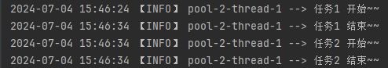
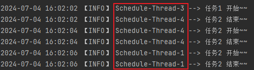
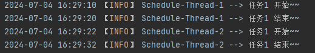
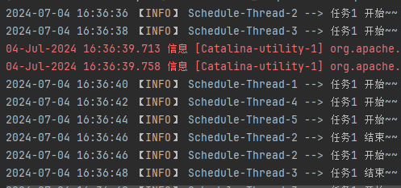

# SpringTask

## 一、注解开发

1. `@EnableScheduling`

   开启`SpringTask`功能

   ```java
   // 配置类
   @Configuration
   @EnableScheduling
   public class BaseConfig {
   
   }
   ```

   

2. `@Scheduled`

   定义定时执行的任务

   **<u>常用属性</u>**：

   - `cron`：cron表达式，精确指定任务执行时间（重点）

     ```java
     @Component
     @Slf4j
     public class ExampleSchedule {
         
         // 每5秒执行一次
         @Scheduled(cron = "0/5 * * * * ?")
         public void schedule1() {
             log.info("任务1 开始~~");
             log.info("任务1 结束~~");
         }
     }
     ```

   - `fixedRate`：每n毫秒执行一次

     ```java
     @Component
     @Slf4j
     public class AnnotationExampleSchedule {
         
         // 每5000毫秒执行一次
         @Scheduled(fixedRate = 5000)
         public void schedule1() throws InterruptedException {
             log.info("任务1 开始~~");
             log.info("任务1 结束~~");
         }
     }
     ```

   - `fixedDelay`：上次任务执行完毕之后间隔n毫秒再次执行

     ```java
     @Component
     @Slf4j
     public class AnnotationExampleSchedule {
     
         // 上次任务执行完毕之后间隔5000毫秒再次执行
         @Scheduled(fixedDelay = 5000)
         public void schedule1() throws InterruptedException {
             log.info("任务1 开始~~");
             log.info("任务1 结束~~");
         }
     }
     ```

   - `initialDelay`：程序启动后延迟n毫秒执行任务，一般搭配`fixedRate`或者`fixedDelay`使用

     ```java
     @Component
     @Slf4j
     public class AnnotationExampleSchedule {
         
         // 项目启动后延迟5000毫秒后第一次执行任务，之后每间隔5000毫秒执行一次任务
         @Scheduled(initialDelay = 5000,fixedRate = 5000)
         public void schedule1() throws InterruptedException {
             log.info("任务1 开始~~");
             log.info("任务1 结束~~");
         }
     }
     ```

   

## 二、接口开发

实现`SchedulingConfigurer`接口，重写`configureTasks`方法。

```java
@Component
@Slf4j
public class InterfaceExampleSchedule  implements SchedulingConfigurer{

    // 任务配置
    @Override
    public void configureTasks(ScheduledTaskRegistrar taskRegistrar) {
        taskRegistrar.addCronTask(() -> task(), "0/5 * * * * ?");
    }

    // 任务方法
    public void task(){
        log.info("任务1 开始~~");
        log.info("任务1 结束~~");
    }
}
```


## 三、多线程任务

1. `schedule`线程池

   `Schedule`默认的线程池大小只有`1`.

   ```java
   @Component
   @Slf4j
   public class AnnotationExampleSchedule {
   
       // 任务1 每5秒执行一次
       @Scheduled(cron = "0/5 * * * * ?")
       public void schedule1() throws InterruptedException {
   
           log.info("任务1 开始~~");
           Thread.sleep(1000 * 10);
           log.info("任务1 结束~~");
       }
       
       // 任务2 每2秒执行一次
       @Scheduled(cron = "0/2 * * * * ?")
       public void schedule2() throws InterruptedException {
   
           log.info("任务2 开始~~");
           log.info("任务2 结束~~");
       }
   }
   ```

   | 结果                                                         |
   | ------------------------------------------------------------ |
   |  |
   | <font color=skyblue>由结果可知，任务2每两秒执行一次，但是在任务1开始之后的10秒内都没有执行任务2，说明任务1执行的之后占用了唯一的一个线程，导致即便到了执行任务2的时间任务2也没有线程去执行。进一步说明了`schedule`线程池中只有一个线程。</font> |

   

2. 自定义`schedule`线程池大小

   ```java
   @Configuration
   public class ScheduleBeanConfig {
       @Bean
       public ThreadPoolTaskScheduler threadPoolTaskScheduler() {
           ThreadPoolTaskScheduler threadPoolTaskScheduler = new ThreadPoolTaskScheduler();
           // 指定schedule线程池大小
           threadPoolTaskScheduler.setPoolSize(5);
           // 指定schedule中线程前缀
           threadPoolTaskScheduler.setThreadNamePrefix("Schedule-Thread-");
           return threadPoolTaskScheduler;
       }
   }
   ```

   | 再次进行上述测试                                             |
   | ------------------------------------------------------------ |
   |  |
   | <font color=skyblue>由此可知，任务1开始之后占用线程3，此时任务2仍可以从线程池中获取线程来执行而不会阻塞，证明配置线程池成功。</font> |

   

3. 多线程任务

   以下任务每2秒执行一次，每次执行时间10秒钟

   ```java
   @Component
   @Slf4j
   public class AnnotationExampleSchedule {
   
       @Scheduled(cron = "0/2 * * * * ?")
       public void schedule1() throws InterruptedException {
   
           log.info("任务1 开始~~");
           Thread.sleep(1000 * 10);
           log.info("任务1 结束~~");
       }
   }
   ```

   | 结果                                                         |
   | ------------------------------------------------------------ |
   |  |
   | <font color=skyblue>任务1每2秒执行一次，但是由于执行时间长达10秒，在执行期间即便到了2秒也不会新开启一个新的任务1。由此可知，<u>一个任务只有上一次任务执行完毕之后才会执行新的任务。</u></font> |

   通过在`@Scheduled`方法上添加`@Async`注解可以做到，在上一个任务没执行完毕，并且还到达了下一次执行的时间，就会再此开启一个任务执行。

   ```java
   @Component
   @Slf4j
   public class AnnotationExampleSchedule {
   
       @Async
       @Scheduled(cron = "0/2 * * * * ?")
       public void schedule1() throws InterruptedException {
   
           log.info("任务1 开始~~");
           Thread.sleep(1000 * 10);
           log.info("任务1 结束~~");
       }
   }
   ```

   | 结果                                                         |
   | ------------------------------------------------------------ |
   |  |

   


