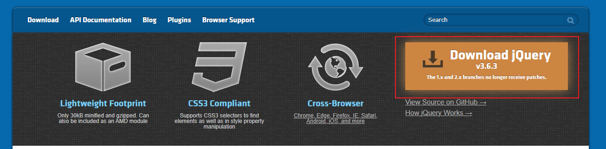
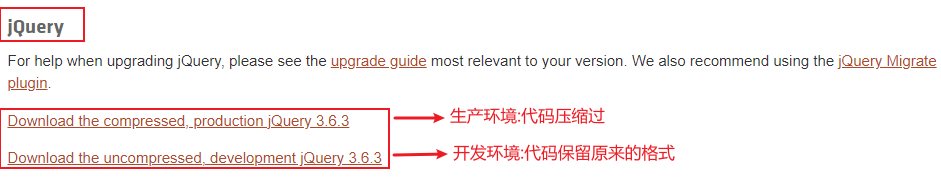
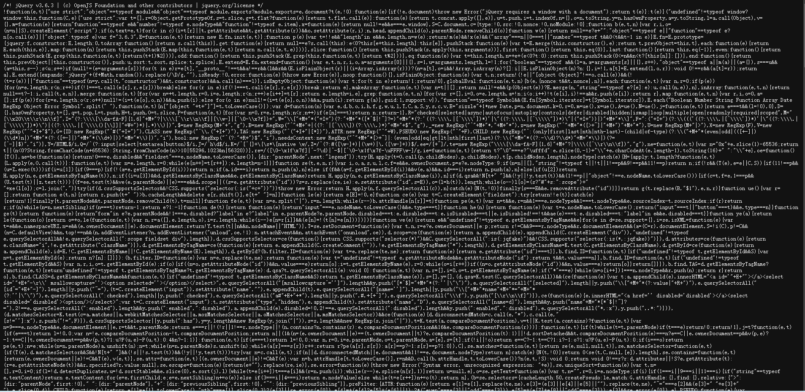

# Jquery   笔记

## 一、Jquery的下载

| 步骤 | 图片                                                         | 解释                                                         |
| ---- | ------------------------------------------------------------ | ------------------------------------------------------------ |
| 1    |  | 网址<br>https://jquery.com/                                  |
| 2    |  | 压缩过的代码集中在一起不易查看<br>未压缩过的保留原始的Js代码结构 |
| 3    |  | 根据情况两者二选一，进去之后全选所有内容，复制到一个新的txt文件中然后将文件保存为JS文件。在需要的地方引入这个Js文件就可以了 |

<hr>

## 二、Jquery的基础

### 1、Jquery入口函数

```
--两种写法--
（1）第一种
$(document).ready(
	function(){}
)

（2）第二种（推荐）
$(function(){})

（3）第三种
$().ready(
	function(){}
)
```

```
--注意--
Jquery中的入口函数相当于Js中window的DOMcontentloaded事件：就是当页面的dom节点加载完毕之后就会执行入口函数中的内容。

--补充--
Js中window的load和DOMcontentloaded两个事件的区别：load事件是当页面中所有的元素加载完毕之后才会去执行load事件的内容；而DOMcontentloaded是只要当页面的dom节点加载完毕之后就会执行事件，在加载完js，css，图片等文件之前执行的。（所以当页面上有过多的静态元素的时候就可以使用DOMcontentloaded事件而不是load事件）
```

### 2、Jquery的顶级对象

```
--知识点--
（1）jquery中的顶级对象是$或者jQuery
（2）$和jQuery其实是一样的，它们之间可以相互替换（注意：jQuery的q要大写）。比方说$(function(){})就可以使用jQuery替换成jQuery(function(){})
（3）jquery对象相当于一个存储DOM对象的伪数组
（4）伪数组：通过索引存储数据，并且具有length属性的对象。let a = {0:'0',1:'1',2:'2',length:3}就属于一个伪数组4
	Js中常见的伪数组就是函数的arguments数组。由于是一个对象所以不能调用数组的方法，但是可以使用类似数组的a[1],a[2]等方式来获取每个索引位置上的数据
```

### 3、Jquery对象和DOM对象

```
--区别--
（1）jquery对象是通过jquery获取的对象；DOM对象是通过JS获取的对象
（2）jquery对象和DOM对象之间不可以互相使用对方的属性和方法
```

```
--jquery对象和DOM对象之间的相互转换--
（1）DOM对象转jquery对象：
	var domObj = document.getElementById("id");
	var jqueryObj = $(domObj);
（2）jquery对象转DOM对象：
	var jqueryObj = $("#id");
	var domObj = jqueryObj[0];
```

<hr>

## 三、Jquery的节点操作

### 1、Jquery节点获取

#### 	A、基本选择器

##### （1）通配符选择器

```
$("*");

获取包括html，body在内的页面上的所有元素
```

##### （2）标签选择器

```html
<div>1</div>

$("div");
```

#####  （3）类选择器

```html
<div class='div1'>1</div>

$(".div1");
```

##### （4）ID选择器

```html
<div id = 'div1'>1</div>

$("#div1");
```

#### B、复合选择器

##### （1）并集选择器

```html
--格式--
$("选择器1,选择器2,选择器3...");
***选择器之间使用"，"分开

--例子--
<div>1</div>
<span>2</span>

$("div,span");
```

##### （2）交集选择器

```
--格式--
$("选择器1选择器2选择器3...");
***多个选择器之间紧紧挨着

--例子--
<div id = 'div1'>1</div>
<div>2</div>

$("div#div1");
```

##### （3）后代选择器

```
--格式--
$("选择器1 选择器2 选择器3...");
***多个选择器之间使用空格分开
***选出某个节点之后的所有子节点（子节点，孙子节点...）
```

##### （4）子代选择器

```
--格式--
$("选择器1>选择器2>选择器3...");
***多个选择器之间使用">"分开
***选出某个节点之后的所有子节点（这里的子节点只包含第一代子节点，不含孙子节点...）
```

#### C、父子节点

##### （1）获取父节点

```
$("选择器").parent();

***获取元素的"直接"父节点
```

##### （2）获取子节点	

```
$("选择器").children();

***获取元素所有的*直接*子节点
```

### 2、Jquery属性操作

#### （1）value值

```
--获取--
$("选择器").val();

--设置--
$("选择器").val("值");

--注意--
value值的获取和设置针对的是表单标签，非表单标签不可使用
```

#### （2）标签文本

```
--text方法--
  -获取-
$("选择器").text();
  -设置-
$("选择器").text("值");

--html方法--
  -获取-
$("选择器").html();
  -设置-
$("选择器").html("值");

--注意--
（1）html和text最大的区别是html识别html标签，而text不识别。
（2）html相当于Js中的innerHTML，text相当于Js中的innerText。
```

#### （3）其他属性

```
---prop---
---prop主要操作官方属性---
***不常用***

常用于操作disabled，selected等属性
```

```
---attr---
---attr既可以操作官方属性(直接写在标签上的属性)，也可以操作自定义属性---

-获取-
$("选择器").attr("属性名");

-设置-
$("选择器").attr("属性名","属性值");
```

```
---css---
---css主要操作style中的属性---

-获取-
$("选择器").css("属性名");

-设置-
$("选择器").css("属性名","属性值");

-注意-
使用css时注意如果使用css来获取属性值的话，会完完全全的完整的获取属性值。比方说$("#id").css("height");获取的不是一个数字，而是数字加单位的一个字符串
```

### 3、Jquery事件

<font color='red' >Jquery中的所有事件相当于Js中的监听事件，和传统事件的区别就是传统事件一次只能绑定一个事件，后面绑定的事件会覆盖之前的事件；而监听事件就可以同时绑定多个事件，会按照事件绑定的顺序触发事件</font>

#### （1）注册事件

```
--第一种--
--格式--
$("选择器").事件名(函数/函数名);

--例子--
$("#btn").click(fun);
$("#btn").click(function(){});

--注意--
如果采用$("选择器").事件名(函数名);只写函数名这种方式的话，函数名后一定不能加括号，否则一打开页面就会执行方法
```

```
--第二种--
--格式--
$("选择器").on(事件类型,函数/函数名);

--例子--
$("#btn").on("click",fun);
$("#btn").on("click",function(){});

--注意--
如果采用$("选择器").on(事件名,函数名);只写函数名这种方式的话，函数名后一定不能加括号，否则一打开页面就会执行方法
```

#### （2）取消事件

```
--第一种--
取消某个jquery对象绑定的指定的一个事件

--格式--
$("选择器").off(事件类型,指定的事件函数/指定的事件函数名);
```

```
--第二种--
取消某个jquery对象绑定的某一类的事件

--格式--
$("选择器").off(事件类型);
```


## 四、Jquery的动画

### 1、元素的显示与隐藏

```
***显示***

--格式--
$("选择器").show(时长,显示后的回调函数);

--注意--
（1）时长的作用是决定节点完全显示所需要花费的时间
（2）时长的单位是毫秒
（3）回调函数是当元素显示完毕之后才会触发的函数
（4）show方法的两个参数都不是必须的，什么都不写就是立即显示
```

```
***隐藏***

--格式--
$("选择器").hide(时长,隐藏后的回调函数);

--注意--
（1）时长的作用是决定节点完全显示所需要花费的时间
（2）时长的单位是毫秒
（3）回调函数是当元素隐藏完毕之后才会触发的函数
（4）show方法的两个参数都不是必须的，什么都不写就是立即隐藏
```

```
***显示与隐藏交替***

--格式--
$("选择器").toggle(时长,交替后的回调函数);

--注意--
（1）时长的作用是决定在事件发生多长时间之后才会交替
（2）时长的单位是毫秒
（3）回调函数是当元素交替完毕之后才会触发的函数
（4）show方法的两个参数都不是必须的，什么都不写就是立即交替
```


## 五、Jquery方法

### 1、$.parseJSON()

```
*--作用--*
将Json字符串转化成对象

*--例子--*
$.parseJSON('{"a":1,"b":2}');
```

### 2、$("表单选择器").serialize()

```
*--作用--*
序列化表单数据
最终结果：会产生类似a=1&b=2...之类的数据，可直接作为ajax的请求参数
```

### 3、get()和eq()

```
*--作用--*
（1）get：获取jquery对象中的某一个DOM对象
（2）eq：获取jquery对象中的某个jquery对象

*--使用--*
1:
（1）$("选择器").get();
（2）$("选择器").get(index);

2:
（1）$("选择器").eq();
（2）$("选择器").eq(index);

*注意*
get和eq的区别就是get最终获得的是一个DOM对象，所以只能使用DOM中的属性和方法；eq最终获取的是jquery对象，所以只能使用jquery中的属性和方法
```

### 4、height()和width()

```
*--作用--*
（1）height：获取/设置对象的高度
（2）width：获取/设置对象的宽度

*--使用--*
（1）height
获取：$("选择器").height();
设置：$("选择器").height(值);

（1）width
获取：$("选择器").width();
设置：$("选择器").width(值);
```

### 5、addClass()和removeClass()

```
*--作用--*
（1）addClass：追加新的类（原有的类仍然存在）
（2）removeClass: 清除指定的类

*--使用--*
（1）addClass：
	1、添加一个类：$("选择器").addClass("class1");
	2、添加多个类：$("选择器").addClass("class1","class2"...);
	
（2）removeClass：
	1、清除所有类：$("选择器").removeClass();
	2、清除指定的类：$("选择器").removeClass("class1");
```

### 6、trim()

```
*--作用--*
去除字符串两端的空白

*--使用--*
$.trim(字符串);
```

### 7、slideUp(),slideDown和slideToggle()

```
*--作用--*
（1）slideUp：以滑动的方式隐藏
（2）slideDown：以滑动的方式显示
（3）slideToggle：以滑动的方式隐藏与显示

*--使用--*
（1）$("选择器").slideUp();
（2）$("选择器").slideDown();
（3）$("选择器").slideToggle();
```

### 8、each()

```
*--作用--*
用于jquery对象遍历

*--第一种--*
$("选择器").each(function(index,DOMObject){});
index：jquery对象中dom对象的索引
DOMObject：每次遍历到的DOM对象（因为jquery对象相当于dom节点数组，所以遍历的每一个元素都是dom节点对象）

*--第二种--*
$.each(Jquery对象,function(index,DOMObject){})
index：jquery对象中dom对象的索引
DOMObject：每次遍历到的DOM对象（因为jquery对象相当于dom节点数组，所以遍历的每一个元素都是dom节点对象）

*--each方法不仅可以遍历jquery对象，也可以遍历数组--*
（1）arr.foreach(function(value,index){});
（2）$.each(arr,function(index,value){});
```

