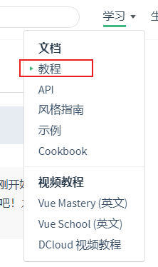
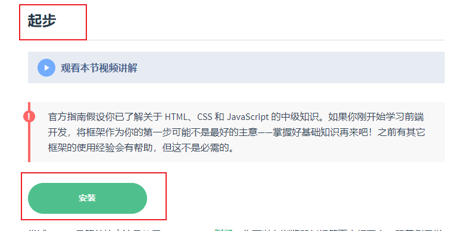
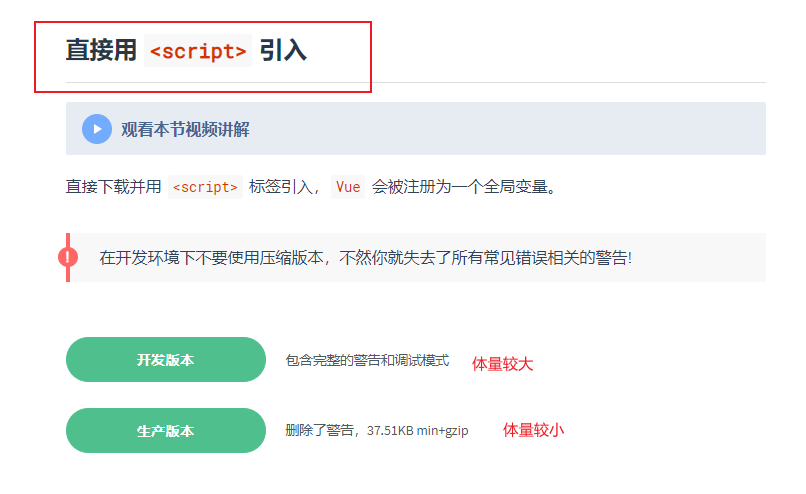
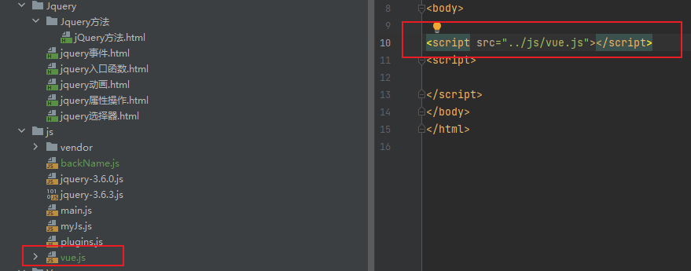

# Vue 安装

## 一、script标签引入

| 步骤 | 信息                                                         |
| ---- | ------------------------------------------------------------ |
| 1    | https://v2.cn.vuejs.org/v2/guide/                            |
| 2    |  |
| 3    |  |
| 4    |  |
| 5    |  |

**注意**

（1）如果直接引入vue.js文件报请求出错，可考虑将vue.js文件添加到项目的根目录中

（2）当使用script标签引入vue的时候，Vue就会作为全局变量一同被引入