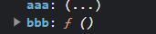

# Vue 笔记


## 一、基础概念

### 1、MVVM模型

|  |
| ------------------------------------------------------------ |

| 模型 | 解释                       |
| ---- | -------------------------- |
| `M`  | 模型 => `data`数据         |
| `V`  | 视图  =>` Dom`节点或者容器 |
| `VM` | 视图模型 => `Vue`实例      |


- `Data`中的数据通过`Vue`实例绑定到`Dom`节点上
- `Dom`节点上数据的变化（比方说表单等可以双向绑定的节点），又可以通过`Vue`实例修改`Data`中的数据


### 2、数据代理

<font color=red>`Vue`中数据的双向绑定就是通过 **<u>数据代理</u>** 实现的</font>

#### （1）定义属性


##### `obj.a`

```javascript
let obj2 = {};
obj2.a = 1;
// 结果：1
console.log(obj2.a);
```


##### `Object.defineProperties`

```javascript
let obj = {};
Object.defineProperties(obj, {
    //定义属性名为a，值为1的属性
    "a": {
        value: 1
    },
   //定义属性名为b，值为1的属性
    "b": {
        value: 2
    }
});

//结果：1
console.log(obj.a);
//结果：2
console.log(obj.b);
```


通过`Object.defineProperties`定义属性，属性的配置项解读：

```javascript
/* 示例 */

//注意：aaa这个变量最终被obj.a所代理
let aaa = 0;
let obj = {};
Object.defineProperties(obj, {
    "a": {
        value: 1,
        writable: true,
        enumerable: true,
        configurable: true,
        get: function () {
            return aaa;
        },
        set: function (value) {
            aaa = value;
        }
    }
});
```

- `value`：定义属性的值。

  <font color=pink>使用`get`和`set`的时候不能使用`value`和`writable`两个属性</font>

- `writable`：定义属性是否可以修改。

  <font color=pink>使用`get`和`set`的时候不能使用`value`和`writable`两个属性</font>

- `enumerable`：定义属性是否可以被`Object.keys()`方法枚举到。

  `Object.keys()`方法用于获取一个对象中所有的属性

  ```javascript
  let o1 = {a:1,b:2};
  //结果：['a', 'b']
  console.log(Object.keys(o1));
  ```

- `configurable`：定义属性是否可被删除

  ```java
  /* JavaScript中删除对象属性的操作 */
  
  let o1 = {a:1,b:2};
  //结果：['a', 'b']
  console.log(Object.keys(o1));
  delete o1.a;
  //删除结果：['b']
  console.log(Object.keys(o1));
  ```

- `get`：定义获取属性的函数（返回值即定义属性的值）

  每当获取定义的属性的属性值的时候就会调用该方法，方法的返回值就是属性的属性值。

  

  <font color=pink>注意：在`get`方法中禁止访问与该`get`方法对应的自定义属性，因为每次访问自定义属性都会调用`get`方法，如果`get`方法中继续访问自定义属性的话就会造成死循环。</font>

  ```javascript
  /* 死循环展示 */
  let obj = {};
  Object.defineProperties(obj, {
      "a": {
          get: function () {
              //this.a会再次调用a的get方法，造成死循环
              return this.a;
          }
      }
  });
  ```

  

  <font color=pink>注意：`get`和`set`方法中的`this`均指代待添加属性的对象。</font>

  ```javascript
  let obj = {};
  let aaa = 0;
  Object.defineProperties(obj, {
      "a": {
          get: function () {
              //结果：true
              console.log(this === obj);
              return aaa;
          },
          set: function (param) {
              //结果：true
              console.log(this === obj);
              aaa = param;
          }
      }
  });
  ```

  

- `set`：定义设置属性的函数（无返回值)

  <font color=pink>`set`方法中存在一个参数，即要设置的值。</font>

  ```javascript
  let obj = {};
  let aaa = 0;
  Object.defineProperties(obj, {
      "a": {
          set: function (param) {
              aaa = param;
          }
      }
  });
  ```


#### （2）数据代理

`Vue`实例`data`的作用原理类似`Object.defineProperties`，当在`data`中添加属性时，`Vue`就会通过`Object.defineProperties`在其实例中的`_date`中添加一个新的属性来代理`data`中新添加的属性。

```javascript
<script>
export default {
  name: "son",
  data:function () {
    return {
      //data中添加属性a
      a:1
    }
  },
  methods:{
  },
  mounted() {
  	//打印Vue实例
    console.log(this);
  }
}
</script>
```

| 结果                                                         |
| ------------------------------------------------------------ |
|  |
| <font color=skyblue>由此可知当在`data`中添加变量后，`Vue`实例中会在`_data`中定义一个新的同名的属性来代理`data`中的变量，并为其生成`get`和`set`方法。</font> |
|  |
| <font color=skyblue>为了方便调用在`_data`下定义属性的同时，也在`Vue`实例下定义了该属性</font> |


### 3、数据监测

#### （1）对象成员监测

> 问题引出

```vue
<div id="root">
  <div>{{obj.ccc}}</div>
  <button @click="add">点击</button>
</div>


<script src="../js/vue.js"></script>
<script>
  const vm = new Vue({
    el:"#root",
    data:{
      obj:{
        aaa:"111",
        bbb:"222"
      }
    },
    methods:{
      add(){
        this.obj.ccc = "333";
      }
    }
  });
</script>
```


> 问题描述

**<u>实现功能</u>**：在上述代码中想要实现的功能时，当点击按钮时，会为`data`中的`obj`对象添加一个名为`ccc`值为`"333"`的新属性。然后通过`{{obj.ccc}}`来获取添加后的ccc的属性值。
**<u>理想情况</u>**：点击按钮添加完`ccc`属性，`vue`检测到`data`中数据变化，然后重新渲染页面，将`obj.ccc`读取到页面上展示
**<u>实际情况</u>**：点击完之后，`obj`中的`ccc`属性成功添加并赋值为`"333"`，但是页面却并没有回显数据


> 问题解释

在vue实例中的`data`配置项中添加的所有变量，vue都会通过代理的方式(`Object.defineProperties`)将这些变量添加到`vue实例`的`_data`中作为其属性。此时想访问这些属性可以通过`vue实例._date.属性名`。

|  |
| ------------------------------------------------------------ |

为了进一步简化调用同时还在vue实例中的直属属性中添加这些变量的代理属性，此时访问的时候便不需要加上`_data`，使用`vue实例.变量名`即可访问。

|  |
| ------------------------------------------------------------ |

如果在`data`中添加的是一个对象变量，那么不仅对象本身会被代理，对象中的属性也会被代理，也就是一个对象中的所有属性(包括对象的属性，对象的属性的对象的属性...)，会被递归代理，不论有多少层。

|  |
| ------------------------------------------------------------ |

<font color=red>vue能够做到当`data`中配置的变量发生变化的时候就会重新渲染页面，根本的原因就是当`data`中的数据发生变化的时候，就会调用其`set`方法， 在`set`方法中修改数据的同时，还包含重新渲染页面的操作。</font>

<font color=pink>通过`obj.ccc = "333"`为`obj`添加的`ccc`属性不会被vue实例代理，所以修改的时候就没有对应`set`方法调用，也就不会重新渲染页面。</font>

|  |
| ------------------------------------------------------------ |


> 问题解决

通过如下两种方式添加的对象就会存在对应的`get`和`set`方法：

- `Vue.set(对象,变量名,变量值);`
- `vue实例.$set(对象,变量名,变量值);`


#### （2）数组成员监测

对于data配置添加的数组来说，数组本身具有`set`和`get`方法。对于例如`arr=[0,1,2]`之类的对于数组整体的修改会触发`set`方法的调用重新去渲染容器。但是如果是对于数组中的元素进行修改的时候例如`arr[0]=1`，这样的修改vue是监测不到的，所以容器并不会重新渲染。

<font color=pink>对于数组来说，数组变化可以被vue检测到并重新渲染页面，但是数组元素的变化不会被vue检测到也就不会重新渲染页面。</font>

**解决方法**：

- `Vue.set(数组,索引位置,变量值);`

- `vm.$set(数组,索引位置,变量值);`

- 通过vue专门处理数组元素的函数（注意这些函数并不是数组array原型上的方法，而是vue对array原型上七个方法的重写，通过这些方法对数组中元素的修改会被vue检测到）

  ```java
  //1、弹出最后一个元素
  arr.pop();
  
  //2、在数组末尾添加元素
  arr.push(e);
  
  //3、弹出开头的一个元素
  arr.shift();
  
  //4、在数组开头添加元素
  arr.unshift();
  
  //5、反转元素
  arr.reverse();
  
  //6、切片函数
  //（1）从start开始删除count个元素
  arr.splice(start,count);
  //（2）从start开始删除count个元素，并用e替换
  arr.splice(start,count,e..);
  
  //7、排序函数
  //（1）默认从小到大
  arr.sort();
  //（2）指定排序规则
  arr.sort(function(a,b){return a-b;});
  ```


## 二、Vue全局配置

```
****** Vue全局配置对象 ******

	Vue.config	
```

```
****** 常用属性 ******

1、productionTip：生产环境提示，默认为true，会在控制台打印提示信息
	Vue.config.productionTip = false;
	Vue.config.productionTip = true;
```


## 三、Vue实例

### 1、Vue实例基本使用

```vue
<script>
	new Vue({
  		el:'#root',
  		data:{
    		name:'哈哈哈'
  		},
  		methods:{
      		fun1:function(){return 1;},
      		fun2(){
                return 2;
            }
  		}
	});
</script>
```

```
****** 注意 ******

（1）创建vue实例的构造方法中有且仅有一个参数，这个参数是一个配置对象

（2）配置对象
	·· el：css选择器，比方说"#root"
			Dom节点，比方说document.getElementById("#root")
	·· data：对象，比方说{name:"哈哈哈"}
	·· methods：方法
	
（3）插值语法：{{}}
	·· 可以将vue实例中data或者method返回值显示在页面上
	·· 内部不仅仅只能写data中声明的变量，还可以写Js表达式，比方说{{1+1}}，{{Date.now()}}
	
（4）Vue实例和Dom节点之间必须是一一对应的。不能出现一个Dom节点对应多个Vue实例，或者多个Dom节点使用一个Vue实例。如果el中选择器会选出多个节点，那么只有第一个才会与vue实例绑定

（5）一旦data中变量的值发生变化，{{}}中的值也会随之变化。因为当data中的任何一个属性值发生变化的时候，vue实例所绑定的容器中的所有内容都会进行重新的渲染

（6）data和methods中属性名问题：一般情况下我们如下写data:{name:'yg'},methods:{fun:function(){}}。但实际上对象的变量名应该添加引号，只不过我们习惯直接省略。data:{'name':'yg'},methods:{'fun':function(){}}

（7）与vue实例所绑定的节点，我们称之为容器或者模板。容器或者模板需要经过vue解析之后才会变成普通的html页面。而我们所写的内容就是容器或者模板，比方说<div v-bind:a="'1'"></div>，这就属于模板，最终在页面不会直接展示<div v-bind:a="'1'"></div>，而是会经过vue解析之后会变成<div a='1'></div>。渲染的过程实际上就是vue先对模板进行解析，然后将解析后的内容添加到页面上展示。
	vue模板 -解析-> 虚拟dom -> 真实dom

（8）template属性
	vue实例只能绑定一个容器。对于容器的操作，我们一般直接在容器写标签。当然，容器内部可以不写任何标签也可以做到显示内容。而template的作用就是可以在容器内部添加标签。解析的时候就会将template中的所有内容添加到顶层容器的内部显示。注意template后一般使用反引号``所代表的模板字符串，并且template中的所有标签必须要放在一个父标签之中
```

### 2、Vue实例使用变式

```js
// 最基本的一个Vue实例
    const vm = new Vue({
      el:"#root",
      data:{
        number: 123
      }
    });
```

```
a、变式1
	问题：el的作用是将Vue实例和Dom节点绑定起来。但是这样子写的话，那么在创建Vue实例的时候就要想好将Vue实例绑定给哪个Dom节点，所以这种方式的缺点是不够灵活
	解决：可以通过Vue实例中的原型方法$mount();方法实现Vue实例和Dom节点之间随时的绑定。方法使用：vue实例.$mount(选择器);
	
b、变式2
	问题：后续学习中data目前的写法会报错，所以需要变成新的写法
	解决：
		·· 写法1：（1）使用function函数形式，解析的时候该函数会由Vue对象去调用.
				（2）注意函数返回值一定得是一个对象。
				（3）data后面的函数中的this对象指代的就是Vue实例.故该函数不能使用箭头函数的形式。箭头函数没有自己的this，箭头函数的this继承自外部作用域的this
			data:function () {
        		return {
         			name:"123"
        		}
      		}
      	·· 写法2
			data() {
        		return {
         			name:"123"
        		}
      		}
```

### 3、Vue实例常用函数

#### **<u>*$mount*</u>**

```
作用：将Vue实例与Dom节点绑定
格式：Vue实例.$mount(选择器);
```

#### **<u>*$watch*</u>**

```
作用：监听vue实例中的某个属性
格式：Vue实例.$watch('属性名',{
	immediate:true,
	handler:function(newValue,oldValue){}
});
```

#### **<u>*$set*</u>**

```
格式：
·· vm.$set(对象,变量名,变量值); 作用：在对象添加可以被vue监测到成员变量
·· vm.$set(数组,索引位置,变量值); 作用：这种方式向数组中添加元素的时候就会被vue监测到变化
```

#### **<u>*$destroy*</u>**

```
格式：
·· vm.$destroy(); 作用：销毁vm，销毁前容器的工作结果会被保留，销毁后vum和容器之间的连接断开。并且执行beforeDestroy和Destroyed两个钩子函数
·· 组件被销毁之后，组件中定义的所有监听器会被销毁。组件的所有子组件会被销毁。组件上定义的所有的组件自定义事件也会被销毁
```

### 4、Vue实例常用属性

#### **<u>*_data*</u>**

```
作用：_data就是vue实例中我们所传的data。
	我们所传的data会被vue收集到vue实例中的_data属性中
访问：vue实例._data
```


## 四、插值语法

```
插值语法：{{}}

1、作用：将vue实例中data或者method返回值显示在页面上

2、注意：
	·· {{}}内部可以写data中声明的变量，method中的方法，还可以写Js表达式
	·· {{}}属于单向绑定，也就是数据只能由vue实例流向节点，而不能反过来
	·· {{}}中可以写vue实例中有的任何内容不单单是data中的数据
	·· 插值语法中使用vue实例methods中的函数的话需要注意。如果直接写法方法的名字（查看方法内容）代表着将方法的信息展示在页面。如果写成方法名()（方法的调用）才意味着这是在调用方法，会将方法的返回值显示在页面上
	
3、使用范围：插值语法一般用于标签体内的数据赋值，比方说<h1>{{}}</h1>,<h1>{{}}</h1>,主要用于两个标签之间或者直接在页面上展示。而不能用于属性内，比方说<a href="{{url}}"></a> 这样是错误的

4、插值语法：{{a}}中a的来源
	·· data
	·· computed
	·· 重要：Js表达式。比方说<div :a="a=9">{{a}}</div>.此时{{a}}中的a就代表9。:a表示使用v-bind对自定义属性进行了单向绑定，使用v-bind之后那么后面的内容就可以当Js表达式进行解析。而此时表达式中出现的变量就可以在{{}}插值语法中使用
	
5、插值语法中的内容当纯文本来处理，不会解析标签。比方说{{'<h3>123</h3>'}},最终页面上展示的就是<h3>123</h3>，而不是123
```


## 五、指令语法

### 1、v-bind

```vue
<a v-bind:href="url" id="root">百度</a>

<script src="../js/vue.js"></script>
<script>
    Vue.config.productionTip = false;
    let vm = new Vue({
      el:"#root",
      data:{
        url:"https://www.baidu.com"
      },
      methods:{
        fun1:function () {
          return 456;
        }
      }
    });
</script>
```

```
****** 总结 ******

a、作用：v-bind用于绑定标签属性
	<a v-bind:href="url" id="root">百度</a>
	
b、v-bind不仅能够操作标签的官方属性，还可以操作标签的自定义属性

c、重点：v-bind绑定属性之后，那么解析属性值的时候就会将双引号内的内容当成Js表达式进行解析。不使用v-bind绑定的话那么标签属性值解析的时候就是当成字符串来进行解析的

d、v-bind绑定属性后，属性既可以是data中的数据，也可以是methods中方法的返回值
	<a v-bind:href="url" id="root">百度</a>
	<a v-bind:href="fun1()" id="root">百度</a>
	注意：如果是使用methods中的方法的话，那么一定要加括号。只要加了括号才代表是调用方法，而如果直接写方法名的话，相当于查看方法的具体实现信息

e、v-bind可以简写为:
	<a v-bind:href="url" id="root">百度</a>
	简写：<a :href="url" id="root">百度</a>

f、v-bind属于单项绑定，也就是说当修改vue实例中的值，dom节点也随之改变；但是如果在dom节点中修改的话，vue实例中的数据仍是不变的
```

### 2、v-model

```vue
<input type="text" v-model:value="number" id="root">

<script src="../js/vue.js"></script>
<script>
    Vue.config.productionTip = false;
    let vm = new Vue({
      el:"#root",
      data:{
        number: 123
      }
    });
</script>
```

```
****** 总结 ******

a、重点：v-model可以实现数据的双向绑定，也就是说数据既可以从vue实例流向元素，也可以从元素流向vue实例。而v-bind则是单项绑定，数据只能从vue实例流向元素

b、v-model主要作用与表单标签，并且是作用与表单项的value属性
	<input type="text" v-model:value="number" id="root">

c、v-model:value可以简写为v-model
	<input type="text" v-model:value="number" id="root">
	简写：<input type="text" v-model="number" id="root">

d、使用v-model之后，value中的属性在解析的时候就会当成Js表达式来进行解析
```

```
****** 修饰符 ******

（1）numer
	格式：v-model.number="值"
	作用：number的作用就是将input中输入内容转化成数字（input中输入的内容默认当字符串来处理）。
		初始：data：{str:0}
		不添加number输入123：data：{str:"123"}
		添加number输入123：data：{str:123}
	注意：v-model.number一般和<input type='number'/>配合使用
	
（2）lazy
	格式：v-model.lazy="值"
	作用：lazy的作用是只有当表单项失去焦点之后，才会将输入的内容同步到data中。
	
（3）trim
	格式：v-model.trim="值"
	作用：trim的作用是去除输入内容两边的空格
	
注意：要使用v-model的修饰符的话，那么必须要使用v-model的简写形式。比方说v-model.lazy="name";如果使用v-model.lazy:value="name";是不起作用的
```

### 3、v-on

```vue
<div id="root">
  <button v-on:click="aaa">点击按钮aaa</button>
  <button v-on:click="bbb">点击按钮bbb</button>
</div>

<script src="../js/vue.js"></script>
<script>
    Vue.config.productionTip = false;
    const vm = new Vue({
      el:"#root",
      data() {
        return {
          number:"123"
        }
      },
      methods:{
        aaa:function () {
          alert("aaa点击成功！");
        },
        bbb(){
          alert("bbb点击成功！");
        }
      }
    });
</script>
```

```
****** 总结 ******

a、v-on用于Vue中事件的绑定
	·· 格式：v-on:事件名="函数" 或者 @事件名="函数"
	·· 常见事件名：click（单击），
				dblclick(双击)，
				focus（获取焦点），
				blur（失去焦点），
				change（表单项value改变），
				mousedown（鼠标按下），
				mouseup（鼠标弹起），
				mousemove（鼠标移动），
				mouseout（鼠标移出），
				mouseover（鼠标移入），
				keydown（键盘按下），
				keyup（键盘弹起），
				scroll（滚动条滑动，只要滚动条滑动就触发，不滑动不触发），
                wheel（鼠标滚轮事件，只要鼠标滚轮滑动，不论滑动条动不动，都会触发）
	
b、v-on可以使用@简写。比方说：
	<button v-on:click="aaa">点击按钮aaa</button>
	简写：<button @click="aaa">点击按钮aaa</button>
	
c、v-on:click="aaa"中aaa有两种写法。
	·· 第一种就是直接写aaa，这种写法相当于aaa(event); vue会自动的为这个函数传一个事件对象event。
	·· 第二种就是写aaa()，这种写法相当于aaa(); 此时aaa函数中不会接受参数。如果想传递参数的话 aaa(参数列表) 即可。但是这样写的话，那么vue就不会自动的为aaa传递event事件对象。此时只需要使用$event作为参数，它所在的位置，vue就会自动的在该位置上传入event事件对象

d、methods中所有函数中的this指的就是vue实例。

e、方法在data和methods中配置都可以生效。
	·· 如果配置在data中的话，那么vue会对这个函数进行数据代理。也就是说想要获取这个函数具体内容的时候会通过get方法去vue._date中获取，v-on绑定的函数实际上是_data中的函数，而不是vue下直接的函数。而实际开发中一般来说函数是固定的而不会像数据一样会在程序的运行过程中不断变化，所以说函数没有数据代理的必要，多余的数据代理只会白白增加程序开销而已
	·· 如果配置在methods中，则v-on绑定的函数就是vue实例下的函数，没有数据代理
```

| 函数存在在data还是methods中的问题                            |
| ------------------------------------------------------------ |
| 1、如果aaa和bbb均放在methods下                               |
|  |
| 2、如果aaa在data，bbb在methods下                             |
| <br />此时发现aaa变成了只有你去主动获取才可以看到的状态 |


#### （1）通用事件修饰符

```
a、prevent
	·· @click.prevent:"method()"
	·· prevent的作用相当于Js中的preventDefault函数，用于阻止元素的默认事件，比方说a标签跳转的默认事件
	
b、stop
	·· @click.stop:"method()"
	·· stop的作用相当于Js中stopPropagation函数，用于阻止事件冒泡。加在哪个元素上从哪个元素开始不再冒泡
	
c、once
	·· @click.once:"method()"
	·· once的作用就是让元素绑定的事件只触发一次
d、capture
	·· @click.capture:"method()"
	·· capture的作用是让事件流在捕获阶段进行触发，而不是冒泡阶段才触发

e、self
	·· @click.self:"method()"
	·· 如果一个元素要触发一个事件的话，那么就会检查这个事件的触发者是不是这个元素本身，如果是则正常触发，如果不是则不会触发
	
f、passive
	·· @click.passive:"method()"
	·· passive的作用是让一些特殊的事件不再等待事件函数执行完毕之后才触发效果。比方说wheel事件。鼠标滚动后立马触发鼠标滚动事件，开始执行事件函数，只有事件函数执行完毕之后，页面的滚动条才会移动。而此时如果处理事件的函数很复杂，需要执行很长事件，那么页面的响应速度就会很慢。加上passive之后，那么鼠标滑轮滚动之后页面滚动条也会立马滚动，滚动事件在后台执行
```

```
****** 注意 ******

a、多个修饰符之间可以连着写的。比方说 @click.prevent.stop:"method()"
b、如果一个连续使用修饰符，那么修饰符发挥作用是有顺序的。比方说@click.prevent.stop:"method()"，就是先触发组织默认事件，然后触发阻止冒泡。@click.stop.prevent:"method()"就是先阻止冒泡然后阻止默认事件
```

#### （2）键盘事件修饰符

```
a、常用的键盘事件
	·· keydown：键盘按下触发
	·· keyup：键盘弹起触发
```

```
b、判断键盘的哪个键被按下
	·· 通过事件对象中的键盘编码来判断：event.keyCode
	·· 通过事件对象中的键盘名来判断：event.key
	·· 通过vue中的事件修饰符：
		enter键：@keydown.enter:"method()"
		delete键：@keydown.delete:"method()"
		esc键：@keydown.esc:"method()"
		space键：@keydown.space:"method()"
		tab键：@keydown.tab:"method()"
		up键：@keydown.up:"method()"
		down键：@keydown.down:"method()"
		left键：@keydown.left:"method()"@keydown.enter:"method()"
		right键：@keydown.right:"method()"
		
		注意：多个修饰可以连着写，连着写就代表组合键。比方说@keydown.ctrl.y:"method()" 的含义就是当按下ctrl+y才会触发事件
	·· vue中的键盘按键修饰符一般都是开头为小写的按键名。如果是一些多个单词组成的按键名，比方说capslock，那么它对应的修饰符就是用-将多个单词连起来，比方说capslock的修饰符就是caps-lock
```

### 4、v-if/v-show

| 相关指令  |
| --------- |
| v-if      |
| v-else    |
| v-else-if |
| v-show    |

```
（1）v-show
	<div v-show="true">测试</div>
	·· v-show值为true则节点显示，为false则节点不显示
	·· v-show值会作为Js表达式解析，所以v-show后可以跟Js表达式。表达式为结果为true显示，为false不显示
	·· v-show本质上是通过改变节点的disabled属性，来控制节点显示与否
	
（2）v-if
	<div v-if="true">测试</div>
	·· v-if值为true则节点显示，为false则节点不显示
	·· v-if值会作为Js表达式解析，所以v-if后可以跟Js表达式。表达式为结果为true则显示，为false则不显示
	·· v-if本质上是通过添加或者移除节点的方式来达到显示与隐藏的效果的
	
（3）v-else-if
	<div v-if="true">测试1</div>
	<div v-else-if="true">测试2</div>
	·· v-else-if是与v-if绑定为一个体系的。也就是说如果if成立，则不论else-if成不成立，都不会执行。只有if不成立的时候，else-if成立的话才会执行

（4）v-else
	<div v-if="true">测试1</div>
	<div v-else-if="true">测试2</div>
	<div v-else>测试3</div>
	·· v-else后面不需要跟任何条件，因为else是在if和else-if都不成立的情况下才会被执行的
```

```
****** 总结 ******

（1）v-show和v-if的区别：
	·· v-show通过改变节点的disabled属性，来控制节点显示与否
	·· v-if通过添加或者移除节点的方式来达到显示与隐藏的效果的
	
（2）v-show和v-if的选取问题：
	·· 如果节点会频繁的显示与隐藏，则推荐使用v-show，如果不是那么频繁则使用v-if
	·· 如果隐藏之后还要对节点进行操作的话，那么一定不能使用v-if，因为v-if是完全移除

（3）v-else-if和v-else必须在有v-if的情况下才能使用。比方说：
	<div v-else-if="true">测试2</div>
	<div v-else>测试3</div>
	此时控制台会报错

（4）v-if，v-else-if，v-else三者使用的时候不能被打断。比方说：
	<div v-if="true">测试1</div>
	<div v-else-if="true">测试2</div>
	<div>@@@@@@@@@@@@</div>
	<div v-else>测试3</div>
	此时测试1和测试2能够奏效，而测试3则会报错，因为if-else结构被打断。测试3的v-else是在没有v-if的情况下使用的，所以会报错
```

### 5、v-for

```vue
<div id="root">
  <ul>
    <li v-for="p in persons" :key="p.id">{{p.name}}-{{p.age}}</li>
  </ul>
</div>

<script src="../js/vue.js"></script>
<script>
    Vue.config.productionTip = false;
    const vm = new Vue({
      el:"#root",
      data() {
        return {
          persons:[
            {id:1,name:"张三",age:10},
            {id:2,name:"李四",age:11},
            {id:3,name:"王五",age:12}
          ]
        }
      }
    });
</script>
```

```
****** 总结 ******

（1）v-for用于遍历某个元素，比方说<li v-for="p in persons"></li>，这个的意思就是根据persons遍历生成多个li。persons中有几个元素，最终就会生成几个li

（2）v-for的四种使用情况
	a、遍历数组
		现存在:data:{persons:[
            {id:1,name:"张三",age:10},
            {id:2,name:"李四",age:11},
            {id:3,name:"王五",age:12}
          ]}
          遍历：<li v-for="(p,index) in persons">{{p}}-{{index}}</li>
          解释：
          	·· p：persons里面中的每个元素，index：索引（从0开始递增）
          	·· p取值（{id:1,name:"张三",age:10}，{id:2,name:"李四",age:11}，{id:3,name:"王五",age:12}），index取值（0，1，2）
          	·· 标签li内部可以直接使用p和index。{{}}插值语法中变量值的一个获取途径就是，vue各种指令后跟的可以当作Js表达式解析的内容中出现的变量。而p就是Js表达式中的变量，所以可以在插值语法中使用
	b、遍历对象
		现存在:data:{
			person:{id:1,name:"张三",age:10}
            }
          遍历：<li v-for="(v,k) in person"></li>
          解释：
          	·· v：对象中每个属性的属性值，k：对象中每个属性的名字
          	·· v取值（1，张三，10），k取值（id，name，age）
	c、遍历字符串
		现存在:data:{str:"abc"}
          遍历：<li v-for="(v,index) in str"></li>
          解释：
          	·· v：字符串每个索引位置上的值，index：索引值
          	·· v取值（a，b，c），index取值（0，1，2）
	d、遍历指定次数
          遍历：<li v-for="(v,index) in 3">{{p}}-{{index}}</li>
          解释：
          	·· v：从1开始步长为1递增值3的值，index：索引
          	·· v取值（1，2，3），index取值（0，1，2）
	
（3）v-for的变式
	·· 原始：<li v-for="(p,index) in persons"></li>
	·· 变式：<li v-for="(p,index) of persons"></li>
	总结：in和of可以相互替换
	
（4）元素的key值问题
	·· 遍历出来的每一个元素，都应该加一个唯一的标识（当然不加不会报错，因为vue会使用索引值自动为你加上，但是为了规范还是应该加上唯一标识）。使用vue可以为标签添加一个特殊的属性key。可以通过:key的方法添加。比方说<li v-for="(p,index) in persons" :key="index"></li>
	·· key可以是遍历对象中的唯一标识，比方说上述例子中每个对象中有一个id值，或者说使用遍历的索引index作为key值
	·· 添加key值的话，key一定不能重复，如果重复就会报错
```

### 6、v-text

```vue
<div id="root">
  <div>{{content}}</div>
  <div v-text="content"></div>
</div>

<script src="../js/vue.js"></script>
<script>

  const vm = new Vue({
    el:"#root",
    data:{
      content:"内容"
    }
  });

</script>
```

```
****** 总结 ******

（1）v-text的作用就是向标签内部插入纯文本。比方说上述例子中<div v-text="content"></div>，它的意思就是向div标签内部插入content代表的值

（2）v-text中插入的内容当纯文本处理，不会解析标签。比方说如果content的内容是<h3>xxx</h3>，则解析到页面上仍是<h3>xxx</h3>

（3）如果标签中已经存在内容了，那么使用v-text之后标签中的内容就会被v-text中的内容所替换。比方说现在<div v-text="'aaa'">bbb</div>，最终渲染到页面上就是aaa，说明了aaa将标签中的bbb给覆盖掉了
```

### 7、v-html

```vue
<div id="root">
  <div v-html="content"></div>
</div>

<script src="../js/vue.js"></script>
<script>

  const vm = new Vue({
    el:"#root",
    data:{
      content:"<h3>123</h3>"
    }
  });

</script>
```

```
****** 总结 ******

（1）v-html作用和v-text类似，但是v-html可以解析内容中的标签。比方说v-html="'<h3>123</h3>'"，那么此时解析到页面上就是123

（2）如果标签中已经存在内容了，那么使用v-html之后标签中的内容就会被v-html中的内容所替换。比方说现在<div v-html="'aaa'">bbb</div>，最终渲染到页面上就是aaa，说明了aaa将标签中的bbb给覆盖掉了
```

### 8、v-cloak

```vue
<div id="root">
  <div>{{name}}</div>
</div>

<script src="../js/vue.js"></script>
<script>

  const vm = new Vue({
    el:"#root",
    data:{
      name:"测试"
    }
  });

</script>
```

```
****** 问题引出 ******
	
	Js文件从上到下依次执行，如果不加new Vue({})接管容器的话，那么<div>{{name}}</div>就是一个普通的标签，浏览器对其解析的结果就是{{name}}。只有执行了new Vue({})，将容器由vue接管，然后vue解析并重新渲染容器之后<div>{{name}}</div>才会显示为“测试”。
	如果说现在网络比较卡顿，执行new Vue({})之前卡住了，那么此时页面上显示的就是{{name}}，而{{name}}是我们不想让用户看到的东西。
```

```
****** 问题解决 ******
	·· css:
	<style>
		[v-cloak]{
			display: none;
		}
	</style>
	
	·· html:
	<div v-cloak>{{name}}</div>
	
	·· 解释：
		css：将带有v-cloak属性的标签选择出来并隐藏
		html：为容器标签添加v-cloak属性
		v-cloak：该属性只存在于模板阶段，会在vue重新渲染容器的时候去掉。当还未执行new Vue({})的时候，那么div上就有v-cloak属性，只要有v-cloak属性就会被隐藏。并且此时解析的结果是{{name}}，也是应该被隐藏的时候。当new Vue({})执行完毕之后v-cloak就会被去掉，去掉之后就会显示，并且此时的解析结果是“测试”。这样做就可以解决网络卡顿的时候页面展示{{name}}的问题
```

### 9、v-once

```vue
<div id="root">
  <div v-once>{{n}}</div>
</div>

<script src="../js/vue.js"></script>
<script>
    Vue.config.productionTip = false;
    const vm = new Vue({
      el:"#root",
      data:{
        n:1
      }
    });
</script>
```

```
****** 总结 ******

	v-once修饰的标签只会被vue渲染一次。比方说示例中的<div v-once>{{n}}</div>，它的作用就是页面加载的时候渲染成1，之后n值无论如何变化都不会在重新渲染
```

### 10、v-pre

```
添加该指令的标签不会被vue解析，也就是说原本标签写的什么样，渲染到页面上就是什么样。可以让vue跳过不需要vue解析的内容（比方说<h3>xxx</h3>这种普通的html标签），提高vue解析效率
```

### 11、自定义指令

```vue
<div id="root">
  <div>{{n}}</div>
  <div v-big="n"></div>
</div>

<script src="../js/vue.js"></script>
<script>
    Vue.config.productionTip = false;
    const vm = new Vue({
      el:"#root",
      data:{
        n:1
      },
      directives:{
        big:function (element,binding) {
          console.log(element,binding);
          element.innerText = binding.value*10;
        }
      }
    });
</script>
```

```
****** 总结 ******

（1）使用自定义指令，需要用到vue实例中directives配置项

（2）如果指令实现的功能比较简单，可以直接使用一个函数来描述指令的作用。比方说：
	big:function (element,binding) {
          console.log(element,binding);
          element.innerText = binding.value*10;
      }
      注意：
      	·· 参数element：获取指令所在元素的dom节点
      	·· 参数binding：获取指令的相关信息。
      		· binding.name：指令定义的名字，比方说上述例子中的big
      		· binding.rawName：指令使用的名字，比方说上述例子中的v-big
      		· binding.expression：指令后面所跟的Js表达式
      		· binding.value：指令后面所跟的Js表达式的运算结果

（3）指令函数的执行时机：
	·· 当vue解析模板的时候，指令方法就会被调用。
	注意是解析的时候就会调用，而此时节点还没有放到页面上，也就是说此时是虚拟dom

（4）自定义指令完整的写法，以上述例子来说：
	directives:{
		big:{
			bind(element,binding){},
			inserted(element,binding){},
			update(element,binding){}
		}
	}
	完整写法中big以对象的形式出现，其中含有三个函数，这三个函数就是该指令在不同时期所执行的内容
		·· bind：初次解析执行（只执行一次）
		·· inserted：节点放入页面之后执行（只执行一次）
		·· update：每次更新时执行
		
（5）指令的命名问题
	·· vue中自定义的指令不识别驼峰命名。比方说定义名为bigNumber的指令，那么vue认为指令名为bignumber。
	·· 对于多个单词组成的指令，一般使用-进行分割。比方说big-number，使用时v-big-number。对应的指令函数就应该是'big-number':function(){}或者'big-number'(){}
	
（6）指令相关函数中的this问题
	this不再指向vue实例，而是window
	
（7）全局指令
	局部指令：在vue实例内部定义的指令，只能在vue实例所绑定的容器中使用
	全局指令：
		·· Vue.directive(指令名,{bind(){},inserted(){},update(){}});
		·· Vue.directive(指令名,function(){});
```


## 六、属性操作

### 1、计算属性

```vue
<div id="root">
  <p>{{test}}</p>
</div>

<script src="../js/vue.js"></script>
<script>
    Vue.config.productionTip = false;
    const vm = new Vue({
      el:"#root",
      data() {
        return {
          aaa:"1",
          bbb:"2"
        }
      },
      methods:{
      },
      computed:{
        test:{
          get(){
            return this.aaa+"-"+this.bbb
          },
          set(value){
            let strArr = (value+"").split("-");
            this.aaa = strArr[0];
            this.bbb = strArr[1];
          }
        }
      }
    });
</script>
```

```
****** 重点 ******

（1）data中的成员就是属性。
	vue实例中data中的成员最终会被收集到_data中，并且vue对象为了方便data中成员的调用对_data中的属性进行了数据代理，所以vue实例中也会有data中的成员。在查看vue中data成员的时候数据是来自_data中的
（2）computed中的成员就是计算属性。
	vue中计算属性不会被收集到_data中，而是计算后直接作为vue实例的成员
（3）methods中的成员会直接作为vue实例的成员
```

```
****** 总结 ******

（1）使用计算属性需要使用vue实例中的computed配置项。该配置项中中的成员都是以对象的形式存在，也就是真正的计算属性

（2）计算属性中有两个方法get和set：
	a、get方法的调用时机：
		·· 首次尝试获取计算属性的时候会调用，将计算属性计算出来之后返回，所以说get方法必须要有返回值。调用之后此时计算属性的值会被vue自动缓存，此后不论再获取计算属性多少次，获取的都是缓存的结果，提高了效率
		·· 当计算出计算属性所参与的data中的属性发生修改的时候也会调用get更新计算属性的值，同时缓存也会被更新
	b、set方法的调用时机
		·· 当尝试修改计算属性的时候才会调用。注意修改计算属性的过程其实也就是修改data中用于计算出计算属性所参与的成员的值
		
（3）计算属性的简写
	·· 前提：只考虑get，不考虑set
	·· 原始写法（计算属性test）：
		computed:{
        	test:{
          		get(){
            		return this.aaa+"-"+this.bbb
          		}
        	}
      	}
	   简化写法（计算属性test）：	
	   	computed:{
        	test:function () {
          		return this.aaa+"-"+this.bbb;
        	}
      	}
```


### 2、监听属性

#### （1）普通监听

```vue
<div id="root">
  <p style="border: 2px solid black;" @click="aaa = !aaa;">{{aaa}}</p>
</div>

<script src="../js/vue.js"></script>
<script>
    Vue.config.productionTip = false;
    const vm = new Vue({
      el:"#root",
      data() {
        return {
          aaa:true
        }
      },
      watch:{
        aaa:{
          handler:function (newValue,oldValue) {
            console.log(newValue,oldValue);
          }
        }
      }
    });
</script>
```

```
****** 总结 ******

a、格式：
	watch:{
		aaa:{
			immediate:true,
			handler:function(newVlue,oldValue){}
		},
		bbb:{}
	}

b、格式中的aaa和bbb代表的是监听的属性，它有如下特点：
	·· 监听属性既可以是data中的属性也可以是computed中的属性（既可以监听普通属性，也可以监听计算属性）
	·· 监听属性一定要存在，不存在不会报错，但是没有意义

c、handler函数
	·· 作用：当监听的属性发生变化的时候就会执行handler函数中的内容
	·· 两个参数：handler函数调用的时候会自动传入两个参数，第一个是最新的值，第二个是旧的值

d、immediate
	·· 作用：控制首次加载页面是否执行handler
	·· 取值：默认是false，也就是首次加载页面不执行handler。如果为true，那么首次加载页面就会执行handler。newValue是当前值，oldValue是undefined
	
e、另一种监听方式：
	Vue实例.$watch('属性名',{
		immediate:true,
		handler:function(newValue,oldValue){}
	});
	区别：这种监视和上述监视的区别就是它可以灵活的去监听属性。对于第一种来说，在写vue实例的时候就得确定去监视哪一个属性。而对于第二个来说，可以在程序运行的过程中通过$watch的第一个参数去决定监视哪一个属性，注意监听的属性在$watch方法中一定要加引号
	
f、监听属性的简写（简写的前提是监听的属性只需要handler）
	watch：
		·· 原始：watch:{aaa:{handler:function(){}}}
		·· 简写：watch:{aaa(){}}
	$watch：
		·· 原始：vm.$watch('aaa',{handler:function(){}})
		·· 简写：vm.$watch('aaa',function(){})
```

#### （2）深度监听

```vue
<div id="root">
  <p style="border: 2px solid black;" @click="aaa.a++;">修改a,{{aaa.a}}</p>
  <p style="border: 2px solid black;" @click="aaa.b++;">修改b,{{aaa.b}}</p>
</div>

<script src="../js/vue.js"></script>
<script>
    Vue.config.productionTip = false;
    const vm = new Vue({
      el:"#root",
      data() {
        return {
          'aaa':{
            a:1,
            b:2
          }
        }
      },
      watch:{
        aaa:{
          deep:true,
          handler:function (newValue,oldValue) {
            console.log("aaa监听到了！");
          }
        },
        'aaa.a':{
          handler:function () {
            console.log("aaa.a监听到了！");
          }
        }
      }
    });
</script>
```

```
****** 总结 ******

a、如果data或者computed中的属性是一个对象。而如果想要监听对象中的某个成员，则需要使用“对象.属性”来进行监听。
	比方说：data:{return {aaa:{a:1,b:2}}}，如果想要监听a，则应该为watch:{'aaa.a':{handler:function{}}}
	注意：aaa.a一定要写成'aaa.a'，否则报错。其实本质上Js中的对象的成员变量名都应该加引号
	
b、如果data或者computed中的属性是一个对象。而如果想要监听对象是否变化的（也就是对象的任意属性的属性值发生变化都认为对象发生了变化），则就需要使用深度监听
	比方说：data:{return {aaa:{a:1,b:2}}}
	如果说只是watch:{aaa:{handler:function{}}}，那么aaa中属性变化后则handler不会被调用，也就是说vue认为aaa没有发生变化。因为aaa是一个对象，vue判断其是否变化看的是它的地址值是否发生变化而不是属性值。
	解决：使用deep，deep的作用就是做深度监听，也就是对象中任意变化都认为是对象本身发生了变化。deep默认是false
```

### 3、过滤器

```vue
<div id="root">
  <div>{{time | timeFormat | timeFormat}}</div>
</div>

<script src="../js/vue.js"></script>
<script>
  const vm = new Vue({
    el:"#root",
    data:{
      time:Date.now()
    },
    filters:{
      timeFormat:function (value) {
        console.log(value);
        return value;
      }
    }
  });
</script>
```

```
***** 总结 ******

（1）vue中过滤器的主要作用就是对属性进行格式化

（2）过滤属性：{{time | timeFormat}}
	解释：
	·· |的含义代表将要过滤属性的值传入过滤函数进行过滤
	·· timeFormat可以加括号也可以不加，加括号的时候还可以传值。比方说{{time | timeFormat()}},{{time | timeFormat(1,2)}}
	·· |可以连续使用多次进行过滤。比方说{{time | timeFormat | timeFormat | timeFormat}}
	
（3）过滤函数
	filters:{
      timeFormat:function (value) {
        console.log(value);
        return value;
      }
    }
    解释：
    ·· 过滤函数的返回值就是最终要展示的值
    ·· 过滤函数可以接收多个参数，但是第一个参数，一定是要进行过滤的初始值
    
 （4）作用位置
 	·· 常用：插值语法
 	·· 不常用：v-bind绑定属性的属性值中
 
 （5）局部过滤器和全局过滤器
 	局部过滤器：在vue实例中使用filters配置项配置的过滤器就属于局部过滤器。局部过滤器只能在vue实例所绑定的容器内部使用
 	全局过滤器：通过Vue.filter(过滤器名,function () {}) 创建的过滤器可以在任意一个vue实例所绑定的容器中使用
```


## 七、样式操作

### 1、class样式

```vue
<style>
  .basic{
    width: 100px;
    height: 100px;
    border: 1px solid black;
  }
  .red{
    background-color: red;
  }

  .blue{
    background-color: blue;
  }
</style>

<div id="root">
  <div class="basic" :class="myClass" @click="dj"></div>
</div>

<script src="../js/vue.js"></script>
<script>
    Vue.config.productionTip = false;
    const vm = new Vue({
      el:"#root",
      data() {
        return {
          myClass:''
        }
      },
      methods:{
        dj:function () {
          this.myClass = 'red';
          this.myClass = 'blue';
        }
      }
    });
</script>
```

```
****** 总结 ******

（1）css中如果想让某个标签拥有多个class的样式，那么在class属性中可以写多个class样式，样式之间使用空格隔开。如上述代码，比如说想拥有red和blue的样式，只需要class="red blue"。
	需要注意的是Js中如果写成<div class="basic" class="myclass" @click="dj"></div>则并不会当成class="basic myclass" 处理，而是会当成class="basic" 也就是说后加的不会生效

（2）vue中<div class="basic" :class="myClass" @click="dj"></div> 的第二个:class则不会跟上述(1)中描述的一样被忽略。而是会从data或者computed中读出myclass的具体值，然后解析成
<div class="basic myClas值" @click="dj"></div>

（3）通过vue添加class的几种形式：
	·· 单个变量
		比方说<div class="c1" :class="'c2'"></div>，最终解析就是<div class="c1 c2"></div>
	·· 数组
		比方说<div :class="['c1','c2']"></div>，最终解析就是<div class="c1 c2"></div>
	·· 对象
		比方说<div :class="{c1:true,c2:true}"></div>，最终解析就是<div class="c1 c2"></div>
		这里需要注意一点，使用对象的话，对象的成员名字就代表要添加的class样式，通过值false或者true决定样式是否添加。并且成员名c1和c2相当于默认加了''
		
	重点注意：class前加:之后，其内容就会当成js来解析，如果单纯写c1或者c2那么此时c1和c2代表一个属性，解析的时候会从data或者computed中查找，如果找到则正常不然报错。如果想让c1和c2单纯当作值来处理，则需要使用'c1'和'c2'
```

### 2、style样式

```
****** 总结 ******

a、通过vue添加style的几种形式：
	·· 对象
		比方说<div :style="{backgroundColor:'red'}"></div>
	·· 对象数组（不常用）
		比方说<div :style="[{backgroundColor:'red'},{fontSize:20+'px'}]"></div>
	
b、注意：
	·· 对象的成员变量名默认就是被''包围的字符串，需要注意的是它的值。比方说backgroundColor，如果直接写red，那么解析的时候会认为那么一个变量red，如果想使用red作为值，应该使用'red'
	·· 对于像font-size,background-color之类的样式属性，写成对象的成员变量的时候需要将-去掉，然后多个单词之间使用驼峰命名的方式。像是backgroundColor，fontSize
```


## 八、特殊标签属性

### 1、key

```
****** 基本概念 ******

（1）标签的key属性主要是用于v-for遍历生成元素时，唯一标识生成的元素

（2）在vue中标签的key属性会被vue所使用。通过:key为标签添加key属性。添加key属性的标签最终转化成dom节点后key属性就不存在了。比方说：
	·· <li :key="1"></li> 转化为dom节点之后 <li></li>
	·· <li :a="1"></li> 转化为dom节点之后 <li a="1"></li>
```

| v-for中使用index作为key值                                    |
| ------------------------------------------------------------ |
|  |
| **v-for中使用唯一id作为key值**                               |
|  |

```
****** 两种使用解析 ******

（1）使用遍历的索引index作为key值
	现存在待遍历的data数据persons:[{id:1,name:"张三",age:18},{id:2,name:"李四",age:19},{id:3,name:"王五",age:20}]。然后通过v-for实现遍历元素<li v-for="(p,index) in persons" :key="index"></li>。
	数据转化成页面实际dom之前，vue会先为它们生成虚拟dom，然后去和已有的元素进行比对。其中没有变化的元素会得到复用，变化的或者不存在的会生成新的。最终生成的dom节点是{{p.name}}-{{p.age}}<input type="text"/>，如上图所示
	如果使用index作为key值的话，那么：（【】中的内容是input框中输入的内容）
		节点1：key=0，张三-18 【张三-18】
		节点2：key=1，李四-19 【李四-19】
		节点3：key=2，王五-20 【王五-20】
	此时如果在生成的所有元素之前再添加一个元素，也就是在data中的数组最前面添加一个元素，data中数据发生，就会使得vue实例对应的容器内的所有元素产生重构。那么此时将dom节点最终生成到页面之前，会先生成虚拟dom：
		节点1：key=0，老刘-40 input
		节点2：key=1，张三-18 input
		节点3：key=2，李四-19 input
		节点4：key=3，王五-20 input
	然后用这四个虚拟dom和之前的三个虚拟dom进行比较。vue是通过key值来确定变化前后的元素的，也就是两次产生的虚拟dom中key值一样的，才是变化前后对应的dom。当key=0的li时，其中存在两个节点（文字和input）对于key=0的dom来说，文字变化了，但是input没变（比较的是dom而不是输入的内容，而在变化前后始终是<input type="text">所以dom没有发生变化）。也就是说“老刘-40”会生成新的，而input会沿用之前的，那么最终就是
		节点1：key=0，老刘-40 【张三-18】
		节点2：key=1，张三-18 【李四-19】
		节点3：key=2，李四-19 【王五-20】
		节点4：key=3，王五-20 【】
	这样就产生了问题，因为我们的理想情况是：
		节点1：key=0，老刘-40 【】
		节点2：key=1，张三-18 【张三-18】
		节点3：key=2，李四-19 【李四-19】
		节点4：key=3，王五-20 【王五-20】

（2）使用唯一id作为key值
	使用唯一id就不会产生上述的情况。因为上述之所以会出现问题，是因为用一个节点在变化前后它的key值发生了变化。而如果使用唯一id，变化前后key值不会发生变化，也就不会出现上述的状况

（3）补充：如果不手动添加key值，那么vue会按照使用索引的方式，为生成的元素添加key值
```

### 2、ref

> ref主要用于给标签打标识，作用类似于标签的id属性
>
> 在vue中获取节点的dom对象一般不使用document的方法，而是通过vue的方式。

****

1. ref属性。作用类似于id，可以唯一标识某个节点

   ```html
   <h1 ref="hh1"></h1>
   <h2 ref="hh2"></h2>
   ```

2. 通过ref获取真实dom

   主要通过VueComponent对象中的$refs属性获取。

   vue组件中的this代表的就是当前vue组件的VueComponent对象

   ```html
   <h1 ref="hh1"></h1>
   ```

   ```javascript
   //格式：vue组件对象.$refs.标识名
   export default {
     name: "Student",
     data:function () {
       return {
       }
     },
     methods:{
       m1:function () {
         console.log(this.$refs.hh1);
       }
     }
   }
   ```

3. ref使用需要保证标识的唯一性。如果标识不唯一，那么获取的节点会是最后标识所在的节点

   ```html
   <h1 ref="hh1">h1</h1>
   <h1 ref="hh1">h2</h1>
   ```

   ```javascript
   //如果ref不唯一，那么最终获取的就是"<h1 ref="hh1">h2</h1>"
   this.$refs.hh1 
   ```

4. ref既可以用来标识html标签，也可以用来标记组件标签。

   如果标记html标签，那个通过$refs获取的就是真实dom对象

   如果标记组件标签，那么通过$refs获取的就是组件对象

5. id既可以用来标识html标签，也可以用来标记组件标签。

   如果标记html标签，那个通过document获取的就是真实dom对象

   如果标记组件标签，那么通过document获取的就是组件template标签中的父容器标签

### 3、is

### 4、slot

### 5、slot-scope

### 6、scope


## 九、表单数据收集

<font color=red>表单项通过v-model实现双向绑定</font>

### 1、输入框

```vue
<div id="root">
  <input type="text" v-model:value="inValue">
</div>

<script src="../js/vue.js"></script>
<script>
  const vm = new Vue({
    el:"#root",
    data:{
      inValue:""
    }
  });
</script>
```

```
总结：input输入框中输入的内容就是表单项的value。而输入的内容和data中的变量双向绑定
```

### 2、单选框

```vue
<div id="root">
  男：<input type="radio" name="sex" v-model:value="sex" value="男">
  女：<input type="radio" name="sex" v-model:value="sex" value="女">
</div>

<script src="../js/vue.js"></script>
<script>
  const vm = new Vue({
    el:"#root",
    data:{
      sex:""
    }
  });
</script>
```

```
总结：对于单选框来说，一定要为单选框手动指定value值。选中哪个单选框，双向绑定的变量中就是哪个单选框的value值
```

### 3、复选框

```vue
<div id="root">
  <input type="checkbox" v-model:value="check" value="1">
  <input type="checkbox" v-model:value="check" value="2">
  <input type="checkbox" v-model:value="check" value="3">
</div>

<script src="../js/vue.js"></script>
<script>
  const vm = new Vue({
    el:"#root",
    data:{
      check:[]
    }
  });
</script>
```

```
总结：
	a、如果只有一个复选框
		·· 可以不手动指定value值
		·· data中双向绑定变量的初始值为空字符串
		·· 当选中，则data中绑定的变量为true，当没有选中则为false
	b、如果有多个复选框组成一组
		·· 必须为每个复选框指定value值
		·· data中双向绑定的变量的初始值要是一个空数组
		·· 当选中的时候，选中的复选框对应的value值就会添加进data中双向绑定的数组中。当取消选中的时候，就会从数组中删除
```

### 4、下拉菜单

```vue
<div id="root">
  <select name="city" v-model:value="city">
    <option value="">请选择</option>
    <option value="1">北京</option>
    <option value="2">上海</option>
    <option value="3">广州</option>
  </select>
</div>

<script src="../js/vue.js"></script>
<script>
  const vm = new Vue({
    el:"#root",
    data:{
      city:""
    }
  });
</script>
```

```
总结：对于下拉菜单来说，v-model绑定到select上，value值的获取来自option
```

### 5、文本域

```vue
<div id="root">
  <textarea v-model:value="content"></textarea>
</div>


<script src="../js/vue.js"></script>
<script>
  const vm = new Vue({
    el:"#root",
    data:{
      content:""
    }
  });
</script>
```

```
总结：textarea文本域使用和input输入框一致
```


## 十、VM生命周期

### 1、生命周期8个函数

<font color=red>以下函数的出现顺序就是生命周期函数的执行顺序</font>

```
（1）beforeCreate
	=> 该阶段vue实例中的没有_data和methods中的方法
	
（2）created
	=> 该阶段vue实例会完成数据代理和数据检测。所以该阶段vue实例中出现_data和methods中方法
	
（3）beforeMount
	=> 该阶段页面上呈现的是未经编译的dom节点。此阶段不可操作dom
	
（4）mounted
	=> 该阶段页面上呈现的是编译后的dom节点。此阶段可操作dom，但不推荐
	
（5）beforeUpdate
	=> 该阶段中vue实例中data数据已被修改，但是还没有更新到页面上
	
（6）updated
	=> 该阶段中vue实例data中的数据已被修改，并且更新到了页面上

（7）beforeDestroy
	=> 调用vm.$destroy()会被执行
	
（8）destroyed
	=> 调用vm.$destroy()会被执行
	该钩子函数没啥卵用
```

```
****** 总结 ******

常用钩子函数：
	·· mounted：常用于初始化操作。比方说页面打开发送ajax请求获取数据，开启定时器之类
	·· beforeDestroy：常用于收尾操作。比方说关闭页面定时器之类
```

### 2、生命周期4个阶段

```
（1）创建阶段
	·· 钩子函数：beforeCreate，created
	·· 执行时机：当vm被创建的时候才会执行，也就是new Vue()的时候。
		注意：一个页面首次打开之后，html从上到下执行，必定会执行到new Vue()，只要执行到那么那么就会执行beforeCreate，created。只要不再创建vm，这两个钩子函数就不会在执行
	
（2）挂载阶段
	·· 钩子函数：beforeMount，mounted
	·· 执行时机：vue首次解析模板为虚拟dom，虚拟dom变真实dom，真实dom添加至页面的过程中调用
		注意：注意是vue实例首次解析并将dom添加页面才算挂载阶段。之后dom节点的添加和删除，都只能算模板的更新
		
（3）更新阶段
	·· 钩子函数：beforeUpdate，updated
	·· 执行时机：每次重新渲染模板都会执行

（4）销毁阶段
	·· 钩子函数：beforeDestroy，destroyed
	·· 执行时机：执行了vm.$destroy()函数会执行钩子函数
```


## 十一、组件化编程

### 1、组件化

|  |
| ------------------------------------------------------------ |

由上述图片所示，一个完整的html页面可以拆分成多个组件：

1. 一个页面中可以有多个组件，多个组件由一个vue实例管理
2. 组件尽量要细分，这样才更便于复用

### 2、非单文件组件

<font color=red>非单文件组件：一个文件中含有多个组件</font>

#### （1）组件使用

> 创建组件

****

1. 创建组件：Vue.extend({}); 

   extend()中需要一个配置对象{}，该配置对象的使用与vue实例中配置对象的使用基本一致

   ```vue
   <script>
       //创建一个组件
   	const cmp = Vue.extend({
           data:function(){
               rerurn {
                   name:"张三",
                   age:12
               }
           },
           template:`
           	<div>
       			<span>{{name}}</span>
       			<span>{{age}}</span>
       		</div>
           `
       });
   </script>
   ```

2. extend()配置对象中不能使用el属性。

   vue实例中使用el的作用是将vue实例对象和某个节点绑定。但是在组件中，由于组件是可以复用的，也就是说组件可以放在任意位置，它不需要绑定节点，只需要是html-css-js的一个模块即可。所以组件不能绑定某个节点。

3. extend()配置对象中data属性必须写成函数的形式

   主要原因是组件是可以复用的。比方说现在有一个组件A，并且有a和b两个地方引入了组件A。由于使用了对象，所以a和b指向了同一个引用，所以此时如果在a处修改data中的数据的话，b处也会跟着改变。

   ```vue
   <script>
   	//使用对象
       const data = {'a':1,'b':2};
       let param1 = data;
       let param2 = data;
       param1.a = 2;
       //结果：由于param1和param2是同一个引用，所以修改了param1的a，结果param2中的a也发生了变化
       console.log(param2.a);  
       
       //使用函数
       const data2 = function(){
           return {
               'a':1,
               'b':2
           }
       }
      	let param3 = data2();
       let param4 = data2();
       param3.a = 2;
        //结果：由于param1和param2不是同一个引用，所以修改了param1的a，结果param2中的a无变化
       console.log(param4.a);  
   </script>
   ```

4. extend()配置对象中template属性，主要用于创建组件的页面结构

   推荐使用模板字符串``。

   template中的页面结构只能有一个父容器，所有的操作只能在父容器内部进行

   ```javascript
   //在template中只能有一个父容器（如下的id=“root”）
   template:`
           <div id="root">
             <div>{{name}}</div>
             <div>{{age}}</div>
           </div>
       `;
   
   //错误使用（tenplate中出现两个父容器）
   template:`
         <div>{{name}}</div>
         <div>{{age}}</div>
       `;
   ```
   
   

> 注册组件

****

1. 创建的组件需要由一个vue实例去管理。

   需要用到vue实例中components配置项。components是一个对象，其中的key就是组件的名字，value就是我们创建的组件的名字。我们使用的时候使用的是key

   ```vue
   <script>
   const cmp1 = Vue.extend({
       data:function () {
         return {
           name:"张三",
           age:12
         }
       },
       template:`
           <div>
             <div>{{name}}</div>
             <div>{{age}}</div>
           </div>
       `
     });
   
     const cmp2 = Vue.extend({
       data:function () {
         return {
           name:"李四",
           age:13
         }
       },
       template:`
         <div>
           <div>{{name}}</div>
           <div>{{age}}</div>
         </div>
       `
     });
   
     const vm = new Vue({
       el:"#root",
       components:{
         c1:cmp1,
         c2:cmp2
       }
     });
   </script>
   ```

2. 局部注册&全局注册

   ```vue
   <script>
       //局部注册：使用vue实例中的components配置项
   	const cmp1 = Vue.extend({
       	data:function () {
         		return {
           		name:"张三",
           		age:12
         		}
       	},
       	template:`
           	<div>
             		<div>{{name}}</div>
             		<div>{{age}}</div>
           	</div>
       		`
     	});
   
     	const vm = new Vue({
       	el:"#root",
       	components:{
         		c1:cmp1
       	}
     	});
       
       //全局注册：使用Vue中的component函数
       //Vue.component(组件名,已创建的组件);
       Vue.component('c1',cmp1);
   </script>
   ```

   

> 使用组件

1. 在vue实例所绑定的容器内部，将组件作为标签使用，那么使用标签的位置就是引入组件的位置

   ```vue
   <div>
       <!--引用key组件-->
       <key></key>
   </div>
   <script>
       //创建key组件
   	Vue.component('key',value);
   </script>
   ```

#### （2）组件嵌套

<font color=red>在通常的开发中，vm管理一个app组件，然后其他所有的组件由app组件统一管理</font>


```vue
<script>
    //vm -管理-> cmp1 -管理-> cmp2
	const cmp2 = Vue.extend({
    	data:function () {
      		return {
        		name:"李四",
        		age:13
      		}
    	},
    	template:`
      		<div>
        		<div>{{name}}</div>
        		<div>{{age}}</div>
      		</div>
    		`
  	});
    
    //cmp1管理的组件，可以直接在template中引用
  	const cmp1 = Vue.extend({
  		data:function () {
      		return {
        		name:"张三",
        		age:12
      		}
    	},
    	template:`
        	<div>
          		<div>{{name}}</div>
          		<div>{{age}}</div>
          		<cmp2></cmp2>
        	</div>
    		`,
    	components:{
      		cmp2:cmp2
    	}
  	});

  	const vm = new Vue({
    	el:"#root",
    	components:{
      		c1:cmp1
    	}
  	});
</script>
```

#### （3）VueComponent

> 总结

****

1. vue解析“<组件></组件>”或者“<组件/>”等组件标签的时候，就会去调用Vue.extend({})，而这个方法会去调用VueComponent构造函数，创建一个VueComponent对象。并且每次创建，创建的组件对象都不是同一个。注意，Vue.extend({})并不是创建VueComponent对象，而是定义一个组件。创建组件是由VueComponent构造函数完成的

2. 组件配置对象（Vue.extend({})的{}）中的this指代的不是vue实例对象，而是VueComponent实例对象。VueComponent实例对象的使用和vue实例的使用完全一致

3. vue实例对象和VueComponent实例对象中都有一个$children属性，其中存放的就是vue实例和VueComponent实例对象所管理的组件

4. 重要结论：VueComponent原型对象的原型对象是Vue的原型对象。所以VueComponent实例可以使用Vue原型对象上的方法和属性

   ```javascript
   //结果：true
   VueComponent.prototype.__proto__ === Vue.prototype
   ```

   ```javascript
   //创建VueComponent实例
   let vc = new VueComponent();
   
   //VueComponent实例的隐式原型对象
   let ys = vc.__proto__;
   
   //VueComponent实例的显式原型对象
   let xs = VueComponent.prototype;
   
   //显式原型对象=隐式原型对象。结果：true
   console.log(ys === xs);
   
   //-------------------------------------------------//
   
   //创建Vue实例
   let vm = new Vue();
   
   //Vue实例的隐式原型对象
   let ys2 = vm.__proto__;
   
   //Vue实例的显式原型对象
   let xs2 = Vue.prototype;
   
   //显式原型对象=隐式原型对象。结果：true
   console.log(ys2 === xs2);
   
   //-------------------------------------------------//
   
   //VueComponent原型对象的原型对象是Vue的原型对象
   VueComponent.prototype.__proto__ === Vue.prototype
   ```

   

### 3、单文件组件

#### （1）vue文件

1. 文件结构

   ```vue
   <template>
     <!-- HTML结构 -->
     <div class="backColor">
       <span>{{name}}</span>
       <span>{{age}}</span>
     </div>
   </template>
   
   <script>
   //Js脚本
   export default Vue.extend({
     name:"Test",
     data:function () {
       return {
         name:"张三",
         age:12
       }
     }
   });
   </script>
   
   <style>
   /* CSS样式 */
   .backColor{
     backgound-color:orange;
   }
   </style>
   ```

2. 细节解释

   - vue文件中只能使用template，script，style三种标签。template中书写html，script中书写js，style中书写css

     ```vue
     <template>
       <!-- HTML结构 -->
     </template>
     
     <script>
       //Js脚本
     </script>
     
     <style>
       /* CSS样式 */
     </style>
     ```

   - vue文件的名字一般采用首字母大写或者所有单词首字母大写的方式。比方说：单个单词school，则vue文件命名为School；多个单词myschool，则vue文件命名为MySchool。

   - template标签中只能有一个父容器

     ```vue
     <!-- 正确 -->
     <template>
     	<div>
             ...
         </div>
     </template>
     
     <!-- 错误 -->
     <template>
     	<div>
             ...
         </div>
     	<div>
             ...
         </div>
     </template>
     ```

   - 定义组件的”Vue.extend({})“可以简写成“{}”

     ```javascript
     //定义组件的两种写法
     //第一种
     const cmp1 = Vue.extend({});
     //第二种
     const cmp2 = {};
     ```

   - 定义组件的配置对象中的name属性，一般和文件名一致

     ```javascript
     //组件配置对象中的name属性决定的是组件在vue调试工具中展示的名称
     Vue.extend({
         name:"Cmp"
     });
     ```

   - 定义的组件需要暴露出去才可以被其他组件引用或者注册

     ```javascript
     //第一种
     export default {};
     
     //第二种
     export default Vue.extend({});
     ```

   - 组件引入

     ```javascript
     //格式：import 组件名 from 组件文件路径;
     import Test from './Test.vue';
     ```

#### （2）HelloWord项目

1. 三个核心文件

   - main.js

     main.js文件是vue项目的入口文件

     ```javascript
     //引入vue.js。
     //相当于使用script标签引入vue.js文件
     import Vue from 'vue'
     
     //引入App组件
     //vue项目的整体架构：一个vue实例注册管理app组件，其他所有的组件由app组件管理
     import App from './App.vue'
     
     //关闭生产提示
     Vue.config.productionTip = false
     
     //创建vue实例，注册app组件，将vue实例挂载到id=app的节点上
     new Vue({
       render: h => h(App),
     }).$mount('#app')
     ```

   - index.html

     vue实例绑定的容器所在的页面

     ```html
     <!DOCTYPE html>
     <html lang="">
       <head>
         <meta charset="utf-8">
         <meta http-equiv="X-UA-Compatible" content="IE=edge">
         <meta name="viewport" content="width=device-width,initial-scale=1.0">
         <link rel="icon" href="<%= BASE_URL %>favicon.ico">
         <title><%= htmlWebpackPlugin.options.title %></title>
       </head>
       <body>
           <!-- noscript的作用就是如果浏览器不支持Js，将显示标签内部的内容 -->
         <noscript>
           <strong>Please enable it to continue.</strong>
         </noscript>
           <!-- vue实例所绑定的节点 -->
         <div id="app"></div>
       </body>
     </html>
     ```

   - App.vue

     所有的组件由App组件管理

     ```vue
     <template>
     	<!-- template模板中只能有一个父容器 -->
       <div id="app">
           <!-- 使用Student和School组件 -->
         <student></student>
         <School></School>
       </div>
     </template>
     
     <script>
         // 引入Student和School组件
     import Student from "@/components/practice/Student.vue";
     import School from "@/components/practice/School.vue";
         // 暴露App组件
     export default {
       name: 'App',
         //注册Student和School组件
       components: {
         Student,
         School
       }
     }
     </script>
     ```

2. @

   在vue项目中的import中经常可以看到@，在vue项目中的@指的就是src文件夹所在的目录

#### （3）render

```javascript
//1、这种写法的作用就是创建并使用App组件
new Vue({
  render: h => h(App),
});

new Vue({
  render(createElement, hack) {
    return createElement(App);
  }
});

//2、该写法是我们常用的写法，作用和vue使用脚手架创建的vue实例（第一种写法）一样
new Vue({
    //注册App组件
  components:{App},
    //使用App组件
  template:`
  	<App></App>
  `
})

//3、总结
/* 
	（1）第二种写法在vue脚手架的环境下运行会报错。
	（2）因为在脚手架的环境下“import Vue from 'vue'” 引入的并不是vue.js，而是vue.runtime.esm.js
	因为vue开发完毕打包完成之后其中所有的模板都是解析好了的，直接运行即可，所有vue.runtime.esm.js中并没有模板解析器，也就是说第二种写法中的template无法解析。而如果引入最完整的vue.js就不会出现这种问题“import Vue from 'vue/dist/vue.js'”
	（3）render函数的作用：render函数中有一个入参，该参数是一个函数，它的作用就是创建节点对象。比方说入参为h，那么h('h1','内容');就相当于在页面上创建了“<h1>内容</h1>”。而h(App)的作用就相当于"<App></App>"
*/
```

| Vue.Js的位置                                                 |
| ------------------------------------------------------------ |
|  |


#### （4）props

> 问题引出

****

一个基本的学生组件


```vue
<script>
export default {
  name: "Student",
  data:function () {
    return {
      name:"张三",
      age:12
    }
  }
}
</script>

<template>
  <div>
    <h1 ref="study">vue学习</h1>
    <div>{{name}}</div>
    <div>{{age}}</div>
  </div>
</template>

<style scoped lang="scss">

</style>
```

app组件中使用学生组件

```vue
<template>
  <div id="app">
    <Student></Student>
    <hr>
    <Student></Student>
  </div>
</template>

<script>
import Student from "@/components/practice/Student.vue";
import School from "@/components/practice/School.vue";
export default {
  name: 'App',
  components: {
    Student
  }
}
</script>

<style lang="scss">

</style>
```

| 展示                                                         |
| ------------------------------------------------------------ |
|  |

**<u>*问题引入*</u>**

一个定义好的组件，无论引入多少次，它的初始变量的值是固定的。比方说现在要求引入后，一个展示“张三 12“，另一个展示”李四 13“。那么此时通过上述的引入方式就无法实现。因为展示到页面上的name和age是来自data中的数据，而data中是写死的。虽然我们可以在程序运行后修改data中的数据从而改成”李四 13“，但是无法在初始化后做到一个展示”李四 13“，另一个展示”张三 12“

> props配置项

****

1. 作用：为了解决上述的问题可以通过手动为标签传入数据来实现。手动传入的数据必须要有变量来接受，而props配置项的作用就是配置用于接收手动传入的数据的变量

2. 组件标签-传入数据

   ```vue
   <Student name="李四" age="13"></Student>
   
   <!--
   	（1）上述写法的作用就是为Student组件传入了，name="李四" age="13"两个数据
   	（2）传入的参数，参数名不能为key。key已被vue使用，不能够作为一般的标签属性传入数据
   	（3）通过age="13"传入的值13默认会被当成字符串13来使用。如果想让13作为数字来进行处理可以通过:key="13" 来实现。因为使用v-bind后，引号中的内容会当成js表达式来处理，13就会当成数字13
   -->
   ```

3. 组件内部-接收数据

   ```javascript
   /*
   	方式1：使用数组（常用）
   	（1）props:['name','age']作用就是声明name和age两个变量来接受从组件标签上传入的数据
   	（2）如果在props中定义了没有传入的变量，比方说定义了一个aaa，那么aaa的值就是undefine
   */
   export default {
     name: "Student",
     data:function () {
       return {
       }
     },
     props:['name','age']
   }
   ```

   ```javascript
   /*
   	方式2：使用对象约束类型
   	（1）props:{name:String,age:Number}，这种写法的作用就是限制传入的name要是String类型，传入的age要是Number类型。即便传入的类型不对应，也会正常显示，只不过浏览器控制台上会有报错的提示
   */
   export default {
     name: "Student",
     data:function () {
       return {
       }
     },
     props:{
       name:String,
       age:Number
     }
   }
   ```

   ```javascript
   /*
   	方式3：使用对象完整约束
   	（1）约束项：
   		·· type：变量类型
   		·· required：是否必填
   		·· default：默认值
   	（2）required一般不和default组合使用，因为必填了就不会使用默认值了
   */
   export default {
     name: "Student",
     data:function () {
       return {
       }
     },
     props:{
       name:{
         type:String,
         required:true
       },
       age:{
         type:Number,
         default:100
       }
     }
   }
   ```

4. props和data的区别

   - props和data中的变量都会直接出现在vc之下。但是props中的变量不会出现在_data中，而data中的变量会出现在 _data中

   - 如果props和data中配置了相同的变量，那么props中变量的优先级更高。但是不推荐这么使用，因为这么使用的话控制台会报”变量已经存在“的错误

   - props中配置的变量不推荐修改（可以改）。如果有改的需求的话，那么可以在data中重新声明一个变量来接受props中变量的值，修改的话直接修改data，而不是props。

     需要注意一点的是，对于对象的修改，如果只是修改对象的某个属性的话，那么vue认为对象没有被修改。对于对象来说判断对象是否被修改看的是对象的地址值
     
     ```vue
     <!--
     	（1）props中声明的变量不推荐修改。如果要修改的话，一般通过在data中定义一个变量接收props的值，然后修改data，而不是props
     	（2）如下代码中，props中声明name,而data中声明了myName，并将name的初始值赋予myName。props中的变量可以连接外部灵活接收数据，在这里仅仅起了一个初始化的作用，后续数据的变化都是通过data中myName来实现
     -->
     <script>
     export default {
       name: "Student",
       data:function () {
         console.log(this);
         return {
           myName:this.name
         }
       },
       props:['name','age']
     }
     </script>
     
     <template>
       <div>
         <h1 ref="study">vue学习</h1>
         <div>{{myName}}</div>
         <div>{{age}}</div>
       </div>
     </template>
     ```

#### （5）mixins

**<u>*混入技术mixins，可以提取多个vue组件中相同的JS代码到一个JS文件中。而要在vue组件中使用这些内容只需要使用mixins配置项引入即可*</u>**

```javascript
/* 
	myJs.js 文件 
	（1）使用命名导出的方式导出对象h1，对象h1中含有data,methods,mounted等配置项
	（2）data，methods等配置项中的内容被引入vue组件后，如果vue组件中没有同名的内容那么以Js文件中的内容为准；如果有同名的内容那么以vue组件中的内容为准。比方说Js文件中的data中有a，vue组件中的data中也有a，那么最终取值取的是vue组件中的a。vue组件对象最终的data和methods中的内容是Js文件和vue组件中内容的并集。比方说vue组件中data中只有一个a，Js文件中data中只有一个b，而使用mixins引入后最终的vc的data中就同时含有a和b
	（3）钩子函数是特例，哪怕引入的Js中和vue组件中都配置了相同的钩子函数，最终两者的钩子函数都会执行。
*/

export const h1 = {
    data:function () {
        return {
            test1:"test1"
        }
    },
    methods:{
        test2:function () {
            console.log("test2")
        }
    },
    mounted() {
        console.log("节点挂载成功！");
    }
}
```

```vue
<!-- 
	Student.vue 文件 
	（1）通过 import {h1} from "@/js/myJs1"; 引入js文件中命名导出的内容
	（2）通过vc配置项 mixins:[h1] 使用导入内容（注意：mixins后是数组而不是对象）
-->

<script>
import {h1} from "@/js/myJs1";

export default {
  name: "Student",
  data:function () {
    return {
      myName:this.name
    }
  },
  props:['name','age'],
  mixins:[h1]
}
</script>

<template>
  <div>
    <h1 ref="study">vue学习</h1>
    <div>{{myName}}</div>
    <div>{{age}}</div>
    <div>{{test1}}</div>
  </div>
</template>

<style scoped lang="scss">

</style>
```

*<u>全局混入</u>*

```javascript
/* main.js 文件 */

//引入混入
import {h1} from "@/js/myJs1";
//使用混入
Vue.mixin(h1);
```

```javascript
/* myJs1.js 文件 */

export const h1 = {
    data:function () {
        return {
            x:100,
            y:200
        }
    }
}
```

使用了全局混入之后，就相当于隐式的在所有的组件中添加了mixins:[h1]，最终所有的组件的data中都会有x和y

#### （6）插件

1. 创建插件

   ```javascript
   /*
   	plugins.js文件
   */
   export const testPlugin = {
       install:function (Vue) {
           //全局混入
           Vue.mixins();
           //全局过滤器
           Vue.filter();
           //全局指令
           Vue.directive();
       }
   }
   ```

   <u>*总结*</u>：

   - 插件本质上就是一个对象
   - 插件对象中必须要含有一个install函数
   - install函数中默认会传一个参数，该参数就是构造函数Vue
   - 通过构造函数Vue可以在插件中创建全局混入，全局过滤器，全局指令

2. 引入插件

   ```javascript
   /*
   	main.js文件
   */
   import {testPlugin} from "@/js/plugins";
   ```

3. 使用插件

   ```javascript
   /*
   	main.js文件
   	如下代码的意思是使用引入的testPlugin插件
   */
   Vue.use(testPlugin);
   ```

   Vue.use()函数，除了可以传入插件对象，还可以传入自定义的参数。传入的自定义参数可以在组件对象的install函数中获得

   ```javascript
   /*
   	main.js文件
   */
   Vue.use(testPlugin,100,200);
   
   /*
   	plugin.js文件
   */
   export const testPlugin = {
       install:function (Vue,x,y) {
           //x=100,y=200
           console.log(x,y);
       }
   }
   ```

#### （7）scoped

1. 问题引出：在所有的vue文件中的style标签中写的样式，最终都会汇总到一个css文件中。这样的话就可能出现样式冲突问题

2. 问题解决：在style标签上加上scoped，它的作用就是声明style中的样式仅仅为当前的vue文件服务，如果不加的话，那么所有组件都可以使用这些样式

   ```vue
   <style scoped>
   </style>
   ```

#### （8）$nextTick

1. 问题引出

   由vue的数据监测原理可知，当vue实例中data中的数据发生变化后就会被vue检测到后（除了通过obj.属性添加的数据和数组中元素的变化，vue无法检测到），就会重新解析模板重新生成页面。

   在这里需要注意的是并不是data中的数据变化后vue立马就重新解析模板，比方说一个点击事件，点击后执行回调函数，在回调函数中对data中的数据进行了修改，修改后并不会立马解析模板，而是等整个回调函数执行完毕之后才会重新解析模板渲染页面，这样做可以避免频繁的解析页面而使效率低下

   <u>*问题案例*</u>

   ```vue
   <!--
   	现在页面存在一个隐藏的input，需要在点击按钮之后让其重新显示出来，并且获取input输入框的焦点
   	错误做法：添加点击事件，点击之后，修改s为true用来重新显示input，然后通过input的节点对象调用focus()函数获取焦点
   	问题：当执行完毕this.s = true;页面并不会立马重新渲染，而是继续执行this.$refs.inp.focus();获取焦点，等整个点击回调函数执行完毕之后才会重新渲染页面，此时已经获取焦点的input被重新渲染之后就又会失去焦点。导致最终的结果是没有获取到焦点
   -->
   <script>
   import ps from 'pubsub-js';
   export default {
     name: "son",
     data:function () {
       return {
         s:false
       }
     },
     methods:{
       show:function () {
         this.s = true;
         this.$refs.inp.focus();
       }
     },
     mounted() {
   
     }
   }
   </script>
   
   <template>
     <div ref="root">
       <input type="text" v-show="s" ref="inp"><br>
       <button @click="show">展示input</button>
     </div>
   </template>
   ```

2. 问题解决

   ```vue
   <!--
   	使用$nextTick(function(){});的作用是等到页面上的DOM更新到最新的状态之后才会执行内部的回到函数。
   	由于vue更新页面并不是data变化之后立马修改，如果我们在data修改之后立马操作DOM就会可能出现问题。		$nextTick(function(){});会保证DOM节点更新成最新的版本之后才会执行回调函数
   -->
   <script>
   import ps from 'pubsub-js';
   export default {
     name: "son",
     data:function () {
       return {
         s:false
       }
     },
     methods:{
       show:function () {
         this.s = true;
         this.$nextTick(function () {
           this.$refs.inp.focus();
         });
       }
     }
   }
   </script>
   
   <template>
     <div ref="root">
       <input type="text" v-show="s" ref="inp"><br>
       <button @click="show">展示input</button>
     </div>
   </template>
   ```


## 十二、组件通信

### 1、基本通信

#### （1）父传子

```vue
<!-- 父组件 -->
<script>
import Son from "@/components/practice/Son.vue";
export default {
  name: "parent",
  components:{Son}
}
</script>

<template>
  <div>
    <Son dData="123"></Son>
  </div>
</template>
```

```vue
<!-- 子组件 -->
<script>
export default {
  name: "son",
  props:['dData']
}
</script>

<template>
  <div>
    <span>{{dData}}</span>
  </div>
</template>
```

*<u>总结</u>*：

1. 父组件：通过<Son dData="123"></Son>向子组件中传入名为dData，值为123的数据
2. 子组件：通过props配置项，获取从父组件传过来的数据

#### （2）子传父

```vue
<!-- 父组件 -->
<script>
import Son from "@/components/practice/Son.vue";
export default {
  name: "parent",
  components:{Son},
  data:function () {
    return {
      myData:""
    }
  },
  methods:{
    trans:function (d) {
      this.myData = d;
    }
  }
}
</script>

<template>
  <div>
    {{myData}}
    <Son :trans="trans"></Son>
  </div>
</template>
```

```vue
<!-- 子组件 -->
<script>
export default {
  name: "son",
  data:function () {
    return {
      dData:"456"
    }
  },
  props:['trans'],
  methods:{
    start:function () {
      this.trans(this.dData);
    }
  }
}
</script>

<template>
  <div>
    <button @click="start">传输数据</button>
  </div>
</template>
```

<u>*总结*</u>：

1. 父组件：父组件通过 <Son :trans="trans"></Son> 向子组件中传入一个trans方法，trans方法的形式参数就是子组件传过来的数据
2. 子组件：子组件中使用配置项props接收名为trans的函数。当点击“传输数据”按钮的时候，就会调用trans函数，将子组件中的数据作为实参传给trans函数。这样父组件中的trans函数中就会接收到子组件传入的参数。（父组件只是传入了函数的变量，真正执行函数的时候需要去函数定义的地方也就是父组件中去执行）

### 2、组件的自定义事件

<font color=red>组件的自定义事件只能添加到组件上，不能添加到普通的html标签。</font>

#### （1）绑定组件自定义事件

1. 使用组件自定义事件

   ```vue
   <!-- App组件 -->
   <template>
     <div id="app">
         <!-- 
   		（1）通过"v-on:自定义事件名"或者"@自定义事件名"添加组件自定义事件
   		（2）v-on:send="sendData"的作用就是为Parent组件的实例对象上添加了一个名叫send的事件，如果send事件成功触发的话，就会执行sendData函数。以上过程可以类比click事件
   	  -->
       <Parent v-on:send="sendData"></Parent>
     </div> 
   </template>
   
   <script>
   import Parent from "@/components/practice/Parent.vue";
   
   export default {
     name: 'App',
     components: {
       Parent
     },
     methods:{
       sendData:function () {
         console.log('send事件触发！');
       }
     }
   }
   </script>
   ```

   ```vue
   <!-- Parent组件 -->
   <script>
   export default {
     name: "Parent",
     data:function () {
       return {
         name:"parent"
       }
     },
     methods:{
       start:function () {
           /*
           	（1）通过"组件实例对象.$emit('事件名')"可以触发指定名称的所有事件
           	（2）"组件实例对象.$emit('事件名')"中可以添加多个参数，比方说vc.$emit('send',1,2,3);,该操作就会触发事件send，并且向事件触发后执行的函数中传入1，2，3三个参数。在这个例子中send实例触发后，就会向App组件中的sendData函数中传入1，2，3三个参数
           */
         this.$emit('send');
       }
     }
   }
   </script>
   
   <template>
     <div>
       <span>{{name}}</span>
       <button @click="start">自定义事件触发</button>
     </div>
   </template>
   ```

2. 组件自定义事件的应用

   <u>*组件自定义事件可以用于子组件向父组件中传输数据*</u>

   ```vue
   <!-- App组件 -->
   <template>
     <div id="app">
       <Parent v-on:send="sendData"></Parent>
     </div>
   </template>
   
   <script>
   import Parent from "@/components/practice/Parent.vue";
   
   export default {
     name: 'App',
     components: {
       Parent
     },
     methods:{
       sendData:function (name) {
         console.log('send事件触发！');
         console.log('传输的数据:',name);
       }
     }
   }
   </script>
   ```

   ```vue
   <!-- Parent组件 -->
   <script>
   export default {
     name: "Parent",
     data:function () {
       return {
         name:"parent"
       }
     },
     methods:{
       start:function () {
         this.$emit('send',this.name);
       }
     }
   }
   </script>
   
   <template>
     <div>
       <span>{{name}}</span>
       <button @click="start">传输数据</button>
     </div>
   </template>
   ```

   **<u>*数据传输流程*</u>**：

   - 在App组件中，为子组件Parent绑定了一个名为send的组件自定义事件。当send事件触发之后就会调用事件函数sendData
   - 在Parent组件中，存在一个按钮并且为该按钮绑定一个点击事件，点击之后触发点击事件，然后调用事件函数start。在start函数中通过*this.$emit('send',this.name);*触发send事件，触发send事件之后就会调用send事件的事件函数sendData，并且将Parent中的数据作为事件函数的参数传入，而事件函数写在父组件App中，所以父组件就会获取到子组件中的数据

#### （2）解绑组件自定义事件

```vue
<!-- App组件 -->
<template>
  <div id="app">
    <Parent v-on:send="sendData"></Parent>
  </div>
</template>

<script>
import Parent from "@/components/practice/Parent.vue";

export default {
  name: 'App',
  components: {
    Parent
  },
  methods:{
    sendData:function () {
      console.log('send事件触发！');
    }
  }
}
</script>
```

```vue
<!-- Parent组件 -->
<script>
export default {
  name: "Parent",
  data:function () {
    return {
      name:"parent"
    }
  },
  methods:{
    start:function () {
      this.$emit('send');
    },
    end:function (){
      this.$off('send');
    }
  }
}
</script>

<template>
  <div>
    <span>{{name}}</span>
    <button @click="start">触发事件</button>
    <button @click="end">移除事件</button>
  </div>
</template>
```

#### （3）绑定组件内置事件

在组件上直接使用@click添加一个点击事件（<Parent @click="aaa"></Parent>），此时会发现添加的点击事件并没有生效。因为在组件上使用"@事件名"，那么不论这个事件名是否是内置的事件，统一都会当成自定义事件处理。也就是说添加到组件上的click事件会当成自定义事件处理，而不是点击事件处理。要想触发自定义事件需要使用$emit。

如果想在组件上使用内置事件的话，那么就需要在事件名后添加native修饰符，以此来声明使用的是原始的click事件，而不是自定义的click事件。比方说<Parent @click.native="aaa"></Parent> ，此时本质上其实就是在组件模板的父容器中添加了一个click事件

#### （4）$on $emit $once $off 使用

1. $emit

   - 作用：触发添加在组件对象上指定的事件

   - 使用：vc.$emit(事件名,参数列表); 

     参数列表：参数列表中的所有数据都会被传入到触发的事件函数中

2. $on

   - 作用：绑定事件并指定事件函数。也就是说指定事件触发后所执行的函数

     事件函数：比方说@click="aaa",其中aaa就是事件函数

   - 使用：vc.$on(事件名,事件执行函数); 

3. $once

   - 作用：绑定事件并指定事件函数。也就是说指定事件触发后所执行的函数（与$on最大的区别是$once执行的事件函数只会触发一次）
   - 使用：vc.$once(事件名,事件执行函数); 

4. $off

   -  作用：移除事件。

   - 使用：

     ​	移除单个事件：vc.$off(事件名); 

     ​	移除多个事件：vc.$off( [ 事件1,事件2... ] );

     ​	移除所有事件：vc.$off();

### 3、全局事件总线

<font color=red>全局事件总线可以实现<u>*任意*</u>两个组件之间的通信</font>

1. 实现原理：全局事件总线的基本原理与组件的自定义事件实现通信的原理类似。

   组件的自定义事件实现组件通信是通过在父组件中为使用的子组件添加自定义事件，此时的自定义事件函数存在在父组件中，而在子组件中触发事件之后，就会调用父组件中的事件函数，此时就可以在子组件中向事件函数中传入数据，实现数据从子组件传入到父组件中。但是组件自定义事件传输数据的缺陷是只能在父子组件中传输数据。

   全局事件总线就是找一个可以出现在所有组件中的对象，然后通过为这个对象绑定事件，触发事件实现组件间的。比方说现在所有的组件中都存在一个x，并且实现B组件向A组件传输数据，那么就可以在A组件中给x绑定一个事件，事件函数写在A中，然后在B组件中触发这个事件，触发后就可以向A组件中的事件函数中传输数据，从而实现B组件向A组件传输数据

2. 安装全局事件总线

   <u>main.js</u>

   ```javascript
   /*
   	所有组件中都有的必然是组件的实例对象，但是不同的组件的实例对象不同，但是一样的是组件实例的原型对象。所以可以考虑将事件总线添加组件的原型对象上。在main的Js中使用组件还需要再创建组件，再由于VueComponent原型对象的原型是Vue的原型对象，并且main.js中有现成的vm实例，那么就可以考虑在Vue的原型对象上添加vm实例作为事件总线
   	（1）使用beforeCreate的目的：如果想让vm添加到Vue的原型上，就不能等到new Vue()执行完毕。因为new Vue()执行完毕之后，页面也就已经完成，在生成页面的过程中，只要用到事件总线$bus的地方都会报错。因为此时vm还没有添加到Vue的原型对象上。使用beforeCreate的目的就是在生成页面的时候还没有处理事件总线的时候就将vm添加到Vue的原型对象上，这样在生成页面使用事件总线的时候就不会报错
   	（2）安装事件总线：Vue.prototype.$bus = this;，其中的$bus名字可以任意
   */
   new Vue({
     render: h => h(App),
     beforeCreate() {
       Vue.prototype.$bus = this;
     }
   }).$mount('#app')
   ```

3. 全局事件总线实现组件通信

   Parent.vue

   ```vue
   <!--
   	（1）核心：
   	mounted() {
       	this.$bus.$on('send',(d)=>{
         		console.log('parent收到数据:',d)})
     	}
   	作用：初始化的时候在事件总线$bus中通过$on绑定一个send事件。$on第二个参数代表事件函数。
   		事件函数这里需要特别注意。这里有三种写法：
   		写法1：this.method。这种写法是调用组件methods中的方法，方法中的this代表的就是当前vc，此时如果使用this向data中存储传入的数据时，存储在的就是在当前组件实例对象上
   		写法2：function(){}。这种写法是调用一个独立的函数，此时方法中的this就是谁调用$on就是谁的，那么这里就是$bus，如果此时使用this向data中存储数据的时候，存储到的就是$bus中
   		写法3：()=>{}。使用箭头函数的作用就是为了让写法2中的this变成当前组件的实例。因为箭头函数没有自己的this，它的this来自它上级的作用域，它上面的作用域就是mounted中，而mounted中的this就是当前组件的实例
   	（2）销毁处理
   	beforeDestroy() {
       	this.$bus.$off('send');
     	}
   	作用是组件被销毁之后，组件中给事件总线添加的事件也同时被销毁。如果只加不减，那么$bus上的内容会非常的多
   -->
   <script>
   import Son from "@/components/practice/Son.vue";
   export default {
     name: "parent",
     components:{Son},
     mounted() {
       this.$bus.$on('send',(d)=>{
         console.log('parent收到数据:',d)})
     },
     beforeDestroy() {
       this.$bus.$off('send');
     }
   }
   </script>
   
   <template>
     <div>
       <Son></Son>
     </div>
   </template>
   ```

   Son.vue

   ```vue
   <!-- 
   	该组件中通过this.$bus.$emit('send',this.dData);触发事件总线上的send事件，然后被传入数据组件中的事件函数就会被调用，数据此时也会随着形参传入
   -->
   <script>
   export default {
     name: "son",
     data:function () {
       return {
         dData:"456"
       }
     },
     methods:{
       start:function () {
         this.$bus.$emit('send',this.dData);
       }
     }
   }
   </script>
   
   <template>
     <div>
       <button @click="start">传输数据</button>
     </div>
   </template>
   ```


### 4、消息订阅与发布

<font color=red>消息订阅与发布可以实现任意两个组件之间的通信</font>

<u>*PubSub库*</u>

前提：引入第三方库pubsub-js

```cmd
npm i pubsub-js
```

<u>*PubSub-Api*</u>

```javascript
import ps from 'pubsub-js';

//订阅消息
/*
	1、消息回调函数：
	（1）function(){}：此时this为undefined
	（2）()=>{}：此时this为当前vc
	（3）methods中的函数：此时this为当前vc
	2、消息回调函数参数：
	（1）第一个参数：消息名
	（2）其他参数：传入的数据
*/
ps.subscribe(消息名,消息回调函数);


//发布消息
ps.publish(消息名,传输数据);

//取消订阅
/*
	ps.unsubscribe(消息名,消息回调函数);会返回一个值，该值就是消息id
*/
ps.unsubscribe(消息id);
```

<u>*PubSub使用*</u>

Parent.vue

```vue
<script>
import Son from "@/components/practice/Son.vue";
import ps from 'pubsub-js';
let psId;
export default {
  name: "parent",
  components:{Son},
  mounted() {
    psId = ps.subscribe('send',function (msgName,d) {
      console.log(msgName,d);
    });
  },
  beforeDestroy() {
	ps.unsubscribe(psId);
  }
}
</script>

<template>
  <div>
    <Son></Son>
  </div>
</template>
```

Son.vue

```vue
<script>
import ps from 'pubsub-js';
export default {
  name: "son",
  data:function () {
    return {
      dData:"456"
    }
  },
  methods:{
    start:function () {
      ps.publish('send',666);
    }
  }
}
</script>

<template>
  <div>
    <button @click="start">传输数据</button>
  </div>
</template>
```

### 5、Vuex

详见“十五、Vuex”

## 十三、Axios

### 1、Axios安装

```cmd
# 安装
npm i axios
```

```javascript
// 引入（引入后的Axios可以作为一个对象使用）
import Axios from 'axios';
```

### 2、Axios使用注意

<u>**问题**</u>：Axios会将请求的数据自动转化成json去请求。也就是说Axios发送的请求的请求头的content-type为"application/json",而后台controller默认请求的content-type为"application/x-www-form-urlencoded".所以此时请求就会报400的请求错误。

<u>**解决**</u>：

*方法1*：通过第三方库qs解决

```cmd
# 安装qs
npm i qs
```

```javascript
// 引入qs
import qs from "qs";
```

```javascript
/* 
	--- vue部分 ---
	qs.stringify()方法处理请求数据，此时后台就可以直接使用对象接收
*/
Axios.post("http://localhost:8088/base/test2",qs.stringify({name:"1234567889"}))
   .then(function (response) {
     console.log(response);
   })
   .catch(function (error) {
     console.log(error);
   }
);
```

```java
/*
	--- java部分 ---
*/
@RequestMapping(value = "/test2",method = RequestMethod.POST)
@CrossOrigin
@ResponseBody
public String test2(Temp temp){
    log.info("请求成功2：{}",temp);
    return "yes";
}
```

*方法2*：通过在后台手动指定content-type="application/json"

```java
/*
	--- java部分 ---
	（1）通过@RequestMapping注解的consumes可以指定conten-typet="application/json"，也就是说后台会将请求数据作为json来进行接收
	（2）使用这种方式接收需要配合使用@RequestBody才可以将json转化为对象
*/
@RequestMapping(value = "/test",
                method = RequestMethod.POST,
                consumes = {"application/json"})
@CrossOrigin
@ResponseBody
public String test(@RequestBody Temp temp){
    log.info("请求成功1：{}",temp);
    return "yes";
}
```

### 3、Axios发送请求

<u>**POST**</u>

```javascript
/*
	（1）Axios.post();中可以写三个参数，第一个参数默认为url，第二个默认为data，第三个为config配置项
	（2）请求成功进then中的回调函数，请求失败进catch中的回调函数
	（3）响应成功，响应的内容存放在response中的data中
*/
Axios.post("http://localhost:8088/base/test2",qs.stringify({name:"1234567889"}))
   .then(function (response) {
     console.log(response.data);
   })
   .catch(function (error) {
     console.log(error);
   }
);
```

**<u>GET</u>**

类比POST

**<u>配置项</u>**

1. params

   ```javascript
   // 在url后拼接params中指定的参数
   Axios.post("http://localhost:8088/base/test2",{name:"1234567889"},{
         params:{
           n1:"n11",
           n2:"n22"
         }
   })
   ```

2. timeout

   ```javascript
   // 设置请求超时时间（单位：毫秒）
   Axios.post("http://localhost:8088/base/test2",{name:"1234567889"},{
         timeout:1000
   })
   ```

### 4、Axios发送多个请求

```javascript
/*
	axios一次发送多个请求需要两个关键的函数：all和spread
	（1）axios.all([]); 该函数用于一次性发送多个请求。该函数有一个数组参数，数组中存放的是多个准备发送的axios请求
	（2）axios.spread(function(r1,r2...){}); 该函数用于处理多个请求的响应。其参数就是当所有的请求都成功响应后的回调函数，回调函数的入参就是多个请求的响应结果。响应结果的顺序取决于发送多个请求时，数组中请求的顺序。
*/
let p1 = axios.post("/base/test2",qs.stringify({name:"aaa"}));
let p2 = axios.post("/base/test",qs.stringify({name:"bbb"}));

axios.all([p1,p2])
    .then(axios.spread(function (r1,r2) {
  		console.log(r1.data);
  		console.log(r2.data);
	}))
    .catch(function () {

	}
);
```

### 5、Axios拦截器

```javascript
//axios请求前拦截器
axios.interceptors.request.use(
    function (config) {
        console.log("axios请求前拦截器","成功",config);
        return config;
    },
    function (error) {
        console.log("axios请求前拦截器","异常",error);
    }
);

//axios响应前拦截器
axios.interceptors.response.use(
    function (config) {
        console.log("axios响应前拦截器","成功",config);
        return config;
    },
    function (error) {
        console.log("axios响应前拦截器","异常",error);
    }
);
```

### 6、Axios自定义配置

1. 新建AxiosConfig.js配置文件

   ```javascript
   //引入axios对象
   import axios from "axios";
   
   //配置baseURL
   axios.defaults.baseURL = "http://localhost:8088";
   //配置请求延时时长（单位：毫秒）
   axios.defaults.timeout = 1000;
   
   //axios请求前拦截器
   axios.interceptors.request.use(
       function (config) {
           console.log("axios请求前拦截器","成功",config);
           return config;
       },
       function (error) {
           console.log("axios请求前拦截器","异常",error);
       }
   );
   
   //axios响应前拦截器
   axios.interceptors.response.use(
       function (config) {
           console.log("axios响应前拦截器","成功",config);
           return config;
       },
       function (error) {
           console.log("axios响应前拦截器","异常",error);
       }
   );
   
   //将配置好的axios对象暴露出去
   export default axios;
   ```

2. 引入自定义的axios配置文件

   ```javascript
   //引入axios，注意一定要引入配置好的axios，而不是初始的axios
   import axios from '@/js/AxiosConfig.js'
   ```


## 十四、插槽

### 1、默认插槽

组件标签之间是可以写内容的，其中的内容会被解析，最终会出现在组件标签所对应组件的内部指定的位置上。位置的指定是通过slot标签实现的

```vue
<!-- Parent组件 -->
<script>
import Son from "@/components/practice/Son.vue";
export default {
  name: "parent",
  components:{Son},
  methods:{
    cc:function () {
      console.log("parent中的函数！");
    }
  }
}
</script>

<template>
  <div>
    <Son><button @click="cc">插槽按钮</button></Son>
  </div>
</template>
```

```vue
<!-- Son组件 -->
<script>
import axios from "@/js/AxiosConfig";

export default {
  name: "son",
  methods:{
    cc:function () {
      console.log("son中的插槽函数！");
    }
  }
}
</script>

<template>
  <div ref="root">
    <div>进来了！</div>
    <slot>默认内容</slot>
  </div>
</template>
```

上述案例中：

1. 组件标签内部也是可以写其他内容，并且会被解析到组件中slot标签所在位置

   ```vue
   <!-- 组件Son内部写了一个button标签 -->
   <SON><button @click="cc">插槽按钮</button></SON>
   
   <!-- Son标签内部中slot位置最终就会被替换成button -->
   <slot></slot>
   ```

2. slot标签除了可以指定组件标签内部内容的呈现位置，slot标签内部还可以写其他内容。slot标签内部的内容是默认呈现的内容，也就是说如果没有向slot中插入内容时，那么就使用slot默认的内容

   ```vue
   <!-- 如果组件标签内没有内容，最终就不会向插槽中插入内容，如果没有向插槽中插入内容，那么slot标签最终就会被其中的默认内容所替换 -->
   <slot>默认内容</slot>
   ```

### 2、具名插槽

如果组件标签内部含有多个内容，并且想将不同的内容展示在组件中不同的插槽中，那么就需要使用具名插槽

1. 默认插槽获取的是组件标签中所有的内容

   ```vue
   <!-- 组件标签内部含有两个div -->
   <Son>
   	<div>内容1</div>
   	<div>内容1</div>
   </Son>
   
   <!-- 
   	组件中使用两个默认插槽<slot></slot>
   	（1）理想结果：
   		内容1放在第一个slot
   		内容2放在第二个slot
   	（2）最终结果：
   		内容1
   		内容2
   		内容1
   		内容2
   		也就是说，如果使用默认插槽的话，那么组件标签中所有的内容都会被放入插槽中
   -->
   <slot></slot>
   <slot></slot>
   ```

2. 插槽取名

   ```vue
   <!-- slot标签可以通过name属性给插槽起名 -->
   <slot name="s1"></slot>
   <slot name="s2"></slot>
   ```

3. 指定组件标签中的元素插入指定的插槽中

   ```vue
   <!-- 
   	在想指定插槽位置的标签上使用slot属性指定要存入的插槽
   	（1）“内容1”被存入s1插槽
   	（2）“内容2”被存入s2插槽
   -->
   <Son>
   	<div slot="s1">内容1</div>
   	<div slot="s2">内容1</div>	
   </Son>
   ```

4. template标签指定插槽

   ```vue
   <!--
   	（1）使用template作为根标签最大的优势是template不生成结构标签，最终解析成html之后会消失
   	（2）使用template之后可以使用“v-slot:插槽名”指定插槽位置
   	（3）“v-slot:插槽名”指定插槽位置的方法只能在template标签上使用，在普通html标签上使用会报错
   -->
   <template v-slot:s1>
   	<Son>
   		<div>内容1</div>
   		<div>内容1</div>	
   	</Son>
   </template>
   ```

### 3、作用域插槽	

作用域插槽可以完成通过slot标签向父组件传递数据

```vue
<!-- 父组件 -->
<!-- 最终页面上展示的数据：{ "hname": "123" } -->
<Son>
	<template scope="name">
    	<div>
            {{name}}
        </div>
    </template>
</Son>

<!-- 子组件 -->
<!-- name:"123" -->
<slot :hname="name"></slot>
```

1. 通过在子组件中的slot标签上使用v-bind绑定属性，可以将子组件的数据传递到父组件。不论通过slot传递什么类型的数据，最终到父组件中子组件标签内部时都会变成对象。传递的属性名就是对象的属性名。

   比方说给slot绑定一个hname的属性

   ```vue
   <slot :hname="name"></slot>
   ```

   最终从父组件的子组件标签内部的template标签上获取到的就是一个含有hname属性的对象name

   ```vue
   <Son>
       <!-- 此时的name就是 { "hname": "123" } -->
   	<template scope="name">
       	<div>
               {{name}}
           </div>
       </template>
   </Son>
   ```

2. 父组件中子组件标签中的内容必须使用template标签才能接受子组件传过来的数据

3. 父组件中子组件标签中的template标签上添加"scope"或者"slot-scope"才可以完成接收

4. "scope"和"slot-scope"均支持解构赋值语法。比方说如果想获取传过来对象中的aaa，则可以写成{aaa}


## 十五、Vuex插件

|  |
| ------------------------------------------------------------ |

### 1、vuex原理

<font color=red>vuex主要用于操作组件间的共享数据</font>

1. state：vuex管理的共享数据
2. vue components：使用共享数据state的所有vue组件
3. actions：进行真正数据修改前的预处理（比方说if判断，axios请求获取其他数据之类）
4. mutations：真正负责修改state中的数据

<font color=red>其中，state，actions，mutations被一个store对象管理和维护</font>

**<u>*运行流程*</u>**：

vue组件使用state中的共享数据完成页面渲染，当需要修改需要修改数据的时候，在vueComponent中通过store中的dispatch函数通知actions进行预处理，然后在actions中通过commit将修改操作提交给mutations，最终由mutation完成对数据修改，页面重新渲染

### 2、vuex环境搭建

1. 安装vuex

   ```cmd
   # vue2只能安装vuex3
   npm i vuex@3
   
   # vue3只能安装vuex4
   npm i vuex@4
   ```

2. 创建store

   ```javascript
   /*
   	安装vuex官方的创建方式：src/store/index.js	
   */
   
   //引入vue
   import Vue from "vue";
   //引入vuex
   import Vuex from "vuex";
   //vue使用vuex插件
   Vue.use(Vuex);
   
   //创建store管理的三个对象
   const actions = {}
   const mutations = {};
   const state = {};
   
   //创建并暴露store对象
   export default new Vuex.Store({
       actions,
       mutations,
       state
   });
   ```

   <u>**注意事项**</u>

   1. 必须要在vuex插件使用之后创建Store对象。也就是说必须先“Vue.use(Vuex)”，才能“new Vuex.Store()”

   2. import引入语句，会在Js文件中所有内容之前执行。比方说

      ```javascript
      //a.js中的内容为console.log(1);
      import "a.js";
      console.log(2);
      //b.js中的内容为console.log(3);
      import "b.js";
      
      /*
      	以上代码执行结果：
      		理想：
      			1
      			2
      			3
      		实际：
      			1
      			3
      			2
      	说明：js文件中所有的import语句，不论其书写的位置在哪，都会在js文件中所有的内容之前执行
      */
      ```

3. vue实例中添加store

   ```javascript
   /*
   	main.js	
   */
   
   //引入vue.js
   import Vue, {h} from 'vue'
   //引入App组件
   import App from './App.vue'
   //引入store
   import Store from "@/store";
   
   //关闭生产提示
   Vue.config.productionTip = false;
   
   new Vue({
     render: h => h(App),
       //配置store
     store:Store
   }).$mount('#app');
   ```

   **<u>注意事项</u>**

   1. vue中index.js属于特殊的命名方式。可以达成以下的简写方式

      ```javascript
      /*
      	@/srore：引用的是 src/store/index.js
      	等同于 @/srore/index.js
      */
      import Store from "@/srore";
      ```
   
   2. 通过给vue添加store配置项，那么此时vue实例和所有的组件实例对象中都会有一个$store对象。$store中就含有state,dispatch,commit等数据和函数

### 3、vux基本使用

|  |
| ------------------------------------------------------------ |

src/store/index.js

```javascript
import Vue from 'vue';
import Vuex from 'vuex';
Vue.use(Vuex);
export default new Vuex.Store({
    //共享数据存储在store中的state中
    state:{
        sum:0
    },
    //对数据的逻辑处理存放在actions中
    //注意：由于在actions中也可以获取state中的数据，所以此时也可以对state中的数据直接修改，并且是奏效的，但是不推荐这么使用，因为vuex开发者工具是和mutations直接交互的，如果直接在actions中完成对state中数据的修改，那么vuex开发者工具就无法捕获这次操作
    actions:{
        add:function (context,value) {
            console.log('actions:',context);
            context.commit("ADD",value);
        }
    },
    //对数据完成修改的操作存放在mutations中
    mutations:{
        ADD:function (context,value) {
            console.log('mutations:',context);
            context.sum += value;
        }
    }
});
```

Test.vue

```vue
<script>
export default {
  name: "Test",
  data:function () {
    return {}
  },
  methods:{
      /*
      	（1）规范：actions中的方法名一般为小写，mutations中方法名一般为大写
      	（2）如果数据处理逻辑比较简单，在修改的过程中可以跳过actions，直接通过mutations修改数据
      	（3）vue组件和actions通过dispatch通信，actions和mutations通过commit通信
      	（4）actions可以使用dispatch调用actions中的其他方法
      */
    add:function (n) {
      if (n == 1){
          //通过“this.$store.dispatch(操作名,操作的数据)”可以完成将数据提交给actions
        this.$store.dispatch("add",n);
      }
      if (n == 2){
          //通过“this.$store.commit(操作名,操作的数据)”可以完成将数据提交给mutations
        this.$store.commit("ADD",n);
      }
    }
  }
}
</script>

<template>
  <div>
      <!--
		由于在在vue配置项中添加了store配置项，所以所有的vue实例和vue组件实例中都会存在一个$store对象
		$store对象中的state属性中存放的就是共享数据。
		vue中使用插值语法可以获取vue实例或者vue组件实例中的直接属性
		-->
    <h3>结果：{{$store.state.sum}}</h3>
    <button @click="add(1)">加1</button>
    <button @click="add(2)">加2</button>
  </div>
</template>
```

### 4、getters配置项

<font color=red>getters配置项的作用类似于vue中的计算属性computed</font>

<font color=red>store中的state，actions，mutations是必须的，而getters不是必须的</font>

<u>配置的getters中的成员，可以通过`$store.getters.属性名`进行使用</u>

src/store/index.js

```javascript
import Vue from 'vue';
import Vuex from 'vuex';
Vue.use(Vuex);
export default new Vuex.Store({
    state:{
        sum:0
    },
    actions:{
        add:function (context,value) {
            console.log('actions:',context);
            context.commit("ADD",value);
        }
    },
    mutations:{
        ADD:function (context,value) {
            console.log('mutations:',context);
            context.sum += value;
        }
    },
    getters:{
        big:function (value) {
            console.log("getters:",value)
            return value.sum*10;
        }
    }
});
```

Test.vue

```vue
<script>
export default {
  name: "Test",
  data:function () {
    return {}
  },
  methods:{
    add:function (n) {
      if (n == 1){
        this.$store.dispatch("add",n);
      }
      if (n == 2){
        this.$store.commit("ADD",n);
      }
    }
  }
}
</script>

<template>
  <div>
    <h3>结果：{{$store.state.sum}}</h3>
    <h3>放大10倍结果：{{$store.getters.big}}</h3>
    <button @click="add(1)">加1</button>
    <button @click="add(2)">加2</button>
  </div>
</template>
```

### 5、映射函数

<u>**问题引出**</u>

在vue组件中想要使用vuex中的state时一般通过”this.$store.state.属性名“，显然这种获取方式很麻烦。因此vuex提供了一系列函数简化操作

#### （1）mapState和mapGetters

**<u>作用</u>**：

将vuex中的共享数据state或者getters数据映射成vue组件中的计算属性

**<u>改进”基本使用“中的案例</u>**：

```vue
<script>
//引入mapState，mapGetters
import {mapState,mapGetters} from "vuex";

export default {
  name: "Test",
  data:function () {
    return {}
  },
  methods:{
    add:function (n) {
      if (n == 1){
        this.$store.dispatch("add",n);
      }
      if (n == 2){
        this.$store.commit("ADD",n);
      }
    }
  },
    //通过mapState函数将共享数据state中的数据映射成vue组件中的计算属性
    /*
    	1、写法:
    		（1）...mapState({sum:'sum'})：左边的sum是vue组件中的计算属性，右边的sum是state中的共享数据
    		（2）...mapState(['sum'])：这样写的作用是将state中名为sum的变量转化成vue组件实例中名为sum的计算属性
    	2、注意：
    		（1）mapstate函数的执行结果是一个对象，并且对象的每个成员都是sum:function(){ return this.$store.state.sum;}，可以通过展开运算符，将返回的对象的成员函数封装进computed对象中作为计算属性
    		（2）如果mapState使用对象的形式，那么对象成员变量的属性值一定得是字符串代表state中变量的名字
    	3、mapGetters作用和使用于mapState一致
    */
  computed:{
    ...mapState({sum:'sum'}),
    ...mapGetters({big:'big'})
  }
}
</script>

<template>
  <div>
    <h3>结果：{{sum}}</h3>
    <h3>放大10倍结果：{{big}}</h3>
    <button @click="add(1)">加1</button>
    <button @click="add(2)">加2</button>
  </div>
</template>
```


### 6、模块化

**<u>问题引出</u>**：

如果所有的共享变量，actions函数，mutations函数都放在一个对象中，那么这个对象最终会变得非常的庞大不利于维护和管理

**<u>问题解决</u>**：

使用vuex的模块化，分别管理state，actions，mutations

1. src/store/index.js

   ```javascript
   //引入vue
   import Vue from 'vue';
   //引入vuex
   import Vuex from 'vuex';
   //使用vuex插件
   Vue.use(Vuex);
   
   //创建一个单独管理state，actions，mutations的对象
   const TestStore = {
       //注意：使用“namespaced:true”的作用就是该对象的命名空间名就是对象名
       namespaced:true,
       state:{
           sum:0
       },
       actions:{
           add:function (context,value) {
               context.commit("ADD",value);
           }
       },
       mutations:{
           ADD:function (context,value) {
               context.sum += value;
           }
       },
       getters:{
           big:function (value) {
               return value.sum*10;
           }
       }
   }
   
   //创建Store对象的时候使用配置项modules配置单独的模块对象
   export default new Vuex.Store({
       modules:{TestStore}
   });
   ```

2. 模块化state中共享数据的使用

   ```javascript
   export default {
     name: "Test",
     computed:{
       sum:function () {
           //由此可以发现配置的每一个模块，最终在$store对象的state属性中会单独出现一个和各自模块名一样的用于存放各自state的对象
         return this.$store.state.TestStore.sum;
       }
     }
   }
   ```

   |  |
   | ------------------------------------------------------------ |

3. 模块化getters中属性的使用

   ```javascript
   export default {
     name: "Test",
     computed:{
       big:function () {
           //由此可以发现各个模块中的getters中的属性最终会全部汇总在$state对象中getters对象中，成为getters对象的一个成员属性，可通过以下方式来使用
         return this.$store.getters["TestStore/big"];
       }
     }
   }
   ```

   |  |
   | ------------------------------------------------------------ |

4. 模块化actions中函数的使用

   ```javascript
   export default {
     name: "Test",
     methods:{
       add:function (n) {
         if (n == 1){
             //通过在函数类型前执行模块名来定位执行的函数
           this.$store.dispatch('TestStore/add',n);
         }
       }
     }
   }
   ```

5. 模块化mutations中函数的使用

   ```javascript
   export default {
     name: "Test",
     methods:{
       add:function (n) {
         if (n == 2){
             //通过在函数类型前执行模块名来定位执行的函数
           this.$store.commit("TestStore/ADD",n);
         }
       }
     }
   }
   ```


## 十六、路由

| 路由器   | router    |
| -------- | --------- |
| **路由** | **route** |

Vue中的所有路由(route)由一个路由器(router)管理和维护


### 1、普通路由

1. 安装路由

   ```cmd
   #vue2使用vue-router 3
   npm i vue-router@3
   
   #vue3使用vue-router 4
   npm i vue-router@4
   ```

2. 创建路由器对象 src/router/index.js

   ```javascript
   //引入vue-router
   import VueRouter from "vue-router";
   //引入vue
   import Vue from "vue";
   //引入相关组件
   import Parent from "@/components/practice/Parent.vue";
   import Son from "@/components/practice/Son.vue";
   
   //使用vue-router插件
   Vue.use(VueRouter);
   
   //创建并暴露路由器对象
   export default new VueRouter({
   	//routes配置项用于配置多个路由route
       routes:[
           {
               path:"/parent",
               component:Parent
           },
           {
               path:"/son",
               component:Son
           }
       ]
   });
   ```

3. vue引入路由

   ```javascript
   import Vue, {h} from 'vue';
   import App from './App.vue';
   import store from "@/store";
   //引入路由器router
   import router from "@/router";
   Vue.config.productionTip = false
   
   new Vue({
     render: h => h(App),
     beforeCreate() {
       Vue.prototype.$bus = this;
     },
     store:store,
       //vue实例中配置路由器router
     router:router
   }).$mount('#app')
   ```

4. vue组件

   App.vue

   ```vue
   <template>
     <div id="app">
       <table style="border-collapse: collapse;">
         <tr>
           <td>
             <router-link to="/parent" class="hw100">父组件</router-link>
           </td>
           <td rowspan="2"><router-view></router-view></td>
         </tr>
         <tr>
           <td>
             <router-link to="/son" class="hw100">子组件</router-link>
           </td>
         </tr>
       </table>
     </div>
   </template>
   
   <script>
   import Student from "@/components/practice/Student.vue";
   import School from "@/components/practice/School.vue";
   import Parent from "@/components/practice/Parent.vue";
   import Test from "@/components/practice/Test.vue";
   
   export default {
     name: 'App',
     components: {
       Test,
       Student,
       School,
       Parent
     }
   }
   </script>
   
   <style lang="scss">
     table{
       border: 1px black solid;
       width: 400px;
       height: 140px;
     }
     td{
       border: 1px black solid;
     }
   
     .hw100{
       width: 100%;
       height: 100%;
     }
   </style>
   ```

   Parent.vue

   ```vue
   <script>
   export default {
     name: "parent"
   }
   </script>
   
   <template>
     <div>
       这是Parent组件
     </div>
   </template>
   ```

   Son.vue

   ```vue
   <script>
   export default {
     name: "son"
   }
   </script>
   
   <template>
     <div ref="root">
       这是Son组件
     </div>
   </template>
   ```

**<u>注意事项</u>**

1. router-link标签
   - 该标签的作用是生成一个可以实现路由跳转的链接
   
   - 模板解析完毕之后，router-link标签会被解析成a标签
   
   - 在router-link标签上添加class，相当于将class添加到了解析后的a标签上
   
   - router-link标签的to属性可以指定跳转的路径
   
     ```vue
     <!--  字符串：to的属性默认当成路由路径解析，通过路由路径完成跳转 -->
     <router-link to="/parent/test">test</router-link>
     
     <!-- 对象：to的属性会使用path属性，当成路由路径解析，通过路由路径完成跳转 -->
     <router-link :to="{path:"/parent/test"}">test</router-link>
     
     <!-- 对象：to的属性会使用name属性，当成路由名解析，通过路由名字完成跳转 -->
     <router-link :to="{name:"/parent/test"}">test</router-link>
     ```
   
2. router-view标签
   - 该标签的作用是指定路由跳转后组件展示的位置
   
3. 在一个页面内通过点击不同的router-link实现在一个router-view中展示不同的组件。当组件交替显示的时候，那些被替换掉的组件不是被隐藏，而是被销毁了。可以通过组件的beforeDestroy和destroyed两个钩子函数验证。比方说：每次经历由A组件跳转到B组件都会伴随A组件的销毁和B组件的挂载

4. 参与路由的组件中会存在两个属性：$route和$router。其中每个路由组件有它自己单独的$route，而$router被所有路由组件共享

### 2、嵌套路由

嵌套路由类似普通路由，需要注意以下几点：

1.  嵌套路由配置

   ```javascript
   export default new VueRouter({
       /*
       	（1）routes数组中配置的每个对象都是一个路由对象，也是一级路由
       	（2）通过在一级路由中使用children配置项，可以为该路由对象配置二级路由（多级路由）
       	（3）注意：一级路由的path属性必须要加"/"，而在多级路由中一定不能加"/"。因为在多级路由中vue会自动添加"/"
       */
       routes:[
           {
               path:"/parent",
               component:Parent,
               children:[
                   {
                       path:"test",
                       component:Test
                   }
               ]
           },
           {
               path:"/son",
               component:Son
           }
       ]
   });
   ```

2. 嵌套路由跳转

   ```vue
   <template>
     <div>
       这是Parent组件
         <!--
   		嵌套路由的跳转路径一定要从一级路径开始
   		-->
       <router-link to="/parent/test">test</router-link>
       <router-view></router-view>
     </div>
   </template>
   ```

### 3、命名路由

命名路由就是给路由对象起名字

```javascript
/* 通过路由配置项中的name属性为路由命名 */
export default new VueRouter({
    routes:[
        {
            name:"son",
            path:"/son",
            component:Son
        }
    ]
});
```

命名路由的作用一般是用于在某些情况下简化路由路径的书写，假如说有以下路由：

```javascript
/* 注意：除了一级路由其他多级路由的path均不能加"/" */
export default new VueRouter({
    routes:[
        {
            path:"/a",
            component:A,
            children:[
                {
                   path:"b",
                    component:B,
                    children:[
                        {
                            name:"test",
                            path:"c",
                            component:C
                        }
                    ]
                }
            ]
        }
    ]
});
```

```vue
<!--
	如果要通过路由访问上述的C组件，那么访问方式如下，很明显路径太长不利于书写
-->
<router-link to="/a/b/c">test</router-link>

<!--
	如果使用了命名路由跳转的时候可以通过指定路由的名字而不是路径来实现跳转。这样可以减少书写冗长的路径。
	注意：由于跳转的时候可以通过告诉路由器路由的名字，来实现跳转到哪个路由，所以路由命名的时候要注意名字的唯一性，如果出现同名的路由，就会出现不知道跳到哪个路由的错误
-->
<router-link to="{name:'test'}">test</router-link>
```


### 4、路由传参

#### （1）query传参

1. 写法1

   **传输**

   ```vue
   <!-- 跳转路径模板字符串的方式 -->
   <router-link :to="`/parent/test?id=${id}&name=${name}`">父组件</router-link>
   ```

   **<u>接收</u>**

   ```javascript
   /*
   	通过query参数传输的参数，会存放到跳转后组件的实例的$route.query参数中
   */
   export default {
     name: "parent",
     data:function(){
         return {
             id:'',
             name:''
         }
     },
     mounted() {
       this.id = this.$route.query.id;
       this.name = this.$route.query.name;
     }
   }
   ```

2. 写法2

   **<u>传输</u>**

   ```vue
   <!-- 对象传输参数，对象的path指定路径，对象的query指定传输的参数 -->
   <td>
     <router-link :to="{
       path:'/parent',
       query:{
         id,name
       }
     }">父组件</router-link>
   </td>
   
   <!-- 由上述的传参方式可以得出，实现路由跳转除了可以to="/路径",还可以:to="{path:"/路径"}" -->
   ```

   **<u>接收</u>**

   ```javascript
   /*
   	通过query参数传输的参数，会存放到跳转后组件的实例的$route.query参数中
   */
   export default {
     name: "parent",
     data:function(){
         return {
             id:'',
             name:''
         }
     },
     mounted() {
       this.id = this.$route.query.id;
       this.name = this.$route.query.name;
     }
   }
   ```

#### （2）params传参

1. 写法1

   **传输**

   ```vue
   <!-- 
   	跳转路径模板字符串的方式
   	注意：如果只是写成“/parent/test/${id}/${name}”，解析的时候会把这个当成一个四级路由，此时是无法正常跳转的。还需要对路由器对象进行以下的配置
   -->
   <router-link :to="`/parent/test/${id}/${name}`">父组件</router-link>
   ```

   ```javascript
   // 路由器对象
   /*
   	如果需要使用params传递参数，那么需要在路由路径上配置好占位符，这样传递的参数就不会当成路由路径去解析了。例如下面的“test/:id/:name”。:id和:name就属于占位符，test后面的两层路径会被相继封入id和name中
   	注意：如果路由路径使用了占位符，那么跳转的时候两个占位符的地方必须填入内容，否则无法跳转。比方说现在已经配置了“/parent/test/${id}/${name}”，但是跳转的时候to="/parent/test",此时便无法跳转
   */
   export default new VueRouter({
       routes:[
           {
               path:"/parent",
               component:Parent,
               children:[
                   {
                       path:"test/:id/:name",
                       component:Test
                   }
               ]
           }
       ]
   });
   ```

   **<u>接收</u>**

   ```javascript
   /*
   	通过params参数传输的参数，会存放到跳转后组件的实例的$route.params参数中
   */
   export default {
     name: "parent",
     data:function(){
         return {
             id:'',
             name:''
         }
     },
     mounted() {
       this.id = this.$route.params.id;
       this.name = this.$route.params.name;
     }
   }
   ```

2. 写法2

   **<u>传输</u>**

   ```vue
   <!-- 
   	对象传输参数，对象的name指定跳转的路由，对象的params指定传输的参数 
   	注意：如果使用params和to对象的方式传递参数，那么对象中必须要使用路由的name，而不是path，否则无法正常跳转
   -->
   <td>
     <router-link :to="{
       name:'/parent',
       params:{
         id,name
       }
     }">父组件</router-link>
   </td>
   ```

   **<u>接收</u>**

   ```javascript
   /*
   	通过params参数传输的参数，会存放到跳转后组件的实例的$route.params参数中
   */
   export default {
     name: "parent",
     data:function(){
         return {
             id:'',
             name:''
         }
     },
     mounted() {
       this.id = this.$route.params.id;
       this.name = this.$route.params.name;
     }
   }
   ```


### 3、路由props配置项

如果在传参的时候不做多余的处理，那么每次从组件的路由对象$route中获取传递的参数，只能使用 "this.$route.query.变量名" 或者"this.$route.params.变量名" 来获取参数，比较繁琐。而路由对象的props配置项的作用就是简化传输参数的获取

1. 写法1（对象）

   ```javascript
   export default new VueRouter({
       routes:[
           {
               path:"/parent",
               component:Parent,
               props:{id:"1",name:"张三"}
           }
       ]
   });
   ```

   **<u>总结</u>**

   props配置项如果配置一个具体的对象的话，那么对象中的所有属性，都会被传入到组件的props配置项中。这种写法的缺点就是无法灵活的指定路由跳转传输的参数。该方式不限query和params传参

2. 写法2（布尔值）

   ```javascript
   export default new VueRouter({
       routes:[
           {
               path:"/parent/:id/:name",
               component:Parent,
               props:true
           }
       ]
   });
   ```

   **<u>总结</u>**

   props配置项如果配置一个为true的布尔值的话，那么通过params传输的数据都会自动的传入组件的props配置项中。注意，通过query传入数据是无效的，仅限于params传输数据

3. 写法3（函数）

   ```javascript
   export default new VueRouter({
       routes:[
           {
               path:"/parent/:id/:name",
               component:Parent,
               props:function ($route) {
                   return {id:$route.params.id,name:$route.params.name}
               }
           }
   });
   ```

   **<u>总结</u>**

   props配置项如果配置一个函数的话，那么它的作用和写法1作用基本一致。函数的返回值需要时一个对象，对象中的所有的属性都会被传入到组件的props配置项中。但是比写法1好的一点是它可以灵活的传输数据，而不是只能传输死数据。函数中有一个参数，这个参数就是$route，从其中获取到传输的数据然后封入对象中返回，就可以传入到组件的props配置项中。

   这种写法既适用于props也适用于query

### 4、路由meta配置项

```javascript
/*
	路由对象中的meta属性中可以配置一些自定义的数据。
	情形：
		·· 是否鉴权的标签，用于在路由守卫中读取判断
		·· 浏览器每个页签的标题名（document.title）
*/
new VueRouter({
    routes:[
        {
            name:"son",
            path:"/son",
            component:Son,
            meta:{a:1,b:2}
        }
    ]
});

/*
	获取路由对象中meta中的自定义数据
*/
this.$route.meta.属性名;
```

### 5、router-link : replace属性

- 一般的vue项目都是单页面应用，所以并不会涉及到页面的跳转，但是浏览器仍会保留地址栏的路由跳转路径，可以通过浏览器的前进和回退来实现历史的组件跳转。
- 浏览器默认的记录方式是通过压栈（push）的方式不断的记录之前每次跳转的地址，旧的路径在下，新的路径在上。
- 如果在`router-link`标签上添加`replace`属性，那么对于这个链接的每次点击将会是取代之前最新的(最上方的)保存的那个路径

### 6、编程式路由跳转

**<u>问题引出</u>**

通常情况下实现路由的跳转是由“router-link”  标签实现的，并且 “router-link” 标签经过最终的解析会变成a标签。而我们的页面不是所有的跳转都是有a标签控制的，可能是一个按钮，一个图片等等。而想要做到点击按钮或者图片实现路由的跳转通过 “router-link” 是无法实现的，需要使用到“$router”中的部分API，使用函数编程完成路由跳转

#### （1）push

```javascript
/*
	（1）采用浏览器push模式完成路由跳转
	（2）push函数的参数是一个配置对象，等同于“router-link”标签to属性的配置对象。比方说{path:""},{name:""}
*/
this.$router.push({});
```

#### （2）replace

```javascript
/*
	（1）采用浏览器replace模式完成路由跳转
	（2）replace函数的参数是一个配置对象，等同于“router-link”标签to属性的配置对象。比方说{path:""},{name:""}
*/
this.$router.replace({});
```

#### （3）back

```javascript
/* 跳转到后一个路径 */
this.$router.back();
```

#### （4）forward

```javascript
/* 跳转到前一个路径 */
this.$router.forward();
```

#### （5）go

```javascript
/* 
	（1）如果go的参数大于0，那么向前跳转n次
	（2）如果go的参数小于0，那么向后跳转n次
*/
this.$router.go();
```

### 7、缓存路由组件

当实现路由之间的跳转的时候，新的组件挂载，旧的组件就会被销毁。那么此时如果旧的组件上还残留着操作结果的话，那么跳转之后在跳转回来，之前所有的操作记录都会消失。而缓存路由组件就可以指定哪些组件跳转之后需要销毁，哪些组件跳转之后不需要销毁。通过"keep-alive"  标签实现

```vue
<!-- 
	总结：
	（1）keep-alive可以实现包含在其中的router-view中所展示的组件被取代的时候不会被销毁
	（2）如下的第一种情况，那么在router-view中出现的所有组件被取代后都不会被销毁
	（3）如下的第二种情况，那么在include属性中配置的组件被取代后不会被销毁
	（4）如下的第三种情况，那么在include属性中配置的多个组件被取代后不会被销毁（多个组件之间使用逗号隔开）
	（5）以下二和三include中的组件名使用的是组件配置对象中的name属性：export default {name:"parent"}
-->

<!-- 情况1 -->
<keep-alive>
        <router-view></router-view>
</keep-alive>

<!-- 情况2 -->
<keep-alive include="parent">
        <router-view></router-view>
</keep-alive>

<!-- 情况3 -->
<keep-alive include="parent,son">
        <router-view></router-view>
</keep-alive>
```

### 8、两个生命周期函数

```javascript
export default {
  name: "Test",
    //组件激活的时候被调用
  actived(){
      
  },
    //组件失活的时候被调用
  deactived(){
      
  }
}
```

**<u>注意</u>**

1. 组件失活并不是说组件被销毁。比方说A组件跳转到了B组件，那么此时可以说A组件失活，B组件被激活。如果对A组件使用"keep-alive"标签，那么A组件被B组件取代，那么A不会被销毁而被缓存，但是此时A是处于一种失活状态，所以A组件中的beforeDestroy和destroyed不会触发。但是deactived函数会被执行
2. actived和deactived两个生命周期函数只存在于路由组件中

### 9、路由守卫

#### （1）全局前置路由守卫

```javascript
/*
	全局前置路由守卫：所有的路由跳转之前都会触发
	（1）router：路由器对象
	（2）to：跳转之后的路由对象（路由对象就是在VueRouter构造中配置的路由对象）
	（3）from：跳转之前的路由对象（路由对象就是在VueRouter构造中配置的路由对象）
	（4）next：放行函数（如果不放行就无法完成路由跳转）
	（5）next函数：
		·· 不加参数->跳转到to所表示的路由组件
		·· 添加参数->{path:"/a"},可以指定跳转的组件。该参数与“router-link”标签的to属性一致
*/
router.beforeEach(function (to, from, next) {
    next();
});
```

#### （2）全局后置路由守卫

```javascript
/*
	全局后置路由守卫：所有的路由跳转之后都会触发
	（1）router：路由器对象
	（2）to：跳转之后的路由对象（路由对象就是在VueRouter构造中配置的路由对象）
	（3）from：跳转之前的路由对象（路由对象就是在VueRouter构造中配置的路由对象）
	（4）全局后置路由守卫的API没有next放行函数的参数
*/
router.afterEach(function (to, from) {
    
});
```

#### （3）独享路由守卫

```javascript
/*
	独享路由守卫：
	（1）独享路由守卫只对配置的路由才会生效。
	（2）如果既存在全局路由守卫，又存在独享路由守卫，那么跳转的时候先触发全局路由守卫，再触发独享路由守卫
	（3）独享路由守卫只有前置路由守卫，没有后置路由守卫
	（4）需要在路由对象中使用beforeEnter配置
	
*/
const router = new VueRouter({
    routes:[
        {
            name:"parent",
            path:"/parent",
            component:Parent,
            beforeEnter:function (to, from, next) {
                console.log("独享路由守卫");
                next();
            }
        }
    ]
});
```

#### （4）组件内路由守卫

```javascript
/*
	组件内路由守卫：只守卫配置的路由组件
*/
export default {
  name: "Test",
    //进入当前组件前触发。to:当前路由对象 from:跳转前路由对象
    //如果不使用next放行，那么无法进入组件
  beforeRouteEnter(to,from,next){
	next();
  },
    //离开当前组件前触发。from:当前路由对象 from:跳转后路由对象
    //如果不使用next放行，那么无法离开组件
  beforeRouteLeave(to,from,next){
	next();
  }
}
```

### 10、路由工作模式

```javascript
//通过路由器配置对象中的“mode”可以指定路由器工作的模式
new VueRouter({
    mode:"hash",
    routes:[]
});
```

**<u>总结</u>**

1. vue中路由存在两种工作模式：hash和history
2. 默认的工作模式就是hash，它最大的特点就是URL路径中存在一个`#`. 而history工作模式中URL路径中就不会存在`#`
3. URL路径中出现`#`，那么`#`后面的所有内容会被当成hash值。在发送请求的时候，`#`后面的内容不会请求到后台。比方说：发送“http://localhost:8080/a/b/c”请求，那么就会去后台匹配 "/a/b/c" 的请求路径，但是如果发送 “http://localhost:8080/a/#/b/c”，那么就会去后台匹配 “/a” 的请求路径，也就是说`#` 后的内容不会请求到后台
4. hash模式相较于history有更高的兼容性，兼容性体现在当使用路由跳转“/a/b/c”,然后刷新页面，对于hash模式来说`#`后的内容不会请求到后台所以不会报错，但是对于history来说会请求到后台，如果后台没有“/a/b/c” 就会报404错误。而history相较于hash路径会更加美观。
5. 通过路由器配置对象中的“mode”可以指定路由器工作的模式
