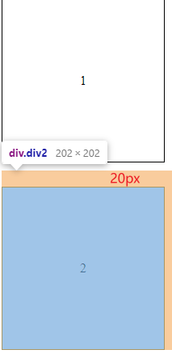

# CSS 笔记

## 一、CSS简介

### 1、概念

```
（1）css也是一门标记语言
（2）html用于做页面的结构，css用于做页面的美化，js用于做页面的动态交互
```

### 2、三种样式表

<font color='red'><style></style>之间的内容就是样式表</font>

<font color='red'>style样式表标签理论上可以放在html文件的任意地方，但一般放在head标签中</font>

根据样式表的位置，可以将样式表划分为三类

（1）行内样式表

```
<div style="height: 100px;width: 100px;border: 1px solid black;"></div>

###标签中的style属性就是标签的行内样式表
```

（2）内部样式表

```
<head>
  <meta charset="UTF-8">
  <title>Test</title>
  <style>
    div {
      height: 100px;
      width: 100px;
      border: 1px solid black;
    }
  </style>
</head>

###一般存放于head标签中的style标签中的样式就是内部样式表（style标签中的样式表可以放在html文件的任何位置）
```

（3）外部样式表

```
###写在html文件外部的css文件（后缀.css）

<head>
  <meta charset="UTF-8">
  <title>Test</title>
  <link rel="stylesheet" href="./css/Test.css">
</head>

###通过head标签中使用link标签引入外部的css文件就是外部样式表
```

### 3、三种样式表的优先级

```
###前提
优先级的讨论针对的是不同的样式表对于同一属性都进行的引入产生的影响。
如果说三种样式表分别引入了不同的属性，则它们之间并不会产生冲突，所有引入的属性都会被加到标签上
```

```
###结论
行内样式表 > 内部或者外部样式表
```

```
###内部样式表和外部样式表的优先级问题

内部样式表和外部样式表的优先级取决于二者的引入顺序问题，先引入的会被后引入的覆盖（引入顺序，html文件从上到下）。
比如说：如果先引入内部后引入外部，则最终外部样式表起作用；如果先引入外部后引入内部，则最终内部样式表起作用。
先后取决于link标签和style标签的引入顺序，也就是谁前谁在后的问题。
```


### 4、引入样式表

#### a、link

```
***语法***
<link rel="stylesheet" href="./css/Test.css">
```

```
（1）推荐使用
（2）本身属于html标签
（3）可以在html文件中的任意位置引入，但是一般放在head标签中
（4）不存在兼容性问题
```

#### b、@import

```
***语法***
@import url("./css/Test.css");
```

```
（1）不推荐使用
（2）本身属于css提供的功能
（3）只能写在样式表里（style或者外部样式表中）
（4）存在兼容性问题
（5）当存在在外部样式表中还可以在样式表中引入其他的样式表
```

### 5、网页的三种布局方式

```
（1）标准流
	块级元素：从上到下，每个独占一行
	行级元素：每行从左到右依次排列，当碰到父级标签的边缘时换行
	
（2）浮动
	元素添加浮动之后会脱离原来的标准流，不占据之前的空间。浮于标准流元素之上

（3）定位
```


## 二、CSS三大特性

### 1、层叠性

```
（1）层叠性就是对某一个元素的某一个属性设置了多次。比方说对于color这个属性第一次设置了为red，第二次设置了为green。
（2）当出现样式层叠，元素具体选用哪个样式取决于样式添加的先后顺序，最终以后添加的样式为主
```

### 2、继承性

```
（1）继承性就是说子元素会继承父元素的某些样式属性
（2）父元素的字体大小，颜色之类的样式会被子元素继承
```

### 3、优先级

```
（1）优先级是指当不同的选择器对元素的同一个属性设置了多次样式，最终会选用哪一个
（2）id选择器 > 类选择器或者伪类选择器 > 标签选择器 > 通配符选择器
```


## 三、选择器

### 1、基础选择器

#### a、标签选择器

```
标签名{

}
```

#### b、类选择器

```
.类名{

}
```

```
css中类需要注意：
（1）多个标签可以使用同一个类名。这也就意味着添加了同一个类名的标签具有相同的样式
（2）一个标签中可以添加多个类名，不同的类名之前需要用空格隔开。例如<div class='class1 class2'></div>
```

#### c、Id选择器

```css
/* 将id为a的标签选出 */
#a{

}
```

> 注意：id需要唯一

#### d、通配符选择器

```css
/*1、将页面所有标签选出*/
*{

}
```

#### e、属性选择器

```css
/*1、将含有a属性的标签选出*/
[a]{

}

/*2、将含有a属性并且属性值是1的标签选出*/
[a="1"]{
    
}
```


#### 优先级

```
（1）选择器的优先级是针对如果多个选择器中对标签的同一个属性做出了修改，而最终选择哪个选择器中的属性的优先级
（2）优先级：id选择器 > class选择器 > 标签 > 通配符
（3）!important：不管选择器之间的优先级，将!important标注的属性作为标签的最终属性。
		例如：
		.blue{
			background-color: blue !important;
		}
		#red{
			background-color: red;
		}
		结果就是blue。因为虽然id选择器的优先级大于类选择器但是类选择器中使用了!important，这样被标注的属性就获得了最大的优先级。
		!important;不推荐使用
```


### 2、复合选择器

#### a、后代选择器

```
选出某个标签中的所有子标签

ul *{} ： ul标签下的所有子标签
ul li{} ： ul标签下的所有li标签
```

#### b、子代选择器

```
选出某个标签中的直接子标签

ul > *{} ： ul标签下直接子标签中的所有标签
ul > li{} ： ul标签下直接子标签中的所有li标签
```

#### c、并集选择器

```
合并多个选择器的结果

选择器1，选择器2，选择器3...{

}

***选择器与选择器之间使用“，”分隔开
```

#### d、兄弟选择器

<font color=red>css中不支持直接选出某个元素的前一个元素</font>

```
（1）选出选择器1所代表元素的相邻的下一个元素

选择器1 + 选择器2{

}

比方说:
<ul>
	<li>1</li>
	<li>2</li>
	<li>3</li>
</ul>
假如选择器1代表1，则会将2选出

（2）选出选择器1所代表元素的相邻的下面的所有元素

选择器1 ~ 选择器2{

}

比方说:
<ul>
	<li>1</li>
	<li>2</li>
	<li>3</li>
</ul>
假如选择器1代表1，则会将1之后的2和3全部选出
```

#### e、交集选择器

```
取多个选择器结果的公共部分

选择器1选择器2选择器3...{

}

***选择器与选择器之间紧紧贴合即可
```

#### f、伪类选择器

<font color='red'>看到 : (冒号)就是伪类选择器</font>

##### （1）:link

```
***用法：
	选择器：link{}
***含义：用于a标签，将没有访问过的链接选出来
```

##### （2）:visited

```
***用法:
	选择器:visited{}
***含义：
	用于a标签，将访问过的链接选择出来
```

##### （3）:hover

```
***用法:
	选择器:hover{}
***含义：
	将鼠标经过的标签选择出来
```

##### （4）:active

```
***用法:
	选择器:active{}
***含义：
	将鼠标正在点击标签（鼠标按下但是没有弹起）选择出来
```

##### （5）:focus

```
***用法:
	选择器:focus{}
***含义：
	用于input输入框，将获得焦点的标签选择出来
```


## 四、Emmet语法

<font color='red'>emmet语法的主要作用就是提高html/css代码的编写速度</font>

```
（1）快速生成html双标签
	标签名 + tab
```

```
（2）快速生成多个相同的标签
	div*3 + tab
```

```
（3）生成填充内容的双标签
	div{内容} + tab
```

```
（4）写出带有id或者class的标签
	div.类名 + tab
	div#id名 + tab
```

```
（5）写出父子级关系的标签
	div > li + tab
```

```
（6）写出兄弟关系的标签
	div + div + tab
```

```
（7）自增符号$
	比如：
	a、div$*3 => <div1></div1>
				<div2></div2>
				<div3></div3>
	b、div.class$ => <div class="class1"></div>
					<div class="class2"></div>
					<div class="class3"></div>
	c、div{$}*3 => <div>1</div>
				<div>2</div>
				<div>3</div>
```


## 五、Icon

### 1、icon

|  |
| ------------------------------------------------------------ |

```
网站的窗口的小图片就是网页的icon
```

### 2、icon 使用

```
（1）直接放在根目录
	a、将ico文件直接放在web项目的根目录下就会被自动加载。
	b、直接放在根目录的方式，那么一定要保证icon的文件名为 "favicon.ico"
```

```
（2）Link标签引入
	a、在head标签中使用 <link rel="icon" href="../img/img.png"> 来引入
	b、一定要加rel="icon"
	c、通过link引入的话那么icon文件的名字不限
```

### 3、icon 总结

```
（1）对于一个网站来说icon是可有可无的，但是服务器在加载页面的时候都会去请求icon，没有就是404。所以说最好加上去
（2）icon的格式不一定为ico，也可以是其他的图片格式。但是所有的浏览器都支持ico，但不是所有的浏览器都支持其他的图片格式的icon
（3）如果在icon的使用中的两种方法都使用了，那么最终的icon已link引入的为主
```

### 4、icon 制作

http://www.faviconico.org/


## 六、元素显示模式

### 1、块级元素

```
（1）独占一行
（2）宽高，内外边距可以调节
（3）有默认宽度，默认宽度为父级容器宽度的100%
（4）常见块级元素：div
```

### 2、行内元素

```
（1）多个行内元素可以存在于一行显示
（2）宽高，内外边距不可调节
（3）没有默认宽度，具体的宽高由其中的内容决定
（4）常见行内元素：span
```

### 3、行内块元素

```
（1）多个行内块元素可以存放在一行显示
（2）宽高，内外边距可以调节
（3）没有默认宽高，宽高由其中的元素决定
（4）常见的行内块：img，input，button
```

### 4、元素显示模式转换

```
（1）转块级元素
display : block;

（2）转行内元素
display : inline;

（3）转行内块元素
display : inline-block;

（4）隐藏元素
display : none;
注意：这种隐藏之后，被隐藏元素之前占用的空间也会被释放
```


## 七、字体

### 1、大小

```
font-size ： 16px;
```

```
###解释：
（1）px（像素）为字体大小单位
（2）不同的浏览器对于字体有相应的默认大小，谷歌浏览器的默认大小为16px
```

### 2、粗细

```
font-weight ： normal
```

```
###属性：
（1）normal：正常
（2）bold：加粗
（3）数字表示：
	100 200 300 -> 变细
	400 500 -> 正常
	600 700 800 900 -> 变粗
```

### 3、倾斜

```
font-style ： normal
```

```
###属性：
normal：正常
italic：倾斜
```


## 八、文本

### 1、颜色

```
color ： red;
```

```
###颜色的三种表示方法：
（1）预定义值：red，green，yellow...类似的颜色英文单词都是预定义的颜色值
（2）十六进制：#ffffff（白色）
（3）rgb代码：
	a、rgb(175, 216, 39)
	b、rgba(175, 216, 39, 1) ：最后一位代表透明度，取值范围是0-1，0代表透明，1代表不透明。可写可不写，不写默认为1
```

### 2、水平对齐

```
text-align: center;
```

```
###属性：
（1）center：居中
（2）left：左边
（3）right：右边
```

```
###注意：
（1）text-align不仅仅对于文本有效，对于像button，span等行内标签也是有效的
（2）比方说div中存在一个button，想让这个button在div中水平居中对齐，应该将text-align: center;加在外层的div上，而不是button上。也就是说text-align: center;的作用是让标签内的文本,行内元素或者行内块元素居中对齐
```

### 3、修饰

```
 text-decoration：underline;
```

```
###属性：
（1）underline：文本添加下划线（链接之类）
（2）overline：上划线
（3）line-througn：删除线
```

### 4、缩进

```
text-indent：20px;
```

```
###缩进单位：
（1）px：直接指定固定的缩进
（2）em：1em的大小就是font-size的大小。比方说某个div中设定了font-size：16px;那么此时添加font-indent:2em;相当于锁进了32px
```

### 5、行高

```
line-height：100px;
```

```
###行高：
（1）行高=上边距+文字高度+下边距
（2）下边距=上边距
```

```
###行高的三种情况：（line-height加在子元素上）
（1）行高=容器高度：文字垂直居中对齐
（2）行高大于容器高度：文字垂直偏下
（3）行高小于容器高度：文字垂直偏上
```


## 九、背景

### 1、背景颜色

```
background-color: green;
```

```
###属性
（1）内置颜色值：red，blue，green之类
（2）16进制
（3）rgb或者rgba
（4）transparent（透明：默认值）
```

### 2、背景图片

```
background-image: url("./img/640.png");
```

```
###属性
（1）none：默认没有背景图片
（2）url("")：背景图片的路径
```

### 3、背景平铺

```
background-repeat: repeat;
```

```
平铺的意思就是当背景图片比容器本身小的时候，是否通过重复使用图片将容器占满

###属性：
	repeat：平铺（默认 x和y轴全部铺满）
	no-repeat：不平铺
	repeat-x：x轴方向铺满
	repeat-y：y轴方向铺满
```

| 属性      | 表现（红色边框是容器大小）                                   |
| --------- | ------------------------------------------------------------ |
| repeat    |  |
| no-repeat |  |
| repeat-x  |  |
| repeat-y  |  |

### 4、背景图片位置

```
background-position: center;
```

```
###属性
（1）访问名词：top，bottom，left，right，center
（2）精确数字或者百分比：x，y
```

```
###注意：
（1）如果使用x，y的格式，那么第一个值一定代表x，第二个一定代表y
（2）如果使用x，y的格式，但是只写了第一个值，则该值代表x，而y默认垂直居中
```

### 5、背景图片固定

```
background-attachment : fixed;
```

```
###属性
（1）scroll：背景图片随着页面其他元素的滚动而滚动（默认）
（2）fixed：背景图片固定
```


## 十、盒子模型

### 1、盒子模型

|  |
| ------------------------------------------------------------ |
| HTML标签：<br /> <div id="box"></div><br />CSS样式：<br />\#box {<br/>  width: 500px;<br/>  height: 500px;<br/>  border: 5px solid black;<br/>  padding: 10px;<br/>  margin: 20px;<br/>} |
|                                                              |
| margin：外边距                                               |
| border：边框                                                 |
| padding：内边距                                              |
| width：内容宽                                                |
| height：内容高                                               |

```
###注意：
（1）如果你已经设置了盒子的宽和高，而又使用了padding或者border，那么原本的盒子会被撑大。而不是说削减width或者height，使得border+padding+削减后的width/height = 原来的width/height。
（2）***盒子的实际宽度和高度***：
	宽度=width+padding+border
	高度=height+padding+border
（3）盒子的padding和border影响盒子的大小
```

### 2、边框

```
border：1px solid black;
```

```
###属性：
	（1）1px：边框的宽度
	（2）solid：边框的风格
		a、solid：实线
		b、dotted：点线
		c、dashed：虚线
	（3）black：边框颜色
```

```
###注意：
	可以使用border-left，border-right，border-top，border-bottom分别对四条边框设置样式
```

### 3、圆角边框

```
border-radius：1px 2px 3px 4px;（从上开始，顺时针）
```

```
特殊：
	圆形：当height=width时，border-radius为宽或者高的一半或者为50%，为一个圆
```

### 4、边框间隙问题

| 表格单元格之间存在间隙问题     |                                                              |
| ------------------------------ | ------------------------------------------------------------ |
| 不加border-collapse: collapse; |  |
| 添加border-collapse: collapse; |  |

### 5、内边距padding

```
###使用：
	padding：1px; -> 上下左右1px
    padding：1px 2px; -> 上下1px，左右2px
    padding：1px 2px 3px; -> 上1px，左右2px，下3px
    padding：1px 2px 3px 4px; -> 上1px，右2px，下3px，左4px（顺时针）
    
    单独设置上下左右内边距：
    padding-top：上
    padding-bottom：下
    padding-left：左
    padding-right：右
```

### 6、外边距margin

```
###使用：
	margin：1px; -> 上下左右1px
    margin：1px 2px; -> 上下1px，左右2px
    margin：1px 2px 3px; -> 上1px，左右2px，下3px
    margin：1px 2px 3px 4px; -> 上1px，右2px，下3px，左4px（顺时针）
    
    单独设置上下左右外边距：
    margin-top：上
    margin-bottom：下
    margin-left：左
    margin-right：右
```

### 7、外边距合并问题

#### （1）情形1

| 盒子                                                         |
| ------------------------------------------------------------ |
| 盒子1：margin-bottom:30px;                                   |
|  |
| 盒子2：margin-top:20px;                                      |
|  |

```
a、问题
	盒子1下外边距为30px，盒子2上外边距为20px。
	正常情况下盒子1和盒子2垂直间距应该为50px，但实际上却是30px。
	也就是说盒子1和盒子2的外边距合并了，以最大的为准

b、解决
	尽量只给一个盒子添加margin
```

#### （2）情形2

| 盒子                                                         |
| ------------------------------------------------------------ |
| 蓝色盒子：margin-bottom:30px;                                |
|  |
| 粉色盒子：margin-bottom:20px;                                |
|  |

```
a、问题
	1、我们现在想实现的是粉色盒子在蓝色盒子中并且距离蓝色盒子上边缘20px
	但是实际上发现无法实现，粉色盒子顶部会紧贴蓝色盒子
	2、蓝色盒子的上外边距不是由他本身margin-top控制，而是由蓝色和粉色盒子两者之间margin-top的最大值决定的

b、解决
	1、为蓝色盒子添加边框
	2、为蓝色盒子添加内边距
	3、为蓝色盒子添加overflow:hidden;
	
	思路：使蓝色和粉色盒子分离
```

### 8、清除内外边距

```
*{
	margin:0px;
	padding:0px;
}
```


## 十一、阴影

### 1、盒子阴影

```
 box-shadow: h-shadow v-shadow blur spread color inset; 
```

```
###解释：
	（1）h-shadow
		a、x轴方向阴影的位置，可正可负。
		b、当为正，则阴影在盒子右边；当为负，则阴影在盒子左边（外阴影，内阴影则相反）
		c、盒子水平方向上，可以看作是有一个水平向右的x轴（右为正方向）
		
	（2）v-shadow
		a、y轴方向阴影的位置，可正可负。
		b、当为正，则阴影在盒子下边；当为负，则阴影在盒子上边（外阴影，内阴影则相反）
		c、盒子垂直方向上，可以看作有一个垂直向下的y轴（下为正方向）
		
	（3）blur
		阴影的模糊距离
		
	（4）spread
		a、阴影的大小（宽度）
		b、（关键）：当h-shadow或者v-shadow为0的时候，盒子上下或者左右都有阴影，上下或者左右阴影的宽度为spread宽度的一半（平分）
		
	（5）color
		阴影颜色
		
	（6）inset
		a、将阴影设置为内阴影（在盒子内部），默认是外阴影
		b、当设置为内阴影，所有的阴影的移动方向和上述的方向相反
```

### 2、文字阴影

```
 text-shadow: h-shadow v-shadow blur color;
```

```
###解释：
	（1）h-shadow
		a、阴影的水平方向
		b、大于0，阴影偏右；小于0，阴影偏左
		
	（2）v-shadow
		a、阴影的垂直方向
		b、大于0，阴影偏下；小于0，阴影偏上
	
	（3）blur
		阴影模糊距离
	
	（4）color
		阴影颜色
		
###注意：
	文字只有外阴影
```


## 十二、浮动

### 1、浮动使用

```
a、float: none;
	默认（不浮动）
b、float: left;
	元素向左边浮动
c、float: right;
	元素向右边浮动
```

### 2、浮动特点

#### a、添加位置

| 前置条件                                                     |
| ------------------------------------------------------------ |
| css                                                          |
|  |
| html                                                         |
|  |
| 表现                                                         |
|  |

| 演示                                                         |
| ------------------------------------------------------------ |
| （1）当在父级中添加左浮动：发现内部的子元素没变化，变化的是被添加浮动的父元素，浮动到了页面左边 |
|  |
| （2）当在子元素中添加浮动：发现所有的子元素浮动到了左边      |
|  |

```
***结论***

添加的浮动要添加的要浮动的元素上，而不是要浮动元素的父元素上
```

#### b、脱标问题

| 演示                                                         |
| ------------------------------------------------------------ |
|   |
| 蓝色盒子浮动：前                                             |
|  |
| 蓝色盒子浮动：后                                             |
|  |

```
***结论***

从演示可以看出，当蓝色盒子添加浮动之后：
	a、会脱离标准流不在占用原来的空间，页面的结构也会进行重构
	b、浮动的元素会浮在标准流元素之上
```

#### c、浮动后元素特性

| 演示                                                         |
| ------------------------------------------------------------ |
| 蓝色和粉色盒子浮动：前                                       |
|  |
| 蓝色和粉色盒子浮动：后                                       |
|  |

```
***结论***

1、浮动后的元素顶部对齐
2、浮动后的元素之间没有间隙
3、浮动后的元素可以看作是行内块元素
```

#### d、浮动终止问题

```
***结论***

1、碰到父元素的边缘会终止浮动
2、碰到其他其他的浮动块边缘会终止浮动
```

### 3、浮动清除

#### a、父元素高度选择问题

```
（1）在生产中，很多的情况下一般不对父元素设置默认高度，因为设置了默认高度就代表页面是死的，如果后续需要再往父元素中添加子元素，父元素的高度就无法随着子元素的添加而逐渐变高
```

| 演示                                                         |
| ------------------------------------------------------------ |
|  |
| 上图中，为父元素添加了默认高度，此时就产生了两个问题：<br />       a、当子元素太少的时候，父元素大量的空间浪费<br />       b、当子元素太多的时候，父元素空间又不够 |
|  |
| 上图中，不为父元素添加默认高度，其具体的高度由其中的子元素决定，随着子元素的添加和减少动态的调整高度（生产中使用的方法，也是最理想的情况） |

#### b、浮动产生的问题

```
（1）在上述父元素的高度选择中，我们可以知道父元素的高度选择一般不为父元素设置默认高度，其高度是由其中的子元素决定的。
（2）如果对父元素中的所有子元素设置浮动，那么所有的子元素就会脱离标准流，浮于标准流之上。那么父元素的高度就无法被子元素撑起来。父元素的兄弟元素会占据父元素之前高度所占据的空间，最终的结果就是浮动后的子元素遮挡父元素的兄弟元素的内容
```

| 演示                                                         |
| ------------------------------------------------------------ |
|  |
| 上图中，为1和2浮动之前                                       |
|  |
| 上图中，为1和2浮动之后<br />···可以发现当1和2浮动之后脱离标准流，父元素没有子元素支撑所有没有了高度，变成了一条线。既然父元素之前的空间没有了，那么父元素的兄弟元素就会占据父元素之前的空间。<br />···浮动后的元素遮挡了兄弟元素的内容 |

#### c、浮动的清除

<font color=red>浮动清除的核心思想：消除由于浮动对其他元素造成的影响</font>

```
clear:both;
clear:left;
clear:right;

注意：
	a、加在受浮动影响的元素上
	b、left：清除左浮动；right：清除右浮动；both：清除所有浮动
	c、clear:both;最为常用
```

#### d、浮动清除的方法

##### （1）额外标签法

```html
<div class="box">
  <div class="smallBox">1</div>
  <div class="smallBox">2</div>
  <div style="clear: both;"></div>
</div>
<div class="box" >兄弟</div>
```

```
做法：
	在所有的浮动元素后添加一个***块级***的空元素，并为这个空元素清除浮动
	（核心思想：使用一个块级元素，将父元素中所有浮动的元素包围起来，然后清除这个元素的浮动影响，那么就不会影响父元素下面）
```

##### （2）overflow法

```html
<div class="box" style="overflow: hidden;">
  <div class="smallBox">1</div>
  <div class="smallBox">2</div>
</div>
<div class="box" >兄弟</div>
```

```
做法：
	在父元素上添加overflow: hidden;
```

| overflow: hidden;   作用                                     |
| ------------------------------------------------------------ |
|  |
| 上图：父元素中有5个子元素，五个子元素的高度大于父元素的高度，所以会溢出一部分 |
|  |
| 上图：对父元素使用overflow: hidden;，发现溢出父元素的部分被隐藏了（这里的隐藏是不占据空间的隐藏） |

##### （3）伪元素标签法

```
.clear:after{
  content: "";
  visibility: hidden;
  display: block;
  height: 0px;
  clear: both;
}
```

```
做法：
	在父元素中添加上上述类名即可
```

##### （4）父元素设置默认高度

```
虽然一般情况下父元素不设置默认高度，但是给父元素设置默认高度可以解决浮动带来的问题。
因为之所以浮动会产生影响，主要就是因为父元素没有高度，当其中的子元素脱标之后，会导致父元素内部没有子元素支撑，会塌陷
```

