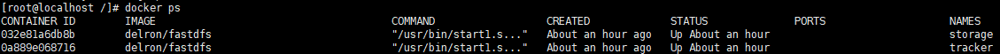
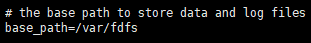
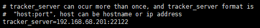
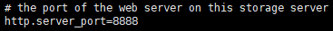
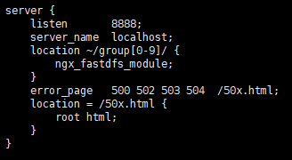
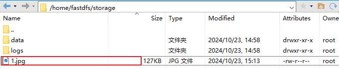
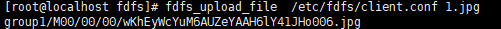

# Fastdfs安装


## 一、`Fastdfs`安装

## 1、启动服务

1. 拉取镜像

   ```shell
   docker pull delron/fastdfs:latest
   ```

   

2. 创建文件夹

   ```shell
   # 创建tracker
   mkdir /home/fastdfs/tracker
   ```

   ```shell
   # 创建storage
   mkdir /home/fastdfs/storage
   ```

   

3. 启动容器

   ```shell
   # 启动tracker
   docker run -id --name tracker --restart=always --net host -v /etc/localtime:/etc/localtime -v /home/fastdfs/tracker:/var/fdfs delron/fastdfs tracker
   ```

   ```shell
   # 启动storage
   # tracker地址：192.168.68.201:22122 
   docker run -id --name storage --restart=always --net host -v /etc/localtime:/etc/localtime -v /home/fastdfs/storage:/var/fdfs -e TRACKER_SERVER="192.168.68.201:22122" delron/fastdfs storage
   ```

   

4. 查询启动情况

   |  |
   | ------------------------------------------------------------ |

   

## 2、查看配置

1. 进入`storage`容器

   ```shell
   docker exec -it storage bash
   ```

   

2. .查询`storage`配置

   ```shell
   cat /etc/fdfs/storage.conf
   ```

   | 文件存储位置                                                 |
   | ------------------------------------------------------------ |
   |  |

   | tracker服务器地址                                            |
   | ------------------------------------------------------------ |
   |  |

   | storage服务器的访问端口                                      |
   | ------------------------------------------------------------ |
   |  |

   

3. 查询nginx配置

   ```shell
   cat /usr/local/nginx/conf/nginx.conf
   ```

   |  |
   | ------------------------------------------------------------ |


## 3、测试上传

1. 宿主机上传图片

   |  |
   | ------------------------------------------------------------ |

   

2. `storage`容器中`/var/fdfs`下也会出现该图片

   |  |
   | ------------------------------------------------------------ |

   

3. 执行上传

   ```shell
   fdfs_upload_file  /etc/fdfs/client.conf 1.jpg
   ```

   |  |
   | ------------------------------------------------------------ |

   

4. 查看图片

   访问：http://192.168.68.201:8888/group1/M00/00/00/wKhEyWcYuM6AUZeYAAH6lY41JHo006.jpg

   |  |
   | ------------------------------------------------------------ |

