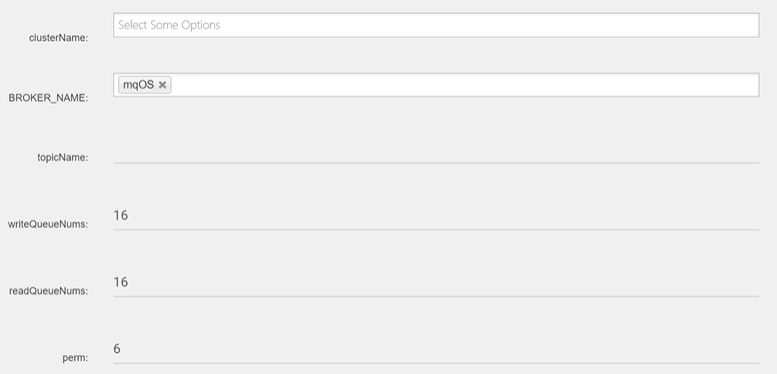
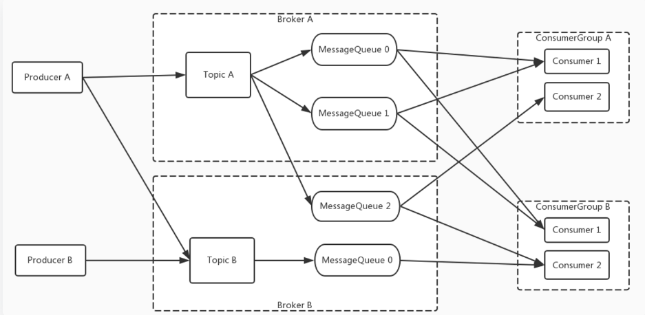
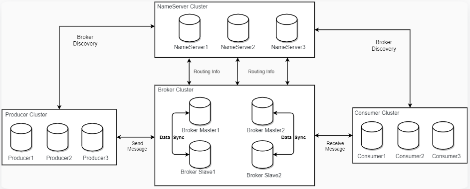

# RocketMQ 笔记

[参考文档](https://rocketmq.apache.org/zh/docs/4.x/introduction/02whatis)

## 一、`RocketMQ `概念

### 1、消息`message`

消息即数据，是消息生产和消费的最小单位，一个消息`message`必须属于一个主题`topic`。

### 2、主题`topic`

主题就是消息的分类，一个主题下有若干消息，一个消息只能属于一个主题。

主题为`RocketMq`消息订阅的基本单位。

消息生产者可以生产不同主题的消息，但是消息消费者只能消费特定主题下的消息。

> **针对消息，主题，生产者，消费者之间的关系理解**
>
> 一个项目开发中项目总管理者用于发布测试或者开发任务，不论是开发任务还是测试任务，任务就可以看作是一个个的消息。项目的总管理者可以看作是消息的生产者，用于发布测试或者开发任务(消息)，由此可以看出生产者可以生产不同类型的任务即不同主题的消息。而任务分成了测试任务和开发任务，测试和开发就是任务的类型即消息的类型，也就是说测试和开发这两个任务类型就可以看作是消息的主题即消息的类型。项目组中分成开发人员和测试人员，这两类人就可以看作是消费者，用来执行任务(消费消息) ，并且开发人员只处理开发任务，测试人员只处理测试任务，由此可以看出消费者只消费特定主题的消息。

### 3、标签`tag`

标签就是子主题，用于同一个主题下再区分不同类型的消息。

### 4、队列`queue`

一个主题中含有多个队列，一个队列中含有多个消息。

一个队列也被称为主题中一个消息的分区。

#### 4.1 读写队列

| RocketMq创建/修改Topic 界面                                  |
| ------------------------------------------------------------ |
|  |

读写队列属于逻辑上的概念，实际存储消息的队列并不区分读写队列，队列可读取消息可写入消息。

在创建或者修改 Topic 时（如上图），其中`writeQueueNums`代表创建的 Topic 的写队列数量，`readQueueNums`代表创建的 Topic 的读队列数量。一般情况下两者数量一致。如果不一致那么创建的队列数量就是两者的最大值。

比方说现在`writeQueueNums=8`，`readQueueNums=4`，此时会创建8个队列，其中0-7号队列均可写入消息，但是只有0-3号队列里的消息可以被读取然后消费，此时出现的问题就是4-7号队列中的消息无法被消费；如果`writeQueueNums=4`，`readQueueNums=8`，此时仍会创建8个队列，其中0-3可以写入消息，0-7可以读取消息，此时的问题就是4-7中不会被写入消息，去4-7中获取消息消费会浪费系统资源，因此一般情况下创建 Topic 需要保证`writeQueueNums`和`readQueueNums`一致。

之所以设计成需要分别填写`writeQueueNums`和`readQueueNums`的主要原因是为了方便队列的扩容和缩容。因为 Topic 的配置（如上图）是可以随时修改的。比方说现在初始`writeQueueNums=8`，`readQueueNums=8`，现在消息的数量比较少，此时可以缩小队列的数量，但是如果直接修改成`writeQueueNums=4`，`readQueueNums=4`，那么原本8个队列中的4个队列中的消息便不会在被消费，正确的作用是先将写入队列改成4，然后等另外4个队列中的消息消费完毕之后，再将读取队列改成4。扩容同理。

### 5、消息标识`messageId`

消息标识用来区分不同的消息，但是它可能并不是唯一的。

生产者`send()`消息时会生成一个`messageId`，当消息到达`broker`时，`broker`也会为消息生成一个`messageId`，这两个`messageId`生成的方式是不同的。并且在生产者发送消息的时候也可以携带与业务相关的ID标识。

## 二、`RocketMq`架构

### 1、生产者`producer`

消息生产者可以生产不同主题的消息。

### 2、消费者`consumer`

消息消费者只能消费特定主题下的消息。

#### 2.1 消费者两种负载均衡模式

- 集群模式（常用模式）

  一个队列中的消息只能被一个消费者组中一个消费者消费，不能被同一个消费者组的多个消费者消费，也就是说一个消费者组中的一个消费者只管一个队列中消息的消费。但是多个消费者组中的消费者可以消费同一个队列中的消息。比方说现在存在一个消费者组A，其中含有A1，A2，A3三个消费者，此时存在一个主题T，主题中含有三个队列Q1，Q2，Q3，如果说A1消费Q1，A2消费Q2，A3消费Q3这样是正确的，但是说如果A1消费Q1，A2消费Q1，A3消费Q2这样是错误，因为此时一个队列中的消息被一个消费者组中的多个消费者消费了。此时如果又有另一个消费者组B，其中含有B1，B2，B3三个消费者，那么B1消费Q1，A1消费Q1此时一个队列被多个消费者消费但是多个消费者不属于同一个消费者组那么此时就是正确的，也就是说一个队列中的消息可以被多个消费者组中的消费者消费，但是对于同一个消费者组来说只能被其中的一个消费者消费。

  | 集群模式模型图                                               |
  | ------------------------------------------------------------ |
  |  |

- 广播模式

  一个队列中的消息可以被一个消费组中的所有消费者消费。比方说现在存在一个消费者组C，其中存在C1，C2，C3三个消费者，此时存在一个主题T，主题中含有三个队列Q1，Q2，Q3，那么C1可以消费Q1，Q2，Q3。C2可以消费Q1，Q2，Q3。那么C3可以消费Q1，Q2，Q3。				

### 3、名称服务器`nameServer`

NameServer是一个简单的 Topic 路由注册中心，支持 Topic、Broker 的动态注册与发现。

 NameServer通常会有多个实例部署，各实例间相互不进行信息通讯。NameServer 中信息的一致性主要靠 Broker 启动时向每一台NameServer注册自己的路由信息，所以每一个NameServer实例上面都保存一份完整的路由信息。当某个NameServer因某种原因下线了，客户端(Consumer 或 Producer)仍然可以向其它NameServer获取路由信息。

Broker 与 NameServer之间建立长连接，Broker 向 NameServer 发送心跳包，NameServer 定时查询心跳包的时间戳，当 NameServer 查询到 Broker 最新的心跳时间戳距离当前时刻超过设定的时间间隔就会认为 Broker 宕机，然后就会将该 Broker 剔除出路由信息。

### 4、代理服务器`broker`

`broker`是消息存储服务器。

在 Master-Slave 架构中，Broker 分为 Master 与 Slave。一个Master可以对应多个Slave，但是一个Slave只能对应一个Master。Master 与 Slave 的对应关系通过指定相同的`BrokerName`，不同的`BrokerId `来定义，`BrokerId`为0表示Master，非0表示Slave。Master也可以部署多个。

> `RcoketMq`架构总结
>
> - 每个 **Broker** 启动时都会与 **NameServer** 集群中的所有节点建立长连接，定时注册 Topic 信息到所有 NameServer，即 Topic 和 Broker 的对应关系，生产者可根据 Topic 找到存储 Broker，将对应的消息存到指定的 Broker。
> - **Producer** 与 **NameServer** 集群中的其中一个节点建立长连接，定期从 NameServer 获取Topic路由信息，并向提供 Topic 服务的 Broker 的 Master 建立长连接，且定时向 Master 发送心跳。Producer 完全无状态。
> - **Consumer** 与 **NameServer** 集群中的其中一个节点建立长连接，定期从 NameServer 获取 Topic 路由信息，并向提供 Topic 服务的 Broker 的 Master、Slave 建立长连接，且定时向 Master、Slave发送心跳。Consumer 既可以从 Master 订阅消息，也可以从Slave订阅消息。

| `RocketMq`架构模型                                           |
| ------------------------------------------------------------ |
|  |

### 5、工作流程

1. 启动NameServer

   启动NameServer。NameServer启动后监听端口，等待Broker、Producer、Consumer连接，相当于一个路由控制中心。

2. 启动 Broker

   启动 Broker。与所有 NameServer 保持长连接，定时向 NameServer 发送心跳包。心跳包中包含当前 Broker 信息以及存储所有 Topic 信息。注册成功后，NameServer 集群中就有 Topic跟Broker 的映射关系。

3. 创建 Topic

   创建 Topic 时需要指定该 Topic 要存储在哪些 Broker 上，也可以在发送消息时自动创建Topic。

4. 生产者发送消息

   生产者发送消息。启动时先跟 NameServer 集群中的其中一台建立长连接，并从 NameServer 中获取当前发送的 Topic存在于哪些 Broker 上，轮询从队列列表中选择一个队列，然后与队列所在的 Broker建立长连接从而向 Broker发消息。

5. 消费者接受消息

   消费者接受消息。跟其中一台NameServer建立长连接，获取当前订阅Topic存在哪些Broker上，然后直接跟Broker建立连接通道，然后开始消费消息。

## 三、`RocketMq`安装

详见`RocketMQ搭建.md`

[RocketMQ搭建 笔记]: ./RocketMQ安装.md

## 四、

