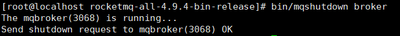

# RocketMQ 搭建


<font color=red>以下所有内容基于`RocketMq 4.9.4`且需要具备`Java 8`及其以上的运行环境。</font>

[RocketMq参考文档](https://rocketmq.apache.org/zh/docs/4.x/quickstart/01quickstart/)


## 一、`RocketMq`单机版安装

### 1、下载

- 下载

  下载地址：https://rocketmq.apache.org/zh/docs/4.x/quickstart/01quickstart/

  |  |
  | ------------------------------------------------------------ |

  

- 上传 linux

  |  |
  | ------------------------------------------------------------ |

  

- 解压

  ```shell
  # 解压指令
  unzip rocketmq-all-4.9.4-bin-release.zip -d /home/rocketmq
  ```

  |  |
  | ------------------------------------------------------------ |


### 2、配置

<font color=pink>主要修改默认情况下的内存配置。</font>

以下所有配置位于`/bin`目录下

- `runbroker.sh`

  |  |
  | ------------------------------------------------------------ |

  ```shell
  JAVA_OPT="${JAVA_OPT} -server -Xms2g -Xmx2g"
  ```

- `runserver.sh`

  |  |
  | ------------------------------------------------------------ |

  ```shell
  JAVA_OPT="${JAVA_OPT} -server -Xms1g -Xmx1g -Xmn512m -XX:MetaspaceSize=128m -XX:MaxMetaspaceSize=320m"
  ```

  

### 3、启动

<font color=pink>先启动`NameServer`，再启动`Broker`。</font>

#### 3.1`NameServer`启动

```shell
# 进入rocketmq的根目录
cd /home/rocketmq/rocketmq-all-4.9.4-bin-release
# 后台运行rocketmq的nameserver并将日志输出到/home/rocketmq/logs/nameserver.log下
nohup sh bin/mqnamesrv > /home/rocketmq/logs/nameserver.log 2>&1 &

# 查看启动日志
tail -f /home/rocketmq/logs/nameserver.log
```

查询日志发现如下结果代表 **NameServer** 启动成功。

|  |
| ------------------------------------------------------------ |


#### 3.2`Broker`启动

```shell
# 进入rocketmq的根目录
cd /home/rocketmq/rocketmq-all-4.9.4-bin-release
# 启动broker连接NameServer:localhost:9876 并将日志输出到/home/rocketmq/logs/broker.log下
nohup sh bin/mqbroker -n localhost:9876 > /home/rocketmq/logs/broker.log 2>&1 &

# 查看启动日志
tail -f /home/rocketmq/logs/broker.log
```

查看日志发现如下结果代表 **Broker** 启动成功。

|  |
| ------------------------------------------------------------ |


### 4、消息收发测试


### 5、服务关闭

<font color=pink>先关闭`Broker`，再关闭`NameServer`。</font>

- 关闭`Broker`

  ```shell
  # 进入rocketmq的根目录
  cd /home/rocketmq/rocketmq-all-4.9.4-bin-release
  
  # 关闭
  sh bin/mqshutdown broker
  ```

  |  |
  | ------------------------------------------------------------ |

  

- 关闭`NameServer`

  ```shell
  # 进入rocketmq的根目录
  cd /home/rocketmq/rocketmq-all-4.9.4-bin-release
  
  # 关闭
  sh bin/mqshutdown namesrv
  ```

  |  |
  | ------------------------------------------------------------ |

  

## 二、控制台安装

### 1、控制台项目下载

<font color=pink>`RocketMq`控制台项目是一个`SpringBoot`项目。</font>

- 下载

  **github**地址：https://github.com/apache/rocketmq-dashboard

  

- 修改配置文件

  1. 修改端口

     ```yaml
     server:
       port: 7000
     ```

  2. 修改`NameServer`

     ```yaml
     rocketmq:
       config:
         namesrvAddrs:
           # 修改NameServer连接地址
           - 192.168.75.201:9876
     ```


### 2、控制台项目启动

- maven打包

  |  |
  | ------------------------------------------------------------ |

  

- 上传Linux

  |  |
  | ------------------------------------------------------------ |

  

- 启动Jar包

  ```shell
  # 进入Jar包位置
  cd /home/rocketmq/dashboard
  
  # 启动Jar包:以关闭会话不关闭程序的方式在后台启动当前目录下的rocketmq-dashboard-2.0.1-SNAPSHOT.jar,将日志输出到/home/rocketmq/logs/dashboard.log包括错误日志,
  nohup java -jar rocketmq-dashboard-2.0.1-SNAPSHOT.jar > /home/rocketmq/logs/dashboard.log 2>&1 &
  ```

  ```shell
  # 查询启动日志
  tail -f /home/rocketmq/logs/dashboard.log
  ```

  |  |
  | ------------------------------------------------------------ |


### 3、控制台访问

访问：http://192.168.75.201:7000/

|  |
| ------------------------------------------------------------ |


