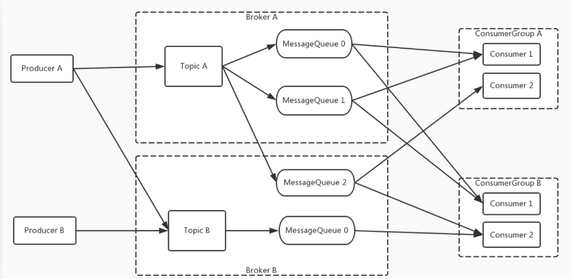
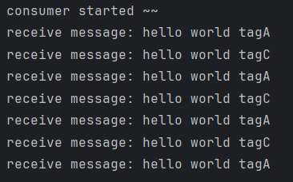

# RocketMQ 笔记


[<font color=pink>参考文档</font>](https://rocketmq.apache.org/zh/docs/4.x/introduction/02whatis)


## 一、`RocketMQ `概念

### 1、消息`message`

消息即数据，是消息生产和消费的最小单位，<font color=pink>一个消息`message`必须属于一个主题`topic`</font>。


### 2、主题`topic`

<font color=pink>主题就是消息的分类，一个主题下有若干消息，一个消息只能属于一个主题。</font>

主题为`RocketMq`消息订阅的基本单位。

<font color=pink>消息生产者可以生产不同主题的消息，但是消息消费者只能消费特定主题下的消息。</font>


> <font color=skyblue>**针对消息，主题，生产者，消费者之间的关系理解**</font>
>
> <font color=skyblue>一个项目开发中项目总管理者用于发布测试或者开发任务，不论是开发任务还是测试任务，任务就可以看作是一个个的消息。项目的总管理者可以看作是消息的生产者，用于发布测试或者开发任务(消息)，由此可以看出生产者可以生产不同类型的任务即不同主题的消息。而任务分成了测试任务和开发任务，测试和开发就是任务的类型即消息的类型，也就是说测试和开发这两个任务类型就可以看作是消息的主题即消息的类型。项目组中分成开发人员和测试人员，这两类人就可以看作是消费者，用来执行任务(消费消息) ，并且开发人员只处理开发任务，测试人员只处理测试任务，由此可以看出消费者只消费特定主题的消息。</font>


### 3、标签`tag`

标签就是子主题，用于同一个主题下再区分不同类型的消息。

在Broker推送消息的时候用于过滤消息。


### 4、队列`queue`

<font color=pink>一个主题中含有多个队列，一个队列中含有多个消息。</font>

一个队列也被称为主题中一个消息的分区。

#### 4.1 读写队列

| RocketMq创建/修改Topic 界面                                  |
| ------------------------------------------------------------ |
|  |

读写队列属于逻辑上的概念，实际存储消息的队列并不区分读写队列，队列可读取消息可写入消息。

在创建或者修改 Topic 时（如上图），其中`writeQueueNums`代表创建的 Topic 的写队列数量，`readQueueNums`代表创建的 Topic 的读队列数量。一般情况下两者数量一致。如果不一致那么创建的队列数量就是两者的最大值。

比方说现在`writeQueueNums=8`，`readQueueNums=4`，此时会创建8个队列，其中0-7号队列均可写入消息，但是只有0-3号队列里的消息可以被读取然后消费，此时出现的问题就是4-7号队列中的消息无法被消费；如果`writeQueueNums=4`，`readQueueNums=8`，此时仍会创建8个队列，其中0-3可以写入消息，0-7可以读取消息，此时的问题就是4-7中不会被写入消息，去4-7中获取消息消费会浪费系统资源，因此一般情况下创建 Topic 需要保证`writeQueueNums`和`readQueueNums`一致。

之所以设计成需要分别填写`writeQueueNums`和`readQueueNums`的主要原因是为了方便队列的扩容和缩容。因为 Topic 的配置（如上图）是可以随时修改的。比方说现在初始`writeQueueNums=8`，`readQueueNums=8`，现在消息的数量比较少，此时可以缩小队列的数量，但是如果直接修改成`writeQueueNums=4`，`readQueueNums=4`，那么原本8个队列中的4个队列中的消息便不会在被消费，正确的作用是先将写入队列改成4，然后等另外4个队列中的消息消费完毕之后，再将读取队列改成4。扩容同理。


### 5、消息标识`messageId`

消息标识用来区分不同的消息，但是它可能并不是唯一的。

生产者`send()`消息时会生成一个`messageId`，当消息到达`broker`时，`broker`也会为消息生成一个`messageId`，这两个`messageId`生成的方式是不同的。并且在生产者发送消息的时候也可以携带与业务相关的ID标识。


## 二、`RocketMq`架构

### 1、生产者`producer`

<font color=pink>消息生产者可以生产不同主题的消息。</font>


### 2、消费者`consumer`

<font color=pink>消息消费者只能消费特定主题下的消息。</font>			


### 3、名称服务器`nameServer`

NameServer是一个简单的 Topic 路由注册中心，支持 Topic、Broker 的动态注册与发现。

 <font color=pink>NameServer通常会有多个实例部署，各实例间相互不进行信息通讯。</font>NameServer 中信息的一致性主要靠 Broker 启动时向每一台NameServer注册自己的路由信息，所以每一个NameServer实例上面都保存一份完整的路由信息。当某个NameServer因某种原因下线了，客户端(Consumer 或 Producer)仍然可以向其它NameServer获取路由信息。

Broker 与 NameServer之间建立长连接，Broker 向 NameServer 发送心跳包，NameServer 定时查询心跳包的时间戳，当 NameServer 查询到 Broker 最新的心跳时间戳距离当前时刻超过设定的时间间隔就会认为 Broker 宕机，然后就会将该 Broker 剔除出路由信息。


### 4、代理服务器`broker`

<font color=pink>`broker`是消息存储服务器。</font>

在 Master-Slave 架构中，Broker 分为 Master 与 Slave。一个Master可以对应多个Slave，但是一个Slave只能对应一个Master。Master 与 Slave 的对应关系通过指定相同的`BrokerName`，不同的`BrokerId `来定义，`BrokerId`为0表示Master，非0表示Slave。Master也可以部署多个。


> <font color=skyblue>`RcoketMq`架构总结</font>
>
> - 每个 **Broker** 启动时都会与 **NameServer** 集群中的所有节点建立长连接，定时注册 Topic 信息到所有 NameServer，即 Topic 和 Broker 的对应关系，生产者可根据 Topic 找到存储 Broker，将对应的消息存到指定的 Broker。
> - **Producer** 与 **NameServer** 集群中的其中一个节点建立长连接，定期从 NameServer 获取Topic路由信息，并向提供 Topic 服务的 Broker 的 Master 建立长连接，且定时向 Master 发送心跳。Producer 完全无状态。
> - **Consumer** 与 **NameServer** 集群中的其中一个节点建立长连接，定期从 NameServer 获取 Topic 路由信息，并向提供 Topic 服务的 Broker 的 Master、Slave 建立长连接，且定时向 Master、Slave发送心跳。Consumer 既可以从 Master 订阅消息，也可以从Slave订阅消息。

| `RocketMq`架构模型                                           |
| ------------------------------------------------------------ |
|  |


### 5、工作流程

1. 启动NameServer

   启动NameServer。NameServer启动后监听端口，等待Broker、Producer、Consumer连接，相当于一个路由控制中心。

2. 启动 Broker

   启动 Broker。与所有 NameServer 保持长连接，定时向 NameServer 发送心跳包。心跳包中包含当前 Broker 信息以及存储所有 Topic 信息。注册成功后，NameServer 集群中就有 Topic跟Broker 的映射关系。

3. 创建 Topic

   创建 Topic 时需要指定该 Topic 要存储在哪些 Broker 上，也可以在发送消息时自动创建Topic。

4. 生产者发送消息

   生产者发送消息。启动时先跟 NameServer 集群中的其中一台建立长连接，并从 NameServer 中获取当前发送的 Topic存在于哪些 Broker 上，轮询从队列列表中选择一个队列，然后与队列所在的 Broker建立长连接从而向 Broker发消息。

5. 消费者接受消息

   消费者接受消息。跟其中一台NameServer建立长连接，获取当前订阅Topic存在哪些Broker上，然后直接跟Broker建立连接通道，然后开始消费消息。


## 三、`RocketMq`安装

详见`RocketMQ搭建.md`

[RocketMQ搭建 笔记]: ./RocketMQ安装.md


## 四、`RocketMq`工作原理

### 1、消息生产

#### 1.1 消息投递路由

Producer与NameServer建立连接，从NameServer中获取路由信息。通过生产消息的Topic获取Topic队列所在的所有Broker的BrokerName，因为一个Topic有多个Queue，这些Queue分布在不同的Broker上，因此一个Topic对应多个BrokerName。一个BrokerName代表的是一个Broker集群，BrokerId=0为主机，非0为从机，然后根据BrokerId找到Broker对应的IP。通过Queue选择算法将消息送至相应Broker上的Queue存储。


#### 1.2 Queue选择算法

<font color=pink>针对无序消息。</font>

- 轮询算法

  假设一个Topic存在4个Queue：Q1，Q2，Q3，Q4。轮询算法就是当Producer生产消息后按Q1，Q2，Q3，Q4的顺序依次投递消息。

  存在的问题：轮询过程中如果某个Queue的延迟过高没有及时响应，在响应之前不会继续轮询，会导致生产者生产的消息积压。

- 最小投递延迟算法

  消息投递的过程中计算响应的延迟，优先投递给延迟低的Queue所在的Broker。

  存在的问题：特殊情况下，如果某个Queue的延迟一直是最低的，那么该Queue会接收大部分的消息，导致消费该Queue的Consumer负担过重，而消费其他Queue的Consumer处于空闲，降低消费效率。


### 2、消息消费

#### 2.1 消费模式

- 集群模式（默认）

  <font color=pink>一个队列中的消息只能被一个消费者组中一个消费者消费，不能被同一个消费者组的多个消费者消费，也就是说一个消费者组中的一个消费者只管一个队列中消息的消费。但是多个消费者组中的消费者可以消费同一个队列中的消息。</font>比方说现在存在一个消费者组A，其中含有A1，A2，A3三个消费者，此时存在一个主题T，主题中含有三个队列Q1，Q2，Q3，如果说A1消费Q1，A2消费Q2，A3消费Q3这样是正确的，但是说如果A1消费Q1，A2消费Q1，A3消费Q2这样是错误，因为此时一个队列中的消息被一个消费者组中的多个消费者消费了。此时如果又有另一个消费者组B，其中含有B1，B2，B3三个消费者，那么B1消费Q1，A1消费Q1此时一个队列被多个消费者消费但是多个消费者不属于同一个消费者组那么此时就是正确的，也就是说一个队列中的消息可以被多个消费者组中的消费者消费，但是对于同一个消费者组来说只能被其中的一个消费者消费。

  | 集群模式模型图                                               |
  | ------------------------------------------------------------ |
  |  |

- 广播模式

  <font color=pink>一个队列中的消息可以被一个消费组中的所有消费者消费。</font>比方说现在存在一个消费者组C，其中存在C1，C2，C3三个消费者，此时存在一个主题T，主题中含有三个队列Q1，Q2，Q3，那么C1可以消费Q1，Q2，Q3。C2可以消费Q1，Q2，Q3。那么C3可以消费Q1，Q2，Q3。	


#### 2.2 消费进度

- 集群模式：集群模式需要保证消息不能被重复消费（同一个消费者组的情况下），所以消息消费的进度需要被所有的消费者共享，因此消费进度存储在 Broker，所有消费者公用一个消费进度。
- 广播模式：广播模式下每个消费者都会消费所有队列中的消息，消费者之间的消费速度存在差异，每个消费者的消费进度也不会影响其他的消费者，因此消费进度存储在每个 Consumer，每个Consumer有不同的消费进度 。


#### 2.3 Queue分配算法

- 平均分配策略

  平均分配策略：先根据`QueueNum / ConsumerNum`得出每个消费者需要分配的Queue的数量，之后余数在按顺序依次分配给Consumer。

  如下图，现存在10个Queue和4个Consumer，由于`10/4=2...2`，那么每个Consumer应该分配2个Queue，而余下的2个Queue就会从第一个Consumer开始依次分配，那么最终的结果就是ConsumerA和ConsumerB分配3个Queue，而其他的每个Consumer分配2个Queue。

  |  |
  | ------------------------------------------------------------ |

  

- 环形分配策略

  环形分配策略：依次将队列分配给Consumer即可。

  如下图从队列Queue0开始依次分配给ConsumerA,ConsumerB......

  |  |
  | ------------------------------------------------------------ |

  

- 一致Hash策略

  一致Hash策略：计算Queue和Consumer的Hash值，算出其在Hash环上的位置，然后Queue属于顺时针方向上遇到的第一个Consumer。

  <font color=pink>对于平均分配策略和环形分配策略来说优势是较小的运算，但是当出现Consumer的扩容和缩容是需要Rebalance较多的Queue。而一致Hash策略虽然有较多的运算，但是当出现Consumer的扩容和缩容时Rebalance较少的Queue。</font>

  |  |
  | ------------------------------------------------------------ |


### 3、Rebalance

#### 3.1 Rebalance机制

<font color=pink>Rebalance机制：集群模式下一个队列只能被一个消费者组中的一个消费者进行消费，一个主题下的多个队列被均衡的分配给消费者组中的每个消费者。当调整消费者组中消费者的数量的时候就会触发再次将队列均衡分配给不同消费者的过程。</font>

如下图中 Topic 存在5个队列，如果一开始消费者组中只有一个消费者，那么该消费者会消费5个队列中的消息，但是当增加一个消费者的时候就会重新进行平衡，第一个消费者消费其中3个队列，另外一个消费另外的2个队列，这一过程就是Rebalance的过程。

<font color=red>注意：Rebalance机制只针对消费的集群模式，因为在广播模式下每个消费者都会消费一个主题下的所有队列中的消息，即便添加新的消费者，新的消费者也会消费所有队列中的消息，因此广播模式下不会也不需要进行队列的平衡。</font>

|  |
| ------------------------------------------------------------ |


#### 3.2 Rebalance限制

当消费者组中消费者的数量大于等于 Topic 中队列的数量的时候，即便再增加消费者，也不会触发 Rebalance。


#### 3.3 Rebalance问题

1. 消费暂停

   触发 Rebalance 后消费者组中所有的消费者都会暂停对队列的消费，只有当队列重新分配完毕之后才会重新进行消费。

2. 消费重复

   在消费的集群模式下，消费者在消费完一批消息之后会先将消费的 Offset 提交给 Broker之后，再拉取一批新的消息进行消费，这一过程是异步的。在增加消费者之后触发 Rebalance ，消费者A的原本消费完成的但是 Offset 还没有存储到 Broker 那一批消息的队列被分配给了消费者B，那么消费者B在拉取消息的时候就会再次将那一批消息拉取下来进行消费，造成消息的重复消费。

3. 消费突刺

   消费暂停时未消费的消息，以及 Rebalance 时未及时提交 Offset的消息，会导致在 Rebalance 完毕之后需要消费大量的消息。


### 4、订阅要求

<font color=pink>**一个消费者组中的消费者只能订阅相同的Topic和Tag。**</font>

**错误订阅**

- 一个ConsumerGroup中的两个Consumer订阅不同的Topic
- 一个ConsumerGroup中的两个Consumer订阅不同的Tag
- 一个Consumer订阅多个Topic


## 五、`RocketMq` 应用

<font color=pink>以下所有案例均可在如下仓库的`com.yg.sb_template.mq.rocetmq.demo`包下找到。</font>

Git仓库地址：https://gitee.com/yg-bing/sb_template.git


### 1、基本使用

- 启动NameServer和Broker

  详见 **RocketMq安装笔记**

  [RocketMq安装笔记]: ./RocketMQ安装.md

  

- 依赖

  ```xml
  <!-- RocketMq依赖 -->
  <dependency>
      <groupId>org.apache.rocketmq</groupId>
      <artifactId>rocketmq-client</artifactId>
      <version>${rocketmq.client.version}</version>
  </dependency>
  ```

  

- 生产者发送消息

  ```java
  public class ProducerDemo {
      public static void main(String[] args) throws Exception {
          // 1、创建生产者
          DefaultMQProducer producer = new DefaultMQProducer("test-producer-group-1");
          // 2、生产者指定NameServer地址
          producer.setNamesrvAddr("192.168.75.201:9876");
          // 3、启动生产者
          producer.start();
  
          for (int i = 0; i < 10; i++) {
              // 4、创建消息
              Message msg = new Message("test-topic-1", "tagA", ("hello world " + i).getBytes());
              // 5、发送消息
              producer.send(msg);
          }
          // 6、关闭生产者
          producer.shutdown();
      }
  }
  ```

  | 发送结果                                                     |
  | ------------------------------------------------------------ |
  |  |

  | 消息详情                                                     |
  | ------------------------------------------------------------ |
  |  |

  

- 消费者消费消息

  ```java
  public class ConsumerDemo {
      public static void main(String[] args) throws Exception {
          // 1、创建消费者（接收Broker的消息推送）
          DefaultMQPushConsumer consumer = new DefaultMQPushConsumer("test-consumer-group-1");
          // 2、消费者指定NameServer地址
          consumer.setNamesrvAddr("192.168.75.201:9876");
          // 3、订阅主题
          consumer.subscribe("test-topic-1", "*");
          // 4、消费者注册监听器（当收到Broker的消息推送就会执行）
          consumer.registerMessageListener(new MessageListenerConcurrently() {
              @Override
              public ConsumeConcurrentlyStatus consumeMessage(
                  List<MessageExt> list, 
                  ConsumeConcurrentlyContext consumeConcurrentlyContext) {
                  
                  System.out.println("receive message size: " + list.size());
                  for (MessageExt messageExt : list) {
                      System.out.println("receive message: " + new String(messageExt.getBody()));
                  }
                  
                  return ConsumeConcurrentlyStatus.CONSUME_SUCCESS;
              }
          });
          // 5、启动消费者
          consumer.start();
          System.out.println("consumer started ~~");
      }
  }
  ```

  | 消费结果                                                     |
  | ------------------------------------------------------------ |
  |  |


### 2、消息类型

官方：https://rocketmq.apache.org/zh/docs/4.x/producer/02message1

#### 2.1 简单消息

##### 2.1.1 同步消息

<font color=pink>生产者发送同步消息后会阻塞并等待Broker的响应，只有获取到Broker的响应之后生产者才会继续执行。下述的`producer.send`方法存在返回值，说明发送消息后需要立即获取响应，不然不会往下执行。</font>

```java
public class SyncMsg {
    public static void main(String[] args) throws Exception {
        DefaultMQProducer producer = new DefaultMQProducer("test-producer-group-1");
        producer.setNamesrvAddr("192.168.75.201:9876");
        producer.start();

        for (int i = 0; i < 10; i++) {
            Message msg = new Message("test-topic-1", "tagA", ("hello world " + i).getBytes());
            // 发送同步消息
            SendResult sendResult = producer.send(msg);
            System.out.println("【同步消息发送结果】" + sendResult);
        }
        producer.shutdown();
    }
}
```


##### 2.1.2 异步消息

<font color=pink>生产者发送异步消息不会阻塞会继续往下执行不要求实时获取响应结果，生产者通过回调接口`SendCallback#onSuccess`获取Broker的响应结果。下述的`producer.send`没有返回值，代表不需要立马获取到响应结果，而是通过提供一个回调接口`SendCallback`来获取Broker的响应结果或者处理异常。</font>

```java
public class AsyncMsg {
    public static void main(String[] args) throws Exception {
        DefaultMQProducer producer = new DefaultMQProducer("test-producer-group-1");
        producer.setNamesrvAddr("192.168.75.201:9876");
        producer.setRetryTimesWhenSendFailed(0);
        producer.start();

        for (int i = 0; i < 10; i++) {
            Message msg = new Message("test-topic-1", "tagA", ("hello world " + i).getBytes());
            // 异步发送消息
            producer.send(msg, new SendCallback() {
                @Override
                public void onSuccess(SendResult sendResult) {
                    System.out.println("【异步消息发送结果】SUCCESS" + sendResult);
                }

                @Override
                public void onException(Throwable throwable) {
                    System.out.println("【异步消息发送结果】FAIL");
                    throwable.printStackTrace();
                }
            });
        }
		// 注意此时不能关闭生产者，否则无法获取响应结果
    }
}
```


##### 2.1.3 单向消息

<font color=pink>单向消息只管发送不管结果(不论成功与否)，因此`producer.sendOneway`同样没有返回值。单向消息的特性可能导致消息的丢失。</font>

```java
public class SingleMsg {
    public static void main(String[] args) throws Exception {
        DefaultMQProducer producer = new DefaultMQProducer("test-producer-group-1");
        producer.setNamesrvAddr("192.168.75.201:9876");
        producer.start();

        for (int i = 0; i < 10; i++) {
            Message msg = new Message("test-topic-1", "tagA", ("hello world " + i).getBytes());
            // 发送单向消息
            producer.sendOneway(msg);
        }
        producer.shutdown();
    }
}
```


### 3、顺序消息

官方：https://rocketmq.apache.org/zh/docs/4.x/producer/03message2

#### 3.1 局部顺序消息

 <font color=pink>局部顺序消息指的是在一个Topic中多个队列中，每个队列中消息的消费是顺序的。一个消费者可能同时消费多个队列，在纵向选择队列中是随机的不是顺序的，但是只要选择了某个队列，那么在此队列中消息的消费就是顺序的，即横向消费是顺序的。</font>

- 消费者

  ```java
  public class OrderConsumer {
      public static void main(String[] args) throws Exception {
          DefaultMQPushConsumer consumer = new DefaultMQPushConsumer("test-consumer-group-1");
          consumer.setNamesrvAddr("192.168.75.201:9876");
          consumer.subscribe("test-topic-1", "*");
  
          // 定义顺序消费监听器`MessageListenerOrderly`
          consumer.registerMessageListener(new MessageListenerOrderly() {
              @Override
              public ConsumeOrderlyStatus consumeMessage(
                  List<MessageExt> list, 
                  ConsumeOrderlyContext consumeOrderlyContext) {
                  for (MessageExt messageExt : list) {
                      // 打印消费消息所在Queue的QueueId，以及消息内容Body
                      System.out.println(StrUtil.format(
                          "receive message: queue:{},body:{}", 
                          messageExt.getQueueId(), 
                          new String(messageExt.getBody())));
                  }
                  return ConsumeOrderlyStatus.SUCCESS;
              }
          });
  
          consumer.start();
          System.out.println("consumer started ~~");
      }
  }
  ```

  

- 生产者

  ```java
  /**
   * 局部消息
   */
  public class PartMsg {
      public static void main(String[] args) throws Exception {
          DefaultMQProducer producer = 
              new DefaultMQProducer("test-producer-group-1");
          producer.setNamesrvAddr("192.168.75.201:9876");
          producer.start();
  
          for (int i = 0; i < 10; i++) {
              Message msg = new Message(
                  "test-topic-1", "tagA", ("hello world " + i).getBytes());
              // 发送指定MessageQueue的消息
              // 发送消息，队列的选择逻辑：i为偶数存入QueueId=0的Queue，i为奇数存入QueueId=1的Queue
              SendResult sendResult = producer.send(msg, new MessageQueueSelector() {
                  @Override
                  public MessageQueue select(
                      List<MessageQueue> list, Message message, Object o) {
                      Integer flag = (Integer) o;
                      return flag % 2 == 0 ? list.get(0) : list.get(1);
                  }
              }, i);
          }
          producer.shutdown();
      }
  }
  ```

  发送指定Queue的消息的`send`方法解释：

  - `msg`：待发送的消息

  - `new MessageQueueSelector() {}`：MessageQueue选择方法，需要实现`select`方法，如下

    ```java
    public MessageQueue select(List<MessageQueue> list, Message message, Object o) {
    }
    ```

    其中`List<MessageQueue> list`就是对应Topic下的所有Queue，`Message message`为要发送的消息，`Object o`为外部传入的值，对应外部的`i`。

    方法的返回值就是当前Message要存入的Queue。

  - `i`：外部传入的值，对应`MessageQueueSelector`接口方法的`Object o`参数

- 测试结果

  <font color=skyblue>`hello world`后面的数字其实就是外部的`i`，`i`为奇数则消息都存入`QueueId=1`，`i`为偶数则消息都存入`QueueId=0`。而循环的`i=0-9`，那么`QueueId=1`中的消息存入的顺序为`1-3-5-7-9`，`QueueId=1`中的消息存入的顺序为`0-2-4-6-8`，由消费顺序可以验证在每个Queue中消息的消费是有序的，但是整体的顺序却是`1-0-3-2-5-4-7-6-8-9`，是无序的。</font>

  |  |
  | ------------------------------------------------------------ |


#### 3.2 全局顺序消息

 <font color=pink>全局顺序消息指的是在一个Topic中所有消息的消费是顺序的。本质上也是局部顺序消息，只不过是将Topic下所有的消息存入一个队列中，在一个队列中保证消息消费的顺序。</font>


### 4、广播消息

<font color=pink>默认情况下一个队列中的消息只会被一个消费者组中的一个消费者消费，最终的结果就是一个Topic中的所有消息只会被一个消费者消费一次，这就是消费者的集群模式，消费者默认开启集群模式进行消费。广播模式就是每个消费者都会消费Topic下的所有队列中的所有消息。</font>

- 消费者（开启多个）

  ```java
  public class BroadcastConsumer {
      public static void main(String[] args) throws Exception {
          DefaultMQPushConsumer consumer = 
              new DefaultMQPushConsumer("test-consumer-group-1");
          consumer.setNamesrvAddr("192.168.68.201:9876");
          consumer.subscribe("test-topic-1", "*");
          // 开启广播模式：默认集群模式
          consumer.setMessageModel(MessageModel.BROADCASTING);
  
          consumer.registerMessageListener(new MessageListenerConcurrently() {
              @Override
              public ConsumeConcurrentlyStatus consumeMessage(
                  List<MessageExt> list, 
                  ConsumeConcurrentlyContext consumeConcurrentlyContext) {
                  for (MessageExt messageExt : list) {
                      System.out.println("receive message: " +
                                         new String(messageExt.getBody()));
                  }
                  return ConsumeConcurrentlyStatus.CONSUME_SUCCESS;
              }
          });
  
          consumer.start();
          System.out.println("consumer started ~~");
      }
  }
  ```

  

- 生产者：启动任意生产者

- 测试结果

  <font color=skyblue>生产者发送了10条消息，每个消费者都消费了10条。</font>

  | 消费者1                                                      |
  | ------------------------------------------------------------ |
  |  |

  | 消费者2                                                      |
  | ------------------------------------------------------------ |
  |  |


### 5、延迟消息

官方：https://rocketmq.apache.org/zh/docs/4.x/producer/04message3

<font color=pink>延迟消息就是消息发送后延迟消费（Broker延迟推送）。</font>

- 生产者

  ```java
  public class ScheduleProducer {
      public static void main(String[] args) throws Exception {
          DefaultMQProducer producer = 
              new DefaultMQProducer("test-producer-group-1");
          producer.setNamesrvAddr("192.168.68.201:9876");
          producer.start();
  
          for (int i = 0; i < 10; i++) {
              Message msg = new Message(
                  "test-topic-1", "tagA", ("hello world " + i).getBytes());
              // 设置消息消费延迟等级
              msg.setDelayTimeLevel(2);
              SendResult sendResult = producer.send(msg);
              System.out.println("【消息发送结果】" + sendResult);
          }
  
          producer.shutdown();
      }
  }
  ```

  

- 消费者：启动任意消费者

**详解：**

上述中的`msg.setDelayTimeLevel(2);`作用是给消息设置延迟等级。

**RocketMq中内置18个消息延迟等级。**

|  |
| ------------------------------------------------------------ |
|  |

等级1为延迟1s消费，等级2为延迟5s消费...，等级18延迟2h消费。开源版本的RocketMq不可自定义延迟时间。也就是说上述中`msg.setDelayTimeLevel(2);`就是设置消息延迟等级为2，也就是延迟5s后消费消息。

RocketMq实现延迟消息的原理是将延迟消息放入内置的延迟Topic中，RocketMq存在名为`SCHEDULE_TOPIC_XXXX`的Topic用于处理延迟消息。

|  |
| ------------------------------------------------------------ |


`SCHEDULE_TOPIC_XXXX`含有queueId=0-17，共18个队列。其中queueId=0存储延迟等级为1的消息，queueId=17存储延迟等级为18的消息。

|  |
| ------------------------------------------------------------ |


### 6、批量消息

官方：https://rocketmq.apache.org/zh/docs/4.x/producer/05message4

<font color=pink>批量消息主要的作用就是用来提升性能，如果要发送大量消息并且每次只发送一条消息的话，那么生产者和消费者就会频繁的与Broker进行IO，而IO是比较消耗性能的操作。而批量消息可以一次发送一个消息的集合，避免频繁发送。</font>

<font color=skyblue>发送批量消息的大小每次不能超过4M，如果超过可以考虑分批发送。</font>

- 消费者：启动任意消费者

- 生产者

  消息发送方法中使用消息集合的作为参数就代表要发送一个批量消息`producer.send(msgList)`

  ```java
  public class BatchProducer {
      public static void main(String[] args) throws Exception {
          DefaultMQProducer producer = new DefaultMQProducer("test-producer-group-1");
          producer.setNamesrvAddr("192.168.75.201:9876");
          producer.start();
  
          List<Message> msgList = new ArrayList<>();
          for (int i = 0; i < 10; i++) {
              Message msg = new Message("test-topic-1", "tagA", ("hello world " + i).getBytes());
              msgList.add(msg);
          }
          // 发送批量消息
          SendResult sendResult = producer.send(msgList);
          System.out.println("【消息发送结果】" + sendResult);
  
          producer.shutdown();
      }
  }
  ```

  

- 测试结果

   <font color=skyblue>批量消息发送会生成一条发送结果，发送结果中含有已发送消息集合中所有的**MsgId**</font>

  |  |
  | ------------------------------------------------------------ |


### 7、过滤消息

#### 7.1 TAG过滤

- 生产者

  ```java
  public class SqlProducer {
      public static void main(String[] args) throws Exception {
          DefaultMQProducer producer = new DefaultMQProducer("test-producer-group-1");
          producer.setNamesrvAddr("192.168.75.201:9876");
          producer.start();
  
          // 定义三种类型的tag
          String[] tags = {"tagA", "tagB", "tagC"};
          for (int i = 0; i < 10; i++) {
              Message msg = new Message("test-topic-1", 
                                        tags[i % tags.length], 
                                        ("hello world " + tags[i % tags.length]).getBytes());
              // 发送三类tag消息（最终会发送4条tagA，三条tagB，3条tagC）
              SendResult sendResult = producer.send(msg);
              System.out.println("【消息发送结果】" + sendResult);
          }
  
          producer.shutdown();
      }
  }
  ```

  

- 消费者

  tag过滤`consumer.subscribe("test-topic-1", "tagA || tagB");`，其中第二个参数如果是普通的字符串的话，那么就只对消息中的`TAGS`进行过滤，其支持`||`，`&&`，`*`等特殊字符的过滤。

  其中上述的`TAGS`来自消息的成员变量，即对消息中成员变量`TAGS`的值进行过滤，选择性消费。

  |  |
  | ------------------------------------------------------------ |

  

  ```java
  public class TagConsumer {
      public static void main(String[] args) throws Exception {
          DefaultMQPushConsumer consumer = new DefaultMQPushConsumer("test-consumer-group-1");
          consumer.setNamesrvAddr("192.168.75.201:9876");
          // tag过滤
          consumer.subscribe("test-topic-1", "tagA || tagB");
  
          consumer.registerMessageListener(new MessageListenerConcurrently() {
              @Override
              public ConsumeConcurrentlyStatus consumeMessage(List<MessageExt> list, ConsumeConcurrentlyContext consumeConcurrentlyContext) {
                  for (MessageExt messageExt : list) {
                      System.out.println("receive message: " + new String(messageExt.getBody()));
                  }
                  return ConsumeConcurrentlyStatus.CONSUME_SUCCESS;
              }
          });
  
          consumer.start();
          System.out.println("consumer started ~~");
      }
  }
  ```


#### 7.2 SQL过滤

- 前提

  <font color=pink>使用SQL过滤的前提是Broker开启`enablePropertyFilter`</font>

  1. 修改RocketMq的Broker配置文件，其位于RocketMq根目录下的conf文件夹下，例如`/home/rocketmq/rocketmq-all-4.9.4-bin-release/conf`。

     |  |
     | ------------------------------------------------------------ |

     在其中添加`enablePropertyFilter = true`

     |  |
     | ------------------------------------------------------------ |

     

  2. 以修改之后的配置文件重新启动Broker

     ```shell
     nohup sh bin/mqbroker -n localhost:9876 -c ./conf/broker.conf > /home/rocketmq/logs/broker.log 2>&1 &
     ```

     

  3. 查询是否开启

     |  |
     | ------------------------------------------------------------ |

  

- 生产者

  ```java
  public class SqlProducer {
      public static void main(String[] args) throws Exception {
          DefaultMQProducer producer = new DefaultMQProducer("test-producer-group-1");
          producer.setNamesrvAddr("192.168.75.201:9876");
          producer.start();
  
          // 定义三种类型的tag
          String[] tags = {"tagA", "tagB", "tagC"};
          for (int i = 0; i < 10; i++) {
              Message msg = new Message("test-topic-1", 
                                        tags[i % tags.length], 
                                        ("hello world " + tags[i % tags.length]).getBytes());
              // 发送三类tag消息（最终会发送4条tagA，三条tagB，3条tagC）
              SendResult sendResult = producer.send(msg);
              System.out.println("【消息发送结果】" + sendResult);
          }
  
          producer.shutdown();
      }
  }
  ```

  

- 消费者

  使用SQL过滤`MessageSelector.bySql("TAGS is not null and TAGS in ('tagA','tagC')")`，意为只有消息中的`TAGS`不为空并且是`tagA`或者`tagC`其中的一个的时候才会消费。

  SQL过滤的过滤语句写法与数据库的SQL基本一致，其中`TAGS`之类的字段，来自于消息中的成员变量，比方说如下的一个消息，其中与`TAGS`一样的消息的成员变量均可以作为SQL过滤的字段进行使用。

  |  |
  | ------------------------------------------------------------ |

  

  ```java
  public class SqlConsumer {
      public static void main(String[] args) throws Exception {
          DefaultMQPushConsumer consumer = new DefaultMQPushConsumer("test-consumer-group-1");
          consumer.setNamesrvAddr("192.168.75.201:9876");
          // 使用SQL过滤
          consumer.subscribe("test-topic-1", 
                             MessageSelector.bySql("TAGS is not null and TAGS in ('tagA','tagC')"));
  
          consumer.registerMessageListener(new MessageListenerConcurrently() {
              @Override
              public ConsumeConcurrentlyStatus consumeMessage(List<MessageExt> list, ConsumeConcurrentlyContext consumeConcurrentlyContext) {
                  for (MessageExt messageExt : list) {
                      System.out.println("receive message: " + new String(messageExt.getBody()));
                  }
                  return ConsumeConcurrentlyStatus.CONSUME_SUCCESS;
              }
          });
  
          consumer.start();
          System.out.println("consumer started ~~");
      }
  }
  ```

  

- 测试结果

  |  |
  | ------------------------------------------------------------ |


### 8、事务消息

官方：https://rocketmq.apache.org/zh/docs/4.x/producer/06message5

<font color=red>**事务消息的核心：<u>确保生产者本地事务和生产者消息发送的原子性</u>。也就是如果生产者本地事务执行失败那么生产者发送的存储在Boker的消息就不会推送给消费者消费，只有生产者本地事务执行成功，生产者发送的消息才会被推送给消费者。**</font>

#### 8.1 事务消息的流程

|  |
| ------------------------------------------------------------ |

1. 生产者发送**half消息**给Broker存储。**half消息**可以理解为一个预备的消息，**half消息**被发送后不会被Broker立即推送给消费者消费，只有在满足前置条件之后消息才会被Broker推送给消费者消费。

2. Broker接收到生产者发送的**half消息**后会响应给生产者成功接收的信号。生产者接收到Broker的成功响应之后就会执行本地事务任务，并将本地事务执行的结果告诉Broker，Broker会根据生产者本地事务的执行结果推送**half消息**或者丢弃**half消息**。

   

   **RocketMq提供了三种本地事务执行结果**

   | 事务执行状态     | 解释                                                         |
   | ---------------- | ------------------------------------------------------------ |
   | COMMIT_MESSAGE   | 告诉Broker本地事务执行成功，Broker会将**half消息**推送给消费者消费 |
   | ROLLBACK_MESSAGE | 告诉Broker本地事务执行失败，Broker将会丢弃**half消息**       |
   | UNKNOW           | 未知状态，Broker接收后会定期回查生产者本地事务的执行状态判断是提交还是回滚。 |


#### 8.2 事务消息的应用场景

|  |
| ------------------------------------------------------------ |

在上图中，用户下单后分成了两个分支来处理。其中主分支更新订单状态，子分支会发送一个MQ消息到Broker存储，此时Broker并不会把这个消息推送给消费者消息（消费会完成新增物流记录，添加用户积分，清空购物车等操作），因为此时消息仅仅是一个**half消息**。

在消息发送成功后主分支会完成订单信息的更新，如果更新操作处理成功，那么就会将`COMMIT_MESSAGE`状态告诉Broker，Broker就会将完成新增物流记录，添加用户积分，清空购物车等操作的**half消息**推送给相应的消费者来消费。

如果更新操作处理失败，那么就会将`ROLLBACK_MESSAGE`状态告诉Broker，此时Broker就会将该**half消息**丢弃。

如果更新操作的状态是未知的或者生产者迟迟没有给Broker一个本地事务处理的结果，那么Broker就会定期的去找生产者查询本地事务处理结果。


#### 8.3 事务消息的实现

- 自定义事务监听器

  <font color=pink>自定义事务监听器实现`TransactionListener`接口，重写`executeLocalTransaction`和`checkLocalTransaction`方法。其中`executeLocalTransaction`就是生产者本地事务执行的逻辑，`checkLocalTransaction`则是Broker回查生产者本地事务执行结果的逻辑。</font>

  如下本地事务的作用是如果tag为`tagA`那么就提交事务（Broker推送消息给消费者），否则全部为未知。

  如下回查逻辑中如果是`tagB`那么就提交事务（Broker推送消息给消费者），否则全部为未知。

  ```java
  public class CustomizeTransactionListener implements TransactionListener {
      /**
       * 执行生产者本地事务
       *
       * @param message 生产者成功发送的消息
       * @param o       外部传入的其他参数
       */
      @Override
      public LocalTransactionState executeLocalTransaction(Message message, Object o) {
          String tags = message.getTags();
          if ("tagA".equals(tags)) {
              return LocalTransactionState.COMMIT_MESSAGE;
          } else {
              return LocalTransactionState.UNKNOW;
          }
      }
  
      /**
       * 回查生产者本地事务执行结果
       *
       * @param messageExt 存储在Broker迟迟没有获取到明确的生产者本地事务处理结果的消息
       */
      @Override
      public LocalTransactionState checkLocalTransaction(MessageExt messageExt) {
          String tags = messageExt.getTags();
          System.out.println("tags = " + tags + " " + DateUtil.format(DateUtil.date(), "yyyy-MM-dd HH:mm:ss"));
          if ("tagA".equals(tags) || "tagB".equals(tags)) {
              return LocalTransactionState.COMMIT_MESSAGE;
          } else {
              return LocalTransactionState.UNKNOW;
          }
      }
  }
  ```

  

- 消费者：启动任意消费者

- 生产者

  ```java
  public class TranactionProducer {
      public static void main(String[] args) throws Exception {
          // 创建自定义的事务监听器对象
          TransactionListener transactionListener = new CustomizeTransactionListener();
          // 创建事务消息生产者
          TransactionMQProducer producer = new TransactionMQProducer("test-producer-group-1");
          producer.setNamesrvAddr("192.168.75.201:9876");
          // 创建线程池对象
          ExecutorService executorService = new ThreadPoolExecutor(5, 10, 60, TimeUnit.SECONDS, new ArrayBlockingQueue<>(200));
          // 生产者添加事务监听器
          producer.setTransactionListener(transactionListener);
          // 生产者添加线程池对象
          producer.setExecutorService(executorService);
          producer.start();
  
          String[] tags = {"tagA", "tagB", "tagC"};
          for (int i = 0; i < 10; i++) {
              Message msg = new Message("test-topic-1", tags[i % tags.length], ("hello world " + tags[i % tags.length]).getBytes());
              SendResult sendResult = producer.sendMessageInTransaction(msg, "param");
              System.out.println("【消息发送结果】" + sendResult);
          }
          System.out.println(" 消息发送完毕~~ " + DateUtil.format(DateUtil.date(), "yyyy-MM-dd HH:mm:ss"));
      }
  }
  ```

- 测试结果

  生产者发送消息后立刻会消费`tagA`，之后在回查中会再消费`tagB`

  | 消费者                                                       |
  | ------------------------------------------------------------ |
  |  |

  生产者中发送玩消息之后，回查方法会定时的被Broker调用查询本地事务的执行情况。

  | 生产者                                                       |
  | ------------------------------------------------------------ |
  |  |

  

## 六、`RocketMq`整合

### 1、SpringBoot

[SpringBoot整合RocketMq]: ./SpringBoot-RocketMq.md


### 2、SpringCloud

[SpringCloud整合RocketMq]: ./SpringCloud-RocketMq.md

