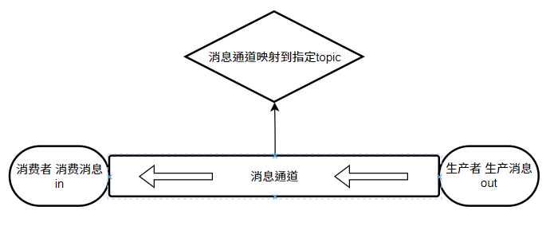
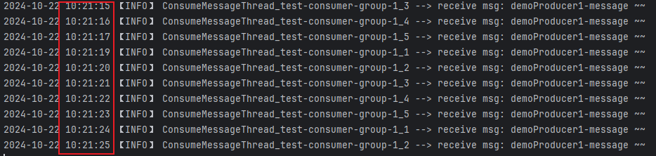
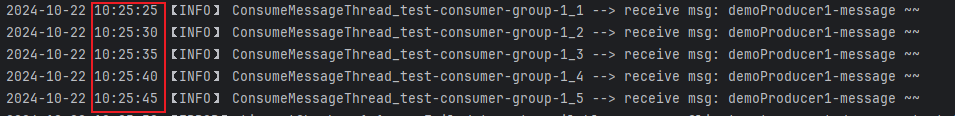

# SpringCloud-RocketMq


## 一、`SpringCloud`整合`RocketMq`

<font color=red>注意：以下整合基于`Spring Cloud Stream 3.X`的`RocketMq`的实现。</font>

### 1、依赖

```xml
<!-- Spring-Cloud-RocketMq依赖 -->
<dependency>
  <groupId>com.alibaba.cloud</groupId>
  <artifactId>spring-cloud-starter-stream-rocketmq</artifactId>
  <version>2023.0.1.2</version>
</dependency>
```


### 2、配置文件

**配置**：

```yaml
spring:
  cloud:
    function:
      definition: demoConsumer1
    stream:
      rocketmq:
        binder:
          name-server: 192.168.75.201:9876
      bindings:
        demoConsumer1-in-0:
          destination: test-topic-1
          group: test-consumer-group-1
          consumer:
            concurrency: 5
```

#### **解释**

- `spring.cloud.function.definition`：定义Bean对象的名称，与消息队列组合使用时实际上就是定义生产者或者消费者的对象的名字。

  使用`spring.cloud.function.definition`定义的Bean对象的名字可以与消息队列MQ进行绑定。

   与消息队列绑定后，当`spring.cloud.function.definition`定义的名字对应的Bean为`Supply`函数时它就会作为消息队列的生产者用于生产消息，当`spring.cloud.function.definition`定义的Bean为`Consumer`函数时它就会作为消息队列的消费者用于消费消息。

  <font color=pink>注意：如果需要定义多个名字，需要使用`;`分割，例如`spring.cloud.function.definition="consumer1;consumer2;consumer3"`。需要换行则使用`\`，例如`spring.cloud.function.definition="consumer1;\consumer2;\consumer3`</font>

- `spring.cloud.stream.rocketmq.binder`：用于配置消息中间件的连接信息，例如`name-server`代表`RocketMq`的名称服务器的地址。

- `spring.cloud.stream.bindings`：用于配置消息通道。

  <font color=pink>**消息通道用于连接生产者和消费者。通过配置将某个消息通道与消息队列MQ的某个topic进行映射，也就是说此时该通道用于流转该topic的消息，生产者生产的该topic的消息会经过该通道存储到Broker，Broker会通过该通道将该topic的消息推送给消费者消费。**</font>

  

  | 理解图                                                       |
  | ------------------------------------------------------------ |
  |  |
  


### 3、生产者

```java
@Component
public class DemoProducer {
    @Resource
    private StreamBridge streamBridge;

    public void send(String msg) {
        streamBridge.send("test-topic-1", msg);
    }
}
```


### 4、消费者

```java
@Configuration
public class DemoConsumer {
    @Bean
    public Consumer<String> demoConsumer1() {
        return msg -> System.out.println("receive msg: " + msg);
    }
}
```


### 5、测试类

```java
@SpringBootTest
public class RocketMqTests {
    @Resource
    private DemoProducer demoProducer;

    @Test
    public void test1() {
        demoProducer.send("hellow rocketmq ~");
    }
}
```

| 测试结果                                                     |
| ------------------------------------------------------------ |
|  |


## 二、`RocketMq`基本使用

### 1、消费者

- 定义消费者

  <font color=pink>使用`Consumer`函数式接口定义的Bean，会被当成消费者进行使用。`Consumer`接口的泛型就是生产者发送消息数据的类型。</font>

  ```java
  @Configuration
  @Slf4j
  public class DemoConsumer {
      @Bean
      public Consumer<String> demoConsumer1() {
          return msg -> log.info("receive msg: {}", msg);
      }
  }
  ```

  

- 配置文件

  ```yaml
  spring:
    cloud:
      function:
        # 定义消费者BeanName
        definition: demoConsumer1
      stream:
        rocketmq:
          binder:
            name-server: 192.168.68.201:9876
        bindings:
         # 消费者绑定映射test-topic-1主题的消息通道，用于消费该通道中的消息
          demoConsumer1-in-0:
            destination: test-topic-1
            group: test-consumer-group-1
            consumer:
              concurrency: 5
  ```

  

### 2、生产者

#### 2.1 手动生成

- 定义生产者

  <font color=pink>手动发送消息需要使用`StreamBridge`。</font>

  ```java
  @Component
  public class DemoProducer {
      @Resource
      private StreamBridge streamBridge;
  
      public void send(String msg) {
          streamBridge.send("test-topic-1", msg);
      }
  }
  ```

  

- 测试结果

  消费者使用`二.1`中的消费者。

  |  |
  | ------------------------------------------------------------ |


#### 2.2 自动生成

- 定义生产者

  ```java
  @Configuration
  public class DemoProducer {
      @Bean
      public Supplier<String> demoProduce1() {
          return () -> "demoProducer1-message ~~";
      }
  }
  ```

  

- 配置文件

  ```yaml
  spring:
    cloud:
      function:
        # 定义生产者demoProducer1和消费者demoConsumer1
        definition: "demoConsumer1;demoProducer1"
      stream:
        rocketmq:
          binder:
            name-server: 192.168.68.201:9876
        bindings:
        	# 消费者绑定映射test-topic-1主题的通道，会从该通道中获取消息并消费
          demoConsumer1-in-0:
            destination: test-topic-1
            group: test-consumer-group-1
            consumer:
              concurrency: 5
          # 生产者绑定映射test-topic-1主题的通道，会从向该通道中生产消息
          demoProducer1-out-0:
            destination: test-topic-1
  ```

  

- 测试结果

  <font color=skyblue>由测试结果来看，生产者会自动不断的生产新的消息，消费者不断的消费生产者生成出来的消息。默认情况下的生产频率是1s1条。</font>

  |  |
  | ------------------------------------------------------------ |

  可以通过如下配置控制生产者消除消息的频率

  ```yaml
  spring:
    cloud:
      function:
        # 定义生产者demoProducer1和消费者demoConsumer1
        definition: "demoConsumer1;demoProducer1"
      stream:
        rocketmq:
          binder:
            name-server: 192.168.68.201:9876
        bindings:
        	# 消费者绑定映射test-topic-1主题的通道，会从该通道中获取消息并消费
          demoConsumer1-in-0:
            destination: test-topic-1
            group: test-consumer-group-1
            consumer:
              concurrency: 5
          # 生产者绑定映射test-topic-1主题的通道，会从向该通道中生产消息
          demoProducer1-out-0:
            destination: test-topic-1
  			producer:
              	poller:
              		# 控制生成的生成频率为5000ms一条。单位ms
                		fixed-delay: 5000
  ```

  **测试结果**

  |  |
  | ------------------------------------------------------------ |


### 3、消费者+生产者

- 定义消费者+生产者

  ```java
  @Configuration
  @Slf4j
  public class DemoConsumer {
      // 定义test-topic-1主题的消费者，详见配置文件
      @Bean
      public Consumer<String> demoConsumer1() {
          return msg -> log.info("receive msg1: {}", msg);
      }
      
      // 定义test-topic-2主题的消费者以及test-topic-1主题消息的生产者，详见配置文件
      @Bean
      public Function<String, String> demoConsumerAndProducer() {
          return msg -> {
              log.info("receive msg3: {}", msg);
              return msg + ":" + msg;
          };
      }
  }
  ```

  

- 定义手动发送消息的生产者

  ```java
  @Configuration
  public class DemoProducer {
      @Resource
      private StreamBridge streamBridge;
  
      public void send(String topic, String msg) {
          // 手动发送任意主题的消息
          streamBridge.send(topic, msg);
      }
  }
  ```

  

- 配置文件

  ```yaml
  spring:
    cloud:
      function:
        # 定义生产者demoProducer1和(生产者+消费者)demoConsumerAndProducer
        definition: "demoConsumer1;demoConsumerAndProducer"
      stream:
        rocketmq:
          binder:
            name-server: 192.168.68.201:9876
        bindings:
        	# 消费者绑定映射test-topic-1主题的消息通道，会从该通道中获取消息并消费
          demoConsumer1-in-0:
            destination: test-topic-1
            group: test-consumer-group-1
            consumer:
              concurrency: 5
          # demoConsumerAndProducer作为消费者绑定在映射到test-topic-2主题的消息通道上，也就是说demoConsumerAndProducer会消费test-topic-2主题的消息
          demoConsumerAndProducer-in-0:
            destination: test-topic-2
            group: test-consumer-group-2
            consumer:
              concurrency: 5
          # demoConsumerAndProducer作为生产者绑定在映射到test-topic-1主题的消息通道上，也就是说demoConsumerAndProducer会生产test-topic-1主题的消息
          demoConsumerAndProducer-out-0:
            destination: test-topic-1
  ```

- 测试类

  <font color=skyblue>如下测试类中手动发送`test-topic-2`主题的消息，然后Broker就会通过`test-topic-2`所映射的通道中将消息推送给`demoConsumerAndProducer`进行消费。`demoConsumerAndProducer`消费消息之后会将消息的数据做`msg + ":" + msg`处理后将消息通过`test-topic-1`主题所映射的通道发送给Broker，Broker收到消息之后会再通过`test-topic-1`主题所映射的通道将消息推送给`demoConsumer1`消费。</font>

  ```java
  @SpringBootTest
  public class RocketMqTests {
      @Resource
      private DemoProducer demoProducer;
  
      @Test
      public void test1() {
          demoProducer.send("test-topic-2", "hellow rocketmq ~");
      }
  }
  ```

  

- 测试结果

  |  |
  | ------------------------------------------------------------ |


### 4、消息分组问题

生产者不强制进行分组，消费者必须进行分组。

一个topic所映射的消息通道中的一条消息只会被一个消费者组中的一个消费者所消费，但可以被多个消费者组中的多个消费者消费。

一个topic所映射的消息通道中的一条消息会被一个消费者组中的一个消费者消费，消费者通过负载均衡的方式选择出一个消费者消费，但是对整个消费者组来说一条消息只会被一个消费者消费。
