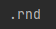
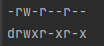
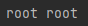
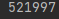
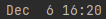
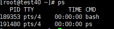
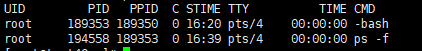

# Linux  常用指令


## 1、用户目录和根目录

### （1）根目录

```shell
# linux中没有盘符这一概念，只有一个根目录，所有的文件或者目录都是从根目录开始的
cd /
```

### （2）家目录

```shell
# 家目录：当前登录系统用户的工作目录
# 对于root用户来说用户目录就是/root目录
cd ~
```

<hr></hr>

## 2、绝对路径和相对路径

绝对路径：linux中从根目录下开始的路径就是绝对路径。

相对路径：linux中不是从根目录下开始的路劲就是相对路劲。

<hr></hr>

## 3、文件类型

- 蓝色：目录
- 灰色：普通文件
- 绿色：可执行程序
- 浅蓝色：链接文件
- 红色：压缩文件

<hr></hr>

## 4、命令行下的快捷键

- `ctrl+c`：终止正执行的程序
- `ctrl+l`：清屏
- `ctrl+a`：跳至行首
- `ctrl+e`：跳至行末

<hr></hr>

## 5、帮助

```shell
# 查询指令使用文档
ls --help
cd --help
```

<hr></hr>

## 6、指令历史

```
#作用：查询最近执行过的指令
```

| 指令               | 解释                           |
| ------------------ | ------------------------------ |
| history            | 展示最新的1000条指令           |
| history n          | 展示指定数量的指令，n是数字    |
| history -c         | 清除所有历史记录               |
| history -w xxx.txt | 将指令历史记录保存在指定文件内 |

<hr></hr>

## 7、查询文件或文件夹

```
#作用：展示当前目录下的所有文件和文件夹
```

| 指令  | 解释                               | 效果                                                         |
| ----- | ---------------------------------- | ------------------------------------------------------------ |
| ls -a | 查询全部文件，包含隐藏文件         | <br/>linux中以.开头的为隐藏文件 |
| ls -l | 查询文件详细信息                   |  |
| ls -h | 查询文件详细信息（文件大小带单位） |  |


```
#文件权限问题
#引申：用户和用户组的概念
	（1）linux中可以存在多个用户，并且多个用户可以同时登录进行作业；window中虽然也可以创建多个用户，但是同一时间只允许登录一个用户
	（2）linux中的用户可以分为三类：超级用户（root），普通用户，伪用户（不可登录）
	（3）如果想为10个用户赋予写A文件的权力，第一种方法就是分别为每个用户赋予权力，第二种方法是创建一个用户组，让该用户组拥有对该文件的写权力，然后将这10个用户加入到用户组中那么这10个用户就具有了对A文件写的权力
```

| 模块                                                         | 解析                                                         |
| ------------------------------------------------------------ | ------------------------------------------------------------ |
|  | 一共10个字符组成。<br>第一个字符代表文件的类型，-代表是普通文件，d代表是目录。<br>第一个三位，文件所属用户的权限<br>第二个三位，用户组所具有的权限<br>第三个三位，其他用户具有的权限 |
|  | 从左到右，所有者，用户组                                     |
|  | 文件大小                                                     |
|  | 文件最后一次修改的时间                                       |
|  | 文件或者文件夹的名字                                         |

<hr></hr>

## 8、文件查看

| 指令                      | 作用                                         |
| ------------------------- | -------------------------------------------- |
| cat 文件名                | 正向查看文件                                 |
| tac 文件名                | 逆向查看文件                                 |
| nl 文件名                 | 正序带行号查看文件                           |
| head -n 获取的行数 文件名 | 从文件开头获取指定行数<br>不指定默认开头10行 |
| tail -n 获取的行数 文件名 | 从文件结尾获取指定行数<br>不指定默认最后10行 |
| tail -f  文件名           | 实时查看文件内容                             |

<hr></hr>

## 10、文件管理

| 指令                                                         | 作用                                                         |
| ------------------------------------------------------------ | ------------------------------------------------------------ |
| ><br>>><br>ls > a.txt<br>ls >> a.txt                         | 输出重定向。<br>将本应该输出到控制台的信息输出到<br>指定文件中。<br>>将输出的内容覆盖文件中原本的内容<br>>>将输出的内容追加到文件原本内容的尾部 |
| clear                                                        | 清屏<br>作用等同于ctrl+l                                     |
| \|<br>ps -ef\|grep merchant                                  | 将一个指令的输出作用另一个指令的输入                         |
| cd<br>cd .<br/>cd ..<br/>cd ~<br/>cd /<br/>cd -              | 切换目录<br/>切换至当前目录<br/>切换到上一级目录<br/>切换到用户工作目录<br/>切换到根目录<br/>切换到上一次的目录 |
| pwd                                                          | 输出当前路径                                                 |
| mkdir /a<br>mkdir -p /a/b/c...                               | 创建单级目录<br>创建多级目录                                 |
| touch a.txt                                                  | 创建文件                                                     |
| rm 文件名<br>rm -r 文件夹名<br>rm -f 文件名<br/>rm -rf 文件夹 | 删除文件（询问）<br/>递归删除文件夹（询问）<br/>删除文件（不询问）<br/>递归删除文件夹（不询问，文件也会被删除） |
| cp 旧文件路径 新文件路径                                     | 复制文件                                                     |
| mv 旧文件路径 新文件路径                                     | 移动文件                                                     |

<hr></hr>

## 11、文件压缩

| 指令                                                         | 作用                                       |
| ------------------------------------------------------------ | ------------------------------------------ |
| tar cvf xxx.tar 被压缩的文件或文件夹<br>tar xvf xxx.tar<br/>tar tvf xxx.tar | 创建压缩文件<br/>解压文件<br/>查看压缩文件 |
| unzip xxx.zip                                                | 解压zip压缩文件                            |

<hr></hr>

## 12、查看进程

（1）ps指令

```
#1、ps：单独使用会罗列出当前用户会话的全部进程
	a、pid：进程id
	b、tty：启动进程的终端
	c、time：进程使用cpu的时间
	d、cmd：启动进程的指令								
```

| 解释                           | 图片                                                         |
| ------------------------------ | ------------------------------------------------------------ |
| 会话：xshell中一个窗口一个会话 | </img>     |
| ps指令执行后字段的解释         |  |

```
#2、-e :查看系统内的所有进程
```

```
#3、-f ：查看的进程的信息更加全面
```

| 解释                                                         | 图片                                                         |
| ------------------------------------------------------------ | ------------------------------------------------------------ |
| uid：用户id<br/>pid：进程id<br/>ppid：父进程id<br/>c：cpu使用率<br/>stime：进程开始时间<br>tty：启动进程的终端<br>time：进程使用cpu的时间<br>cmd：进程启动的指令 |  |

<font color="red">通常使用：ps -ef|grep 进程名 的方式获取类似名字的进程</font>

<hr></hr>

## 13、杀死进程

```
#1、kill 进程id;

#2、kill -9 进程id;   （强制结束进程）
```

<hr></hr>

## 14、文件的查看和内容搜索

（1）grep

```
#1、查看某个文件的某些内容
grep 内容 文件(支持*之类的范围检索)

#2、前者输出作grep的输入
cat 文件|grep	内容
```


（2）vi/vim

```
#命令行指令“/”和“？”
#(1)“/String”：从光标开始往后检索String字符串
#(2)“?String”：从光标开始往前检索String字符串
```


<hr></hr>

## 15、vi和vim详解

### （1）编辑模式

| 指令 | 作用         |
| ---- | ------------ |
| i    | 进入编辑模式 |
| esc  | 退出编辑模式 |

### （2）指令模式

| 指令 | 作用            |
| ---- | --------------- |
| x    | 删除一个字符    |
| dd   | 删除/剪切  一行 |
| u    | 撤销上一步操作  |

### （3）命令行模式

| ：指令 | 作用           |
| ------ | -------------- |
| :w     | 保存           |
| :w!    | 强制保存       |
| :q     | 退出           |
| :q!    | 强制退出       |
| :wq    | 保存并退出     |
| :wq!   | 强制保存并退出 |


| /  命令 | 作用                                                       |
| ------- | ---------------------------------------------------------- |
| /string | string是要检索的字符串。<br>检索是从光标开始往后进行检索的 |
| /正则   |                                                            |


| ？命令   | 作用                                                       |
| -------- | ---------------------------------------------------------- |
| ？string | string是要检索的字符串。<br>检索是从光标开始往前进行检索的 |
| ？正则   |                                                            |

<hr></hr>

## 16、Jar包启动

### （1）非后台

```shell
java -jar /path/to/your/jar/file.jar
```

- `/path/to/your/jar/file.jar`：路径名
- 这种启动方式当与`linux`会话关闭之后程序会终止，并且启动时启动日志会直接打印在命令行上

### （2）后台

```shell
nohup java -jar yourjarfile.jar > output.log 2>&1 &
```

- `yourjarfile.jar`：`jar`包路径
- `> output.log`：日志输出到当前目录的`output.log`的文件中
- `2>&1`：将标准错误输出重定向到标准输出
- `&`：指令将在后台执行，不会将启动日志打印在命令行上
- `nohup`：程序启动后即便关闭会话，程序也不会关闭


## 17、日志查看

```shell
# 动态查询日志out.log
tail -f out.log 
```

```shell
# 动态查询日志中指定内容excetion
tail -f out.log | grep exception
```

```shell
# 动态查询日志中指定内容之前10行
tail -f out.log | grep -B 10 exception
```

```shell
# 动态查询日志中指定内容之后10行
tail -f out.log | grep -A 10 exception
```

```shell
# 动态查询指定内容的上下10行
tail -f out.log | grep -C 10 exception
tail -f out.log | grep -A 10 -B 10 exception
```


## 18、关闭防火墙

```shell
# 查询防火墙状态
systemctl status firewalld

# 临时关闭防火墙(关机后重启)
systemctl stop firewalld

# 永久关闭防火墙（关机后不会重启）
system disable firewalld
```


