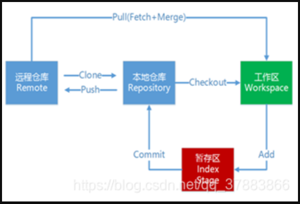
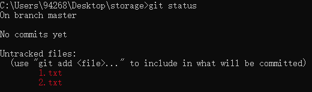
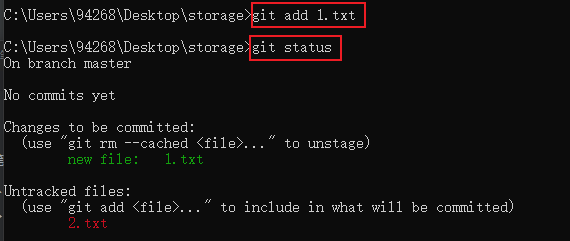
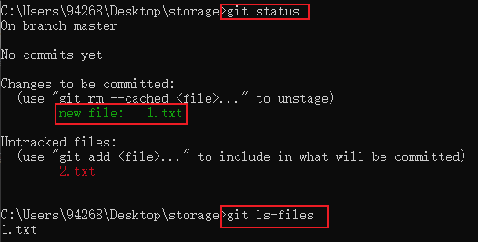
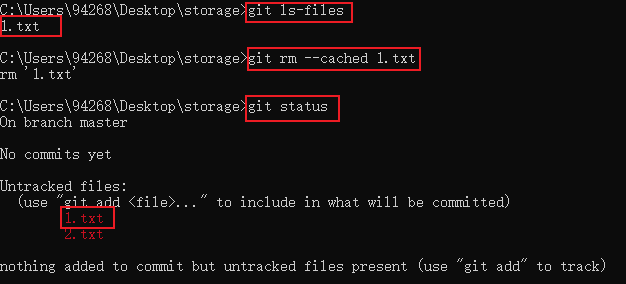
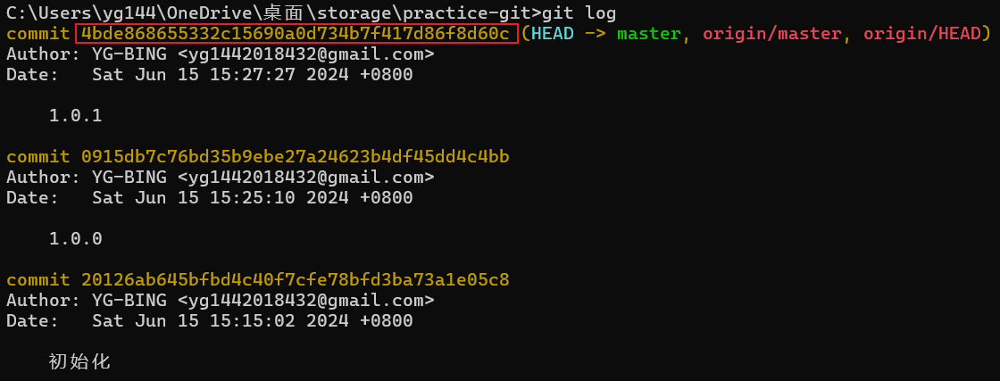
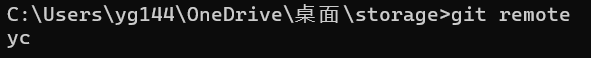
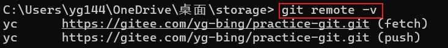
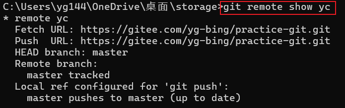

# Git 笔记

## 一、Git 简介

### 1、Git和Svn区别

- `Git`是`分布式`版本控制系统，每个终端都是一个仓库，拥有远程仓库的所有信息。因此并不时刻依赖远程仓库，即便没有网络的情况下也可以进行工作。
- `Svn`是`集中式`版本控制系统，所有的文件都放在远程仓库中集中管理，本地使用时需要先更新文件，所以没有网络的情况下无法工作。

### 2、Git使用流程图

| Git 流程图                                                   |
| ------------------------------------------------------------ |
|  |


## 二、Git 命令

### 1、本地操作

1. 查看用户名和邮箱

   ```cmd
   # 用户名
   git config user.name
   
   # 邮箱
   git config user.email
   ```

   

2. 修改用户名和邮箱

   ```cmd
   # 修改用户名
   git config --global user.name 自定义名称
   
   # 修改邮箱
   git config --global user.email 自定义邮箱
   ```

   <font color=pink>远程仓库的贡献度统计就是按照邮箱统计的。</font>

   <font color=pink>`--global`的作用：全局所有的仓库，包括新建的仓库都是公用用户名和邮箱的。</font>

   

3. 初始化本地仓库

   ```cmd
   git init
   ```

   | （1）初始化仓库后文件夹中就会出现一个`.git`文件夹<br />（2）删除该文件夹就相当于删除该本地仓库 |
   | ------------------------------------------------------------ |
   |  |

4. 查看本地状态

   ```cmd
   git status
   ```

   状态：

   - <font color=red>红色：未跟踪的文件</font>

     | 现根目录下`1.txt`和`2.txt`均未跟踪                           |
     | ------------------------------------------------------------ |
     |  |

   - <font color=green>绿色：已跟踪但未提交到本地仓库。如果已提交到本地仓库，那么`git status`将不会在查询出该文件。</font>

     | 现跟踪`1.txt`，不跟踪`2.txt`                                 |
     | ------------------------------------------------------------ |
     |  |

   

5. 添加文件至本地暂存区（跟踪文件）

   - 添加部分文件

     ```cmd
     git add 文件名一 文件名二 文件名三
     ```

   - 添加所有未跟踪的文件

     ```cmd
     git add .
     ```

   

6. 查询暂存区（跟踪）中的所有文件

   ```cmd
   git ls-files
   ```

   |  |
   | ------------------------------------------------------------ |

   

7. 撤销跟踪文件

   ```cmd
   git rm --cached 文件名一 文件名二 文件名三
   ```

   |  |
   | ------------------------------------------------------------ |

   

8. 提交文件至本地仓库

   - 提交指定文件到本地仓库

     ```cmd
     git commit -m "日志信息" 文件名一 文件名二 
     ```

   - 提交所有跟踪的文件

     ```cmd
     git commit -m "日志信息" .
     ```

   

9. 查看提交记录

   ```cmd
   git log
   ```

   | 每次提交都会生成一个全球唯一的ID，可作为版本回退的依据。     |
   | ------------------------------------------------------------ |
   |  |

   

10. 回退版本

    ```cmd
    git reset 版本号
    ```

    <font color=pink>此时直接push，会提示本地库的版本低于远程库，推送失败。此时需要强制推送。</font>

    ```cmd
    git push -f 远程仓库 远程仓库分支
    ```

    

11. 恢复或撤销对文件的更改

    - 针对工作区的文件

      - 回退单个文件

        ```cmd
        git restore 文件名
        ```

      - 回退所有文件

        ```cmd
        git restore .
        ```

    - 针对暂存区的文件

      ```cmd
      # 1、回退暂存区
      git reset head 文件名
      
      # 2、回退工作区
      git restore 文件名
      git restore .
      ```

    

12. 查询修改差异

    - 查看工作区和暂存区的差异

      ```cmd
      git diff 文件名
      ```

    - 查询工作区和本地库的差异

      ```cmd
      git diff --cached 文件名
      ```

    - 查询暂存区和本地库的差异

      ```cmd
      git diff head 文件名
      ```

    

### 2、分支操作

1. 查看分支

   - 查看本地分支

     ```cmd
     git branch
     ```

   - 查看远程分支

     ```cmd
     git branch -r
     ```

     

2. 创建分支

   <font color=pink>创建的新的分支相当于完全复制了一份主分支。</font>

   ```cmd
   git branch 分支名
   ```

   

3. 切换分支

   ```cmd
   git switch 分支名
   ```

   

4. 合并分支

   ```cmd
   # 将指定的分支和并到当前的分支
   git merge 指定的待合并的分支名
   ```

   

5. 删除分支

   - 删除本地分支

     ```cmd
     git branch -d 分支名
     ```

   - 删除远程分支

     ```cmd
     git push 远程仓库名 --delete 远程分支名
     ```

   

### 3、远程操作

<font color=red>以下操作为连接码云的指令。</font>

1. 查询远程仓库信息

   - 查询当前仓库的远程仓库名

     ```cmd
     git remote
     ```

     |  |
     | ------------------------------------------------------------ |

     

   - 查询当前仓库的远程仓库的路径信息

     ```cmd
     git remote -v
     ```

     | （1）yc 代表远程仓库的名字<br />（2）第一行 fetch 代表 更新代码的远程仓库地址<br />（3）第二行 push 代表 推送代码的远程仓库地址 |
     | ------------------------------------------------------------ |
     |  |

     

   - 查询远程仓库的详细信息

     ```cmd
     git remote show 远程仓库名
     ```

     |  |
     | ------------------------------------------------------------ |

   

2. 设置当前仓库的远程仓库地址

   ```cmd
   git remote add 远程仓库名 远程仓库地址
   
   # 例子（设置远程仓库的路径为https://gitee.com/yg-bing/practice-git.git，名字为yc）
   git remote add yc https://gitee.com/yg-bing/practice-git.git
   ```

   

3. 更新代码

   ```cmd
   git pull 远程仓库名 远程仓库分支名
   
   # 例子（拉取远程仓库yc中的master分支，合并到当前分支）
   git pull yc master
   ```

   

4. 推送代码

   ```cmd
   git push 远程仓库名 远程仓库分支名
   
   # 例子（推送到远程仓库yc中的master分支）
   git push yc master
   ```

5. 远程仓库改名

   <font color=pink>通过克隆的本地仓库默认远程仓库名：origin</font>

   ```cmd
   git remote rename 旧的远程仓库名 新的远程仓库名
   ```

   

## 三、Git 操作

### 1、获取远程代码

1. 无本地仓库

   ```cmd
   git clone 远程仓库地址
   ```

2. 有本地仓库

   ```cmd
   # 1、添加远程仓库
   git remote add 远程仓库名 远程仓库地址
   
   # 2、指定拉取远程仓库的指定分支
   git pull 远程仓库名 远程仓库分支名
   ```

   

### 2、
