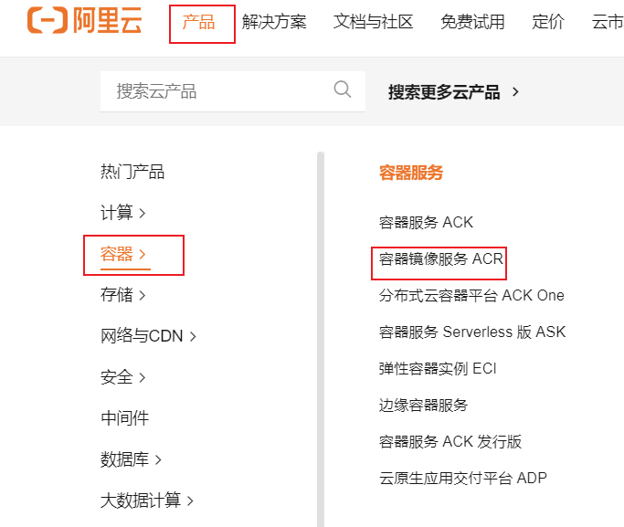
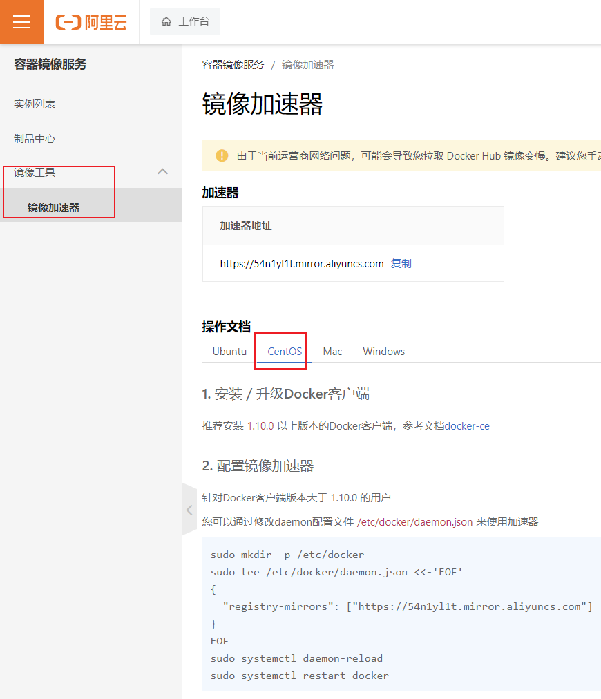

# Docker 安装 (Linux版)

<font color = 'red'>注意：以下安装要保证centos版本不能低于3.10</font>

## 一、Docker安装

| 步骤 | 解释               | 指令                    |
| ---- | ------------------ | ----------------------- |
| 1    | 安装docker         | yum install docker -y   |
| 2    | 启动docker         | systemctl start docker  |
| 3    | 查看docker运行状态 | systemctl status docker |
| 4    | 设置docker开启自启 | systemctl enable docker |

<hr></hr>

## 二、阿里云镜像加速

| 步骤 | 解释                                                         | 图片                                                         |
| ---- | ------------------------------------------------------------ | ------------------------------------------------------------ |
| 1    | 进入阿里云<br />找到"容器镜像服务ACR"<br />网址：https://www.aliyun.com/ |  |
| 2    | 进入管理控制台                                               |  |
| 3    | 找到镜像加速器                                               |  |
| 4    | 复制配置内容，粘贴到linux的命令行窗口执行                    | sudo mkdir -p /etc/docker sudo tee /etc/docker/daemon.json <<-'EOF' {  "registry-mirrors": ["https://54n1yl1t.mirror.aliyuncs.com"] } EOF sudo systemctl daemon-reload sudo systemctl restart docker |

## 三、Docker拉取报错

docker拉取时提示：missing signature key

解决方法：

```shell
[root@uri.wang ~]# yum remove docker \
                              docker-client \
                              docker-client-latest \
                              docker-common \
                              docker-latest \
                              docker-latest-logrotate \
                              docker-logrotate \
                              docker-engine
[root@uri.wang ~]# yum install -y yum-utils
[root@uri.wang ~]# yum-config-manager --add-repo https://download.docker.com/linux/centos/docker-ce.repo
[root@uri.wang ~]# yum install docker-ce docker-ce-cli containerd.io docker-buildx-plugin docker-compose-plugin
[root@uri.wang ~]# systemctl start docker
```

