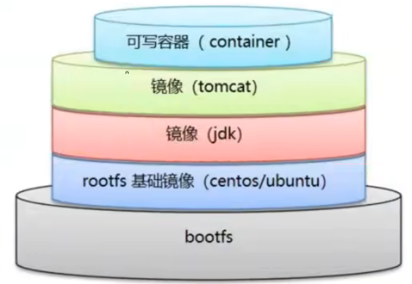

# Dockerfile命令

> 使用要求

1. 指令必须为大写字母，且每条指令后至少要跟一个参数

2. 指令从上到下顺序执行

3. 使用`#`来进行注释

4. **每条执行一条指令都会创建一个新的镜像层(类似使用`docker commit`对初始镜像进行增强获得一个新的镜像)，最后使用最终的镜像运行容器**

   


## 1、FROM

指定构建的基础镜像。。

**From指令必须是起始指令**

```dockerfile
# 设置初始镜像为java:8
FROM java:8 
```


## 2、MAINTAINER

指明镜像维护者的姓名和邮箱

```dockerfile
MAINTAINER 作者名<邮箱>

MAINTAINER yang<123@qq.com>
```


## 3、RUN

指定**镜像构建(`docker build`)**时需要执行的命令

```dockerfile
# 例如：centos镜像构建时，需要vim的话，那么就可以通过RUN执行安装vim的命令，从而使原来的centos镜像具有vim的功能
RUN yum -y install vim

RUN yum -y install net-tools
```


## 4、ADD

指定**镜像构建(`docker build`)**时需要往镜像中添加的文件，如果是压缩文件则会自动解压

```dockerfile
# 将当前目录下的a.jar添加到镜像中，最终在镜像中保存为b.jar
ADD a.jar b.jar
```


## 5、WORKDIR

指明进入容器后的工作目录（通过`docker exec` 指令进入容器时所在的目录就是工作目录，不同的容器进入之后可能会有不同的工作目录）

```shell
WORKDIR /usr/src/app
```


## 6、VOLUME

指定容器的挂载目录

```dockerfile
# 通过匿名挂载将容器里的 /tmp/le-boot 目录与宿主机 /var/lib/docker/volumes 下的随机生成卷的卷进行挂载
VOLUME /tmp/le-boot
```


## 7、EXPOSE

声明容器对外暴露的端口（仅文档用途，实际要 `-p` 才能映射）。

```dockerfile
#  暴露容器8080端口
EXPOSE 8080
```


## 8、CMD

指明**容器运行(`docker run`)**时需要执行的命令

- **作用**：为容器提供**默认的命令或参数**，用户可以在`docker run`后添加自己的命令或参数来覆盖默认的。
- **特点**：可以被 `docker run` 后面追加的命令 **完全覆盖**。在dockerfile文件中使用多个CMD则只有最后一个会生效。

### 示例 Dockerfile

```dockerfile
# 编写dockerfile
FROM busybox
CMD ["echo", "hello from CMD"]
```

### 构建并运行

```dockerfile
# 构建并运行
docker build -t cmd-test .
docker run cmd-test
```

👉 输出：`hello from CMD`

```shell
# docker run 追加指令运行
docker run cmd-test echo "override CMD"
```

👉 输出：`override CMD`
 （说明：运行时传的命令覆盖了 CMD 里的内容）


## 9、ENTRYPOINT

指明**容器运行(`docker run`)**时需要执行的命令  

- **作用**：定义容器启动时的**固定命令**。
- **特点**：`docker run` 追加的指令会作为 **参数传递给 ENTRYPOINT**，而不是替换掉。在dockerfile文件中使用多个ENTRYPOINT则只有最后一个会生效。

示例 Dockerfile

```dockerfile
# 编写dockerfile
FROM busybox
ENTRYPOINT ["echo", "hello from ENTRYPOINT"]
```

```dockerfile
# 构建并运行
docker build -t entrypoint-test .
docker run entrypoint-test
```

👉 输出：`hello from ENTRYPOINT`

```shell
# docker run 追加指令运行
docker run entrypoint-test world
```

👉 输出：`hello from ENTRYPOINT world`
 （说明：追加的 `world` 作为参数传递给 ENTRYPOINT）


## 10、COPY

指定镜像构建时要复制到镜像中的文件 

作用同`ADD`，但是不会自动解压压缩包


## 11、ENV

定义环境变量

```shell
# 定义一个名为MY_PATH 值为/usr/local 的环境变量
EVN MY_PATH /usr/local

# 通过`$环境变量名`来使用自定义的环境变量
WORKDIR $MY_PATH
```

