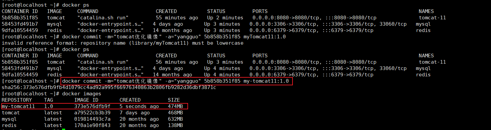
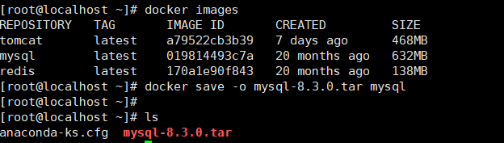
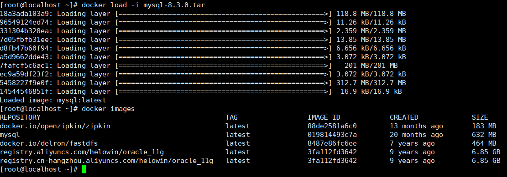
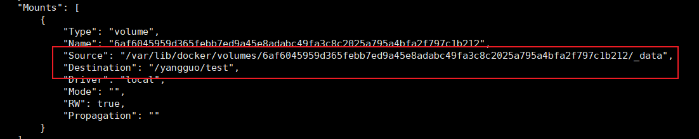
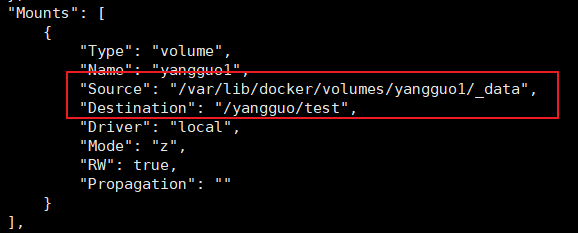
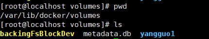

# Docker命令

参考：

[docker 从入门到实践]: https://yeasy.gitbook.io/docker_practice


## 一、镜像命令

### 1、搜索镜像

```shell
docker search 镜像名
```


### 2、拉取镜像

```shell
docker pull 镜像名:版本号
```


### 3、查看所有镜像

```shell
docker images
```


### 4、删除镜像

```shell
docker rmi 镜像名
```


### 5、提交镜像

将自己调试运行好的容器打包成新的镜像并安装到本地的镜像仓库中

```shell
docker commit -m="镜像描述信息" -a="作者名" 容器id 新镜像名:版本号
```

例如：

```shell
docker commit -m="tomcat优化镜像" -a="yangguo" 5b858b351f85 my-tomcat11:1.0
```

|  |
| ------------------------------------------------------------ |


### 6、查看镜像信息

```shell
docker inspect 镜像名/镜像id
```


### 7、导出镜像

```shell
docker save -o 导出镜像文件名 镜像名/镜像id
```

例子：

```shell
# 导出mysql镜像，导出到当前目录下的mysql-8.3.0.tar
docker save -o mysql-8.3.0.tar mysql
```

|  |
| ------------------------------------------------------------ |


### 8、安装镜像

```
docker load -i 镜像文件
```

例子：

```shell
# 安装mysql的镜像文件
docker load -i mysql-8.3.0.tar
```

|  |
| ------------------------------------------------------------ |


### 9、构建镜像

`-f`：file 指定dockerfile文件名

`-t`：target 指定生成的镜像名:镜像版本号

```shell
docker build -f dockerfile文件名 -t 生成的镜像名:镜像版本号 .
```


## 二、容器命令

### 1、运行容器

```shell
docker run 镜像名/镜像id
```

常用参数

1. `-d：后台运行容器

2. `--restart=always`：docker启动后自动重启

3. `-p 虚拟机端口:容器端口`：指定虚拟机和容器的端口映射

4. **`-v** 

   - **手动指定目录挂载：`-v 虚拟机目录:容器目录` 实现虚拟机目录和容器目录的挂载。如果需要挂载多个目录可以多次使用`-v`**

     

   - **匿名挂载：`-v 容器目录`  docker为自动在宿主机`/var/lib/docker/volumes`下生成随机名字的数据卷，与容器指定目录进行挂载**

     ```shell
     # 通过匿名挂载运行tomcat容器  -v /yangguo/test
     docker run -d -P --name tomcat -v /yangguo/test tomcat
     ```

     

     ```shell
     docker inspect tomcat
     ```

     ****

     **最终将宿主机的`/var/lib/docker/volumes/6af6045959d365febb7ed9a45e8adabc49fa3c8c2025a795a4bfa2f797c1b212/_data`目录与容器的`/yangguo/test`实现挂载。卷的随机名字为`6af6045959d365febb7ed9a45e8adabc49fa3c8c2025a795a4bfa2f797c1b212`**

     

   - **具名挂载：`-v 卷名:容器内目录`  docker为自动在宿主机`/var/lib/docker/volumes`下生成指定名称的数据卷，与容器指定目录进行挂载**

     ```shell
     # 通过具名挂载运行tomcat容器  -v yangguo1:/yangguo/test
     docker run -d -P --name tomcat -v yangguo1:/yangguo/test tomcat
     ```

     

     

   - 权限控制

     `-v 挂载路径:ro`或者`-v 挂载路径:rw`

     其中`ro`和`rw`分别为只读和读写权限。添加了这两个限制，那么容器对挂载目录就有了读写权限的限制，而外部的宿主机没有被限制。

     

5. `--name=容器名`：指定启动后的容器名

6. `-P`：不手动指定映射端口，随机映射端口

7. `--volumes-from 容器名/容器id`：运行容器的卷集成自指定的容器。也就是说多个容器公用一套目录挂载


### 2、启动容器

```shell
docker start 容器名/容器id
```


### 3、停止容器

```shell
docker stop 容器名/容器id
```


### 4、重启容器

```shell
docker restart 容器名/容器id
```


### 5、强制停止容器

```shell
docker kill 荣启名/容器id
```


### 6、删除容器

```shell
# 删除不在运行的容器
docker rm 容器名/容器id

# 删除不在运行或者正在运行的容器
docker rm -f 容器名/容器id
```


### 7、进入容器

```shell
docker exec -it 容器名/容器id /bin/bash
```


### 8、查看容器

```shell
# 查询运行的容器
docker ps

# 查询所有的容器
docker ps -a
```


### 9、更新容器配置

```shell
docker update 参数 容器名/容器id

# 例子
docker update --restar=always 容器名/容器id
```


### 10、查看容器日志

```shell
docker logs 容器名/容器id

# 实时动态查看日志。类似tail -f
docker logs -f 容器名/容器id

# 为每条日志添加时间戳
docker logs -f -t 容器名/容器id

# 查询容器末尾的n条日志
docker logs --tail n 容器名/容器id
```


### 11、复制容器文件至宿主机

```shell
docker cp 容器id:容器目录下的文件 宿主机目录
```


### 12、查看容器信息

```shell
docker inspect 容器名/容器id
```

注意：`Mounts`属性，其中包含容器的目录挂载信息




## 三、数据卷命令


数据卷`是一个可供一个或多个容器使用的特殊目录，它绕过 UnionFS，可以提供很多有用的特性：

- 数据卷`可以在容器之间共享和重用
- 对 数据卷`的修改会立马生效
- 对 数据卷`的更新，不会影响镜像
- 数据卷 默认会一直存在，即使容器被删除
- **一般来说docker的数据卷被存放至宿主机的`/var/lib/docker/volumes`目录下**

 

### 1、创建数据卷

```shell
docker volume create 卷名
```

```shell
# 创建名为yangguo1的数据卷
docker volume create yangguo1
```




### 2、查看数据卷信息

```shell
docker volume inspect 卷名
```


### 3、查看所有数据卷

```shell
docker volume ls
```


### 4、删除不被使用的数据卷

```shell
docker volume prune
```


### 5、删除数据卷

```shell
docker volume rm 卷名
```

