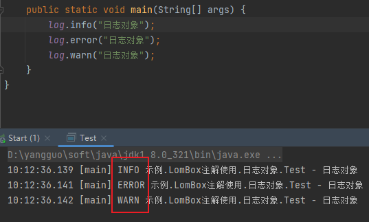

# LomBok  使用

## 1.LomBok依赖

```xml
<dependency>
      <groupId>org.projectlombok</groupId>
      <artifactId>lombok</artifactId>
      <version>1.18.24</version>
</dependency>
```

<hr></hr>

## 2.常用注解

### （1）var和val

```
#1.在Java中var和val相当于变量的类型，它会根据初始化的值判断一个变量具体的类型
	比方说
	var a = 10;			//此时认为a是int类型
	var b = "123"；		//此时认为b是字符串类型
	
#2.var和val声明的变量的类型只能确定一次。比方说var a = 10;就确定了a是一个整数类型，就不能再给它赋其他类型的数据了。变量类型的确定就只在变量初始化的时候确定一次。

#3.var和val在使用上没有任何区别。
推荐在idea中使用val。因为idea中有val的快捷方式。
值.val+回车；自动生成
```

### （2）getter和setter

```
#作用：自动为成员变量生成get和set方法

#使用：	
	1.类上：为类中所有成员变量添加get和set方法
	2.变量上：只为该变量生成get和set方法
	3.枚举类上：在枚举类上只能添加Getter，而不能添加Setter。如果想为枚举类中每个成员变量添加setter方法可以单独在每个成员变量上添加setter注解
```

### （3）Accessors

```
#1.参数fluent：默认为false，设定为true的话，则get和set方法没有get和set的前缀
	比方说：
	原先的getName()；变为了name()；方法
	原先的setName(String name);变为了name(String name);方法
	
#2.参数chain：默认是false，设定为true的话，则set之后返回的就不再是空，而是设置完属性的对象
```

### （4）AllArgsConstructor和NoArgsConstructor

```
#1.AllArgsConstructor：生成全参构造函数

#2.NoArgsConstructor：生成无参构造函数
```

### （5）ToString和EqualsAndHashCode

```
#1.ToString：重写toString方法

#2.EqualsAndHashCode：重写equals和hashCode方法
```

### （6）Data

```
#1.Data注解相当于整合了Setter，Getter，ToString，EqualsAndHashCode，NoArgsConstryctor注解

#2.Data通常和AllArgsConstructor，NoArgsConstructor配合使用
```

### （7）Slf4j

```
1、作用
	（1）Slf4j注解添加在类上
	（2）添加Slf4j注解的类中就会自动的获取一个属性名为log的成员变量。（注意：自动被添加的log成员变量无法被子类继承）
	（3）log就是日志对象
	（4）Slf4j注解相当于是替换
		import org.slf4j.Logger;
		import org.slf4j.LoggerFactory;
		private final Logger logger = LoggerFactory.getLogger(Test.class);
```

```
2、特点
	Slf4j虽然提供日志的功能，但是它本身不具有日志的功能，具体使用什么日志是要看你引入了什么日志的jar。使用Slf4j注解就是说让Slf4j来决定用什么日志。这样做的好处就是你只需要修改一下pom文件换一下依赖，而不需要更改java代码就可以自动的切换日志框架。而如果你直接使用具体日志框架的注解或者代码，那么当你在切换日志框架的时候就需要改大量的代码(只要用到日志的地方都要修改)
```

```
3、常用方法
	（1）log.info();
	（2）log.warn();
	（3）log.error();
	
特殊：
	log.info("日志对象{}{}{}",1,2,3); => 结果为：日志对象123
	//日志信息中使用{}代表的位置，可以被动态的填入信息。信息来自后面的一个可变长参数，按顺序填入信息
```

|  |
| ------------------------------------------------------------ |

### （8）Builder

```java
@ToString
@Builder
public class Student4 {
    private String sname;
    private int sage;
}

class Test {
    public static void main(String[] args) {
        Student4 student4 = Student4.builder()
                .sname("张三")
                .sage(11)
                .build();
        System.out.println(student4);
    }
}
```

