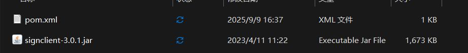

# Maven问题


## 1、安装Jar到本地仓库报NullPointerException

解决方法：

1. 建立一个新的文件夹，将jar文件存放在该文件夹下。 

   |  |
   | ------------------------------------------------------------ |

2. 在该文件夹下建立一个pom.xml文件，在pom文件中定义其maven坐标。

   ```xml
   <?xml version="1.0" encoding="UTF-8"?>
   <project xmlns="http://maven.apache.org/POM/4.0.0"
            xmlns:xsi="http://www.w3.org/2001/XMLSchema-instance"
            xsi:schemaLocation="http://maven.apache.org/POM/4.0.0 http://maven.apache.org/xsd/maven-4.0.0.xsd">
   		 
   	<modelVersion>4.0.0</modelVersion>
   
   	<groupId>yozo</groupId>
       <artifactId>signclient</artifactId>
       <version>3.0.1</version>
   
   </project>
   ```

3. 安装指令

   ```shell
   
   mvn install:install-file -Dfile=signclient-3.0.1.jar -DgroupId=yozo -DartifactId=signclient -Dversion=3.0.1 -Dpackaging=jar
   
   ```

   

## 2、


