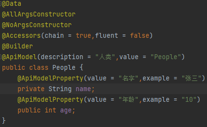

# Swagger 笔记

## 一、依赖

```
<!--swagger-->
<dependency>
    <groupId>io.springfox</groupId>
    <artifactId>springfox-swagger2</artifactId>
    <version>2.9.2</version>
</dependency>

<!--swagger-ui-->
<dependency>
    <groupId>io.springfox</groupId>
    <artifactId>springfox-swagger-ui</artifactId>
    <version>2.9.2</version>
</dependency>
```


## 二、配置类

<font color=red>具体配置类：./config/Swagger2Config.java</font>

```
@Configuration
@EnableSwagger2
public class Swagger2Config {

    /**
     * 组1（组可以配置多个）
     * */
    @Bean
    public Docket coreApiConfig(){
        return new Docket(DocumentationType.SWAGGER_2)
                //swagger开启与否（注意控制组开启与否，只针对当前组，默认都是开启的）
                .enable(true)
                //API文档的基本信息
                .apiInfo(adminApiInfo())
                //组名
                .groupName("组1")
                //扫描信息
                .select()
                //匹配生成文档的包路径
                .apis(RequestHandlerSelectors.basePackage("tool.swagger"))
                //匹配请求url路径
                .paths(PathSelectors.ant("/swagger1/*"))
                .build();
    }

    /**
     * 组2
     * */
    @Bean
    public Docket coreApiConfig2(){
        return new Docket(DocumentationType.SWAGGER_2)
                //swagger开启与否（注意控制开启与否只针对当前组，默认都是开启的）
                .enable(true)
                //API文档的基本信息
                .apiInfo(adminApiInfo())
                //组名
                .groupName("组2")
                //扫描信息
                .select()
                //匹配生成文档的包路径
                .apis(RequestHandlerSelectors.basePackage("tool.swagger"))
                //匹配请求url路径
                .paths(PathSelectors.ant("/swagger2/*"))
                .build();
    }

    /**
     * API文档的基本信息
     * */
    private ApiInfo adminApiInfo(){
        return new ApiInfoBuilder()
                //标题
                .title("Swagger学习-API")
                //描述
                .description("接口文档信息")
                //版本
                .version("1.0")
                //作者信息
                .contact(new Contact("测试","https://baidu.com","1442018432@qq.com"))
                //许可证
                .license("Apache 2.0")
                //许可证地址
                .licenseUrl("https://www.apache.org/licenses/LICENSE-2.0")
                .build();
    }
}
```


## 三、启动

```
（1）启动swagger，首先需要启动springboot
（2）浏览器输入：http://localhost:8088/swagger-ui.html （ip:端口，因人而异）
```

|  |
| ------------------------------------------------------------ |

## 四、注解

### 1、实体类

<font color=red>注意：只有出现在接口的返回值中的实体类才会被扫描到Swagger中</font>

```
（1）@ApiModel

	1、位置：
	实体类上

	2、属性：
	a、description：实体类描述
	b、value：在swagger中展示的实体类的名字
```

```
（2）@ApiModelProperty

	1、位置：
	实体类中的属性上

	2、属性：
	a、value：变量描述
	b、example：变量值举例
```

### 2、接口类

```
（1）@Api
	
	1、位置：
	controller类上
	
	2、属性：
	a、tags：描述
```

```
（2）@ApiOperation
	
	1、位置：
	接口方法上
	
	2、属性：
	a、value：描述
```

```
（3）@ApiImplicitParams

	1、位置：
	接口方法上
	
	2、属性：
	a、@ApiImplicitParam数组
	
	3、使用：
@ApiImplicitParams({
   @ApiImplicitParam(name = "str1",dataType = "String",value = "参数1",defaultValue = "123",required = true),
   @ApiImplicitParam(name = "str2",dataType = "String",value = "参数2",defaultValue = "456",required = true)
})
```

```
（4）@ApiImplicitParam

	1、位置：
	接口方法上
	
	2、属性：
	a、name：变量名
	b、dataType：变量类型
	c、value：变量描述
	d、defaultValue：默认值（在使用swagger做接口测试的时候，如果不手动指定就会自动使用默认值）
	e、required：是否必传
```

```
（5）@ApiParam

	1、位置：
	接口方法参数上（一般使用ApiImplicitParam替代，不常用）
```

```
（6）@ApiResponses

	1、位置：接口方法上
	
	2、属性：
	a、@@ApiResponse数组
```

```
（7）@ApiResponse

	1、位置：
	接口方法上
	
	2、属性：
	a、code：响应状态码（int类型）
	b、message：状态描述
```

```
（8）@ApiIgnore

	1、位置：
	接口方法上（添加该注解的接口方法不会出现在最终生成的api文档中）
```

### 3、使用

| 类型   | 图片                                                         |
| ------ | ------------------------------------------------------------ |
| 实体类 |  |
| 接口类 |  |

