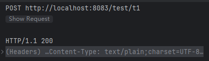
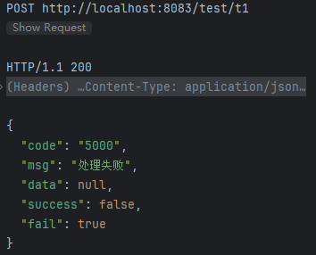
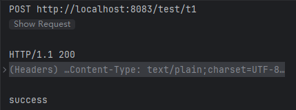

# Validation 笔记


## 一、依赖

```xml
<!-- spring中引入，以下两个依赖二选一 -->
<dependency>
    <groupId>javax.validation</groupId>
    <artifactId>validation-api</artifactId>
    <version>2.0.1.Final</version>
</dependency>

<dependency>
     <groupId>org.hibernate.validator</groupId>
     <artifactId>hibernate-validator</artifactId>
     <version>6.0.17.Final</version>
 </dependency>
```

```xml
<!-- SpringBoot中引入 -->
<dependency>
    <groupId>org.springframework.boot</groupId>
    <artifactId>spring-boot-starter-validation</artifactId>
</dependency>
```


## 二、内置注解

### 1、开启验证

#### 1.1`@Valid`

<font color=pink>提供基本的属性校验以及对象的<u>**嵌套验证**</u>，即验证一个对象中的对象的属性。</font>

##### 1.1.1 嵌套校验使用

- 控制层使用`@Valid`或者`Validated`校验请求参数
- 需要嵌套校验的属性添加`@Valid`
- 注意：如果嵌套校验的属性是 **null** 则不会触发校验。详见下方测试结果。

**示例**

```java
// 实体类1
@Data
@AllArgsConstructor
@NoArgsConstructor
public class T1 {
    @NotNull(message = "name不能为空")
    private String name;
    // 嵌套校验的属性添加`@Valid`
    @Valid
    private T2 t2;
}
```

```java
// 实体类2
@Data
@AllArgsConstructor
@NoArgsConstructor
public class T2 {
    @NotNull(message = "name2不能为空")
    private String name2;
}
```

```java
// 控制层
@Controller
@Slf4j
@RequestMapping("/test")
public class TestController {
    @PostMapping("/t1")
    @ResponseBody
    public String t1(@Validated @RequestBody T1 s) {
        log.info("请求成功:{}",s);
        return "success";
    }
}
```


**测试**

- 正确测试

  ```http
  POST http://localhost:8083/test/t1
  Content-Type: application/json
  
  {
    "name": "1",
    "t2": {
      "name2": "2"
    }
  }
  ```

  |  |
  | ------------------------------------------------------------ |

- 错误测试

  ```http
  POST http://localhost:8083/test/t1
  Content-Type: application/json
  
  {
    "name": "1",
    "t2": {
      
    }
  }
  ```

  |  |
  | ------------------------------------------------------------ |

- <font color=pink>注意：如果需要嵌套测试的对象成员为null，则不会触发测试</font>

  ```http
  POST http://localhost:8083/test/t1
  Content-Type: application/json
  
  {
    "name": "1"
  }
  ```

  此时没有传`t2`，也就是最终`t2=null`

  |  |
  | ------------------------------------------------------------ |


##### 1.1.2 作用位置

- 请求参数：用于对参数进行基本的校验

  ```java
  @PostMapping("/submit")
  public ResponseEntity<String> submit(@Valid @RequestBody Parent parent) {
  }
  ```

- 成员属性：用于对成员属性进行嵌套校验

  ```java
  public class Parent {
      @Valid
      private Child child;
  }
  
  public class Child {
      @NotNull
      private String name;
  }
  ```

- 方法：用于对方法返回值进行校验

  ```java
  @Valid
  public Parent getParent() {
      return new Parent();
  }
  ```


#### 1.2`@Validated`

<font color=pink>提供基本的属性校验以及**<u>分组检验</u>**。</font>

<font color=red>注意：使用`this`调用的方法中校验不会生效，因为校验是通过 **AOP** 来实现的，需要使用代理对象调用方法。</font>

##### 1.2.1 分组校验使用

分组校验详见 <a href='#四、分组验证'>四、分组验证（点击跳转）</a>


##### 1.2.2 作用位置

- 类：对类中所有 **public** 的方法的参数进行校验
- 方法：对方法的返回值进行校验
- 请求参数：对方法参数进行校验


#### 1.3 `@Valid`和`@Validated`区别

| 特性             | `@Valid`                                  | `@Validated`                                                 |
| ---------------- | ----------------------------------------- | ------------------------------------------------------------ |
| **来源**         | Java Bean Validation (`javax.validation`) | Spring Framework (`org.springframework.validation.annotation`) |
| **分组验证支持** | ❌ 不支持分组验证                          | ✅ 支持分组验证                                               |
| **主要用途**     | 基本对象及嵌套对象的验证                  | 基本验证 + 分组验证                                          |
| **注解使用位置** | 常用于方法参数、字段、方法返回值等        | 常用于方法参数、类级别等                                     |
| **框架依赖**     | 标准Java EE框架独立使用                   | 依赖于Spring Framework                                       |

1. **分组验证（Group Validation）**：
   - **`@Valid`**：不支持分组验证，只能执行默认的验证。
   - **`@Validated`**：支持分组验证，允许根据不同的业务场景定义和应用不同的验证组。

2. **适用范围**：
   - **`@Valid`**：适用于任何遵循Java Bean Validation规范的环境，不依赖于Spring。
   - **`@Validated`**：专为Spring设计，集成在Spring的验证机制中，提供更强大的功能。

   

### 2、非空验证

#### （1）@NotBlank

```
作用：
	限制请求的字符串不能为null并且长度不能为0
参数：
	a、message：验证不通过返回的信息
```

#### （2）@NotEmpty

```
作用：
	限制集合的元素个数不能为0
参数：
	a、message：验证不通过返回的信息
```

#### （3）@NotNull

```
作用：
	限制请求参数不能为bull
```

#### （4）@Null

```
作用：
	限制请求参数必须为null
```

### 3、数值验证

#### （1）@Max

```
作用：
	限制请求参数的最大值不能超过设定值
参数：
	a、value：最大值
	b、message：验证不通过返回的信息
```

#### （2）@Min

```
作用：
	限制请求参数的最小值不能小于设定值
参数：
	a、value：最小值
	b、message：验证不通过返回的信息
```

#### （3）@Positive

```
作用：
	限制请求参数为正数
参数：
	a、message：验证不通过返回的信息
```

#### （4）@Negative

```
作用：
	限制请求参数为负数
参数：
	a、message：验证不通过返回的信息
```

#### （5）@PositiveOrZero

```
作用：
	限制请求参数不为负数
参数：
	a、message：验证不通过返回的信息
```

#### （6）@NegativeOrZero

```
作用：
	限制请求参数不为正
参数：
	a、message：验证不通过返回的信息
```

#### 4、长度验证

#### （1）@Size

```
作用：
	限制请求参数的长度
参数：
	a、max：最大长度
	b、min：最小长度
	c、message：验证不通过返回的信息
```

#### 5、其他验证

#### （1）@Pattern

```
作用：
	验证请求参数的是否满足指定的样式
参数：
	a、regexp：正则表达式
	b、message：验证不通过返回的信息
	
注意：该注解只能用于验证字符串参数
```


## 三、自定义注解

以自定义手机号校验为例：

- 创建注解

  **注意**

  - **`message`**、**`groups`** 和 **`payload`** 是 Java Bean Validation 规范的标准属性，不能缺少也不能重命名。
  - `@Constraint`注解用于指定自定义校验注解的处理逻辑

  

  ```java
  @Retention(RetentionPolicy.RUNTIME)
  @Documented
  @Target({ElementType.METHOD, ElementType.TYPE, ElementType.PARAMETER, ElementType.FIELD})
  @Constraint(validatedBy = PhonePartternValidator.class)
  public @interface PhoneParttern {
      String message() default "手机号格式错误";
  
      Class<?>[] groups() default {};
  
      Class<?>[] payload() default {};
  }
  ```

  

- 创建验证类

  **注意**

  - 验证类需要实现`ConstraintValidator`接口，`ConstraintValidator`接口的泛型为**验证类关联的自定义注解**和**自定义注解所添加到的对象类型**。针对 **自定义注解所添加到的对象类型** 指的就是校验注解添加的对象，如果添加到类上那么指代的就是整个类的对象，如果添加到类中某个成员变量上那么仅仅指代的就是这个成员变量的值。
  - `initialize`方法用于初始化，其入参就是校验注解对象，可以通过该对象获取校验注解的参数值。
  - `isValid`方法的返回值决定校验是否通过：**false**则不通过，**true**则通过。方法的第一个参数就是待校验的值。

  

  ```java
  @Slf4j
  public class PhonePartternValidator implements ConstraintValidator<PhoneParttern, String> {
  
      private PhoneParttern phoneParttern;
  
      @Override
      public void initialize(PhoneParttern constraintAnnotation) {
          phoneParttern = constraintAnnotation;
      }
  
      @Override
      public boolean isValid(String o, ConstraintValidatorContext constraintValidatorContext) {
          return ReUtil.isMatch(RegexEnum.PHONE, o);
      }
  }
  ```

  

- 补充：<font color=red>自定义校验注解如果添加到类上，那么往往用于对类中的多个成员的组合值进行校验。</font>


## 四、分组验证

<font color=red>前提：只有`@Validated`支持分组验证</font>

<font color=red>注意：只要为变量添加了分组，如果不在validated中添加分组信息，则验证失效</font>

### 1、分组验证

- 定义分组接口

  ```java
  // 分组A
  public interface GroupA {
  }
  ```

  ```java
  // 分组B
  public interface GroupB {
  }
  ```

- 添加校验分组

  ```java
  // 待校验请求参数
  @Data
  @AllArgsConstructor
  @NoArgsConstructor
  public class T1 {
      // n1参数只有在开启了GroupA分组校验的时候才会生效
      @NotNull(message = "n1不能为空",groups = {GroupA.class})
      private String n1;
      
      // n2参数只有在开启了GroupB分组校验的时候才会生效
      @NotNull(message = "n2不能为空",groups = {GroupB.class})
      private String n2;
  }
  ```

- 开启分组校验

  ```java
  @Controller
  @Slf4j
  @RequestMapping("/test")
  public class TestController {
      @GetMapping("/t1")
      @ResponseBody
      // @Validated({GroupB.class})：仅仅开启了GroupB的分组校验
      // @Validated({GroupA.class})：仅仅开启了GroupA的分组校验
      // @Validated({GroupA.class, GroupB.class})：开启了GroupA和GroupB的分组校验
      public String t1(@Validated({GroupB.class}) T1 t1) {
          log.info("t1: {}", JSONUtil.toJsonStr(t1));
          return "success";
      }
  }
  ```

  <font color=pink>注意：`@Validated({GroupA.class, GroupB.class})`仅仅开启了A和B组的校验，不决定校验的顺序，并且即便有其中一组校验失败了另一组的校验仍然会进行。</font>


### 2、分组验证顺序

<font color=pink>分组校验主要用于对同一个参数进行多种校验并且需要满足一定校验顺序的场景。</font>

- 定义分组校验顺序

  ```java
  @GroupSequence({GroupA.class, GroupB.class})
  public interface ValidSequence {
  }
  ```

- 开启校验

  ```java
  @Controller
  @Slf4j
  @RequestMapping("/test")
  public class TestController {
      @GetMapping("/t1")
      @ResponseBody
      // 使用ValidSequence进行顺序校验
      public String t1(@Validated({ValidSequence.class}) T1 t1) {
          log.info("t1: {}", JSONUtil.toJsonStr(t1));
          return "success";
      }
  }
  ```


## 五、校验异常全局处理

- 响应封装类

  ```java
  @Data
  @AllArgsConstructor
  @NoArgsConstructor
  @Builder
  @Accessors(chain = true)
  public class BaseResp<E> {
      private String code;
      private String msg;
      private E data;
  
      /**
       * 创建默认成功响应
       */
      public static BaseResp<Object> success() {
          return BaseResp.builder()
                  .code(ResponseStatusEnum.SUCCESS.getCode())
                  .msg(ResponseStatusEnum.SUCCESS.getMsg())
                  .data(null)
                  .build();
      }
  
      /**
       * 创建自定义成功响应
       */
      public static <T> BaseResp<T> success(T t) {
          return BaseResp.<T>builder()
                  .code(ResponseStatusEnum.SUCCESS.getCode())
                  .msg(ResponseStatusEnum.SUCCESS.getMsg())
                  .data(t)
                  .build();
      }
  
      /**
       * 创建自定义成功响应
       */
      public static <T> BaseResp<T> success(String msg, T t) {
          return BaseResp.<T>builder()
                  .code(ResponseStatusEnum.SUCCESS.getCode())
                  .msg(msg)
                  .data(t)
                  .build();
      }
  
      /**
       * 创建默认失败响应
       */
      public static BaseResp<Object> fail() {
          return BaseResp.builder()
                  .code(ResponseStatusEnum.FAIL.getCode())
                  .msg(ResponseStatusEnum.FAIL.getMsg())
                  .data(null)
                  .build();
      }
  
      /**
       * 创建自定义失败响应
       */
      public static <T> BaseResp<T> fail(String msg) {
          return BaseResp.<T>builder()
                  .code(ResponseStatusEnum.FAIL.getCode())
                  .msg(msg)
                  .data(null)
                  .build();
      }
  
      /**
       * 判断请求是否成功
       */
      public boolean isSuccess() {
          return ResponseStatusEnum.SUCCESS.getCode().equals(code);
      }
  
      /**
       * 判断请求是否失败
       */
      public boolean isFail() {
          return !isSuccess();
      }
  }
  ```

- 全局异常处理

  ```java
  /**
   * 全局异常处理
   */
  @RestControllerAdvice
  @Slf4j
  public class GlobalExceptionHandler {
  
      /**
       * 通用异常处理
       */
      @ExceptionHandler({Exception.class})
      public BaseResp<Void> handleException(Exception e, HttpServletResponse response) {
          log.error("【通用异常处理】:{}", e.getMessage());
          return BaseResp.fail(ResponseStatusEnum.FAIL.getMsg());
      }
  
      /**
       * Validation 异常处理
       */
      @ResponseStatus(value = HttpStatus.BAD_REQUEST)
      @ExceptionHandler(value = {BindException.class, ValidationException.class, MethodArgumentNotValidException.class})
      public BaseResp<Void> handleValidatedException(Exception e) {
          BaseResp<Void> result = new BaseResp<>();
          String errorMessages = "";
          if (e instanceof MethodArgumentNotValidException ex) {
              errorMessages = CollectionUtil.getFirst(ex.getBindingResult().getAllErrors()).getDefaultMessage();
          } else if (e instanceof ConstraintViolationException ex) {
              errorMessages = CollectionUtil.getFirst(ex.getConstraintViolations()).getMessage();
  
          } else if (e instanceof BindException ex) {
              errorMessages = CollectionUtil.getFirst(ex.getBindingResult().getAllErrors()).getDefaultMessage();
          }
          log.error("【参数校验异常处理】:{}", errorMessages);
          result = BaseResp.fail(StrUtil.isBlank(errorMessages) ? "参数有误" : errorMessages);
          return result;
      }
  }
  ```

